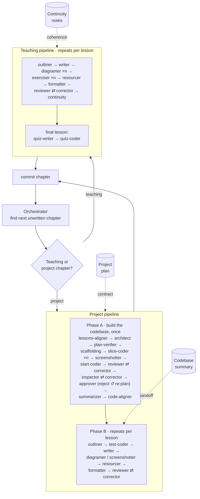

# The Modern SaaS Stack — a course I built for myself, with AI

A full-depth course on building a production SaaS with the minimum-viable 2026 stack — **designed for me, by me, with the help of AI**. Not a course I'm taking. A course I'm *authoring*, where the authoring itself is the experiment.

> **Status: work in progress.** 16 of a planned 108 chapters are published. Built over ~3.5 weeks and ~550 commits so far (first commit 2026-05-08). Not yet deployed publicly.

---

## What this is

I'm a developer coming back to web from another field, and I couldn't find a course pitched at the right altitude: everything for beginners assumes you've never written a function, and everything for experts assumes you already know the modern stack cold. So I built the one I wanted — senior-depth, decisions-before-syntax, and covering **every layer a production SaaS actually ships**: TypeScript, React 19, Next.js 16 (App Router, Server Components, PPR), Postgres + Drizzle, Better Auth, Stripe billing, transactional email, background jobs, file uploads, caching, rate limiting, i18n, testing, observability, CI/CD with zero-downtime migrations, and AI features over your own data.

The learner-facing overview lives on the site's landing page — see [`src/content/docs/index.mdx`](src/content/docs/index.mdx). This README is about the part underneath: **how the course builds itself.**

## Three experiments

I treated this less like writing a course and more like running three bets at once.

### 1. Knowledge extraction

The hard problem in 2026 isn't finding information — it's deciding what *not* to teach. The course is an exercise in compression: distilling the sprawl of web development down to the **minimum viable stack a real SaaS would ship today**, and to the *judgment* behind it — the decisions and trade-offs, not the keystrokes. The curriculum was derived top-down: pick the tech → define the audience and goals → draft the structure → break it into chapters, then lessons. Every paragraph and every code sample has to survive two filters: *does a 2026 SaaS dev actually use this, and does it teach the decision rather than just the syntax?*

### 2. Personalized education

This course has an audience of one, and that's the point. It's tuned to exactly where I am: adult tone, no bootcamp scaffolding, no "what is a variable," skip-ahead self-checks when I already know something. It's also tuned to *how I learn* — instead of static prose it leans on a library of interactive components: in-browser code editors that run and grade my code, predict-the-output drills, PR-style code reviews, hover-to-define terms, and explorable diagrams. The bet: a course built for one learner, with the right interactive surface, beats a generic course built for everyone.

### 3. Agentic engineering

The course **authors itself.** I designed the system; a fleet of AI agents produces the content. My job was to be the architect — define the pipeline, the contracts, and the coherence mechanisms — not to write 108 chapters by hand. The rest of this README documents that system, because it's the part I'm proudest of.

## How I built it

The method, in order — and the git history backs up that this is really how it went:

1. **Decide the tech.** Lock the minimum-viable 2026 stack as the north star.
2. **Define the audience and goals.** Who it's for, what "done" means.
3. **Draft a high-level structure** — 22 units.
4. **Break it down** — 108 chapters, then individual lessons.
5. **Build the component library** — the interactive teaching primitives, first.
6. **Define a canonical lesson structure** — so every lesson has the same skeleton.
7. **Decompose authoring into specialized subagents** and add coherence mechanisms so the agents don't drift.
8. **Write an orchestrator** that runs the right pipeline per chapter, **sequentially**, one chapter after the next, to keep the whole course internally consistent.

That commit order is visible in the history: `Initial AGENTS and SPEC` → a burst of component work → the authoring subagents → the project pipeline → then chapters landing one per commit (`Chapter 015 — Fetch and live streams`).

**The lesson that shaped the architecture.** Early on I tried running authoring agents *in parallel* to go faster. They collided — the git log from 2026-05-14 is a string of commits like `Remove stray Chapter X outline created by Y subagent` and `Restore outline files reverted by parallel agent`. Two agents writing the course at once couldn't keep it coherent. That failure is exactly why the orchestrator now runs **strictly sequentially, one chapter at a time**: in a course, internal coherence beats throughput every time.

## The authoring pipeline

An [orchestrator](documentation/chapter%20orchestrator%20prompts/Orchestrator.md) finds the next unwritten chapter, classifies it as a **teaching chapter** or a **project chapter** (project chapters are a fixed, known set of IDs), routes it to the matching pipeline, builds the chapter end-to-end with no parallelism, commits, and moves on. The work is carried out by **32 specialized subagents** living in [`.claude/agents/`](.claude/agents) — each with a single, sharp responsibility.



### Teaching-chapter pipeline

Concept lessons — prose, diagrams, exercises, and live coding. For each lesson, in order:

| Step | Agent | Does |
| --- | --- | --- |
| 1 | `lesson-outliner` | Plans the pedagogy, sections, diagrams, and scope. |
| 2 | `lesson-writer` | Writes the MDX prose with placeholders for interactive parts. |
| 3 | `lesson-diagramer` (×n) | Replaces each diagram placeholder with a rendered diagram. |
| 4 | `lesson-exerciser` (×n) | Replaces each exercise placeholder with a graded component or sandbox. |
| 5 | `lesson-resourcer` | Adds vetted YouTube embeds and external-resource cards. |
| 6 | `lesson-formatter` | Wires up component imports, tooltips, and code highlighting. |
| 7 | `lesson-reviewer` | Audits pedagogy, facts, and cross-lesson coherence (reports only). |
| 8 | `lesson-corrector` | Fixes the reviewer's findings surgically. |
| 9 | `lesson-continuity` | Records what this lesson taught/cut/promised for later lessons. |

The chapter's final lesson is a quiz: `quiz-writer` extracts understanding-level questions from every lesson, then `quiz-coder` turns them into an interactive quiz.

### Project-chapter pipeline

Hands-on chapters where I build a real feature in a working codebase. Two phases.

**Phase A — build the reference codebase (once):**
`project-chapter-outline-lessons-aligner` → `project-architect` (writes the plan that serves as the coding contract) → `project-plan-verifier` (compile-tests the plan's load-bearing choices) → `project-scaffolding-coder` → `project-slice-coder` (×n, one feature slice at a time) → `project-screenshotter` → `project-start-coder` (derives the starter with `TODO` stubs) → `project-reviewer` ⇄ `project-corrector` → `project-inspector` ⇄ `project-corrector` → `project-approver` (rejection triggers a full re-plan loop) → `project-summarizer` → `project-chapter-outline-code-aligner`.

**Phase B — write the lessons (per lesson):**
`project-lesson-outliner` → `project-lesson-test-coder` (for build-it-yourself lessons, writes the automated tests the student codes against) → `project-lesson-writer` → `lesson-diagramer` / `project-lesson-screenshotter` → `project-lesson-resourcer` → `project-lesson-formatter` → `project-lesson-reviewer` ⇄ `project-lesson-corrector`.

### Coherence mechanisms

This is what makes it *engineered* rather than *prompted* — the machinery that keeps 108 chapters from contradicting each other:

- **Continuity notes** — a living per-chapter ledger of what was taught, cut, promised, and what terminology was fixed. Written by `lesson-continuity`, read by every future outliner and reviewer.
- **Two outline aligners** — one reconciles a project chapter's outline with what the *preceding lessons actually taught*; the other realigns the outline with the *code that actually got built*. They close the gap between intent and reality on both sides.
- **Reviewer ⇄ corrector gates** — nothing advances until an independent reviewer signs off and a corrector resolves the findings.
- **Plan-as-contract** — the architect's plan defines stable selectors, locked decisions, and *falsifiable* rendered checks the built app must pass.
- **Per-lesson test files** — build-it-yourself lessons ship with real tests, so a lesson's promises are mechanically verified against the student's code.

## The interactive stack

The site is an [Astro](https://astro.build) **6** + [Starlight](https://starlight.astro.build) **0.39** documentation app. Lessons are MDX, file-system-routed: every `NNN Chapter name` folder under `src/content/docs/` becomes a sidebar group (the numeric prefix is stripped in the UI). Interactivity ships as [React](https://react.dev) **19** islands.

The teaching power comes from a custom library of **30+ pre-built components** (catalogued in [`documentation/components/INDEX.md`](documentation/components/INDEX.md)):

- **In-browser code runtimes** — CodeMirror 6 + `esbuild-wasm`, with [PGlite](https://pglite.dev) (Postgres compiled to WASM) so SQL and Drizzle exercises run a real database in the browser. Variants cover SQL, Drizzle, React, Zod, and type-only TypeScript exercises, each auto-graded.
- **Sandboxes & embeds** — StackBlitz, CodeSandbox, and in-page Sandpack for live, editable projects.
- **Diagrams** — Mermaid and D2, both rendered at build time and themed for light/dark.
- **Drills & figures** — predict-the-output, PR-style code review, matching, classification, scrubbable request traces, state-machine walkers, and more.
- **Code display** — [Expressive Code](https://expressive-code.com) with stepped, annotated walkthroughs and hover-to-define terms.

Open-ended answers and code reviews are graded by a locally-run LLM, so feedback works without a backend.

## Repository layout

```
src/
  content/docs/      the lessons (MDX), one folder per chapter
  components/        the interactive component library (figures, exercises, live-coding, embeds…)
documentation/       the "authoring brain"
  chapter orchestrator prompts/   the orchestrator + the two pipeline definitions
  content/                        unit/chapter/lesson outlines + continuity notes
  pedagogical approach/           the teaching guidelines every agent follows
  code standards/                 canonical code conventions for projects and samples
  components/ · diagrams/         component API and diagram-engine indices
.claude/agents/      the 32 authoring subagents (lesson/ and project/)
projects/            per-chapter project codebases (start/ + solution/)
```

## Run it locally

Requires Node 24+. The dev server wraps `astro dev` with a watcher that restarts on lesson add/delete (Astro's content loader doesn't reconcile those over HMR).

```bash
npm install
npm run dev      # http://localhost:4321
npm run build    # static production build
npm run preview  # preview the production build
```

## A note on honesty

The lesson content is **AI-generated with human curation** — written by Claude Opus (4.7 and 4.8), reviewed and steered by me. I'm not hiding that; it's the whole experiment. The interesting question this course tries to answer isn't "can AI write a tutorial," it's "can a well-designed agentic pipeline, with the right contracts and coherence mechanisms, produce a *coherent, senior-grade course* at a scale one person couldn't write alone." This repo is my attempt to find out.

---

*Built by Terenci Claramunt. A personal project — work in progress.*
