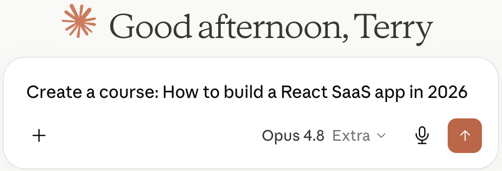
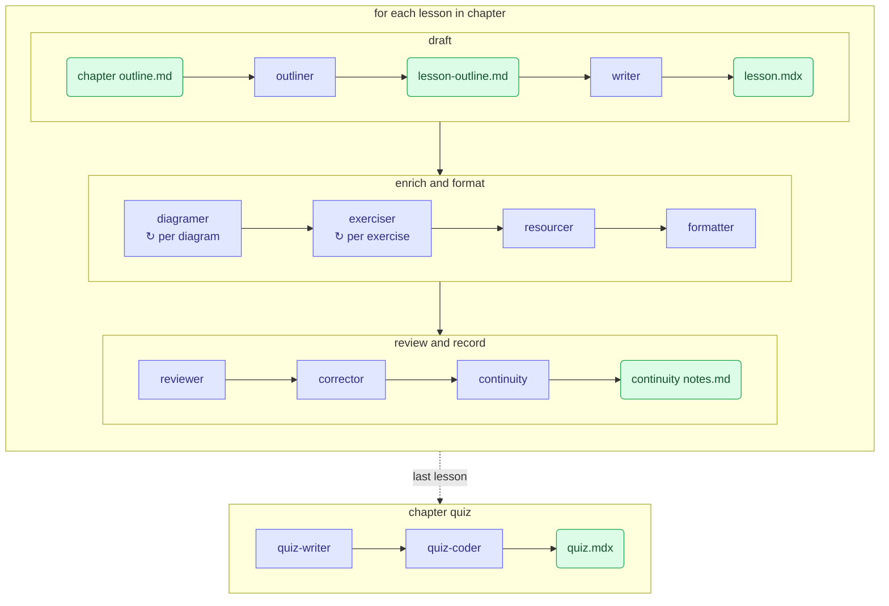
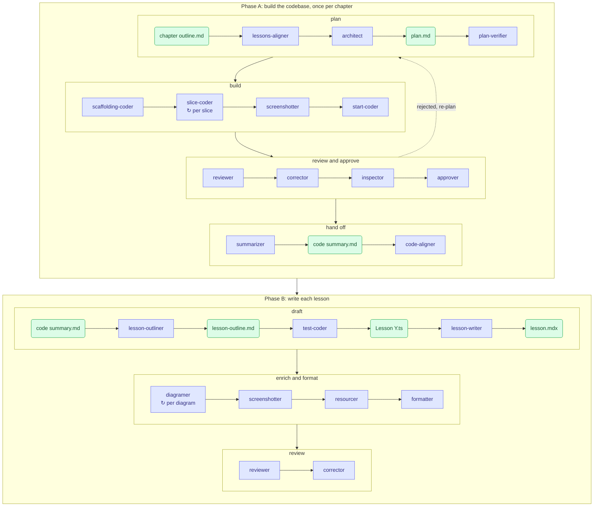

# A personalized course built using agentic workflows



Imagine an AI could take that one sentence, break it into a month of work, and actually do it — design the curriculum, write every lesson, build the interactive exercises, ship a working codebase for each project. This repository is that answer, run for real. Not a chatbot reply you read in thirty seconds, but the full thing an agent fleet produces when it's allowed to decompose the problem and grind on it chapter after chapter.

A full-depth course on building a production SaaS with the minimum-viable 2026 stack, **designed and built for me — by me**, with Claude Code (Opus 4.8). I'm building it to learn from; the experiment is that I also engineered the agentic system that authors it. Authoring began May 2026.

> **Status: work in progress.** 78 of a planned 108 chapters are published. Built over ~5 weeks and ~755 commits so far (first commit 2026-05-08). Not yet deployed publicly.

---

## The course I couldn't find

I just finished a Data Science degree and I'm moving into web development. I couldn't find a course pitched at the right altitude: everything for beginners assumes you've never written a function, and everything for experts assumes you already know the modern stack cold. So I built the one I wanted — senior-depth, decisions-before-syntax, and covering every layer a production SaaS actually ships: TypeScript, React 19, Next.js 16 (App Router, Server Components, PPR), Postgres + Drizzle, Better Auth, Stripe billing, transactional email, background jobs, file uploads, caching, rate limiting, i18n, testing, observability, CI/CD with zero-downtime migrations, and AI features over your own data.

The learner-facing overview lives on the site's landing page ([`src/content/docs/index.mdx`](src/content/docs/index.mdx)). This README is about the part underneath: how the course builds itself.

## Three experiments

Building it this way let me explore three things at once.

### 1. Knowledge extraction

Web development is a sprawling field — countless libraries, frameworks, and competing ways to do everything. There's no shortage of tutorials; the work is deciding which small slice is actually worth learning. The course is an exercise in compression: distilling that sprawl down to the minimum viable stack a real SaaS ships today, and the reasoning behind each choice. The curriculum was derived top-down: pick the tech → define the audience and goals → draft the structure → break it into chapters, then lessons. Every paragraph and every code sample has to survive two filters: *does a 2026 SaaS dev actually use this, and does it teach the decision rather than just the syntax?*

### 2. Personalized education

This course has exactly one student. It's tuned to where I am: adult tone, no bootcamp scaffolding, no "what is a variable," skip-ahead self-checks when I already know something. It's also tuned to *how I learn*. Instead of static prose, it leans on a library of interactive components: in-browser code editors that run and grade my code, predict-the-output drills, PR-style code reviews, hover-to-define terms, and explorable diagrams. I'd rather have that than one more course built for everyone.

### 3. Agentic engineering

The content is written by a fleet of agents; I designed the system that writes it. My job was the architecture — the pipeline, the contracts, the mechanisms that keep the agents from drifting. The rest of this README is about that system.

## How I built it

The method, in order:

1. **Decide the tech.** Pick the minimum-viable 2026 stack and fix it up front.
2. **Define the audience and goals.** Who it's for, what "done" means.
3. **Draft a high-level structure** — 22 units.
4. **Break it down** — 108 chapters, then individual lessons.
5. **Build the component library** — the interactive teaching primitives, first.
6. **Define a canonical lesson structure** — so every lesson has the same skeleton.
7. **Decompose authoring into specialized subagents** and add coherence mechanisms so the agents don't drift.
8. **Write an orchestrator** that runs the right pipeline per chapter, **sequentially**, one chapter after the next, to keep the whole course internally consistent.

## The authoring pipeline

An [orchestrator](documentation/chapter%20orchestrator%20prompts/Orchestrator.md) finds the next unwritten chapter, classifies it as a teaching chapter or a project chapter, routes it to the matching pipeline, builds the chapter end-to-end with no parallelism, commits, and moves on. The work is carried out by **32 specialized subagents** living in [`.claude/agents/`](.claude/agents), each doing one job. The two pipelines are diagrammed below, each at the end of its section — in both, a **square is a subagent** and a **rounded green box is a file** it reads or writes.

### Teaching-chapter pipeline

Concept lessons — prose, diagrams, exercises, and live coding. For each lesson, in order:

| Step | Agent | Does |
| --- | --- | --- |
| 1 | `lesson-outliner` | Plans the pedagogy, sections, diagrams, and scope. |
| 2 | `lesson-writer` | Writes the MDX prose with placeholders for interactive parts. |
| 3 | `lesson-diagramer` (×n) | Replaces each diagram placeholder with a rendered diagram. |
| 4 | `lesson-exerciser` (×n) | Replaces each exercise placeholder with a graded component or sandbox. |
| 5 | `lesson-resourcer` | Adds vetted YouTube embeds and external-resource cards. |
| 6 | `lesson-formatter` | Wires up component imports, tooltips, and code highlighting. |
| 7 | `lesson-reviewer` | Audits pedagogy, facts, and cross-lesson coherence (reports only). |
| 8 | `lesson-corrector` | Fixes the reviewer's findings surgically. |
| 9 | `lesson-continuity` | Records what this lesson taught/cut/promised for later lessons. |

The chapter's final lesson is a quiz: `quiz-writer` extracts understanding-level questions from every lesson, then `quiz-coder` turns them into an interactive quiz.



**Coherence within the chapter.** Two mechanisms keep the lessons from contradicting or repeating each other:

- **Continuity notes** — `lesson-continuity` keeps a per-chapter ledger of what each lesson taught, cut, promised, and the terminology it fixed. Every later `lesson-outliner` and `lesson-reviewer` reads it.
- **Reviewer ⇄ corrector gate** — no lesson is finished until `lesson-reviewer` signs off on pedagogy, facts, and cross-lesson coherence, and `lesson-corrector` resolves the findings.

### Project-chapter pipeline

Hands-on chapters where I build a real feature in a working codebase. Two phases.

**Phase A — build the reference codebase (once):**

| Step | Agent | Does |
| --- | --- | --- |
| 1 | `project-chapter-outline-lessons-aligner` | Reconciles the chapter outline with what the preceding teaching lessons actually delivered. |
| 2 | `project-architect` | Designs the codebase and writes the plan that serves as the coding contract. |
| 3 | `project-plan-verifier` | Compile-tests the plan's load-bearing choices before any code is written. |
| 4 | `project-scaffolding-coder` | Scaffolds the app — dependencies, config, boilerplate. |
| 5 | `project-slice-coder` (×n) | Implements the solution one feature slice at a time. |
| 6 | `project-screenshotter` | Captures the UI screenshots the lessons reuse. |
| 7 | `project-start-coder` | Derives my starter repo, with `TODO` stubs to fill in. |
| 8 | `project-reviewer` ⇄ `project-corrector` | Reviews built code against the plan; corrector fixes the findings. |
| 9 | `project-inspector` ⇄ `project-corrector` | Render-tests the running app; corrector fixes the defects. |
| 10 | `project-approver` | Judges whether the project is good enough to learn from — rejection triggers a re-plan loop. |
| 11 | `project-summarizer` | Produces a navigable codebase summary for the lesson agents. |
| 12 | `project-chapter-outline-code-aligner` | Realigns the chapter outline to the code that actually got built. |

**Phase B — write the lessons (per lesson):**

| Step | Agent | Does |
| --- | --- | --- |
| 1 | `project-lesson-outliner` | Outlines the lesson (project overview / walkthrough / implementation). |
| 2 | `project-lesson-test-coder` | For build-it-yourself lessons, writes the automated tests I code against. |
| 3 | `project-lesson-writer` | Writes the lesson MDX from the outline and the working code. |
| 4 | `lesson-diagramer` / `project-lesson-screenshotter` | Adds diagrams and embeds UI screenshots. |
| 5 | `project-lesson-resourcer` | Adds supporting videos and external resources. |
| 6 | `project-lesson-formatter` | Wires up components and finalizes formatting. |
| 7 | `project-lesson-reviewer` ⇄ `project-lesson-corrector` | Reviews the lesson; corrector fixes the findings. |



**Coherence across code and lessons.** This pipeline carries more risk — code and prose can drift apart — so it has more gates:

- **Two outline aligners** — before coding, `...lessons-aligner` reconciles the outline with what earlier teaching chapters' continuity notes actually delivered; after coding, `...code-aligner` realigns it with the code that got built.
- **Plan-as-contract** — the architect's plan pins stable selectors, locked decisions, and *falsifiable* rendered checks the app must pass.
- **Per-lesson test files** — build-it-yourself lessons ship with real tests, so a lesson's promises are mechanically verified against my code.
- **Layered review gates** — `reviewer ⇄ corrector`, then `inspector ⇄ corrector` on the running app, then a final `approver` that can send the whole chapter back for a re-plan.

## The interactive stack

The site is an Astro + Starlight documentation app. Lessons are MDX, file-system-routed: every `NNN Chapter name` folder under `src/content/docs/` becomes a sidebar group. Most components are plain Astro (`.astro`), rendered to static HTML at build time; the genuinely interactive pieces drop down to React islands only where they need client-side state.

The teaching power comes from a custom library of **30+ pre-built components** (catalogued in [`documentation/components/INDEX.md`](documentation/components/INDEX.md)):

- **In-browser code runtimes** — CodeMirror + `esbuild-wasm`, with PGlite (Postgres compiled to WASM) so SQL and Drizzle exercises run a real database in the browser. Variants cover SQL, Drizzle, React, Zod, and type-only TypeScript exercises, each auto-graded.
- **Sandboxes & embeds** — StackBlitz, CodeSandbox, and in-page Sandpack for live, editable projects.
- **Diagrams** — Mermaid and D2, both rendered at build time and themed for light/dark. A set of [diagram-engine guides](documentation/diagrams/INDEX.md) steers the diagram-building agents: which engine to pick for each kind of diagram, and the specific pitfalls of each.
- **Drills & figures** — predict-the-output, PR-style code review, matching, classification, scrubbable request traces, state-machine walkers, and more.
- **Code display** — Expressive Code with stepped, annotated walkthroughs and hover-to-define terms.

Open-ended answers and code reviews are graded by a locally-run LLM via Ollama, so feedback works without a backend.

## Repository layout

```
src/
  content/docs/      the lessons (MDX), one folder per chapter
  components/        the interactive component library (figures, exercises, live-coding, embeds…)
documentation/       the "authoring brain"
  content/                        unit/chapter/lesson outlines + continuity notes
  pedagogical approach/           the teaching guidelines every agent follows
  code standards/                 canonical code conventions for projects and samples
  components/ · diagrams/         component API and diagram-engine indices
.claude/
  prompts/chapter authoring/      the orchestrator + the two pipeline definitions
  agents/                         the 32 authoring subagents (lesson/ and project/)
projects/            per-chapter project codebases (start/ + solution/)
```

## Run it locally

Requires Node 24+. The dev server wraps `astro dev` with a watcher that restarts on lesson add/delete (Astro's content loader doesn't reconcile those over HMR).

```bash
npm install
npm run dev      # http://localhost:4321
npm run build    # static production build
npm run preview  # preview the production build
```
