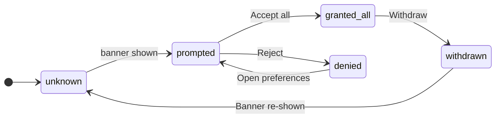

# `StateMachineWalker` + `Question` + `Branch` + `Leaf`

A click-navigable directed graph of question nodes leading to leaf reveal cards. The student walks the graph one step at a time — each branch click commits and replaces the stage with the next node; the full graph is never visible at once. `back` pops one step, `start over` resets to the root.

Two cosmetic framings share one engine:

- **`kind="decision"`** (default) — terminal `<Leaf>` nodes are recommendations. The verdict pill is the answer; the reason body is the justification. Use for "trigger before tool" decision trees and diagnostic funnels.
- **`kind="machine"`** — every node is a state; transitions can revisit earlier nodes (cycles are allowed). Use for small state machines (consent, auth, form flow). Pair with a topology diagram via the `diagram` slot since the walker only ever shows one state.

Provides its own outer card — do **not** wrap in `<Figure>`.

## Imports

```ts
import StateMachineWalker from '../../../../components/figures/state-machine-walker/StateMachineWalker.astro';
import Question from '../../../../components/figures/state-machine-walker/Question.astro';
import Branch from '../../../../components/figures/state-machine-walker/Branch.astro';
import Leaf from '../../../../components/figures/state-machine-walker/Leaf.astro';
```

(Relative to a lesson at `src/content/docs/<unit>/<chapter>/<lesson>.mdx`.)

## Props

### `StateMachineWalker`

| Prop | Type | Required | Default | Purpose |
| --- | --- | --- | --- | --- |
| `title` | `string` | no | — | Short heading above the stage. Plain text, lightly styled. Omit for a chromeless walker. |
| `root` | `string` | no | first `<Question>` (or first `<Leaf>`) | Id of the starting node. Auto-defaults to the first `<Question>` child in source order. Set explicitly only when the entry point isn't the first child. |
| `kind` | `'decision' \| 'machine'` | no | `'decision'` | Cosmetic framing. `'decision'` shows a "recommendation" label on leaves; `'machine'` shows a "state · `<id>`" label on every question. Same engine either way. |

### `Question`

| Prop | Type | Required | Default | Purpose |
| --- | --- | --- | --- | --- |
| `id` | `string` | yes | — | Identifier referenced by `<Branch to="…">` and (optionally) by the walker's `root`. Must be unique within a single `<StateMachineWalker>`. |
| `prompt` | `string` | yes | — | Headline question or state name shown at the top of the stage. Plain text. |
| `description` | `string` | no | — | One- or two-sentence body shown above the branch buttons. Plain text. Skip when the branch labels speak for themselves. |

The default slot holds `<Branch>` children — one per outgoing edge.

### `Branch`

| Prop | Type | Required | Default | Purpose |
| --- | --- | --- | --- | --- |
| `label` | `string` | yes | — | Button label shown to the student. Natural language ("Many clients — a fanout/broadcast") usually reads better than mechanical ids. |
| `to` | `string` | yes | — | Id of the destination — another `<Question>` or a `<Leaf>`. The engine resolves the kind at click time. |
| `rationale` | `string` | no | — | One-line secondary text shown below the branch label. Use when the label alone doesn't tell the student why this branch advances. |

Leaf element — no slot, no children.

### `Leaf`

| Prop | Type | Required | Default | Purpose |
| --- | --- | --- | --- | --- |
| `id` | `string` | yes | — | Identifier referenced by `<Branch to="…">`. Must be unique within a single `<StateMachineWalker>`. |
| `verdict` | `string` | yes | — | Headline recommendation shown in the accent-tinted pill. Plain text — keep it short ("Server-Sent Events", "Drizzle EXPLAIN ANALYZE on the slow query"). |

The default slot is the reason body — rich MDX content (paragraphs, `inline code`, lists, links).

## Slots

- **`StateMachineWalker` default** — `<Question>` and `<Leaf>` children, in any order. The script crawls them via `[data-smw-question]` / `[data-smw-leaf]`.
- **`StateMachineWalker` `diagram`** (named) — optional topology figure rendered above the stage. Use for `kind="machine"` walkers where the cycles need a visible graph. Typically a Mermaid `stateDiagram-v2` wrapped in `<Figure slot="diagram">`. When the source ids in the diagram match the `<Question>` ids (hyphens normalized to underscores — the walker handles this), the matching node is highlighted on every transition.
- **`Question` default** — `<Branch>` children, one per outgoing edge.
- **`Leaf` default** — the reason body. Plain MDX.

## Constraints & gotchas

- `<Question>` and `<Leaf>` must be **direct children** of `<StateMachineWalker>`. They're found via `:scope > [data-smw-question]` / `:scope > [data-smw-leaf]`; deeper nesting is invisible to the engine.
- `<Branch>` must be a **direct child** of `<Question>`. Same rule — `:scope > [data-smw-branch]`.
- All `id`s must be unique within a single walker. Duplicate ids collide on the same key in the node map; only the last one wins.
- A `<Branch to="…">` pointing to a non-existent id renders an inline `missing node: <id>` error on the stage. Useful during authoring; clean up before shipping.
- This component is a complete figure card — don't wrap it in `<Figure>` (you'll get nested padding and borders).
- The diagram slot's Mermaid SVG is highlighted by matching node ids: the walker normalizes hyphens in its own `<Question id="granted-all">` to underscores when looking up Mermaid's `state-granted_all-N` element. Pick ids that read both ways: `granted-all` in MDX maps cleanly to `granted_all` in `stateDiagram-v2`.
- **No breadcrumb.** Earlier drafts surfaced the visited path as a chip strip but at non-trivial walk depths it read as a pseudo-diagram of the graph it wasn't. Path history is intentionally hidden — use `back` / `start over` for navigation, and the `diagram` slot for topology context.

## When to reach for it

- A senior decision filter: "which transport / library / pattern do I reach for here?" The walker forces the student through the *order* the senior asks questions in — cardinality before frequency before transport, latency surface before tool, etc. The lesson lives in the order, not in any single leaf.
- A diagnostic funnel: "production is slow — where is the time going?" Vague complaint narrows to a specific observability tool one branch at a time. Each leaf names the tool and the signal.
- A small state machine: consent flow, auth state, form lifecycle. Pair with a Mermaid `stateDiagram-v2` in the `diagram` slot — the walker shows what each state contains, the diagram shows where it sits.
- *Not* the right fit for an open exploration of a large graph — use `GraphExplorer` (when built) for the "see the whole thing and click around" pattern. The walker is a *committed walk*: one path at a time.

## Authoring

Minimal decision tree — no `root` prop, no `kind`, no descriptions or rationales:

```mdx
<StateMachineWalker>
  <Question id="cardinality" prompt="Who needs to see this update?">
    <Branch label="One client" to="frequency" />
    <Branch label="Many clients" to="leaf-pubsub" />
  </Question>

  <Question id="frequency" prompt="How often does it change?">
    <Branch label="Many per second" to="leaf-sse" />
    <Branch label="A few per minute" to="leaf-poll" />
  </Question>

  <Leaf id="leaf-sse" verdict="Server-Sent Events">
    Unidirectional server → client over long-lived HTTP. Auto-reconnects with `Last-Event-ID`.
  </Leaf>
  <Leaf id="leaf-poll" verdict="Short polling on a sensible interval">
    Infrequent updates don't earn a persistent connection.
  </Leaf>
  <Leaf id="leaf-pubsub" verdict="Server pub/sub with SSE at the edge">
    Broadcasting is a server-side problem first.
  </Leaf>
</StateMachineWalker>
```

State machine with topology diagram — `kind="machine"` + `<Figure slot="diagram">`:

````mdx
import Figure from '../../../../components/figures/Figure.astro';

<StateMachineWalker kind="machine" title="Consent flow">
  <Figure slot="diagram">



  </Figure>

  <Question id="unknown" prompt="Initial — no decision recorded"
    description="useConsent() returns { status: 'unknown' }. No SDKs are loaded.">
    <Branch label="Banner shown to user" to="prompted" />
  </Question>

  <Question id="prompted" prompt="Prompted — banner on screen"
    description="useConsent() returns { status: 'prompted' }.">
    <Branch label="Accept all" to="granted-all" rationale="Analytics + marketing SDKs initialize." />
    <Branch label="Reject" to="denied" />
  </Question>

  <Question id="granted-all" prompt="Granted — all categories">
    <Branch label="Withdraw" to="withdrawn" />
  </Question>

  <Question id="denied" prompt="Denied">
    <Branch label="Open preferences" to="prompted" />
  </Question>

  <Question id="withdrawn" prompt="Withdrawn — consent revoked">
    <Branch label="Banner re-shown" to="unknown" />
  </Question>
</StateMachineWalker>
````

## Example

Three full variations — decision tree, diagnostic funnel, and a synced state machine — live in [the walker demo page](../../../src/content/docs/0%20Demos/figures/state-machine-walker-demo.mdx).
