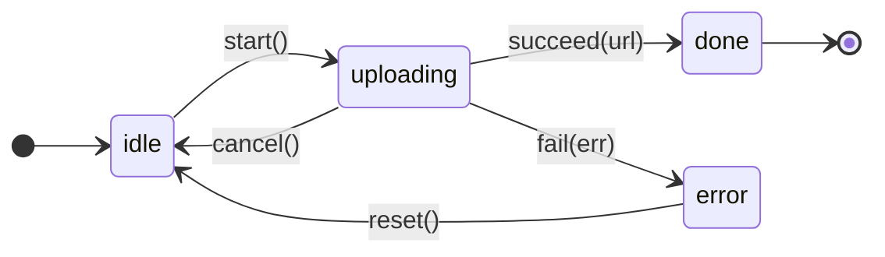

# Lesson 2 — States plus transitions

- **Title (h1):** States plus transitions
- **Sidebar label:** States plus transitions

---

## Lesson framing

This is a **pattern archetype** lesson sitting in the middle of Chapter 005's union-modeling triad (L1 shape → L2 transitions → L3 exhaustiveness). It teaches one move: extend the discriminated union with **typed transition functions** so the compiler refuses invalid state transitions, not just invalid variant fields. The student already met the discriminated-union shape in L1 (Architectural Principle #7), the canonical request-state variants on `status`, and per-variant fields belonging inside each variant. This lesson promotes that static shape to a dynamic one — variants plus the typed edges between them — and lands the **state machine** as the senior reflex for any feature with a non-trivial lifecycle.

**Posture.** Decisions before syntax. Open with the bug L1 leaves on the table: variants are watertight, but **transitions are unconstrained** — any code can mutate any state into any other state because the union itself doesn't track which transitions are valid. The fix is to type the **transition functions** with input-state and output-state types narrow enough that an illegal transition fails at compile time at the call site.

**The lesson's center of gravity** is the upload machine — a side-by-side `Code` (the variants + transition function signatures) and a Mermaid `stateDiagram-v2` (states as nodes, transitions as labeled edges). The student should leave with the muscle memory: when designing a feature with a lifecycle, draw the machine on a whiteboard, then transcribe nodes → variants and edges → transition function signatures. The diagram and the TypeScript are two views of the same artifact.

**Cognitive load plan.**
1. Bug first — the stale-callback upload that "came back to life" because no compile-time guard refused a transition from `aborted` to `uploading`.
2. The pattern — discriminated union for states + transition functions whose input/output types name specific variants.
3. Worked example: the upload machine. Diagram side-by-side with the variants and four transition function signatures. Walk per-state invariants (the `controller` lives on `uploading`, the `url` on `done`).
4. The illegal-transition guard — what the compile error looks like at the call site, and how the senior fixes it (narrow first, then call the transition).
5. Three canonical SaaS machines — optimistic mutation, upload (already seen), subscription. Each tied to the seam it owns.
6. Transition functions vs. reducers — one paragraph naming the reducer form `(state, event) => state` as the Zustand / `useReducer` consumer shape.
7. The XState boundary — one paragraph naming the threshold where the plain-TS form stops scaling.
8. Exercises — code the four transitions for the optimistic-mutation machine; match four SaaS features to their state machines.

**What this lesson does NOT do.**
- Does not re-teach the discriminated-union shape (L1 owns it). Recall in one sentence and lean on the L1 vocabulary (variant, discriminant, impossible state).
- Does not teach `assertNever` or exhaustive `switch` on the discriminant — L3 owns the compile-error guarantee on missing variants. The transition-function bodies in this lesson don't `switch` on the input state; they accept a narrow input type directly.
- Does not brand the IDs inside variants — L4 owns nominal typing. Plain `string` everywhere.
- Does not teach `useReducer` mechanics — Unit 4 / Chapter 024 owns the hook. One sentence on the reducer shape, nothing more.
- Does not teach Zustand patterns — Chapter 078–079 owns. Named in one line.
- Does not teach side-effect orchestration inside transitions (effects, timers, retries) — Chapter 043 (Server Actions) and Chapter 077 (optimistic mutations) own the production patterns. Transitions in this lesson are **pure state-to-state functions**; the network call is mentioned but not implemented.
- Does not teach `AbortController` mechanics — Chapter 007 Lesson 4 owns. Use it as a typed field on the `uploading` variant without explaining how it works.
- Does not teach XState API surface — named once at the threshold, no code samples.

**Recurring vocabulary.** "State machine," "transition function," "per-state invariants," "illegal transition." Carry over from L1: variant, discriminant, impossible state. New `<Term>` tooltips installed for **state machine** and **transition function**; the L1 tooltips for **variant**, **discriminant**, **impossible state** are not re-rendered here (they live in the cross-lesson glossary already).

**Naming and form conventions.**
- Arrow functions bound to `const` for transitions. Type signatures show parameter and return types explicitly because the signature **is** the lesson.
- Use **`kind`** as the discriminant for general-taxonomy state machines (upload, optimistic mutation). The chapter outline's upload example uses `kind`. Subscription uses `status` because Stripe's API uses `status` — match the wire vocabulary.
- States in the diagram are lowercase strings (`idle`, `uploading`, `done`, `error`) to match the discriminant literals.
- Plain `string` for IDs (no branding — L4's job).

---

## Lesson sections

### Introduction (no h2 — prose lead-in)

Three short paragraphs.

1. **The carry-over.** One sentence pointing back to L1: the student now writes discriminated unions that refuse impossible **field combinations**. The variants are watertight — `data` lives only on `success`, `error` only on `error`. Good.
2. **The crack.** Variants are watertight, but **transitions are not.** The union as a static shape doesn't say which variants can follow which. Code anywhere in the codebase can construct any variant from any other variant — the compiler shrugs.
3. **The bug.** A file upload starts. The user clicks "Cancel." The `aborted` state lands. Two seconds later, a stale `onProgress` callback from the original `fetch` fires (the network was already in flight when the user aborted) and naively constructs a new `{ kind: 'uploading', progress: 50 }` state. The UI snaps back to "uploading…" on a canceled upload. The fix is to **type the transition functions** so the only way to reach `uploading` is from `idle`, and the stale callback's attempt to revive a canceled upload fails at compile time.

Show the bug as one short `Code` block — a hypothetical mutator that takes the current state and a "progress" event and naively returns `{ kind: 'uploading', progress }` regardless of the current state. Annotate (inline comment) the moment the bug ships: a `progress` event arriving after `cancel` re-enters `uploading`. Keep it under 12 lines.

Reasoning: this is the lesson's **production stake**. The student needs to feel the bug before they reach for the pattern. Stale-callback resurrection is a real, costly bug class on long-running operations (uploads, streams, polling) and it's exactly what typed transitions prevent.

### What a state machine adds to a discriminated union

The pattern itself, stated structurally. Short section — definition, the shape, and the one-line contract.

**Content.**
- Definition: **a state machine is a discriminated union of states plus a set of typed transition functions, where each function takes a specific state (or set of states) as input and returns a specific state as output.** Use a `<Term>` tooltip on **state machine** at first use. Suggested text: "Discriminated union of states paired with typed transition functions; the compiler refuses transitions the types don't allow."
- The one-line contract: *the union models which states exist; the transition functions model which states can follow which.* This is the structural enforcement the lesson installs.
- Use a `<Term>` tooltip on **transition function** at first use. Suggested text: "A function that takes a specific input state (and any event payload) and returns a specific output state. The compiler enforces the source–destination pairing."

No code in this section yet. The next section is the worked example. This section's job is to land the definition before the student sees the shape.

### The upload machine

The lesson's structural center. The full worked example shown as a side-by-side: the Mermaid state diagram on one side, the TypeScript variants + transition function signatures on the other.

**Content.**

**1. The diagram.** A Mermaid `stateDiagram-v2` showing four states and the labeled transitions between them. The diagram is the artifact a senior draws first — let the student see it that way.



**Note for the lesson author — Mermaid self-loop quirk.** The `progress` transition (`uploading --> uploading`) is intentionally **omitted from the diagram**. Mermaid's `stateDiagram-v2` renders self-loops awkwardly (known upstream issue — the edge curve cuts through the state node). The `progress` transition is fully covered in the code block below the diagram; the prose under the diagram should mention "the diagram omits the `progress` self-loop — it's a state-preserving update covered in the code below, not a state change." This keeps the diagram clean.

Wrap in `<Figure>` with caption: "The upload machine — five labeled state transitions. The `progress` self-loop is omitted; see the code."

**2. The variants.** A `Code` block with the discriminated union for the upload states. Per-state invariants visible in the shape:

```ts
type UploadState =
  | { kind: 'idle' }
  | { kind: 'uploading'; progress: number; controller: AbortController }
  | { kind: 'done'; url: string }
  | { kind: 'error'; error: Error };
```

Add a one-line note inline: *`AbortController` is the standard Web API for canceling in-flight network requests — Chapter 007 Lesson 4 owns the depth; here it's a typed field that lives only on `uploading`.*

**3. The transitions.** A `Code` block with the six typed transition functions (`start`, `progress`, `succeed`, `fail`, `cancel`, `reset`). Each signature names the specific input and output variants:

```ts
const start = (state: UploadState & { kind: 'idle' }): UploadState & { kind: 'uploading' } => ({
  kind: 'uploading',
  progress: 0,
  controller: new AbortController(),
});

const progress = (
  state: UploadState & { kind: 'uploading' },
  next: number,
): UploadState & { kind: 'uploading' } => ({
  ...state,
  progress: next,
});

const succeed = (
  state: UploadState & { kind: 'uploading' },
  url: string,
): UploadState & { kind: 'done' } => ({ kind: 'done', url });

const fail = (
  state: UploadState & { kind: 'uploading' },
  error: Error,
): UploadState & { kind: 'error' } => ({ kind: 'error', error });

const cancel = (state: UploadState & { kind: 'uploading' }): UploadState & { kind: 'idle' } => {
  state.controller.abort();
  return { kind: 'idle' };
};

const reset = (state: UploadState & { kind: 'error' }): UploadState & { kind: 'idle' } => ({
  kind: 'idle',
});
```

**Note on input/output typing.** Each signature names the input variant by intersecting `UploadState` with the discriminant literal (`UploadState & { kind: 'uploading' }`). This is the load-bearing pattern of the lesson — the student should leave able to read this signature without commentary. State plainly: *the input type names the variant the function accepts; the output type names the variant it produces.*

**Component choice.** Use **`AnnotatedCode`** for the transitions block. The transition functions are a sequence of related signatures that vary in subtle ways (different input variant, different output variant, side-effecting body in `cancel`). Stepping through them one at a time with the prose explaining "what changes between this transition and the previous one" is the right shape — six fences would be repetitive, one big block needs the reader's eye guided.

Steps for `AnnotatedCode`:
1. **`start`**: idle → uploading. The simplest transition. Constructs an `AbortController` so cancel can later use it. Highlight the input/output annotations — this is the pattern every later step mirrors.
2. **`progress`**: uploading → uploading. The state-preserving update — takes the next progress value, returns the same variant with the updated field. The signature refuses any input that isn't `uploading` — **a stale callback can't revive `idle` because its input type doesn't allow `idle`.** This is the moment the introduction's bug becomes concrete.
3. **`succeed`** and **`fail`**: uploading → done and uploading → error. Each maps one variant to another and discards the `controller` (the upload has resolved, no further abort is needed). One step can cover both — they're parallel.
4. **`cancel`**: uploading → idle. The only transition with a side effect — calls `controller.abort()` before returning the new state. Side effects inside transitions are allowed when they belong to the transition's semantics; mention in passing that purer forms (effects as a separate concern) land in Chapter 077.
5. **`reset`**: error → idle. The recovery edge — the user dismisses the error and starts over.

**Why side-by-side diagram and code.** State machines are easier to read pictorially: nodes are variants, edges are transitions. The TypeScript is the truth (the compiler runs on it), but the diagram is the artifact a senior draws first. Showing them adjacently teaches the student that they are **two views of the same model**.

### Per-state invariants

The structural rule. One section — short, but load-bearing because it's the deepest reason the pattern pays.

**Content.**
- Restate the rule plainly: **each state holds exactly the data the state is valid with.** The `controller` lives on `uploading` only (no other state can abort — there's nothing to abort). The `url` lives on `done` only (no other state has a result). The `error` lives on `error` only. The `progress` lives on `uploading` only.
- The compile-time guarantee: **the caller cannot read `url` on `uploading` or `controller` on `idle`.** The invariants live in the type, not in a runtime null-check.
- Contrast: a flat shape `{ kind, progress?, controller?, url?, error? }` would compile but would force every consumer to null-check every field, and would re-admit the impossible-state bug class L1 closed.
- One sentence forward link: the same per-state-invariant discipline shows up in TanStack Query mutation states (Chapter 077) and in Stripe's subscription status (covered later in this lesson).

Render this as a `<CodeVariants>` with two tabs:
- **"Per-variant invariants"** — the `UploadState` shape from the worked example.
- **"Flat with optionals"** — the anti-pattern, `{ kind: 'idle' | 'uploading' | 'done' | 'error'; progress?: number; controller?: AbortController; url?: string; error?: Error }`. Prose under this tab notes the problem: every consumer has to null-check every field, and any field can legally appear on any variant.

`CodeVariants` is the right reach because the comparison is the lesson — the student needs to see both shapes adjacently. The "Flat with optionals" form recalls L1's flag-set anti-pattern; the connection is intentional.

### The illegal-transition guard

What the compile error looks like at the call site. This is the section where the abstract pattern becomes concrete enforcement.

**Content.**
- Setup: `start(currentState)` where `currentState: UploadState` (the wide union). The call **fails to compile** because `UploadState` is not assignable to `UploadState & { kind: 'idle' }`. State the error message plainly so the student recognizes it in their own IDE.
- The senior fix: **narrow first, then call the transition.** Use the discriminant check from L1:
  ```ts
  if (currentState.kind === 'idle') {
    setState(start(currentState));
  }
  ```
  Inside the `if`, the variable is narrowed to `{ kind: 'idle' }`, which is assignable to `start`'s input type.
- The alternative senior reach: compose transitions that accept only one variant each (the pattern this lesson teaches), as opposed to "smart" transitions that branch internally on the input variant. The split-function form is the senior default because each function's signature documents one source–destination pair.
- One paragraph naming the stale-callback bug from the introduction: the stale `onProgress` callback can't construct `{ kind: 'uploading' }` from `{ kind: 'idle' }` because the only function that produces `uploading` (`start`) doesn't accept `idle`-then-progress as input. The compiler refuses the bug at the moment the reviving call is written.

**Component.** A single `Code` block showing the failing call, the compile error as a comment line below the call, and the corrected call inside a narrowing `if`. The block is sequential reading — no `CodeVariants` needed.

### Three canonical SaaS machines

Tour of three feature lifecycles modeled as state machines. The chapter outline names optimistic mutation, upload, subscription. Upload is already the worked example — recall in one line and move on. Optimistic mutation and subscription each get a tight `Code` block + one-paragraph framing.

For each: short framing → fenced `Code` block → one-line forward link.

**1. Upload — recall.** One sentence: "The worked example above. The same machine ships in the R2 presigned-PUT flow (Chapter 068, Chapter 069). The destination changes; the machine doesn't."

**2. Optimistic mutation.** The shape every TanStack Query mutation operates against (Chapter 077). Four states: `idle`, `optimistic` (the user's change applied locally, original value held for rollback), `confirmed` (server returned the persisted value), `failed` (server rejected; UI shows the error, user can retry).

```ts
type MutationState =
  | { kind: 'idle' }
  | { kind: 'optimistic'; pending: string; original: string }
  | { kind: 'confirmed'; value: string }
  | { kind: 'failed'; original: string; error: Error };

// transitions — signatures only, bodies elided for survey purposes
declare const apply: (
  state: MutationState & { kind: 'idle' },
  original: string,
  pending: string,
) => MutationState & { kind: 'optimistic' };

declare const confirm: (
  state: MutationState & { kind: 'optimistic' },
  value: string,
) => MutationState & { kind: 'confirmed' };

declare const rollback: (
  state: MutationState & { kind: 'optimistic' },
  error: Error,
) => MutationState & { kind: 'failed' };
```

Per-state invariants to call out: the `optimistic` variant **must** carry the `original` value so `rollback` can restore it; the `confirmed` variant doesn't (no rollback after server success). State this plainly — the invariant is what makes optimistic UI safe.

Forward link: Chapter 077 (TanStack Query optimistic mutations).

**Note on the value types.** Use `string` for `pending`, `original`, and `value` to keep the survey concrete. The real production shape is generic (any entity can be mutated optimistically), but **generics with constraints land in Lesson 7 of this chapter** — do not introduce them here. The intersection-with-discriminant pattern is what the lesson is teaching; substituting `string` for the value types keeps the focus there.

**3. Subscription.** Stripe billing's plan lifecycle. The variants are dictated by Stripe's API — the senior reach is to model them as a discriminated union with the per-variant fields Stripe actually sends:

```ts
type SubscriptionState =
  | { status: 'trialing'; trialEndsAt: Date }
  | { status: 'active'; currentPeriodEnd: Date }
  | { status: 'past_due'; nextRetryAt: Date }
  | { status: 'canceled'; canceledAt: Date }
  | { status: 'incomplete'; latestInvoiceId: string };
```

Per-state invariants to call out: `past_due` carries a `nextRetryAt` (the dunning surface needs it); `canceled` carries a `canceledAt` (audit and UI both read it); `trialing` carries a `trialEndsAt` (the upsell timer reads it).

The transitions are **owned by Stripe** — the application doesn't write them; it receives webhook events that map to transitions. State this plainly: *for machines whose transitions are dictated by an external system, the application models the states and validates the incoming transitions; it does not author the transition functions.* Forward link: Chapter 064 (Stripe billing). The variants here use `status` (not `kind`) because Stripe's API uses `status` and the senior reach is to match the wire vocabulary.

**Note on `Date`.** Code conventions §Async, cancellation, and time call out `Temporal` as the domain-code default, with `Date` forbidden in domain code. The lesson uses `Date` here as the simplest familiar shape because Temporal hasn't been taught yet (Chapter 007). The lesson author should add one inline comment: *`Temporal.PlainDate` / `Temporal.Instant` is the production form — Chapter 007 owns the swap.* Pedagogical reason for using `Date`: teaching Temporal at the same time as state machines doubles the cognitive load; the state-machine shape is the focus.

**Component.** Three sequential `Code` blocks — same shape as L1's "Four canonical SaaS variants" section. Tabs would hide the side-by-side feel.

### Transition functions vs. reducers

One paragraph. The chapter outline names this — the student needs to recognize the reducer form when they see it in Zustand or `useReducer` code, but the lesson defaults to standalone transition functions for legibility.

**Content.**
- The two forms:
  - **Standalone transition functions** — each transition is its own function (`start`, `progress`, `succeed`, `fail`, …). Each signature documents one source–destination pair. This is the lesson's default form.
  - **Reducer** — one function `(state: State, event: Event) => State` that switches on the event's `type` discriminant and dispatches to a transition body inline. The shape Zustand stores and React's `useReducer` consume.
- The senior call: both are valid; the lesson defaults to standalone functions for legibility (each signature reads as a contract); the reducer form earns its weight when the machine is consumed by `useReducer` or Zustand and the framework expects the `(state, event) => state` signature.
- Forward links in one parenthetical: `useReducer` (Chapter 024), Zustand (Chapter 078).

No code in this section — the student has already seen the standalone form in the worked example, and the reducer form lives in its own future lesson. One paragraph of prose, three sentences max.

### When to reach for XState

One paragraph naming the threshold tool. The chapter outline names this — the senior reach is to know when the plain-TS form stops scaling.

**Content.**
- The plain-TypeScript discriminated-union plus transition functions pattern covers ~90% of SaaS state-machine needs.
- The threshold for **XState v5**: the machine has more than ~5 states with branching transitions, **or** the machine has **parallel states** (independently-progressing regions — a wizard with three concurrent form sections), **or** the machine has **history nodes** (resume from where the user left off after a digression), **or** the machine needs the **Stately Studio inspector** for visualizing live machines during development. XState v5 also ships first-class actor support and built-in `fromPromise` for typed async — relevant when the machine orchestrates more than synchronous state changes.
- The course commits to the plain-TS form. XState is named in one paragraph so the student recognizes it as the next tool up and knows the threshold.
- One sentence forward link: XState reappears nowhere else in the course unless a chapter project hits the threshold.

Render as plain prose. No code, no `<ExternalResource>` for XState (the lesson's external resources cluster is for the state-machine pattern itself, not for the threshold tool).

### Exercise — type the optimistic-mutation transitions

A `<TypeCoding>` exercise. The chapter outline suggests `script-coding` or `react-coding`; `TypeCoding` is the right reach because:
- The exercise is about the **signatures** (the type-level contract), not the runtime behavior. Running the transitions would require mock data, a server, and assertion harnesses that distract from the signature.
- `^?` queries can pin the inferred output type at each transition's call site, which is the load-bearing observation.
- `@ts-expect-error` can mark the illegal call sites that should refuse to compile.

**Setup.** Give the student the `MutationState` shape (concrete types — `string` for the values to avoid generics distraction) and stub signatures for the four transitions, plus a call-site harness with `@ts-expect-error` directives marking the illegal transitions.

```ts
type Mutation =
  | { kind: 'idle' }
  | { kind: 'optimistic'; pending: string; original: string }
  | { kind: 'confirmed'; value: string }
  | { kind: 'failed'; original: string; error: Error };

// TODO: type the four transitions so the call-site below compiles.
const apply = (/* … */) => { /* student fills */ };
const confirm = (/* … */) => { /* student fills */ };
const rollback = (/* … */) => { /* student fills */ };
const retry = (/* … */) => { /* student fills */ };

// Call-site harness (do not edit)
declare const idle: Mutation & { kind: 'idle' };
declare const optimistic: Mutation & { kind: 'optimistic' };
declare const failed: Mutation & { kind: 'failed' };

const a = apply(idle, 'old', 'new');
//    ^?
const c = confirm(optimistic, 'server-value');
//    ^?
const r = rollback(optimistic, new Error('boom'));
//    ^?
const rt = retry(failed);
//    ^?

// @ts-expect-error — apply requires `idle`, not `optimistic`
apply(optimistic, 'old', 'new');

// @ts-expect-error — confirm requires `optimistic`, not `failed`
confirm(failed, 'server-value');
```

**Task.** Type the four transitions:
- `apply`: takes `idle` + `original: string` + `pending: string`, returns `optimistic` with both fields populated.
- `confirm`: takes `optimistic` + `value: string`, returns `confirmed`.
- `rollback`: takes `optimistic` + `error: Error`, returns `failed` carrying the **original** value from the input.
- `retry`: takes `failed`, returns `optimistic` with the original re-applied as pending **and** as original (the user retries the same change).

**Criteria.** Four `expectedQueries`, one per transition. Pin each to a substring that uniquely identifies the output variant:
- `^?` after `a` expects substring `'optimistic'`.
- `^?` after `c` expects substring `'confirmed'`.
- `^?` after `r` expects substring `'failed'`.
- `^?` after `rt` expects substring `'optimistic'`.

Plus the implicit "no `@ts-expect-error` is unused" check — the student's typings should make both directives still fire (illegal calls remain illegal). The TypeCoding component auto-checks for unused directives.

**Instructions text.** "Type the four transitions so the call-site queries resolve to the right output variants. Use the intersection form `Mutation & { kind: 'idle' }` to name the input and output variants. The `@ts-expect-error` directives should keep firing — the illegal calls must remain illegal."

**Why TypeCoding over ScriptCoding.** The exercise is about the type-level contract. ScriptCoding would force the student to also write meaningful runtime bodies (return the right shape, populate the right fields) and add a mock harness — the signal-to-noise ratio drops. The whole point of the pattern is that the **types** refuse the bug; testing types directly is the matched tool.

### Exercise — pair the feature to its machine

A `<Matching>` exercise. The chapter outline calls for "four real SaaS features paired to the state machines that fit." This is the lesson's recall test — does the student recognize when a feature is a state machine, and which machine fits?

**Setup.** Five pairs (the chapter outline says four; bump to five so the matching has more discriminating power; the `<Matching>` component supports up to 8 distinct hues). Left column: a feature description. Right column: the machine name (or a one-line shape description).

**Pairs.**
1. **Left:** "An invoice payment Stripe is retrying after a failed charge." **Right:** "Subscription/billing machine with `past_due` carrying a `nextRetryAt` timestamp."
2. **Left:** "A file the user is dragging into the upload zone." **Right:** "Upload machine — `idle`, `uploading` with `AbortController`, `done` with URL, `error`."
3. **Left:** "A draft article the author keeps editing until they hit Publish." **Right:** "Draft-to-published machine — `draft`, `review`, `published`, `archived`."
4. **Left:** "A comment the user typed and submitted; the UI shows it immediately while the server persists." **Right:** "Optimistic mutation — `idle`, `optimistic` with `original` held for rollback, `confirmed`, `failed`."
5. **Left:** "A user that just signed up and needs to verify their email before any other action." **Right:** "Onboarding machine — `unverified`, `verified-incomplete-profile`, `verified-complete`."

**Reasoning for the pairs.** Each left item names a feature the student will plausibly meet in a SaaS app (or has met in earlier course material). Each right item is the canonical machine — three from the lesson's worked-example set (subscription, upload, optimistic mutation) and two adjacents that exercise pattern recognition without re-teaching (draft-to-published and onboarding are intuitive enough that the student should recognize them as state machines without dedicated treatment). The `<Matching>` component shuffles both columns on render, so source order does not affect difficulty.

**Instructions.** "Pair each SaaS feature to the state machine that fits it. Look for the lifecycle in each description — the verbs and stages are the cues."

### External resources

A short `<ExternalResource>` cluster at the lesson's tail, wrapped in `<CardGrid>`. Three cards is the chapter's default cadence (L1 settled at 3).

1. **MDN — `AbortController`** — the Web API the upload's `uploading` variant carries. The lesson doesn't teach it; the link gives the student the reference for when they implement the network call. URL: `https://developer.mozilla.org/en-US/docs/Web/API/AbortController`. Icon: `simple-icons:mdnwebdocs`.
2. **Statecharts — "Constraints liberate, liberties constrain" by David Khourshid** — the senior treatment of state machines as a design tool. The piece that motivates why typed transitions pay; not a TypeScript reference. (Khourshid is the author of XState — the resource is about the pattern, not the library.) URL: `https://statecharts.dev/` (or link to the specific talk/article that lands closest to this framing — verify at write time).
3. **A recent (2025–2026) TypeScript state-machine community write-up.** Candidates to verify at write time:
   - The OneUptime "Type-Safe State Machines in TypeScript" post (Jan 2026).
   - The Michaël VD "Composable State Machines in TypeScript" Medium piece (2026).
   - **Fallback** if neither passes the bar: XState's "When to use a state machine" page as the threshold-tool reference.

The third card should be verified online at write time. Three cards is the cap — every additional card past the load-bearing ones dilutes the cluster.

---

## Scope

### What this lesson includes

- The state-machine pattern as a discriminated union of states plus typed transition functions.
- Per-state invariants — each state carries only the data valid for that state.
- The intersection-with-discriminant input/output typing pattern (`UploadState & { kind: 'uploading' }`).
- The illegal-transition compile error at the call site and the narrow-then-call fix.
- Three canonical SaaS machines: upload (worked example), optimistic mutation, subscription.
- Transition functions vs. reducers — named, not taught at depth.
- The XState threshold — named in one paragraph.
- Two exercises: type the optimistic-mutation transitions (`TypeCoding`); pair five SaaS features to their machines (`Matching`).

### What this lesson does NOT include

- **The discriminated-union shape itself** — Lesson 1 of this chapter owns. Recall in one sentence.
- **Exhaustiveness with `assertNever` or `satisfies never`** — Lesson 3 of this chapter owns. The transitions in this lesson don't `switch` on the input state; they accept narrow inputs directly. No exhaustiveness machinery shown here.
- **Branded IDs** — Lesson 4 of this chapter owns. Plain `string` for IDs (the URL on the `done` variant stays `string`; the invoice/subscription IDs in the optimistic-mutation and subscription examples stay `string`).
- **`typeof V`, `keyof T`, `T[K]` derivation operators** — Lesson 5 of this chapter owns.
- **Utility types** (`Partial`, `Pick`, `Omit`, `Extract`, etc.) — Lesson 6 of this chapter owns. Do not use `Extract<UploadState, { kind: 'uploading' }>` even though it would be equivalent to the intersection form in this lesson; the chapter outline reserves utility types for Lesson 6, and the intersection form here is the more direct teach.
- **Generics with constraints** — Lesson 7 of this chapter owns. The optimistic-mutation worked example uses `string` for the value types to avoid introducing generics. The production shape is generic; the lesson defers that.
- **`AbortController` mechanics** — Chapter 007 Lesson 4 owns. Use it as a typed field on the `uploading` variant.
- **`Temporal` time types** — Chapter 007 owns. The subscription example uses `Date` and notes the production swap inline.
- **`useReducer` mechanics** — Chapter 024 owns. Reducers are named in one paragraph, no code.
- **Zustand state machines** — Chapter 078–079 own.
- **XState API surface** — named once at the threshold; no code samples.
- **Side-effect orchestration inside transitions** (timers, retries, effects scheduled after a transition) — Chapter 043 (Server Actions), Chapter 077 (optimistic mutations).
- **Stripe webhook event handling** — Chapter 064 owns. The subscription machine shows the **state shape**; the webhook handler that triggers transitions is named as the forward link only.

### Prerequisites — concise refreshers only

- **Discriminated unions** (Chapter 005 Lesson 1) — one sentence: "From the previous lesson, a discriminated union is a union of object types each carrying a literal-typed discriminant the compiler narrows on."
- **Narrowing by the discriminant** (Chapter 004 Lesson 6 + Chapter 005 Lesson 1) — one sentence: "The `if (state.kind === 'idle')` form narrows the variable to the named variant inside the block."
- **Architectural Principle #7** (Chapter 005 Lesson 1) — implicit; do not re-name. The principle is now the chapter's anchor.
- **`AbortController`** — one inline sentence at first use: "the standard Web API for canceling in-flight network requests."

---

## Components and diagrams at a glance

| Section | Component | Purpose |
| --- | --- | --- |
| Introduction | Single `<Code>` block | The stale-callback bug — naive mutator + comment marking the bug. |
| What a state machine adds | Plain prose + `<Term>` tooltips | Definition; no code. |
| The upload machine — diagram | `<Figure>` wrapping a Mermaid `stateDiagram-v2` | The artifact a senior draws first. `progress` self-loop intentionally omitted (Mermaid rendering quirk). |
| The upload machine — variants | `<Code>` block | The discriminated union with per-state invariants. |
| The upload machine — transitions | `<AnnotatedCode>` (5 steps) | Stepped walkthrough of the six transitions, one focus per step. |
| Per-state invariants | `<CodeVariants>` (2 tabs: "Per-variant", "Flat with optionals") | The shape the discipline forbids. |
| Illegal-transition guard | Single `<Code>` block | The failing call + the narrow-then-call fix. |
| Three canonical SaaS machines — upload | One-sentence recall | No code. |
| Three canonical SaaS machines — optimistic mutation | `<Code>` block | Variants + transition signatures (non-generic). |
| Three canonical SaaS machines — subscription | `<Code>` block | Variants only; transitions are external. |
| Reducers | Plain prose | Named, not taught. |
| XState boundary | Plain prose | One paragraph. |
| Exercise — transitions | `<TypeCoding>` with four `expectedQueries` + two `@ts-expect-error` | Type the four optimistic-mutation transitions. |
| Exercise — recognition | `<Matching>` (5 pairs) | Pair SaaS features to their machines. |
| External resources | 3 × `<ExternalResource>` in `<CardGrid>` | MDN AbortController, Statecharts piece, one recent SaaS state-machine article. |

## `<Term>` tooltips to include

- **state machine** — at first use. "Discriminated union of states paired with typed transition functions; the compiler refuses transitions the types don't allow."
- **transition function** — at first use. "A function that takes a specific input state (and any event payload) and returns a specific output state. The compiler enforces the source–destination pairing."

Do not re-render the L1 tooltips (variant, discriminant, impossible state). Two tooltips is the cap for this lesson.

## Diagrams

**Mermaid `stateDiagram-v2`** for the upload machine. This is the lesson's load-bearing visual. It earns the `direction LR` to stay within the chapter's vertical budget. Wrap in `<Figure>` with caption.

Per the diagrams INDEX: state machines pick D2 first, Mermaid as the strong fallback. The lesson uses Mermaid because:
- `stateDiagram-v2` is purpose-built for state machines with clear `state --> state : label` syntax.
- The diagram is small (4 states, 5 transitions in the diagram + 1 self-loop omitted) — D2's denser layout engine doesn't pay off here.
- Mermaid integrates with `<StateMachineWalker>`'s `diagram` slot (see "Optional enhancement" below) if the lesson author chooses to upgrade the worked example.

**Mermaid self-loop quirk.** The `uploading --> uploading : progress(p)` transition is **intentionally omitted** from the diagram source above because Mermaid's `stateDiagram-v2` renders self-loops awkwardly (the edge curve cuts through the state node — see mermaid-js/mermaid#6336). The lesson's prose under the diagram should explicitly mention this omission and point the student to the code block below for the `progress` transition. Do not try to render the self-loop unless the author has verified it renders cleanly in the current Mermaid version.

**Optional enhancement (lesson author's call).** The Mermaid diagram alone is sufficient. If the lesson author wants to add a click-to-explore experience, swap the static `<Figure>` for a `<StateMachineWalker kind="machine">` with the Mermaid diagram in the `diagram` slot and one `<Question>` per state describing its data and outgoing transitions. This is **not required** — the static diagram + adjacent `Code` blocks is the canonical form for this lesson and matches the chapter's posture (decisions before syntax; the diagram is the artifact, not the toy). The walker is appropriate only if it adds real exploration value, not as decoration.
