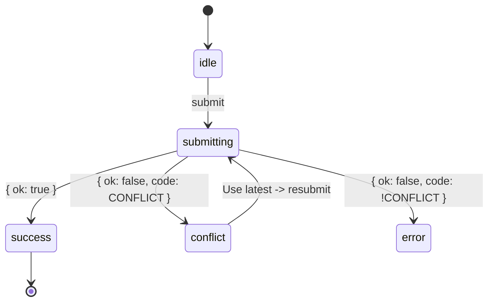

# Lesson 065.3 — Version columns and the honest 409

## Lesson framing

The chapter outline title is the right fit — `version` column plus the 409 is exactly the shape this lesson teaches. Keep it.

**The senior question.** Two tabs editing the same invoice. One Save lands, the second silently overwrites the first. How do we detect the race, what status do we return, and what does the user see?

**Mental model the student should end with.** "On any user-editable row with a realistic two-tab story: add `version`, include it as a precondition in every UPDATE's `WHERE`, branch on rows-affected to return a typed 409 Result, and surface refresh-and-retry in the form."

**Pedagogical anchors:**

- Lead with the failure mode (silent last-write-wins) in a concrete two-tab scenario; that's what makes the 409 *honest*. The course's "decisions before syntax" pillar.
- Sequence the build: schema column → UPDATE shape → Result branch → client UX. Each layer earns its weight in the previous one's pain.
- Always reuse the canonical `Result` shape from 047.2 — don't invent. Extend with `error.code = 'CONFLICT'` and `error.current`.
- Restate the `idle -> submitting -> {success, conflict, error}` state machine from 009.2; slot the new `conflict` transition into a model the student already has.
- Carve out where last-write-wins is *correct* — toggles, append-only writes, SQL counter increments. Pedagogically critical: students new to this concept tend to over-apply concurrency control. Name the threshold.
- Pre-empt three pitfalls that begineers make: forgetting to bump `version` in the SET (infinite-retry feeling), missing the tenancy filter on UPDATE (cross-tenant overwrites — composes with 065.2), and using `updatedAt` at second precision (collisions on rapid writes).
- Keep the Drizzle code blocks small. The chapter has already taught `tenantDb`, the Result shape, `useActionState`, and `useOptimistic`. This lesson assembles them; it doesn't re-teach.

**Cognitive-load staging.** Two-tab story → naive UPDATE (broken) → version column + UPDATE-with-WHERE (fixed) → returning `current` → conflict UI → carve-outs. Six steps, each builds on the prior.

**Component plan.** A `DiagramSequence` for the two-tab race (visualizing time is the only way), a `CodeVariants` for naive vs. version-aware UPDATE, an `AnnotatedCode` walkthrough of the conflict-aware Server Action, an `AnnotatedCode` for the client form with `useActionState` + `useOptimistic`, a `TabbedContent` (or buckets exercise) for the last-write-wins carve-outs, and one `Buckets` or `MultipleChoice` for self-check.

---

## Lesson sections

### Introduction (no heading)

Three to four sentences. Set the scene: an invoice edit form, two tabs open, both users hit Save. Without a precondition the database has no idea a race happened — the second UPDATE clobbers the first and nobody is paged. Preview the deliverable: by the end of the lesson, the same form returns an "honest 409" that tells the user their copy is stale, shows the current values, and lets them decide. Tie back to chapter context: 065.2's base-query helper made the `WHERE` carry tenancy + lifecycle; this lesson adds the third predicate (`version = :clientVersion`) to UPDATEs and wires the React 19 conflict UX.

### The race, in pictures

Open the lesson with a `DiagramSequence` (Mermaid sequence diagram inside each step, or a custom HTML two-column "Tab A / Tab B" timeline if a Mermaid sequence feels heavy). Pedagogical goal: students new to concurrency need to *see* the interleaving of reads and writes before any code makes sense.

**Diagram steps (5 panels):**

1. **t=0** — Both tabs read invoice v1 (amount $100). Show both client-side states identical.
2. **t=1** — Tab A edits amount to $120. Tab B (still on v1) edits the note field.
3. **t=2** — Tab A submits. Naive UPDATE lands. Server row is now amount $120, note (unchanged), version still ignored. Tab A is happy.
4. **t=3** — Tab B submits with its own copy: amount $100, new note. Naive UPDATE lands. Server row is now amount $100 (Tab A's $120 is *gone*), note updated. Tab B is happy. Nobody is paged.
5. **t=4** — Same scenario, but now with the `version` precondition. Tab B's UPDATE has `WHERE version = 1`, but the row is at v2. Zero rows affected. Server returns 409 with the current row. Tab B sees the conflict UI.

Use a sequence diagram engine (Mermaid is the top pick per the diagrams index for sequence diagrams). Wrap in `<Figure>` only if the engine doesn't already provide an outer card — `DiagramSequence` provides its own card, so no extra `<Figure>` wrapper.

Brief prose after the diagram: name this pattern as "optimistic concurrency control" — *optimistic* because the server doesn't lock; it bets the version still matches and only complains on the rare collision.

### Optimistic versus pessimistic, when each earns its weight

Short subsection. Two-paragraph framing or a small comparison table:

- **Optimistic** (the SaaS default): no lock; cheap reads; rare collisions handled with a 409. Scales linearly with traffic.
- **Pessimistic** (`SELECT ... FOR UPDATE`): row-level lock held from read to write; guaranteed consistency; perf bug at SaaS scale; forgotten releases leave rows stuck.

Lock the senior call: optimistic is the default for any user-editable record. Pessimistic earns its weight only in narrow batch-processing or financial-ledger paths the course doesn't reach. Name pessimistic so the student has the vocabulary but resist implementing it.

Consider a small Mermaid `flowchart LR` decision tree: "Two tabs realistic? → yes → optimistic with `version`; no, and append-only? → last-write-wins; no, and ledger/batch? → pessimistic." Wrap in `<Figure caption="...">`.

### The `version` column

Drizzle schema fragment as a plain `Code` block. Two to three lines:

```ts
version: integer('version').notNull().default(1),
```

Brief prose around it: integer over UUID (small, ordered, atomic increment in SQL). The column gets spread into the `lifecycleColumns` helper introduced in 065.1 — restate the helper composition, don't redefine it.

Touch on the `updatedAt` alternative as a *carve-out*, not the default. Use a `CodeVariants` with two tabs:

- **Tab A — `version` (preferred):** integer precondition, immune to clock precision.
- **Tab B — `updatedAt` (when adding a column is impossible):** timestamp precondition; pros (no extra column, the timestamp is useful for display), cons (second-precision collisions on rapid writes, timezone serialization bugs).

Land the senior call: prefer `version` for structured editing, reach for `updatedAt` only when the schema is frozen.

Migration note: `ALTER TABLE invoices ADD COLUMN version integer NOT NULL DEFAULT 1` — single statement, backfills existing rows, no rolling update. Show it as a one-line `Code` block; this is one of the cheapest schema changes in the course.

### The UPDATE that detects the race

This is the load-bearing code section. Use `AnnotatedCode` to walk the Drizzle update statement piece by piece — the student needs eyes on each predicate.

Code block (the full UPDATE inside the Server Action):

```ts
const [updated] = await tenantDb(orgId)
  .update(invoices)
  .set({
    amount: input.amount,
    note: input.note,
    version: sql`${invoices.version} + 1`,
    updatedAt: sql`NOW()`,
  })
  .where(
    and(
      eq(invoices.id, input.id),
      eq(invoices.version, input.version),
      isNull(invoices.deletedAt),
    ),
  )
  .returning();
```

(Note: `tenantDb` already injects `orgId`; the lesson restates this without re-teaching. If the actual `tenantDb` API from 060.2 doesn't return a chain on `update`, downgrade to `db.update(invoices).where(and(eq(..., orgId), ...))` — but flag the substitution in prose. The agent writing the lesson should mirror the helper shape used in 065.2.)

**AnnotatedCode steps (5 steps, blue/green/orange tints):**

1. **`{1-2}`** color="blue" — The UPDATE goes through the tenant-scoped helper from 10.1, so `orgId` is on the WHERE for free.
2. **`{6-7}`** color="green" — `version + 1` and `NOW()` in the SET. Bumping the version is what makes the next read race against the new value. Forgetting to bump it is a silent infinite-retry bug: every Save lands but the next one still sees the same version.
3. **`{10-13}`** color="orange" — The three predicates: `id`, `version` (the precondition), `deletedAt IS NULL` (the lifecycle filter from 065.2). All three are load-bearing. Miss any → write the wrong row.
4. **`{14}`** color="violet" — `.returning()` produces zero rows on conflict, one row on success. This is the branch point.
5. **`{1}`** color="blue" — Reread: the destructure on the first line gives `updated` as `undefined` when no rows match; the action branches on `!updated`.

After the AnnotatedCode, prose: pair the SET and the WHERE. The increment is what makes the *next* Save's precondition see the new value. The check is what makes *this* Save reject when it's stale.

### Returning the typed 409

The Server Action wraps the UPDATE and returns the canonical Result shape. Show a `Code` block (not annotated — it's small and the student knows the shape from 047.2):

```ts
export const updateInvoice = authedAction(updateSchema, async (input, ctx) => {
  const [updated] = await /* UPDATE from previous section */;

  if (!updated) {
    const current = await tenantDb(ctx.orgId).invoices.active().where(eq(invoices.id, input.id)).then((rs) => rs[0]);
    return {
      ok: false,
      error: {
        code: 'CONFLICT',
        userMessage: 'This invoice was changed in another tab. Refresh to see the latest version.',
        current,
      },
    } as const;
  }

  revalidatePath(`/invoices/${updated.id}`);
  return { ok: true, data: updated } as const;
});
```

Prose anchors:

- `error.code = 'CONFLICT'` is the discriminated-union tag the client switches on. Restate the Result discipline from 047.2.
- `error.current` carries the fresh row so the client renders the conflict without a second fetch round-trip. This is the single most important design choice in the action — without `current`, the client needs an extra `router.refresh()` round-trip and the UX feels janky.
- `revalidatePath` only fires on success. On 409, the form keeps its local state and shows the conflict UI; nothing global needs to change.

Short callout `<Aside type="note">`: when the same action is exposed via a route handler (external integrators, mobile clients), translate the Result to `HTTP 409 Conflict` with an RFC 9457 Problem Details body (Lesson 015.2 owns that shape). One semantic error, two transport shapes. Don't go deep — just name the bridge.

### The React 19 conflict UX

This is the longest section. Two parts: the form's anatomy, then the conflict-branch handling.

**Part A — form anatomy.** A `Code` block showing the client form skeleton:

```tsx
'use client';
export function EditInvoiceForm({ invoice }: { invoice: Invoice }) {
  const [state, formAction, isPending] = useActionState(updateInvoice, { ok: null });
  const [optimistic, setOptimistic] = useOptimistic(invoice, (current, next: Partial<Invoice>) => ({ ...current, ...next }));

  // Conflict path: server returned the fresh row in error.current
  const current = state.ok === false && state.error.code === 'CONFLICT' ? state.error.current : optimistic;

  return (
    <form action={formAction}>
      <input type="hidden" name="id" value={invoice.id} />
      <input type="hidden" name="version" value={current.version} />
      {/* fields driven by `current` */}
      {state.ok === false && state.error.code === 'CONFLICT' && (
        <ConflictBanner current={state.error.current} />
      )}
      <SubmitButton />
    </form>
  );
}
```

Wrap in `AnnotatedCode` with 4 to 5 steps:

1. **`"useActionState"` `"useOptimistic"`** color="blue" — Two React 19 hooks already taught in 048.3 and 048.5; this lesson composes them, doesn't re-teach.
2. **`{6}`** color="orange" — The conflict-aware `current` derivation. On 409, switch the form's source-of-truth from the optimistic state to the server's `error.current`. This is the key line.
3. **`{10}`** color="green" — `version` as a hidden input. Threads the client's known version into the next Save. Zod parses on the server (047.4) so a tampered version is bounded — the worst case is a 409.
4. **`{11-14}`** color="violet" — The conflict banner renders only when `state.error.code === 'CONFLICT'`. Discriminated unions paying off.
5. **`{2-3}`** color="blue" — `useOptimistic` rollback is automatic: when the action returns `{ ok: false }`, React drops the optimistic value and the form re-renders with the conflict state.

**Part B — the conflict banner UX.** Short prose plus a small `<Aside type="tip">`:

- The banner shows **what changed** — render the server's `current` values next to the user's local state. The user can:
  - **Use latest and edit again** — resets the form to `current`, clears the user's pending edits (or merges them, depending on product).
  - **Overwrite anyway** — calls the action with a `force: true` flag that bypasses the precondition. Gated behind a confirm dialog; often role-restricted (admin only). Mention it as a *sharp edge*, not a default.

A small `<Figure>` with hand-coded HTML showing the conflict banner mockup could help, but only if it adds clarity. Optional — the agent should judge based on space.

**State-machine restatement.** Restate the optimistic-mutation triplet from 009.2 with a small Mermaid state diagram:



Wrap in `<Figure caption="The 'conflict' state is the new transition this lesson exists to teach.">`. Pedagogical goal: tie the new state into a model the student already has.

### When last-write-wins is correct

A subsection the lesson cannot skip — pre-empts the over-application pitfall. Three concrete examples, ideally as a `Buckets` exercise to make the student actively classify before being told the answer.

**Exercise — Buckets (two-column).** Items to classify into "needs `version`" vs. "last-write-wins is fine":

- Edit an invoice's amount (multi-field form, two-tab story → needs `version`).
- Toggle a user's "dark mode" preference (single-user, single-field → LWW).
- Post a new comment on a thread (append-only, comments can't be edited → LWW).
- Edit a project's description (multi-field, multi-collaborator → needs `version`).
- Increment a download counter via `SET count = count + 1` (SQL-side increment, no client read in the loop → LWW).
- Edit your own profile name (single-user, but you could have two tabs → needs `version` if multi-field, LWW if it's just one field you'd expect to clobber yourself).
- Change an org's billing email (one writer, but rarely; the consequences of a clobber are high → needs `version`).

Use `MultipleChoice` or `Buckets` per the components index. Grading: each item has one correct bucket; AI feedback (if available) names the principle ("no client read in the loop = no race").

After the exercise, the senior call: skip the `version` column when there's no read-modify-write loop on the client. Add it when there is, and especially when collisions matter (data integrity, money, multi-collaborator entities).

### Idempotency keys are not version preconditions

One-paragraph subsection to head off a common confusion. A small two-column comparison (a `<Figure>` with hand-coded HTML or a Mermaid `flowchart LR`):

| Idempotency keys (12.1) | Version preconditions (this lesson) |
| --- | --- |
| Same write landing twice (double-click, retry on network blip) | Two different writes clobbering each other (two tabs) |
| Dedupes by `(provider, eventId)` or client UUID | Detects via `WHERE version = :clientVersion` |
| Returns the prior result on duplicate | Returns 409 with the current state |

Both can apply to the same action: idempotency dedupes a retry; version detects a cross-user collision. Foreshadow 12.1; don't go deep.

### Watch-outs

Short list as a `<Aside type="caution">` or prose with a bulleted list. Highlight the highest-frequency bugs:

- **`version` in the WHERE but not bumped in the SET.** Every Save succeeds; the next Save still sees the same version; conflicts never fire. The Drizzle pattern is `version: sql\`${invoices.version} + 1\`` — pair the two lines.
- **Missing the tenancy filter on UPDATE.** Cross-tenant overwrite. The base helper from 065.2 carries both. Direct `db.update(...)` outside the helper is the smell.
- **No `current` in the error payload.** The client needs a second round-trip; the conflict UX feels janky.
- **`updatedAt` at second precision.** Rapid writes (or `NOW()` truncation) collide. Either go millisecond, or just add `version`.
- **`force: true` overwrite without a role gate.** The escape hatch becomes the loophole. Treat it like `includingDeleted()` from 065.2 — named loud, role-restricted, grep-friendly.
- **Forgetting `revalidatePath` only on success.** On 409, the cache should stay; the form holds the conflict state locally.

Skip the watch-outs that the chapter outline lists but that are redundant with what the lesson has already taught (e.g., "tampered version just produces a 409" — already implied).

### Closing — what to add `version` to

Two to three sentences. The student now has the pattern; the question is where to apply it. Senior take: every entity that's user-editable with a realistic two-tab story gets `version` at schema design time. For the course's invoice domain that means `invoices`, `customers`, `projects`. Drafts, comments, audit-log entries don't. Make the call once per table; encode it in `lifecycleColumns` so it's not a per-call decision.

Optional `ExternalResource` LinkCards at the end:

- React docs on `useActionState` (already linked in 048.3 — link only if direct relevance).
- Drizzle `db.update().returning()` docs.
- RFC 9457 Problem Details — only if not already linked in 015.2.

---

## Scope

### Out of scope (taught elsewhere)

- **Pessimistic locking (`SELECT ... FOR UPDATE`)** — named as the alternative, dismissed in two sentences. Not implemented.
- **The Server Action Result base shape** — taught in 047.2. Don't re-derive; assume the student knows the discriminated `{ ok: true, data } | { ok: false, error }` shape and reference it.
- **`useActionState` mechanics** — taught in 048.3. Don't re-explain the three returns or the action signature; just compose.
- **`useOptimistic` mechanics in depth** — taught in 048.5. Don't re-explain the reducer shape or the implicit rollback; just compose and name the rollback's behavior on 409.
- **`tenantDb(orgId)`** — taught in 060.2. Reference the helper; don't re-derive.
- **The base-query helper (`active()` / `archived()` / `includingDeleted()`)** — taught in 065.2. Compose into the UPDATE's WHERE.
- **`db.transaction` mechanics** — taught in 047.5/047.9. Reference for multi-row updates if the worked example needs it; don't re-teach.
- **Audit-log entries on edits** — Lesson 085.3.
- **Idempotency keys for webhooks** — Chapter 067. Name the distinction (one subsection); don't implement.
- **RFC 9457 Problem Details body shape** — Lesson 015.2. Name the bridge for route-handler endpoints; don't author the body.
- **Conflict resolution for collaborative editing (CRDTs, OT)** — fully out of course scope. Don't mention unless framing the threshold.
- **Soft-delete and archive lifecycle** — taught in 065.1 and 065.2. Reference for the `deletedAt IS NULL` predicate in the WHERE; don't re-derive.

### Prerequisites the student carries in

- The Server Action Result shape (`{ ok: true, data } | { ok: false, error: { code, userMessage } }`) from 047.2.
- `useActionState(action, initial)` returning `[state, formAction, isPending]` from 048.3.
- `useOptimistic(state, reducer)` with implicit rollback on action rejection from 048.5.
- `tenantDb(orgId)` injecting the `orgId` predicate on every read and write from 060.2.
- The `active()` / `archived()` / `includingDeleted()` query helper from 065.2.
- The `lifecycleColumns` helper (`deletedAt`, `archivedAt`, `updatedAt`) from 065.1.
- The `idle -> submitting -> {success, error}` state machine from 009.2 (the lesson extends it with `conflict`).

### Brief redefinitions allowed

If the student is jumping into this lesson cold, allow one-line definitions of: the Result shape (one sentence), `useActionState`'s three returns (one sentence), `tenantDb` (one sentence). Anything longer means deferring to the prior lesson's link.
