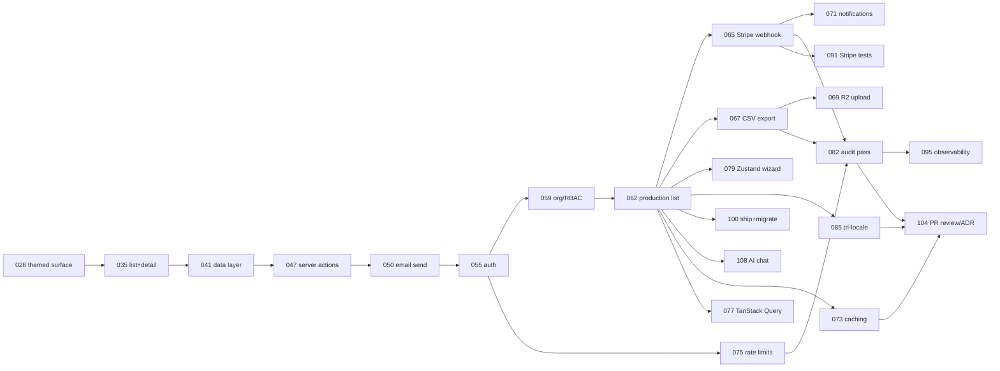

# Project dependency map

For each project chapter, the **read set** is the minimum set of upstream project repos a scaffolder agent has to read to build this project's starter. 

```mermaid
graph LR
    n028["028 themed surface"]
    n035["035 list+detail"]
    n041["041 data layer"]
    n047["047 server actions"]
    n050["050 email send"]
    n055["055 auth"]
    n059["059 org/RBAC"]
    n062["062 production list"]
    n065["065 Stripe webhook"]
    n067["067 CSV export"]
    n069["069 R2 upload"]
    n071["071 notifications"]
    n073["073 caching"]
    n075["075 rate limits"]
    n077["077 TanStack Query"]
    n079["079 Zustand wizard"]
    n082["082 audit pass"]
    n085["085 tri-locale"]
    n091["091 Stripe tests"]
    n095["095 observability"]
    n100["100 ship+migrate"]
    n104["104 PR review/ADR"]
    n108["108 AI chat"]

    n028 --> n035
    n035 --> n041
    n041 --> n047
    n047 --> n050
    n050 --> n055
    n055 --> n059
    n055 --> n075
    n059 --> n062
    n062 --> n065
    n062 --> n067
    n062 --> n079
    n062 --> n085
    n062 --> n100
    n062 --> n108
    n065 --> n071
    n065 --> n082
    n065 --> n091
    n067 --> n069
    n062 --> n073
    n067 --> n082
    n062 --> n077
    n073 --> n104
    n075 --> n082
    n082 --> n095
    n082 --> n104
    n085 --> n104
```
