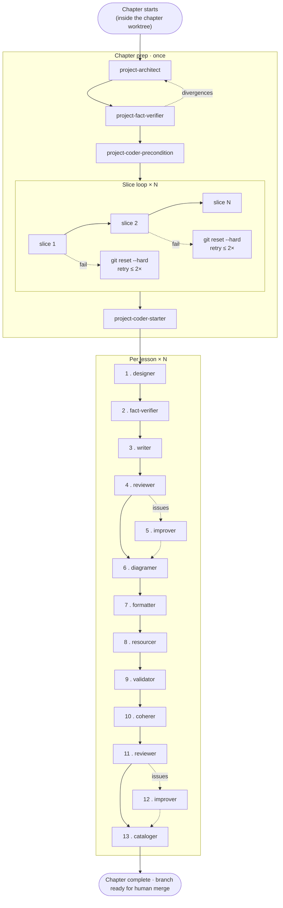

# Lessons authoring workflow

How the course's 654 lessons get written. One main agent ("orchestrator") owns a whole chapter end-to-end and runs a fixed sequence of independent subagents per lesson. Multiple chapters can be authored in parallel — each chapter orchestrator runs in its own git worktree of `react-saas-course`, on its own chapter-scoped branch, with the worktree created and torn down by Claude Code. Subagent definitions live in `.claude/agents/`.

## Files in this folder

- `Chapter orchestrator prompt.md` — prompt for the chapter-level main agent.

## Worktree root and absolute paths

Each chapter orchestrator runs inside a git worktree of this repo. Subagents spawn in fresh shells whose cwd is **not** guaranteed to be that worktree, so the orchestrator's first pre-flight step is to resolve the worktree root via `git rev-parse --show-toplevel` (call it `WT`) and then pass every path to every subagent as an absolute `<WT>/…` path, plus `worktree_root: <WT>` itself. Subagent prompts state in their *Working directory and paths* section that they must use the supplied absolute paths verbatim and never resolve relative paths against their own cwd. The path templates in this README (e.g. `documentation/lessons plan/work/Chapter <X.Y>/<lesson-slug>/lesson outline.md`) show shape relative to `WT`; the orchestrator always resolves them before passing them down.

## Lesson slug

Every lesson has one slug used in three places (working folder, MDX filename, frontmatter `slug:` / URL). The format is `<X.Y.N>-<body>` where `<body>` is the outline's lesson heading, lowercased, with every run of non-alphanumeric chars collapsed to a single `-` and leading/trailing `-` stripped. Examples (in chapter 4.4): `The box model and the inline / block axis` → `4.4.1-the-box-model-and-the-inline-block-axis`; `useState — the basics` (lesson 4.4.2) → `4.4.2-usestate-the-basics`. The `<X.Y.N>-` prefix is mandatory so the working folder, MDX file, and URL all sort in chapter order and stay unique even when two lessons share a heading.

## Two chapter shapes

**Teaching chapters** (the default).

**Project chapters**. Chapters 4.12, 5.7, 6.6, 7.6, 8.3, 9.5, 10.4, 11.3, 12.3, 13.2, 13.4, 14.2, 15.2, 15.4, 16.2, 16.4, 17.3, 18.3, 19.6, 20.4, 21.5, 22.4, 23.4. Each extends a prior project's codebase. The lesson MDX lives in this repo. The project code is built **here** during chapter prep — in `documentation/lessons plan/work/Chapter <X.Y>/code/` — and only published to the sibling `react-saas-course-projects` repo when the chapter ships.

## Per-lesson sequence — teaching chapter

Each subagent runs once, in sequence.

1. `lesson-designer` — writes the lesson outline to `documentation/lessons plan/work/Chapter <X.Y>/<lesson-slug>/lesson outline.md` (archetype, sections, diagram briefs, exercise plan, sandbox decision, code-samples plan, prerequisites not to re-teach, explicit cuts).
2. `fact-verifier` — web-searches every 2026-dated claim in the outline (versions, defaults, library status) and writes `lesson facts.md` to the working folder.
3. `lesson-drafter` — writes MDX directly to `src/content/docs/<chapter>/<lesson-slug>.mdx` with `status: draft` in the frontmatter — prose, code samples, and `[[DIAGRAM]]`, `[[TOOLTIP]]`, `[[EXERCISE]]`, `[[SANDBOX]]`, `[[VIDEO]]` placeholders. MDX without components yet.
4. `lesson-reviewer` (first pass) — audit-only. Produces a structured issue list with severity; does not edit.
5. `lesson-improver` — only if the reviewer reports any issues.
6. `lesson-diagramer` — called once per diagram, sequentially. Inline engines (Mermaid, D2, FileTree) embed in the MDX; lengthier diagrams get a custom Astro component at `src/components/lessons/<chapter>/<lesson-slug>/<n>.astro` and an import.
7. `lesson-formatter` — adds MDX components (asides, cards, tooltips, code variants, tabs, file trees, etc.) where the prose calls for them. Does not touch wording, code, structure, or diagrams.
8. `lesson-exerciser` — replaces `[[EXERCISE]]` and `[[SANDBOX]]` placeholders with real components (live-coding, interactive, sandboxes).
9. `lesson-resourcer` — replaces `[[VIDEO]]` placeholders with `VideoCallout` components and adds `LinkCard`s at the end of the lesson for external resources.
10. `lesson-coherer` — single final edit pass for flow, voice, and removed seams between previous agents' contributions. Flips the frontmatter to `status: formatted`.
11. `lesson-reviewer` (second pass) — audit-only.
12. `lesson-improver` — only if the reviewer reports any issues.
13. `lesson-cataloger` — fired after the orchestrator accepts the lesson. Reads the final MDX and writes `lesson concepts.md` to the working folder.

The orchestrator reads each reviewer report and decides:

- No issues → continue (or, after the second pass, mark the lesson complete and move on).
- Any issues → fire `lesson-improver` with the exact issues passed inline. The orchestrator does not re-fire upstream subagents.

## Per-lesson sequence — project chapter

Project lessons walk the student through code that has to exist and pass tests *before* the prose can describe it. Chapter-level prep builds the code; the per-lesson sequence then walks each lesson over it.

### Chapter-level prep (run once at the start of the chapter)

All chapter-prep work — code and lesson MDX — happens inside the chapter worktree, on the chapter's branch. The orchestrator does no branch or worktree setup; Claude Code provisioned both before the orchestrator started.

1. `project-architect` — plans the project's full solution and the precondition state it's built from. Writes the project code plan to `documentation/lessons plan/work/Chapter <X.Y>/project code plan.md`. The plan contains the precondition recipe, every build slice (with full solution-side file content **and** stub-contract bodies), lesson tagging (precondition / slice / verify walkthrough), and acceptance criteria.
2. `project-fact-verifier` — web-searches every 2026-dated technical claim in the plan (library versions, API shapes, install commands). Writes `project facts.md`. If divergences are flagged, the orchestrator may re-fire `project-architect` once.
3. `project-coder-precondition` — initializes the working code directory at `documentation/lessons plan/work/Chapter <X.Y>/code/` per the plan's precondition recipe (fork prior project, or scaffold-fresh for Chapter 4.12). Applies precondition deltas, copies canonical configs from `documentation/code standards/configs/`, runs install/build/lint, and commits as `precondition` on the chapter worktree's branch.
4. `project-slice-coder` — runs **once per build slice in the plan**, sequentially. Each invocation applies one slice's code, runs that slice's "Runnable after" verify, runs lint/build, and commits as `slice <id>` on the chapter worktree's branch. On lint/build/verify failure: orchestrator runs `git reset --hard HEAD` and re-fires the same slice coder with the failure inline. Cap 2 retries per slice; escalate to human after.
5. `project-coder-starter` — derives the starter mechanically from the precondition commit's tree plus every slice's **stub contract**. Writes `documentation/lessons plan/work/Chapter <X.Y>/starter/`. Verifies install/build/lint. Commits on the chapter worktree's branch.

The per-slice diff lives in git history on the chapter worktree's branch — no separate diff-log file is generated. Downstream agents (lesson designer, writer, validator) read the **project code plan** for slice specs and the **working code directory at HEAD** for the realized state.

### Per project lesson (run once per lesson in the chapter)

1. `project-lesson-designer` — reads the lesson's **type** from the plan's lesson tagging (`precondition walkthrough` / `slice walkthrough` / `verify walkthrough`) and writes the outline to `documentation/lessons plan/work/Chapter <X.Y>/<lesson-slug>/lesson outline.md`.
2. `fact-verifier` — same as teaching.
3. `project-lesson-writer` — writes MDX with `status: draft`, branching on the lesson type. Slice walkthroughs match the project plan's slice spec and the working code at HEAD; precondition walkthroughs tour the starter; verify walkthroughs walk the chapter's acceptance criteria.
4. `lesson-reviewer` (first pass).
5. `lesson-improver` — only if issues.
6. `lesson-diagramer` — once per diagram in the outline (project lessons rarely have any).
7. `lesson-formatter`.
8. `lesson-resourcer` (no exerciser — the project is the exercise).
9. `project-validator` — branches on the lesson type. Re-checks lesson prose and code blocks against the project plan's slice specs and the working code and starter directories. Re-runs this lesson's acceptance criteria (slice and verify walkthroughs). Reports drift inline; does not edit.
10. `lesson-coherer` — flips frontmatter to `status: formatted`.
11. `lesson-reviewer` (second pass).
12. `lesson-improver` — only if issues.
13. `lesson-cataloger` — fired after the orchestrator accepts the lesson.

Same triage as teaching chapters. Drift from `project-validator` goes to `lesson-improver` via the next reviewer pass; only `lesson-improver` is fired on issues.

## End-of-chapter step

For teaching chapters (except unit 1), after every lesson in the chapter is complete, the orchestrator fires `quiz-maker` once (subject to §7 of the pedagogical guidelines). Project chapters do not get a quiz — the project itself is the assessment.

After the last lesson of a chapter is reviewed and accepted, the chapter worktree's branch is ready to merge into `main`. Merging — and tearing down the worktree afterwards — is a human-curator step. The branch carries the lesson MDX, the working code (project chapters), the derived starter (project chapters), the project plan, the project facts, and any quiz output — all of it together.

## Frontmatter status flow

Every lesson MDX carries a `status` field that progresses through four values:

| Status | Set by | When |
| --- | --- | --- |
| `draft` | `lesson-drafter` / `project-lesson-writer` | after the initial write |
| `formatted` | `lesson-coherer` | after coherer finishes its pass |
| `reviewed` | orchestrator | after the second review clears and any improver runs are done |
| `final` | human curator | manually, outside this workflow |

## Working files vs. final files

The lesson MDX lives at:

```
src/content/docs/<chapter>/<lesson-slug>.mdx
```

Custom diagram components (SVG, HTML/CSS, ArrowDiagram authored for a specific lesson) live at:

```
src/components/lessons/<chapter>/<lesson-slug>/<n>.astro
```

For project chapters, the project code is built during prep at:

```
documentation/lessons plan/work/Chapter <X.Y>/code/      — working solution, slice commits live on the chapter worktree's branch
documentation/lessons plan/work/Chapter <X.Y>/starter/   — derived starter, one commit on the chapter worktree's branch
```

When the chapter ships, these two directories get copied to the sibling `react-saas-course-projects` repo at `<project-id>/{starter,solution}/` (e.g. `7.6-server-actions/`) for student `degit` access. Publication is a human-curator step.

Each lesson has a working folder for intermediate artifacts:

```
documentation/lessons plan/work/Chapter <X.Y>/<lesson-slug>/
  lesson outline.md     — lesson-designer / project-lesson-designer output
  lesson facts.md       — fact-verifier output
  lesson review.md      — lesson-reviewer output (second pass overwrites first)
  lesson concepts.md    — lesson-cataloger output (concept ledger)
```

Project chapters also have chapter-level artifacts:

```
documentation/lessons plan/work/Chapter <X.Y>/
  project code plan.md  — project-architect output (precondition + slices + stub contracts + lesson tagging)
  project facts.md      — project-fact-verifier output
  code/                 — working solution directory (slice history on the chapter worktree's branch — `git log -p` if you want per-slice diffs)
  starter/              — derived starter directory
```

## Lesson tags — project chapters

Every lesson in a project chapter gets a tag from the project plan that determines its shape:

- `precondition walkthrough` — tours the project brief or the starter. No slice mapping. No acceptance criteria check.
- `slice walkthrough: <ids>` — walks one or more named build slices. Code blocks match the plan's slice spec (cross-checked against the working code at HEAD); verify steps match the slice's "Runnable after."
- `verify walkthrough` — walks the chapter's acceptance criteria. No new code beyond reminders. Re-runs all criteria against the solution.

The designer reads the tag and picks the outline shape. The writer reads the tag and picks the MDX shape. The validator reads the tag and picks the verification mode.

## Git mechanics — chapter worktree

The orchestrator does its git commits inside a chapter worktree of `react-saas-course`, on a chapter-scoped branch. Slice coders, the precondition coder, and the starter coder each `git add` + `git commit` their own work in the same worktree; everything else (commit decisions, resetting on slice failure, log-extracting) is the orchestrator's job.

- **Worktree:** one git worktree per chapter, created by Claude Code before the orchestrator starts and torn down by the human curator after merge. The orchestrator never runs `git worktree add` or `git worktree remove` itself, and never runs `git checkout` to switch branches. All of the chapter's commits — lesson MDX, project code, derived starter — land on the single chapter branch attached to this worktree.
- **Parallelism:** multiple chapter orchestrators may run concurrently in sibling worktrees off `main`. Worktrees do not see each other's uncommitted state. Inter-chapter code dependencies (e.g. a project chapter that extends a prior project) require that the prior chapter has already been merged to `main` before the dependent chapter's worktree is created.
- **Slice retry on failure:** when a slice coder reports blocked, orchestrator runs `git reset --hard HEAD` and re-fires the same slice coder with the failure output appended. Cap 2 retries per slice. The reset is local to the chapter worktree and does not affect any other worktree.
- **Per-slice diffs on demand:** the slice history lives in the chapter branch's git log. If you ever want a per-slice diff, run `git log -p <precondition-sha>..HEAD -- "documentation/lessons plan/work/Chapter <X.Y>/code/"` from inside the worktree. No diff-log file is materialized — downstream agents read the plan's slice specs for what should be there and the working code at HEAD for what is.
- **Chapter completion:** when every lesson is reviewed, the branch is ready for human curation. The merge (squash or keep history) and worktree teardown (`git worktree remove`, `git branch -d`) are the human's choices.

No nested `.git/` directories. The worktree's `.git` is a pointer file into the main repo's git directory; the published projects repo only receives finished `starter/` and `solution/` copies and never sees the slice commits.

## Concept ledger — keeping lessons from re-teaching each other

After each completed lesson, the orchestrator fires `lesson-cataloger`. It reads the final MDX and every prior completed lesson's `lesson concepts.md` in the chapter, then writes a short ledger entry to `documentation/lessons plan/work/Chapter <X.Y>/<lesson-slug>/lesson concepts.md` noting what *this* lesson newly taught (concepts introduced, terms newly defined, patterns shown, code domain). Reading the prior ledgers lets the cataloger distinguish concepts this lesson introduced from ones it merely restated. The next lesson's designer reads every prior completed lesson's concepts file and treats anything in any of them as a prerequisite — referenced in one line with a link, not re-taught.

## What every subagent gets, by default

- `AGENTS.md` (the project's root brief) — always.
- `documentation/code standards/Code conventions.md` — every subagent that writes code or audits code.
- Specific docs named in each subagent's prompt — deliberately minimal. Subagents do not read the full pedagogical guidelines unless their job depends on it. The orchestrator and the designer carry the global view; downstream agents work from the outline.

Subagents that read or write the per-lesson or per-chapter working folder directly: `lesson-designer`, `project-lesson-designer`, `fact-verifier`, `project-fact-verifier`, `lesson-drafter`, `project-lesson-writer`, `lesson-reviewer`, `lesson-diagramer`, `lesson-exerciser`, `lesson-resourcer`, `lesson-cataloger`, `quiz-maker`, `project-coder-precondition`, `project-slice-coder`, `project-coder-starter`, `project-validator`. Every other subagent receives the file paths and information it needs in its input prompt from the orchestrator.

## What every subagent reports back, by default

A short chat message to the orchestrator with:

- One-line status (complete / blocked / needs decision)
- Path(s) to files written or modified
- Anything the orchestrator needs to know to fire the next subagent (e.g., the drafter reports how many placeholders of each kind it placed if it diverged from the outline; the slice coder reports its commit SHA so the orchestrator knows what to reset to on the next slice's failure).

## Workflow at a glance

### Teaching chapter

Dashed arrows mark the conditional `lesson-improver` step — only fired when the preceding reviewer reports issues.


### Project chapter


