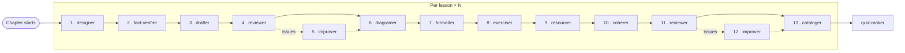

# Lessons authoring workflow

How the course's 654 lessons get written. One main agent ("orchestrator") owns a whole chapter end-to-end and runs a fixed sequence of independent subagents per lesson. Subagent definitions live in `.claude/agents/`.

## Files in this folder

- `Chapter orchestrator prompt.md` — prompt for the chapter-level main agent.

## Two chapter shapes

**Teaching chapters** (the default).

**Project chapters**. Chapters 4.12, 5.7, 6.6, 7.6, 8.3, 9.5, 10.4, 11.3, 12.3, 13.2, 13.4, 14.2, 15.2, 15.4, 16.2, 16.4, 17.3, 18.3, 19.6, 20.4, 21.5, 22.4, 23.4. Each extends a prior project's codebase. The lesson lives in this repo; the code in the `react-saas-course-projects` repo.

## Per-lesson sequence — teaching chapter

Each subagent runs once, in sequence.

1. `lesson-designer` — writes the lesson outline to `documentation/lessons plan/work/Chapter <X.Y>/<lesson-slug>/lesson outline.md` (archetype, sections, diagram briefs, exercise plan, sandbox decision, code-samples plan, prerequisites not to re-teach, explicit cuts).
2. `fact-verifier` — web-searches every 2026-dated claim in the outline (versions, defaults, library status) and writes `lesson facts.md` to the working folder.
3. `lesson-drafter` — writes MDX directly to `src/content/docs/<chapter>/<lesson-slug>.mdx` with `status: draft` in the frontmatter — prose, code samples, and `[[DIAGRAM]]`, `[[TOOLTIP]]`, `[[EXERCISE]]`, `[[SANDBOX]]`, `[[VIDEO]]` placeholders. MDX without components yet.
4. `lesson-reviewer` (first pass) — audit-only. Produces a structured issue list with severity; does not edit.
5. `lesson-improver` — only if the reviewer reports any issues.
6. `lesson-diagramer` — called once per diagram, sequentially. Inline engines (Mermaid, D2, FileTree) embed in the MDX; lengthier diagrams get a custom Astro component at `src/components/lessons/<chapter>/<lesson-slug>/<n>.astro` and an import.
7. `lesson-formatter` — adds MDX components (asides, cards, tooltips, code variants, tabs, file trees, etc.) where the prose calls for them. Does not touch wording, code, structure, or diagrams.
8. `lesson-exerciser` — replaces `[[EXERCISE]]` and `[[SANDBOX]]` placeholders with real components (live-coding, interactive, sandboxes).
9. `lesson-resourcer` — replaces `[[VIDEO]]` placeholders with `VideoCallout` components and adds `LinkCard`s at the end of the lesson for external resources.
10. `lesson-coherer` — single final edit pass for flow, voice, and removed seams between previous agents' contributions. Flips the frontmatter to `status: formatted`.
11. `lesson-reviewer` (second pass) — audit-only.
12. `lesson-improver` — only if the reviewer reports any issues.
13. `lesson-cataloger` — fired after the orchestrator accepts the lesson. Reads the final MDX and writes `lesson concepts.md` to the working folder.

The orchestrator reads each reviewer report and decides:

- No issues → continue (or, after the second pass, mark the lesson complete and move on).
- Any issues → fire `lesson-improver` with the exact issues passed inline. The orchestrator does not re-fire upstream subagents.

## Per-lesson sequence — project chapter

Project lessons walk the student through code that has to exist and pass tests *before* the prose can describe it. Three chapter-level subagents prep the code, then the per-lesson sequence runs for each lesson.

### Chapter-level prep (run once at the start of the chapter)

1. `project-architect` — plans the project's starter and solution codebases, writing the plan to `documentation/lessons plan/work/Chapter <X.Y>/project code plan.md` (surface, starting point, starter state, solution state, ordered build slices mapped to the chapter outline's lesson breakdown, file change list, acceptance criteria).
2. `project-coder-starter` — writes `../react-saas-course-projects/<project-id>/starter/`. Verifies install/build/lint pass.
3. `project-coder-solution` — writes `../react-saas-course-projects/<project-id>/solution/` and a chapter-level diff log at `documentation/lessons plan/work/Chapter <X.Y>/diff-log.md` paired slice-by-slice with the project code plan.

### Per project lesson (run once per lesson in the chapter)

1. `project-lesson-designer` — writes the lesson outline to `documentation/lessons plan/work/Chapter <X.Y>/<lesson-slug>/lesson outline.md` naming which build slices this lesson covers, the senior decisions per slice, code blocks to show (matched to the diff log), prerequisites not to re-teach.
2. `fact-verifier` — same as teaching.
3. `project-lesson-writer` — writes MDX with `status: draft`, walking the slices this lesson covers, matching the diff log exactly.
4. `lesson-reviewer` (first pass).
5. `lesson-improver` — only if issues.
6. `lesson-diagramer` — once per diagram in the outline (project lessons rarely have any).
7. `lesson-formatter`.
8. `lesson-resourcer` (no exerciser — the project is the exercise).
9. `project-validator` — re-checks that the lesson's prose and code blocks match the actual starter→solution code and re-runs this lesson's acceptance criteria. Reports drift inline; does not edit.
10. `lesson-coherer` — flips frontmatter to `status: formatted`.
11. `lesson-reviewer` (second pass).
12. `lesson-improver` — only if issues.
13. `lesson-cataloger` — fired after the orchestrator accepts the lesson.

Same triage as teaching chapters. Drift from `project-validator` goes to `lesson-improver` via the next reviewer pass; only `lesson-improver` is fired on issues.

## End-of-chapter step

For teaching chapters (except unit 1), after every lesson in the chapter is complete, the orchestrator fires `quiz-maker` once (subject to §7 of the pedagogical guidelines). Project chapters do not get a quiz — the project itself is the assessment.

## Frontmatter status flow

Every lesson MDX carries a `status` field that progresses through four values:

| Status | Set by | When |
| --- | --- | --- |
| `draft` | `lesson-drafter` / `project-lesson-writer` | after the initial write |
| `formatted` | `lesson-coherer` | after coherer finishes its pass |
| `reviewed` | orchestrator | after the second review clears and any improver runs are done |
| `final` | human curator | manually, outside this workflow |

## Working files vs. final files

The lesson MDX lives at:

```
src/content/docs/<chapter>/<lesson-slug>.mdx
```

Custom diagram components (SVG, HTML/CSS, ArrowDiagram authored for a specific lesson) live at:

```
src/components/lessons/<chapter>/<lesson-slug>/<n>.astro
```

For project chapters, starter and solution code go to the sibling repo at `../react-saas-course-projects/<project-id>/{starter,solution}/`.

Each lesson has a working folder for intermediate artifacts:

```
documentation/lessons plan/work/Chapter <X.Y>/<lesson-slug>/
  lesson outline.md     — lesson-designer / project-lesson-designer output
  lesson facts.md       — fact-verifier output
  lesson review.md      — lesson-reviewer output (second pass overwrites first)
  lesson concepts.md    — lesson-cataloger output (concept ledger)
```

Project chapters also have chapter-level artifacts:

```
documentation/lessons plan/work/Chapter <X.Y>/
  project code plan.md  — project-architect output (starter + solution plan, build slices)
  diff-log.md           — project-coder-solution output, shared across all lessons
```

## Concept ledger — keeping lessons from re-teaching each other

After each completed lesson, the orchestrator fires `lesson-cataloger`. It reads the final MDX and writes a short ledger entry to `documentation/lessons plan/work/Chapter <X.Y>/<lesson-slug>/lesson concepts.md` noting what was actually taught (concepts introduced, terms newly defined, patterns shown, code domain). The next lesson's designer reads every prior completed lesson's concepts file and treats anything in any of them as a prerequisite — referenced in one line with a link, not re-taught.

## What every subagent gets, by default

- `AGENTS.md` (the project's root brief) — always.
- Specific docs named in each subagent's prompt — deliberately minimal. Subagents do not read the full pedagogical guidelines unless their job depends on it. The orchestrator and the designer carry the global view; downstream agents work from the outline.

Only three subagents access the working folder: `fact-verifier`, `lesson-drafter`, `lesson-reviewer`. Every other subagent receives the file paths and information it needs in its input prompt from the orchestrator.

## What every subagent reports back, by default

A short chat message to the orchestrator with:

- One-line status (complete / blocked / needs decision)
- Path(s) to files written or modified
- Anything the orchestrator needs to know to fire the next subagent (e.g., the drafter reports how many placeholders of each kind it placed if it diverged from the outline).

## Workflow at a glance

### Teaching chapter

Dashed arrows mark the conditional `lesson-improver` step — only fired when the preceding reviewer reports issues.



### Project chapter

```mermaid
flowchart LR
  Start([Chapter starts]) --> A
  subgraph Prep["Chapter prep · once"]
    direction LR
    A[project-architect] --> St[project-coder-starter] --> So[project-coder-solution]
  end
  So --> D
  subgraph PerLesson["Per lesson × N"]
    direction LR
    D[1 . designer] --> F[2 . fact-verifier] --> W[3 . writer] --> R1[4 . reviewer] --> Di[6 . diagramer] --> Fm[7 . formatter] --> Res[8 . resourcer] --> V[9 . validator] --> Co[10 . coherer] --> R2[11 . reviewer] --> Cat[13 . cataloger]
    R1 -. issues .-> Im1[5 . improver]
    Im1 -.-> Di
    R2 -. issues .-> Im2[12 . improver]
    Im2 -.-> Cat
  end
  Cat --> Done([Chapter complete])
```


