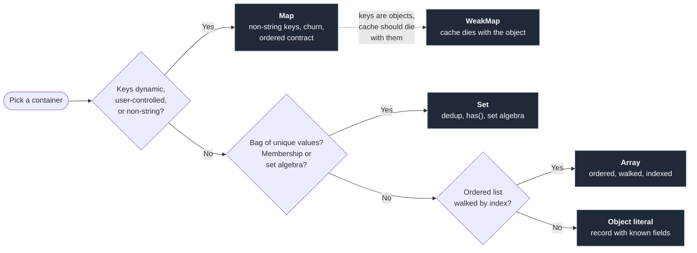

import Term from '../../../components/ui/Term.astro';
import ExternalResource from '../../../components/ui/ExternalResource.astro';
import Figure from '../../../components/figures/Figure.astro';
import CodeVariants from '../../../components/code/code-variants/CodeVariants.astro';
import CodeVariant from '../../../components/code/code-variants/CodeVariant.astro';
import Buckets from '../../../components/exercises/buckets/Buckets.astro';
import Bucket from '../../../components/exercises/buckets/Bucket.astro';
import Item from '../../../components/exercises/buckets/Item.astro';
import VideoCallout from '../../../components/embeds/VideoCallout.astro';
import { CardGrid } from '@astrojs/starlight/components';
import CourseProgressBar from '../../../components/ui/CourseProgressBar.astro';

<CourseProgressBar value={frontmatter['course-progress']} />

Here are three bugs from three teams, all caused by the same mistake: each kept using `{}` or `[]` after the container stopped fitting the shape of the data.

```ts
const cache: Record<string, User> = {};
const user = cache[userInput];
user.name;
```

The first bug uses a `{}` as a lookup table with user-controlled keys. Most of the time `cache[userInput]` returns a `User` or `undefined`, exactly as the type says. But when `userInput === 'toString'`, the property comes not from `cache` but from `Object.prototype`, which every object literal inherits from. The lookup returns a built-in function, the next line reads `.name` on it, and production logs a `TypeError`. The previous lesson on objects gave `Object.hasOwn` as the defensive read; the step beyond it is to avoid `{}` entirely when the keyspace is user-controlled.

```ts
const watchedCustomerIds: string[] = [/* 200 ids */];
const flagged = bigInvoices.filter((i) =>
  watchedCustomerIds.includes(i.customerId),
);
```

The second bug is the one the previous lesson on array methods left hanging. With `bigInvoices.length === 10_000` and `watchedCustomerIds.length === 200`, the inner `.includes` walks the watch list once per invoice: two million comparisons for what should be one pass. The result is correct, so the bug stays silent until the dataset grows. The fix is to recognize `.includes` inside a `.filter` callback and reach for `Set` instead.

```ts
const selected = new Map([['inv_1', invoice]]);
await fetch('/api/save', {
  method: 'POST',
  body: JSON.stringify({ selected }),
});
```

The third bug looks fine until you read the request body on the server. `JSON.stringify(new Map([...]))` returns `'{}'`. The map's data vanishes the moment it crosses the wire, with no error and an empty object on the other side, because `JSON.stringify` can't see the internal slots a `Map` stores its entries in.

All three share one fix: pick a container that matches the shape of the data. The previous lessons established the object literal as the everyday record and the array as the ordered list. This lesson adds `Set` and `Map`, plus `WeakMap` for one narrow case, and the signals that tell you when to reach for each.

## How to choose a container

The container to reach for isn't the most powerful one. It's the one that matches the shape of this data and the operation that dominates it. Three questions settle the choice across four containers.

<Figure caption="Pick the container by trigger, not by power.">

</Figure>

Object literals hold records with known string-keyed fields, where the shape is the contract. Arrays hold ordered lists you walk by index. `Set` enters when the collection is a bag of unique values and membership or set algebra is the operation that matters. `Map` enters when you're building a dictionary: the keys aren't fixed strings, or insertion and deletion are frequent, or insertion order matters as part of a contract the reader can rely on.

Two terms anchor the rest of the lesson. A *record* has a fixed shape, like `{ id, email, name }`, and the object literal is its container. A *dictionary* has a dynamic keyspace, where which keys are present is part of the data rather than the type, and `Map` is its container. The phrase "I have a JavaScript object" blurs the two, so before picking a container, ask which one you actually have.

<VideoCallout videoId="De6JOU9yaGM" videoTitle="You Should Use Maps and Sets in JS">
  CJ on Syntax (14 min) walks the same triggers: the prototype-key trap on objects, when `Map` beats `{}`, and the `Array.includes` slowdown that earns `Set`.
</VideoCallout>

## Set: dedup, membership, and algebra

`Set` is a collection of unique values. It has no keys, no order beyond insertion order, and no payload. It answers two questions: is this value in the set, and what are all the values? Three triggers earn it.

### Dedup

The canonical idiom. Wrap an array in `new Set(...)` to keep only its unique values, then `Array.from(...)` to get an array back:

```ts
const customerIds = ['cus_1', 'cus_2', 'cus_1', 'cus_3', 'cus_2'];
const uniqueIds = Array.from(new Set(customerIds));
```

`Set` decides "same value" using <Term definition={"JavaScript's equality semantics for Map keys and Set values: like ===, except NaN matches NaN. Two distinct objects are never equal even if their fields are identical — equality is by reference, not by shape."}>SameValueZero</Term>, like `===` except that `NaN` matches `NaN`. Because that equality is by reference, two distinct object literals are never equal even when their fields look identical. This form deduplicates primitives; deduplicating objects needs a key function and a different pattern.

### Membership inside a loop

The trigger from the lesson opener. `Array.prototype.includes` walks the array until it finds a match, `O(n)` per call; `Set.prototype.has` is `O(1)` on average. When a membership check sits inside another loop, those costs multiply.

The fix is one line: build the `Set` once outside the loop, then run `.has` inside.

<CodeVariants>
  <CodeVariant label="Naive — O(n × m)">
    <div data-mark-color="red">

    ```ts "watchedCustomerIds.includes(i.customerId)"
    const flagged = bigInvoices.filter((i) =>
      watchedCustomerIds.includes(i.customerId),
    );
    ```

    </div>
    **One walk per invoice over the entire watch list.** With 10,000 invoices and 200 watched ids, `.includes` walks the watch list once per invoice: roughly two million comparisons before `.filter` returns.
  </CodeVariant>

  <CodeVariant label="Set-fronted — O(n + m)">
    <div data-mark-color="green">

    ```ts "new Set(watchedCustomerIds)" "watched.has(i.customerId)"
    const watched = new Set(watchedCustomerIds);
    const flagged = bigInvoices.filter((i) => watched.has(i.customerId));
    ```

    </div>
    **Build the `Set` once, `.has`-check inside.** One walk over the 200 ids to build the `Set`, one walk over the 10,000 invoices with constant-time `.has` inside: roughly 10,200 operations, two orders of magnitude faster.
  </CodeVariant>
</CodeVariants>

In code review, watch for any membership check sitting inside another walk: `.filter(x => other.includes(...))`, `.map(x => ... && other.includes(...))`, or a `for...of` loop with `.includes` in its body. Build a `new Set(other)` outside the walk and the inner check becomes constant time.

### Set algebra

As of ES2025, `Set` ships seven composition methods natively, available across current browsers and Node. Four return a new `Set`:

- **`a.union(b)`**: elements in either.
- **`a.intersection(b)`**: elements in both.
- **`a.difference(b)`**: in `a` but not `b`.
- **`a.symmetricDifference(b)`**: in exactly one (the XOR).

Three return a boolean:

- **`a.isSubsetOf(b)`**: every element of `a` is in `b`.
- **`a.isSupersetOf(b)`**: every element of `b` is in `a`.
- **`a.isDisjointFrom(b)`**: they share no elements.

The names tell you what each call does:

```ts
const activeIds = new Set(activeInvoiceIds);
const flaggedIds = new Set(flaggedInvoiceIds);

const needsReview = activeIds.intersection(flaggedIds);
const safeToArchive = activeIds.difference(flaggedIds);
const overlap = !activeIds.isDisjointFrom(flaggedIds);
```

These replace the older `arr.filter(x => other.has(x))` workaround and the `lodash` set helpers, so you no longer need either.

The operand doesn't have to be a `Set`. The methods accept any **set-like** object: anything with `.size`, `.has(value)`, and `.keys()`. A `Map` qualifies, since `.keys()` provides the iteration, so `mySet.intersection(myMap)` works.

<VideoCallout videoId="xHqHgIdEWds" videoTitle="New TypeScript Set Methods in ES2025 - Explained In Detail">
  Typed Rocks (11 min) demos all seven ES2025 methods in TypeScript, including the array-conversion workaround they replace and the set-like operand.
</VideoCallout>

## The everyday Set surface

The full surface in one block: construct, mutate, query, iterate, read the size.

```ts
const selected = new Set<string>();
selected.add('inv_1');
selected.add('inv_2').add('inv_1');
selected.has('inv_1');
selected.delete('inv_3');
selected.size;
for (const id of selected) {
  console.log(id);
}
const fromIter = new Set(['a', 'b', 'a']);
```

Write the generic at construction: from an empty initializer TypeScript can't infer the element type, so `new Set<string>()` saves you a useless `Set<unknown>`. `.add` returns the set, so calls chain; `.delete` returns `true` when it removed something. `for...of` yields the values, no index or key, and the constructor takes any iterable, which is what powers the dedup idiom.

`.add` and `.delete` mutate in place, fine for a set you own inside a function. A set held in React state is shared, so you replace it instead: `setSelected(new Set(selected).add(id))`, the same ownership rule as `.push` versus `[...arr, x]`.

## Map: non-string keys, churn, ordered contract

`Map` is `Set`'s richer cousin: every entry has a key *and* a value, and keys can be any type. Three triggers earn it.

### Non-string keys

Plain objects coerce every key to a string. Write `obj[42]` and JavaScript stores it under `"42"`. Write `obj[someDate]` and it stores it under `someDate.toString()`, something like `"Mon Jan 01 2026 00:00:00 GMT+0000"`. So two `Date` instances on the same day collide, two distinct objects with identical shapes collide, and the original key type is lost.

`Map` keeps the key as the original value, identity and type intact:

```ts
const outstandingByCustomer = new Map<Customer, number>();
outstandingByCustomer.set(customer, 4_200);
outstandingByCustomer.get(customer);
```

`Map` keys use the same SameValueZero equality as `Set`, which is by reference for objects. Two distinct object literals with identical fields are *different* keys, so you must hand the same customer instance to both `.set` and `.get` for the lookup to land.

In production you'd usually key by the customer's `id` string, not the object. Object keys are for cases where the instance's identity is the point, such as DOM nodes, React elements, or parsed AST nodes, the canonical example being the `WeakMap` section below.

### Frequent insert and delete

`Map` is a <Term definition={"A data structure that stores key-value entries so lookup, insert, and delete are all roughly constant-time regardless of how many entries it holds, by computing each key's storage location from the key itself."}>hash table</Term> built for churn. Plain objects are optimized differently: V8 tracks each object's shape, and frequent adds and deletes break that optimization and drop the object into a slower fallback mode. `Map` has no such failure mode.

So if adding and removing entries is the operation that dominates a container's lifetime, reach for `Map`. Choosing it also signals to the reader that churn is expected.

### Insertion-ordered iteration

Both `Map` and plain objects iterate in insertion order; the difference is what *guarantees* it. `Map` promises insertion order in the specification, so every implementation must deliver it. Objects deliver it only by engine convention, with edge cases around integer-string keys. When the contract is *"process these in the order they were added,"* reach for `Map`.

```ts
const recent = new Map<string, Invoice>();
recent.set('inv_3', latest);
recent.set('inv_1', older);
recent.set('inv_2', oldest);

for (const [id, invoice] of recent) {
  console.log(id, invoice.amountCents);
}
```

The `for...of` here yields `[key, value]` pairs, the destructure-in-the-binding form from the array lesson applied to a `Map`. That two-element shape is the clearest visual difference from a `Set`, which yields just values.

### Map.groupBy

The previous lesson introduced `Object.groupBy(items, keyFn)` for grouping an array by a string key, like invoices by status. `Map.groupBy` is its non-string-key cousin: same signature, but it returns a `Map` and the key can be any type. It's widely available across current browsers and Node.

```ts
const invoicesByDueDate = Map.groupBy(invoices, (i) => i.dueDate);
```

`invoicesByDueDate` is `Map<Date, Invoice[]>`, keyed by the actual `Date` instance. With `Object.groupBy`, every `Date` collapses to a string like `"Mon Jan 01 2026 ..."`, so days that stringify the same collide and date-arithmetic code has to re-parse the string.

The `Date`-as-object-key caveat from above still applies: two invoices built with separate `new Date(...)` calls land in *different* groups even for the same instant. To avoid it, key by an ISO date string (`i.dueDate.toISOString().slice(0, 10)`) with `Object.groupBy` when downstream code wants strings, and use the `Date` key when it needs date arithmetic.

The rule pairing the two statics: string keys go to `Object.groupBy`, anything else to `Map.groupBy`.

## The Map surface and why .get can return undefined

Here is the everyday `Map` API in one block:

```ts
const byId = new Map<string, Invoice>();
byId.set('inv_1', invoice);
byId.set('inv_2', other).set('inv_3', third);
byId.get('inv_1');
byId.has('inv_99');
byId.delete('inv_2');
byId.size;
for (const [id, invoice] of byId) {
  console.log(id, invoice.amountCents);
}
byId.keys();
byId.values();
byId.entries();
const fromPairs = new Map([
  ['a', 1],
  ['b', 2],
]);
```

The shape matches `Set`'s surface. The differences: `.set(key, value)` replaces `.add(value)`, `.get(key)` returns the value or `undefined`, `for...of` yields `[key, value]` pairs, and the three iterator views are `.keys()`, `.values()`, and `.entries()`.

### Map.get always returns V | undefined

Even when the map is typed `Map<string, Invoice>`, `.get(k)` returns `Invoice | undefined`, never just `Invoice`. The type tells you what a value will be when it exists; whether a given key is present is runtime information the compiler can't have.

This is the same discipline <Term definition={"A TypeScript flag the course turns on. With it, indexing an array returns T | undefined instead of T, because the index might be out of bounds at runtime. The senior reflex is to handle the undefined explicitly."}>noUncheckedIndexedAccess</Term> imposes on array indexing: `arr[i]` returns `T | undefined`, not `T`, because the compiler doesn't know whether the index is in bounds.

Handle the miss one of two ways. When a default makes sense, use the `??` fallback, the most common choice:

```ts
const invoice = byId.get(id) ?? emptyInvoice;
```

When there's no sensible default and absence has to short-circuit the rest of the function, bind the value and narrow it:

```ts
const invoice = byId.get(id);
if (invoice === undefined) return;
invoice.amountCents;
```

After the guard, TypeScript narrows `invoice` to `Invoice`, so `.amountCents` reads cleanly. It's the same pattern you'd use after `arr[0]` under the strict indexing flag.

You'll sometimes see `.has(k)` then `.get(k)`: check first, then read. That works, but it's two lookups instead of one. Prefer `.get` plus a null check.

## WeakMap and WeakSet: per-object data the garbage collector reclaims

`WeakMap` is the rare one among the everyday containers. Reach for it only when one exact trigger fires and nothing else fits.

The difference from `Map` is one word: *weakly*. A `WeakMap` holds its keys weakly, so once the only thing referencing a key is its own `WeakMap` entry, the <Term definition={"The part of the JavaScript engine that automatically frees memory holding objects nothing references anymore, so you never free memory by hand."}>garbage collector</Term> reclaims that entry and the cached value goes with it.

Two constraints follow. Keys must be objects, never primitives, since a string can't be held weakly. And a `WeakMap` has no iteration and no `.size`: entries can vanish at any moment, so any count or traversal would be stale the instant you read it.

The trigger that earns it: caching computed metadata per object, where the cache must not keep that object alive.

```ts
const measurements = new WeakMap<HTMLElement, DOMRect>();

const getRect = (el: HTMLElement): DOMRect => {
  const cached = measurements.get(el);
  if (cached) return cached;
  const rect = el.getBoundingClientRect();
  measurements.set(el, rect);
  return rect;
};
```

This is the canonical shape: the keys are DOM elements, the values their measured bounding rectangles. Once an element leaves the DOM and no other code references it, its entry is reclaimed for you, with no `.delete` to call and no leak to chase.

The DOM element is just an example. Swap it for any object whose lifetime you don't fully control, such as a React element, a parsed AST node, or a request object, and the pattern is identical.

`WeakSet` is the set cousin: the same weak keys, no values. It fits "have I already processed this object?" checks that shouldn't keep the object alive.

You may meet one legacy use in older code: holding private per-instance state in a `WeakMap`. Today a class private field (`#field`) is the modern way to do that.

<VideoCallout videoId="WqNqeMjd28I" videoTitle="Only The Best Developers Understand How This Works" start="13:55">
  Web Dev Simplified clears a real memory leak with `WeakMap` in Chrome DevTools, showing this section's garbage-collection coupling in heap snapshots. Start at 13:55; a couple of minutes is enough.
</VideoCallout>

## Map and Set don't survive `JSON.stringify`

`JSON.stringify(new Map([['k', 1]]))` returns `'{}'`, and so does `JSON.stringify(new Set([1, 2, 3]))`. Both stringify to an empty object, with no error and no warning. The data was there a line ago, and now it's gone.

`JSON.stringify` only serializes an object's own enumerable properties. `Map` and `Set` keep their entries in internal slots, engine-managed storage the serializer can't see.

The fix isn't to drop `Map` or `Set`. Convert at the boundary: wherever the data crosses into JSON, swap the container for its serializable equivalent, then convert back on the other side if you need to.

- **`Map` to and from an array of pairs.** `Array.from(map)` gives the canonical `[[k, v], [k, v]]` shape; `new Map(array)` rebuilds it.
- **`Map` to and from a plain object**, when keys are strings: `Object.fromEntries(map)` out, `new Map(Object.entries(obj))` back.
- **`Set` to and from an array.** `Array.from(set)` converts out; `new Set(array)` rebuilds.

Here are both shapes side by side, applied to a `fetch` body:

<CodeVariants>
  <CodeVariant label="Disappears">
    <div data-mark-color="red">

    ```ts "selected"
    const selected = new Set(['inv_1', 'inv_2']);

    await fetch('/api/save', {
      method: 'POST',
      body: JSON.stringify({ selected }),
    });
    ```

    </div>
    **Server receives `{ "selected": {} }`.** The set's data is gone before the request leaves the browser.
  </CodeVariant>

  <CodeVariant label="Survives">
    <div data-mark-color="green">

    ```ts "Array.from(selected)"
    const selected = new Set(['inv_1', 'inv_2']);

    await fetch('/api/save', {
      method: 'POST',
      body: JSON.stringify({ selected: Array.from(selected) }),
    });
    ```

    </div>
    **Server receives `{ "selected": ["inv_1", "inv_2"] }`.** Convert at the boundary; the server can wrap the array back into a `Set` on receipt if it needs `Set` semantics.
  </CodeVariant>
</CodeVariants>

One exception: the React Server Components wire protocol uses a richer serializer that does preserve `Map`, `Set`, `Date`, and `BigInt`. This rule is about `JSON.stringify`, the form that hits real wire boundaries like `fetch` bodies, `localStorage`, query strings, and third-party APIs. There, convert `Map` and `Set` to their array forms first.

## Pick the right container

This last drill is the whole lesson with no syntax: eight data shapes, four containers, and the single question of which one fits each.

<Buckets twoCol instructions="Sort each data shape into the container whose triggers fit. Read the operation, not just the keys.">
  <Bucket name="obj" label="Object literal" description="Known string-keyed fields; the shape is the contract." />
  <Bucket name="arr" label="Array" description="Ordered, walked, indexed; same-type elements." />
  <Bucket name="set" label="Set" description="Unique values; membership or set algebra dominates." />
  <Bucket name="map" label="Map" description="Dynamic keys, frequent insert/delete, or non-string key types." />

  <Item bucket="obj">The currently signed-in user's profile fields (`id`, `email`, `name`)</Item>
  <Item bucket="arr">The list of invoices in display order on the dashboard</Item>
  <Item bucket="set">The set of selected invoice IDs in a multi-select UI</Item>
  <Item bucket="map">Lookup table from order ID to row, used for `O(1)` reads inside a render loop</Item>
  <Item bucket="set">Tags applied to a post, deduplicated as the user types</Item>
  <Item bucket="map">Cache of computed bounding-box metadata per DOM node, that should disappear when the node leaves the page</Item>
  <Item bucket="map">A mapping from `Date` (the actual Date instance) to events scheduled on that day</Item>
  <Item bucket="map">Count of how many times each word appears in a single paragraph of text</Item>
</Buckets>

Three items reward a second look. Item 4 reads like a record because "lookup table" sounds like an object, but the operation is `O(1)` reads in a hot loop with frequent inserts, which is the `Map` trigger. Item 6 lands in `Map` only because there's no `WeakMap` bucket; in production a DOM-node-keyed cache that should vanish when the node leaves the page is the textbook `WeakMap` case. Item 8 is the dictionary-versus-record split: word counts have a dynamic, user-controlled keyspace, so they belong in a `Map`. Write it as `Record<string, number>` and the first user to submit `"constructor"` starts counting a built-in method, the same trap as the opener.

## External resources

<CardGrid>
  <ExternalResource
    title="MDN — Set"
    href="https://developer.mozilla.org/en-US/docs/Web/JavaScript/Reference/Global_Objects/Set"
    icon="simple-icons:mdnwebdocs"
    iconColor="#000000"
    description="The full Set reference, including the ES2025 composition methods (`union`, `intersection`, `difference`, `symmetricDifference`, and the three boolean predicates)."
  />
  <ExternalResource
    title="MDN — Map.groupBy"
    href="https://developer.mozilla.org/en-US/docs/Web/JavaScript/Reference/Global_Objects/Map/groupBy"
    icon="simple-icons:mdnwebdocs"
    iconColor="#000000"
    description="The non-string-key grouping static, with the `keyFn`-returns-any-value semantics worked through."
  />
  <ExternalResource
    title="web.dev — JavaScript Set methods are Baseline"
    href="https://web.dev/blog/set-methods"
    icon="simple-icons:googlechrome"
    iconColor="#4285F4"
    description="The Baseline-newly-available announcement (June 2024) for the seven Set composition methods. The senior reassurance that you can ship these in production without a polyfill."
  />
</CardGrid>
