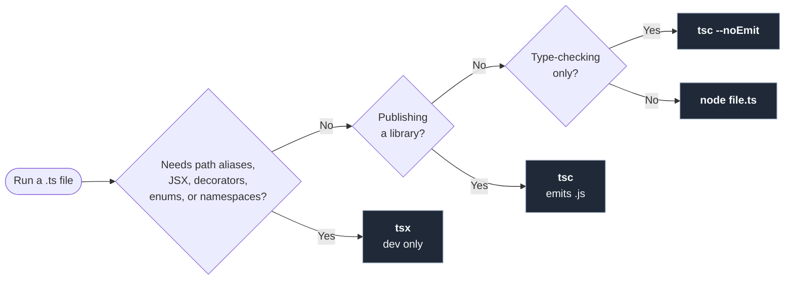

import { Steps, CardGrid, FileTree } from '@astrojs/starlight/components';
import Term from '../../../components/ui/Term.astro';
import ExternalResource from '../../../components/ui/ExternalResource.astro';
import Figure from '../../../components/figures/Figure.astro';
import VideoCallout from '../../../components/embeds/VideoCallout.astro';
import Matching from '../../../components/exercises/matching/Matching.astro';
import Pair from '../../../components/exercises/matching/Pair.astro';
import CourseProgressBar from '../../../components/ui/CourseProgressBar.astro';

<CourseProgressBar value={frontmatter['course-progress']} />

A new contributor clones the repo, types `node seed.ts`, and gets `Unknown file extension ".ts"`.
Their machine runs Node 22, but the project assumes Node 24, where running `.ts` files directly became built in.
A README sentence asking everyone to upgrade won't hold; a file the repo commits will.
The same version gap runs through CI and production, where it surfaces weeks later as the bug that "works on my machine."

This lesson closes that gap and answers the question that comes up the first time you run a `.ts` file: how does it actually execute?
You'll pin Node 24 in the repo, then run one `.ts` file three ways: native `node`, `tsx`, and `tsc`.
By the end you'll have a decision tree for choosing among them.

## Pin the Node version with mise

The runtime your code expects belongs to the *repo*, not the machine, just like the editor settings from the previous lesson.
The committed file is `.mise.toml`, and what it pins is Node's version.

The tool is **mise** (formerly rtx).
It's written in Rust, so it starts in milliseconds where `nvm` adds a second to every shell prompt, and it's polyglot, so one tool pins Python, Go, and other runtimes alongside Node.
This course uses mise from here on.

The pinned version is **Node 24**, which entered <Term definition="Long-Term Support: the release line a Node major lands on after its initial Current phase, with roughly 30 months of bug fixes and security patches.">LTS</Term> in October 2025 and is supported through April 2028.
LTS costs you nothing here: native TypeScript stripping (the next section's topic) and this chapter's ES2025 features all ship in Node 24.

The install is four steps.
Step two, shell activation, is the one new users skip, which is why a fresh install can appear to do nothing.

<Steps>
1. **Install mise.** One command per platform:

   - macOS: `brew install mise`
   - Linux: `curl https://mise.run | sh`
   - Windows: install WSL2 first, then follow the Linux path. The course doesn't run on native Windows shells.

2. **Activate mise in your shell.** Skip this and `mise install` runs, but `node` still resolves to whatever was on your `PATH` before. Add the activation line to your shell's rc file:

   ```bash title="~/.zshrc"
   eval "$(mise activate zsh)"
   ```

   On bash, swap `zsh` for `bash` in both places. Then reload the shell: reopen the terminal, or run `exec zsh` (or `exec bash`) in the current one.

3. **Pin Node 24 at the repo root.** From inside the project directory:

   ```bash
   mise use --pin node@24
   ```

   The `--pin` flag writes the *full* version string (major plus latest patch) rather than the loose `24`, so two developers running `mise install` a week apart get identical Node binaries. The command writes `.mise.toml` in the current directory:

   ```toml title=".mise.toml"
   [tools]
   node = "24.4.1"
   ```

   Your patch number will differ depending on when you run the command. Commit this file: it's how every other developer, CI, and production gets your runtime.

4. **Install the pinned version and verify.** mise downloads Node into its own store, separate from any system Node:

   ```bash
   mise install
   mise current
   ```

   `mise current` prints the active version for the current directory, such as `node 24.4.1`. From now on a terminal in this folder gives you Node 24 automatically, and one elsewhere leaves your other projects untouched.
</Steps>

<VideoCallout videoId="eKJCnc0t8V0" videoTitle="Mise: The BEST Way to Manage Versions of Node, Python, Go (and Much More...)">
  Better Stack's 6-minute tour of mise: pinning Node per project, committing the config so a teammate's `mise install` reproduces it, and where mise stops and `package.json` takes over.
</VideoCallout>

## Three ways to run a .ts file

Three tools run a `.ts` file.
Native `node` is the default; the other two earn their place once a file needs something the default can't do.

<Figure caption="Three paths, one trigger per branch.">

</Figure>

### Native node: the default

Node 24 reads `.ts` files natively.
Its type-stripper blanks out the type-only parts of the source, such as annotations, interfaces, and `type` aliases, then runs the resulting JavaScript.
No flag, no plugin, no build step.

What the stripper *doesn't* do is why the other two paths exist:

- **It doesn't read `tsconfig.json`.** A <Term definition="A short prefix declared in tsconfig.json that maps to a directory, so `@/lib/greet` resolves to `src/lib/greet` no matter how deep the importing file sits.">path alias</Term> like `@/lib/greet` won't resolve. Imports must be relative paths (`./lib/greet.ts`) or bare specifiers from `node_modules`.
- **It doesn't transform.** JSX, decorators, `enum`, and `namespace` compile to *new* runtime code, so they can't be erased like a type annotation, and native Node rejects them.
- **It doesn't type-check.** A file with type errors still runs; verifying types is `tsc --noEmit`'s job, two subsections down.

So native `node` fits plain `.ts` files with relative imports and no code-generation syntax: seed scripts, one-off CLIs, throwaway calculations, anything you'd otherwise write as `.js`.

```bash
node hello.ts
```

### tsx: for path aliases and transforms

`tsx` is a third-party CLI that runs `.ts` files like `node`, but reads `tsconfig.json` and uses <Term definition="A fast Go-based JavaScript and TypeScript bundler and transformer; tsx embeds it to convert the syntax native Node refuses into runnable JavaScript.">esbuild</Term> to transform what native Node can't.
Reach for it when any one of five conditions holds:

- Imports use path aliases from `tsconfig.json` (`@/lib/...`, `~/components/...`).
- The file contains JSX, like a standalone React component outside Next.js.
- Decorators, rare in 2026 SaaS code but still seen in legacy frameworks.
- `enum`, which this course never writes (`as const` objects and string-literal unions cover every case) but you'll meet in older codebases.
- `namespace`, same story: recognize it, don't write it.

Installation comes in a later chapter, alongside `pnpm` and `package.json`.
For now, run the one-shot form:

```bash
pnpm dlx tsx hello.ts
```

`pnpm dlx` downloads `tsx`, runs it once, and forgets it, the same pattern as `npx`.
Once `tsx` is installed as a devDependency, this shortens to `pnpm tsx hello.ts`.

:::caution
**`tsx` is a development tool, never a production runtime.** Running `tsx server.ts` in production re-transpiles the source on every cold start: slower boot, more memory, no benefit. Production runs compiled `.js`, or Node's native type-stripper on plain `.ts`. Watch mode (`tsx watch script.ts`) auto-reloads on file change and is the daily reach during development.
:::

You'll also meet `ts-node` in older docs; it has been deprioritized, so reach for `tsx` instead.

### tsc: for type-checking and library publish

`tsc`, the TypeScript compiler, is the only one of the three that doesn't *run* your code.
It does two other things, each with its own trigger.

The first is **type-checking the codebase**.
`tsc --noEmit` runs the full type-checker across every file `tsconfig.json` includes and emits no `.js`, the same check your editor runs in the background.
From the project chapters onward, CI gates every PR on it, so a type error blocks the merge.

```bash
pnpm dlx tsc --noEmit
```

(`pnpm dlx tsc` is one-shot with no install, like `pnpm dlx tsx`. Once a `package.json` exists, the form is `pnpm tsc --noEmit`.)

The second is **publishing a library to npm**.
`tsc` without `--noEmit` type-checks your `.ts` source and writes out the matching `.js` plus `.d.ts` type declarations, which is what publishable packages distribute.
This course builds an application, not a library, so the emit path is named here only so you recognize it.

Neither trigger runs a `.ts` file: to execute code, reach for `node` or `tsx`; to verify types, reach for `tsc`.

## Worked example: one file, all three tools

Run all three tools on one file: `node` works, a path alias breaks it, `tsx` fixes it, `tsc --noEmit` type-checks it.

<Steps>
1. **Create `hello.ts` at the repo root.** A typed `greet` and one `console.log`:

   ```ts title="hello.ts"
   const greet = (name: string): string => `Hello, ${name}`;

   console.log(greet('world'));
   ```

2. **Run it with native node.** Inside the same directory:

   ```bash
   node hello.ts
   ```

   Output:

   ```
   Hello, world
   ```

   Node stripped the types and ran the JavaScript, no flag needed.

3. **Add a path alias.** Move `greet` into `src/lib/greet.ts` and import it from `hello.ts` through the `@/...` alias. The new file:

   ```ts title="src/lib/greet.ts"
   export const greet = (name: string): string => `Hello, ${name}`;
   ```

   And the updated `hello.ts`:

   ```ts title="hello.ts"
   import { greet } from '@/lib/greet';

   console.log(greet('world'));
   ```

   The layout:

   <FileTree>
   - **hello.ts** imports from `@/lib/greet`
   - src/
     - lib/
       - greet.ts
   </FileTree>

4. **Re-run with native node and watch it fail.** Same command as before:

   ```bash
   node hello.ts
   ```

   Output (trimmed):

   ```
   node:internal/modules/package_json_reader:316
     throw new ERR_MODULE_NOT_FOUND(packageName, fileURLToPath(base), null);
           ^

   Error [ERR_MODULE_NOT_FOUND]: Cannot find package '@/lib' imported from /path/to/hello.ts
   ```

   Native Node doesn't read `tsconfig.json`, so it reads `@/lib` as a `node_modules` package and throws when it can't find one; the fix is a different tool, not relative imports.

5. **Add a minimal `tsconfig.json` and switch to tsx.** Declare the alias in a minimal `tsconfig.json` at the repo root:

   ```json title="tsconfig.json"
   {
     "compilerOptions": {
       "module": "preserve",
       "moduleResolution": "bundler",
       "baseUrl": ".",
       "paths": {
         "@/*": ["src/*"]
       }
     }
   }
   ```

   `moduleResolution: "bundler"` is the right fit for `tsx`; the full config comes later. Now run with `tsx`:

   ```bash
   pnpm dlx tsx hello.ts
   ```

   Output:

   ```
   Hello, world
   ```

   Same source and output as step 2; `tsx` just resolved the alias.

6. **Type-check with tsc --noEmit.** No execution, just the type-checker:

   ```bash
   pnpm dlx tsc --noEmit
   ```

   Output:

   ```
   ```

   Nothing: `tsc` speaks up only on an error. To check it works, call `greet(42)` and rerun; you'll get `Argument of type 'number' is not assignable to parameter of type 'string'` with the file and line. Change it back to make `tsc --noEmit` silent again.
</Steps>

## Match each scenario to a tool

Some answers repeat, because more than one trigger routes to the same tool.

<Matching instructions="Match each scenario to the execution path you'd reach for. Check the trigger first, then pick the tool.">
  <Pair>
    <Fragment slot="left">A one-off seed script with plain relative imports and no JSX</Fragment>
    <Fragment slot="right">`node script.ts`</Fragment>
  </Pair>
  <Pair>
    <Fragment slot="left">A standalone CLI tool that imports utilities via `@/lib/...`</Fragment>
    <Fragment slot="right">`pnpm tsx script.ts`</Fragment>
  </Pair>
  <Pair>
    <Fragment slot="left">CI step that gates every PR on the type-checker passing</Fragment>
    <Fragment slot="right">`pnpm tsc --noEmit`</Fragment>
  </Pair>
  <Pair>
    <Fragment slot="left">A throwaway React component example outside a Next.js project</Fragment>
    <Fragment slot="right">`pnpm tsx script.ts` (JSX trigger)</Fragment>
  </Pair>
  <Pair>
    <Fragment slot="left">A library you're publishing to npm</Fragment>
    <Fragment slot="right">`pnpm tsc` (emits `.js`)</Fragment>
  </Pair>
</Matching>

## External resources

The official sources for the three tools you installed, plus the Node release schedule.

<CardGrid>
  <ExternalResource
    title="Node.js — Modules: TypeScript"
    href="https://nodejs.org/api/typescript.html"
    icon="simple-icons:nodedotjs"
    description="The official reference for native type-stripping, the syntax it supports, and the syntax it refuses."
  />
  <ExternalResource
    title="mise — Getting started"
    href="https://mise.jdx.dev/getting-started.html"
    icon="lucide:terminal"
    description="Install, shell activation, and the mise use command — the canonical source if anything in the install procedure trips."
  />
  <ExternalResource
    title="tsx on GitHub"
    href="https://github.com/privatenumber/tsx"
    icon="lucide:zap"
    description="The README covers watch mode, ESM and CJS interop, and the full list of TypeScript features tsx transforms that native Node refuses."
  />
  <ExternalResource
    title="Node.js release schedule"
    href="https://github.com/nodejs/Release"
    icon="simple-icons:nodedotjs"
    description="The official table of which Node majors are in Active LTS, Maintenance, or end-of-life, with the exact dates."
  />
</CardGrid>
