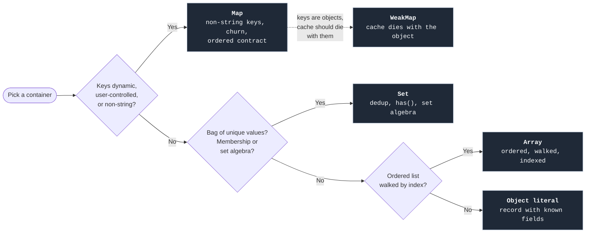

import Term from '../../../components/ui/Term.astro';
import ExternalResource from '../../../components/ui/ExternalResource.astro';
import Figure from '../../../components/figures/Figure.astro';
import CodeVariants from '../../../components/code/code-variants/CodeVariants.astro';
import CodeVariant from '../../../components/code/code-variants/CodeVariant.astro';
import Buckets from '../../../components/exercises/buckets/Buckets.astro';
import Bucket from '../../../components/exercises/buckets/Bucket.astro';
import Item from '../../../components/exercises/buckets/Item.astro';
import VideoCallout from '../../../components/embeds/VideoCallout.astro';
import { CardGrid } from '@astrojs/starlight/components';
import CourseProgressBar from '../../../components/ui/CourseProgressBar.astro';

<CourseProgressBar value={frontmatter['course-progress']} />

Here are three bugs from three different teams, all caused by the same mistake. Each team kept using `{}` or `[]` past the point where either container fit the shape of the data.

```ts
const cache: Record<string, User> = {};
const user = cache[userInput];
user.name;
```

The first bug is a `{}` used as a lookup table with user-controlled keys. Most of the time `cache[userInput]` returns a `User` or `undefined`, exactly as the type says. But when `userInput === 'toString'`, the property doesn't come from `cache`. It comes from `Object.prototype`, which every object literal inherits from. The lookup returns a built-in function, the next line tries to read `.name` on that function, and production logs a confusing `TypeError`. The previous lesson on objects named `Object.hasOwn` as the defensive read. There's a step beyond that: when the keyspace is user-controlled, don't use `{}` at all.

```ts
const watchedCustomerIds: string[] = [/* 200 ids */];
const flagged = bigInvoices.filter((i) =>
  watchedCustomerIds.includes(i.customerId),
);
```

The second bug is the one the previous lesson on array methods left hanging. With `bigInvoices.length === 10_000` and `watchedCustomerIds.length === 200`, the inner `.includes` walks the watch list once for each invoice, two million comparisons for what should be one walk. The result is correct, so the bug stays silent, and the slowdown only shows up once the dataset grows. The fix is to recognize `.includes` inside a `.filter` callback and reach for `Set` instead.

```ts
const selected = new Map([['inv_1', invoice]]);
await fetch('/api/save', {
  method: 'POST',
  body: JSON.stringify({ selected }),
});
```

The third bug looks fine until you read the request body on the server. `JSON.stringify(new Map([...]))` returns `'{}'`. The map's data disappears the moment it crosses the wire: no error, no warning, just an empty object on the other side. `JSON.stringify` doesn't know about `Map`, because the data lives in internal slots it can't see.

All three bugs share the same fix: pick a container that matches the data's actual shape. The previous lessons established the object literal as the everyday record and the array as the ordered list. This lesson adds the two situational containers, `Set` and `Map`, plus `WeakMap` for one narrow case, along with the signals that tell you when to reach for each.

## Four containers, three questions

The question to ask isn't "which container is most powerful?" It's "which container matches the shape of this data and the operation that dominates it?" Four containers and three short questions are enough to settle it.

<Figure caption="Pick the container by trigger, not by power.">

</Figure>

Read the tree from top to bottom. Object literals are for records with known string-keyed fields, where the shape is the contract. Arrays are for ordered lists you walk by index. `Set` enters when the collection is a bag of unique values and membership or set algebra is the operation that matters. `Map` enters when you're building a <Term definition={"An unordered collection of key→value pairs where the keyspace is unbounded or unknown at write time. Contrast: a record has a fixed, known field shape."}>dictionary</Term>: the keys aren't fixed strings, or insertion and deletion are frequent, or insertion order matters as part of a contract the reader can rely on.

One pair of terms is worth learning now, because the rest of the lesson leans on it. A *record* has a fixed shape, like `{ id, email, name }`, and the object literal is the right container for it. A *dictionary* has a dynamic keyspace: which keys are present is part of the data, not the type, and `Map` is the right container for it. The phrase "I have a JavaScript object" tends to blur the two, so before picking a container, ask which one you actually have.

<VideoCallout videoId="De6JOU9yaGM" videoTitle="You Should Use Maps and Sets in JS">
  CJ on Syntax (14 min) walks through the same triggers this lesson covers: the prototype-key trap on objects, when `Map` beats `{}`, and the `Array.includes` slowdown that earns `Set`.
</VideoCallout>

## Set: dedup, membership, algebra

`Set` is a collection of unique values. It has no keys, no order contract beyond insertion order, and no payload. It answers two questions: "is this value in the set?" and "give me all the values." Three triggers earn it.

### Dedup

This is the canonical idiom. Wrap an array in `new Set(...)` to get its unique values, then wrap that in `Array.from(...)` to get back an array:

```ts
const customerIds = ['cus_1', 'cus_2', 'cus_1', 'cus_3', 'cus_2'];
const uniqueIds = Array.from(new Set(customerIds));
```

`Set` decides "same value" using <Term definition={"JavaScript's equality semantics for Map keys and Set values: like ===, except NaN matches NaN. Two distinct objects are never equal even if their fields are identical — equality is by reference, not by shape."}>SameValueZero</Term>, which is like `===` except that `NaN` matches `NaN`. Because that equality is by reference, two distinct object literals are never equal even when their fields look identical. The `new Set(arr)` form works for primitives; deduping an array of objects needs a key function and a different pattern.

### Membership inside a loop

This is the trigger from the lesson opener. `Array.prototype.includes` walks the array until it finds a match, which is `O(n)` for each call. `Set.prototype.has` is `O(1)` on average. When a membership check sits inside another loop, those two costs multiply.

The fix is one line: build the `Set` once outside the loop, then run the `.has` check inside.

<CodeVariants>
  <CodeVariant label="Naive — O(n × m)">
    <div data-mark-color="red">

    ```ts "watchedCustomerIds.includes(i.customerId)"
    const flagged = bigInvoices.filter((i) =>
      watchedCustomerIds.includes(i.customerId),
    );
    ```

    </div>
    **One walk per invoice over the entire watch list.** With 10,000 invoices and 200 watched ids, `.includes` walks the watch list once for every invoice, roughly two million comparisons before this `.filter` returns.
  </CodeVariant>

  <CodeVariant label="Set-fronted — O(n + m)">
    <div data-mark-color="green">

    ```ts "new Set(watchedCustomerIds)" "watched.has(i.customerId)"
    const watched = new Set(watchedCustomerIds);
    const flagged = bigInvoices.filter((i) => watched.has(i.customerId));
    ```

    </div>
    **Build the `Set` once, `.has`-check inside.** Building the `Set` is one walk over the 200 ids. The `.filter` does one walk over the 10,000 invoices, with constant-time `.has` inside. Total: roughly 10,200 operations, two orders of magnitude faster.
  </CodeVariant>
</CodeVariants>

In code review, watch for `.filter(x => other.includes(...))`, `.map(x => ... && other.includes(...))`, or a `for...of` loop with `.includes` in its body: anything where a membership check sits inside another walk. Build a `new Set(other)` outside the walk and the inner check becomes constant time.

### Set algebra

As of ES2025, `Set` ships seven composition methods natively: union, intersection, difference, symmetric difference, plus three boolean predicates. They have been universally available since June 2024, across Chrome, Firefox, Safari, and Node 22 and up. Node 24 LTS, the runtime this course will pin a few lessons from now, has them all.

The methods split into two groups. The first four return a new `Set`:

- **`a.union(b)`**: elements in either.
- **`a.intersection(b)`**: elements in both.
- **`a.difference(b)`**: in `a` but not `b`.
- **`a.symmetricDifference(b)`**: in exactly one (the XOR).

The other three return a boolean:

- **`a.isSubsetOf(b)`**: every element of `a` is in `b`.
- **`a.isSupersetOf(b)`**: every element of `b` is in `a`.
- **`a.isDisjointFrom(b)`**: they share no elements.

In real code the names tell you exactly what each call does:

```ts
const activeIds = new Set(activeInvoiceIds);
const flaggedIds = new Set(flaggedInvoiceIds);

const needsReview = activeIds.intersection(flaggedIds);
const safeToArchive = activeIds.difference(flaggedIds);
const overlap = !activeIds.isDisjointFrom(flaggedIds);
```

Before ES2025, computing an intersection meant `arr.filter(x => other.has(x))` or pulling in `lodash.intersection`. Both are now unnecessary. If you have a `_.intersection` or `_.union` habit from years past, the move in 2026 is to delete the import.

One detail is worth knowing: the operand you pass doesn't have to be a `Set`. The methods accept any **set-like** object, meaning anything with `.size`, `.has(value)`, and `.keys()`. A `Map` qualifies, since its `.keys()` provides the iteration, so `mySet.intersection(myMap)` works. You won't reach for this often, but when you read it in a library, you'll know what it is.

<VideoCallout videoId="xHqHgIdEWds" videoTitle="New TypeScript Set Methods in ES2025 - Explained In Detail">
  Typed Rocks (11 min) demos all seven ES2025 methods in TypeScript, including the array-conversion workaround they replace and the set-like-operand detail above.
</VideoCallout>

## The everyday Set surface

Here is the full everyday API in one block: construct, mutate, query, iterate, and read the size.

```ts
const selected = new Set<string>();
selected.add('inv_1');
selected.add('inv_2').add('inv_1');
selected.has('inv_1');
selected.delete('inv_3');
selected.size;
for (const id of selected) {
  console.log(id);
}
const fromIter = new Set(['a', 'b', 'a']);
```

A few things to note as you scan the block. `Set<string>()` annotates the element type explicitly at construction; without the generic, TypeScript can't infer it from an empty initializer and you end up with a useless `Set<unknown>`. `.add` returns the `Set`, so calls chain. `.delete` returns a boolean: `true` if something was actually removed. `for...of` on a `Set` yields the values themselves, with no index and no key. The constructor accepts any iterable, which is what makes the dedup idiom work.

One rule carries over from the array lesson: `.add` and `.delete` mutate the set in place. That's fine for a `Set` you own inside a function. For a `Set` held in React state or otherwise shared, you replace it rather than mutate it: `setSelected(new Set(selected).add(id))`. This is the same ownership rule as `.push` versus `[...arr, x]`. The React state mechanics arrive in the React chapters.

## Map: non-string keys, churn, ordered contract

`Map` is `Set`'s richer cousin: every entry has a key *and* a value, and keys can be any type. Three triggers earn it.

### Non-string keys

Plain objects coerce every key to a string. Write `obj[42]` and JavaScript stores it under `"42"`. Write `obj[someDate]` and JavaScript stores it under whatever `someDate.toString()` returns, something like `"Mon Jan 01 2026 00:00:00 GMT+0000"`. So two `Date` instances on the same calendar day collide, two different objects with identical shapes collide, and the original key type is lost.

`Map` keeps the key as the original value, identity and type intact:

```ts
const outstandingByCustomer = new Map<Customer, number>();
outstandingByCustomer.set(customer, 4_200);
outstandingByCustomer.get(customer);
```

Equality on `Map` keys uses the same SameValueZero rule as `Set`, which is by reference for objects. Two distinct object literals with identical fields count as *different* keys, so you have to hand the same customer instance to both `.set` and `.get` for the lookup to land.

A practical note: in production SaaS code, you'd usually key by the customer's `id` (a string) rather than by the customer object itself. The object-keyed shape exists for cases where the identity of the instance is the point, such as DOM nodes, React elements, or parsed AST nodes. The `WeakMap` section below shows the canonical example.

### Frequent insert and delete

`Map` is built for this operation. Plain objects in V8 (and other modern engines) are optimized through hidden classes: every shape the object passes through builds an internal transition. Frequently adding and deleting keys can break those optimizations, and the runtime falls back to a slower dictionary mode. `Map` skips the hidden-class machinery entirely, because it's a hash table by design.

You don't need to measure and prove this case by case. The rule is simpler: if adding and removing entries is the operation that dominates this container's lifetime, `Map` is the right tool. When a reader sees `Map`, they know that churn is expected.

### Insertion-ordered iteration

Both `Map` and (in modern engines) plain objects iterate in insertion order. The difference is what *guarantees* that order. `Map` promises insertion order in the specification, so every implementation must deliver it. Objects deliver it by current engine convention, with edge cases around integer-string keys that the spec used to leave loosely defined.

When the contract is *"process these in the order they were added,"* reach for `Map`. The reader can rely on the promise.

```ts
const recent = new Map<string, Invoice>();
recent.set('inv_3', latest);
recent.set('inv_1', older);
recent.set('inv_2', oldest);

for (const [id, invoice] of recent) {
  console.log(id, invoice.amountCents);
}
```

The `for...of` here yields `[key, value]` pairs, which is the destructure-in-the-binding form from the array lesson applied to a `Map`. That two-element shape is the clearest visual difference from a `Set`, which yields just values.

### Map.groupBy

The previous lesson on objects introduced `Object.groupBy(items, keyFn)` for grouping an array by a string-valued key, like invoices by status or customers by country. `Map.groupBy` is its non-string-key cousin. It has the same signature, but it returns a `Map` instead of an object, and the key can be any type.

It's part of ES2024 and has been baseline since the end of 2024: every current browser and Node 22+.

```ts
const invoicesByDueDate = Map.groupBy(invoices, (i) => i.dueDate);
```

`invoicesByDueDate` is `Map<Date, Invoice[]>`, where the key is the actual `Date` instance from the invoice, not a stringified copy. Try the same with `Object.groupBy` and every `Date` collapses into a string like `"Mon Jan 01 2026 ..."`. You lose the original `Date` from the key, any two days that stringify the same collide, and downstream code that needs date arithmetic has to re-parse the string to get the `Date` back.

The same `Date`-as-object-key caveat from the non-string-keys section applies: two invoices built with separate `new Date(...)` calls land in *different* groups even when the dates represent the same instant. You have two ways around it. Either canonicalize upstream so that equal logical days share one instance, or key by an ISO date string (`i.dueDate.toISOString().slice(0, 10)`) and use `Object.groupBy`. Pick the string key when downstream code wants plain strings, and the `Date` key when it needs to do date arithmetic.

The rule that pairs the two statics: string keys go to `Object.groupBy`, anything else to `Map.groupBy`.

## The Map surface and the .get rule

Here is the everyday API for `Map`, in one block:

```ts
const byId = new Map<string, Invoice>();
byId.set('inv_1', invoice);
byId.set('inv_2', other).set('inv_3', third);
byId.get('inv_1');
byId.has('inv_99');
byId.delete('inv_2');
byId.size;
for (const [id, invoice] of byId) {
  console.log(id, invoice.amountCents);
}
byId.keys();
byId.values();
byId.entries();
const fromPairs = new Map([
  ['a', 1],
  ['b', 2],
]);
```

This is the same shape as `Set`'s surface: explicit generic at construction, chainable mutators, boolean returns from `.delete` and `.has`, and iteration via `for...of`. The differences are what you'd expect: `.set(key, value)` instead of `.add(value)`, `.get(key)` returns the value or `undefined`, and `for...of` yields pairs. The three iterator views (`.keys()`, `.values()`, `.entries()`) work the way they do on objects.

The one thing likely to trip you the first time you write it is `.get`.

### Map.get always returns V | undefined

Even when the map is typed `Map<string, Invoice>`, `.get(k)` returns `Invoice | undefined`, never just `Invoice`. TypeScript has no way of knowing at compile time which keys are present at runtime. The map's type tells you what the values will be when they exist; whether a particular key has a value is runtime information.

This is the same discipline that <Term definition={"A TypeScript flag the course turns on. With it, indexing an array returns T | undefined instead of T, because the index might be out of bounds at runtime. The senior reflex is to handle the undefined explicitly."}>noUncheckedIndexedAccess</Term> imposes on array indexing: `arr[i]` returns `T | undefined`, not `T`, because the compiler doesn't know whether the index is in bounds. The `Map.get` rule is the older of the two and always applies; the array flag extends the same idea to indexing.

There are two ways to handle the miss. The first, when a default makes sense, is the `??` fallback:

```ts
const invoice = byId.get(id) ?? emptyInvoice;
```

`??` returns the right-hand side when the left is `null` or `undefined`. It was introduced in the previous chapter, and it's the most common choice here.

The second, when there's no sensible default and absence has to short-circuit the rest of the function, is to bind the value to a temporary and narrow it:

```ts
const invoice = byId.get(id);
if (invoice === undefined) return;
invoice.amountCents;
```

After the `if (invoice === undefined) return;`, TypeScript narrows `invoice` to `Invoice`, so `.amountCents` reads without complaint. This is the same pattern you'd use after `arr[0]` under the strict indexing flag, so the muscle memory transfers.

You'll occasionally see `.has(k)` followed by `.get(k)`: check first, then read. That works, but it's two lookups instead of one and slightly less idiomatic than `.get` plus a null check. Pick one style and stick with it.

## WeakMap: caches that die with the object

`WeakMap` is the narrow case among the everyday containers. Most of the time you won't reach for it. When you do, it's because the trigger is exact and nothing else fits.

The difference from `Map` is one word: *weakly*. A `WeakMap` holds its keys weakly, which means that when the only remaining reference to a key is the `WeakMap` entry itself, the garbage collector reclaims the entry. The cached value disappears along with the object.

Two hard constraints follow. Keys must be objects, not primitives, because there's no way to weakly hold a string. And a `WeakMap` is not iterable and has no `.size`: entries can disappear at any time, so iteration would yield inconsistent results and any size you read would be stale the moment you read it.

Here is the trigger that earns it: caching computed metadata per object instance, where the cache should not keep the object alive.

```ts
const measurements = new WeakMap<HTMLElement, DOMRect>();

const getRect = (el: HTMLElement): DOMRect => {
  const cached = measurements.get(el);
  if (cached) return cached;
  const rect = el.getBoundingClientRect();
  measurements.set(el, rect);
  return rect;
};
```

This is the canonical shape. The cache keys are DOM elements, and the values are their measured bounding rectangles. When an element is removed from the DOM and no other code holds a reference to it, the cache entry is reclaimed automatically. There's no manual `.delete`, no leak, and no listener to wire up. The cache's lifetime is tied to the element's lifetime, and the engine manages that link for you.

The DOM API isn't formally introduced yet (that's in the next unit), but the *shape* is what matters here. Replace `HTMLElement` with any object whose lifetime you don't fully control, such as a React element, a parsed AST node, or a request object, and the pattern is identical.

`WeakSet` is the set cousin: same weak-key semantics, no values. It fits "have I already processed this object?" checks where the set shouldn't keep the object alive. You'll rarely write one, but it's worth recognizing.

One historical footnote you may run into in older codebases: before class private fields (`#field`) existed, `WeakMap` was used to hold private state per instance. The private-field syntax replaces that use case entirely, so the modern way to hold private state in a class is `#field`, not `WeakMap`. Classes themselves come up in a later chapter. The point here is just that private state in a `WeakMap` is not the modern shape.

<VideoCallout videoId="WqNqeMjd28I" videoTitle="Only The Best Developers Understand How This Works" start="13:55">
  Web Dev Simplified shows `WeakMap` clearing a real memory leak in Chrome DevTools: the garbage-collection coupling this section describes, made visible in heap snapshots. The clip opens at the relevant part (13:55), and you only need the couple of minutes from there, not the whole video.
</VideoCallout>

## Map and Set don't survive JSON.stringify

Here is the serialization bug from the lesson opener, in full.

`JSON.stringify(new Map([['k', 1]]))` returns `'{}'`. `JSON.stringify(new Set([1, 2, 3]))` returns `'{}'`. Both containers stringify to an empty object, with no error and no warning. The data was there a line ago and now it's gone.

The reason: `JSON.stringify` only serializes an object's own enumerable properties. `Map` and `Set` store their entries in internal slots, which are engine-managed storage that the serializer can't see.

The fix isn't to stop using `Map` or `Set`. It's to *convert at the boundary*: wherever the data crosses into JSON, swap the container for its serializable equivalent, then convert back on the other side if you need to.

- **`Map` to and from an array of pairs.** `Array.from(map)` gives the canonical `[[k, v], [k, v]]` shape, and `new Map(array)` rebuilds the map from it.
- **`Map` to and from a plain object** (when keys are strings). `Object.fromEntries(map)` from the object lesson, with `new Map(Object.entries(obj))` as the inverse.
- **`Set` to and from an array.** `Array.from(set)` converts out, and `new Set(array)` rebuilds.

Here are the two shapes side by side, applied to a `fetch` body:

<CodeVariants>
  <CodeVariant label="Disappears">
    <div data-mark-color="red">

    ```ts "selected"
    const selected = new Set(['inv_1', 'inv_2']);

    await fetch('/api/save', {
      method: 'POST',
      body: JSON.stringify({ selected }),
    });
    ```

    </div>
    **Server receives `{ "selected": {} }`.** The set's data is gone before the request leaves the browser, because `JSON.stringify` can't see the internal slots where `Set` stores its entries.
  </CodeVariant>

  <CodeVariant label="Survives">
    <div data-mark-color="green">

    ```ts "Array.from(selected)"
    const selected = new Set(['inv_1', 'inv_2']);

    await fetch('/api/save', {
      method: 'POST',
      body: JSON.stringify({ selected: Array.from(selected) }),
    });
    ```

    </div>
    **Server receives `{ "selected": ["inv_1", "inv_2"] }`.** Convert the set to an array at the boundary; if the server needs `Set` semantics, it can wrap the array back into a `Set` on receipt.
  </CodeVariant>
</CodeVariants>

Two clarifying notes. First, the React Server Components wire protocol, which you'll meet in the Next.js chapters, uses a richer serializer (`structuredClone`-shaped) that does preserve `Map`, `Set`, `Date`, and `BigInt`. This lesson's rule is about `JSON.stringify` specifically, the form that hits real wire boundaries: `fetch` bodies, `localStorage`, query strings, and any third-party API. The RSC case is the exception, not the default.

Second, deep serialization, meaning round-trips that need to preserve `Date` instances, `BigInt`, typed arrays, or custom classes, comes up in a later chapter alongside `structuredClone`. The rule here is the narrow one: at any `JSON.stringify` boundary, convert `Map` and `Set` to their array forms first.

## Where this lands later

A few forward links, so you know where these containers reappear.

- The **LRU cache** idiom (the caching chapter, much later) builds directly on `Map`'s insertion-order contract. The whole touch-to-most-recent pattern is `map.delete(k); map.set(k, v);`: delete, re-insert, and the key now sits at the end of the iteration order.
- **Drizzle result-set transforms** (the database chapter) use `Set` for dedup and `Map` for ID-keyed lookup as a standard pre-response shape.
- **TanStack Query** uses `WeakMap`-keyed metadata for query references internally. You won't write it yourself, but you'll see it in the source.
- **`Object.groupBy` and `Map.groupBy`** are the two faces of the groupBy pattern. String keys go to the object form, anything else to the map form. That pairing is the practical reason to know both lessons.

## Pick the right container

Eight items, four containers, one sort. Read each item, then drop it into the bucket whose triggers fit. This sort is the whole lesson in one drill: there's no syntax to remember, only the question of which container fits.

<Buckets twoCol instructions="Sort each data shape into the container whose triggers fit. Read the operation, not just the keys.">
  <Bucket name="obj" label="Object literal" description="Known string-keyed fields; the shape is the contract." />
  <Bucket name="arr" label="Array" description="Ordered, walked, indexed; same-type elements." />
  <Bucket name="set" label="Set" description="Unique values; membership or set algebra dominates." />
  <Bucket name="map" label="Map" description="Dynamic keys, frequent insert/delete, or non-string key types." />

  <Item bucket="obj">The currently signed-in user's profile fields (`id`, `email`, `name`)</Item>
  <Item bucket="arr">The list of invoices in display order on the dashboard</Item>
  <Item bucket="set">The set of selected invoice IDs in a multi-select UI</Item>
  <Item bucket="map">Lookup table from order ID to row, used for `O(1)` reads inside a render loop</Item>
  <Item bucket="set">Tags applied to a post, deduplicated as the user types</Item>
  <Item bucket="map">Cache of computed bounding-box metadata per DOM node, that should disappear when the node leaves the page</Item>
  <Item bucket="map">A mapping from `Date` (the actual Date instance) to events scheduled on that day</Item>
  <Item bucket="map">Count of how many times each word appears in a single paragraph of text</Item>
</Buckets>

A few items are worth a second thought after you finish. Item 4 looks like a record at first glance, since "lookup table" sounds like an object literal. But the operation is `O(1)` reads inside a hot loop with frequent inserts, and that's the `Map` trigger. Item 6 lands in `Map` here only because the four buckets don't include `WeakMap`. The better answer in production is `WeakMap`, since "DOM-node-keyed cache that should disappear when the node leaves the page" is the exact trigger from the `WeakMap` section. Item 8 is the dictionary-versus-record split. Counting words means the keyspace is whatever the input text contains, which is dynamic and user-controlled, so it's a `Map`. Write it as `Record<string, number>` instead, and the moment a user submits `"constructor"` as a word you'd start counting how many times a built-in function appeared. That's the same trap as the opener.

## External resources

<CardGrid>
  <ExternalResource
    title="MDN — Set"
    href="https://developer.mozilla.org/en-US/docs/Web/JavaScript/Reference/Global_Objects/Set"
    icon="simple-icons:mdnwebdocs"
    iconColor="#000000"
    description="The full Set reference, including the ES2025 composition methods (`union`, `intersection`, `difference`, `symmetricDifference`, and the three boolean predicates)."
  />
  <ExternalResource
    title="MDN — Map.groupBy"
    href="https://developer.mozilla.org/en-US/docs/Web/JavaScript/Reference/Global_Objects/Map/groupBy"
    icon="simple-icons:mdnwebdocs"
    iconColor="#000000"
    description="The non-string-key grouping static, with the `keyFn`-returns-any-value semantics worked through."
  />
  <ExternalResource
    title="web.dev — JavaScript Set methods are Baseline"
    href="https://web.dev/blog/set-methods"
    icon="simple-icons:googlechrome"
    iconColor="#4285F4"
    description="The Baseline-newly-available announcement (June 2024) for the seven Set composition methods. The senior reassurance that you can ship these in production without a polyfill."
  />
</CardGrid>
