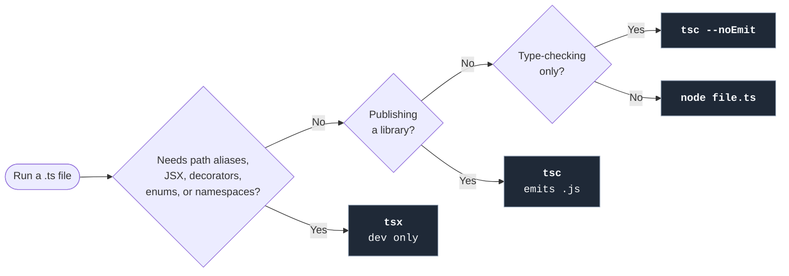

import { Steps, CardGrid, FileTree } from '@astrojs/starlight/components';
import Term from '../../../components/ui/Term.astro';
import ExternalResource from '../../../components/ui/ExternalResource.astro';
import Figure from '../../../components/figures/Figure.astro';
import VideoCallout from '../../../components/embeds/VideoCallout.astro';
import Matching from '../../../components/exercises/matching/Matching.astro';
import Pair from '../../../components/exercises/matching/Pair.astro';
import CourseProgressBar from '../../../components/ui/CourseProgressBar.astro';

<CourseProgressBar value={frontmatter['course-progress']} />

A new contributor clones the repo on a Monday, types `node seed.ts`, and watches Node respond with `Unknown file extension ".ts"`. Their machine is on system Node 22, but the project assumes Node 24, where running `.ts` files directly became a built-in feature. The fix isn't a README sentence asking everyone to please upgrade their Node, because people rarely read those sentences. The fix is a one-line file the repo commits, so the runtime stops being a property of each developer's machine. The same gap shows up at the other end of the pipeline. A feature lands locally on the author's Node 24, passes CI on whichever Node version the GitHub runner happens to default to that day, and ships to a production box on a third minor version. The bug that surfaces three weeks later is "works on my machine" with extra steps.

This lesson also answers a second question, the one that comes up the moment you run a `.ts` file outside a browser playground: how does this file actually execute on disk? In 2026, three paths exist. Native `node` strips the type annotations and runs the code with no flag. `tsx` reads `tsconfig.json` and transforms what native Node can't. `tsc` doesn't run code at all; it type-checks it, or compiles it to `.js` when you're publishing a library. Each path has a named trigger, so you decide by checking the trigger first and then reaching for the matching tool. By the end of this lesson, you'll have Node 24 pinned in the repo, the three-path decision tree in hand, and a single `.ts` file you've run all three ways on your own machine.

## Pin the runtime with mise

The runtime your code expects is a property of the *repo*, not of the machine the code happens to land on. This is the same idea the previous lesson applied to the editor: `.vscode/settings.json` ships in the repo so every teammate's editor behaves the same way. Here the file is `.mise.toml`, and the property it pins is Node's version.

The 2026 default for runtime pinning is **mise** (formerly rtx). Three things earned it that spot. It's written in Rust, so it starts in milliseconds, where `nvm` adds a second or more of shell-script warmup to every prompt. It's polyglot, so the same tool pins Python, Ruby, Go, and the Trigger.dev runtime the course reaches for later. And it reads `.tool-versions` and `.nvmrc` files for free, so a team on an older pinning tool can migrate by dropping `.mise.toml` next to what they already have. If you or your team is already invested in `nvm` or Volta and the switching cost outweighs the gain, those still work; this course commits to mise from here on.

The pinned version is **Node 24 LTS**. Node 24 entered Active <Term definition="Long-Term Support. Even-numbered Node majors enter LTS in October of their release year and get roughly 30 months of bug fixes and security patches after that: Active LTS first, then Maintenance.">LTS</Term> in October 2025 and stays Active through October 2026, then drops into Maintenance through April 2028. Production SaaS doesn't ride the bleeding edge unless a feature is load-bearing. LTS is the default here for the same reason the rest of this stack is: predictable updates and no surprise breakages. Choosing LTS over Current used to mean missing recent language features, but in 2026 that cost is gone. Native TypeScript stripping (the next section's topic) is available everywhere in Node 24, and the ES2025 features from earlier lessons in this chapter had all landed before Node 24 went LTS.

The install procedure is four steps. The second one, shell activation, is the step new mise users most often skip, and skipping it is why a fresh install can appear to do nothing.

<Steps>
1. **Install mise.** One command per platform:

   - macOS: `brew install mise`
   - Linux: `curl https://mise.run | sh`
   - Windows: install WSL2 first, then follow the Linux path. The course doesn't run on native Windows shells.

2. **Activate mise in your shell.** This is the step people skip. Without it, `mise install` works but `node` still resolves to whatever was on your `PATH` before, and you spend the next thirty minutes wondering why nothing changed. Add the activation line to your shell's rc file:

   ```bash title="~/.zshrc"
   eval "$(mise activate zsh)"
   ```

   If you're on bash, swap `zsh` for `bash` in both places. Then reload the shell: close and reopen the terminal, or run `exec zsh` (or `exec bash`) in the current one.

3. **Pin Node 24 at the repo root.** From inside the project directory:

   ```bash
   mise use --pin node@24
   ```

   The `--pin` flag writes the *full* version string (the major plus the latest matching patch) rather than the loose `24`, so two developers running `mise install` a week apart get bit-identical Node binaries. The command creates `.mise.toml` in the current directory:

   ```toml title=".mise.toml"
   [tools]
   node = "24.4.1"
   ```

   Your exact patch number will differ depending on when you run the command. Commit this file, because it's how every other developer (and CI, and production) gets the same runtime as you.

4. **Install the pinned version and verify.** mise downloads Node into its own store (separate from any system Node) and activates it for this directory:

   ```bash
   mise install
   mise current
   ```

   `mise current` prints the active version for the directory you're in, such as `node 24.4.1`, or whatever you pinned. From now on, opening a terminal in this folder gives you Node 24 automatically, and opening one anywhere else leaves your other projects untouched.
</Steps>

The runtime is now locked. Every contributor, every CI run, and every production deploy runs against the same Node 24, and the day you bump to Node 26 LTS, you change one file and everyone follows.

<VideoCallout videoId="eKJCnc0t8V0" videoTitle="Mise: The BEST Way to Manage Versions of Node, Python, Go (and Much More...)">
  Better Stack's 6-minute tour of mise: pinning Node per project, committing the config so a teammate's `mise install` reproduces it, and where mise stops and `package.json` takes over.
</VideoCallout>

## The three paths to execute a .ts file

In 2026, three tools take a `.ts` file on disk and run it. The goal isn't to pick a favorite, but to match the file to one of three triggers. Native `node` is the default, and the other two earn their place once the file crosses a named threshold the default can't handle.

<Figure caption="Three paths, one trigger per branch.">

</Figure>

The diagram puts the whole decision on one screen. The three subsections that follow take each branch in turn, with its trigger, its mechanics, and its one-line invocation.

### Native node: the default

Node 24 reads `.ts` files natively. At parse time, Node's internal type-stripper blanks out the parts of the source that are type-only, such as annotations, interfaces, and `type` aliases, and executes the resulting JavaScript. No flag, no plugin, no build step.

What the type-stripper *doesn't* do is the whole reason the other two paths exist:

- **It doesn't read `tsconfig.json`.** A path alias like `@/lib/greet` won't resolve, because as far as Node knows, `tsconfig.json` is a file with no special meaning. Imports must be relative paths (`./lib/greet.ts`) or bare specifiers from `node_modules`.
- **It doesn't transform.** JSX, decorators, `enum`, and `namespace` are TypeScript constructs that compile down to *new* runtime code. They can't be erased the way a type annotation can; they have to be transpiled, and native Node refuses them.
- **It doesn't type-check.** A file with type errors runs perfectly fine, because the stripper doesn't care whether your `number` was assigned a `string`. Type-checking is `tsc --noEmit`'s job, covered two subsections down.

Native `node` is the reach for plain `.ts` files with relative imports and no code-generation syntax: seed scripts, one-off CLIs, throwaway calculations, anything you'd otherwise write as a `.js` file. You invoke it the same way as any other Node script:

```bash
node hello.ts
```

If you ever need to disable the behavior, say to debug whether the stripper is the problem, `node --no-strip-types hello.ts` opts out. The course never needs it.

### tsx: when a trigger fires

`tsx` is a third-party CLI that runs `.ts` files the way `node` does, with one important difference: it reads `tsconfig.json` and uses **esbuild** under the hood to transform what native Node can't. You reach for it when any one of five conditions holds:

- Imports use path aliases declared in `tsconfig.json` (`@/lib/...`, `~/components/...`).
- The file contains JSX (a standalone React component example outside Next.js, or an iterator over JSX elements).
- The file uses decorators (rare in 2026 SaaS code, but legacy frameworks still use them).
- The file uses `enum`. The course never writes them, since `as const` objects and string-literal unions cover every case, but you'll meet them in older codebases.
- The file uses `namespace`, with the same caveat: you only need to recognize it.

Check the trigger before the tool. If none of those five hold, native `node` is still the right reach; the moment one does, swap in `tsx`.

Installation lands properly in a later chapter, alongside `pnpm` and `package.json`. For this lesson, the one-shot form is `pnpm dlx`:

```bash
pnpm dlx tsx hello.ts
```

`pnpm dlx` downloads `tsx` into a temporary store, runs it once, and forgets about it, the same pattern `npx` follows. Once the project has a `package.json` and `tsx` is installed as a devDependency, the invocation shortens to `pnpm tsx hello.ts`.

:::caution
**`tsx` is a development tool, never a production runtime.** A service that runs `tsx server.ts` in production re-transpiles the source on every cold start: slower boot, larger memory footprint, and no benefit. Production runs compiled `.js`, or Node's native type-stripper on plain `.ts`. Watch mode (`tsx watch script.ts`) auto-reloads on file change and is the daily reach during development, but it isn't a deployment story.
:::

You'll also see `ts-node` in older docs and Stack Overflow answers. It was the dominant runner for years and has since been deprioritized: `tsx` replaced it for development, and native Node replaced it for plain scripts. If a doc tells you to reach for `ts-node`, the doc is stale; reach for `tsx`.

### tsc: for type-checking and library publish

`tsc`, the TypeScript compiler, is the only one of the three tools that doesn't *run* your code by default. It does two other things, each with its own trigger.

The first trigger is **type-checking the codebase**. `tsc --noEmit` runs the full type-checker across every file `tsconfig.json` includes and emits no `.js`. It's the dedicated type-check, the same one your editor runs in the background. From the project chapters onward, CI gates every PR on it, so a type error blocks the merge.

```bash
pnpm dlx tsc --noEmit
```

(`pnpm dlx tsc` works the same way `pnpm dlx tsx` did in the previous section: one-shot, no install. Once the project has a `package.json`, the form is `pnpm tsc --noEmit`.)

The second trigger is **publishing a library to npm**. `tsc` without `--noEmit` reads your `.ts` source, type-checks it, and writes out the corresponding `.js` plus `.d.ts` type declarations, which is what publishable packages distribute. This course builds an application, not a library, so the emit path is named here only so you recognize it.

Neither of those is "running a `.ts` file." If your goal is to execute the code, `tsc` is the wrong tool; reach for `node` or `tsx`. If your goal is to verify the types, `node` and `tsx` are the wrong tools, because they don't type-check at all.

:::note
**The three paths in one sentence.** Native `node` for plain scripts, `tsx` once one of the five triggers fires, `tsc --noEmit` to type-check.
:::

## A worked example: write one .ts file, run it three ways

The fastest way to make the three paths stick is to run them on your own machine. You'll write one file and run it with `node` to watch it work, add a path alias and watch `node` fail in the way the previous section described, switch to `tsx` and watch it pass, then run `tsc --noEmit` and watch a silent type-check confirm the file is sound. That's cause and effect, three times against the same source.

<Steps>
1. **Create `hello.ts` at the repo root.** A typed `greet` function and a single `console.log`:

   ```ts title="hello.ts"
   const greet = (name: string): string => `Hello, ${name}`;

   console.log(greet('world'));
   ```

2. **Run it with native node.** Inside the same directory:

   ```bash
   node hello.ts
   ```

   Output:

   ```
   Hello, world
   ```

   The type annotations were stripped and the JavaScript ran, no flag needed. This is the daily reach for plain `.ts` scripts.

3. **Add a path alias.** Make a `src/lib/` directory, move the `greet` function into its own module, and import it from `hello.ts` via the `@/...` alias instead of a relative path. The new file:

   ```ts title="src/lib/greet.ts"
   export const greet = (name: string): string => `Hello, ${name}`;
   ```

   And the updated `hello.ts`:

   ```ts title="hello.ts"
   import { greet } from '@/lib/greet';

   console.log(greet('world'));
   ```

   The project layout now looks like this:

   <FileTree>
   - **hello.ts** imports from `@/lib/greet`
   - src/
     - lib/
       - greet.ts
   </FileTree>

4. **Re-run with native node and watch it fail.** Same command as before:

   ```bash
   node hello.ts
   ```

   Output (trimmed):

   ```
   node:internal/modules/package_json_reader:316
     throw new ERR_MODULE_NOT_FOUND(packageName, fileURLToPath(base), null);
           ^

   Error [ERR_MODULE_NOT_FOUND]: Cannot find package '@/lib' imported from /path/to/hello.ts
   ```

   This is the failure that defines the path-alias trigger from the previous section. Native Node doesn't read `tsconfig.json`, so the `@/lib/greet` specifier looks to it like a scoped package name. Node parses `@/lib` as the package (the `@`-prefixed scope plus the first path segment), hunts for it in `node_modules`, finds nothing, and throws. The fix isn't to switch back to relative imports; the fix is to switch tools.

5. **Add a minimal `tsconfig.json` and switch to tsx.** The path alias has to be declared *somewhere*. Create `tsconfig.json` at the repo root with just enough to teach `tsx` how to resolve `@/...`:

   ```json title="tsconfig.json"
   {
     "compilerOptions": {
       "module": "preserve",
       "moduleResolution": "bundler",
       "baseUrl": ".",
       "paths": {
         "@/*": ["src/*"]
       }
     }
   }
   ```

   `moduleResolution: "bundler"` is the canonical fit for tools like `tsx` and `esbuild`: it understands extensionless imports and resolves `paths` the way the runtime does. The full file, with strictness flags, target, and lib settings, lands in a later chapter alongside `package.json`. This minimal version is enough to make the alias resolve. Now run with `tsx`:

   ```bash
   pnpm dlx tsx hello.ts
   ```

   Output:

   ```
   Hello, world
   ```

   `tsx` read `tsconfig.json`, resolved `@/lib/greet` to `src/lib/greet.ts`, and ran the file. Same source code and same output as step 2; the only difference is which tool understood the path alias.

6. **Type-check with tsc --noEmit.** No code execution, just the type-checker:

   ```bash
   pnpm dlx tsc --noEmit
   ```

   Output:

   ```
   ```

   Nothing. Silent success is the convention, since `tsc` only speaks up when it finds an error. To confirm the type-checker is actually working, edit `hello.ts` to call `greet(42)` instead of `greet('world')` and rerun. You'll get a clear `Argument of type 'number' is not assignable to parameter of type 'string'` along with the file and line. Change it back to make `tsc --noEmit` silent again.
</Steps>

You've now run the same file through all three paths, and the decision tree from earlier should feel concrete. Native `node` was the default until the path-alias trigger fired and flipped it to `tsx`, and `tsc --noEmit` answered a different question (does it type-check?) that neither runner can answer. Three tools, three triggers, one file.

## Check yourself: pick the path

Match each of the five scenarios to the execution path you'd reach for. The right column repeats some entries on purpose, because multiple triggers route to the same tool. That's the whole point: check the trigger first, then pick the tool.

<Matching instructions="Match each scenario to the execution path you'd reach for.">
  <Pair>
    <Fragment slot="left">A one-off seed script with plain relative imports and no JSX</Fragment>
    <Fragment slot="right">`node script.ts`</Fragment>
  </Pair>
  <Pair>
    <Fragment slot="left">A standalone CLI tool that imports utilities via `@/lib/...`</Fragment>
    <Fragment slot="right">`pnpm tsx script.ts`</Fragment>
  </Pair>
  <Pair>
    <Fragment slot="left">CI step that gates every PR on the type-checker passing</Fragment>
    <Fragment slot="right">`pnpm tsc --noEmit`</Fragment>
  </Pair>
  <Pair>
    <Fragment slot="left">A throwaway React component example outside a Next.js project</Fragment>
    <Fragment slot="right">`pnpm tsx script.ts` (JSX trigger)</Fragment>
  </Pair>
  <Pair>
    <Fragment slot="left">A library you're publishing to npm</Fragment>
    <Fragment slot="right">`pnpm tsc` (emits `.js`)</Fragment>
  </Pair>
</Matching>

## External resources

Four references worth bookmarking. The first three are the canonical sources for the three tools you just installed and used, and the fourth lets you verify the Node LTS dates yourself.

<CardGrid>
  <ExternalResource
    title="Node.js — Modules: TypeScript"
    href="https://nodejs.org/api/typescript.html"
    icon="simple-icons:nodedotjs"
    description="The official reference for native type-stripping, the syntax it supports, and the syntax it refuses."
  />
  <ExternalResource
    title="mise — Getting started"
    href="https://mise.jdx.dev/getting-started.html"
    icon="lucide:terminal"
    description="Install, shell activation, and the mise use command — the canonical source if anything in the install procedure trips."
  />
  <ExternalResource
    title="tsx on GitHub"
    href="https://github.com/privatenumber/tsx"
    icon="lucide:zap"
    description="The README covers watch mode, ESM and CJS interop, and the full list of TypeScript features tsx transforms that native Node refuses."
  />
  <ExternalResource
    title="Node.js release schedule"
    href="https://github.com/nodejs/Release"
    icon="simple-icons:nodedotjs"
    description="The official table of which Node majors are in Active LTS, Maintenance, or end-of-life, with the exact dates."
  />
</CardGrid>
