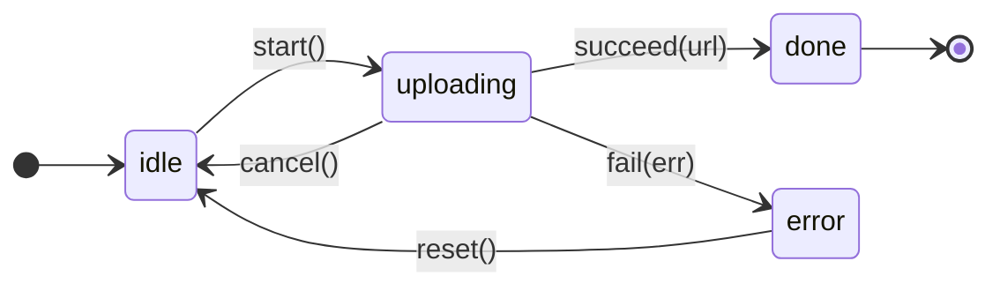

import AnnotatedCode from '../../../components/code/annotated-code/AnnotatedCode.astro';
import AnnotatedStep from '../../../components/code/annotated-code/AnnotatedStep.astro';
import CodeVariants from '../../../components/code/code-variants/CodeVariants.astro';
import CodeVariant from '../../../components/code/code-variants/CodeVariant.astro';
import Figure from '../../../components/figures/Figure.astro';
import Term from '../../../components/ui/Term.astro';
import ExternalResource from '../../../components/ui/ExternalResource.astro';
import TypeCoding from '../../../components/live-coding/TypeCoding/TypeCoding.astro';
import VideoCallout from '../../../components/embeds/VideoCallout.astro';
import { CardGrid } from '@astrojs/starlight/components';
import CourseProgressBar from '../../../components/ui/CourseProgressBar.astro';

<CourseProgressBar value={frontmatter['course-progress']} />

The previous lesson installed the discriminated-union shape: a request state with exactly four variants, where `data` lives only on `success` and `error` only on `error`.
The variants are watertight, so a consumer can't read a field that doesn't exist on the variant in hand.

Those variants are watertight, but the transitions between them are not.
A discriminated union is a static shape, so it says nothing about which variant can follow which: any code can construct any variant from any other, and the compiler raises no objection.
Nothing stops state-management code from reviving a state the user already canceled.

Picture this scenario.
A user starts a file upload, then clicks Cancel halfway through, returning the state to `idle`.
The original `fetch` was already in flight, so a stale `onProgress` callback fires anyway, constructs `{ kind: 'uploading', progress: 50 }`, and the UI snaps back to "uploading…" on an upload the user just canceled.

The mutator that ships this bug takes the current state and a progress number, then constructs an `uploading` variant unconditionally:

<div data-mark-color="orange">

```ts {7}
type UploadState =
  | { kind: 'idle' }
  | { kind: 'uploading'; progress: number }
  | { kind: 'done'; url: string };

const onProgress = (state: UploadState, progress: number): UploadState => {
  return { kind: 'uploading', progress };
};
```

</div>

The function compiles and reads cleanly, but it's wrong: the input type accepts every variant and the body returns `uploading` regardless.
The compiler allows a jump from `idle` or `done` straight into `uploading`, because the static union carries no record of which transitions are legal.

The fix is to type the transition functions so the only way to reach `uploading` is from `idle`, through `start`.
Then the stale callback's attempt to revive a canceled upload fails at compile time.

## What a state machine adds to a discriminated union

A <Term definition="Discriminated union of states paired with typed transition functions; the compiler refuses transitions the types don't allow.">state machine</Term> is a discriminated union of states plus a set of typed transition functions.
The union models which states exist; the transition functions model which state can follow which.

A <Term definition="A function that takes a specific input state (and any event payload) and returns a specific output state. The compiler enforces the source-destination pairing.">transition function</Term> isn't a generic mutator like the buggy `onProgress` above.
Its signature names the variant it accepts and the variant it returns, so the body stays small.
Pass the wrong input state and the compile error fires at the call site, the moment the bug is written, rather than at runtime or in code review.

## The upload state machine

State machines read more easily as pictures than as types: nodes are variants, edges are transitions.
Sketch the picture before the TypeScript, because a handful of labeled edges make the system's rules legible at a glance.

<Figure caption="The upload machine: five labeled transitions. The `progress` self-loop is omitted; the code below covers it.">

</Figure>

The sixth edge, `progress`, is a self-loop on `uploading`: the progress number changes but the variant doesn't.
The diagram omits it, the code below covers it.

Now translate the picture into types.
The states come first, as a discriminated union, each variant carrying the data it's valid with.

```ts
type UploadState =
  | { kind: 'idle' }
  | { kind: 'uploading'; progress: number; controller: AbortController }
  | { kind: 'done'; url: string }
  | { kind: 'error'; error: Error };
```

`kind` is the discriminant, the convention for general taxonomies, chosen here over the previous lesson's `status`.
`status` names the four stages of a single request's lifecycle, `idle | loading | success | error`.
`kind` names a broader feature lifecycle the application steers over time: an upload, an optimistic mutation, anything that moves through multiple stages.
The per-state data sits inside each variant: `progress` and an `AbortController` on `uploading`, a `url` on `done`, an `error` on `error`.
`idle` carries nothing, because it has nothing to carry.

`AbortController` is the standard Web API for canceling in-flight network requests, covered in a later chapter.
Here it's a typed field that lives only on `uploading`, the only state with a request to abort.

Now the transitions.
Each signature names one source variant and one destination, using the intersection form to pin a type to a specific `kind`.
The differences between them are where the lesson lives, so walk through them one at a time.

<AnnotatedCode lang="ts" code={`
const start = (
  state: UploadState & { kind: 'idle' },
): UploadState & { kind: 'uploading' } => ({
  kind: 'uploading',
  progress: 0,
  controller: new AbortController(),
});

const progress = (
  state: UploadState & { kind: 'uploading' },
  next: number,
): UploadState & { kind: 'uploading' } => ({
  ...state,
  progress: next,
});

const succeed = (
  state: UploadState & { kind: 'uploading' },
  url: string,
): UploadState & { kind: 'done' } => ({ kind: 'done', url });

const fail = (
  state: UploadState & { kind: 'uploading' },
  error: Error,
): UploadState & { kind: 'error' } => ({ kind: 'error', error });

const cancel = (
  state: UploadState & { kind: 'uploading' },
): UploadState & { kind: 'idle' } => {
  state.controller.abort();
  return { kind: 'idle' };
};

const reset = (
  state: UploadState & { kind: 'error' },
): UploadState & { kind: 'idle' } => ({ kind: 'idle' });
`}>
  <AnnotatedStep meta={`{1-7}`} color="violet">
    **`start`, idle to uploading.** The simplest transition. The parameter type (`UploadState & { kind: 'idle' }`) names the variant the function accepts; the return type (`UploadState & { kind: 'uploading' }`) names the variant it produces. The body constructs a fresh `AbortController` so a later `cancel` has something to `.abort()`. Every step below mirrors this signature shape.
  </AnnotatedStep>

  <AnnotatedStep meta={`{9-15}`} color="violet">
    **`progress`, uploading to uploading.** The state-preserving update: same variant, updated `progress` field, with `next: number` as the event payload. This is the introduction's buggy function written correctly: the signature refuses any input that isn't `uploading`, so a stale callback can no longer build an uploading state from `idle` or `done`, and the original bug stops compiling.
  </AnnotatedStep>

  <AnnotatedStep meta={`{17-20, 22-25}`} color="violet">
    **`succeed` and `fail`, uploading to done and uploading to error.** Two parallel transitions from `uploading`, each mapping to its terminal variant and dropping the `controller`. The request has resolved or failed, so there's nothing left to abort.
  </AnnotatedStep>

  <AnnotatedStep meta={`{27-32}`} color="orange">
    **`cancel`, uploading to idle.** The only transition with a side effect: the body calls `.abort()` on the controller before returning the new state. That effect belongs here because it's part of what `cancel` means; a `cancel` that didn't abort the request would leave bytes still flowing. Larger, orchestrated effects like retries and timers come in later chapters.
  </AnnotatedStep>

  <AnnotatedStep meta={`{34-36}`} color="violet">
    **`reset`, error to idle.** The recovery edge: the user dismisses the error and the machine returns to `idle`. This is the only transition whose input variant isn't `uploading` or `idle`.
  </AnnotatedStep>
</AnnotatedCode>

Read those signatures once more on their own: the input type names the variant the function accepts, the output type names the variant it produces.
The diagram and the six signatures are two views of one machine, nodes becoming variants and edges becoming function signatures.

## Per-state invariants

Look back at `UploadState`.
Each variant holds exactly the data that state is valid with, no more and no less.
The name for this is **per-state invariants**.

The payoff is a compile-time guarantee: the caller cannot read `url` on `uploading` or `controller` on `idle`.
The invariant lives in the type, not in a runtime null-check the consumer might forget.
The shape this lesson forbids is the flat-with-optionals form, which collapses every variant's data onto one object with every field optional.

<CodeVariants>
  <CodeVariant label="Per-variant invariants">
    ```ts
    type UploadState =
      | { kind: 'idle' }
      | { kind: 'uploading'; progress: number; controller: AbortController }
      | { kind: 'done'; url: string }
      | { kind: 'error'; error: Error };
    ```
    Each variant carries its own fields and nothing more. The compiler refuses `state.url` on `uploading` and `state.controller` on `idle`, because those fields don't exist on those variants. No runtime check required.
  </CodeVariant>

  <CodeVariant label="Flat with optionals">
    ```ts
    type UploadState = {
      kind: 'idle' | 'uploading' | 'done' | 'error';
      progress?: number;
      controller?: AbortController;
      url?: string;
      error?: Error;
    };
    ```
    Every field is optional on every variant, so every consumer of `state.url` has to null-check first: the type says `url` could legally be present on `idle`, `uploading`, or `error`. This is the previous lesson's flag-set anti-pattern in another form, with the impossible states the discriminated shape closed off back again.
  </CodeVariant>
</CodeVariants>

Once you have the eye for it, you'll spot the rule in production type aliases: variant-specific fields living inside their variants rather than as top-level optionals.

## The illegal-transition guard

The intersection form `UploadState & { kind: 'idle' }` is narrower than `UploadState`: its only inhabitants are values whose `kind` is `'idle'`.
So when `start` declares its parameter as `UploadState & { kind: 'idle' }`, the compiler refuses any caller that hands it a wider `UploadState`, because that type includes variants `start` can't accept.
That refusal is what enforces the machine. At a call site it looks like this:

```ts
declare const currentState: UploadState;

// Compile error: Argument of type 'UploadState' is not assignable to
// parameter of type 'UploadState & { kind: "idle" }'.
const next = start(currentState);
```

The error names the gap: `currentState` might be `uploading`, `done`, or `error`, and `start` only accepts `idle`.
The fix is the narrowing form from the previous lesson, narrow first and then call.

```ts
if (currentState.kind === 'idle') {
  const next = start(currentState);
  // currentState narrowed to { kind: 'idle' } inside this block
}
```

Inside the `if`, the compiler narrows `currentState` to `UploadState & { kind: 'idle' }`, which matches `start`'s input type exactly; outside the block it widens back.
This composes well: a UI component reading a state narrows once, then dispatches to the matching transition function.

This is where the introduction's bug dies.
The only function that produces `uploading` is `start`, and `start` only accepts `idle`, so the stale `onProgress` callback can't revive a canceled upload, the call that would do so won't compile.

:::tip
When you find yourself writing one function that switches on the input variant and produces different output variants per branch, ask whether the split form would read better. Usually it does: the signatures document the machine, the function names document the verbs, and each call site picks the right transition by name.
:::

## Three canonical SaaS machines

The same shape, a discriminated union plus typed transitions, fits a surprising number of SaaS features.
Three recur often enough to meet now.

The first is the upload machine you just built.
It reappears whenever a file moves to object storage: the destination changes, the machine doesn't.

The second is **optimistic mutation**.
The user types a new value, the UI shows it immediately so the form feels instant, and the network call goes out in the background.
If the server accepts, the value is confirmed; if it rejects, the UI rolls back to the original.

```ts
type MutationState =
  | { kind: 'idle' }
  | { kind: 'optimistic'; pending: string; original: string }
  | { kind: 'confirmed'; value: string }
  | { kind: 'failed'; original: string; error: Error };

declare const apply: (
  state: MutationState & { kind: 'idle' },
  original: string,
  pending: string,
) => MutationState & { kind: 'optimistic' };

declare const confirm: (
  state: MutationState & { kind: 'optimistic' },
  value: string,
) => MutationState & { kind: 'confirmed' };

declare const rollback: (
  state: MutationState & { kind: 'optimistic' },
  error: Error,
) => MutationState & { kind: 'failed' };
```

The per-state invariant earns its keep here.
The `optimistic` and `failed` variants both carry `original`, because that is what `rollback` restores and what lets `failed` show a message like "couldn't save, reverting to the previous value."
The `confirmed` variant drops it, since there is no rollback after success.
The shape encodes the safety property: rollback is only callable on a state that remembers what to roll back to.

The value is typed `string` here to keep the focus on the intersection-with-discriminant form; a later lesson generalizes it so any entity can be mutated optimistically.

The third is the **Stripe subscription** lifecycle.
The variants aren't chosen by the application; Stripe's API dictates them.
The job is to model them as a discriminated union carrying the per-variant fields Stripe actually sends.

```ts
type SubscriptionState =
  | { status: 'trialing'; trialEndsAt: Date }
  | { status: 'active'; currentPeriodEnd: Date }
  | { status: 'past_due'; nextRetryAt: Date }
  | { status: 'canceled'; canceledAt: Date }
  | { status: 'incomplete'; latestInvoiceId: string };
```

Five variants, five per-state invariants.
`trialing` carries `trialEndsAt` for the upsell timer, `past_due` carries `nextRetryAt` so the <Term definition="The flow that chases a failed payment: notifying the customer and retrying the charge until it clears or the subscription is canceled.">dunning</Term> surface can tell the customer when Stripe retries the card, `canceled` carries `canceledAt` for audit logs and the UI, and `incomplete` carries `latestInvoiceId` so the recovery flow reaches the right invoice.
The discriminant is `status`, not `kind`, because Stripe's API uses `status`: match the wire vocabulary rather than fight it.

This machine differs in who owns the transitions.
The application doesn't write `cancel(subscription)` or `markPastDue(subscription)`; Stripe performs the transitions, then sends <Term definition="An HTTP request an external service sends to your server when an event happens on their side, so you react to it instead of polling for changes.">webhook</Term> events describing what it already did.
The application's job is to validate those events and project them into stored state.
The general rule: when an external system dictates the transitions, model the states and validate the incoming events, but don't author the transition functions.

The example uses `Date` because it's familiar; production code stores wire timestamps as `Temporal.Instant`, a swap covered later in this unit.

## Transition functions vs. reducers

The signatures you've been reading are **standalone transition functions**: one named function per source-to-destination pair, so each signature reads as a contract.
The lesson defaults to this form for that legibility.

A **reducer** is the same machine in one function, `(state: State, event: Event) => State`, switching on the event's `type` to reach each transition body.
Reach for it when a framework expects that signature, as React's `useReducer` and Zustand stores both do.

## When to reach for XState

The plain-TypeScript form, a discriminated union plus typed transition functions, covers most SaaS state machines.
Past a threshold it stops scaling, and that threshold is worth naming.

**XState v5** is the next tool up when a machine grows past a handful of branching states, or needs regions that progress in parallel or history nodes that resume where the user left off.
The course's projects stay below that line and commit to the plain-TS form; XState is named here only so you recognize it when you cross it.

<VideoCallout videoId="s0h34OkEVUE" videoTitle="This Library Makes State Management So Much Easier">
  Web Dev Simplified's 12-minute tour of XState and what it buys you over hand-rolled transitions, for the day your machine crosses the threshold.
</VideoCallout>

## Exercise: type the optimistic-mutation transitions

The optimistic-mutation machine above wrote out three transitions and left the fourth, `retry`, implied.
Type all four below.

<TypeCoding
  instructions="Type the four transitions so each call-site query resolves to the right output variant. Use the intersection form `Mutation & { kind: 'idle' }` (and its siblings) to name the input and output variants. The `@ts-expect-error` directives at the bottom must keep firing — the illegal calls have to stay illegal."
  starter={`type Mutation =
  | { kind: 'idle' }
  | { kind: 'optimistic'; pending: string; original: string }
  | { kind: 'confirmed'; value: string }
  | { kind: 'failed'; original: string; error: Error };

// TODO: type the four transitions so the call-site below compiles.
const apply = (/* … */) => { /* fill in */ };
const confirm = (/* … */) => { /* fill in */ };
const rollback = (/* … */) => { /* fill in */ };
const retry = (/* … */) => { /* fill in */ };

// Call-site harness (do not edit)
declare const idle: Mutation & { kind: 'idle' };
declare const optimistic: Mutation & { kind: 'optimistic' };
declare const failed: Mutation & { kind: 'failed' };

const a = apply(idle, 'old', 'new');
//    ^?
const c = confirm(optimistic, 'server-value');
//    ^?
const r = rollback(optimistic, new Error('boom'));
//    ^?
const rt = retry(failed);
//    ^?

// @ts-expect-error — apply requires \`idle\`, not \`optimistic\`
apply(optimistic, 'old', 'new');

// @ts-expect-error — confirm requires \`optimistic\`, not \`failed\`
confirm(failed, 'server-value');
`}
  expectedQueries={[
    { line: 19, contains: 'optimistic' },
    { line: 21, contains: 'confirmed' },
    { line: 23, contains: 'failed' },
    { line: 25, contains: 'optimistic' },
  ]}
/>

<details>
<summary>Reveal the reference solution</summary>

```ts
const apply = (
  state: Mutation & { kind: 'idle' },
  original: string,
  pending: string,
): Mutation & { kind: 'optimistic' } => ({
  kind: 'optimistic',
  pending,
  original,
});

const confirm = (
  state: Mutation & { kind: 'optimistic' },
  value: string,
): Mutation & { kind: 'confirmed' } => ({ kind: 'confirmed', value });

const rollback = (
  state: Mutation & { kind: 'optimistic' },
  error: Error,
): Mutation & { kind: 'failed' } => ({
  kind: 'failed',
  original: state.original,
  error,
});

const retry = (
  state: Mutation & { kind: 'failed' },
): Mutation & { kind: 'optimistic' } => ({
  kind: 'optimistic',
  pending: state.original,
  original: state.original,
});
```

Each signature names one source variant on the parameter and one destination variant on the return. `rollback` reads `state.original` because the `optimistic` variant carries it, and `retry` reads `state.original` because the `failed` variant carries it. The call-site `apply(optimistic, …)` stays illegal because `Mutation & { kind: 'optimistic' }` is not assignable to `Mutation & { kind: 'idle' }`, which is the compile-time guard the lesson installs.

</details>

## External resources

<CardGrid>
  <ExternalResource
    title="MDN — AbortController"
    href="https://developer.mozilla.org/en-US/docs/Web/API/AbortController"
    icon="simple-icons:mdnwebdocs"
    description="The Web API the upload's `uploading` variant carries. The mechanics for canceling in-flight requests, ready for when you wire up the actual fetch."
  />
  <ExternalResource
    title="Statecharts — Constraints liberate, liberties constrain"
    href="https://statecharts.dev/"
    icon="lucide:workflow"
    description="David Khourshid's framing of state machines as a design tool. It motivates why typed transitions pay off, and it's about the pattern rather than any particular library."
  />
  <ExternalResource
    title="XState — When to use a state machine"
    href="https://stately.ai/docs/state-machines-and-statecharts"
    icon="lucide:cog"
    description="The threshold-tool reference. Read this when your plain-TS machine hits parallel states, history nodes, or more than five branching states; that's when XState earns its weight."
  />
</CardGrid>
