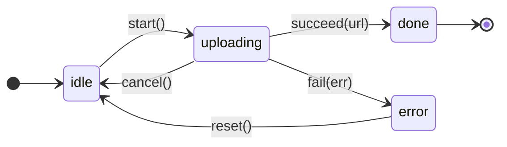

import AnnotatedCode from '../../../components/code/annotated-code/AnnotatedCode.astro';
import AnnotatedStep from '../../../components/code/annotated-code/AnnotatedStep.astro';
import CodeVariants from '../../../components/code/code-variants/CodeVariants.astro';
import CodeVariant from '../../../components/code/code-variants/CodeVariant.astro';
import Figure from '../../../components/figures/Figure.astro';
import Term from '../../../components/ui/Term.astro';
import ExternalResource from '../../../components/ui/ExternalResource.astro';
import TypeCoding from '../../../components/live-coding/TypeCoding/TypeCoding.astro';
import Matching from '../../../components/exercises/matching/Matching.astro';
import Pair from '../../../components/exercises/matching/Pair.astro';
import { CardGrid } from '@astrojs/starlight/components';

The previous lesson installed the discriminated-union shape: a request state that admits exactly four variants, with `data` living only on `success` and `error` living only on `error`. The variants are watertight. A consumer can't read a field that doesn't exist on the variant in hand, and the type collapses the combinatorial space of the flat shape onto the four states the runtime actually inhabits.

There's still a crack. The variants are watertight, but the **transitions between them are not**. The union as a static shape doesn't say which variants can follow which — code anywhere in the codebase can construct any variant from any other variant, and the compiler shrugs. Nothing in the type stops a value at `error` from being replaced by `loading`; nothing stops `success` from being overwritten by `idle`; nothing stops a piece of state-management code from reviving a state the user already canceled.

Picture a file upload. The user picks a 200 MB video and the request starts; the `fetch` is in flight, sending bytes. Halfway through, the user clicks Cancel — the upload returns to `idle`. Two seconds later, a stale `onProgress` callback from the original `fetch` fires (the network was already running when the user clicked, the callback was already scheduled) and naively constructs a new `{ kind: 'uploading', progress: 50 }`. The UI snaps back to "uploading…" on an upload the user just canceled — the progress bar marches forward against a request the user has no idea is still being tracked.

The naive mutator that ships the bug looks something like this — it takes whatever state is current and a progress number, and constructs an `uploading` variant unconditionally:

<div data-mark-color="orange">

```ts {7}
type UploadState =
  | { kind: 'idle' }
  | { kind: 'uploading'; progress: number }
  | { kind: 'done'; url: string };

const onProgress = (state: UploadState, progress: number): UploadState => {
  return { kind: 'uploading', progress };
};
```

</div>

The function compiles. It reads cleanly. It even looks defensible — "given a progress event, return an uploading state." And it's wrong, because the input type accepts every variant and the body returns `uploading` regardless. The compiler is fine with a transition from `idle` (or `done`) straight back into `uploading` because the static union doesn't model which variants can follow which.

The fix is to type the **transition functions** so the only way to reach `uploading` is from `idle` via `start`, and the stale callback's attempt to revive a canceled upload fails at compile time. That's this lesson.

## What a state machine adds to a discriminated union

A <Term definition="Discriminated union of states paired with typed transition functions; the compiler refuses transitions the types don't allow.">state machine</Term> is a discriminated union of states plus a set of typed transition functions, where each function takes a specific state (or set of states) as input and returns a specific state as output. The union models which states exist; the transition functions model which states can follow which. That second part is the new thing.

A <Term definition="A function that takes a specific input state (and any event payload) and returns a specific output state. The compiler enforces the source–destination pairing.">transition function</Term> isn't a generic mutator like the buggy `onProgress` above. Its **signature** names the variant it accepts and the variant it returns. The body is small; the signature does the work. When a caller tries to call the function with the wrong input state, the compile error fires at the call site — not at runtime, not in code review, at the keystroke that wrote the bug.

The one-line contract: the union models which states exist; the transition functions model which transitions are valid. The rest of the lesson is one worked example to make that sentence concrete.

## The upload machine

State machines read more easily as pictures than as types. Nodes are variants, edges are transitions, and the verbs sit on the edges. Before writing any TypeScript, an experienced engineer usually draws something like this on a whiteboard — five labeled edges and the rules of the world become legible at a glance.

<Figure caption="The upload machine — five labeled transitions. The `progress` self-loop is omitted; the code below covers it.">

</Figure>

The diagram lists five edges and skips a sixth. `progress` is a self-loop on `uploading` — a state-preserving update where the progress number changes but the variant doesn't. Mermaid renders self-loops badly enough that it's cleaner to omit them from the picture and cover them in the code; nothing about the transition is conceptually different from the others.

Now translate the picture into types. The states first — a discriminated union, exactly the shape from the previous lesson, with each variant carrying the data that variant is valid with:

```ts
type UploadState =
  | { kind: 'idle' }
  | { kind: 'uploading'; progress: number; controller: AbortController }
  | { kind: 'done'; url: string }
  | { kind: 'error'; error: Error };
```

Four variants. `kind` is the discriminant — the convention for general taxonomies the previous lesson named. This is a deliberate departure from the previous lesson's `status` choice: `status` belongs to a single request's lifecycle (the four-stage `idle | loading | success | error` shape), while `kind` belongs to a broader feature lifecycle the application orchestrates over time — upload, optimistic mutation, anything the user steers through multiple stages. The per-state data sits inside each variant: a `progress` number and an `AbortController` on `uploading`, a `url` on `done`, an `error` on `error`. `idle` carries nothing because there's nothing for it to carry.

`AbortController` is the standard Web API for canceling in-flight network requests — a chapter later in this unit owns its mechanics. Here it's a typed field that lives only on `uploading`, because `uploading` is the only state with a request to abort.

Now the transitions. Each function's signature names one source variant and one destination variant, using the intersection form to pin the input type to a specific `kind`. Walk through them one at a time — the differences between transitions are the lesson.

<AnnotatedCode lang="ts" code={`
const start = (
  state: UploadState & { kind: 'idle' },
): UploadState & { kind: 'uploading' } => ({
  kind: 'uploading',
  progress: 0,
  controller: new AbortController(),
});

const progress = (
  state: UploadState & { kind: 'uploading' },
  next: number,
): UploadState & { kind: 'uploading' } => ({
  ...state,
  progress: next,
});

const succeed = (
  state: UploadState & { kind: 'uploading' },
  url: string,
): UploadState & { kind: 'done' } => ({ kind: 'done', url });

const fail = (
  state: UploadState & { kind: 'uploading' },
  error: Error,
): UploadState & { kind: 'error' } => ({ kind: 'error', error });

const cancel = (
  state: UploadState & { kind: 'uploading' },
): UploadState & { kind: 'idle' } => {
  state.controller.abort();
  return { kind: 'idle' };
};

const reset = (
  state: UploadState & { kind: 'error' },
): UploadState & { kind: 'idle' } => ({ kind: 'idle' });
`}>
  <AnnotatedStep meta={`{1-7}`} color="violet">
    **`start` — idle to uploading.** The simplest transition. The intersection form on the parameter (`UploadState & { kind: 'idle' }`) names the variant the function accepts; the return type (`UploadState & { kind: 'uploading' }`) names the variant it produces. The body constructs a fresh `AbortController` so a later `cancel` has something to call `.abort()` on. Every later step mirrors this signature shape.
  </AnnotatedStep>

  <AnnotatedStep meta={`{9-15}`} color="violet">
    **`progress` — uploading to uploading.** The state-preserving update — same variant, updated `progress` field. The second positional parameter `next: number` is the event payload. This is the function the introduction's bug tried to be. The signature refuses any input that isn't `uploading`, so a stale callback can't construct an uploading state from `idle` or `done` because its input type doesn't allow them. The bug from the introduction is now uncompilable.
  </AnnotatedStep>

  <AnnotatedStep meta={`{17-20, 22-25}`} color="violet">
    **`succeed` and `fail` — uploading to done; uploading to error.** Two parallel transitions, both from `uploading`, each mapping to its terminal variant and dropping the `controller` along the way — the request resolved (or failed at the server), nothing left to abort.
  </AnnotatedStep>

  <AnnotatedStep meta={`{27-32}`} color="orange">
    **`cancel` — uploading to idle.** The only transition in the machine with a side effect. The body calls `.abort()` on the controller before returning the new state, and that's allowed because the side effect is part of the transition's semantics — `cancel` without aborting the network request would leave bytes still flowing. For machines whose effects are larger or more orchestrated — retries, timers, downstream calls — the production patterns land in later chapters.
  </AnnotatedStep>

  <AnnotatedStep meta={`{34-36}`} color="violet">
    **`reset` — error to idle.** The recovery edge — the user dismisses the error and the machine returns to `idle`, ready to start over. The only transition function whose input variant isn't `uploading` or `idle`.
  </AnnotatedStep>
</AnnotatedCode>

Read those signatures once more without the surrounding prose. The input type names the variant the function accepts; the output type names the variant it produces. That's the load-bearing pattern of the lesson. The diagram on the whiteboard and the six TypeScript signatures are two views of the same artifact — nodes become variants, edges become function signatures.

## Per-state invariants

Look back at `UploadState`. The `controller` lives on `uploading` only. The `url` lives on `done` only. The `error` lives on `error` only. The `progress` lives on `uploading` only. Each state holds exactly the data that state is valid with — no more, no less. There's a name for this: **per-state invariants**, the structural rule that makes the pattern pay across a whole codebase.

The compile-time guarantee is the win. The caller cannot read `url` on `uploading` or `controller` on `idle`. The invariants live in the **type**, not in a runtime null-check the consumer might forget. Compare the shape this lesson teaches with the shape it forbids — the flat-with-optionals form that flattens every variant's data onto a shared object, with everything optional.

<CodeVariants>
  <CodeVariant label="Per-variant invariants">
    ```ts
    type UploadState =
      | { kind: 'idle' }
      | { kind: 'uploading'; progress: number; controller: AbortController }
      | { kind: 'done'; url: string }
      | { kind: 'error'; error: Error };
    ```
    Each variant carries exactly the data it's valid with. The compiler refuses `state.url` on `uploading` and `state.controller` on `idle` because those fields don't exist on those variants. The invariants are part of the type — no runtime check required.
  </CodeVariant>

  <CodeVariant label="Flat with optionals">
    ```ts
    type UploadState = {
      kind: 'idle' | 'uploading' | 'done' | 'error';
      progress?: number;
      controller?: AbortController;
      url?: string;
      error?: Error;
    };
    ```
    Every field is optional on every variant. Every consumer of `state.url` has to null-check first, because the type says `url` could legally be present on `idle`, `uploading`, or `error`. This is the previous lesson's flag-set anti-pattern returning under a new mask — the impossible states the discriminated shape closed off are back.
  </CodeVariant>
</CodeVariants>

The same per-state-invariant discipline shows up again in TanStack Query mutation states later in the course and in Stripe's subscription status (which you'll see at the end of this lesson). When you read a real production type alias and notice the variant-specific fields living inside variants rather than as top-level optionals, that's this rule.

## The illegal-transition guard

The intersection form `UploadState & { kind: 'idle' }` does the work in both directions. It's narrower than `UploadState` — the only inhabitants are values whose `kind` is `'idle'`. When `start` declares its parameter as `UploadState & { kind: 'idle' }`, the compiler refuses any caller that hands it a value of the wider `UploadState`, because that wider type includes variants `start` can't accept.

That refusal is the lesson's enforcement. Here's what it looks like at a call site:

```ts
declare const currentState: UploadState;

// Compile error: Argument of type 'UploadState' is not assignable to
// parameter of type 'UploadState & { kind: "idle" }'.
const next = start(currentState);
```

The error message names the gap exactly: `UploadState` is wider than the function wants. The caller has a value that might be `uploading` or `done` or `error`, and `start` only accepts `idle`. The fix is the narrowing form from the previous lesson — narrow first, then call:

```ts
if (currentState.kind === 'idle') {
  const next = start(currentState);
  // currentState narrowed to { kind: 'idle' } inside this block
}
```

Inside the `if`, the compiler narrows `currentState` to `UploadState & { kind: 'idle' }`, which matches `start`'s input type exactly. Outside the block, `currentState` widens back. The pattern composes: a UI component reading a state, deciding what transitions to offer, narrows once and dispatches to the matching transition function.

This is where the introduction's bug dies. The stale `onProgress` callback can't construct `{ kind: 'uploading' }` from a canceled state because the only function that produces `uploading` is `start`, and `start` only accepts `idle`. The callback never gets the chance to revive the upload, because the call that would do so won't compile. Notice the shape of the fix — six small transition functions, each with one source variant and one destination, instead of one "smart" mutator that branches internally on the input state. The split-function form is the default because each signature **is** a one-line contract: this state, then that state.

:::tip
When you find yourself writing one function that switches on the input variant and produces different output variants per branch, ask whether the split form would read better. Usually it does — the signatures document the machine, the function names document the verbs, and each call site picks the right transition by name.
:::

## Three canonical SaaS machines

State machines aren't a niche pattern. The same shape — discriminated union plus typed transitions — fits a surprising number of SaaS features once you have the eye for it. Three of them recur often enough that they're worth meeting now.

The first is the upload machine you just built. The same machine ships in the R2 presigned-PUT flow in later chapters; the destination changes, the machine doesn't.

The second is **optimistic mutation** — the shape every TanStack Query mutation operates against. The user types a new value, the UI shows it immediately (so the form feels instant), and the network call goes out in the background. If the server accepts, the optimistic value is confirmed. If the server rejects, the UI rolls back to the original.

```ts
type MutationState =
  | { kind: 'idle' }
  | { kind: 'optimistic'; pending: string; original: string }
  | { kind: 'confirmed'; value: string }
  | { kind: 'failed'; original: string; error: Error };

declare const apply: (
  state: MutationState & { kind: 'idle' },
  original: string,
  pending: string,
) => MutationState & { kind: 'optimistic' };

declare const confirm: (
  state: MutationState & { kind: 'optimistic' },
  value: string,
) => MutationState & { kind: 'confirmed' };

declare const rollback: (
  state: MutationState & { kind: 'optimistic' },
  error: Error,
) => MutationState & { kind: 'failed' };
```

The per-state invariant earns its keep here. The `optimistic` variant **must** carry the `original` value, because that's what `rollback` restores if the server rejects. The `confirmed` variant doesn't need `original` (no rollback after success). The `failed` variant carries `original` again so the UI can show "we couldn't save your change; reverting to…" The shape encodes the safety property: rollback is only callable on a state that remembers what to roll back to.

(The values are typed as `string` here for the survey. In production this generalizes — any entity can be mutated optimistically — but the generics that express that land in a later lesson of this chapter. The pattern this lesson is teaching is the intersection-with-discriminant form, and pinning the value type keeps the focus there.)

The third is the **Stripe subscription** lifecycle. The variants here aren't chosen by the application — they're dictated by Stripe's API, and the move is to model them as a discriminated union with the per-variant fields Stripe actually sends.

```ts
type SubscriptionState =
  | { status: 'trialing'; trialEndsAt: Date }
  | { status: 'active'; currentPeriodEnd: Date }
  | { status: 'past_due'; nextRetryAt: Date }
  | { status: 'canceled'; canceledAt: Date }
  | { status: 'incomplete'; latestInvoiceId: string };
```

Five variants, five per-state invariants. `trialing` carries a `trialEndsAt` because the upsell timer in the UI reads it. `past_due` carries a `nextRetryAt` because the dunning surface needs to tell the customer when Stripe will try the card again. `canceled` carries a `canceledAt` because audit logs and the UI both want the timestamp. `incomplete` carries the `latestInvoiceId` so the recovery flow can reach the right invoice. The variants use `status` as the discriminant, not `kind`, because Stripe's API uses `status` — match the wire vocabulary, don't fight it.

The subtle difference: in the upload machine, the application owns the transitions and writes them. In the subscription machine, the **transitions are owned by Stripe** — the application doesn't write `cancel(subscription)` or `markPastDue(subscription)`. It receives webhook events that describe transitions Stripe has already performed, and the local job is to validate those events and project them into a stored state. For machines whose transitions are dictated by an external system, the application models the states and validates the incoming transitions; it does not author the transition functions. The webhook handler that triggers the projection lands in the Stripe billing chapter.

:::note
The `Date` type appears in the subscription example because it's familiar. In production code the project standardizes on `Temporal.PlainDate` and `Temporal.Instant` (a chapter on async and time later in this unit owns the swap). Treating the wire timestamp as `Date` here keeps the focus on the state-machine shape; substitute `Temporal.Instant` once you've met it.
:::

## Transition functions vs. reducers

The signatures you've been reading are **standalone transition functions** — one function per transition, each with its own name and a signature that documents one source-to-destination pair. This is the lesson's default form because each signature reads as a contract.

There's a second form you'll meet in React's `useReducer` and in Zustand stores: the **reducer**, one function with the signature `(state: State, event: Event) => State` that switches on the event's `type` discriminant internally and routes to the right transition body in each branch. The reducer form earns its weight when a framework expects that signature — `useReducer` dispatches actions through a single reducer, and Zustand stores compose around the same shape. Standalone functions and reducers are two encodings of the same machine; the lesson defaults to the standalone form for legibility, and you'll meet the reducer form when the React unit covers `useReducer` and when Zustand lands in a later unit.

## When to reach for XState

The plain-TypeScript form — discriminated union plus typed transition functions — covers around 90% of SaaS state-machine needs. The threshold where it stops scaling is real, though, and worth naming.

**XState v5** earns its weight when the machine has more than five or so states with branching transitions, or when the machine has **parallel states** (independently progressing regions — a wizard with three concurrent form sections, each with its own lifecycle), or **history nodes** (the user digresses and the machine resumes from where they left off), or when the **Stately Studio inspector** for visualizing live machines during development pays for itself in onboarding new engineers to a complex flow. XState also ships first-class actor support and built-in typed async — relevant when the machine orchestrates more than synchronous state changes.

The course commits to the plain-TS form. XState is named once here so you recognize it as the next tool up and know the threshold; the course's projects stay under it.

## Exercise — type the optimistic-mutation transitions

The optimistic-mutation machine above had three transitions written out and one elided. Type the four transitions so the call-site queries resolve to the right output variants, using the intersection form `Mutation & { kind: 'idle' }` (and its siblings) to name the input and output variants.

The `@ts-expect-error` directives at the bottom mark illegal calls that must remain illegal — your typings should keep them firing. If your types are right and the directives become unused, the harness will tell you.

<TypeCoding
  instructions="Type the four transitions so each call-site query resolves to the right output variant. Use the intersection form `Mutation & { kind: 'idle' }` (and its siblings) to name the input and output variants. The `@ts-expect-error` directives at the bottom must keep firing — the illegal calls have to stay illegal."
  starter={`type Mutation =
  | { kind: 'idle' }
  | { kind: 'optimistic'; pending: string; original: string }
  | { kind: 'confirmed'; value: string }
  | { kind: 'failed'; original: string; error: Error };

// TODO: type the four transitions so the call-site below compiles.
const apply = (/* … */) => { /* fill in */ };
const confirm = (/* … */) => { /* fill in */ };
const rollback = (/* … */) => { /* fill in */ };
const retry = (/* … */) => { /* fill in */ };

// Call-site harness (do not edit)
declare const idle: Mutation & { kind: 'idle' };
declare const optimistic: Mutation & { kind: 'optimistic' };
declare const failed: Mutation & { kind: 'failed' };

const a = apply(idle, 'old', 'new');
//    ^?
const c = confirm(optimistic, 'server-value');
//    ^?
const r = rollback(optimistic, new Error('boom'));
//    ^?
const rt = retry(failed);
//    ^?

// @ts-expect-error — apply requires \`idle\`, not \`optimistic\`
apply(optimistic, 'old', 'new');

// @ts-expect-error — confirm requires \`optimistic\`, not \`failed\`
confirm(failed, 'server-value');
`}
  expectedQueries={[
    { line: 19, contains: 'optimistic' },
    { line: 21, contains: 'confirmed' },
    { line: 23, contains: 'failed' },
    { line: 25, contains: 'optimistic' },
  ]}
/>

:::note[Reference solution]
```ts
const apply = (
  state: Mutation & { kind: 'idle' },
  original: string,
  pending: string,
): Mutation & { kind: 'optimistic' } => ({
  kind: 'optimistic',
  pending,
  original,
});

const confirm = (
  state: Mutation & { kind: 'optimistic' },
  value: string,
): Mutation & { kind: 'confirmed' } => ({ kind: 'confirmed', value });

const rollback = (
  state: Mutation & { kind: 'optimistic' },
  error: Error,
): Mutation & { kind: 'failed' } => ({
  kind: 'failed',
  original: state.original,
  error,
});

const retry = (
  state: Mutation & { kind: 'failed' },
): Mutation & { kind: 'optimistic' } => ({
  kind: 'optimistic',
  pending: state.original,
  original: state.original,
});
```

Each signature names one source variant on the parameter and one destination variant on the return. `rollback` reads `state.original` because the `optimistic` variant carries it; `retry` reads `state.original` because the `failed` variant carries it. The call-site `apply(optimistic, …)` stays illegal because `Mutation & { kind: 'optimistic' }` is not assignable to `Mutation & { kind: 'idle' }` — that's the compile-time guard the lesson installs.
:::

## Exercise — pair the feature to its machine

The point of the pattern is to recognize when a feature wants one. Pair each SaaS feature description with the state machine that fits it; the verbs and stages in each description are the cues.

<Matching instructions="Pair each SaaS feature with the state machine that fits it. Look for the lifecycle in each description — the verbs and stages are the cues.">
  <Pair>
    <Fragment slot="left">An invoice payment Stripe is retrying after a failed charge.</Fragment>
    <Fragment slot="right">Subscription/billing machine with `past_due` carrying a `nextRetryAt` timestamp.</Fragment>
  </Pair>
  <Pair>
    <Fragment slot="left">A file the user is dragging into the upload zone.</Fragment>
    <Fragment slot="right">Upload machine — `idle`, `uploading` with `AbortController`, `done` with URL, `error`.</Fragment>
  </Pair>
  <Pair>
    <Fragment slot="left">A draft article the author keeps editing until they hit Publish.</Fragment>
    <Fragment slot="right">Draft-to-published machine — `draft`, `review`, `published`, `archived`.</Fragment>
  </Pair>
  <Pair>
    <Fragment slot="left">A comment the user typed and submitted; the UI shows it immediately while the server persists.</Fragment>
    <Fragment slot="right">Optimistic mutation — `idle`, `optimistic` with `original` held for rollback, `confirmed`, `failed`.</Fragment>
  </Pair>
  <Pair>
    <Fragment slot="left">A user that just signed up and needs to verify their email before any other action.</Fragment>
    <Fragment slot="right">Onboarding machine — `unverified`, `verified-incomplete-profile`, `verified-complete`.</Fragment>
  </Pair>
</Matching>

## External resources

<CardGrid>
  <ExternalResource
    title="MDN — AbortController"
    href="https://developer.mozilla.org/en-US/docs/Web/API/AbortController"
    icon="simple-icons:mdnwebdocs"
    description="The Web API the upload's `uploading` variant carries. The mechanics for canceling in-flight requests, ready for when you wire up the actual fetch."
  />
  <ExternalResource
    title="Statecharts — Constraints liberate, liberties constrain"
    href="https://statecharts.dev/"
    icon="lucide:workflow"
    description="David Khourshid's framing of state machines as a design tool. The piece that motivates why typed transitions pay; about the pattern, not about any particular library."
  />
  <ExternalResource
    title="XState — When to use a state machine"
    href="https://stately.ai/docs/state-machines-and-statecharts"
    icon="lucide:cog"
    description="The threshold-tool reference. Read this when your plain-TS machine hits parallel states, history nodes, or more than five branching states — that's when XState earns its weight."
  />
</CardGrid>
