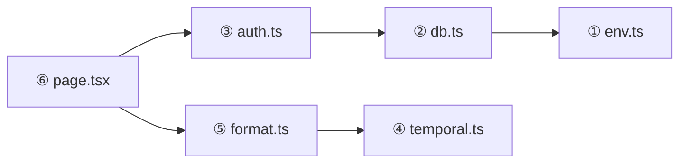

import Figure from '../../../components/figures/Figure.astro';
import CodeVariants from '../../../components/code/code-variants/CodeVariants.astro';
import CodeVariant from '../../../components/code/code-variants/CodeVariant.astro';
import TabbedContent from '../../../components/figures/tabbed-content/TabbedContent.astro';
import TabbedItem from '../../../components/figures/tabbed-content/TabbedItem.astro';
import MultipleChoice from '../../../components/exercises/multiple-choice/MultipleChoice.astro';
import McqChoice from '../../../components/exercises/multiple-choice/McqChoice.astro';
import McqWhy from '../../../components/exercises/multiple-choice/McqWhy.astro';
import Term from '../../../components/ui/Term.astro';
import VideoCallout from '../../../components/embeds/VideoCallout.astro';
import ExternalResource from '../../../components/ui/ExternalResource.astro';
import { CardGrid, FileTree } from '@astrojs/starlight/components';
import CourseProgressBar from '../../../components/ui/CourseProgressBar.astro';

<CourseProgressBar value={frontmatter['course-progress']} />

Suppose one file, `lib/utils.ts`, holds both a pure date formatter and a `getCurrentUser` that reads cookies and queries the database.
A client component imports only the formatter.
The browser still downloads 800KB of database driver, code the user will never run, because the bundler walked from that component through every reachable import.

The previous lesson framed each import as an edge in a directed graph.
This lesson is about what the runtime and bundler **do** with that graph: how they evaluate it, what an import actually points at, and which edges decide what reaches the browser.

## How the runtime evaluates the graph: depth-first, once per module

A `console.log` at the top of a leaf module runs *before* one at the top of the file that imported it, and the evaluation order is why.

The runtime starts at your entry module, follows each `import` down to its target, and recurses into that target's imports before running any of the importer's own top-level code.
A module evaluates only after **all** of its imports have finished.
Leaves run first, the root runs last.

<Figure caption="The runtime walks from `page.tsx` depth-first; numbered badges mark the evaluation order. Leaves finish before their importers, so `env.ts` runs first and `page.tsx` runs last. Each module runs exactly once.">

</Figure>

Three rules follow.

**Depth-first, post-order.** The runtime finishes a module's children before the module itself, so no top-level statement in `auth.ts` can run until `db.ts` has finished and its exports exist.

**Once per module.** A file imported from two places does not run twice: the runtime caches each module by its resolved path, so the second `import` reuses the first evaluation and every top-level `const` is shared across all consumers.
This is why the next lesson's module-level singleton works, a single `let cached = null` at module scope is one slot for the whole app.

**Errors short-circuit upward.** A `throw` at the top of a module stops every module above it from finishing: if `env.ts` throws on a missing environment variable, `db.ts` never loads, `auth.ts` never runs, and the page never renders.
That is the mechanism behind <Term definition="A startup pattern where invalid configuration crashes the process immediately, so bad state never reaches a request.">fail-closed</Term> startup validation.

## Imports are live bindings, not value copies

An `import` is not a copy of the exported value.
It is a read-only window onto the exporter's variable: when the exporter mutates that variable, the importer sees the new value.

<CodeVariants>
  <CodeVariant label="Live binding (how ESM actually works)">
    ```ts title="counter.ts"
    export let count = 0;

    export const increment = () => {
      count += 1;
    };
    ```

    <div data-mark-color="green">

    ```ts title="consumer.ts" {3-5}
    import { count, increment } from './counter';

    console.log(count); // 0
    increment();
    console.log(count); // 1 — the import tracks the exporter
    ```

    </div>

    On the green-marked lines, `increment()` writes the exporter's slot and the consumer's next read sees `1`: `count` is a binding to `counter.ts`'s variable, not a snapshot of it.
  </CodeVariant>

  <CodeVariant label="Value-copy intuition (the wrong mental model)">
    <div data-mark-color="red">

    ```ts title="consumer.ts (imagined)" {9,12}
    // What students often expect — this is NOT how ESM works.
    // Mental model: import = const assignment from the export's value.

    let count = 0;
    const increment = () => {
      count += 1;
    };

    const consumerCount = count; // snapshot taken at 0

    increment();
    console.log(consumerCount); // 0 — would be 0 if imports were copies
    ```

    </div>

    The red-marked lines take a snapshot a real import never takes: `const consumerCount = count` freezes a number, while `import { count }` keeps a window onto the exporter's slot.
  </CodeVariant>
</CodeVariants>

Two consequences follow.

**Re-exports preserve the live binding.** `export { count } from './counter'` re-exposes the binding rather than snapshotting it, so a consumer importing `count` through three layers of re-export still tracks the original variable in `counter.ts`.

**The importer cannot reassign the binding.** Inside the consumer, `count = 5` is a compile-time error: only the exporter writes, everyone else reads.

CommonJS `require()` differs: it reads `module.exports` once and copies it, so older Node code does not behave this way.

## Circular dependencies: when modules import each other

A cycle is an import graph that loops back on itself.
Some cycles crash; others resolve cleanly, and the difference is predictable.

### When a cycle crashes

A cycle crashes when one module reads another's export at the top level before that export has been assigned.

```ts
// a.ts
import { fromB } from './b';

export const fromA = fromB + 1; // fromB is undefined when this runs
```

```ts
// b.ts
import { fromA } from './a';

export const fromB = fromA + 1;
```

An entry module imports `a.ts`, which starts evaluating and immediately imports `b.ts`.
`b.ts` imports back into `a.ts`, but `a.ts` is mid-evaluation and `fromA` is not assigned yet, so the runtime hands `b.ts` the **partial** module.
`b.ts` reads `fromA` as `undefined`, and the arithmetic coerces it to `NaN`.
The cycle is not the error; the bug is the top-level read of a value that was not ready.

### When a cycle resolves cleanly

**Function-body access.** If `b.ts` reads `fromA` only *inside a function body*, the cycle is harmless.
By the time anyone calls that function, both modules have finished evaluating and the live binding points at a real value.

**Type-only cycles.** `import type` is erased at compile time, so a type-level cycle exists only inside the type checker and never reaches the runtime.
When two modules need each other's types, converting one import to `import type` dissolves the cycle.

### Extract the shared module to break the cycle

The fix for a value-level cycle is to pull the shared symbol into a third module, so neither `a.ts` nor `b.ts` imports the other.
The cycle becomes a Y-shape: both depend on `shared.ts`, the runtime evaluates `shared.ts` first, then `a.ts` and `b.ts` in either order.

<TabbedContent>
  <TabbedItem label="The cycle">
    <FileTree>
    - src/
      - entry.ts
      - **a.ts** imports `fromB` from `b.ts`
      - **b.ts** imports `fromA` from `a.ts`
    </FileTree>

    Whichever file evaluates first hands the other a partial view, so top-level reads return `undefined`.
  </TabbedItem>

  <TabbedItem label="The fix: extracted shared module">
    <FileTree>
    - src/
      - entry.ts
      - **shared.ts** holds the symbol both sides need
      - a.ts imports from `shared.ts`
      - b.ts imports from `shared.ts`
    </FileTree>

    Neither file depends on the other, so evaluation order is deterministic.
  </TabbedItem>
</TabbedContent>

This Y-shape returns in Drizzle's relations API, where one shared file holds the relation declarations both tables reference.

## Deferred edges: dynamic `import()` and code splitting

The previous lesson introduced `import()`, the function-call form returning a `Promise<Module>`.
Here is what it does to the bundle.

### The static-edge default

A static import draws an **eager edge**: the target ships in the same chunk as the importer, part of the initial JavaScript download.

```ts
import { renderChart } from './heavy-chart';
```

If `heavy-chart.ts` and its dependencies weigh 200KB, the browser parses that 200KB on first page load, whether the user ever opens the chart or not.

### The deferred edge

`import()` as an expression draws a **deferred edge**: the bundler emits the target as a **separate chunk**, fetched only when the expression runs.
The cost moves. You pay one network round-trip the first time the code path runs, in exchange for keeping those bytes out of the initial download.

```ts
const onAnalyticsTabClick = async () => {
  const { renderChart } = await import('./heavy-chart');
  renderChart();
};
```

Now `heavy-chart`'s 200KB sits in its own file on the CDN.
The first click on the analytics tab fetches the chunk; later clicks reuse the cached copy.
This is <Term definition="Build-time technique where the bundler emits separate JavaScript chunks for parts of the app, fetched on demand instead of in the initial download.">code splitting</Term>, triggered by the dynamic `import()` expression.

The `await` did not create the chunk.
The bundler splits on the `import()` form it sees at build time, so an `await` in front of a static import splits nothing.

### When to reach for it

- **Heavy and rarely used.** A chart library in a settings page, a markdown editor in an admin tool: real bytes most sessions never reach.
- **Conditional.** A locale-specific date module loaded for the user's locale. A static import forces every locale into every bundle; the dynamic one loads just the needed one.
- **Not for page-to-page splits.** App Router route segments split automatically, so the framework already emits per-route chunks. Reach for dynamic `import()` to split a component or feature flag inside a page, not the navigation graph.

<VideoCallout videoId="ddVm53j80vc" videoTitle="Learn Dynamic Module Imports In 11 Minutes">
  Web Dev Simplified contrasts the static and dynamic `import()` forms and the deferred-load idea behind code splitting.
</VideoCallout>

### `next/dynamic` in one paragraph

When the dynamic target is a React component, Next.js ships `next/dynamic`, a wrapper that pairs `import()` with Suspense and adds SSR controls.
The one you reach for most is `ssr: false`, which skips server rendering for a component that touches `window`, `localStorage`, or another browser-only API.
Unit 4 covers it in depth; for now, read it as the React-aware shape of the same `import()` idea.

## The bundle boundary: `'use client'`, `'server-only'`, `'client-only'`

The graph also decides which modules ship to the browser.
Three directives mark that boundary, each with one job.

### `'use client'` marks an entry into the client bundle

A file beginning with `'use client';` is a **client entry point**: from it the bundler crawls every static `import`, and every module it reaches ships to the browser, so every one must be safe to run there.
Server Components, the App Router default, need no directive.

Place the directive on the **smallest interactive leaf**, the actual button, form, or piece of state that needs the browser.
On a parent layout it drags the whole subtree into the client bundle, including any server-only helper that subtree imports.
Unit 4 covers this in depth.

```tsx
'use client';

import { useState } from 'react';

export const Counter = () => {
  const [count, setCount] = useState(0);
  return <button onClick={() => setCount(count + 1)}>{count}</button>;
};
```

### `import 'server-only'` makes leaks a build error

A server-only module is anything that touches secrets, the database, request cookies, request headers, or an SDK initialized with a private key.
Mark it with `import 'server-only';` as its first line.

```ts
import 'server-only';

import { db } from '@/db';

export const getCurrentUser = async () => {
  // reads the session cookie and queries the database
};
```

The package does nothing at runtime; its job is at build time.
If a client bundle ever reaches the file, the build fails with an error naming the offending import chain, making accidental leaks structurally impossible rather than merely discouraged.
This runs throughout the course's codebase: `env.ts`, the Drizzle client, the Better Auth instance, and every billing, email, and storage adapter starts with it.

### `import 'client-only'` is the mirror

The symmetric package marks modules that touch `window`, `localStorage`, or another browser-only API and would crash on the server.
Most such code already lives inside a `'use client'` file, where it is safe by construction, so you reach for `'client-only'` less often: it fits a standalone utility, like a `window.matchMedia` wrapper, that should refuse to be imported from a Server Component.

### Decision summary

:::tip
| Directive | Where it goes | What it enforces |
| --- | --- | --- |
| `'use client'` | Top of a client component file | Marks a client-bundle entry; everything reachable becomes client code |
| `import 'server-only'` | Top of any server-only module | Build error if a client bundle ever reaches this file |
| `import 'client-only'` | Top of any browser-only module | Build error if a server bundle ever reaches this file |
:::

## Splitting a mixed module so server code stays off the client

This is the fix for the 800KB story from the opening: when one file holds both a pure helper and server-side code, importing the helper from a client component drags the server code with it.
Split the file by responsibility and let `'server-only'` enforce the cut.

<CodeVariants>
  <CodeVariant label="Before — one file, two responsibilities">
    <div data-mark-color="red">

    ```ts title="lib/utils.ts" {1,3,7-11}
    import { headers } from 'next/headers';

    import { db } from '@/db';

    export const formatDate = (d: Date) => d.toISOString().slice(0, 10);

    export const getCurrentUser = async () => {
      await headers();
      // db query reading the session cookie...
      return db.query.users.findFirst(/* simplified for the example */);
    };
    ```

    </div>

    A client component imports only `formatDate`, but the bundler walks every reachable edge, so the red-marked server seams, `db`, `headers`, and the Drizzle relations graph, ship to the browser too.
  </CodeVariant>

  <CodeVariant label="After — split by responsibility">
    ```ts title="lib/format.ts"
    export const formatDate = (d: Date) => d.toISOString().slice(0, 10);
    ```

    <div data-mark-color="green">

    ```ts title="lib/auth.ts" {1}
    import 'server-only';

    import { headers } from 'next/headers';

    import { db } from '@/db';

    export const getCurrentUser = async () => {
      await headers();
      return db.query.users.findFirst(/* simplified for the example */);
    };
    ```

    </div>

    The client component now imports `lib/format.ts` and never reaches `lib/auth.ts`.
    If a client file ever does, the `'server-only'` import on the green-marked line fails the build.
  </CodeVariant>
</CodeVariants>

The rule to carry forward: **pure utilities live in their own files, and anything that touches a server seam imports `'server-only'`.**

## Predict the outcome

Four snippets, one per core idea. Predict each outcome before reading the explanation.

<MultipleChoice>
  Given these two files:

  ```ts title="counter.ts"
  export let count = 0;

  export const increment = () => {
    count += 1;
  };
  ```

  ```ts title="consumer.ts"
  import { count, increment } from './counter';

  console.log(count);
  increment();
  console.log(count);
  ```

  What does `consumer.ts` log?

  <McqChoice correct>Logs `0` then `1`</McqChoice>
  <McqChoice>Logs `0` then `0`</McqChoice>
  <McqChoice>`TypeError` on the second log</McqChoice>

  <McqWhy>Imports are live bindings, not value copies. `count` in `consumer.ts` is a window onto `counter.ts`'s variable, so `increment()` writes the exporter's slot and the consumer's next read sees the new value.</McqWhy>
</MultipleChoice>

<MultipleChoice>
  A value-level import cycle converted to type-only imports:

  ```ts title="a.ts"
  import type { TypeB } from './b';

  export type TypeA = { b: TypeB };
  export const valueA = 42;
  ```

  ```ts title="b.ts"
  import type { TypeA } from './a';

  export type TypeB = { a: TypeA };
  export const valueB = 7;
  ```

  A consumer imports `valueA` from `a.ts` and logs it. What happens?

  <McqChoice correct>Logs `42` — no runtime cycle exists</McqChoice>
  <McqChoice>Crashes at runtime</McqChoice>
  <McqChoice>Build error</McqChoice>

  <McqWhy>`import type` is erased at compile time, so the cycle lives only in the type checker, which resolves it cleanly, and never reaches the runtime graph. Converting a value-level cycle to type-only is the escape hatch when two modules reference each other's types.</McqWhy>
</MultipleChoice>

<MultipleChoice>
  Given these two files:

  ```tsx title="app/_components/dashboard.tsx"
  'use client';

  import { getCurrentUser } from '@/lib/auth';

  export const Dashboard = () => {
    // ...
  };
  ```

  ```ts title="lib/auth.ts"
  import 'server-only';

  import { db } from '@/db';

  export const getCurrentUser = async () => {
    // reads session, queries db
  };
  ```

  What happens when you build?

  <McqChoice correct>Build error naming the import chain that leaked</McqChoice>
  <McqChoice>Builds and runs — `server-only` is just a documentation hint</McqChoice>
  <McqChoice>Builds, then crashes at runtime in the browser</McqChoice>

  <McqWhy>`import 'server-only'` is enforcement, not documentation. The moment a client bundle reaches `lib/auth.ts`, the build fails with an explicit error pointing at the import chain that leaked, so server code cannot reach the browser.</McqWhy>
</MultipleChoice>

<MultipleChoice>
  Given this client component:

  ```tsx title="app/_components/analytics-tab.tsx"
  'use client';

  export const AnalyticsTab = () => {
    const onClick = async () => {
      const { renderChart } = await import('./heavy-chart');
      renderChart();
    };
    return <button onClick={onClick}>Open analytics</button>;
  };
  ```

  Does `heavy-chart`'s code ship in the initial bundle?

  <McqChoice correct>No — the bundler emits it as a separate chunk fetched when the click handler runs</McqChoice>
  <McqChoice>Yes — `await import` is just an `await` in front of a regular import</McqChoice>
  <McqChoice>Only if the user has JavaScript enabled</McqChoice>

  <McqWhy>Dynamic `import()` triggers the split: the bundler sees the expression at build time and emits the target as a separate chunk, fetched only when the expression runs. The `await` splits nothing; it just consumes the returned `Promise<Module>`.</McqWhy>
</MultipleChoice>

## External resources

<CardGrid>
  <ExternalResource
    href="https://developer.mozilla.org/en-US/docs/Web/JavaScript/Reference/Statements/import"
    title="MDN — import"
    icon="simple-icons:mdnwebdocs"
    iconColor="#000000"
    description="The canonical reference. The 'Module namespace objects' and live-bindings sections are the parts to read after this lesson."
  />
  <ExternalResource
    href="https://hacks.mozilla.org/2018/03/es-modules-a-cartoon-deep-dive/"
    title="ES modules: A cartoon deep-dive"
    icon="simple-icons:mozilla"
    iconColor="#FF7139"
    description="Lin Clark's illustrated walkthrough of the three phases (construction, instantiation, evaluation) — the clearest visual mental model for live bindings and cycles."
  />
  <ExternalResource
    href="https://nextjs.org/docs/app/getting-started/server-and-client-components"
    title="Next.js — Server and Client Components"
    icon="simple-icons:nextdotjs"
    iconColor="#000000"
    description="The reference for 'use client' and the bundle boundary. Forward link for the App Router chapter."
  />
  <ExternalResource
    href="https://nextjs.org/docs/app/guides/lazy-loading"
    title="Next.js — Lazy Loading"
    icon="simple-icons:nextdotjs"
    iconColor="#000000"
    description="Official guide to `next/dynamic`, the `ssr: false` option, and the magic comments that control how dynamic `import()` is bundled."
  />
</CardGrid>
