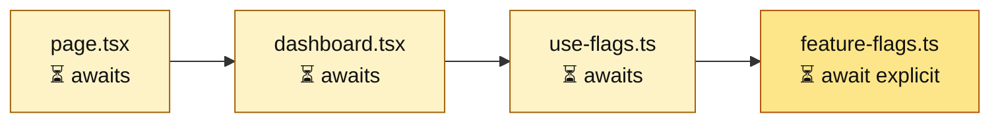
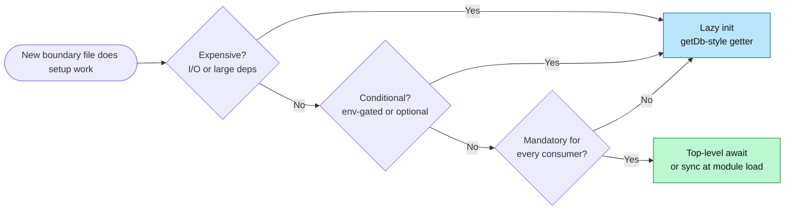

import Figure from '../../../components/figures/Figure.astro';
import AnnotatedCode from '../../../components/code/annotated-code/AnnotatedCode.astro';
import AnnotatedStep from '../../../components/code/annotated-code/AnnotatedStep.astro';
import Buckets from '../../../components/exercises/buckets/Buckets.astro';
import Bucket from '../../../components/exercises/buckets/Bucket.astro';
import Item from '../../../components/exercises/buckets/Item.astro';
import ScriptCoding from '../../../components/live-coding/ScriptCoding/ScriptCoding.astro';
import Term from '../../../components/ui/Term.astro';
import ExternalResource from '../../../components/ui/ExternalResource.astro';
import { CardGrid } from '@astrojs/starlight/components';
import CourseProgressBar from '../../../components/ui/CourseProgressBar.astro';

<CourseProgressBar value={frontmatter['course-progress']} />

Some modules must do work before they can export anything: validate environment variables, open a database connection, or load a signing key from a secret manager.
Top-level `await` holds the module's evaluation until a promise resolves; a lazy getter does the work on its first call and caches the result.
Which one is correct depends on the work.

## Top-level await is a graph-level change

ES modules permit `await` at the top level, outside any `async` function.
A module with one becomes a deferred node: the runtime won't mark it evaluated, and its exports stay unobservable, until the promise settles.

Adding that `await` to a leaf module is not a local change.
Every module that statically imports it inherits the wait, since none can finish its own top-level code first; the wait propagates **upward** along static-import edges to the entry.
An upstream module pulled into waiting this way is <Term definition="An upstream module that doesn't write await itself but waits because a statically-imported descendant does.">implicitly async</Term>.

The triggering code is ordinary:

```ts
// feature-flags.ts
import 'server-only';

const flags = await loadFlagsFromService();

export const isFeatureEnabled = (key: string) => flags[key] === true;
```

The part that matters is the `await` on a `const` at module scope; treat `loadFlagsFromService` as a stand-in for a real feature-flag SDK.
The `'server-only'` line, from the previous lesson, keeps the build from shipping this server module to the browser.

Three properties make top-level `await` right here.
The work is **cheap**, sub-second and deterministic; it is **mandatory for every consumer** of `feature-flags.ts`, none of which can function without resolved flags; and it is **needed at module load**, not lazily on first use.

## A slow leaf `await` blocks the whole page render

<Figure caption="A top-level `await` on a leaf node propagates a wait to every importer above it.">

</Figure>

In a Next.js Server Component the page render sits at the top of the graph, so a slow top-level `await` in any leaf, however deep, holds the whole render until that leaf settles.
That is fine when the wait is environment-variable validation that should crash startup anyway.
It is a serious problem when the wait is a two-second cross-region call to a feature-flag service, because then every page pays that cost on every cold start.
A per-component async fetch belongs in Suspense and streaming, where the page renders around the slow part while the work runs.

Work that earns a top-level `await` becomes a <Term definition="Work that gates the first paint of a server-rendered page because the page cannot return JSX until the work completes.">render-blocker</Term>, which is what you want here: if env validation fails, you would rather the server crash than serve a broken request.

## `env.ts`: synchronous module-load work without `await`

The cleanest example of cheap, mandatory, deterministic module-load work uses no `await` at all: `env.ts`, the file that validates your environment variables at startup.

```ts
// env.ts
import 'server-only';

import { createEnv } from '@t3-oss/env-nextjs';
import { z } from 'zod';

export const env = createEnv({
  server: {
    DATABASE_URL: z.url(),
    STRIPE_SECRET_KEY: z.string().min(1),
  },
  client: {
    NEXT_PUBLIC_APP_URL: z.url(),
  },
  runtimeEnv: {
    DATABASE_URL: process.env.DATABASE_URL,
    STRIPE_SECRET_KEY: process.env.STRIPE_SECRET_KEY,
    NEXT_PUBLIC_APP_URL: process.env.NEXT_PUBLIC_APP_URL,
  },
});
```

Two details are easy to get wrong.
`z.url()` at the top level is the Zod 4 idiom; the chained `z.string().url()` is the older Zod 3 shape.
And `runtimeEnv` is destructured by hand on purpose: t3-env relies on this to stop Next.js from stripping variables it thinks are unused, and `runtimeEnv: process.env` defeats that.

`createEnv` runs **synchronously** at module evaluation, with no `await`: Zod parses an already-populated `process.env`, and the `env` export is ready before any consumer reads it.
The missing `await` doesn't mean the module skips top-level work.
`createEnv` is that work, in the same category as top-level await, minus the I/O, and it carries all three properties: cheap parsing, a mandatory dependency for every secret, and deterministic with no I/O.

If `DATABASE_URL` is missing, `createEnv` throws, `env.ts` fails to evaluate, and that error crashes the process before a single request lands: failing closed at startup, exactly what work with these three properties wants.

## Lazy init: build on first call, cache for the rest

The other branch defers the work.
A lazy getter exports a function, such as `getDb()`, that does the setup on its first call and caches the result in a module-scoped variable.
Importing the module costs **nothing**: the first caller pays, and everyone after reuses the cache.

The canonical shape for a database client makes four deliberate choices.

<AnnotatedCode lang="ts" code={`
import 'server-only';

import { drizzle } from 'drizzle-orm/postgres-js';
import postgres from 'postgres';

import { env } from '@/env';

let cached: ReturnType<typeof drizzle> | null = null;

export const getDb = () => {
  if (cached) return cached;
  const client = postgres(env.DATABASE_URL);
  cached = drizzle({ client, casing: 'snake_case' });
  return cached;
};
`}>
  <AnnotatedStep meta="{1}" color="green">
    `'server-only'` as the first line. The database client and the connection it holds must never reach a client bundle. Every server-only module, including `env.ts`, `db.ts`, and the auth handler, opens with the seam-enforcement line from the previous lesson.
  </AnnotatedStep>

  <AnnotatedStep meta={`{8} "let cached" "null"`} color="blue">
    The module-scoped cache: one slot, one process, shared across every consumer of the module. The `let` is a deliberate exception to the "default to `const`" rule, because this variable mutates exactly once, from `null` to a built client.
  </AnnotatedStep>

  <AnnotatedStep meta="{10-15}" color="orange">
    The getter body, the single source of truth for whether a connection exists yet. If `cached` is set, return it; otherwise build the client, store it, and return it. Every later call hits the early return, so the construction code runs exactly once per process.
  </AnnotatedStep>

  <AnnotatedStep meta="{12-13}" color="violet">
    Where the cost is paid. `postgres(...)` opens the <Term definition="A set of reusable open database connections the client keeps around, so each query borrows one instead of paying to open a fresh connection.">connection pool</Term> and `drizzle({...})` wires the ORM on top. These run on the **first call**, never at import, so a file that imports `db.ts` but never calls `getDb()` opens zero connections.
  </AnnotatedStep>
</AnnotatedCode>

This is the **decision shape**, not your final wiring.
Your real project's Drizzle setup, built in Unit 5, adds a schema-aware return type and a tenancy layer; the `ReturnType<typeof drizzle>` cache type stays plain here so an unauthored schema doesn't distract from the pattern.

The wider rule: **stateful singletons that need setup are exposed through getters, not as top-level exports.**
The same shape returns as `getStripe()` for billing, `getRedis()` for caching, and `getS3Client()` for object storage; every SDK adapter in the course's `lib/` folder follows it.

On a serverless platform such as Vercel functions or Cloudflare Workers, each instance runs its own module evaluation and holds its own `cached` slot.
A <Term definition="The first request handled by a freshly-instantiated serverless function instance. Pays setup costs that warm instances reuse from cached state.">cold start</Term> pays the connection cost; warm requests on the same instance reuse the cached client.
The <Term definition="A value cached in a module-scoped variable, exposed through a getter, that lives for the lifetime of the module's evaluation. One slot per process or per serverless instance.">module-level singleton</Term> lives per-instance, so it is not a shared cache the way Redis is.

## The decision rule

Three questions resolve any new boundary file: is the work expensive, is it conditional, and is it mandatory for every consumer?
Expensive or conditional routes to lazy init; only cheap, deterministic, universally-required work earns top-level await or synchronous module-load work.

<Figure caption="Any 'expensive' or 'conditional' answer routes to a lazy getter; only cheap, deterministic, universally-required work earns top-level work.">

</Figure>

Two mistakes are common.

The first is **top-level await for a database connection**.
The SDK constructor returns a promise, so top-level await looks like the obvious shape.
The cost stays invisible until you measure it: every consumer pays the connection cost at import, including tests that never query, scripts that never read data, and build-time imports during page generation.
A database connection is expensive, conditional (most paths need only a subset of queries), and per-instance: three out of three lazy-init triggers, so reach for `getDb()`.

The second is **lazy init for env validation**.
Hiding `createEnv` behind a `getEnv()` getter looks safer: you only validate when someone reads an env var.
But that defers the failure to the first request that touches a missing variable.
Env validation is the canonical fail-closed-at-startup case because it runs synchronously at module load and crashes the server before it serves a single broken request.

<Buckets twoCol instructions="Sort each setup task into the shape that earns its weight.">
  <Bucket name="top-level-or-sync" label="Top-level await (or sync at load)" description="Cheap, mandatory, deterministic." />
  <Bucket name="lazy" label="Lazy init via cached getter" description="Expensive, conditional, or partial." />

  <Item bucket="top-level-or-sync">Env-var validation with Zod</Item>
  <Item bucket="lazy">Postgres connection pool</Item>
  <Item bucket="lazy">Feature-flag client fetched from a remote service at startup</Item>
  <Item bucket="lazy">Stripe SDK instance with API key</Item>
  <Item bucket="lazy">Redis cache client</Item>
  <Item bucket="top-level-or-sync">Signing-key load from a secret manager, used by every request</Item>
  <Item bucket="lazy">S3 client, used only by the file-upload route</Item>
  <Item bucket="lazy">PostHog analytics client, initialized only when `POSTHOG_KEY` is set</Item>
</Buckets>

## Rewriting an eager `db.ts` into the lazy shape

The `db.ts` below is eager: it opens the connection at module scope, the moment any file imports it.
Rewrite it into the lazy `getDb()` shape from the previous section.

<ScriptCoding
  instructions="Rewrite db.js so the connection is only opened on the first call to getDb(). The tests verify nothing happens at import time and that repeated calls return the same instance. (Real code would be in TypeScript; the runner uses JavaScript so the test harness can stay simple.)"
  starter={`// Stand-ins for the real drizzle/postgres APIs so the test runner
// doesn't need a real database. Treat them as already-imported.
let postgresCalls = 0;
let drizzleCalls = 0;
const postgres = (_url) => {
  postgresCalls += 1;
  return { __client: true };
};
const drizzle = (_config) => {
  drizzleCalls += 1;
  return { __db: true };
};

// The eager shape — rewrite below this line.
const client = postgres('postgres://localhost/app');
const db = drizzle({ client });

// TODO: replace the two lines above with a lazy getDb() that:
//   1. caches the drizzle instance in a module-scoped variable
//   2. opens the connection only on first call
//   3. returns the same instance on subsequent calls

const __counts = () => ({ postgresCalls, drizzleCalls });
`}
  tests={`
test('no connection at import time', () => {
  const counts = __counts();
  expect(counts.postgresCalls).toBe(0);
  expect(counts.drizzleCalls).toBe(0);
});

test('first call opens the connection', () => {
  getDb();
  const counts = __counts();
  expect(counts.postgresCalls).toBe(1);
  expect(counts.drizzleCalls).toBe(1);
});

test('subsequent calls reuse the cached client', () => {
  getDb();
  getDb();
  getDb();
  const counts = __counts();
  expect(counts.postgresCalls).toBe(1);
  expect(counts.drizzleCalls).toBe(1);
});

test('getDb returns the cached instance', () => {
  expect(getDb()).toBe(getDb());
});
`}
/>

<details>
<summary>Reference solution</summary>

```js
// Stand-ins for the real drizzle/postgres APIs so the test runner
// doesn't need a real database. Treat them as already-imported.
let postgresCalls = 0;
let drizzleCalls = 0;
const postgres = (_url) => {
  postgresCalls += 1;
  return { __client: true };
};
const drizzle = (_config) => {
  drizzleCalls += 1;
  return { __db: true };
};

let cached = null;

const getDb = () => {
  if (cached) return cached;
  const client = postgres('postgres://localhost/app');
  cached = drizzle({ client });
  return cached;
};

const __counts = () => ({ postgresCalls, drizzleCalls });
```

Because `cached` starts as `null`, importing the file calls neither `postgres` nor `drizzle`.
The first `getDb()` falls past the guard, opens the connection, caches the instance, and returns it; every later call hits the guard and returns that same reference.
In real TypeScript you would type the slot as `let cached: ReturnType<typeof drizzle> | null = null`.

</details>

## External resources

<CardGrid>
  <ExternalResource
    href="https://developer.mozilla.org/en-US/docs/Web/JavaScript/Reference/Operators/await#top_level_await"
    title="MDN — Top-level await"
    icon="simple-icons:mdnwebdocs"
    iconColor="#000000"
    description="The canonical reference for the JavaScript feature, with the spec-level notes on module evaluation order."
  />
  <ExternalResource
    href="https://env.t3.gg/docs/nextjs"
    title="t3-env — Next.js docs"
    icon="simple-icons:typescript"
    iconColor="#3178C6"
    description="Forward reference for the env.ts shape. You'll author this file in Unit 5; the docs cover the runtimeEnv discipline and the bundler-safety story."
  />
</CardGrid>
