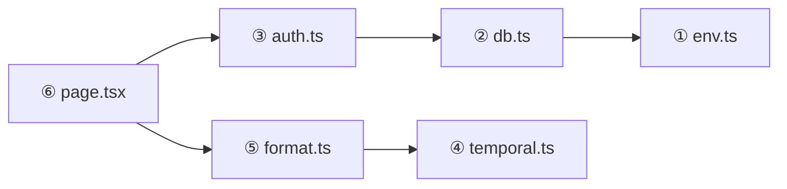

import Figure from '../../../components/figures/Figure.astro';
import CodeVariants from '../../../components/code/code-variants/CodeVariants.astro';
import CodeVariant from '../../../components/code/code-variants/CodeVariant.astro';
import TabbedContent from '../../../components/figures/tabbed-content/TabbedContent.astro';
import TabbedItem from '../../../components/figures/tabbed-content/TabbedItem.astro';
import MultipleChoice from '../../../components/exercises/multiple-choice/MultipleChoice.astro';
import McqChoice from '../../../components/exercises/multiple-choice/McqChoice.astro';
import McqWhy from '../../../components/exercises/multiple-choice/McqWhy.astro';
import Term from '../../../components/ui/Term.astro';
import VideoCallout from '../../../components/embeds/VideoCallout.astro';
import ExternalResource from '../../../components/ui/ExternalResource.astro';
import { CardGrid, FileTree } from '@astrojs/starlight/components';
import CourseProgressBar from '../../../components/ui/CourseProgressBar.astro';

<CourseProgressBar value={frontmatter['course-progress']} />

This lesson exists to prevent a particular kind of debugging session. Suppose you shipped two utility modules: `lib/auth.ts` reads cookies and queries the database, and `lib/format.ts` is a pure date formatter. A client component pulled in a helper that re-exported both. The browser now downloads 800KB of database driver, code the user will never run, because the bundler walked from your client component through every reachable edge.

The previous lesson framed each import as an edge in a directed graph. This lesson covers what the runtime and bundler actually **do** with that graph, and it comes down to four ideas. The runtime walks the graph depth-first and evaluates each module once. Imports are live bindings rather than value copies, which is why cycles can cause trouble. Dynamic `import()` is the only way to draw a deferred edge. And `'use client'` together with `'server-only'` turn the client bundle into a subgraph the build enforces.

## Depth-first, once per module: how the graph runs

Begin with the **order** in which the runtime evaluates your modules. Once you have seen it, the reason a `console.log` at the top of a leaf module runs before a `console.log` at the top of the file that imported it stops being a surprise.

The runtime walks the graph from your entry module, follows each `import` down to its target, recurses into that target's imports, and keeps recursing. A module's top-level code runs only after **all** of its imports have finished evaluating. Leaves run first, the root runs last.

<Figure caption="The runtime walks from `page.tsx` depth-first; numbered badges mark the evaluation order. Leaves finish before their importers, so `env.ts` runs first and `page.tsx` runs last. Each module runs exactly once.">

</Figure>

Three rules fall out of that picture, and you will lean on all three for the rest of the course.

**Depth-first, post-order.** A module's top-level code runs after all of its imports finish. In the diagram, no top-level statement inside `auth.ts` can execute until `db.ts` has finished evaluating and its exports exist. That is what "post-order" means: visit the children, then the node.

**Once per module.** The same file imported from two places does not run twice. The runtime keeps a cache keyed by the resolved file path, and the second `import` reuses the first evaluation. Every top-level `const` and every module-level variable is shared across all consumers. This is what makes the module-level singleton pattern in the next lesson work: a `let cached: Db | null = null` at module scope really is one slot for the whole app.

**Errors short-circuit upward.** A `throw` at the top of a leaf module prevents every upstream consumer from finishing. If `env.ts` throws because a required environment variable is missing, `db.ts` never gets its imports, `auth.ts` never runs, and your page never renders. That behavior is desirable, because it is the mechanism behind <Term definition="A startup pattern where invalid configuration crashes the process immediately, so bad state never reaches a request.">fail-closed</Term> startup validation: bad configuration stops the app at boot instead of surfacing mid-request.

## Live bindings: imports point at the exporter's variable

Next, consider what the import statement actually gives you. The answer surprises most people the first time they meet it, and it is the least obvious rule in ES modules. Getting it clear now is what makes the circular-dependency story later make sense.

An `import` is **not a copy**. It is a read-only window onto the exporter's variable. When the exporter mutates the variable, the importer sees the new value. This happens not because some framework wired up an observer, but because the ES module spec defines imports to work this way at the binding level.

The clearest way to see this is to put what actually happens next to the mental model most newcomers bring.

<CodeVariants>
  <CodeVariant label="Live binding (how ESM actually works)">
    ```ts title="counter.ts"
    export let count = 0;

    export const increment = () => {
      count += 1;
    };
    ```

    <div data-mark-color="green">

    ```ts title="consumer.ts" {3-5}
    import { count, increment } from './counter';

    console.log(count); // 0
    increment();
    console.log(count); // 1 — the import tracks the exporter
    ```

    </div>

    `count` in `consumer.ts` is a binding to `counter.ts`'s variable. The second log reads `1` because the import never snapshotted the value, it follows the exporter instead. The green-marked lines are where the mutation flows through the edge: `increment()` writes the exporter's binding, and the next read in the consumer sees the new value.
  </CodeVariant>

  <CodeVariant label="Value-copy intuition (the wrong mental model)">
    <div data-mark-color="red">

    ```ts title="consumer.ts (imagined)" {9,12}
    // What students often expect — this is NOT how ESM works.
    // Mental model: import = const assignment from the export's value.

    let count = 0;
    const increment = () => {
      count += 1;
    };

    const consumerCount = count; // snapshot taken at 0

    increment();
    console.log(consumerCount); // 0 — would be 0 if imports were copies
    ```

    </div>

    If imports were value copies, the second log would still be `0`. That mental model is wrong: ESM passes references at the binding level, not values. The red-marked lines stand for a snapshot that a real import never takes. A `const consumerCount = count` would freeze a number, but `import { count }` keeps a window onto the exporter's slot.
  </CodeVariant>
</CodeVariants>

Two consequences follow, and both come up in real codebases.

**Re-exports preserve the live binding.** `export { count } from './counter'` does not snapshot; the re-exporting module simply re-exposes the binding. A consumer importing `count` through three layers of re-export still tracks the original variable in `counter.ts`.

**The importer cannot reassign the binding.** Inside the consumer, `count = 5` is a compile-time error. Only the exporter writes, and everyone else reads. That is what "read-only window" means in practice, and the runtime enforces the asymmetry.

A note on the legacy contrast: CommonJS `require()` reads `module.exports` once and copies it. If you have seen that behavior in older Node code, set it aside, because modern ESM does not work that way.

## Circular dependencies: when the graph loops back on itself

A cycle is just the live-binding story applied to an import graph that loops back on itself. Once you understand evaluation order and live bindings, circular dependencies stop being mysterious. Their behavior is predictable: one clear set of cases crashes, and another clear set resolves.

### When a cycle crashes

A cycle crashes when one module reads another's export at the top level before that export has been assigned. Picture two files that import each other, where each one tries to read the other's export immediately rather than from inside a function.

```ts
// a.ts
import { fromB } from './b';

export const fromA = fromB + 1; // fromB is undefined when this runs
```

```ts
// b.ts
import { fromA } from './a';

export const fromB = fromA + 1;
```

Walk the runtime through it. Some entry module imports `a.ts`. `a.ts` starts evaluating and immediately reaches `import { fromB } from './b'`. The runtime starts evaluating `b.ts`. `b.ts` reaches `import { fromA } from './a'`. The runtime sees that `a.ts` is already mid-evaluation, so its `fromA` export has not been assigned yet, and it hands `b.ts` the **partial** module. `b.ts` reads `fromA`, gets `undefined`, and the arithmetic coerces that `undefined` to `NaN`. The runtime does not error on the cycle itself; the real bug is the top-level read of a value that was not ready.

### When a cycle resolves cleanly

Not every cycle crashes. Two shapes resolve without complaint.

**Function-body access.** If `b.ts` only reads `fromA` *inside the body of a function*, the cycle is harmless. By the time anyone calls that function, both modules have finished evaluating and the live binding points at a real value. The problem is specifically a read at the top level, so deferring the read into a function call avoids the partial-module window entirely.

**Type-only cycles.** `import type` is erased at compile time. A type-level cycle exists only inside the TypeScript type checker, which resolves such cycles cleanly, and it never reaches the runtime at all. So when two modules genuinely need each other's types, converting one of the imports to `import type` dissolves the cycle, because the runtime graph no longer has that edge.

### The experienced fix: extract the shared module

When a value-level cycle does appear, the structural fix is to pull the shared symbol into a third module, so that neither `a.ts` nor `b.ts` imports the other as a value. The cycle then becomes a Y-shape: both `a.ts` and `b.ts` depend on `shared.ts`, and neither depends on the other. The runtime evaluates `shared.ts` first, then `a.ts` and `b.ts` in either order. Compare the two layouts:

<TabbedContent>
  <TabbedItem label="The cycle">
    <FileTree>
    - src/
      - entry.ts
      - **a.ts** imports `fromB` from `b.ts`
      - **b.ts** imports `fromA` from `a.ts`
    </FileTree>

    `a.ts` and `b.ts` import each other. Whichever module evaluates first hands the other a partial view, so top-level reads return `undefined`.
  </TabbedItem>

  <TabbedItem label="The fix: extracted shared module">
    <FileTree>
    - src/
      - entry.ts
      - **shared.ts** holds the symbol both sides need
      - a.ts imports from `shared.ts`
      - b.ts imports from `shared.ts`
    </FileTree>

    `a.ts` and `b.ts` both depend on `shared.ts` and not on each other. There is no cycle, and evaluation order is deterministic: `shared.ts` first, then `a.ts` and `b.ts` in either order.
  </TabbedItem>
</TabbedContent>

This Y-shape pattern shows up again in Drizzle's relations API, where one shared file holds the relation declarations both tables reference. You will see it used deliberately once the data layer arrives.

## Deferred edges: dynamic `import()` and code splitting

The previous lesson introduced `import()`, the function-call form rather than the statement, as a value-level expression that returns a `Promise<Module>`. This section covers its **bundling consequence**, which is where the feature earns its keep.

### The static-edge default

A normal static import draws what the bundler treats as an **eager edge**. The target module belongs in the same chunk as the importer; its bytes ship in the initial JavaScript download.

```ts
import { renderChart } from './heavy-chart';
```

If `heavy-chart.ts` and its dependencies weigh 200KB, that 200KB is part of the initial bundle the browser parses on first page load, whether the user ever looks at the chart or not.

### The deferred edge

`import()` as an expression draws a **deferred edge**. The bundler emits the target as a **separate chunk**, fetched only when the expression actually runs. The cost moves: you pay one extra network round-trip the first time the code path executes, in exchange for not shipping the bytes up front.

```ts
const onAnalyticsTabClick = async () => {
  const { renderChart } = await import('./heavy-chart');
  renderChart();
};
```

Now `heavy-chart`'s 200KB sits in its own file on the CDN. The initial bundle does not carry it. The first time a user clicks the analytics tab, the browser fetches the chunk; subsequent clicks reuse the cached copy. This is <Term definition="Build-time technique where the bundler emits separate JavaScript chunks for parts of the app, fetched on demand instead of in the initial download.">code splitting</Term>, and the dynamic `import()` expression is its trigger.

One point worth getting straight: `await` is not what created the chunk. The bundler sees the `import()` form at build time and splits on that. Adding `await` in front of a static import does not split anything. People do try that, and the reason it fails is that the split depends on the `import()` expression, not on the `await`.

### When to reach for it

Two situations call for it, and one common case does not:

- **Heavy and rarely used.** A chart library inside a settings page, or a markdown editor inside an admin tool. The bytes are real, and most sessions never reach them.
- **Conditional.** A locale-specific date module loaded based on the user's locale. A static import would force every locale into every bundle, whereas the dynamic import loads just one.
- **Not for page-to-page splits.** Next.js App Router route segments split automatically, since the framework already emits per-route chunks. Dynamic `import()` is the tool for splitting a component or feature flag inside a page, not for the navigation graph itself.

<VideoCallout videoId="ddVm53j80vc" videoTitle="Learn Dynamic Module Imports In 11 Minutes">
  Web Dev Simplified contrasts the static and dynamic `import()` forms and walks the deferred-load idea behind code splitting in about 11 minutes.
</VideoCallout>

### `next/dynamic` in one paragraph

When the dynamic target is a React component, Next.js ships a wrapper called `next/dynamic` that pairs `import()` with Suspense and adds SSR controls. The `ssr: false` option is the one you reach for when a component touches `window`, `localStorage`, or another browser-only API and must skip server rendering. You will see it again in Unit 4, where client components are covered in depth. For now, recognize it as the React-aware shape of the same `import()` idea.

## The bundle boundary: `'use client'`, `'server-only'`, `'client-only'`

The earlier sections taught how the graph runs. This one teaches the **rule** that decides which subgraph ships to the browser. There are three directives, each with one job.

### `'use client'` marks an entry into the client bundle

A file beginning with `'use client';` is a **client entry point**. The bundler treats it as a root of the client subgraph: every module reachable from it through static imports ships to the browser. Server Components, the default in the App Router, need no directive.

Where you place the directive matters. It belongs on the **smallest interactive leaf**, meaning the actual button, form, or piece of state that needs the browser. Putting it on a parent layout drags the entire subtree into the client bundle, including any server-only helper that subtree happens to import. The App Router gives this its full treatment in Unit 4; for this lesson, the rule is enough.

```tsx
'use client';

import { useState } from 'react';

export const Counter = () => {
  const [count, setCount] = useState(0);
  return <button onClick={() => setCount(count + 1)}>{count}</button>;
};
```

That file is a graph root. The bundler crawls every static `import` from it, and every module it reaches must be safe to run in the browser.

### `import 'server-only'` makes leaks a build error

A server-only module is anything that touches secrets, the database, request cookies, request headers, or an SDK initialized with a private key. The convention is to mark such modules with `import 'server-only';` as the first line.

```ts
import 'server-only';

import { db } from '@/db';

export const getCurrentUser = async () => {
  // reads the session cookie and queries the database
};
```

The `server-only` package is a no-op at runtime in Node. Its real job happens at build time: if a client bundle ever reaches this file, the build **fails with an explicit error** naming the offending import chain. The cost is one line, and in return server code accidentally shipping to the browser becomes structurally impossible.

This line is enforcement, not documentation. The convention runs throughout the course's codebase: `env.ts`, the Drizzle client, the Better Auth instance, and every billing, email, and storage adapter starts with it.

### `import 'client-only'` is the mirror

This is the symmetric package, used on modules that touch `window`, `localStorage`, or any browser-only API and would crash if rendered on the server. Most browser-only code already lives inside a `'use client'` file, where it is safe by construction, so you reach for `'client-only'` less often than `'server-only'`. The right place for it is a utility module that should refuse to be imported from a Server Component: a wrapper around `window.matchMedia`, for instance, that has no business running in a Node process.

### Decision summary

:::tip
| Directive | Where it goes | What it enforces |
| --- | --- | --- |
| `'use client'` | Top of a client component file | Marks a client-bundle entry; everything reachable becomes client code |
| `import 'server-only'` | Top of any server-only module | Build error if a client bundle ever reaches this file |
| `import 'client-only'` | Top of any browser-only module | Build error if a server bundle ever reaches this file |
:::

## The "looks fine, ships everything" trap: a worked example

Now the 800KB story from the opening makes sense. A single file, written without thought to the bundle boundary, can pull all of its server-side dependencies into the browser the moment one client component imports a single harmless-looking helper from it. The fix is structural: split the file by responsibility, and let `'server-only'` enforce the cut.

<CodeVariants>
  <CodeVariant label="Before — one file, two responsibilities">
    <div data-mark-color="red">

    ```ts title="lib/utils.ts" {1,3,7-11}
    import { headers } from 'next/headers';

    import { db } from '@/db';

    export const formatDate = (d: Date) => d.toISOString().slice(0, 10);

    export const getCurrentUser = async () => {
      await headers();
      // db query reading the session cookie...
      return db.query.users.findFirst(/* simplified for the example */);
    };
    ```

    </div>

    A client component imports only `formatDate`. The bundler still walks every reachable edge, including `db`, `headers`, and the Drizzle relations graph, so all of that server code comes along. The client bundle fills up with code the user never executes. The red-marked lines are the server-only seams that should not be reachable from the browser at all.
  </CodeVariant>

  <CodeVariant label="After — split by responsibility">
    ```ts title="lib/format.ts"
    export const formatDate = (d: Date) => d.toISOString().slice(0, 10);
    ```

    <div data-mark-color="green">

    ```ts title="lib/auth.ts" {1}
    import 'server-only';

    import { headers } from 'next/headers';

    import { db } from '@/db';

    export const getCurrentUser = async () => {
      await headers();
      return db.query.users.findFirst(/* simplified for the example */);
    };
    ```

    </div>

    The same functions, now split by responsibility. The client component imports `lib/format.ts` and never reaches `lib/auth.ts`. If some future client file ever does reach it, the `'server-only'` import on the green-marked line fails the build with an error pointing at the import chain that leaked.
  </CodeVariant>
</CodeVariants>

The rule to carry forward is this: **pure utilities live in their own files, and anything that touches a server seam imports `'server-only'`.** The file-per-responsibility split is not about aesthetics. It is how the bundler knows where the client subgraph ends.

## Predict the outcome

Five short snippets, each exercising one of the lesson's central ideas. Pick the outcome before reading the explanation.

<MultipleChoice>
  Given these two files:

  ```ts title="counter.ts"
  export let count = 0;

  export const increment = () => {
    count += 1;
  };
  ```

  ```ts title="consumer.ts"
  import { count, increment } from './counter';

  console.log(count);
  increment();
  console.log(count);
  ```

  What does `consumer.ts` log?

  <McqChoice correct>Logs `0` then `1`</McqChoice>
  <McqChoice>Logs `0` then `0`</McqChoice>
  <McqChoice>`TypeError` on the second log</McqChoice>

  <McqWhy>Imports are live bindings, not value copies. `count` in `consumer.ts` is a window onto `counter.ts`'s variable; calling `increment()` writes the exporter's slot and the next read in the consumer sees the new value.</McqWhy>
</MultipleChoice>

<MultipleChoice>
  Given these two files:

  ```ts title="a.ts"
  import { fromB } from './b';

  export const fromA = fromB + 1;
  ```

  ```ts title="b.ts"
  import { fromA } from './a';

  export const fromB = fromA + 1;
  ```

  An entry module imports `a.ts`. What happens?

  <McqChoice correct>Produces `NaN` at runtime</McqChoice>
  <McqChoice>Both exports settle to `1`</McqChoice>
  <McqChoice>The build fails before the code ever runs</McqChoice>

  <McqWhy>Value-level cycle read at the top level. `a.ts` starts evaluating, imports `b.ts`, and `b.ts` imports back into a mid-evaluation `a.ts` — its `fromA` export has not been assigned yet, so the runtime hands `b.ts` the partial module and `fromA` reads as `undefined`. The arithmetic produces `NaN`. The bundler is happy at build time; the runtime is not.</McqWhy>
</MultipleChoice>

<MultipleChoice>
  Same shape as the previous cycle, but converted to type-only imports:

  ```ts title="a.ts"
  import type { TypeB } from './b';

  export type TypeA = { b: TypeB };
  export const valueA = 42;
  ```

  ```ts title="b.ts"
  import type { TypeA } from './a';

  export type TypeB = { a: TypeA };
  export const valueB = 7;
  ```

  A consumer imports `valueA` from `a.ts` and logs it. What happens?

  <McqChoice correct>Logs `42` — no runtime cycle exists</McqChoice>
  <McqChoice>Crashes at runtime</McqChoice>
  <McqChoice>Build error</McqChoice>

  <McqWhy>`import type` is erased at compile time. The cycle exists only inside the type checker — which resolves it cleanly — and never reaches the runtime graph. Converting a value-level cycle to a type-only cycle is the escape hatch when two modules genuinely reference each other's types.</McqWhy>
</MultipleChoice>

<MultipleChoice>
  Given these two files:

  ```tsx title="app/_components/dashboard.tsx"
  'use client';

  import { getCurrentUser } from '@/lib/auth';

  export const Dashboard = () => {
    // ...
  };
  ```

  ```ts title="lib/auth.ts"
  import 'server-only';

  import { db } from '@/db';

  export const getCurrentUser = async () => {
    // reads session, queries db
  };
  ```

  What happens when you build?

  <McqChoice correct>Build error naming the import chain that leaked</McqChoice>
  <McqChoice>Builds and runs — `server-only` is just a documentation hint</McqChoice>
  <McqChoice>Builds, then crashes at runtime in the browser</McqChoice>

  <McqWhy>`import 'server-only'` is enforcement, not documentation. The moment a client bundle reaches `lib/auth.ts`, the build fails with an explicit error pointing at the import chain that leaked. The bug class — server code shipping to the browser — becomes structurally impossible to ship.</McqWhy>
</MultipleChoice>

<MultipleChoice>
  Given this client component:

  ```tsx title="app/_components/analytics-tab.tsx"
  'use client';

  export const AnalyticsTab = () => {
    const onClick = async () => {
      const { renderChart } = await import('./heavy-chart');
      renderChart();
    };
    return <button onClick={onClick}>Open analytics</button>;
  };
  ```

  Does `heavy-chart`'s code ship in the initial bundle?

  <McqChoice correct>No — the bundler emits it as a separate chunk fetched when the click handler runs</McqChoice>
  <McqChoice>Yes — `await import` is just an `await` in front of a regular import</McqChoice>
  <McqChoice>Only if the user has JavaScript enabled</McqChoice>

  <McqWhy>Dynamic `import()` is what triggers code splitting — the bundler sees the expression at build time and emits the target as a separate chunk, fetched only when the expression actually runs. The `await` is unrelated to the split; it's how the function consumes the returned `Promise<Module>`. Putting `await` in front of a static import does not split anything.</McqWhy>
</MultipleChoice>

## External resources

<CardGrid>
  <ExternalResource
    href="https://developer.mozilla.org/en-US/docs/Web/JavaScript/Reference/Statements/import"
    title="MDN — import"
    icon="simple-icons:mdnwebdocs"
    iconColor="#000000"
    description="The canonical reference. The 'Module namespace objects' and live-bindings sections are the parts to read after this lesson."
  />
  <ExternalResource
    href="https://hacks.mozilla.org/2018/03/es-modules-a-cartoon-deep-dive/"
    title="ES modules: A cartoon deep-dive"
    icon="simple-icons:mozilla"
    iconColor="#FF7139"
    description="Lin Clark's illustrated walkthrough of the three phases (construction, instantiation, evaluation) — the clearest visual mental model for live bindings and cycles."
  />
  <ExternalResource
    href="https://nextjs.org/docs/app/getting-started/server-and-client-components"
    title="Next.js — Server and Client Components"
    icon="simple-icons:nextdotjs"
    iconColor="#000000"
    description="The reference for 'use client' and the bundle boundary. Forward link for the App Router chapter."
  />
  <ExternalResource
    href="https://nextjs.org/docs/app/guides/lazy-loading"
    title="Next.js — Lazy Loading"
    icon="simple-icons:nextdotjs"
    iconColor="#000000"
    description="Official guide to `next/dynamic`, the `ssr: false` option, and the magic comments that control how dynamic `import()` is bundled."
  />
</CardGrid>
