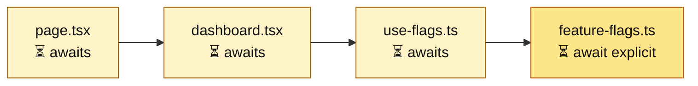
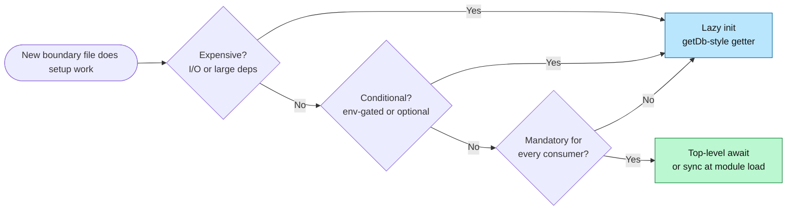

import Figure from '../../../components/figures/Figure.astro';
import AnnotatedCode from '../../../components/code/annotated-code/AnnotatedCode.astro';
import AnnotatedStep from '../../../components/code/annotated-code/AnnotatedStep.astro';
import Buckets from '../../../components/exercises/buckets/Buckets.astro';
import Bucket from '../../../components/exercises/buckets/Bucket.astro';
import Item from '../../../components/exercises/buckets/Item.astro';
import ScriptCoding from '../../../components/live-coding/ScriptCoding/ScriptCoding.astro';
import Term from '../../../components/ui/Term.astro';
import ExternalResource from '../../../components/ui/ExternalResource.astro';
import VideoCallout from '../../../components/embeds/VideoCallout.astro';
import { CardGrid } from '@astrojs/starlight/components';
import CourseProgressBar from '../../../components/ui/CourseProgressBar.astro';

<CourseProgressBar value={frontmatter['course-progress']} />

Sometimes a module has to do work before it can export anything: validate environment variables, open a database connection, or load a signing key from a secret manager. You have two patterns to choose from. The first is top-level `await`, where the module's evaluation completes only after a promise resolves. The second is a lazy getter that does the work on its first call and caches the result. This lesson covers when each pattern is the right choice.

The previous lesson covered how the runtime walks the module graph depth-first. This one covers what each node *does* at the moment it is evaluated, and how that choice ripples back up to every consumer above it. That is the third leg of the chapter's mental model, after edges and traversal.

## Top-level await: the graph-level change

ES modules permit `await` at the top level, outside any `async` function. The runtime guarantees that the module's exports become observable only after the awaited promise resolves. The feature has shipped everywhere this course's stack runs, including Node 24 LTS, Next.js 16, and every modern browser, so you can reach for it without checking compatibility tables.

The key idea is that adding `await` at the top of a leaf module is **not a local code change**. It changes the graph. A module with a top-level `await` becomes a deferred node: the runtime will not declare it evaluated until the promise settles. Every module that statically imports it inherits that wait, because they cannot finish their own top-level code until this module finishes. The wait propagates **upward** along static-import edges, all the way to the entry. The course calls this kind of upstream module <Term definition="An upstream module that doesn't write await itself but waits because a statically-imported descendant does.">implicitly async</Term>.

The shape itself is unremarkable:

```ts
// feature-flags.ts
import 'server-only';

const flags = await loadFlagsFromService();

export const isFeatureEnabled = (key: string) => flags[key] === true;
```

The `await` on a `const` at module scope is the part that matters. Treat `loadFlagsFromService` as a stand-in for a real feature-flag SDK. The `'server-only'` first line is the discipline from the previous lesson: this is a server seam, and the build refuses to ship it to the browser.

Three properties make top-level `await` the right choice here. The work has to be **cheap**, meaning sub-second and deterministic. It has to be **mandatory for every consumer**, since no consumer of `feature-flags.ts` can function without resolved flags. And it has to be **needed at module load**, not lazily on first use. Keep those three properties in mind; the decision rule at the end of the lesson brings them together.

## The cascade: how one `await` propagates upward

That convenience has a cost. If `feature-flags.ts` has a top-level `await`, every module that imports it implicitly awaits too, and so on up the chain. The page render does not begin until the chain completes.

<Figure caption="A top-level `await` on a leaf node propagates a wait to every importer above it; the page cannot render until the chain completes.">

</Figure>

The diagram captures the whole problem. In a Next.js Server Component, the page render sits upstream of every module the page imports, so a slow top-level `await` in any leaf, however far down the chain, delays the whole render. The page cannot return JSX until each module above the leaf has finished its top-level work, and each of those modules is waiting on the one below it.

This is **fine** when the wait is environment-variable validation that should crash startup anyway. It is **a serious problem** when the wait is a two-second cross-region call to a feature-flag service, because then every page on the site pays that two-second cost on every cold start. The right tool for a per-component async fetch is Suspense and streaming, which Unit 4 on Next.js covers in depth: Server Components can be async, the page can stream around the slow part, and the user sees something while the work happens. Top-level await is the wrong tool when the wait is long or per-request.

The rule in one sentence: top-level await is for **fast, deterministic, mandatory** work, and anything else belongs in a function call. Work that does qualify becomes a <Term definition="Work that gates the first paint of a server-rendered page because the page cannot return JSX until the work completes.">render-blocker</Term> by design, which is what you want: if env validation fails, you would rather the whole server crash than serve a broken request.

## `env.ts`: the reference shape for cheap, mandatory, synchronous work

The cleanest example of "cheap, mandatory, deterministic" module-load work in a 2026 SaaS app doesn't use `await` at all. It is the `env.ts` file that validates the environment variables at startup. You will author this file in Unit 5 on databases and Drizzle; the snippet below is the shape every project lands on.

```ts
// env.ts
import 'server-only';

import { createEnv } from '@t3-oss/env-nextjs';
import { z } from 'zod';

export const env = createEnv({
  server: {
    DATABASE_URL: z.url(),
    STRIPE_SECRET_KEY: z.string().min(1),
  },
  client: {
    NEXT_PUBLIC_APP_URL: z.url(),
  },
  runtimeEnv: {
    DATABASE_URL: process.env.DATABASE_URL,
    STRIPE_SECRET_KEY: process.env.STRIPE_SECRET_KEY,
    NEXT_PUBLIC_APP_URL: process.env.NEXT_PUBLIC_APP_URL,
  },
});
```

Two details about that snippet are worth flagging, since they aren't the lesson itself but the wrong version is everywhere on the web. The Zod 4 idiom is `z.url()` at the top level; the legacy `z.string().url()` chain is a Zod 3 shape and doesn't appear in 2026 code. The `runtimeEnv` field is destructured by hand on purpose: t3-env documents this as the bundler-safe way to keep Next.js from stripping unused variables at build time, and shortening it to `runtimeEnv: process.env` defeats that.

The important point for this lesson is that `createEnv` fires **synchronously** at module evaluation, with no `await`. Zod parses, `process.env` is already populated, and the `env` export is ready before any consumer reads it. The validation is **cheap**, just microseconds of Zod parsing. It is **mandatory**, since every consumer that reads a secret depends on it. And it is **deterministic**: the same inputs give the same result, with no I/O. The absence of `await` does not mean the module isn't doing top-level work; `createEnv` *is* the top-level work. The category is the same as top-level await, minus the I/O.

If `DATABASE_URL` is missing, `createEnv` throws at module load and the evaluation of `env.ts` errors out. The previous lesson covered what happens next: errors short-circuit upward through the graph, the process crashes before a single request lands, and the fail-closed contract holds. This is exactly the shape you want for any work that satisfies the three properties.

<VideoCallout videoId="UnDw3_7_9gc" videoTitle="We Fixed Environment Variables — Theo on t3-env">
  Theo walks through t3-env and the build-time validation story behind the `createEnv` shape above.
</VideoCallout>

## Lazy init: the alternative for expensive or conditional work

Now consider the other branch. A lazy getter exports a function, such as `getDb()`, `getStripe()`, or `getRedis()`, that does the setup work the first time it is called and caches the result in a module-scoped variable. Importing the module costs **nothing**: no connection opened, no SDK instantiated, no remote call. The cost moves from "every consumer pays at import time" to "the first consumer to call pays, and everyone after reuses the cache."

The canonical shape for a database client is the central example of this lesson. Four distinct moves live in this small file, and each one is a deliberate choice.

<AnnotatedCode lang="ts" code={`
import 'server-only';

import { drizzle } from 'drizzle-orm/postgres-js';
import postgres from 'postgres';

import { env } from '@/env';

let cached: ReturnType<typeof drizzle> | null = null;

export const getDb = () => {
  if (cached) return cached;
  const client = postgres(env.DATABASE_URL);
  cached = drizzle({ client, casing: 'snake_case' });
  return cached;
};
`}>
  <AnnotatedStep meta="{1}" color="green">
    `'server-only'` as the first line. The database client and the connection it holds must never reach a client bundle. The previous lesson named this seam-enforcement rule; every server-only module, including `env.ts`, `db.ts`, and the auth handler, opens with this line.
  </AnnotatedStep>

  <AnnotatedStep meta={`{8} "let cached" "null"`} color="blue">
    The module-scoped cache: one slot, one process. The previous lesson promised this: a module-level `let` really is one slot shared across every consumer of the module. The `let` is the deliberate exception to "default to `const`", because this variable is meant to mutate exactly once, from `null` to a built client.
  </AnnotatedStep>

  <AnnotatedStep meta="{10-15}" color="orange">
    The getter body. This is the single source of truth for whether a connection exists yet. If `cached` is set, return it; otherwise build the client, store it, and return it. Every subsequent call hits the early return, so the construction code runs exactly once per process.
  </AnnotatedStep>

  <AnnotatedStep meta="{12-13}" color="violet">
    Where the actual cost is paid. `postgres(...)` opens the connection pool, and `drizzle({...})` wires the ORM on top. These run on the **first call**, never at import. A file that imports `db.ts` but never calls `getDb()` opens zero connections.
  </AnnotatedStep>
</AnnotatedCode>

The Drizzle wiring in your real project, whose full shape arrives in Unit 5, is more sophisticated than this. It has a schema-aware return type, a `tenantDb(orgId)` factory layered on top for row-level tenancy, and a separate unpooled client for migrations. What you are reading here is the **decision shape**, not the final wiring. The `ReturnType<typeof drizzle>` cache type is intentional: the lesson teaches the pattern, and pulling in a schema you haven't authored yet would distract from it. (The `@/env` import is the same `env.ts` from the section above. Unit 5 is where you'll author it, but it's already the file the rest of the course imports from.)

The wider rule is this: **stateful singletons that need setup are exposed through getters, not as top-level exports.** This is the architectural takeaway that generalizes. The same shape appears at `getStripe()` in Unit 11 on billing, at `getRedis()` in Unit 14 on caching, and at `getS3Client()` in Unit 12 on object storage. Every SDK adapter in the course's `lib/` folder follows this pattern; the names change, the shape doesn't.

One serverless detail is worth locking in before you move on. On a serverless platform, such as Vercel functions or Cloudflare Workers, each instance runs its own module evaluation and holds its own `cached` slot. A <Term definition="The first request handled by a freshly-instantiated serverless function instance. Pays setup costs that warm instances reuse from cached state.">cold start</Term> pays the connection cost; warm requests on the same instance reuse the cached client. The <Term definition="A value cached in a module-scoped variable, exposed through a getter, that lives for the lifetime of the module's evaluation. One slot per process or per serverless instance.">module-level singleton</Term> is per-instance, not per-region or per-deployment, so don't expect it to behave like Redis. Connection-pool tuning for serverless Postgres has its own lesson in Unit 5; for now, knowing that the cache is per-instance is enough to follow what's happening.

## The decision rule

The two patterns come down to a single rule. Use top-level await, or synchronous module-load work when the operation doesn't need to be async, when the work is **cheap, mandatory for every consumer, and async by necessity**. Use lazy init via a cached getter when the work is **expensive, conditional, or only needed by a subset of consumers**.

Three questions resolve any new boundary file in your codebase.

<Figure caption="Three questions pick the shape. Any 'expensive' or 'conditional' answer routes to a lazy getter; only cheap, deterministic, universally-required work earns top-level work.">

</Figure>

Two common mistakes are worth naming explicitly.

The first is **top-level await for a database connection**. The SDK constructor returns a promise, so a developer reaches for top-level await as the obvious shape. The cost stays invisible until you measure it: every consumer of the module pays the connection cost at import, including tests that never query, scripts that never read data, and build-time imports during page generation. The right choice is `getDb()`. The database is expensive, conditional (most code paths only need a subset of queries), and per-instance, which is three out of three lazy-init triggers.

The second is **lazy init for env validation**. Hiding `createEnv` behind a `getEnv()` getter looks safer at first, on the reasoning that you'll only validate when someone needs an env var. But it defers the failure: the bug doesn't surface until the first request that touches a missing variable. Env validation is the canonical fail-closed-at-startup site precisely because it runs synchronously at module load. Crash early, crash loudly, and never serve a broken request.

Confirm the pattern with a sort before moving on.

<Buckets twoCol instructions="Sort each setup task into the shape that earns its weight.">
  <Bucket name="top-level-or-sync" label="Top-level await (or sync at load)" description="Cheap, mandatory, deterministic." />
  <Bucket name="lazy" label="Lazy init via cached getter" description="Expensive, conditional, or partial." />

  <Item bucket="top-level-or-sync">Env-var validation with Zod</Item>
  <Item bucket="lazy">Postgres connection pool</Item>
  <Item bucket="lazy">Feature-flag client fetched from a remote service at startup</Item>
  <Item bucket="lazy">Stripe SDK instance with API key</Item>
  <Item bucket="lazy">Redis cache client</Item>
  <Item bucket="top-level-or-sync">Signing-key load from a secret manager, used by every request</Item>
  <Item bucket="lazy">S3 client, used only by the file-upload route</Item>
  <Item bucket="lazy">PostHog analytics client, initialized only when `POSTHOG_KEY` is set</Item>
</Buckets>

## Rewriting an eager `db.ts` into the lazy shape

The recognition sort is one half of the practice. The other half is rewriting code. Below is a wrongly-eager `db.ts`: it opens a connection at the top of the module, the moment any consumer imports it. Rewrite it to the lazy shape from the previous section.

The runner uses stand-in `postgres` and `drizzle` functions inlined in the file so the tests can verify that nothing happens at import time. After your rewrite, the file should export `getDb` instead of `db`. The tests then check that no connection opens until the first call and that subsequent calls reuse the cache.

<ScriptCoding
  instructions="Rewrite db.js so the connection is only opened on the first call to getDb(). The tests verify nothing happens at import time and that repeated calls return the same instance. (Real code would be in TypeScript; the runner uses JavaScript so the test harness can stay simple.)"
  starter={`// Stand-ins for the real drizzle/postgres APIs so the test runner
// doesn't need a real database. Treat them as already-imported.
let postgresCalls = 0;
let drizzleCalls = 0;
const postgres = (_url) => {
  postgresCalls += 1;
  return { __client: true };
};
const drizzle = (_config) => {
  drizzleCalls += 1;
  return { __db: true };
};

// The eager shape — rewrite below this line.
const client = postgres('postgres://localhost/app');
const db = drizzle({ client });

// TODO: replace the two lines above with a lazy getDb() that:
//   1. caches the drizzle instance in a module-scoped variable
//   2. opens the connection only on first call
//   3. returns the same instance on subsequent calls

const __counts = () => ({ postgresCalls, drizzleCalls });
`}
  tests={`
test('no connection at import time', () => {
  const counts = __counts();
  expect(counts.postgresCalls).toBe(0);
  expect(counts.drizzleCalls).toBe(0);
});

test('first call opens the connection', () => {
  getDb();
  const counts = __counts();
  expect(counts.postgresCalls).toBe(1);
  expect(counts.drizzleCalls).toBe(1);
});

test('subsequent calls reuse the cached client', () => {
  getDb();
  getDb();
  getDb();
  const counts = __counts();
  expect(counts.postgresCalls).toBe(1);
  expect(counts.drizzleCalls).toBe(1);
});

test('getDb returns the cached instance', () => {
  expect(getDb()).toBe(getDb());
});
`}
/>

<details>
<summary>Reference solution</summary>

```js
// Stand-ins for the real drizzle/postgres APIs so the test runner
// doesn't need a real database. Treat them as already-imported.
let postgresCalls = 0;
let drizzleCalls = 0;
const postgres = (_url) => {
  postgresCalls += 1;
  return { __client: true };
};
const drizzle = (_config) => {
  drizzleCalls += 1;
  return { __db: true };
};

let cached = null;

const getDb = () => {
  if (cached) return cached;
  const client = postgres('postgres://localhost/app');
  cached = drizzle({ client });
  return cached;
};

const __counts = () => ({ postgresCalls, drizzleCalls });
```

The `let cached` slot starts as `null`, so importing the file runs neither `postgres` nor `drizzle`. The first `getDb()` call hits the `if (cached) return cached;` guard with `null`, falls through, opens the connection, stores the instance, and returns it. Every subsequent call short-circuits on the guard and hands back the cached value — same reference, no extra work. In a real TypeScript module the cache slot would be typed as `let cached: ReturnType<typeof drizzle> | null = null` and `getDb` exported alongside the file's other named exports.

</details>

## External resources

<CardGrid>
  <ExternalResource
    href="https://developer.mozilla.org/en-US/docs/Web/JavaScript/Reference/Operators/await#top_level_await"
    title="MDN — Top-level await"
    icon="simple-icons:mdnwebdocs"
    iconColor="#000000"
    description="The canonical reference for the JavaScript feature, with the spec-level notes on module evaluation order."
  />
  <ExternalResource
    href="https://env.t3.gg/docs/nextjs"
    title="t3-env — Next.js docs"
    icon="simple-icons:typescript"
    iconColor="#3178C6"
    description="Forward reference for the env.ts shape. You'll author this file in Unit 5; the docs cover the runtimeEnv discipline and the bundler-safety story."
  />
</CardGrid>
