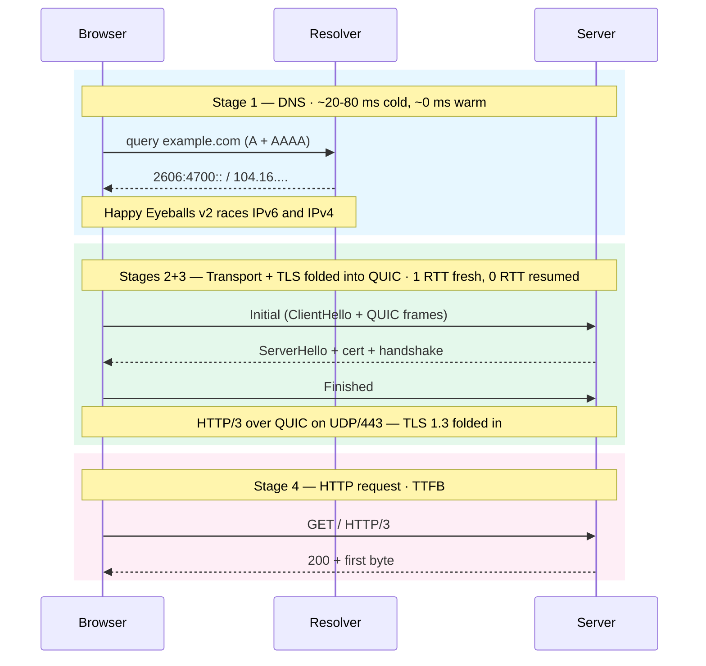

import Figure from '../../../components/figures/Figure.astro';
import CodeVariants from '../../../components/code/code-variants/CodeVariants.astro';
import CodeVariant from '../../../components/code/code-variants/CodeVariant.astro';
import Matching from '../../../components/exercises/matching/Matching.astro';
import Pair from '../../../components/exercises/matching/Pair.astro';
import Term from '../../../components/ui/Term.astro';
import VideoCallout from '../../../components/embeds/VideoCallout.astro';
import ExternalResource from '../../../components/ui/ExternalResource.astro';
import { Steps, Aside, CardGrid } from '@astrojs/starlight/components';
import CourseProgressBar from '../../../components/ui/CourseProgressBar.astro';

<CourseProgressBar value={frontmatter['course-progress']} />

A slow page load is rarely one problem. Between committing a URL and the first byte coming back, a request crosses four stages, and usually one is the bottleneck while the rest are fine. An engineer who reads a single waterfall row and names the slow stage starts in the right place; one who sees "the site is slow" and jumps to the server logs can lose half a day on something that was never the problem.

Those four stages are DNS, transport, <Term definition="Transport Layer Security — the protocol that encrypts a connection so no one between client and server can read or tamper with the bytes. It authenticates the server with a certificate and negotiates the session's encryption keys.">TLS</Term>, and HTTP. Each gets its own section here, and a fifth covers the DevTools Network panel, where you'll do most of your debugging.

Open DevTools now (Cmd+Opt+I on macOS, F12 on Windows or Linux), switch to the **Network** tab, right-click any column header, and turn on the **Protocol** column. You'll use it mid-lesson.

## The four-stage map

Here's the whole route a request takes, from the moment you commit a URL to the first byte of HTML.

<Figure caption="Four stages from URL to first byte on the default stack: HTTP/3 over QUIC, TLS 1.3, and DoH where the resolver supports it.">

</Figure>

The horizontal arrows are network round trips, and each one costs wall-clock time as a request travels to a remote machine and back.
Stages 2 and 3 are drawn as one block because they are the same handshake: TLS 1.3 is folded into the QUIC transport setup, so the encrypted connection is built in one round of negotiation instead of two.
Stage 4 is the HTTP request itself, the one that carries a method and a path; stages 1 through 3 are the cost of getting ready to send it.
To debug a slow page, check those setup stages first: on a warm connection they collapse to near zero, as the next four sections show.

## Stage 1: DNS resolution

The browser has a hostname like `app.example.com`, but the network stack can't open a connection to a name. It needs an IP address, and producing one from the other is what DNS does.

The browser hands the hostname to the OS resolver, which walks a chain of caches: the browser's own cache first, then the OS cache, then the recursive resolver your network is configured to use (your ISP's, or Cloudflare's or Google's), and finally the authoritative server for the domain. A cold lookup, with nothing cached anywhere, typically costs 20 to 80 milliseconds; a warm one costs effectively zero.

That resolver conversation is now usually encrypted. The standard form is <Term definition="DNS over HTTPS — DNS queries tunneled through an HTTPS connection so the resolver path is encrypted and unmodifiable on-wire.">DoH</Term>. Firefox enables it by default in most regions, and Chrome and Edge auto-upgrade to it when the system resolver advertises support, falling back to plain DNS only when nothing better is available. Two other encrypted forms exist, DoT (DNS over TLS) and DoQ (DNS over QUIC), but DoH is the production reality the course assumes.

The browser doesn't issue one lookup, it issues two and races them: an A record query for IPv4 and an AAAA query for IPv6. The algorithm is <Term definition="RFC 8305 algorithm: browsers race IPv4 and IPv6 lookups and connection attempts, preferring IPv6 by ~50ms to avoid a long-tail wait when one family is broken.">Happy Eyeballs v2</Term>. When both families resolve in time it prefers IPv6, but it never waits on it: if v6 is broken, v4 wins and the user notices nothing. Without this race, a misconfigured IPv6 path would stall the page for the resolver's full timeout.

<VideoCallout videoId="27r4Bzuj5NQ" videoTitle="Everything You Need to Know About DNS — ByteByteGo">
  ByteByteGo animates the resolver-to-root-to-TLD-to-authoritative walk in 6 minutes, including the cache chain and the TTL behavior that makes production DNS changes slow to take effect.
</VideoCallout>

:::caution
A cold DNS leg is invisible during local development. `localhost` resolves to `127.0.0.1` in microseconds, so you never pay the DNS cost on your own machine. It surfaces in production, in flaky preview environments, and on networks you don't control. When a user reports that the very first load is slow but the second is fine, DNS is the first place to look.
:::

## Stage 2: Transport, HTTP/3 over QUIC

With an IP address in hand, the browser opens a connection. By default it reaches for <Term definition="Quick UDP Internet Connections — a multiplexed, encrypted, congestion-controlled transport built on UDP. The TLS handshake is folded into connection setup, and streams don't block each other on packet loss.">QUIC</Term> on UDP port 443, carrying HTTP/3.

HTTP/2 multiplexes several requests onto one connection, but it does so at the HTTP layer, over TCP. TCP delivers bytes strictly in order, so if one packet drops, every later packet waits for it, even packets belonging to a different stream. That stall is head-of-line blocking, and on a lossy mobile network it tanks throughput. QUIC moves multiplexing into the transport itself: each stream keeps its own state, so a lost packet holds up only its own stream. QUIC also folds in TLS 1.3 (Stage 3), encrypting even the transport metadata.

The browser doesn't assume HTTP/3 for a new origin. It opens the first connection over HTTP/2, reads the `Alt-Svc` response header advertising HTTP/3, and upgrades on the next request. A newer path, the HTTPS DNS record (type 65 / SVCB), carries the same hint in the DNS lookup itself, but `Alt-Svc` is still the common case in 2026. You'll see the consequence in the DevTools drill at the end of this lesson: the first request to a fresh origin shows `h2`, and the next navigation flips to `h3`.

The fallback path still matters, because HTTP/2 over TCP with TLS 1.3 is everywhere. Networks that block or throttle UDP push clients back to HTTP/2 silently, and origins that haven't upgraded still serve HTTP/1.1. The course writes no HTTP/1.1-specific code.

QUIC earns the switch on the <Term definition="Round-trip time — the wall-clock cost of one message traveling to the remote machine and its reply coming back. The labels below count a connection's setup in whole round trips because each one is a fixed latency tax no amount of bandwidth removes.">RTT</Term> count it takes to reach the first byte. Three cases set side by side:

<CodeVariants>
  <CodeVariant label="HTTP/3 fresh · 1 RTT">
    ```text
    Client -> Server : Initial + ClientHello + (early HTTP request frames)
    Server -> Client : ServerHello + cert + handshake + Finished
    Client -> Server : Finished + HTTP request body
                       (continues...)
    ```
    **One round trip completes the handshake, then the request goes out.** With no <Term definition="A small credential the server issues after a handshake and the client caches, letting a later connection skip the full key negotiation and resume the encrypted session in fewer round trips.">session ticket</Term> yet, TLS 1.3 inside QUIC still needs only one round trip to establish keys. Counting the response, the first byte arrives in about two round trips.
  </CodeVariant>

  <CodeVariant label="HTTP/3 resumed · 0 RTT">
    ```text
    Client -> Server : Initial + early data (HTTP request inside the first packet)
                       using a cached session ticket from a previous visit
    Server -> Client : response (first byte)
    ```
    **A repeat visit to the same origin.** The browser still holds a session ticket from the previous handshake and uses it to send the request inside the very first packet, the 0-RTT path. The first byte arrives in one round trip, the response itself. Early data is only safe for <Term definition="A request you can send more than once with the same effect as sending it once; a GET reads and changes nothing, so a replayed copy does no harm. The next chapter makes this the core of the HTTP contract.">idempotent</Term> GETs; other requests wait for the full handshake even on resumption.
  </CodeVariant>

  <CodeVariant label="HTTP/2 + TLS 1.3 · 2 RTT">
    ```text
    Client -> Server : SYN                              (TCP handshake)
    Server -> Client : SYN-ACK
    Client -> Server : ACK
    Client -> Server : ClientHello                       (TLS 1.3 handshake)
    Server -> Client : ServerHello + cert + Finished
    Client -> Server : Finished + HTTP request
    Server -> Client : response (first byte)
    ```
    **TCP handshake first, then TLS, then the request.** That's two round trips to the first byte on a fresh connection. It's where a request lands when UDP is blocked or before `Alt-Svc` has done its work.
  </CodeVariant>
</CodeVariants>

The number to remember: **fresh QUIC is 1 RTT, resumed QUIC is 0 RTT, TCP plus TLS is 2 RTT.** On a mobile connection where one round trip can run 100 ms or more, that gap decides whether the page feels snappy.

<VideoCallout videoId="UMwQjFzTQXw" videoTitle="HTTP 1 vs HTTP 2 vs HTTP 3 — ByteByteGo">
  ByteByteGo walks the HTTP/1, 2, and 3 evolution in 7 minutes, animating head-of-line blocking, multiplexing, and the QUIC handshake side by side.
</VideoCallout>

## Stage 3: TLS 1.3 inside the QUIC handshake

This stage is short by design: cipher suites, certificate chains, SNI, and ALPN are the subject of the *HTTPS on localhost* lesson later in this chapter. Four facts are enough to read the diagram and the round-trip counts.

The 2026 stack speaks only TLS 1.3, and the browser refuses older protocols, so treat it as a given. In QUIC the TLS handshake is interleaved with the transport handshake rather than stacked on top: the `ClientHello` rides inside the very first QUIC packet. A fresh connection completes in one round trip; a <Term definition="A repeat connection to an origin the client has visited before — the client carries a session ticket, the cryptographic handshake collapses, and the request can ride in the first packet.">resumed connection</Term> completes in zero, reusing a session ticket the client kept from the previous visit.

That zero-round-trip path carries a replay-safety constraint. On a resumed connection the client can put the request bytes, the *early data*, inside that first packet, but those bytes have no fresh nonce from the server yet, so an attacker who recorded the packet could replay it and the server could not tell the copy from the original. The fix is to send only idempotent GETs as early data; requests that change server state (POST, PATCH, DELETE) wait for the full handshake. The browser and the HTTP/3 stack enforce this for you, but the rule is worth knowing, because the next chapter builds the HTTP contract on idempotency as the property that makes safe retries possible.

TLS 1.3 also gives normal traffic forward secrecy: each session uses its own ephemeral keys, so if the server's long-term private key leaks tomorrow, yesterday's recorded sessions stay undecryptable. The exception is 0-RTT early data, which by construction rides on keys derived before that ephemeral exchange and so has no forward secrecy. That is one more reason early data is reserved for idempotent GETs.

<VideoCallout videoId="HnDsMehSSY4" videoTitle="HOW QUIC WORKS — Intro to the QUIC Transport Protocol — Chris Greer">
  Chris Greer draws the TCP-plus-TLS round-trip baseline against QUIC with TLS 1.3 folded in, covering the 1-RTT fresh handshake and the 0-RTT resumed path, the exact RTT story this section counts (8 min).
</VideoCallout>

## Stage 4: The HTTP request and time to first byte

Once the secure transport is up, the client sends what it came for: an HTTP/3 request carrying a method (`GET`), a path (`/`), a `:authority` pseudo-header naming the host, the request headers, and, for non-GET requests, a body. The server processes it, starts responding, and the first byte of the response body arrives.

The wall-clock time from committing the URL to that first byte landing is <Term definition="Time to First Byte — the wall-clock time from the moment the browser commits the URL to the moment the first byte of the response body arrives. Bundles DNS, connection setup, TLS handshake, request travel, server thinking time, and one network round trip.">TTFB</Term>. It is one number on the stopwatch but not one thing: it bundles every stage above, DNS, connection setup, TLS handshake, request travel, server thinking time, and the round trip back.

:::caution
A TTFB always measures one of two things, so check which. On a cold connection it bundles all four stages into a single reading. On a warm connection DNS is cached, the connection is alive, and TLS is resumed, so the only cost left is server thinking time plus the round trip back, which isolates the server-and-network number. A 600 ms cold TTFB might be a fast server behind 400 ms of setup; a 600 ms warm TTFB is a genuinely slow server.
:::

## Reading the DevTools Network waterfall

The Network panel is your main debugging surface for the rest of this unit. Each row is one request, and it carries a Protocol label and a Timing breakdown that map onto the four stages above.

### The Protocol column

The Protocol column tells you which HTTP version the request used:

- **`h3`**: HTTP/3 over QUIC.
- **`h2`**: HTTP/2 over TCP and TLS. The fallback, and also the first hit to a fresh origin before `Alt-Svc` discovery.
- **`http/1.1`**: origins that haven't upgraded, or clients on networks that block UDP and fall back past both hints.

This is where the `Alt-Svc` nuance from Stage 2 surfaces. On a fresh origin the first document request can show `h2`; reload and the document row flips to `h3`, because the browser has now learned HTTP/3 is available. If a production origin still isn't `h3` on a second load, that's a CDN configuration issue, not a bug in your code.

### The Timing breakdown

Click a row, switch to the **Timing** tab, and you'll see a stacked bar. Each segment maps to a stage:

- **Queued / Stalled**: <Term definition="The request waiting on the browser's connection pool or priority queue — local bookkeeping before any network work starts.">the browser's own bookkeeping</Term>, waiting on a connection slot or priority queue.
- **DNS Lookup**: Stage 1. Often 0 ms on a warm cache.
- **Initial connection**: Stage 2. For `h3`, the QUIC handshake collapses into this segment; for `h2`, it's the TCP handshake.
- **SSL**: Stage 3. For `h3` it's folded into Initial connection and usually has no separate bar; for `h2` it's the TLS round trip on top of TCP.
- **Request sent**: bytes uploaded, usually tiny for a `GET`.
- **Waiting (TTFB)**: Stage 4. Server thinking time plus the round trip back.
- **Content Download**: the response body streaming in.

<VideoCallout videoId="IjJtmfjp1Ls" videoTitle="Identifying backend connection latencies with chrome devtools — Hussein Nasser">
  Hussein Nasser reads the Timing breakdown segment by segment, covering connection latency, SSL, and the TLS-over-TCP versus QUIC round-trip difference, to name the slow stage on a real request (18 min). That's the skill the drill below rehearses.
</VideoCallout>

### The drill: read a real request

Now do it on a real site, against `cloudflare.com` (always `h3` on a modern browser) or this course's site.

<Steps>
1. In DevTools, switch to the **Network** tab. In the toolbar, tick **Disable cache**. This forces a real network fetch instead of a cached response.

2. Hard-reload the page (Cmd+Shift+R on macOS, Ctrl+Shift+R on Windows or Linux). Watch the document row, the first row, the one for the page's HTML.

3. Check the **Protocol** column. On the first load to a fresh origin you may see `h2`; reload once more and the document row flips to `h3`, since the browser learned about HTTP/3 from the `Alt-Svc` header on the first response. Click the document row, open the **Timing** tab, and find the **DNS Lookup**, **Initial connection**, **Waiting (TTFB)**, and **Content Download** segments. On `h3`, the **SSL** bar collapses into Initial connection.

4. Untick **Disable cache** and do a soft reload (Cmd+R or F5). DNS Lookup and Initial connection should collapse to near zero: the DNS is cached and the QUIC connection is still alive. That's a resumed connection, made visible.

5. Click the **Waiting (TTFB)** segment and read its number. That's the server-and-network cost in isolation, with the setup costs already paid by earlier requests.
</Steps>

<Figure caption="A schematic h3 document request. Initial connection holds the QUIC and TLS handshake (Stages 2 and 3 folded), Waiting (TTFB) is Stage 4, and DNS Lookup is 0 ms on a warm cache. SSL never appears as its own bar.">
  <svg viewBox="0 0 720 320" xmlns="http://www.w3.org/2000/svg" role="img" aria-label="Schematic of a Chrome DevTools Timing panel for an h3 request, showing each segment mapped to its stage." style="width: 100%; height: auto; font-family: ui-sans-serif, system-ui, sans-serif;">
    <rect x="0" y="0" width="720" height="320" fill="transparent" />

    {/* Zone label (top) — the browser-side segments carry no stage number; every stage is mapped below the bar */}
    <text x="70" y="22" text-anchor="middle" font-size="11" fill="currentColor" opacity="0.6">Local</text>

    {/* Stacked bar */}
    <g transform="translate(0, 40)">
      {/* Queued */}
      <rect x="20" y="0" width="60" height="28" fill="#94a3b8" opacity="0.55" />
      {/* Stalled */}
      <rect x="80" y="0" width="40" height="28" fill="#94a3b8" opacity="0.4" />
      {/* DNS Lookup — 0 ms, shown as a sliver */}
      <rect x="120" y="0" width="4" height="28" fill="#38bdf8" />
      {/* Initial connection (h3: QUIC + TLS folded) */}
      <rect x="124" y="0" width="200" height="28" fill="#22c55e" opacity="0.85" />
      {/* Request sent */}
      <rect x="324" y="0" width="20" height="28" fill="#a3a3a3" />
      {/* Waiting (TTFB) */}
      <rect x="344" y="0" width="170" height="28" fill="#f472b6" opacity="0.9" />
      {/* Content Download */}
      <rect x="514" y="0" width="120" height="28" fill="#f59e0b" opacity="0.85" />

      {/* Bar outline */}
      <rect x="20" y="0" width="614" height="28" fill="none" stroke="currentColor" stroke-opacity="0.2" />
    </g>

    {/* Segment labels (below the bar) */}
    <g font-size="12" fill="currentColor">
      <text x="50" y="92" text-anchor="middle">Queued</text>
      <text x="100" y="92" text-anchor="middle">Stalled</text>
      <text x="122" y="108" text-anchor="middle" font-size="11" opacity="0.7">DNS · 0 ms</text>
      <text x="224" y="92" text-anchor="middle" font-weight="600">Initial connection</text>
      <text x="224" y="108" text-anchor="middle" font-size="11" opacity="0.7">QUIC + TLS folded</text>
      <text x="334" y="92" text-anchor="middle" font-size="11">Req</text>
      <text x="429" y="92" text-anchor="middle" font-weight="600">Waiting (TTFB)</text>
      <text x="574" y="92" text-anchor="middle" font-weight="600">Content Download</text>
    </g>

    {/* Mapping arrows + stage notes */}
    <g stroke="currentColor" stroke-opacity="0.35" fill="none">
      <line x1="122" y1="120" x2="122" y2="180" stroke-dasharray="3 3" />
      <line x1="224" y1="120" x2="224" y2="180" stroke-dasharray="3 3" />
      <line x1="429" y1="120" x2="429" y2="180" stroke-dasharray="3 3" />
      <line x1="574" y1="120" x2="574" y2="180" stroke-dasharray="3 3" />
    </g>

    <g font-size="12" fill="currentColor">
      <text x="122" y="196" text-anchor="middle" font-weight="600">Stage 1</text>
      <text x="122" y="212" text-anchor="middle" opacity="0.75">DNS resolution</text>
      <text x="122" y="228" text-anchor="middle" font-size="11" opacity="0.6">(warm cache)</text>

      <text x="224" y="196" text-anchor="middle" font-weight="600">Stages 2 + 3</text>
      <text x="224" y="212" text-anchor="middle" opacity="0.75">QUIC handshake</text>
      <text x="224" y="228" text-anchor="middle" font-size="11" opacity="0.6">TLS 1.3 folded in</text>

      <text x="429" y="196" text-anchor="middle" font-weight="600">Stage 4</text>
      <text x="429" y="212" text-anchor="middle" opacity="0.75">HTTP request + server</text>
      <text x="429" y="228" text-anchor="middle" font-size="11" opacity="0.6">= TTFB</text>

      <text x="574" y="196" text-anchor="middle" font-weight="600">Response body</text>
      <text x="574" y="212" text-anchor="middle" opacity="0.75">bytes streaming in</text>
    </g>

    {/* Legend / footnote */}
    <g transform="translate(20, 270)" font-size="11" fill="currentColor" opacity="0.7">
      <text x="0" y="0">On h3 the SSL bar is folded into Initial connection, so there is no separate TLS row.</text>
      <text x="0" y="18">DNS Lookup is a 0 ms sliver because this row's resolver hit a warm cache.</text>
    </g>
  </svg>
</Figure>

## Match each waterfall row to its dominant stage

Reading a waterfall means naming which stage dominates a row's time, the bottleneck you would target first. Match each row's shorthand to its dominant stage.

<Matching instructions="Match each waterfall row shorthand to the stage that dominates its wall-clock time.">
  <Pair>
    <Fragment slot="left">`h3` · DNS 0 ms · Initial connection 0 ms · Waiting (TTFB) 320 ms · Content Download 12 ms</Fragment>
    <Fragment slot="right">**Server-bound** — warm connection, the server is thinking</Fragment>
  </Pair>
  <Pair>
    <Fragment slot="left">`h2` · DNS 75 ms · Initial connection 90 ms · SSL 80 ms · Waiting (TTFB) 60 ms · Content Download 8 ms</Fragment>
    <Fragment slot="right">**Connection-bound** — cold TCP + TLS handshake dominates</Fragment>
  </Pair>
  <Pair>
    <Fragment slot="left">`h3` · Queued 0 ms · DNS 60 ms · Initial connection 35 ms · Waiting (TTFB) 50 ms</Fragment>
    <Fragment slot="right">**DNS-bound** — cold lookup dominates</Fragment>
  </Pair>
  <Pair>
    <Fragment slot="left">`h3` · Queued 280 ms · DNS 0 ms · Initial connection 0 ms · Waiting 40 ms</Fragment>
    <Fragment slot="right">**Queue-bound** — browser priority queue or connection-pool stall</Fragment>
  </Pair>
  <Pair>
    <Fragment slot="left">`h3` · Waiting (TTFB) 30 ms · Content Download 1800 ms</Fragment>
    <Fragment slot="right">**Content-bound** — large response body, server was fast</Fragment>
  </Pair>
  <Pair>
    <Fragment slot="left">`(from disk cache)` · 0 ms total</Fragment>
    <Fragment slot="right">**Cached** — no network leg at all, served from the browser's HTTP cache</Fragment>
  </Pair>
</Matching>

Name the dominant stage before you debug: it tells you where the time went, so you fix the right leg instead of guessing. The same read works on any row you meet in production.

## External resources

<CardGrid>
  <ExternalResource
    title="What is HTTP/3?"
    href="https://www.cloudflare.com/learning/performance/what-is-http3/"
    icon="simple-icons:cloudflare"
    iconColor="#F38020"
    description="Cloudflare's Learning Center overview — QUIC, head-of-line blocking, 0-RTT, and why HTTP/3 sits on UDP."
  />
  <ExternalResource
    title="HTTP/3 explained"
    href="https://http3-explained.haxx.se/en"
    icon="simple-icons:curl"
    iconColor="#073551"
    description="Free interactive book by Daniel Stenberg (curl maintainer) — the deepest readable treatment of HTTP/3 and QUIC outside the RFCs."
  />
  <ExternalResource
    title="Network features reference"
    href="https://developer.chrome.com/docs/devtools/network/reference"
    icon="simple-icons:googlechrome"
    iconColor="#4285F4"
    description="Official Chrome DevTools docs — every column, filter, and Timing-tab segment of the Network panel."
  />
  <ExternalResource
    title="Happy Eyeballs"
    href="https://en.wikipedia.org/wiki/Happy_Eyeballs"
    icon="simple-icons:wikipedia"
    iconColor="#000000"
    description="Background on RFC 8305 — how browsers race IPv6 and IPv4 to avoid the broken-family stall."
  />
</CardGrid>
