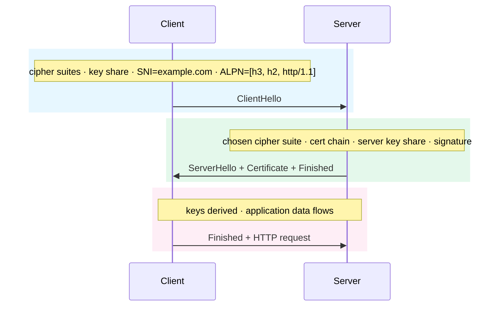

import Figure from '../../../components/figures/Figure.astro';
import TabbedContent from '../../../components/figures/tabbed-content/TabbedContent.astro';
import TabbedItem from '../../../components/figures/tabbed-content/TabbedItem.astro';
import Buckets from '../../../components/exercises/buckets/Buckets.astro';
import Bucket from '../../../components/exercises/buckets/Bucket.astro';
import Item from '../../../components/exercises/buckets/Item.astro';
import Term from '../../../components/ui/Term.astro';
import ExternalResource from '../../../components/ui/ExternalResource.astro';
import VideoCallout from '../../../components/embeds/VideoCallout.astro';
import CertChainSvg from '../../../components/lessons/010/4/CertChainSvg.astro';
import PadlockAddressBar from '../../../components/lessons/010/4/PadlockAddressBar.astro';
import { Steps, FileTree, CardGrid } from '@astrojs/starlight/components';
import CourseProgressBar from '../../../components/ui/CourseProgressBar.astro';

<CourseProgressBar value={frontmatter['course-progress']} />

Modern browsers gate a growing set of APIs behind one condition: the page must be a *secure context*. HTTPS always qualifies. Plain `http://localhost` qualifies too, but only partially, and the exception varies by browser. The moment you test from your phone over the LAN, set a `Secure` cookie, or register a service worker, the exception drops away and code that "worked on localhost" breaks in preview.

A one-time, five-minute setup fixes this: install `mkcert`, let it create a local Certificate Authority your machine trusts, issue a certificate for `localhost`, and point Next.js at it. From then on you develop on `https://localhost:3000` with a green padlock, matching production from day one. Along the way you'll build the mental model of TLS behind that padlock: what a certificate is, what makes a browser trust it, and why a hand-rolled `openssl` self-signed cert fails where `mkcert` succeeds.

## Secure contexts and the localhost exception

The browser exposes a boolean, `window.isSecureContext`. It is `true` on HTTPS pages and, as a special case, on `http://localhost`, `http://127.0.0.1`, and any `http://*.localhost` hostname. Powerful APIs read this boolean as their gate: the Clipboard API, Web Crypto's `subtle` interface, Service Workers, the Push API, and geolocation all refuse to run when it is `false`. The gate exists because these APIs touch sensitive material such as keys, clipboard contents, and background scripts, which a network attacker on plain HTTP could observe or hijack.

The `localhost` exception is only *partial*, in three ways you will hit:

- **`Secure` cookies are unreliable over plain HTTP.** Some browsers silently drop a cookie marked `Secure` when it is set over plain HTTP, even on localhost; others keep it. HTTPS removes the inconsistency, so you can develop with the recommended cookie defaults instead of working around them.
- **The exception covers only `localhost` and `127.0.0.1`.** Serve to a teammate over a LAN IP like `192.168.1.42:3000`, or open the preview on your phone via your machine's `.local` hostname, and the bypass disappears: `navigator.clipboard.writeText` throws and `crypto.subtle` is undefined. The same code that "worked on localhost" breaks on the LAN.
- **Service Workers and Push always require real HTTPS, even on localhost.** They are outside this course's stack, but they are a third place the exception does not apply.

So a <Term definition="A browser condition that gates powerful APIs (Clipboard, Web Crypto subtle, Service Workers, Push, geolocation, and more). Met by HTTPS pages, and by special-cased localhost/127.0.0.1 URLs for most, but not all, gated APIs.">secure context</Term> is not one yes-or-no question; it depends on both the URL and the API. Switching every project to HTTPS on day one removes the ambiguity, and the recurring "but it worked on localhost" problem with it.

## The TLS 1.3 handshake in one round trip

A fresh TLS 1.3 handshake takes one round trip: three messages across two flights. It settles two things at once: that the server is who it claims to be, and a pair of session keys both sides use to encrypt the rest of the conversation. The diagram shows the whole shape.

<Figure caption="TLS 1.3 in one round trip: ClientHello, then the server flight with the certificate chain, then Finished and the first HTTP request on the same flight. Over HTTP/3 the handshake folds into the QUIC transport setup, as seen in The four network stages earlier in this chapter.">

</Figure>

**Phase 1: ClientHello.** The client opens with the cipher suites it speaks, a fresh random value, and its half of a Diffie–Hellman key exchange (its "key share"). Two extensions ride along. <Term definition="Server Name Indication: the hostname the client expects to reach, sent in the clear inside the ClientHello so a server hosting multiple sites picks the right certificate.">SNI</Term> carries the hostname in the clear, so a server hosting many sites on one IP can pick the matching certificate. <Term definition="Application-Layer Protocol Negotiation: the client lists the protocols it speaks (h3, h2, http/1.1) and the server picks one in its hello.">ALPN</Term> lists the application protocols the client speaks (`h3`, `h2`, `http/1.1`), so the server can pick one. Without SNI a CDN can't choose a cert; without ALPN, HTTP/3 can't be negotiated on the same handshake.

**Phase 2: ServerHello + Certificate + Finished.** The server picks one cipher suite, returns its own key share, sends the certificate chain (the next section covers that), and signs a transcript hash of the handshake so far with the private key matching the leaf cert. That signature proves the server owns the cert: anyone can send a public certificate, but only the holder of the matching private key can produce a signature the cert's public key verifies.

**Phase 3: Client Finished and application data.** Both sides now hold both halves of the Diffie–Hellman exchange, so they derive the same session keys. The client sends its Finished message, an authenticated check that nothing tampered with the handshake bytes, and immediately follows it with the first HTTP request on the same flight. That is one round trip from ClientHello to the first byte of application data.

What makes this design hold up is <Term definition="Even if the server's long-term private key leaks years later, recorded sessions cannot be decrypted, because the session keys came from per-connection Diffie–Hellman key shares that were never sent in the clear.">forward secrecy</Term>: the session keys come from per-connection key shares that never travelled in the clear, so even if the server's long-term private key leaks years later, recorded sessions from today can't be decrypted. TLS 1.3 always provides this for normal traffic.

<VideoCallout videoId="JA0vaIb4158" videoTitle="TLS 1.3 Handshake — many changes from prior versions">
  Practical Networking walks through the four big changes TLS 1.3 made to the handshake: 1-RTT, encrypted hellos, encrypted client certs, and more session keys (17 min).
</VideoCallout>

## The certificate chain and the trust store

A certificate is a public key plus metadata (the hostnames it's valid for, the dates it's valid between, and what it can be used for) wrapped in a signature from a <Term definition="An entity that issues TLS certificates. A root CA's public key is preinstalled in the OS and browser trust stores; the browser trusts certs that chain up to a root.">Certificate Authority</Term>. The browser won't trust a public key just because it arrived in a handshake, since anyone can mint a key pair. It trusts the key only when an authority it already trusts vouches for it, and that trust starts from a small set of *root CAs* preinstalled in the operating system and browser trust stores.

<CertChainSvg />

Two consequences fall out of this picture.

**Self-signed certs fail because the chain has nowhere to terminate.** A cert signed only by itself is a leaf whose signer is unknown to the trust store, so the chain walk finds no preinstalled root that vouches for it and the connection is rejected. That rejection is correct: if browsers accepted self-signed certs silently, any coffee-shop network could mint a cert for `bank.com`, intercept your TLS connection, and re-encrypt it transparently, defeating the entire point of HTTPS.

**`mkcert` does something self-signing can't.** Instead of producing a leaf that signs itself, it generates a root CA that exists only on your machine, *installs that root into your OS trust store* (and Firefox's separate trust store), and signs your project's leaf cert with that root. Now the chain walks all the way up: leaf → local root → an entry the trust store recognizes → green padlock. The trust is also local: only *your* machine knows the local root, so no one else's browser would trust a cert your local CA signed.

:::caution
`mkcert`'s root CA is a security boundary on your machine. The local root's private key can sign certificates for *any* hostname: `google.com`, your bank, anything. So if you trust the root and someone else holds the key, they can impersonate any site to your browser. Never copy `rootCA-key.pem` (under the path printed by `mkcert -CAROOT`) onto another machine, and never commit it to a repo. The rule is per-machine and per-developer: each teammate runs `mkcert -install` once on their own laptop and never touches anyone else's root key.
:::

<VideoCallout videoId="x_I6Qc35PuQ" videoTitle="Certificates and Certificate Authority Explained">
  Hussein Nasser builds the same chain-of-trust model from the man-in-the-middle problem up: why a server cert alone isn't enough, who signs it, and why self-signed certs get rejected (16 min).
</VideoCallout>

## Set up mkcert and the HTTPS dev server

This takes two phases. First, install `mkcert` and its local CA on your machine; you do this once. Second, in each project, issue a project-local cert and point Next.js at it.

<Steps>

1. **Install `mkcert`.** Pick the platform that matches your machine.

   <TabbedContent>
     <TabbedItem label="macOS">
       ```bash
       brew install mkcert nss
       ```
     </TabbedItem>
     <TabbedItem label="Linux">
       ```bash
       sudo apt install libnss3-tools
       curl -JLO "https://dl.filippo.io/mkcert/latest?for=linux/amd64"
       chmod +x mkcert-v*-linux-amd64
       sudo mv mkcert-v*-linux-amd64 /usr/local/bin/mkcert
       ```
     </TabbedItem>
     <TabbedItem label="Windows">
       ```bash
       choco install mkcert
       # or, if you use Scoop:
       scoop bucket add extras
       scoop install mkcert
       ```
     </TabbedItem>
   </TabbedContent>

   The `nss` / `libnss3-tools` package on macOS and Linux lets `mkcert` write into Firefox's separate trust store in the next step. On Windows, the installer handles this for you.

   *On disk:* nothing yet, only the `mkcert` binary on your `PATH`.

2. **Install the local CA, once per machine.** This creates the root CA and registers it with your OS (and Firefox).

   ```bash
   mkcert -install
   ```

   You'll see output along these lines (paths vary by OS):

   ```text
   Created a new local CA at "/Users/you/Library/Application Support/mkcert"
   The local CA is now installed in the system trust store!
   The local CA is now installed in the Firefox trust store (requires browser restart)!
   ```

   *On disk:* a new root CA private key and cert under the directory that `mkcert -CAROOT` prints, plus a trust entry in the OS keychain (macOS) / system trust store (Linux) / certificate store (Windows). Firefox installs the root separately in the same step, so restart it once afterward to pick up the change.

   :::tip
   To find where the local CA lives, run `mkcert -CAROOT`; it prints the path. The two files in that directory, `rootCA.pem` (the public cert) and `rootCA-key.pem` (the private key), are your machine's local trust anchor. Treat `rootCA-key.pem` like an SSH private key: never share it, never commit it, and never copy it onto a machine you don't fully control.
   :::

3. **Issue a leaf cert for the project.** From the root of your Next.js project, run:

   ```bash
   mkcert localhost 127.0.0.1 ::1
   ```

   Expected output:

   ```text
   Created a new certificate valid for the following names
    - "localhost"
    - "127.0.0.1"
    - "::1"

   The certificate is at "./localhost+2.pem" and the key at "./localhost+2-key.pem"
   ```

   *On disk:* two new files in the project root, `localhost+2.pem` (the public cert) and `localhost+2-key.pem` (the private key).

   :::caution
   The hostnames you list on this command are the *only* ones the cert will be valid for. That set of hostnames is called the SAN (Subject Alternative Name) list. If you issue for just `localhost` and then visit `https://127.0.0.1:3000`, the browser fails validation, because `127.0.0.1` isn't on the list. Always include all three: `localhost 127.0.0.1 ::1`. If you ever serve from a `.local` mDNS name for cross-device testing, add it here too and re-issue.
   :::

4. **Store the certs and gitignore the key.** Move both files into a `certificates/` directory so they have a stable home. The course standardizes on `./certificates/` because Next.js also drops its auto-generated certs there, which leaves one directory to remember.

   <FileTree>
   - certificates/
     - **localhost.pem** public cert, *OK to commit*
     - **localhost-key.pem** private key, **never commit**
   - .gitignore
   - package.json
   - next.config.ts
   </FileTree>

   Then add one line to `.gitignore` so the key never lands in Git history:

   ```diff lang="text" title=".gitignore"
   + certificates/*-key.pem
   ```

   *On disk:* the project commits the public cert but not the private key. A teammate who has already run `mkcert -install` has a trusted root, so they can use the committed cert without re-issuing; only the key stays per-developer.

5. **Wire the HTTPS server into `package.json` and start it.** Keep the existing `dev` script, since plain HTTP is sometimes easier to debug, and add an opt-in `dev:https` script next to it.

   ```json title="package.json" ins={4}
   {
     "scripts": {
       "dev": "next dev",
       "dev:https": "next dev --experimental-https --experimental-https-key ./certificates/localhost-key.pem --experimental-https-cert ./certificates/localhost.pem"
     }
   }
   ```

   Pointing Next.js at the `mkcert`-issued files, rather than letting it auto-generate its own, is what makes that committed cert work: every developer reads the same shared cert from one known directory.

   Now start it:

   ```bash
   pnpm dev:https
   ```

   You should see something like:

   ```text
   ▲ Next.js 16.x.x (Turbopack)
     - Local:        https://localhost:3000
     - Network:      https://192.168.1.42:3000

    ✓ Ready in 1.2s
   ```

   *On disk:* nothing further changes; the server now reads its cert and key from `./certificates/`.

   :::tip
   If you pass just `--experimental-https` without the `--experimental-https-key` and `--experimental-https-cert` flags, Next.js detects `mkcert` on your `PATH` and auto-generates its own cert into `./certificates/`. That's fine for solo work, but the per-developer cert can't be shared, which is why this setup points at the committed `mkcert` files instead.
   :::

</Steps>

Open `https://localhost:3000` in the browser. You should see a green padlock in the address bar and no warning interstitial.

<PadlockAddressBar />

Click the padlock once. The browser shows "Connection is secure" and a "Certificate is valid" link that opens the certificate detail panel. There you can walk the chain: the leaf cert, signed by your local mkcert CA, which the OS trust store now lists. That's the green padlock, decoded.

## Pitfalls and verification

These five failure modes catch most new mkcert users.

- **The "still not trusted" loop.** Forgetting `mkcert -install` is the most common cause: the cert is signed, but by a CA the browser doesn't know, so the connection is rejected. Run `mkcert -install` and restart the browser.
- **Cert valid for one hostname, browser visits another.** Issuing only `mkcert localhost` and then opening `https://127.0.0.1:3000` fails, because the SAN list omits `127.0.0.1`. Always issue all three together: `mkcert localhost 127.0.0.1 ::1`, and re-issue when you add a hostname.
- **Browser stuck on the previous untrusted cert.** Some browsers cache the rejection across reloads. After `mkcert -install`, hard-reload (Cmd+Shift+R on macOS, Ctrl+Shift+R on Windows or Linux) or relaunch the browser.
- **Firefox didn't get the root.** Firefox keeps its own trust store. `mkcert -install` writes the root into it automatically, but you must restart Firefox to pick it up.
- **Committed the key.** If `*-key.pem` lands in Git history, rotate the local root with `mkcert -uninstall && mkcert -install`, re-issue every cert that root signed, and purge the leaked key from history. The `.gitignore` rule from step 4 is what keeps you from ever needing this.

To verify the setup, open DevTools and run `window.isSecureContext` in the Console. It should return `true`. From here the Clipboard API, Web Crypto's `subtle` interface, and `Secure` cookies are all available.

The production side needs no work from you. Vercel, like every modern hosting platform, provisions a Let's Encrypt cert on the first request to your domain and auto-renews it before expiry. The five minutes you just spent are the only TLS wiring this project needs.

## Check your understanding

Whether a call runs in a secure context depends on both the URL and the API. Sort each combination below.

<Buckets twoCol instructions="For each URL + API combination, decide whether it runs in a secure context.">
  <Bucket name="works" label="Works" description="Secure-context APIs are fully available." />
  <Bucket name="localhost" label="Works (localhost exception)" description="Secure-context API, but the http://localhost carve-out covers it." />
  <Bucket name="blocked" label="Blocked, needs real HTTPS" description="Throws, rejects, or silently fails." />

  <Item bucket="works">`https://app.example.com` → `clipboard.writeText('hi')`</Item>
  <Item bucket="localhost">`http://localhost:3000` → `crypto.randomUUID()`</Item>
  <Item bucket="localhost">`http://localhost:3000` → `crypto.subtle.sign(...)`</Item>
  <Item bucket="blocked">`http://192.168.1.42:3000` (phone on LAN) → `navigator.clipboard.writeText('hi')`</Item>
  <Item bucket="blocked">`http://localhost:3000` → set cookie `Secure; HttpOnly; SameSite=Lax`</Item>
  <Item bucket="works">`https://localhost:3000` (mkcert) → register a Service Worker</Item>
</Buckets>

## External resources

<CardGrid>
  <ExternalResource
    title="mkcert"
    href="https://github.com/FiloSottile/mkcert"
    icon="simple-icons:github"
    iconColor="#ffffff"
    description="The tool's GitHub repo: install instructions, supported platforms, and the security note on rootCA-key.pem."
  />
  <ExternalResource
    title="Use HTTPS for local development"
    href="https://web.dev/articles/how-to-use-local-https"
    icon="simple-icons:google"
    iconColor="#4285F4"
    description="web.dev's argument for why localhost HTTPS matters and a walk-through of the mkcert flow."
  />
  <ExternalResource
    title="What happens in a TLS handshake?"
    href="https://www.cloudflare.com/learning/ssl/what-happens-in-a-tls-handshake/"
    icon="simple-icons:cloudflare"
    iconColor="#F38020"
    description="Cloudflare's plain-English explainer covering both TLS 1.2 and the TLS 1.3 1-RTT flow."
  />
  <ExternalResource
    title="Secure contexts"
    href="https://developer.mozilla.org/en-US/docs/Web/Security/Secure_Contexts"
    icon="simple-icons:mdnwebdocs"
    iconColor="#000000"
    description="MDN's full list of features gated by isSecureContext and the exact carve-out rules for localhost."
  />
</CardGrid>
