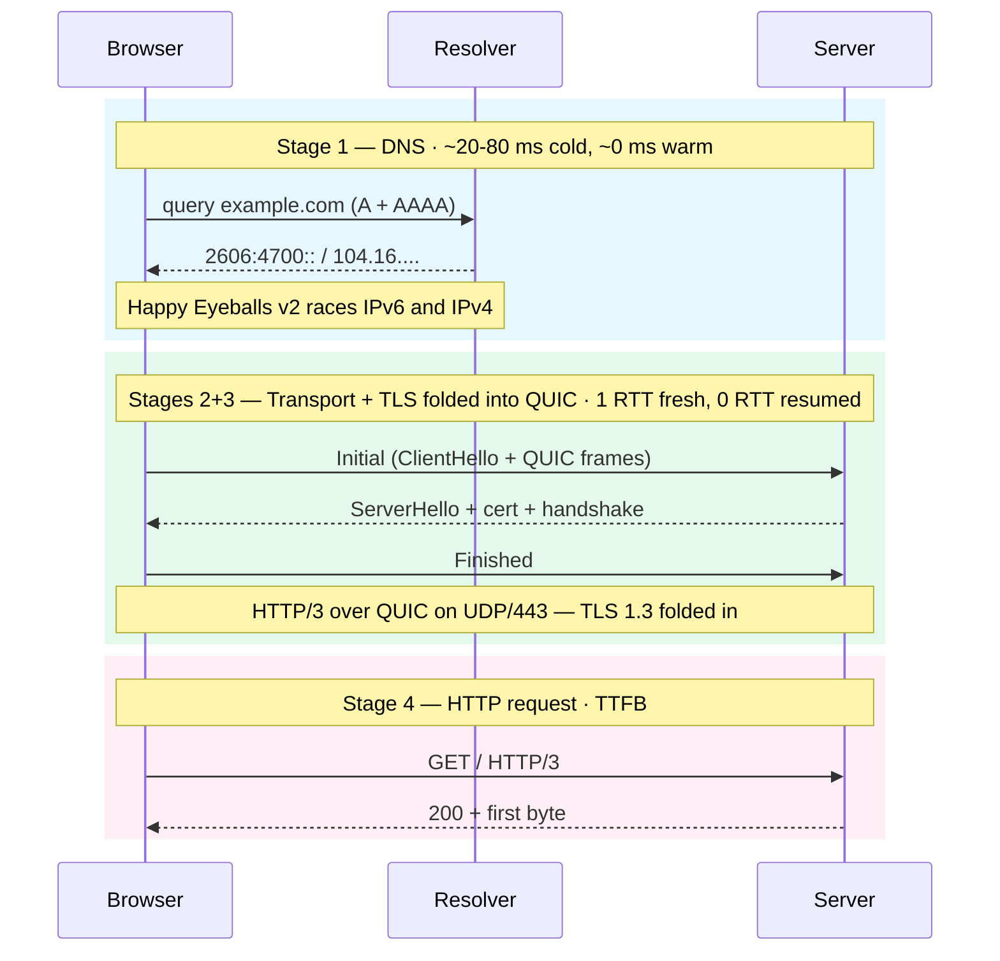

import Figure from '../../../components/figures/Figure.astro';
import CodeVariants from '../../../components/code/code-variants/CodeVariants.astro';
import CodeVariant from '../../../components/code/code-variants/CodeVariant.astro';
import Matching from '../../../components/exercises/matching/Matching.astro';
import Pair from '../../../components/exercises/matching/Pair.astro';
import Term from '../../../components/ui/Term.astro';
import VideoCallout from '../../../components/embeds/VideoCallout.astro';
import ExternalResource from '../../../components/ui/ExternalResource.astro';
import { Steps, Aside, CardGrid } from '@astrojs/starlight/components';
import CourseProgressBar from '../../../components/ui/CourseProgressBar.astro';

<CourseProgressBar value={frontmatter['course-progress']} />

A slow page load is never a single problem. It's a *stage* problem — one of four steps from URL commit to first byte was the bottleneck, and three were not. The engineer who can look at a waterfall row and name the slow stage owns the debugging conversation. The one who reads "the site is slow" and reaches for the server logs has already lost half a day.

This lesson is the map. Four stages — DNS, transport, TLS, HTTP — each named in the 2026 vocabulary, each with one prose section and one anchor on a single diagram. The fifth section is reading the DevTools Network panel, which is where you'll spend most of your debugging time in the rest of this unit. The browser side of the pipeline — what happens *after* the first byte arrives — is the next lesson. Deeper TLS at debug depth is later in this chapter.

Before going further, open DevTools (Cmd+Opt+I on macOS, F12 on Windows or Linux), switch to the **Network** tab, right-click any column header, and turn on the **Protocol** column. Leave it open. You'll use it mid-lesson.

## The four-stage map

Here's the whole route a request takes, end-to-end. Look at it once before reading the prose; each stage below will land back on this diagram.

<Figure caption="Four stages from URL commit to the first byte of HTML on the 2026 default stack — HTTP/3 over QUIC, TLS 1.3, DoH where the resolver supports it.">

</Figure>

Read the diagram top-to-bottom. The horizontal arrows are network round trips — each one a real travel between the client and a remote machine, each one costing wall-clock time. Stages 2 and 3 are drawn together because in 2026 they are physically the same handshake: TLS 1.3 is folded into the QUIC transport setup, so there's one round of "set up the secure pipe" rather than two. Stage 4 is the actual HTTP request, the one with a method and a path. Stages 1 through 3 are the cost of *getting ready* to make that request — and an experienced engineer debugging a slow page checks them first, because warm-connection numbers in the next four sections collapse those costs to near zero.

## Stage 1 — DNS resolution

The browser is given a hostname like `app.example.com`. The network stack doesn't know what to do with a hostname. It needs an IP address. That conversion is DNS.

The browser hands the hostname to the OS resolver, and the resolver walks a chain of caches looking for the answer: the browser's own cache first, then the OS cache, then the recursive resolver your network is configured to use (often your ISP's, increasingly Cloudflare's or Google's), and finally the authoritative server for the domain if nothing along the way had it. A cold lookup — nothing cached anywhere — typically costs 20 to 80 milliseconds. A warm lookup costs effectively zero.

In 2026, that resolver conversation is increasingly encrypted. <Term definition="DNS over HTTPS — DNS queries tunneled through an HTTPS connection so the resolver path is encrypted and unmodifiable on-wire.">DoH</Term> is the standard form: the DNS query rides inside an HTTPS connection to a DNS provider that speaks the protocol. Firefox enables DoH by default in most regions; Chrome and Edge auto-upgrade to DoH when the system resolver advertises support, falling back to plain DNS otherwise. The plain-DNS path is the conditional floor, not the default. DoT (DNS over TLS) is the OS-level alternate and DoQ (DNS over QUIC) is the QUIC-native one — name them so you don't think DoH is the only encrypted option, but the production reality the course assumes is DoH.

One thing the browser does that most newcomers don't picture: it doesn't issue *one* lookup. It issues two — an A record query for IPv4 and an AAAA query for IPv6 — and races them. The algorithm is <Term definition="RFC 8305 algorithm: browsers race IPv4 and IPv6 lookups and connection attempts, preferring IPv6 by ~50ms to avoid a long-tail wait when one family is broken.">Happy Eyeballs v2</Term>. It prefers IPv6 when both resolve in time, giving IPv6 a roughly 50 ms head start, but it doesn't *wait* on IPv6 — if v6 is broken, v4 wins and the user never notices. Without this, a misconfigured IPv6 path would stall the page for the resolver's full timeout.

<VideoCallout videoId="27r4Bzuj5NQ" videoTitle="Everything You Need to Know About DNS — ByteByteGo">
  ByteByteGo animates the resolver-to-root-to-TLD-to-authoritative walk in 6 minutes, including the cache chain and the TTL gotchas that make production DNS changes slow.
</VideoCallout>

:::caution
A cold DNS leg is invisible during the typical fast-localhost loop. `localhost` resolves to `127.0.0.1` in microseconds; you never see the DNS tax during local development. It surfaces in production, in flaky preview environments, and in network conditions you don't control. When a user reports "the very first load is slow but the second one is fine," DNS is the first place to look.
:::

## Stage 2 — Transport: HTTP/3 over QUIC

Once the browser has an IP address, it needs to open a connection to it. The 2026 default is <Term definition="Quick UDP Internet Connections — a multiplexed, encrypted, congestion-controlled transport built on UDP. The TLS handshake is folded into the connection setup, and streams don't block each other on packet loss.">QUIC</Term> on UDP port 443, carrying HTTP/3.

HTTP/2 over TCP solved a real problem — multiplexing multiple requests on one connection — but it solved it at the *HTTP* layer. The transport underneath was still TCP, and TCP delivers bytes in order; if one packet drops, every later packet on the connection waits, even if those packets belong to a different stream. That's head-of-line blocking, and on a flaky mobile network it kills throughput. QUIC moves multiplexing into the transport itself: each stream has its own state, and a lost packet stalls only its own stream. It also folds in TLS 1.3 (Stage 3 below) and encryption goes deeper into the stack — even the transport metadata is encrypted.

The browser doesn't speculatively try HTTP/3 on a brand-new origin. It opens its first connection over HTTP/2, sees the `Alt-Svc` response header advertising HTTP/3 availability, and *upgrades* on the next request. There's a newer mechanism, the HTTPS DNS record (type 65 / SVCB), that lets a browser learn about HTTP/3 from the DNS lookup itself, and it's growing — but `Alt-Svc` is still the most common discovery path in 2026. The practical consequence you'll see in the DevTools drill at the end of this lesson: the very first document request to a fresh origin can show `h2`, and the second navigation flips to `h3`. Not a bug; the browser is learning.

The conditional fallback, in one line: HTTP/2 over TCP plus TLS 1.3 is still ubiquitous. Corporate networks sometimes block or throttle UDP, and clients silently fall back to HTTP/2. Origins that haven't moved still serve HTTP/1.1 to clients that still handshake it; the course writes no HTTP/1.1-specific code.

The round-trip story is what makes QUIC worth the change. Three cases to put side by side.

<CodeVariants>
  <CodeVariant label="HTTP/3 fresh · 1 RTT">
    ```text
    Client -> Server : Initial + ClientHello + (early HTTP request frames)
    Server -> Client : ServerHello + cert + handshake + Finished
    Client -> Server : Finished + HTTP request body
                       (continues...)
    ```
    **One round trip and the request rides on the same flight as the handshake completion.** No session ticket exists yet, but TLS 1.3 inside QUIC needs only one round trip to set up keys, and the request follows immediately. Latency to first byte ends up being roughly two round trips — one for the handshake, one for the response.
  </CodeVariant>

  <CodeVariant label="HTTP/3 resumed · 0 RTT">
    ```text
    Client -> Server : Initial + early data (HTTP request inside the first packet)
                       using a cached session ticket from a previous visit
    Server -> Client : response (first byte)
    ```
    **Repeat visit to the same origin.** The browser still has a session ticket from the previous handshake and uses it to send the HTTP request *inside the very first packet* — the 0-RTT path. Latency collapses to roughly one round trip, the response itself. Early data is only safe for idempotent GETs; non-idempotent requests wait for the full handshake even on resumption.
  </CodeVariant>

  <CodeVariant label="HTTP/2 + TLS 1.3 · 2 RTT">
    ```text
    Client -> Server : SYN                              (TCP handshake)
    Server -> Client : SYN-ACK
    Client -> Server : ACK
    Client -> Server : ClientHello                       (TLS 1.3 handshake)
    Server -> Client : ServerHello + cert + Finished
    Client -> Server : Finished + HTTP request
    Server -> Client : response (first byte)
    ```
    **TCP handshake first, then TLS, then the request.** Two round trips to the first byte on a fresh connection. This is the world before QUIC — and it's still where the request lands when UDP is blocked or before `Alt-Svc` has done its work.
  </CodeVariant>
</CodeVariants>

The number to internalize: **fresh QUIC is 1 RTT, resumed QUIC is 0 RTT, TCP plus TLS is 2 RTT.** That's the difference between a snappy page and a sluggish one on a mobile connection where one round trip can be 100 ms or more.

<VideoCallout videoId="UMwQjFzTQXw" videoTitle="HTTP 1 vs HTTP 2 vs HTTP 3 — ByteByteGo">
  ByteByteGo walks the HTTP/1, 2, and 3 evolution in 7 minutes — animated head-of-line blocking, multiplexing, and the QUIC handshake side-by-side.
</VideoCallout>

## Stage 3 — TLS 1.3 inside the QUIC handshake

This section is short. The deeper TLS treatment — cipher suites, certificate chains, SNI, ALPN — lives in the *HTTPS on localhost* lesson later in this chapter, framed against `mkcert` and local HTTPS. Here, four facts make the diagram and the RTT counts make sense.

**TLS 1.3 is the only flavor the 2026 stack ships.** TLS 1.2 is deprecated; the browser refuses to speak older protocols. Treat it as a given.

**In QUIC, TLS is interleaved with the transport handshake.** The `ClientHello` rides inside the very first QUIC packet — not as a separate step on top. A fresh connection completes in one round trip; a <Term definition="A repeat connection to an origin the client has visited before — the client carries a session ticket, the cryptographic handshake collapses, and the request can ride in the first packet.">resumed connection</Term> completes in zero, using a session ticket the client kept from the previous visit.

**0-RTT carries a replay-safety constraint.** Early data — the request bytes inside the first packet on a resumed connection — has no nonce yet from the server, so an attacker who recorded the encrypted packet could replay it later and the server has no way to recognize the replay. The fix is to only send idempotent GETs as early data; non-idempotent requests (POST, PATCH, DELETE — anything that changes state on the server) wait for the full handshake. The browser and the HTTP/3 stack handle this for you, but it's worth knowing the rule because the next chapter on the HTTP contract will land hard on idempotency as the contract that makes safe retries possible.

**Forward secrecy is the property TLS 1.3 always provides for normal traffic.** Even if the server's long-term private key leaks tomorrow, recorded sessions from yesterday can't be decrypted — each session uses ephemeral keys. The exception is 0-RTT early data, which does *not* have forward secrecy, because by construction the request rides on keys derived before the new ephemeral exchange. One more reason early data is reserved for idempotent GETs.

<VideoCallout videoId="JA0vaIb4158" videoTitle="TLS 1.3 Handshake — Practical Networking">
  Practical Networking walks the TLS 1.3 handshake against the older two-round-trip version — why it collapses to one round trip and how 0-RTT early data works, the exact RTT story this section counts.
</VideoCallout>

The full TLS 1.3 handshake — cipher-suite negotiation, ALPN identifiers (`h3`, `h2`, `http/1.1`), SNI (Server Name Indication), the certificate chain validation — is the *HTTPS on localhost* lesson later in this chapter. Here, we needed the round-trip count and the resumption story.

## Stage 4 — The HTTP request and TTFB

Once the secure transport is up, the client finally sends what it came for: an HTTP/3 request. A method (`GET`), a path (`/`), a `:authority` pseudo-header naming the host, the request headers, and (for non-GET requests) a body. The server processes it and starts responding. The first byte of the response body arrives.

The wall-clock time from the moment the browser commits the URL to the moment that first byte lands is <Term definition="Time to First Byte — the wall-clock time from the moment the browser commits the URL to the moment the first byte of the response body arrives. Bundles DNS, connection setup, TLS handshake, request travel, server thinking time, and one network round trip.">TTFB</Term>. It's a single number on the stopwatch but it's *not* a single thing. It bundles every stage above: DNS, connection setup, TLS handshake, request travel, server thinking time, and the network round trip for the response.

:::caution
TTFB measured from a warm connection isolates the server-and-network number — DNS is cached, the connection is alive, TLS is resumed, and the only cost left is "how long did the server think and how long did the answer take to get back." TTFB on a cold connection bundles all four stages into one stopwatch. When you read a TTFB value, *always* check which one you're looking at. A 600 ms TTFB on a cold connection might be a fast server behind 400 ms of network setup; a 600 ms TTFB on a warm connection is a slow server.
:::

TTFB is the metric the performance chapter in Unit 19 tunes against. Here, it's a label. The point is that "server slow" is one possible explanation and three others sit upstream of it.

## Reading the DevTools Network waterfall

You opened DevTools at the top of the lesson. The Network panel is where every later chapter in this unit will send you. Each row in the panel is one request, and each row carries a Protocol label and a Timing breakdown that map directly to the stages above.

### The Protocol column

The Protocol column you enabled at the top tells you which version the request used. The three values you'll see:

- **`h3`** — HTTP/3 over QUIC. The 2026 default.
- **`h2`** — HTTP/2 over TCP + TLS. The conditional fallback, also the first hit to a fresh origin before `Alt-Svc` discovery has happened.
- **`http/1.1`** — Legacy. Origins that haven't moved, or clients on networks that block UDP and fall back through both HTTP/2 and HTTP/3 hints.

The `Alt-Svc` nuance from Stage 2 lands here. On a fresh origin, the very first document request can show `h2`; reload the page and the document row should flip to `h3` because the browser has now learned HTTP/3 is available. Any production origin that's *still* not `h3` on a second load is a configuration conversation with whoever manages that origin's CDN — not a bug in your code.

### The Timing breakdown

Click a row in the Network panel, switch to the **Timing** tab, and you'll see a stacked bar. Each segment is one of the stages this lesson named. They map straight across:

- <Term definition="The request is waiting on the browser's connection pool or priority queue — not a network stage, just the browser's local accounting before it starts the network work.">**Queued / Stalled**</Term> — the browser's own bookkeeping. The request is waiting on a connection slot or a priority queue.
- <Term definition="Stage 1 — the DNS lookup. Often 0 ms on warm caches.">**DNS Lookup**</Term> — Stage 1. Often shows 0 ms on warm caches.
- <Term definition="Stage 2 — the transport handshake. For HTTP/3 the QUIC handshake collapses into this segment; for HTTP/2 this is just the TCP three-way handshake and the TLS round trip lives in a separate SSL segment.">**Initial connection**</Term> — Stage 2. For `h3` requests, the QUIC handshake collapses into this segment. For `h2`, this is just the TCP handshake.
- <Term definition="Stage 3 — the TLS handshake round trip. For HTTP/3 this is folded into Initial connection and may not appear separately; for HTTP/2 it's the explicit TLS leg on top of TCP.">**SSL**</Term> — Stage 3. For `h3`, folded into Initial connection and often not shown as a separate bar. For `h2`, the explicit TLS round trip on top of TCP.
- **Request sent** — bytes uploaded. Usually tiny for a `GET`.
- <Term definition="Stage 4 — server thinking time plus the final network round trip for the response. This is the TTFB measurement on the row.">**Waiting (TTFB)**</Term> — Stage 4. Server thinking time plus the round trip back.
- <Term definition="The response body arriving on the wire. For large pages or large API responses this can dominate the total time, completely separately from anything the server or handshake did.">**Content Download**</Term> — body bytes streaming in.

That's the whole vocabulary of the panel. Once you've read a few real waterfalls with these labels in mind, every later debugging conversation in this unit lands somewhere on this list.

<VideoCallout videoId="2CC0fugc_2o" videoTitle="Understand the Network Tab — Tobi Mey">
  A 7-minute hands-on tour of the Network panel — the row structure, the Timing tab for spotting bottlenecks, throttling, and the disable-cache trap — good to watch before the drill below.
</VideoCallout>

### The drill — read a real request

Now do it on a real site. Follow the steps below against `cloudflare.com` (always served over `h3` on a modern browser) or against this course's site.

<Steps>
1. In DevTools, switch to the **Network** tab. In the toolbar at the top of the panel, tick **Disable cache**. This forces a real network fetch instead of a cached response.

2. Hard-reload the page (Cmd+Shift+R on macOS, Ctrl+Shift+R on Windows or Linux). Watch the document row — the very first row, the one for the page's HTML.

3. Check the **Protocol** column. On the first load to a fresh origin you may see `h2`; do one more reload and the document row should flip to `h3` because the browser learned about HTTP/3 from the `Alt-Svc` header on the first response. Click the document row, open the **Timing** tab, and find the **DNS Lookup**, **Initial connection**, **Waiting (TTFB)**, and **Content Download** segments. On `h3`, the **SSL** bar collapses into Initial connection — that's the transport-plus-TLS fold the diagram showed.

4. Untick **Disable cache** and do a soft reload (Cmd+R or F5). The DNS Lookup and Initial connection segments should collapse to near zero — that's the resumed-connection effect, visible on the panel. The DNS is cached and the QUIC connection is still alive.

5. Click the **Waiting (TTFB)** segment and read its number. That's the server-and-network cost in isolation, with all the setup costs paid in previous requests.
</Steps>

For reference, here's what an annotated `h3` timing breakdown looks like — each label mapped to the stage from the diagram.

<Figure caption="A schematic h3 document request Timing panel — Initial connection holds the QUIC + TLS handshake (Stages 2 and 3 folded), Waiting (TTFB) is Stage 4. DNS Lookup is 0 ms because the lookup hit a warm cache; SSL is folded into Initial connection, so it never appears as its own bar.">
  <svg viewBox="0 0 720 320" xmlns="http://www.w3.org/2000/svg" role="img" aria-label="Schematic of a Chrome DevTools Timing panel for an h3 request, showing each segment mapped to its stage." style="width: 100%; height: auto; font-family: ui-sans-serif, system-ui, sans-serif;">
    <rect x="0" y="0" width="720" height="320" fill="transparent" />

    {/* Stage labels (top) */}
    <text x="60" y="22" font-size="11" fill="currentColor" opacity="0.6">Local</text>
    <text x="180" y="22" font-size="11" fill="currentColor" opacity="0.6">Stage 1</text>
    <text x="270" y="22" font-size="11" fill="currentColor" opacity="0.6">Stages 2 + 3 (folded)</text>
    <text x="470" y="22" font-size="11" fill="currentColor" opacity="0.6">Stage 4</text>
    <text x="600" y="22" font-size="11" fill="currentColor" opacity="0.6">Body</text>

    {/* Stacked bar */}
    <g transform="translate(0, 40)">
      {/* Queued */}
      <rect x="20" y="0" width="60" height="28" fill="#94a3b8" opacity="0.55" />
      {/* Stalled */}
      <rect x="80" y="0" width="40" height="28" fill="#94a3b8" opacity="0.4" />
      {/* DNS Lookup — 0 ms, shown as a sliver */}
      <rect x="120" y="0" width="4" height="28" fill="#38bdf8" />
      {/* Initial connection (h3: QUIC + TLS folded) */}
      <rect x="124" y="0" width="200" height="28" fill="#22c55e" opacity="0.85" />
      {/* Request sent */}
      <rect x="324" y="0" width="20" height="28" fill="#a3a3a3" />
      {/* Waiting (TTFB) */}
      <rect x="344" y="0" width="170" height="28" fill="#f472b6" opacity="0.9" />
      {/* Content Download */}
      <rect x="514" y="0" width="120" height="28" fill="#f59e0b" opacity="0.85" />

      {/* Bar outline */}
      <rect x="20" y="0" width="614" height="28" fill="none" stroke="currentColor" stroke-opacity="0.2" />
    </g>

    {/* Segment labels (below the bar) */}
    <g font-size="12" fill="currentColor">
      <text x="50" y="92" text-anchor="middle">Queued</text>
      <text x="100" y="92" text-anchor="middle">Stalled</text>
      <text x="122" y="108" text-anchor="middle" font-size="11" opacity="0.7">DNS · 0 ms</text>
      <text x="224" y="92" text-anchor="middle" font-weight="600">Initial connection</text>
      <text x="224" y="108" text-anchor="middle" font-size="11" opacity="0.7">QUIC + TLS folded</text>
      <text x="334" y="92" text-anchor="middle" font-size="11">Req</text>
      <text x="429" y="92" text-anchor="middle" font-weight="600">Waiting (TTFB)</text>
      <text x="574" y="92" text-anchor="middle" font-weight="600">Content Download</text>
    </g>

    {/* Mapping arrows + stage notes */}
    <g stroke="currentColor" stroke-opacity="0.35" fill="none">
      <line x1="122" y1="120" x2="122" y2="180" stroke-dasharray="3 3" />
      <line x1="224" y1="120" x2="224" y2="180" stroke-dasharray="3 3" />
      <line x1="429" y1="120" x2="429" y2="180" stroke-dasharray="3 3" />
      <line x1="574" y1="120" x2="574" y2="180" stroke-dasharray="3 3" />
    </g>

    <g font-size="12" fill="currentColor">
      <text x="122" y="196" text-anchor="middle" font-weight="600">Stage 1</text>
      <text x="122" y="212" text-anchor="middle" opacity="0.75">DNS resolution</text>
      <text x="122" y="228" text-anchor="middle" font-size="11" opacity="0.6">(warm cache)</text>

      <text x="224" y="196" text-anchor="middle" font-weight="600">Stages 2 + 3</text>
      <text x="224" y="212" text-anchor="middle" opacity="0.75">QUIC handshake</text>
      <text x="224" y="228" text-anchor="middle" font-size="11" opacity="0.6">TLS 1.3 folded in</text>

      <text x="429" y="196" text-anchor="middle" font-weight="600">Stage 4</text>
      <text x="429" y="212" text-anchor="middle" opacity="0.75">HTTP request + server</text>
      <text x="429" y="228" text-anchor="middle" font-size="11" opacity="0.6">= TTFB</text>

      <text x="574" y="196" text-anchor="middle" font-weight="600">Response body</text>
      <text x="574" y="212" text-anchor="middle" opacity="0.75">bytes streaming in</text>
    </g>

    {/* Legend / footnote */}
    <g transform="translate(20, 270)" font-size="11" fill="currentColor" opacity="0.7">
      <text x="0" y="0">On h3 the SSL bar is folded into Initial connection — there is no separate TLS row.</text>
      <text x="0" y="18">DNS Lookup is a 0 ms sliver because this row's resolver hit a warm cache.</text>
    </g>
  </svg>
</Figure>

The waterfall is the read-out surface for the rest of Unit 2. Every `fetch` you make later in the unit, every cookie you set, every CORS preflight will appear here as a row you can hover, click, and read. The vocabulary you just installed — `h3` / `h2`, DNS / Initial connection / SSL / Waiting / Content Download, fresh vs. resumed — is the vocabulary you'll keep using.

## Read the waterfall by its dominant cost

One short drill before closing. The point of the four-stage map is to look at any waterfall row and say *which stage is the bottleneck* — that's the debugging conversation an experienced engineer owns. Match each row's shorthand description to its dominant cost.

<Matching instructions="Match each waterfall row shorthand to the stage that dominates its wall-clock time.">
  <Pair>
    <Fragment slot="left">`h3` · DNS 0 ms · Initial connection 0 ms · Waiting (TTFB) 320 ms · Content Download 12 ms</Fragment>
    <Fragment slot="right">**Server-bound** — warm connection, the server is thinking</Fragment>
  </Pair>
  <Pair>
    <Fragment slot="left">`h2` · DNS 75 ms · Initial connection 90 ms · SSL 80 ms · Waiting (TTFB) 60 ms · Content Download 8 ms</Fragment>
    <Fragment slot="right">**Connection-bound** — cold TCP + TLS handshake dominates</Fragment>
  </Pair>
  <Pair>
    <Fragment slot="left">`h3` · Queued 0 ms · DNS 60 ms · Initial connection 35 ms · Waiting (TTFB) 50 ms</Fragment>
    <Fragment slot="right">**DNS-bound** — cold lookup dominates</Fragment>
  </Pair>
  <Pair>
    <Fragment slot="left">`h3` · Queued 280 ms · DNS 0 ms · Initial connection 0 ms · Waiting 40 ms</Fragment>
    <Fragment slot="right">**Queue-bound** — browser priority queue or connection-pool stall</Fragment>
  </Pair>
  <Pair>
    <Fragment slot="left">`h3` · Waiting (TTFB) 30 ms · Content Download 1800 ms</Fragment>
    <Fragment slot="right">**Content-bound** — large response body, server was fast</Fragment>
  </Pair>
  <Pair>
    <Fragment slot="left">`(from disk cache)` · 0 ms total</Fragment>
    <Fragment slot="right">**Cached** — no network leg at all, served from the browser's HTTP cache</Fragment>
  </Pair>
</Matching>

If you can read six rows and name the slow stage, you can do it for any row in production. That reflex — point at the stage, then debug the stage — is the durable skill of this lesson. Protocols will turn over, the vocabulary will drift, but the staged mental model survives.

## What stays out

Three forward-link notes, each named once because you'll meet them soon.

The HTTP method, status, and header contract — `GET` / `POST` / `PUT` / `PATCH` / `DELETE`, the status-code families, the header categories — is the next chapter's full territory. Origins and CORS are the chapter after that. Cookies and `Secure` / `SameSite` are the chapter after *that*. The deeper TLS 1.3 handshake at debug depth — cipher suites, the full certificate chain, SNI, ALPN — is the *HTTPS on localhost* lesson later in this chapter, where you'll wire up `https://localhost` with `mkcert`. The browser-side pipeline — what happens *after* the first byte arrives, the parse-DOM-CSSOM-layout-paint-composite path — is the next lesson.

The first byte is here. Next lesson, it becomes pixels.

## External resources

<CardGrid>
  <ExternalResource
    title="What is HTTP/3?"
    href="https://www.cloudflare.com/learning/performance/what-is-http3/"
    icon="simple-icons:cloudflare"
    iconColor="#F38020"
    description="Cloudflare's Learning Center overview — QUIC, head-of-line blocking, 0-RTT, and why HTTP/3 sits on UDP."
  />
  <ExternalResource
    title="HTTP/3 explained"
    href="https://http3-explained.haxx.se/en"
    icon="simple-icons:curl"
    iconColor="#073551"
    description="Free interactive book by Daniel Stenberg (curl maintainer) — the deepest readable treatment of HTTP/3 and QUIC outside the RFCs."
  />
  <ExternalResource
    title="Network features reference"
    href="https://developer.chrome.com/docs/devtools/network/reference"
    icon="simple-icons:googlechrome"
    iconColor="#4285F4"
    description="Official Chrome DevTools docs — every column, filter, and Timing-tab segment of the Network panel."
  />
  <ExternalResource
    title="Happy Eyeballs"
    href="https://en.wikipedia.org/wiki/Happy_Eyeballs"
    icon="simple-icons:wikipedia"
    iconColor="#000000"
    description="Background on RFC 8305 — how browsers race IPv6 and IPv4 to avoid the broken-family stall."
  />
</CardGrid>
