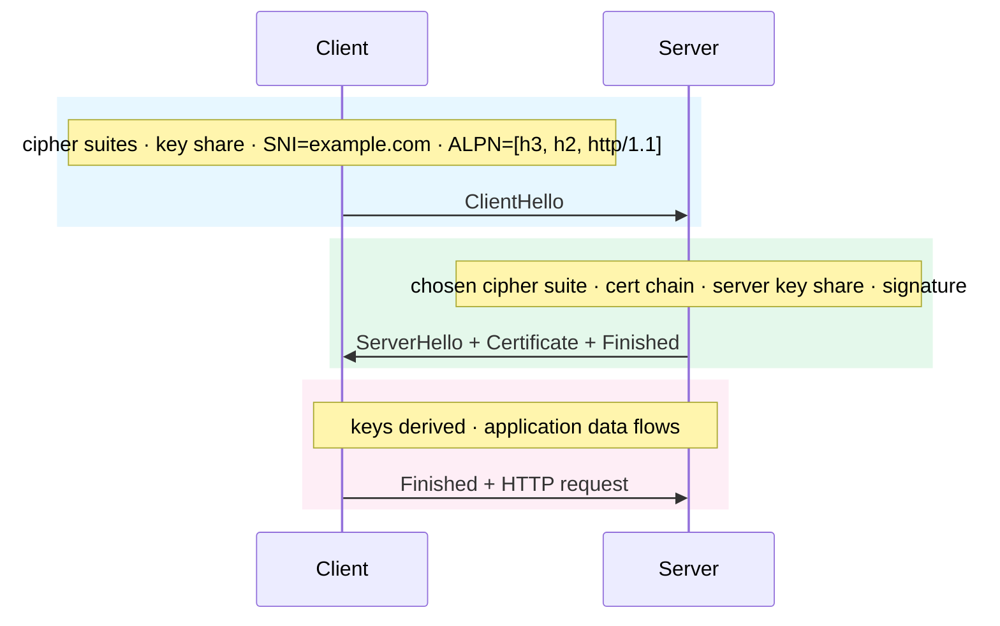

import Figure from '../../../components/figures/Figure.astro';
import TabbedContent from '../../../components/figures/tabbed-content/TabbedContent.astro';
import TabbedItem from '../../../components/figures/tabbed-content/TabbedItem.astro';
import Buckets from '../../../components/exercises/buckets/Buckets.astro';
import Bucket from '../../../components/exercises/buckets/Bucket.astro';
import Item from '../../../components/exercises/buckets/Item.astro';
import Term from '../../../components/ui/Term.astro';
import ExternalResource from '../../../components/ui/ExternalResource.astro';
import VideoCallout from '../../../components/embeds/VideoCallout.astro';
import CertChainSvg from '../../../components/lessons/010/4/CertChainSvg.astro';
import PadlockAddressBar from '../../../components/lessons/010/4/PadlockAddressBar.astro';
import { Steps, FileTree, CardGrid } from '@astrojs/starlight/components';
import CourseProgressBar from '../../../components/ui/CourseProgressBar.astro';

<CourseProgressBar value={frontmatter['course-progress']} />

Modern browsers gate a growing set of APIs behind a single condition: the page must be a *secure context*. HTTPS satisfies that condition. Plain `http://localhost` satisfies it too, for most APIs, most of the time. The trouble is that this localhost exception is partial, and it behaves differently across browsers. The day you test from your phone over the LAN, set a `Secure` cookie, or wire up a service worker, the exception no longer applies, and code that "worked on localhost" stops working. That is where the familiar "works on my machine, breaks in preview" bug comes from.

The fix takes about five minutes of one-time setup. You install a small tool called `mkcert`, let it create a local Certificate Authority that your machine trusts, issue a certificate for `localhost`, and point Next.js at it. From then on you develop on `https://localhost:3000` with a green padlock, that whole class of bug is gone, and you match production behavior from the first day of every project.

Along the way you'll build the mental model of TLS that explains *why* the green padlock appears: what a certificate is, what makes a browser trust it, and why a hand-rolled `openssl req` self-signed cert fails where `mkcert` succeeds. By the end of this lesson, `https://localhost:3000` will load without a warning, and you'll know exactly what made the browser stop complaining.

## Why HTTPS on localhost: the secure-context gate

The browser exposes a boolean called `window.isSecureContext`. It returns `true` on HTTPS pages, and, as a special case, on `http://localhost`, `http://127.0.0.1`, and any `http://*.localhost` hostname. Powerful APIs read this boolean as their gate. The Clipboard API, Web Crypto's `subtle` interface, Service Workers, the Push API, geolocation, and a growing list of others refuse to run when the gate is shut. The gate exists because these APIs touch sensitive material such as keys, clipboard contents, and persistent background scripts, all of which a network attacker on an insecure transport could observe or hijack.

The exception for `http://localhost` is only *partial*, in three ways you will run into:

- **`Secure` cookies don't fully work over plain HTTP on localhost.** Some browsers silently drop a cookie marked `Secure` when it's set over plain HTTP, even on localhost; others accept it. HTTPS removes that inconsistency. The full cookie attribute contract, `Secure`, `HttpOnly`, and `SameSite`, is covered in chapter 13 (Cookies and the trust model). What matters here is that you can't use the recommended cookie defaults while developing over plain HTTP.
- **The exception only covers `localhost` and `127.0.0.1`.** The moment you serve to a teammate over a LAN IP like `192.168.1.42:3000`, or open the preview on your phone using your machine's `.local` hostname, the secure-context bypass disappears. `navigator.clipboard.writeText` silently throws, and `crypto.subtle` is unavailable. The same code that "worked on localhost" breaks on the LAN.
- **Service Workers and Push always require real HTTPS, even on localhost.** These are out of scope for the stack this course teaches, but they're a third place where the localhost exception doesn't apply.

So a <Term definition="A browser condition that gates powerful APIs (Clipboard, Web Crypto subtle, Service Workers, Push, geolocation, and more). Met by HTTPS pages, and by special-cased localhost/127.0.0.1 URLs for most, but not all, gated APIs.">secure context</Term> isn't a single yes-or-no question. It depends on *both* the URL and the API. The way to sidestep the ambiguity is to switch every project to HTTPS on day one. The setup costs five minutes, and in return the recurring "but it worked on localhost" problem goes away.

To confirm the boolean from a page, check it from the Console panel of any tab:

```js
window.isSecureContext;
```

This returns `true` on HTTPS pages and on the `http://localhost` exception. We'll come back to it at the end of the lesson as your verification step.

## The TLS 1.3 handshake, at debug depth

Lesson 1 of this chapter (URL bar to first byte) introduced TLS as one of the four network legs and noted that it folds into the QUIC handshake. It left the handshake mechanics themselves for this lesson, which we cover now.

A TLS handshake in 2026 takes one round trip on a fresh connection: three messages across two flights. It establishes two things at once: that the server is who it claims to be, and a pair of session keys that both sides use to encrypt the rest of the conversation. The diagram below shows the whole shape.

<Figure caption="TLS 1.3 in one round trip: ClientHello, then the server flight with the certificate chain, then Finished and the first HTTP request on the same flight. Over HTTP/3 the handshake folds into the QUIC transport setup, as seen in lesson 1 of this chapter.">

</Figure>

**Phase 1: ClientHello.** The client opens with the list of cipher suites it speaks, a fresh random value for this connection, and its half of a Diffie–Hellman key exchange (its "key share"). Two extensions ride along that are worth naming. The first is <Term definition="Server Name Indication: the hostname the client expects to reach, sent in the clear inside the ClientHello so a server hosting multiple sites picks the right certificate.">SNI</Term>, the hostname the client wants to reach, sent in the clear so a server hosting many sites on one IP can pick the matching cert. The second is <Term definition="Application-Layer Protocol Negotiation: the client lists the protocols it speaks (h3, h2, http/1.1) and the server picks one in its hello.">ALPN</Term>, the list of application protocols the client speaks (`h3`, `h2`, `http/1.1`), so the server can pick one in its reply. Both matter: without SNI a CDN can't pick a cert, and without ALPN, HTTP/3 can't be negotiated on the same handshake.

**Phase 2: ServerHello + Certificate + Finished.** The server picks one cipher suite from the client's list, returns its own key share, sends the certificate chain (the next section covers that chain), and signs a transcript hash of the handshake so far with the private key that matches the leaf cert. That signature is what proves the server actually owns the cert. Anyone can *send* a public certificate, but only the holder of the matching private key can produce a signature that the public key in the cert verifies.

**Phase 3: Client Finished and application data.** Both sides now hold both halves of the Diffie–Hellman exchange, so they can derive the same session keys. The client sends its Finished message, an authenticated check that nothing tampered with the bytes of the handshake, and immediately follows it with the first HTTP request on the same flight. That's one round trip from ClientHello to the first byte of application data. (Resumed connections compress this to 0-RTT early data, as covered in lesson 1 of this chapter.)

The property that makes this design hold up is <Term definition="Even if the server's long-term private key leaks years later, recorded sessions cannot be decrypted, because the session keys came from per-connection Diffie–Hellman key shares that were never sent in the clear.">forward secrecy</Term>. The session keys come from per-connection key shares that never travelled in the clear, so even if the server's long-term private key leaks years later, recorded sessions from today can't be decrypted. TLS 1.3 always provides this for normal traffic; 0-RTT early data is the one exception, named in lesson 1.

That's the whole handshake. Next comes the certificate that arrives in phase 2: what's in it, and why the browser trusts it in some cases and shows a red warning page in others.

<VideoCallout videoId="JA0vaIb4158" videoTitle="TLS 1.3 Handshake — many changes from prior versions">
  Practical Networking walks through the four big changes TLS 1.3 made to the handshake: 1-RTT, encrypted hellos, encrypted client certs, and more session keys (17 min).
</VideoCallout>

## The certificate chain and the trust store

The rest of the lesson rests on this concept. Once it's clear, `mkcert` follows naturally; without it, `mkcert` looks like magic that sometimes fails for no reason.

A certificate is a public key plus metadata (the hostnames it's valid for, the dates it's valid between, and what it can be used for) wrapped in a signature from a <Term definition="An entity that issues TLS certificates. A root CA's public key is preinstalled in the OS and browser trust stores; the browser trusts certs that chain up to a root.">Certificate Authority</Term>. The browser can't trust a public key just because it arrived in a handshake, since anyone can mint a key pair. It trusts a public key only when some authority it already trusts vouches for that key. That trust starts from a small set of *root CAs*, preinstalled in the operating system and browser trust stores from the day you turn the machine on.

The chain looks like this:

<CertChainSvg />

Two consequences fall out of this picture.

**Self-signed certs fail because the chain has nowhere to terminate.** A cert signed only by itself is a leaf whose signer is unknown to the trust store. The browser walks the chain, reaches the self-signer, finds no preinstalled root that vouches for it, and rejects the connection with "your connection is not private." That rejection is the correct behavior. If browsers accepted self-signed certs silently, any coffee-shop network could mint a self-signed cert for `bank.com`, intercept your TLS connection, and re-encrypt it transparently, which would defeat the entire point of HTTPS. The strict chain walk is what enforces the security boundary.

**`mkcert` does something self-signing can't.** Instead of producing a leaf that signs itself, it generates a root CA that exists only on your machine, *installs that root into your OS trust store* (and Firefox's separate trust store), and then signs your project's leaf cert with that root. Now the browser walks the chain: leaf → local root → "yes, I trust that" → green padlock. The trust is real, because the trust store genuinely holds an entry that vouches for the chain. It's also local: only *your* machine knows the local root, so no one else's browser would trust a cert your local CA signed. That's a feature, not a limitation.

:::caution
`mkcert`'s root CA is a security boundary on your machine. The local root's private key can sign certificates for *any* hostname: `google.com`, your bank, anything. So if you trust the root and someone else holds the key, they can impersonate any site to your browser. Never copy `rootCA-key.pem` (under the path printed by `mkcert -CAROOT`) onto another machine, and never commit it to a repo. The rule is per-machine and per-developer: each teammate runs `mkcert -install` once on their own laptop and never touches anyone else's root key.
:::

<VideoCallout videoId="x_I6Qc35PuQ" videoTitle="Certificates and Certificate Authority Explained">
  Hussein Nasser builds the same chain-of-trust model from the man-in-the-middle problem up: why a server cert alone isn't enough, who signs it, and why self-signed certs get rejected (16 min).
</VideoCallout>

With the model in place, you can wire it up.

## Wiring it up: `mkcert` and `next dev --experimental-https`

There are two phases. First, install `mkcert` and its local CA on your machine, which you do once and then forget about. Second, in each project you work on, issue a project-local cert and point Next.js at it. The whole procedure is five steps from start to finish.

<Steps>

1. **Install `mkcert`.** Pick the platform that matches your machine.

   <TabbedContent>
     <TabbedItem label="macOS">
       ```bash
       brew install mkcert nss
       ```
     </TabbedItem>
     <TabbedItem label="Linux">
       ```bash
       sudo apt install libnss3-tools
       curl -JLO "https://dl.filippo.io/mkcert/latest?for=linux/amd64"
       chmod +x mkcert-v*-linux-amd64
       sudo mv mkcert-v*-linux-amd64 /usr/local/bin/mkcert
       ```
     </TabbedItem>
     <TabbedItem label="Windows">
       ```bash
       choco install mkcert
       # or, if you use Scoop:
       scoop bucket add extras
       scoop install mkcert
       ```
     </TabbedItem>
   </TabbedContent>

   The `nss` / `libnss3-tools` package on macOS and Linux is what lets `mkcert` write into Firefox's separate trust store in the next step. On Windows, the installer handles this for you.

   *On disk:* nothing yet, only the `mkcert` binary on your `PATH`.

2. **Install the local CA, once per machine.** This step creates the root CA and registers it with your OS (and Firefox).

   ```bash
   mkcert -install
   ```

   You'll see output along these lines (paths vary by OS):

   ```text
   Created a new local CA at "/Users/you/Library/Application Support/mkcert"
   The local CA is now installed in the system trust store!
   The local CA is now installed in the Firefox trust store (requires browser restart)!
   ```

   *On disk:* a new root CA private key and cert under the directory that `mkcert -CAROOT` prints, plus a fresh trust entry in the OS keychain (macOS) / system trust store (Linux) / certificate store (Windows). Firefox uses its own trust store and gets a separate install in the same step, so restart Firefox once afterwards to let it pick up the new root.

   :::tip
   To find where the local CA lives, run `mkcert -CAROOT`; it prints the path. The two files in that directory, `rootCA.pem` (the public cert) and `rootCA-key.pem` (the private key), are your machine's local trust anchor. Treat `rootCA-key.pem` like an SSH private key: never share it, never commit it, and never copy it onto a machine you don't fully control.
   :::

3. **Issue a leaf cert for the project.** From the root of your Next.js project, run:

   ```bash
   mkcert localhost 127.0.0.1 ::1
   ```

   Expected output:

   ```text
   Created a new certificate valid for the following names
    - "localhost"
    - "127.0.0.1"
    - "::1"

   The certificate is at "./localhost+2.pem" and the key at "./localhost+2-key.pem"
   ```

   *On disk:* two new files in the project root, `localhost+2.pem` (the public cert) and `localhost+2-key.pem` (the private key). The public cert can be shared across the team; the private key is per-developer and never committed.

   :::caution
   The hostnames you list on this command are the *only* ones the cert will be valid for. That set of hostnames is called the SAN (Subject Alternative Name) list. If you issue for just `localhost` and then visit `https://127.0.0.1:3000`, the browser fails validation, because `127.0.0.1` isn't on the list. Always include all three: `localhost 127.0.0.1 ::1`. If you ever serve from a `.local` mDNS name for cross-device testing, add it here too and re-issue.
   :::

4. **Store the certs and gitignore the key.** Move both files into a `certificates/` directory so they have a stable home. The course standardizes on `./certificates/` because that's also where Next.js drops its auto-generated certs, which leaves you one directory to remember.

   <FileTree>
   - certificates/
     - **localhost.pem** public cert, *OK to commit*
     - **localhost-key.pem** private key, **never commit**
   - .gitignore
   - package.json
   - next.config.ts
   </FileTree>

   Then add one line to `.gitignore` so the key never lands in Git history:

   ```diff lang="text" title=".gitignore"
   + certificates/*-key.pem
   ```

   *On disk:* the project commits the public cert but never the private key. A teammate who already ran `mkcert -install` on their own machine has a trusted root, so they can use this committed cert without re-issuing. The key stays per-developer.

5. **Wire the HTTPS server into `package.json` and start it.** Keep the existing `dev` script, since a plain-HTTP dev server is sometimes easier to debug, and add an opt-in `dev:https` script next to it.

   ```json title="package.json" ins={4}
   {
     "scripts": {
       "dev": "next dev",
       "dev:https": "next dev --experimental-https --experimental-https-key ./certificates/localhost-key.pem --experimental-https-cert ./certificates/localhost.pem"
     }
   }
   ```

   Pointing Next.js at the `mkcert`-issued files, rather than letting it auto-generate its own, is a deliberate choice. The cert files live in one known directory, a single `.gitignore` rule covers the key, and a teammate who already ran `mkcert -install` on their machine can use the committed cert without re-issuing anything.

   Now start it:

   ```bash
   pnpm dev:https
   ```

   You should see something like:

   ```text
   ▲ Next.js 16.x.x (Turbopack)
     - Local:        https://localhost:3000
     - Network:      https://192.168.1.42:3000

    ✓ Ready in 1.2s
   ```

   *On disk:* nothing further changes; the server now reads its cert and key from `./certificates/`.

   :::tip
   If you skip the `--experimental-https-key` and `--experimental-https-cert` flags and just pass `--experimental-https`, Next.js will detect `mkcert` on your `PATH` and auto-generate its own cert into `./certificates/`. That's fine for solo work. The course points at `mkcert`-issued files explicitly so the cert can be committed once and shared, as the paragraph above describes.
   :::

</Steps>

Open the browser at `https://localhost:3000`. You should see a green padlock in the address bar and no warning interstitial.

<PadlockAddressBar />

Click the padlock once. The browser shows "Connection is secure" and offers a "Certificate is valid" link that opens the certificate detail panel. There you can walk the chain: the leaf cert, signed by your local mkcert CA, which the OS trust store now lists. That's the green padlock, decoded.

## Pitfalls and verification

None of these are subtle. They're the failure modes that catch every new mkcert user once.

- **The "still not trusted" loop.** Forgetting `mkcert -install` is the single most common cause. The symptom is that the cert is signed, but by a CA the browser doesn't know about, so the connection is rejected. The fix is to run `mkcert -install` and restart the browser.
- **Cert valid for one hostname, browser visits another.** Issuing only `mkcert localhost` and then opening `https://127.0.0.1:3000` fails validation, because the SAN list doesn't include `127.0.0.1`. Always issue all three together: `mkcert localhost 127.0.0.1 ::1`. Re-issue if you find you need to add a hostname.
- **Browser stuck on the previous untrusted cert.** Some browsers cache the cert rejection across reloads. After `mkcert -install`, hard-reload (Cmd+Shift+R on macOS, Ctrl+Shift+R on Windows or Linux), or quit and relaunch the browser.
- **Firefox didn't get the root.** Firefox uses a trust store separate from the OS one. `mkcert -install` does install into Firefox automatically, but you must restart Firefox afterwards for it to pick up the new root.
- **Committed the key.** If `*-key.pem` ever lands in Git history, recover by rotating the local root with `mkcert -uninstall && mkcert -install`, re-issuing every project cert that root signed, and purging the leaked key from history. The `.gitignore` rule from step 4 is what keeps you from ever needing this recovery.

To verify the setup, open DevTools and run `window.isSecureContext` in the Console panel. It should return `true`. The Clipboard API, Web Crypto's `subtle` interface, and `Secure` cookies all become available from this point on; chapter 13 (Cookies and the trust model) and chapter 16 (Browser capability APIs) are where those APIs get used.

The production side needs no work from you at all. Nobody manages production certs by hand any more: Vercel, like every other modern hosting platform, provisions a Let's Encrypt cert on the first request to your domain, auto-renews it months before expiry, and lets you ignore it. The five minutes you just spent are the *only* TLS wiring you'll do on this project, and on every project you start from here on.

## Closing exercise: does this run in a secure context?

The central point of this lesson is that "is this secure?" is never a single question. It depends on *both* the URL and the API. The drill below puts that idea to work.

<Buckets twoCol instructions="For each URL + API combination, decide whether it runs in a secure context.">
  <Bucket name="works" label="Works" description="Secure-context APIs are fully available." />
  <Bucket name="localhost" label="Works (localhost exception)" description="Secure-context API, but the http://localhost carve-out covers it." />
  <Bucket name="blocked" label="Blocked, needs real HTTPS" description="Throws, rejects, or silently fails." />

  <Item bucket="works">`https://app.example.com` → `clipboard.writeText('hi')`</Item>
  <Item bucket="localhost">`http://localhost:3000` → `crypto.randomUUID()`</Item>
  <Item bucket="localhost">`http://localhost:3000` → `crypto.subtle.sign(...)`</Item>
  <Item bucket="blocked">`http://192.168.1.42:3000` (phone on LAN) → `navigator.clipboard.writeText('hi')`</Item>
  <Item bucket="blocked">`http://localhost:3000` → set cookie `Secure; HttpOnly; SameSite=Lax`</Item>
  <Item bucket="works">`https://localhost:3000` (mkcert) → register a Service Worker</Item>
</Buckets>

## External resources

<CardGrid>
  <ExternalResource
    title="mkcert"
    href="https://github.com/FiloSottile/mkcert"
    icon="simple-icons:github"
    iconColor="#ffffff"
    description="The tool's GitHub repo: install instructions, supported platforms, and the security note on rootCA-key.pem."
  />
  <ExternalResource
    title="Use HTTPS for local development"
    href="https://web.dev/articles/how-to-use-local-https"
    icon="simple-icons:google"
    iconColor="#4285F4"
    description="web.dev's argument for why localhost HTTPS matters and a walk-through of the mkcert flow."
  />
  <ExternalResource
    title="What happens in a TLS handshake?"
    href="https://www.cloudflare.com/learning/ssl/what-happens-in-a-tls-handshake/"
    icon="simple-icons:cloudflare"
    iconColor="#F38020"
    description="Cloudflare's plain-English explainer covering both TLS 1.2 and the TLS 1.3 1-RTT flow."
  />
  <ExternalResource
    title="Secure contexts"
    href="https://developer.mozilla.org/en-US/docs/Web/Security/Secure_Contexts"
    icon="simple-icons:mdnwebdocs"
    iconColor="#000000"
    description="MDN's full list of features gated by isSecureContext and the exact carve-out rules for localhost."
  />
</CardGrid>

## What's next

- The cookie attribute contract (`Secure`, `HttpOnly`, `SameSite`) is the topic of chapter 13 (Cookies and the trust model). Now that `https://localhost:3000` works, the recommended cookie defaults line up cleanly.
- `crypto.subtle` for HMAC sign and verify, and `navigator.clipboard.writeText` for the copy-button pattern, both land in chapter 16 (Browser capability APIs). Both are exactly the kind of API a team breaks by accident when it skips HTTPS on day one.
- Production certs on Vercel are auto-provisioned and auto-renewed, so you never touch them. The full production security baseline, including HSTS and certificate transparency, is chapter 81 (The security baseline).

The chapter quiz comes next. By the end of this chapter you should be able to point at any one of its building blocks and name where its deeper material lives: the four network stages from lesson 1 (URL bar to first byte), the six rendering pipeline stages from lesson 2 (First byte to pixels), the four DevTools panels from lesson 3 (DevTools: the four panels that earn their keep), and the three TLS handshake phases from this lesson.
