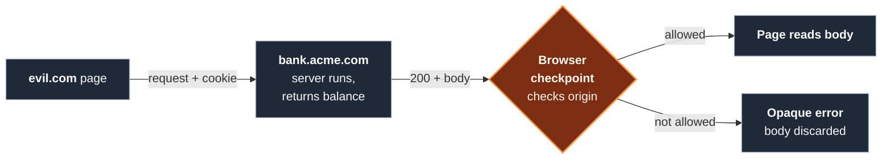

import Figure from '../../../components/figures/Figure.astro';
import Term from '../../../components/ui/Term.astro';
import VideoCallout from '../../../components/embeds/VideoCallout.astro';
import ExternalResource from '../../../components/ui/ExternalResource.astro';
import { CardGrid } from '@astrojs/starlight/components';
import Buckets from '../../../components/exercises/buckets/Buckets.astro';
import Bucket from '../../../components/exercises/buckets/Bucket.astro';
import Item from '../../../components/exercises/buckets/Item.astro';
import CourseProgressBar from '../../../components/ui/CourseProgressBar.astro';

<CourseProgressBar value={frontmatter['course-progress']} />

The browser attaches your credentials to every request automatically, without checking who asked.
Send a request to a host you have a session with and it carries your cookies, your HTTP basic auth, your <Term definition="A cert the browser presents to authenticate the user to a server, attached automatically like a cookie.">client certificate</Term>.
That convenience is also a risk.

Picture a user logged into `bank.acme.com`, their session cookie in the browser.
In another tab they open `evil.com`, reached from a search result.
A script there requests `https://bank.acme.com/balance`.
The browser attaches the session cookie, the bank's server sees a valid authenticated request and returns the balance, and the script ships it to an attacker.

The same-origin policy stops this.
This lesson covers what it blocks and what it lets through — narrower than most people assume — and why it protects the *user*, not the server, the distinction that keeps developers from shipping an endpoint an attacker can trigger.
CORS, the subject of the next lesson, is the protocol that loosens this boundary.

## Origin: scheme, host, and port, all three

An origin is the tuple **scheme, host, and port**. Two URLs share an origin only when all three match exactly; if any one differs, they are cross-origin.

Vary one part at a time and the match breaks:

- `https://app.acme.com` vs `https://api.acme.com`: **different origin**, the host differs.
- `https://app.acme.com` vs `http://app.acme.com`: **different origin**, the scheme differs.
- `https://app.acme.com` vs `https://app.acme.com:8443`: **different origin**, the port differs.

The default port collapses: `:443` for `https` and `:80` for `http` read as *no port at all*, so `https://app.acme.com` and `https://app.acme.com:443` are the **same** origin. Any non-default port, like the `:8443` above, is a real difference.

You don't compute this by hand. The `URL` object exposes the origin string through its read-only `origin`:

```ts
new URL('https://app.acme.com:8443/dashboard').origin; // 'https://app.acme.com:8443'
```

The path (`/dashboard`) fell away because it isn't part of the origin; the non-default port stayed because it is.

## Site: scheme plus the registrable domain

Origin is the strict boundary. **Site** is the looser one: the same idea, ignoring subdomains and ports.

A site is the tuple **`(scheme, eTLD+1)`**. The **effective top-level domain (eTLD)** is the suffix under which anyone can register a domain: `.com`, `.co.uk`, and, less obviously, `github.io`. The browser doesn't guess where that suffix ends; it reads the **Public Suffix List**, which ships with the browser and enumerates every eTLD. The **eTLD+1**, or **registrable domain**, is the eTLD plus the label in front of it: the shortest domain a single owner can buy.

- `app.acme.com`: the eTLD is `.com`, so the eTLD+1 is `acme.com`. The site is `acme.com`.
- `project.github.io`: the eTLD is `github.io`, not `.io`, because GitHub lets anyone register a subdomain under it. So the eTLD+1, and the site, is the whole `project.github.io`.

That second case breaks the shortcut everyone reaches for: "the site is the last two labels of the host." If it held, `a.github.io` and `b.github.io` would share a site and one could read the other's cookies — but they're unrelated users' projects. The Public Suffix List is the authority, not a label count.

Now the two boundaries come apart. `https://app.acme.com` and `https://api.acme.com` have different hosts, so **different origins**, but share a scheme and registrable domain (`acme.com`), so **same site** — the common case of app and API subdomains. Ports aren't part of a site either, so `https://app.acme.com` and `https://app.acme.com:8443` are the same site.

:::note
*Same-site is permissive: subdomains share it. Same-origin is strict: subdomains don't.* When you read a security rule, the first question is which boundary it keys on.
:::

Same-site is *schemeful*: the scheme counts, so `http://app.acme.com` and `https://app.acme.com` are **different sites**. This site boundary, not origin, is what `SameSite` cookies key on, the mechanism the next chapter builds on.

## Classify a URL pair: same origin and same site

You have both boundaries. Predict both columns of each row before your eye drifts right.

| URL pair | Same origin? | Same site? |
| --- | --- | --- |
| `https://app.acme.com` ↔ `https://app.acme.com/dashboard` | Yes, path is ignored | Yes |
| `https://app.acme.com` ↔ `https://api.acme.com` | No, host differs | Yes, same eTLD+1 |
| `https://app.acme.com` ↔ `http://app.acme.com` | No, scheme differs | No, scheme differs |
| `https://app.acme.com` ↔ `https://app.acme.com:8443` | No, port differs | Yes, port is ignored |
| `https://a.github.io` ↔ `https://b.github.io` | No, host differs | No, `github.io` is an eTLD |
| `https://acme.com` ↔ `https://acme.io` | No | No, different eTLD+1 |

The last two rows are the ones to study: subdomains of an eTLD are different sites, and a different registrable domain is a different site even when the brand name matches.

One rule from this table: **path and query never affect either judgment.** Only scheme, host, and port decide the origin; only scheme and registrable domain decide the site.

<VideoCallout videoId="517whoUlt-U" videoTitle="What is cross-site, same-site, cross-origin & same-origin">
  A three-minute recap from xplodivity walking the same two axes, including the schemeful same-site point.
</VideoCallout>

## What the policy blocks: the response read, not the request

:::note
**The browser sends the request and lets the response come back, but it refuses to let the cross-origin page read the response.**
:::

The order of events is the whole point. When the script on `evil.com` requests `https://bank.acme.com/balance`, the request leaves the browser, cookies for `bank.acme.com` attached (subject to a cookie rule the next chapter covers). The server receives it, runs its handler, and returns a `200` with the balance. None of that is blocked. Only *after* the response arrives does the browser step in: it checks the response's `Access-Control-Allow-Origin` header to decide whether the calling page may read it. If that header doesn't grant access to `evil.com`, the script gets an opaque error and zero bytes of the body. The server ran; the page never sees the result.

<Figure caption="The checkpoint sits on the return trip, after the server has run: a disallowed origin gets an opaque error instead of the body.">

</Figure>

A couple of lessons from now you'll watch this in the DevTools Network panel: the request sent, the response received, and yet your code sees an error.

## It protects the user, not the server

That timing decides who the policy protects. It guards the **confidentiality of the response**, stopping `evil.com` from *reading* `bank.acme.com/balance` on the user's behalf. It does **not** stop the request from being sent, so it does **not** protect the server from any *write* the request triggers.

Suppose a developer wires a delete to a `GET` because it was quick to test: `GET /account/delete?id=42`, assuming the policy guards it. It does not. An attacker puts this on any page the logged-in victim might visit:

```html

```

The browser sees an image to load, fires the `GET`, and attaches the victim's session cookie. The account is deleted, and **no CORS error appears**: the attacker only needed the request to *fire*, not to read the response. The policy blocked a read that never happened, and the account is gone anyway.

:::caution
The same-origin policy only blocks the *read*. A `GET` still fires, cookies attach, and any side effect runs. Never put a state change behind a `GET`.
:::

So **state-changing endpoints use `POST`, `PUT`, `PATCH`, or `DELETE`**, never `GET`. Two later mechanisms defend them. `SameSite` cookies (next chapter) stop the browser from attaching the session cookie to cross-site requests at all. CSRF tokens (later, with the auth surface) add a secret the attacker's page can't know. Both exist for exactly the exploit you just saw.

## What the policy always allows

The policy lets a surprising amount through, and misreading these carve-outs causes its own bugs. Each permits you to **navigate to or embed** a resource, not to **read** it.

- **Top-level navigation.** Clicking a cross-origin link, or submitting a `<form>` to a cross-origin action, navigates the whole page. The new page loads under *its own* origin's trust, so you've left the old page rather than read across a boundary.
- **Embedded subresources.** `<script src>`, `<link rel="stylesheet">`, ``, `<video>`, `<audio>`, and `<iframe>` load and run or render across origins, but the page **cannot read their internals**: a cross-origin script executes, yet your code can't read its source text.
- **Rendered media.** CSS, fonts, and images from another origin paint normally, but once you draw a cross-origin image onto a `<canvas>` it becomes "tainted," and reading its **pixel data** throws unless the image was served with the `crossorigin` opt-in.
- **Cross-origin form submissions.** `<form action="https://other.com/...">` posts just fine. This is the surface CSRF abuses.

**Loaded is not the same as readable.** The resource is allowed onto the page, but its contents stay sealed.

## Cross-window access across origins

Origins draw a boundary between two browser windows too.
A page can hold a reference to another window: `window.open()` returns a handle, and an `<iframe>` exposes its `contentWindow`.
Same-origin, the reference is fully live; cross-origin, the policy limits which properties cross.

That cross-origin surface is deliberately tiny:

- `postMessage`, to send a message across.
- `location`, *write-only*: you can set `location.href` to navigate the other window, but not read where it is.
- `close`, `closed`, `focus`, `blur`, the window lifecycle controls.
- Indexed frame access like `window[0]`, to reach a child frame by position.

**Everything else throws a `SecurityError`** — read `otherWindow.document` across origins and the browser refuses.
The one to name is `postMessage`: a controlled channel for two cooperating cross-origin windows to talk on purpose, the one legitimate doorway through an otherwise sealed wall. A later chapter covers its full model.

## The `Origin` header: how the server learns who's asking

The browser's checkpoint decides whether `evil.com` may read the bank's response, but how does the *server* get a say? It needs to know which origin is asking, and the browser tells it through a request header.

On any cross-origin request eligible for CORS, and on every request that isn't a plain `GET` or `HEAD`, the browser attaches an `Origin` header naming the calling page's origin:

```http
POST /balance HTTP/1.1
Host: bank.acme.com
Origin: https://app.acme.com
```

Your application never sets `Origin`; the browser owns it. That's why a server can't fully *trust* it: a browser sets it honestly, but a non-browser client like `curl` can put any string there. And it is only the *question*. **CORS is the protocol the server uses to answer it**, where the next lesson begins.

A same-origin `GET` carries no `Origin` header at all: there's no cross-origin decision to make, so when your app calls its own backend on the same origin, none of this machinery engages.

## Sort the scenarios

Every request falls into one of three buckets: the same-origin read, the cross-origin read (sent, but blocked unless the server opts in with CORS), and the carve-outs that are always allowed *because* they grant no read. Drag each scenario into the bucket that matches what the browser does.

<Buckets instructions="Decide what the browser does with each request or access below.">
  <Bucket name="read" label="Allowed, page can read it" description="Same-origin: request sent, response readable" />
  <Bucket name="blocked" label="Sent, but read blocked (needs CORS)" description="Cross-origin response read" />
  <Bucket name="embed" label="Always allowed (navigate or embed, no read)" description="Carve-outs that don't grant a read" />

  <Item bucket="read">An `app.acme.com` page fetches JSON from `app.acme.com/api/me`</Item>
  <Item bucket="read">An `app.acme.com` page reads its own `localStorage`</Item>
  <Item bucket="read">An `app.acme.com` page fetches JSON from `app.acme.com/api/invoices?status=paid`</Item>
  <Item bucket="blocked">An `app.acme.com` page fetches JSON from `api.other.com`</Item>
  <Item bucket="blocked">An `app.acme.com` page fetches JSON from `api.acme.com` (cross-origin, same site)</Item>
  <Item bucket="blocked">A page draws a cross-origin image to a `<canvas>`, then calls `getImageData()`</Item>
  <Item bucket="embed">A page embeds an `` from a CDN on another origin</Item>
  <Item bucket="embed">A page loads a web font from another origin</Item>
  <Item bucket="embed">A page submits a `<form>` to `bank.acme.com`</Item>
  <Item bucket="embed">The user clicks a link to another origin</Item>
  <Item bucket="embed">A page loads a `<script src>` from a cross-origin CDN</Item>
  <Item bucket="embed">A page embeds a cross-origin `<iframe>`</Item>
</Buckets>

In the third bucket, "always allowed" means the browser *loads* the resource, not that your code can read what came back: the image renders but its pixels stay locked, the form submits but you can't read the response. The carve-outs are doorways for resources to come *in*, never windows for your code to read *out*.

<ExternalResource
  href="https://developer.mozilla.org/en-US/docs/Web/Security/Same-origin_policy"
  title="Same-origin policy"
  description="MDN's reference for the same-origin policy — the boundaries, what's gated, and what's allowed."
/>

The next lesson is the server's answer: CORS, the protocol that decides header by header which cross-origin reads to permit.

## External resources

<CardGrid>
  <ExternalResource
    title='"Same-site" and "same-origin"'
    href="https://web.dev/articles/same-site-same-origin"
    icon="simple-icons:googlechrome"
    iconColor="#4285F4"
    description="web.dev's tight walkthrough of the origin vs site distinction, including the schemeful update this lesson insists on."
  />
  <ExternalResource
    title="The Public Suffix List"
    href="https://publicsuffix.org/list/"
    icon="lucide:list-tree"
    iconColor="#E37933"
    description="The authority itself — browse the live list of eTLDs that decides where a registrable domain begins."
  />
  <ExternalResource
    title="What is CSRF?"
    href="https://portswigger.net/web-security/csrf"
    icon="simple-icons:portswigger"
    iconColor="#FF6633"
    description="PortSwigger's canonical write-up of the exact GET-side-effect exploit this lesson previews, with hands-on labs."
  />
</CardGrid>
