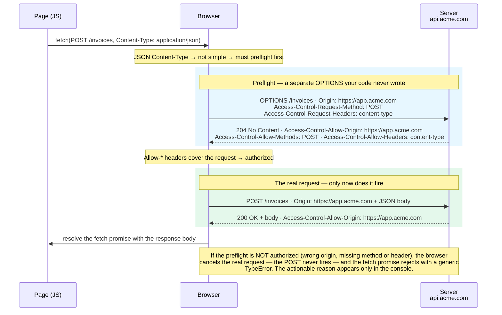

import Figure from '../../../components/figures/Figure.astro';
import DiagramSequence from '../../../components/figures/diagram-sequence/DiagramSequence.astro';
import DiagramStep from '../../../components/figures/diagram-sequence/DiagramStep.astro';
import CodeVariants from '../../../components/code/code-variants/CodeVariants.astro';
import CodeVariant from '../../../components/code/code-variants/CodeVariant.astro';
import Matching from '../../../components/exercises/matching/Matching.astro';
import Pair from '../../../components/exercises/matching/Pair.astro';
import TrueFalse from '../../../components/exercises/true-false/TrueFalse.astro';
import Statement from '../../../components/exercises/true-false/Statement.astro';
import TfWhy from '../../../components/exercises/true-false/TfWhy.astro';
import Term from '../../../components/ui/Term.astro';
import ExternalResource from '../../../components/ui/ExternalResource.astro';
import VideoCallout from '../../../components/embeds/VideoCallout.astro';
import PreflightWaterfall from '../../../components/lessons/012/3/PreflightWaterfall.astro';
import { CardGrid, Card } from '@astrojs/starlight/components';
import CourseProgressBar from '../../../components/ui/CourseProgressBar.astro';

<CourseProgressBar value={frontmatter['course-progress']} />

The last lesson left an open question. The same-origin policy doesn't stop a cross-origin request from being sent: the browser sends it and lets the response come back, but refuses to let the page read that response. On the way out it attaches an `Origin` header that asks the server, on the page's behalf, who is calling? This lesson is the answer.

That answer is <Term definition={"Cross-Origin Resource Sharing.\nA set of HTTP response headers a server sends to tell the browser which other origins may read a response."}>CORS</Term>, the protocol a server uses to say which origins may read a response. By the end you'll be able to look at any `fetch` and predict whether it triggers a second hidden request, name the four headers a production server sends, avoid the most common CORS bug, and read the red console error well enough to know which header to fix.

One thing up front: a same-origin app calling its own backend, such as your web app fetching from the domain it was served from, uses none of CORS. No headers, no preflight, nothing. CORS engages only when a request crosses origins, to an API subdomain, a third-party API, a browser extension, or another site calling your app.

## CORS is enforced by the browser, configured on the server

The browser is the enforcer: it blocks the read when the rules aren't met. The server is the authority: it decides, header by header, which origins are allowed and what they may do. The `Access-Control-*` response headers are the contract between them. Your client `fetch` never sets one, because those are response headers, and the client sends requests, not responses.

This is why a CORS error tempts people to the wrong file. It surfaces in the browser console, on the client, but it is only the browser reporting that the server's answer fell short. The fix is always on the server.

:::caution[CORS lives on the server]
The client can't grant itself permission to read a cross-origin response; only the server can, by sending the right headers. When you see a CORS error, inspect the server's response headers first, not the `fetch` call.
:::

CORS comes in two shapes, and the rest of the lesson turns on the difference. In a <Term definition={"A cross-origin request that meets the CORS-safelisted criteria. The browser sends it directly, then checks the response headers before letting the page read the body."}>simple request</Term>, the browser sends the request straight away, then checks the response headers to decide whether the page may read the body. In a <Term definition={"A permission-check OPTIONS request the browser sends before the real one, asking the server to authorize the method and headers in advance."}>preflighted request</Term>, it asks permission first: it sends a separate `OPTIONS` request, waits for the server to authorize the real request's method and headers, and only then sends the real one. The next two sections take each in turn.

## Which requests preflight

A request is "simple" and goes out directly only when every row below holds at once. Break any one and the browser preflights.

| Dimension | Simple (no preflight) | Anything else preflights |
| --- | --- | --- |
| Method | `GET`, `HEAD`, `POST` | `PUT`, `PATCH`, `DELETE`, … |
| Headers | only CORS-safelisted: `Accept`, `Accept-Language`, `Content-Language`, `Content-Type`, `Range` | any other header (e.g. `Authorization`) |
| `Content-Type` | `application/x-www-form-urlencoded`, `multipart/form-data`, `text/plain` | `application/json`, anything else |

The table collapses into one rule that covers nearly every request your app makes:

:::tip[The one rule that matters]
Any `fetch` sending `Content-Type: application/json` preflights, and that's almost every API call your UI makes. Treat **"JSON API calls always preflight"** as the working reality.
:::

`application/json` is not safelisted: the only simple `Content-Type` values are the three a plain HTML `<form>` can produce, so sending JSON triggers a preflight. An `Authorization` header does the same, since it isn't safelisted either. Between JSON bodies and auth tokens, that covers the entire authenticated API surface of a typical app.

What stays simple is the embed-style web: a `<form>` POST sending `multipart/form-data`, or an image beacon firing a `GET`. For anything your app does deliberately with `fetch`, assume preflight.

For each statement, decide whether the request preflights.

<TrueFalse instructions="For each fetch, decide whether the browser preflights it. (Assume each is cross-origin.)">
  <Statement answer="false">
    A `GET` request with no custom headers and no body does **not** preflight.
    <TfWhy>`GET` is a simple method and there are no non-safelisted headers, so it qualifies as a simple request. The browser sends it directly and checks the response headers afterward.</TfWhy>
  </Statement>

  <Statement answer="true">
    A `POST` request with `Content-Type: application/json` preflights.
    <TfWhy>`application/json` is not a CORS-safelisted content type, so the request leaves the simple set and the browser sends an `OPTIONS` first. This is nearly every API call your UI makes.</TfWhy>
  </Statement>

  <Statement answer="true">
    A `GET` request carrying an `Authorization: Bearer …` header preflights.
    <TfWhy>The method is simple, but `Authorization` is not a safelisted header. Any non-safelisted header forces a preflight, so token-bearing calls always preflight too.</TfWhy>
  </Statement>
</TrueFalse>

## The preflight round trip, step by step

Your JSON `POST` preflights: before the real request goes out, the browser runs a permission check your JavaScript never sees.

<Figure caption="One fetch, two round trips. The browser runs a preflight OPTIONS and sends your real POST only once the Access-Control-Allow-* headers authorize it; if they don't, the POST never fires.">

</Figure>

The `OPTIONS`/`204` pair in the blue band is the preflight: a separate request your code never wrote and never sees, in which the browser previews what it's about to do. `Access-Control-Request-Method` announces the method, `Access-Control-Request-Headers` lists the non-safelisted headers, and the server replies with the matching `Access-Control-Allow-*` headers. Only when that reply covers the request does the browser send the real `POST` in the green band.

The failure case is where people get stuck. If the preflight response doesn't authorize the request, the browser **cancels the real request before sending it**: the server never sees your `POST`, and your `fetch` promise rejects with a generic, unhelpful `TypeError`. The real reason prints separately, in red, in the console, which the next section teaches you to read.

The preflight is a **real, separate network request**, not a metaphor. Open the Network panel and you'll see two rows: an `OPTIONS`, then your `POST`.

<DiagramSequence>
  <DiagramStep caption="Your code calls fetch. DevTools shows one row: the preflight OPTIONS, still pending.">
    <PreflightWaterfall step={1} />
  </DiagramStep>

  <DiagramStep caption="The server answers the preflight with 204 and the Access-Control-Allow-* headers. The OPTIONS resolves.">
    <PreflightWaterfall step={2} />
  </DiagramStep>

  <DiagramStep caption="The headers authorized the request, so the browser fires the real POST. A second row appears.">
    <PreflightWaterfall step={3} />
  </DiagramStep>

  <DiagramStep caption="The POST returns 200 with the body. Two rows for one fetch call: the preflight made visible.">
    <PreflightWaterfall step={4} />
  </DiagramStep>
</DiagramSequence>

Once you've seen those two rows, debugging a cross-origin call starts with one question: which row failed, the `OPTIONS` or the real one? That alone narrows the bug down fast.

<VideoCallout videoId="PNtFSVU-YTI" videoTitle="Learn CORS In 6 Minutes — Web Dev Simplified">
  Web Dev Simplified walks the same path live: the missing `Access-Control-Allow-Origin` error, the `OPTIONS` preflight firing on a `PUT`, and the credentials header.
</VideoCallout>

## The CORS response headers a server sends

To let a cross-origin page read a response, a production server sends up to four `Access-Control-*` response headers. Each one prevents a specific failure when it's present.

| Header | What it does / failure mode | Example |
| --- | --- | --- |
| `Access-Control-Allow-Origin` | Names which origin may read the response. **Missing →** the browser blocks the read with the canonical *"No 'Access-Control-Allow-Origin' header"* error. | `https://app.acme.com` (the exact origin, echoed back; `*` works only without credentials, as the trap below explains) |
| `Access-Control-Allow-Methods` | *(preflight only)* Lists the methods the real request may use. **Missing →** a `PUT`, `PATCH`, or `DELETE` is rejected at the preflight. | `GET, POST, PUT, DELETE, PATCH` |
| `Access-Control-Allow-Headers` | *(preflight only)* Lists the headers the real request may send. **Missing →** any non-safelisted header trips the preflight, including a JSON `Content-Type` or an `Authorization` token. | `content-type, authorization` |
| `Access-Control-Allow-Credentials` | Makes the response readable when the request carries credentials; pairs with the client's `credentials: 'include'`. **Missing →** cookies and auth aren't usable, and the credentialed response is blocked. | `true` |

Two more headers matter less often:

- `Access-Control-Max-Age: 86400` caches the preflight result so the browser stops sending an `OPTIONS` before every call; without it, every JSON request pays for two round trips. **Chrome caps this at 7200 seconds (2 hours) and Firefox at 86400 (24 hours)**; any larger value is silently clamped.
- `Access-Control-Expose-Headers: X-Total-Count, X-Page` lets your JavaScript read response headers outside the default set (`Cache-Control`, `Content-Language`, `Content-Type`, `Expires`, `Last-Modified`, `Pragma`). The classic case is pagination: you return the total in `X-Total-Count`, and without exposing that header the browser hides it from your code even though it arrived.

## Wildcard origins are illegal with credentials

This is the most common production CORS bug.

`Access-Control-Allow-Origin: *` is legal **only** when the request is not credentialed. A <Term definition={"A cross-origin request that carries the user's cookies because the client set credentials: 'include'."}>credentialed request</Term> is one where the client set `credentials: 'include'`, telling the browser to attach the user's cookies. Answer one with `*` and the browser refuses the response: *"...the value of the 'Access-Control-Allow-Origin' header in the response must not be the wildcard '\*' when the request's credentials mode is 'include'."*

`*` means anyone, and letting anyone read a response carrying the user's cookies would hand every site the keys to that session. The fix is to drop the wildcard and name the caller exactly.

<CodeVariants>
  <CodeVariant label="Broken" icon="error">
    <div data-mark-color="red">

    ```ts title="app/api/invoices/route.ts" del={5}
    export const GET = async (req: Request) => {
      const invoices = await listInvoices();
      return Response.json(invoices, {
        headers: {
          'Access-Control-Allow-Origin': '*',
          'Access-Control-Allow-Credentials': 'true',
        },
      });
    };
    ```

    </div>
    **Blocked the moment the client sends `credentials: 'include'`.** Wildcard plus credentials is the one combination the browser refuses.
  </CodeVariant>

  <CodeVariant label="Fixed" icon="approve-check">
    <div data-mark-color="green">

    ```ts title="app/api/invoices/route.ts" ins={1,4-5,10,12}
    const allowedOrigins = new Set(['https://app.acme.com']);

    export const GET = async (req: Request) => {
      const origin = req.headers.get('Origin');
      const allowOrigin = origin && allowedOrigins.has(origin) ? origin : '';

      const invoices = await listInvoices();
      return Response.json(invoices, {
        headers: {
          'Access-Control-Allow-Origin': allowOrigin,
          'Access-Control-Allow-Credentials': 'true',
          Vary: 'Origin',
        },
      });
    };
    ```

    </div>
    **Check the incoming `Origin` against an allow-list, then echo the exact value back.** Naming the origin is legal alongside credentials. The `Vary: Origin` line is mandatory, as explained below.
  </CodeVariant>
</CodeVariants>

:::caution[Echo the origin? Then `Vary: Origin`.]
Once you echo the origin back, the response depends on the request's `Origin`, so you must send `Vary: Origin`. That keys the response by origin in every cache between your server and the user. Skip it, and a response cached for `app.acme.com` can be served to `other.com`, whose origin it doesn't name, so the browser rejects it. The bug is intermittent: everything works until a cache warms up, hard to reproduce. The rule is mechanical: **echo the origin, always send `Vary: Origin`.**
:::

## The three fetch options that touch CORS

Almost everything in CORS lives on the server. Your code never sets an `Access-Control-*` header; these three `fetch` options are the only client-side controls that touch CORS, and each defaults to the right pick for a first-party app.

| Option | Default | What to know |
| --- | --- | --- |
| `mode` | `'cors'` | The only useful value for cross-origin. `'same-origin'` rejects cross-origin requests outright; `'no-cors'` sends the request but hands you an **opaque** response you can't read. |
| `credentials` | `'same-origin'` | Cookies attach only on same-origin requests. `'include'` attaches them cross-origin too, and *requires* `Access-Control-Allow-Credentials: true` on the server. `'omit'` never attaches. |
| `Origin` header | (browser-set) | The browser writes it automatically; your code can never set or forge it. A server can *validate* it but can't *trust* it, since `curl` or a script can send any `Origin` it likes. |

## Reading the CORS error in the console

When a cross-origin call fails the CORS check, your `fetch` promise rejects with `TypeError: Failed to fetch`: no origin, no header, no clue. The browser prints the real reason as a separate red message in the console, not in the error your code catches.

Reading that red string is the skill. There are only a handful of canonical messages, and each maps to a fix from this lesson.

<Matching instructions="Each red console string points at one server-side fix. Match the error to the change that resolves it.">
  <Pair>
    <Fragment slot="left">No `Access-Control-Allow-Origin` header is present on the requested resource.</Fragment>
    <Fragment slot="right">The server didn't send the header at all — add `Access-Control-Allow-Origin` in the route handler.</Fragment>
  </Pair>
  <Pair>
    <Fragment slot="left">…must not be the wildcard `'*'` when the request's credentials mode is `'include'`.</Fragment>
    <Fragment slot="right">The wildcard-with-credentials trap — validate and echo the exact origin, and add `Vary: Origin`.</Fragment>
  </Pair>
  <Pair>
    <Fragment slot="left">Response to preflight request doesn't pass access control check: It does not have HTTP ok status.</Fragment>
    <Fragment slot="right">The `OPTIONS` handler returned a non-2xx status — return `204` with the CORS headers.</Fragment>
  </Pair>
  <Pair>
    <Fragment slot="left">Request header field `authorization` is not allowed by `Access-Control-Allow-Headers` in preflight response.</Fragment>
    <Fragment slot="right">Add `authorization` (or whichever header is named) to `Access-Control-Allow-Headers`.</Fragment>
  </Pair>
</Matching>

Going from symptom to fix is most of the debugging in production. Every fix is a server change, made where you meet the error: the console.

## The Next.js per-route CORS pattern

You won't write a Next.js backend until Unit 4, so read this to recognize the shape, not to build it.

The pattern keeps the allow-list next to the route it guards, in two files: a `lib/cors.ts` that holds the policy, and the <Term definition={"A Next.js file at app/api/.../route.ts that responds to HTTP requests by exporting one function per method (GET, POST, OPTIONS, …)."}>Route Handler</Term> that uses it.

<CodeVariants maxLines={0}>
  <CodeVariant label="lib/cors.ts" icon="seti:typescript">
    ```ts title="lib/cors.ts"
    const allowedOrigins = new Set(['https://app.acme.com']);

    export const corsHeaders = (origin: string | null): HeadersInit => {
      const allowOrigin = origin && allowedOrigins.has(origin) ? origin : '';
      return {
        'Access-Control-Allow-Origin': allowOrigin,
        'Access-Control-Allow-Methods': 'GET, POST, OPTIONS',
        'Access-Control-Allow-Headers': 'content-type, authorization',
        'Access-Control-Allow-Credentials': 'true',
        'Access-Control-Max-Age': '7200',
        Vary: 'Origin',
      };
    };
    ```
    **The policy in one place.** Check the origin against the allow-list, echo it back, and pack the four headers plus `Vary: Origin` and a modest `Max-Age`. Every route that needs CORS reads from this function.
  </CodeVariant>

  <CodeVariant label="app/api/invoices/route.ts" icon="seti:typescript">
    ```ts title="app/api/invoices/route.ts"
    import { corsHeaders } from '@/lib/cors';

    export const OPTIONS = (req: Request) =>
      new Response(null, {
        status: 204,
        headers: corsHeaders(req.headers.get('Origin')),
      });

    export const GET = async (req: Request) => {
      const invoices = await listInvoices();
      return Response.json(invoices, {
        headers: corsHeaders(req.headers.get('Origin')),
      });
    };
    ```
    **One named export per method.** A `route.ts` dispatches by HTTP method through its exports: `OPTIONS` answers the preflight, `GET` answers the real request. Both pull the same headers from the helper.
  </CodeVariant>
</CodeVariants>

Two things to lock in from that handler.

First, **the `OPTIONS` export *is* the preflight handler.** When the browser's preflight arrives, it answers `204` with an empty body and the four headers. Forget to export `OPTIONS`, or return a non-2xx, and you get canonical error #3, *"Response to preflight request... does not have HTTP ok status."*

Second, **the allow-list lives per-route, not app-wide.** Next.js can set headers globally in `next.config.ts`, but which origins may read invoices is a property of the invoices route, not the whole app, so the policy belongs next to that route.

:::note
This handler is deliberately bare. A production Route Handler also wraps an auth check, validates input, and returns structured errors. Stripping that out keeps the CORS signal clear, and the headers shown here slot into the fuller shape unchanged.
:::

## When CORS doesn't apply

CORS only enters the picture when a browser makes a cross-origin request and wants to read the response. Many common situations don't meet that bar, and mistaking one for a CORS problem sends you debugging the wrong layer.

<CardGrid>
  <Card title="Same-origin app → its own backend" icon="approve-check">
    No CORS, no headers, nothing. Your web app fetching from the domain that served it is same-origin, the monolith default and this course's normal case.
  </Card>
  <Card title="API subdomain" icon="puzzle">
    `app.acme.com` calling `api.acme.com` is cross-origin (different host) but **same-site** (same registrable domain). CORS *is* required, yet `SameSite=Lax` cookies still travel, because the site matches.
  </Card>
  <Card title="Server-to-server fetch" icon="server">
    A Next.js Route Handler or Server Action calling a third-party API has **no browser, no `Origin` header, and no CORS check at all.** This is the escape hatch: when a third party ships no CORS, fetch it from your server, not the client.
  </Card>
  <Card title="Reverse proxy / rewrites" icon="random">
    A Next.js `rewrites()` rule exposes a third party under your own origin, so the call turns same-origin and CORS disappears, at the cost of a network hop. Reach for this when a full server proxy is overkill.
  </Card>
  <Card title="Browser extension / null origin" icon="warning">
    Content scripts send `Origin: null`. With no exact origin to echo, you must decide deliberately whether to allow-list `null` or refuse it.
  </Card>
</CardGrid>

## Going deeper

The full set of headers and the exact error strings are reference material, and MDN is the canonical source for both.

<CardGrid>
  <ExternalResource
    title="Cross-Origin Resource Sharing (CORS)"
    href="https://developer.mozilla.org/en-US/docs/Web/HTTP/CORS"
    icon="simple-icons:mdnwebdocs"
    description="The full header reference, the simple-request criteria, and every error string verbatim."
  />
  <ExternalResource
    title="MDN — Preflighted requests"
    href="https://developer.mozilla.org/en-US/docs/Web/HTTP/CORS#preflighted_requests"
    icon="simple-icons:mdnwebdocs"
    description="The OPTIONS preflight on the wire: the Access-Control-Request-* headers the browser sends and the Access-Control-Allow-* answer that authorizes the real request."
  />
  <ExternalResource
    title="Fetch Standard — CORS protocol"
    href="https://fetch.spec.whatwg.org/#http-cors-protocol"
    icon="lucide:scroll-text"
    description="The spec-precise definition of preflighting and the safelist, for the reader who wants the source of truth."
  />
  <ExternalResource
    title="CS Visualized: CORS"
    href="https://dev.to/lydiahallie/cs-visualized-cors-5b8h"
    icon="simple-icons:devdotto"
    iconColor="#FFFFFF"
    description="Lydia Hallie animates the whole flow frame by frame: simple vs. preflighted requests, the Origin question, and the Access-Control-* answer."
  />
  <ExternalResource
    title="CORS Tester — simulate a request"
    href="https://corsfix.com/tools/cors-tester"
    icon="lucide:flask-conical"
    iconColor="#38BDF8"
    description="Point it at any URL, pick a method and origin, and watch the preflight and Access-Control-* headers come back: the diagram made interactive."
  />
</CardGrid>
