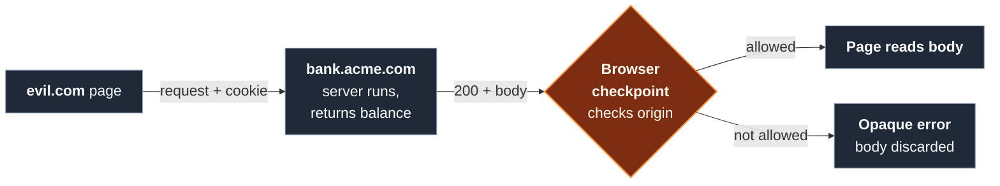

import Figure from '../../../components/figures/Figure.astro';
import Term from '../../../components/ui/Term.astro';
import VideoCallout from '../../../components/embeds/VideoCallout.astro';
import ExternalResource from '../../../components/ui/ExternalResource.astro';
import { CardGrid } from '@astrojs/starlight/components';
import Buckets from '../../../components/exercises/buckets/Buckets.astro';
import Bucket from '../../../components/exercises/buckets/Bucket.astro';
import Item from '../../../components/exercises/buckets/Item.astro';
import CourseProgressBar from '../../../components/ui/CourseProgressBar.astro';

<CourseProgressBar value={frontmatter['course-progress']} />

The browser does something for you, automatically, that you never wrote a line of code to ask for: every time it sends a request to a host you have a session with, it attaches your credentials for that host — your cookies, your HTTP basic auth, your <Term definition="A cert the browser presents to authenticate the user to a server, attached automatically like a cookie.">client certificate</Term> — without checking who told it to make the request. That convenience is also a loaded gun, and it's worth feeling the danger before you meet the rule that defuses it.

Picture a user logged into `bank.acme.com`. Their session cookie is sitting in the browser. In another tab they open `evil.com` — a page they have no relationship with, that they landed on from a search result. A script on that page issues a request to `https://bank.acme.com/balance`. The browser sees a request to `bank.acme.com`, finds the session cookie for that host, and dutifully attaches it. The bank's server has no way to know the request originated from `evil.com`; it sees a valid, authenticated request and returns the balance. Without a rule, the script on `evil.com` now reads that balance and ships it to an attacker.

The rule is the <Term definition="The browser's default trust boundary. A page may freely talk to its own origin; cross-origin responses are sent but cannot be read by the calling page unless the responder opts in.">same-origin policy</Term>, and it's the most important security boundary the browser enforces. By the end of this lesson you'll be able to do three things on reflex. First, classify any two URLs as same or cross origin, and same or cross site, in seconds. Second, state precisely what the policy blocks and what it lets through — because it's narrower than most people assume. Third, explain why it protects the *user*, not the server, which is the single fact that prevents the most expensive mistake in this entire topic.

One piece of vocabulary carries over from the previous lesson and makes everything here reliable: `new URL()` lowercases the hostname and drops the default port. That normalization is exactly why comparing origins works — two URLs for the same server collapse to the same `origin` string instead of differing on a stray capital letter or a redundant `:443`. This origin-as-trust-boundary idea is also the anchor the rest of the unit hangs off: cookies lean on it in the next chapter, and CORS — the next lesson — is the protocol that loosens it.

## Origin: scheme, host, and port, all three

An <Term definition="The tuple (scheme, host, port). All three must match exactly for two URLs to share an origin.">origin</Term> is a tuple of three parts: **scheme, host, and port**. Two URLs share an origin only when all three match exactly. Miss on any one and they're cross-origin, full stop.

The cleanest way to internalize a compound key is to vary one part at a time and watch it break the match. Same scheme, same port, different host:

- `https://app.acme.com` vs `https://api.acme.com` — **different origin** (the host differs).

Same host, same port, different scheme:

- `https://app.acme.com` vs `http://app.acme.com` — **different origin** (the scheme differs).

Same scheme, same host, different port:

- `https://app.acme.com` vs `https://app.acme.com:8443` — **different origin** (the port differs).

That last pair has a wrinkle, and it's where the previous lesson's normalization pays off. The default port collapses: `:443` for `https` and `:80` for `http` read as *no port at all*. So `https://app.acme.com` and `https://app.acme.com:443` are the **same** origin — the `:443` is redundant and the parser drops it. But any *non-default* port, like the `:8443` above, is a real difference and a different origin.

You don't compute this by hand in real code. The `URL` object hands you the origin string directly through its read-only `origin` property — you met that property as anatomy in the previous lesson; here it gets its meaning.

```ts
new URL('https://app.acme.com:8443/dashboard').origin; // 'https://app.acme.com:8443'
```

Read that result against the tuple: the path (`/dashboard`) fell away because it's not part of the origin, and the non-default port stayed because it is.

## Site: scheme plus the registrable domain

Origin is the strict boundary. There's a second, looser one — **site** — and the easiest way to learn it is as origin's more permissive cousin: same parts, but it stops caring about subdomains and ports.

A site is the tuple **`(scheme, eTLD+1)`**. The scheme part you already know. The other part needs one concept. The <Term definition="Effective top-level domain — the suffix under which the public can register names, e.g. .com, .co.uk, github.io.">effective top-level domain (eTLD)</Term> is the suffix under which anyone can register their own domain — `.com` is the obvious one, but so is `.co.uk`, and so, less obviously, is `github.io`. The browser doesn't guess where that suffix ends; it reads from the <Term definition="A browser-maintained list of all effective top-level domains — the authority for where a registrable domain begins.">Public Suffix List</Term>, a list shipped with the browser that enumerates every eTLD. The **eTLD+1** — the eTLD plus the one label in front of it — is the <Term definition="eTLD+1 — the shortest domain a single owner can register. The unit a site is keyed on.">registrable domain</Term>: the shortest domain a single owner can actually buy.

Two worked examples make the difference concrete:

- `app.acme.com` — the eTLD is `.com`, so the eTLD+1 is `acme.com`. The site is `acme.com`.
- `project.github.io` — here the eTLD is `github.io`, not `.io`. GitHub lets anyone register a subdomain under `github.io`, so it's on the Public Suffix List as an eTLD. That makes the eTLD+1 `project.github.io`, and the site is `project.github.io` — the whole thing.

The `github.io` example is the one to hold onto, because it kills the oversimplification everyone reaches for: "the site is just the last two labels of the host." If that were true, `a.github.io` and `b.github.io` would share the site `github.io` — and they emphatically do not. They're two unrelated users' projects, and treating them as the same site would let one read the other's cookies. The Public Suffix List is the authority, not a label-counting heuristic.

Now the payoff. Compare `https://app.acme.com` and `https://api.acme.com`. Their hosts differ, so they're **different origins**. But they share a scheme (`https`) and a registrable domain (`acme.com`), so they're the **same site**. A company's app subdomain and API subdomain are cross-origin but same-site — that combination is extremely common and worth recognizing instantly. Ports, by the way, are *not* part of a site at all; `https://app.acme.com` and `https://app.acme.com:8443` are the same site even though they're different origins.

:::note
**The two boundaries.** *Same-site is permissive — subdomains share it. Same-origin is strict — subdomains don't.* When you read a security rule, the first question is always which of these two boundaries it keys on.
:::

One detail to get right for 2026: same-site is *schemeful*, meaning the scheme is part of the comparison. `http://app.acme.com` and `https://app.acme.com` are **different sites**, not just different origins. (You may run into older material that treats site as scheme-blind — that model is retired; don't carry it.) This site boundary, not origin, is what `SameSite` cookies key on — a mechanism the next chapter leans on heavily, so the distinction you're drawing now is an investment that pays off there.

## Classify any pair: same origin, same site

You now have both boundaries. The reflex an experienced engineer has is to take any two URLs and classify them on both axes in about five seconds — so before any policy text, let's build that muscle. Read each row below and predict both columns before your eye drifts right.

| URL pair | Same origin? | Same site? |
| --- | --- | --- |
| `https://app.acme.com` ↔ `https://app.acme.com/dashboard` | Yes — path is ignored | Yes |
| `https://app.acme.com` ↔ `https://api.acme.com` | No — host differs | Yes — same eTLD+1 |
| `https://app.acme.com` ↔ `http://app.acme.com` | No — scheme differs | No — scheme differs |
| `https://app.acme.com` ↔ `https://app.acme.com:8443` | No — port differs | Yes — port is ignored |
| `https://a.github.io` ↔ `https://b.github.io` | No — host differs | No — `github.io` is an eTLD |
| `https://acme.com` ↔ `https://acme.io` | No | No — different eTLD+1 |

The first four rows exercise each axis cleanly. The last two are the discriminators — they separate someone who memorized "subdomains mean same site" from someone who actually understands the Public Suffix List. The `github.io` row breaks the subdomain shortcut; the `acme.com` vs `acme.io` row shows that a different registrable domain is a different site even when the brand name is identical.

The thing to carry out of this table: **path and query never affect either judgment.** Only scheme, host, and port decide the origin; only scheme and registrable domain decide the site. Everything to the right of the host is invisible to both.

<VideoCallout videoId="517whoUlt-U" videoTitle="What is cross-site, same-site, cross-origin & same-origin">
  A three-minute recap from xplodivity that runs the same two axes you just built — including the schemeful same-site point this lesson insists on.
</VideoCallout>

## What the policy blocks: the response read, not the request

Here's the sentence the whole topic turns on. Read it slowly, then read it again.

:::note
**The browser sends the request and lets the response come back, but it refuses to let the cross-origin page read the response.**
:::

Almost every misconception in this area dissolves the moment that sentence is internalized. The request *flies*. Only the *read* is gated. Walk the mechanism step by step, because the order of events is the entire point.

When the script on `evil.com` requests `https://bank.acme.com/balance`, the request *does* leave the browser. The cookies for `bank.acme.com` *are* attached (subject to a cookie rule the next chapter owns). The bank's server *does* receive it, *does* run its handler, and *does* return a `200` with the balance in the body. None of that is blocked. Only *after* the response arrives does the browser interpose: it checks the response's `Access-Control-Allow-Origin` header — named here, taught fully in the next lesson — to decide whether the page that made the call is allowed to read what came back. If the header doesn't grant access to `evil.com`, the browser hands the calling script an opaque error and zero bytes of the body. The server ran; the page just never gets to see the result.

The following diagram makes the timing visible. Trace the request all the way across to the server, watch the server do its work, and notice that the gate sits on the *return* trip — after everything has already happened.

<Figure caption="The browser sends the request and lets the response come back, but it refuses to let the cross-origin page read the response. The checkpoint is on the return trip, after the server has already run.">

</Figure>

That checkpoint node is where, in a couple of lessons, you'll watch a real request sit in the DevTools Network panel: the request shows as sent, the server's response shows as received, and yet your code sees an error. This diagram is why — the bytes came back, the browser just refused to hand them over.

## It protects the user, not the server

Now the implication, and it's the load-bearing one. The same-origin policy protects the **confidentiality of the response from the user's point of view** — it stops `evil.com` from *reading* `bank.acme.com/balance` on the user's behalf. That's the whole of what it does. It does **not** stop the request from being sent, which means it does **not** protect the server from any *write* the request triggers.

Sit with that, because it's where real money gets lost. Suppose a developer builds an endpoint like `GET /account/delete?id=42` — a delete, wired to a `GET` because it was quick and the link was easy to test. They assume the same-origin policy guards it; after all, the browser blocks cross-origin reads, so surely it blocks this too. It does not. An attacker puts this on any page the logged-in victim might visit:

```html

```

The browser sees an image to load, fires the `GET`, and attaches the victim's session cookie — exactly as it would for any request to that host. The account is deleted. And here's the part that makes it lethal: **no CORS error ever appears in the victim's console**, because the attacker never needed to read the response. They only needed the request to *fire*. The same-origin policy did its job perfectly — it would have blocked a read — and the account is gone anyway.

:::caution
A `GET` is not protected by the same-origin policy. The request fires, cookies attach, and any side effect runs — the policy only ever blocked the *read*. Never put a state change behind a `GET`.
:::

The senior rule that follows: **state-changing endpoints use `POST`, `PUT`, `PATCH`, or `DELETE`**, never `GET`, and they're defended by two mechanisms this lesson only names. `SameSite` cookies (the next chapter) stop the browser from attaching the session cookie to cross-site requests in the first place. CSRF tokens (much later, when you build the auth surface) add a secret the attacker's page can't know. Both are forward links, not today's material — but the *why* behind them is exactly the exploit you just saw.

## What the policy always allows

So far the story has been about what's blocked. The flip side matters just as much, because the policy lets a surprising amount through — and misreading those carve-outs is its own bug class. The framing to hold before you read the list: **these are permissions to navigate to or embed a resource, not permissions to read it.** They predate the same-origin policy — the early web was built on freely embedding things across origins — and they survive for compatibility.

- **Top-level navigation.** Clicking a cross-origin link, or submitting a `<form>` to a cross-origin action, navigates the whole page. The new page loads under *its own* origin's trust — you've left, you're not reading across a boundary.
- **Embedded subresources.** `<script src>`, `<link rel="stylesheet">`, ``, `<video>`, `<audio>`, `<iframe>` all load and run or render across origins. But the page generally **cannot read their internals** — a cross-origin script executes, yet your code can't read its source text.
- **Rendered media.** CSS, fonts, and images from another origin paint normally. But JavaScript **cannot read the pixel data** of a `<canvas>` once you've drawn a cross-origin image onto it — the canvas becomes "tainted," and reading it throws unless the image was served with a CORS opt-in (the `crossorigin` attribute, named here only).
- **Cross-origin form submissions.** `<form action="https://other.com/...">` posts just fine. This is precisely the surface CSRF abuses — and precisely what `SameSite` and CSRF tokens defend.

The line to carry away, because it's the one that prevents over-trust: **loaded is not the same as readable.** A cross-origin script *executing* on your page is not your page *reading its source*. An image *rendering* is not your code *reading its bytes*. The resource is allowed onto the page; its contents stay sealed.

## Two windows, one narrow doorway

There's one more place origins draw a boundary, and it surprises people the first time they hit it: between two browser windows. A page can hold a reference to another window's object — `window.open()` hands back a window handle, and an `<iframe>` exposes its `contentWindow`. If the two are same-origin, the reference is fully live; you can reach across and read whatever you like. If they're cross-origin, the same-origin policy clamps down on which properties cross.

The cross-origin-accessible surface is deliberately tiny:

- `postMessage` — to send a message across.
- `location` — *write-only*: you may set `location.href` or call `location.replace()` to navigate the other window, but you can't read where it currently is.
- `close`, `closed`, `focus`, `blur` — window lifecycle controls.
- Indexed frame access like `window[0]` — to reach a child frame by position.

**Everything else throws a `SecurityError`.** Reach for `otherWindow.document` across origins and the browser refuses — which, once you've absorbed this lesson, should feel obvious rather than surprising. The one primitive worth naming is <Term definition="The browser API for deliberate cross-origin window-to-window messaging. The receiver listens for a message event and must validate event.origin.">`postMessage`</Term>: it's how two cooperating cross-origin windows talk on purpose, through a controlled channel rather than by reading each other's guts. The chapter after the next one owns its full model — the `message` event and the non-negotiable rule to validate `event.origin` on every message you receive. For now, just file it as the legitimate doorway through an otherwise sealed wall.

## The `Origin` header: how the server learns who's asking

One question is left hanging, and answering it is the bridge to the next lesson. The browser's checkpoint decides whether `evil.com` may read the bank's response — but how does the *server* get a say in that decision? It needs to know which origin is asking. The browser tells it, automatically, with a request header.

On any cross-origin request that's eligible for CORS — and on every request that isn't a plain `GET` or `HEAD` — the browser attaches an `Origin` header naming the calling page's origin:

```http
POST /balance HTTP/1.1
Host: bank.acme.com
Origin: https://app.acme.com
```

Two facts an experienced engineer keeps in mind about this header. First, **your application never sets `Origin` — the browser owns it.** That's also why a server can't fully *trust* it as a security control: a browser sets it honestly, but a non-browser client like `curl` can put any string it likes in that field. The header is reliable as a statement of which *page* a browser request came from, not as proof of anything against a hand-crafted request. Second, this header is only the *question*. **CORS is the protocol the server uses to answer it** — and that protocol is exactly where the next lesson begins.

One scope note so you don't over-apply this: a plain same-origin `GET` carries no `Origin` header at all, because there's no cross-origin decision to make. When your own app calls its own backend on the same origin, none of this machinery engages — the request is same-origin, the read is allowed, and the `Origin` handshake never happens.

## Sort the scenarios

Time to commit. The skill this lesson built is classification — for any request the browser handles, deciding into which of three buckets it falls. The first bucket is the everyday same-origin case: the request goes out and the page reads the response freely. The second is the cross-origin read: the request is *sent*, but the browser blocks the read unless the server opted in with CORS — the bank-balance case. The third is the carve-outs: navigations and embeds that are always allowed precisely *because* they don't grant a read.

Drag each scenario into the bucket that matches what the browser actually does with it.

<Buckets instructions="Decide what the browser does with each request or access below.">
  <Bucket name="read" label="Allowed, page can read it" description="Same-origin: request sent, response readable" />
  <Bucket name="blocked" label="Sent, but read blocked (needs CORS)" description="Cross-origin response read" />
  <Bucket name="embed" label="Always allowed (navigate or embed, no read)" description="Carve-outs that don't grant a read" />

  <Item bucket="read">An `app.acme.com` page fetches JSON from `app.acme.com/api/me`</Item>
  <Item bucket="read">An `app.acme.com` page reads its own `localStorage`</Item>
  <Item bucket="read">An `app.acme.com` page fetches JSON from `app.acme.com/api/invoices?status=paid`</Item>
  <Item bucket="blocked">An `app.acme.com` page fetches JSON from `api.other.com`</Item>
  <Item bucket="blocked">An `app.acme.com` page fetches JSON from `api.acme.com` (cross-origin, same site)</Item>
  <Item bucket="blocked">A page draws a cross-origin image to a `<canvas>`, then calls `getImageData()`</Item>
  <Item bucket="embed">A page embeds an `` from a CDN on another origin</Item>
  <Item bucket="embed">A page loads a web font from another origin</Item>
  <Item bucket="embed">A page submits a `<form>` to `bank.acme.com`</Item>
  <Item bucket="embed">The user clicks a link to another origin</Item>
  <Item bucket="embed">A page loads a `<script src>` from a cross-origin CDN</Item>
  <Item bucket="embed">A page embeds a cross-origin `<iframe>`</Item>
</Buckets>

That third bucket is the one to keep honest about. "Always allowed" means the browser will *load* it — it does not mean your code can read what came back. An embedded cross-origin image renders; its pixels stay locked. A cross-origin form submits; you can't read the response. The carve-outs are doorways for resources to come *in*, never windows for your code to read *out*.

If you want the canonical reference to keep open while this settles, the following page is the authoritative write-up of the policy you just learned.

<ExternalResource
  href="https://developer.mozilla.org/en-US/docs/Web/Security/Same-origin_policy"
  title="Same-origin policy"
  description="MDN's reference for the same-origin policy — the boundaries, what's gated, and what's allowed."
/>

You can now classify any URL pair on both axes, you know the policy gates the response and not the request, and you know it guards the user rather than the server. The one loose thread is the `Origin` header you just met — the question the browser asks. The next lesson is the server's answer: CORS, the opt-in protocol that decides, header by header, which cross-origin reads to permit.

## External resources

<CardGrid>
  <ExternalResource
    title='"Same-site" and "same-origin"'
    href="https://web.dev/articles/same-site-same-origin"
    icon="simple-icons:googlechrome"
    iconColor="#4285F4"
    description="web.dev's tight walkthrough of the origin vs site distinction, including the schemeful update this lesson insists on."
  />
  <ExternalResource
    title="The Public Suffix List"
    href="https://publicsuffix.org/list/"
    icon="lucide:list-tree"
    iconColor="#E37933"
    description="The authority itself — browse the live list of eTLDs that decides where a registrable domain begins."
  />
  <ExternalResource
    title="What is CSRF?"
    href="https://portswigger.net/web-security/csrf"
    icon="simple-icons:portswigger"
    iconColor="#FF6633"
    description="PortSwigger's canonical write-up of the exact GET-side-effect exploit this lesson previews, with hands-on labs."
  />
</CardGrid>
