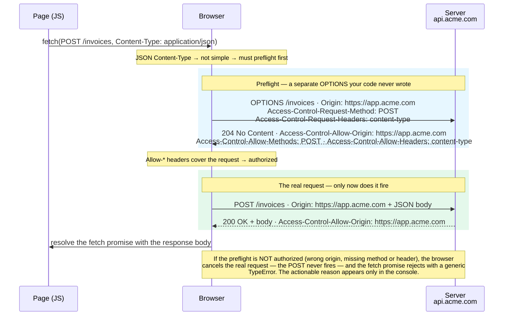

import Figure from '../../../components/figures/Figure.astro';
import DiagramSequence from '../../../components/figures/diagram-sequence/DiagramSequence.astro';
import DiagramStep from '../../../components/figures/diagram-sequence/DiagramStep.astro';
import CodeVariants from '../../../components/code/code-variants/CodeVariants.astro';
import CodeVariant from '../../../components/code/code-variants/CodeVariant.astro';
import Matching from '../../../components/exercises/matching/Matching.astro';
import Pair from '../../../components/exercises/matching/Pair.astro';
import TrueFalse from '../../../components/exercises/true-false/TrueFalse.astro';
import Statement from '../../../components/exercises/true-false/Statement.astro';
import TfWhy from '../../../components/exercises/true-false/TfWhy.astro';
import Term from '../../../components/ui/Term.astro';
import ExternalResource from '../../../components/ui/ExternalResource.astro';
import VideoCallout from '../../../components/embeds/VideoCallout.astro';
import PreflightWaterfall from '../../../components/lessons/012/3/PreflightWaterfall.astro';
import { CardGrid, Card } from '@astrojs/starlight/components';
import CourseProgressBar from '../../../components/ui/CourseProgressBar.astro';

<CourseProgressBar value={frontmatter['course-progress']} />

The last lesson ended with an open question. You learned that the same-origin policy doesn't stop a cross-origin request from being sent: the browser sends the request and lets the response come back, but it refuses to let the cross-origin page read that response. The browser also attaches an `Origin` header to the request, which asks the server a question on the page's behalf: who is calling? That lesson taught you the question. This one teaches the answer.

The answer is <Term definition={"Cross-Origin Resource Sharing.\nA set of HTTP response headers a server sends to tell the browser which other origins may read a response."}>CORS</Term>, or Cross-Origin Resource Sharing, the protocol a server uses to say "this response may be read by these specific origins." By the end of this lesson you'll be able to look at any `fetch` and predict whether it triggers a second hidden request, write the four headers a production server owes the browser, avoid the most common production CORS bug, and read the red console error when something goes wrong so you know exactly which header to fix.

One thing is worth settling up front, so you don't worry about over-applying any of this. A same-origin app calling its own backend, such as your SaaS UI fetching from the same domain it was served from, uses **none** of CORS. No headers, no preflight, nothing. CORS comes into play only when the request reaches across origins: to a dedicated API subdomain, a third-party API, a browser extension, or a marketing site calling your app. The last section draws that boundary precisely. Until then, assume CORS only matters when origins differ.

## CORS is the server's opt-in, not a client feature

The whole lesson rests on one idea that beginners often get backwards: **CORS is enforced by the browser but configured on the server.**

Consider who does what. The browser is the enforcer: it blocks the read when the rules aren't met. The server is the authority: it decides, header by header, which origins are allowed and what they may do. The `Access-Control-*` response headers are the contract between them. Your client-side `fetch` code only watches from the sidelines. It never sets an `Access-Control-*` header, because those are response headers, and the client sends requests, not responses.

This is why "fixing CORS in the frontend" is a mistake that costs people hours. It can't be done. A CORS error shows up in the browser console, on the client, which tempts people into reaching for the client `fetch` call. But the error is the browser reporting that the server's answer was insufficient. The fix lives on the server, every time.

:::caution[CORS lives on the server]
A CORS error in your browser console is almost never a client-side bug. The client can't grant itself permission to read a cross-origin response; only the server can, by sending the right headers. When you see a CORS error, your first move is to inspect the server's response headers, not the `fetch` call.
:::

CORS comes in two shapes, and the rest of the lesson builds on the difference between them. In a <Term definition={"A cross-origin request that meets the CORS-safelisted criteria. The browser sends it directly, then checks the response headers before letting the page read the body."}>simple request</Term>, the browser sends the request straight away, then checks the response headers afterward to decide whether the page may read the body. In a <Term definition={"A permission-check OPTIONS request the browser sends before the real one, asking the server to authorize the method and headers in advance."}>preflighted request</Term>, the browser asks permission first: it sends a separate `OPTIONS` request, waits for the server to authorize the real request's method and headers, and only then sends the real one. The next two sections take these in turn, first how to tell which one you'll get, then what the preflight actually looks like on the wire.

## Will this request preflight?

Predicting which path a request takes is the practical skill, so start there. A request skips the preflight and goes straight out, which makes it "simple," only when every one of the conditions below holds at once. The moment a request steps outside any row, the browser preflights it.

| Dimension | Simple (no preflight) | Anything else preflights |
| --- | --- | --- |
| Method | `GET`, `HEAD`, `POST` | `PUT`, `PATCH`, `DELETE`, … |
| Headers | only CORS-safelisted: `Accept`, `Accept-Language`, `Content-Language`, `Content-Type`, `Range` | any other header (e.g. `Authorization`) |
| `Content-Type` | `application/x-www-form-urlencoded`, `multipart/form-data`, `text/plain` | `application/json`, anything else |

You could memorize that table, but you don't need to. It collapses into one rule that covers nearly every request your SaaS will ever make:

:::tip[The one rule that matters]
Any `fetch` that sends `Content-Type: application/json` preflights, and that's almost every API call your UI makes. Treat **"JSON API calls always preflight"** as the working reality and you'll be right the vast majority of the time.
:::

The reason is in the third row: `application/json` is not on the safelist. The only `Content-Type` values that count as simple are the three a plain HTML `<form>` can produce on its own. Send JSON and you've left the safelist, so the browser preflights. Headers work the same way. Attach an `Authorization` header to carry a token and you've added a non-safelisted header, which forces a preflight too. So any call that sends JSON or carries an auth token preflights, and that covers the entire authenticated API surface of a typical app. (A `ReadableStream` request body also forces a preflight, but you'll rarely send one, so don't dwell on it.)

What survives as a simple request, then, is the older, embed-shaped web: a `<form>` POST submitting `multipart/form-data`, or an image beacon firing a `GET`. Recognize those as simple. For everything your app deliberately does with `fetch`, assume preflight.

Let's pin that down before moving on. For each statement, decide whether the request preflights.

<TrueFalse instructions="For each fetch, decide whether the browser preflights it. (Assume each is cross-origin.)">
  <Statement answer="false">
    A `GET` request with no custom headers and no body does **not** preflight.
    <TfWhy>`GET` is a simple method and there are no non-safelisted headers, so it qualifies as a simple request. The browser sends it directly and checks the response headers afterward.</TfWhy>
  </Statement>

  <Statement answer="true">
    A `POST` request with `Content-Type: application/json` preflights.
    <TfWhy>`application/json` is not a CORS-safelisted content type, so the request leaves the simple set and the browser sends an `OPTIONS` first. This is nearly every API call your UI makes.</TfWhy>
  </Statement>

  <Statement answer="true">
    A `GET` request carrying an `Authorization: Bearer …` header preflights.
    <TfWhy>The method is simple, but `Authorization` is not a safelisted header. Any non-safelisted header forces a preflight, so token-bearing calls always preflight too.</TfWhy>
  </Statement>
</TrueFalse>

## The preflight dance, step by step

So your JSON `POST` preflights. What does that actually look like? This is the dance the lesson is named for: a permission-check round trip that happens before your real request, entirely out of your JavaScript's sight.

Here's the full sequence. Read it top to bottom, where each arrow is a real message on the wire.

<Figure caption="One fetch, two round trips. The browser inserts a preflight OPTIONS round trip and only sends your real POST once the Access-Control-Allow-* headers authorize it. If the preflight isn't authorized, the real request never fires, and your JavaScript never even saw the OPTIONS.">

</Figure>

A few pieces are worth noticing. The `OPTIONS`/`204` pair in the blue band is the preflight: a separate `OPTIONS` request your code never wrote and never sees. In it, the browser previews what it's about to do, where `Access-Control-Request-Method` announces the method and `Access-Control-Request-Headers` lists the non-safelisted headers, and the server answers with the matching `Access-Control-Allow-*` headers. Only if the answer covers the request does the browser send the real `POST` in the green band below it.

The failure case is the part that trips people up. If the preflight response doesn't authorize the request, the browser **cancels the real request before it's sent**, so the server never even sees your `POST`, and your `fetch` promise rejects. But it rejects with a generic, unhelpful `TypeError`. The real reason is printed separately, in red, in the console. The last section is about learning to read those.

The single most useful thing to carry from this diagram is that the preflight is a **real, separate network request**, not a metaphor. Open your browser's Network panel and you'll see two rows: an `OPTIONS`, then your `POST`. Let's make that concrete.

<DiagramSequence>
  <DiagramStep caption="Your code calls fetch. DevTools shows a single row appear: the preflight OPTIONS, still pending.">
    <PreflightWaterfall step={1} />
  </DiagramStep>

  <DiagramStep caption="The server answers the preflight with 204 and the Access-Control-Allow-* headers. The OPTIONS resolves.">
    <PreflightWaterfall step={2} />
  </DiagramStep>

  <DiagramStep caption="The headers authorized the request, so the browser now fires the real POST. A second row appears.">
    <PreflightWaterfall step={3} />
  </DiagramStep>

  <DiagramStep caption="The POST returns 200 with the body. Two rows for one fetch call, which is the preflight made visible.">
    <PreflightWaterfall step={4} />
  </DiagramStep>
</DiagramSequence>

Two rows for one `fetch`. Once you've seen this in DevTools, the preflight stops being abstract. When a cross-origin call misbehaves, your first question becomes "which of the two rows failed, the `OPTIONS` or the real one?", and that question alone narrows the bug fast.

<VideoCallout videoId="PNtFSVU-YTI" videoTitle="Learn CORS In 6 Minutes — Web Dev Simplified">
  Web Dev Simplified walks the same path live in six minutes: the missing `Access-Control-Allow-Origin` error, the `OPTIONS` preflight firing on a `PUT`, and the credentials header.
</VideoCallout>

## The four headers your server owes the browser

Now for the server's side of the contract. To let a cross-origin page read a response, a production server sends up to four `Access-Control-*` response headers. Each one maps to a specific failure if it's missing, and that pairing is what makes this table worth coming back to, so read the middle column as closely as the others.

| Header | What it does / failure mode | Example |
| --- | --- | --- |
| `Access-Control-Allow-Origin` | Names which origin may read the response. **Missing →** the browser refuses the read, and the page sees the canonical *"No 'Access-Control-Allow-Origin' header"* error. | `https://app.acme.com` (the exact origin, echoed back; `*` works only without credentials, as the trap below explains) |
| `Access-Control-Allow-Methods` | *(preflight only)* Lists the methods the real request may use. **Missing →** a `PUT`, `PATCH`, or `DELETE` is rejected at the preflight. | `GET, POST, PUT, DELETE, PATCH` |
| `Access-Control-Allow-Headers` | *(preflight only)* Lists the request headers the real request may send. **Missing →** any non-safelisted header trips the preflight, including the JSON `Content-Type` or an `Authorization` token. | `content-type, authorization` |
| `Access-Control-Allow-Credentials` | Opts the response into being readable when the request carries credentials. Pairs with the client's `credentials: 'include'`. **Missing →** cookies and auth aren't usable, and the credentialed response is blocked. | `true` |

Two more headers earn a mention but sit one tier down, since you reach for them less often:

- `Access-Control-Max-Age: 86400` caches the preflight result so the browser stops sending an `OPTIONS` before every call. Without it, every JSON request pays for two round trips. There's a catch worth knowing: **Chrome caps this at 7200 seconds (2 hours) and Firefox at 86400 (24 hours)**, so a larger value is silently clamped, and asking for a week buys you two hours in Chrome. A common approach is to pair a modest max-age with an exact-echo origin and move on.
- `Access-Control-Expose-Headers: X-Total-Count, X-Page` lets your JavaScript read response headers that aren't on the default exposed set (`Cache-Control`, `Content-Language`, `Content-Type`, `Expires`, `Last-Modified`, `Pragma`). The classic reason to reach for it is pagination: you return a paginated list and put the total count in `X-Total-Count`, and without exposing it, the browser hides that header from your code even though it arrived.

## The wildcard-with-credentials trap

This one earns its own section because it is the most common production CORS bug, and naming it clearly once is half the battle.

The rule itself is simple: `Access-Control-Allow-Origin: *`, the wildcard that means "any origin may read this," is legal **only** when the request is not credentialed. A <Term definition={"A cross-origin request that carries the user's cookies, HTTP auth, or client certificate because the client set credentials: 'include'."}>credentialed request</Term> is one where the client set `credentials: 'include'`, telling the browser to attach the user's cookies. The instant a request is credentialed and the server answers with `*`, the browser refuses the response and the page sees *"...the value of the 'Access-Control-Allow-Origin' header in the response must not be the wildcard '\*' when the request's credentials mode is 'include'."*

The reasoning holds up once you see it: `*` means "anyone can read this," and "anyone can read this *with the user's cookies attached*" would hand every site on the internet the keys to the user's session. The browser forbids that combination outright.

The fix is to stop using the wildcard and name the caller exactly. Compare the broken and fixed handlers below.

<CodeVariants>
  <CodeVariant label="Broken" icon="error">
    <div data-mark-color="red">

    ```ts title="app/api/invoices/route.ts" del={5}
    export const GET = async (req: Request) => {
      const invoices = await listInvoices();
      return Response.json(invoices, {
        headers: {
          'Access-Control-Allow-Origin': '*',
          'Access-Control-Allow-Credentials': 'true',
        },
      });
    };
    ```

    </div>
    **Blocked the moment the client sends `credentials: 'include'`.** A wildcard origin plus credentials is the one combination the browser refuses: `*` says *anyone*, and *anyone, with the user's cookies* is exactly what must never happen.
  </CodeVariant>

  <CodeVariant label="Fixed" icon="approve-check">
    <div data-mark-color="green">

    ```ts title="app/api/invoices/route.ts" ins={1,4-5,10,12}
    const allowedOrigins = new Set(['https://app.acme.com']);

    export const GET = async (req: Request) => {
      const origin = req.headers.get('Origin');
      const allowOrigin = origin && allowedOrigins.has(origin) ? origin : '';

      const invoices = await listInvoices();
      return Response.json(invoices, {
        headers: {
          'Access-Control-Allow-Origin': allowOrigin,
          'Access-Control-Allow-Credentials': 'true',
          Vary: 'Origin',
        },
      });
    };
    ```

    </div>
    **Validate the incoming `Origin` against an allow-list, then echo the exact value back.** The browser now sees its own origin named explicitly, which is legal alongside credentials. The `Vary: Origin` line is mandatory here, as explained below.
  </CodeVariant>
</CodeVariants>

That `Vary: Origin` line in the fixed version isn't decoration, and it's worth turning into a habit of its own.

:::caution[Echo the origin? Then `Vary: Origin`.]
The moment your response depends on the request's `Origin`, which it does as soon as you echo the origin back, you must send `Vary: Origin`. This tells every cache between your server and the user (CDNs, the browser's own cache) to key the response by origin. Skip it, and a response cached for `app.acme.com` can be served to `other.com`, whose origin it doesn't name, so the browser rejects it. The bug is intermittent and cache-shaped: it works until a cache warms up, then breaks for one origin and not another. The rule is mechanical: **echo origin ⇒ `Vary: Origin`, always.**
:::

## The three fetch knobs that touch CORS

You've now seen that almost everything in CORS lives on the server. So what does the client control? Less than you might expect: three `fetch` options, and for all three the default is the right pick for a first-party SaaS. The client never touches an `Access-Control-*` header, and these are the only knobs that interact with CORS at all.

| Knob | Default | What to know |
| --- | --- | --- |
| `mode` | `'cors'` | The only useful value for cross-origin. `'same-origin'` rejects cross-origin requests outright; `'no-cors'` sends the request but hands you an **opaque** response you can't read, which catches people out. Leave it on the default. |
| `credentials` | `'same-origin'` | Cookies attach only on same-origin requests. `'include'` attaches them cross-origin too, and *requires* `Access-Control-Allow-Credentials: true` on the server. `'omit'` never attaches. |
| `Origin` header | (browser-set) | The browser writes it automatically; your code can never set or forge it. A server can *validate* it, but can't *trust* it from a non-browser caller, since `curl` or a script can send any `Origin` it likes. |

The `credentials` default is worth dwelling on, because it's the same default that kept the monolith case quiet in the last lesson. With `credentials: 'same-origin'`, your SaaS UI calling its own backend carries the session cookie without a single line of ceremony: same origin, cookies attach, done. The `'include'` value is the deliberate, explicit reach for a cross-origin authenticated call, the case where you've decided to send the user's cookies to a different origin and must opt the server in with `Access-Control-Allow-Credentials: true` to match.

That's the whole client surface for CORS. The full `fetch` story, including request bodies, methods, status handling, and `AbortSignal` for cancellation, comes in a couple of chapters, when we cover `fetch` properly. Here, these three knobs are all that touch the cross-origin contract.

## Reading the CORS error in the console

Here's the payoff the last lesson promised. When a cross-origin call fails the CORS check, your `fetch` promise rejects with the unhelpful `TypeError: Failed to fetch`: no origin, no header, no clue. The browser does tell you exactly what went wrong, but it tells you in a separate red message in the console, not in the error your code catches.

So reading that red string is the real skill. The good news is that there are only a handful of canonical messages, and each one maps to a fix you've already learned in this lesson. Match each error to what it's telling you to do on the server.

<Matching instructions="Each red console string points at one server-side fix. Match the error to the change that resolves it.">
  <Pair>
    <Fragment slot="left">No `Access-Control-Allow-Origin` header is present on the requested resource.</Fragment>
    <Fragment slot="right">The server didn't send the header at all — add `Access-Control-Allow-Origin` in the route handler.</Fragment>
  </Pair>
  <Pair>
    <Fragment slot="left">…must not be the wildcard `'*'` when the request's credentials mode is `'include'`.</Fragment>
    <Fragment slot="right">The wildcard-with-credentials trap — validate and echo the exact origin, and add `Vary: Origin`.</Fragment>
  </Pair>
  <Pair>
    <Fragment slot="left">Response to preflight request doesn't pass access control check: It does not have HTTP ok status.</Fragment>
    <Fragment slot="right">The `OPTIONS` handler returned a non-2xx status — return `204` with the CORS headers.</Fragment>
  </Pair>
  <Pair>
    <Fragment slot="left">Request header field `authorization` is not allowed by `Access-Control-Allow-Headers` in preflight response.</Fragment>
    <Fragment slot="right">Add `authorization` (or whichever header is named) to `Access-Control-Allow-Headers`.</Fragment>
  </Pair>
</Matching>

Read those four until the symptom-to-fix jump is automatic, because in production that jump is the debugging. Every one of them is a server change, which is the lesson's whole thesis arriving in the place you'll actually meet it: the console.

## What the answer looks like in Next.js

You haven't built a Next.js backend yet, since that's Unit 4 and beyond, so treat this section as recognition rather than authorship. The goal is that when you do write a cross-origin endpoint, this shape looks familiar and you know what each line is for.

The recommended pattern keeps the allow-list next to the route it guards, in a small helper. That's two files: a `lib/cors.ts` that knows the policy, and the <Term definition={"A Next.js file at app/api/.../route.ts that responds to HTTP requests by exporting one function per method (GET, POST, OPTIONS, …)."}>Route Handler</Term> that uses it.

<CodeVariants maxLines={0}>
  <CodeVariant label="lib/cors.ts" icon="seti:typescript">
    ```ts title="lib/cors.ts"
    const allowedOrigins = new Set(['https://app.acme.com']);

    export const corsHeaders = (origin: string | null): HeadersInit => {
      const allowOrigin = origin && allowedOrigins.has(origin) ? origin : '';
      return {
        'Access-Control-Allow-Origin': allowOrigin,
        'Access-Control-Allow-Methods': 'GET, POST, OPTIONS',
        'Access-Control-Allow-Headers': 'content-type, authorization',
        'Access-Control-Allow-Credentials': 'true',
        'Access-Control-Max-Age': '7200',
        Vary: 'Origin',
      };
    };
    ```
    **The policy in one place.** Validate the origin against the allow-list, echo it back, and pack the four headers plus `Vary: Origin` and a modest `Max-Age`. Every route that needs CORS reads from this one function.
  </CodeVariant>

  <CodeVariant label="app/api/invoices/route.ts" icon="seti:typescript">
    ```ts title="app/api/invoices/route.ts"
    import { corsHeaders } from '@/lib/cors';

    export const OPTIONS = (req: Request) =>
      new Response(null, {
        status: 204,
        headers: corsHeaders(req.headers.get('Origin')),
      });

    export const GET = async (req: Request) => {
      const invoices = await listInvoices();
      return Response.json(invoices, {
        headers: corsHeaders(req.headers.get('Origin')),
      });
    };
    ```
    **One file per route, one named export per method.** A `route.ts` dispatches by HTTP method through its named exports: `OPTIONS` answers the preflight, and `GET` answers the real request. Both pull the same headers from the helper.
  </CodeVariant>
</CodeVariants>

Two things are worth locking in from that handler.

First, **the `OPTIONS` export *is* the preflight handler.** It's the server side of steps 3 and 4 in the sequence diagram: the browser's `OPTIONS` arrives, and this function answers `204` with an empty body and the four headers. Forget to export `OPTIONS`, or return a non-2xx from it, and you get canonical error #3, *"Response to preflight request... does not have HTTP ok status."* The preflight handler is easy to forget and easy to get wrong.

Second, **why this lives per-route rather than app-wide.** Next.js does let you set headers globally in `next.config.ts`, but that's a coarse, every-route tool, and the security baseline in Unit 16 owns it. The CORS allow-list belongs next to the route it guards, because which origins may read invoices is a property of the invoices route, not of the whole app. Per-route is the better choice here.

:::note
This handler is deliberately bare. A real production Route Handler in this course wraps an auth check, validates input with Zod, and returns structured errors, machinery you'll meet from Unit 6 onward. Stripping all of that out here keeps the CORS signal clear. When you reach those units, the headers shown here slot into the fuller shape unchanged.
:::

## When CORS doesn't apply

You've learned the tool. The matching judgment is knowing when you don't need it. CORS only enters the picture when a browser makes a cross-origin request and wants to read the response. Plenty of common situations don't meet that bar, and confusing them with CORS sends you debugging the wrong layer. Here are the ones worth recognizing.

<CardGrid>
  <Card title="Same-origin app → its own backend" icon="approve-check">
    No CORS. No headers. Nothing. Your SaaS UI fetching from the domain that served it is same-origin, which is the monolith default and the course's normal case. Most of the code you'll write never touches any of this.
  </Card>
  <Card title="API subdomain" icon="puzzle">
    `app.acme.com` calling `api.acme.com` is cross-origin (different host) but **same-site** (same registrable domain). CORS *is* required, yet `SameSite=Lax` cookies still travel, because the site matches. The cookie side is the next chapter's job.
  </Card>
  <Card title="Server-to-server fetch" icon="server">
    A Next.js Route Handler or Server Action calling a third-party API has **no browser, no `Origin` header, and no CORS check at all.** This is the escape hatch: when a third party ships no CORS, fetch it from your server instead of the client.
  </Card>
  <Card title="Reverse proxy / rewrites" icon="random">
    Expose a third party under your own origin (a Next.js `rewrites()` rule) and the call collapses from cross-origin to same-origin, so CORS disappears, at the cost of a network hop. This is the move when a third party offers no CORS and a full server proxy is overkill.
  </Card>
  <Card title="Browser extension / null origin" icon="warning">
    Content scripts send `Origin: null`. You have to decide deliberately whether to allow-list `null` or refuse it, since there's no exact origin to echo. This is edge-case awareness; you'll rarely hit it.
  </Card>
</CardGrid>

Notice the shape of that list. Two of these (server-to-server, reverse proxy) make CORS vanish by removing the browser from the equation, so they're the quiet alternatives to fighting a CORS config at all. When a third-party API ships no CORS headers, the answer is usually not "convince them to add CORS"; it's "call it from my server."

## Watch a preflight fire

This is optional, but worth five minutes if you're curious: the diagram made real. Open a minimal Route Handler, hit it from a different origin, and watch the two-row waterfall, the `OPTIONS` followed by the real request, appear in the Network panel exactly as the sequence above predicted.

Spin up your own minimal Route Handler when you reach Unit 4, call it from a page on a different port, and open the Network panel. You'll watch the `OPTIONS` preflight resolve, then the real request fire, exactly like the diagram. Until then, MDN walks the same `OPTIONS` round trip header by header, including the failure path.

<ExternalResource
  title="MDN — Preflighted requests"
  href="https://developer.mozilla.org/en-US/docs/Web/HTTP/CORS#preflighted_requests"
  icon="simple-icons:mdnwebdocs"
  description="The OPTIONS preflight on the wire: the Access-Control-Request-* headers the browser sends and the Access-Control-Allow-* answer that authorizes the real request."
/>

## Going deeper

The header palette and the exact error strings are reference material you'll come back to, and MDN is the canonical source for both.

<CardGrid>
  <ExternalResource
    title="Cross-Origin Resource Sharing (CORS)"
    href="https://developer.mozilla.org/en-US/docs/Web/HTTP/CORS"
    icon="simple-icons:mdnwebdocs"
    description="The full header reference, the simple-request criteria, and every error string verbatim."
  />
  <ExternalResource
    title="Fetch Standard — CORS protocol"
    href="https://fetch.spec.whatwg.org/#http-cors-protocol"
    icon="lucide:scroll-text"
    description="The spec-precise definition of preflighting and the safelist, for the reader who wants the source of truth."
  />
  <ExternalResource
    title="CS Visualized: CORS"
    href="https://dev.to/lydiahallie/cs-visualized-cors-5b8h"
    icon="simple-icons:devdotto"
    iconColor="#FFFFFF"
    description="Lydia Hallie animates the whole flow frame by frame: simple vs. preflighted requests, the Origin question, and the Access-Control-* answer."
  />
  <ExternalResource
    title="CORS Tester — simulate a request"
    href="https://corsfix.com/tools/cors-tester"
    icon="lucide:flask-conical"
    iconColor="#38BDF8"
    description="Point it at any URL, pick a method and origin, and watch the preflight and Access-Control-* headers come back: the diagram made interactive."
  />
</CardGrid>
