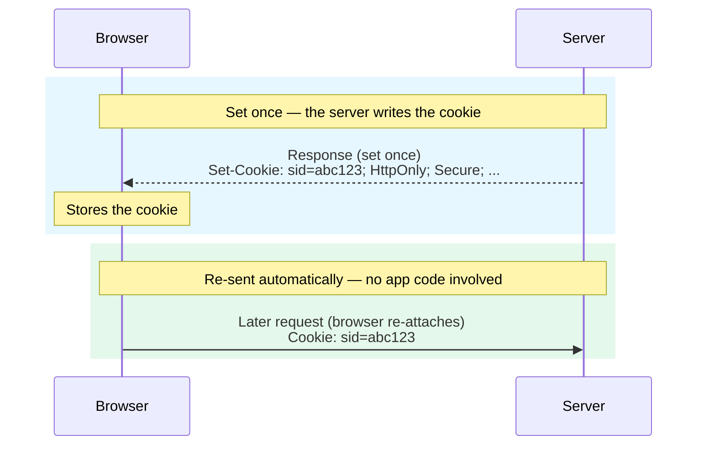

import Figure from '../../../components/figures/Figure.astro';
import SetCookieAnatomy from '../../../components/lessons/013/1/SetCookieAnatomy.astro';
import SameSiteMatrix from '../../../components/lessons/013/1/SameSiteMatrix.astro';
import AnnotatedCode from '../../../components/code/annotated-code/AnnotatedCode.astro';
import AnnotatedStep from '../../../components/code/annotated-code/AnnotatedStep.astro';
import CodeVariants from '../../../components/code/code-variants/CodeVariants.astro';
import CodeVariant from '../../../components/code/code-variants/CodeVariant.astro';
import CodeTooltips from '../../../components/code/CodeTooltips.astro';
import Term from '../../../components/ui/Term.astro';
import Matching from '../../../components/exercises/matching/Matching.astro';
import Pair from '../../../components/exercises/matching/Pair.astro';
import StackBlitzCallout from '../../../components/embeds/StackBlitzCallout.astro';
import VideoCallout from '../../../components/embeds/VideoCallout.astro';
import ExternalResource from '../../../components/ui/ExternalResource.astro';
import { CardGrid } from '@astrojs/starlight/components';
import CourseProgressBar from '../../../components/ui/CourseProgressBar.astro';

<CourseProgressBar value={frontmatter['course-progress']} />

A cookie keeps a user logged in across hundreds of requests, yet your app never re-sends their credentials. The browser stores the cookie once and re-attaches it on every matching request, with no application code involved. That makes a cookie an **<Term definition="A credential the browser sends on its own, without your code ever attaching it.">ambient credential</Term>**: the free re-attachment keeps sessions alive, and it is also the threat, because a request the user never meant to make carries their cookie too.

Every attribute on a `Set-Cookie` header exists to constrain that transmission: when the browser re-attaches the cookie, who can read it on the page, and where it survives. You will read each attribute on a real header, see exactly what it prevents, and build to one line worth memorizing, the safe default for every cookie you write.

```http
Set-Cookie: __Host-sid=<value>; HttpOnly; Secure; SameSite=Lax; Path=/; Max-Age=2592000
```

That line is the destination. You will walk it left to right, one attribute at a time, then reassemble it at the end.

## How the browser sends a cookie back

The server writes the cookie once, with a `Set-Cookie` response header. On every later request that matches the cookie's conditions, the browser attaches it on its own as a `Cookie` request header.

<Figure caption="The app code never attaches the cookie; the browser does, on every matching request.">

</Figure>

Each attribute is a rule the browser checks before re-attaching, so tightening the rules attaches the cookie in fewer situations.

One header sets one cookie, always in the same shape:

```http
Set-Cookie: name=value; Attribute1; Attribute2=value
```

The name/value pair comes first, then attributes separated by semicolons; some are bare flags (`HttpOnly`), some take a value (`Path=/`). Unlike other headers, `Set-Cookie` may appear several times in one response, one per cookie it sets.

<Figure caption="The rest of this lesson walks these left to right: what each controls, what breaks without it, and the safe default.">
  <SetCookieAnatomy />
</Figure>

## `HttpOnly`: keep the cookie out of JavaScript's reach

**What it controls.** With `HttpOnly` set, `document.cookie` cannot see the cookie. The browser still attaches it to every request; only the JavaScript read path is closed.

**What breaks without it.** A cookie JavaScript can read can be stolen through <Term definition="Cross-site scripting — untrusted input that ends up executing as script inside your page. You will treat it in depth in a later security chapter.">XSS</Term>: one line of injected script reads it and ships it to the attacker's server, who replays the session from anywhere.

**The nuance most people miss.** `HttpOnly` does not stop XSS, only the read. Injected script can still send authenticated requests, since `fetch('/transfer', { method: 'POST' })` runs in the user's session and the browser attaches the cookie. So `HttpOnly` is defense-in-depth: it closes the worst path, stealing the cookie to replay elsewhere, without fixing the underlying bug.

**The default.** Every session-bearing cookie is `HttpOnly`. Leave a cookie readable only when the client UI must read it, such as a `theme=dark` preference the page applies or a <Term definition="A CSRF defense where the server sets a random token in a readable cookie and the client reads it and echoes it back in a request header; the server accepts the request only when the two copies match.">CSRF double-submit token</Term> the client echoes back.

```http
Set-Cookie: sid=abc123; HttpOnly
Set-Cookie: theme=dark
```

The session ID is carried but unreadable; the preference is left readable on purpose so the UI can paint the page.

## `Secure`: only travel over HTTPS

**What it controls.** A `Secure` cookie is attached only on HTTPS requests. Over plaintext HTTP, the browser leaves it behind.

**What breaks without it.** Plaintext HTTP is rare in 2026 but not extinct: a captive-portal redirect on café wifi or a misconfigured proxy still produces an HTTP leg now and then. On that leg, a cookie without `Secure` travels in the clear, and an **<Term definition="Anyone positioned on the network path who can read or modify unencrypted traffic — the classic coffee-shop sniffer.">on-path attacker</Term>** reads it off the wire.

**Local development.** `Secure`-cookie behavior on plain `localhost` is inconsistent across browsers. The mkcert HTTPS setup you configured earlier sidesteps this: you develop over HTTPS, so `Secure` cookies behave exactly as in production.

**The default.** Every cookie is `Secure`. The only exception is a legacy HTTP test fixture.

```http
Set-Cookie: sid=abc123; HttpOnly; Secure
```

## `SameSite`: Strict, Lax, and None

`SameSite` decides whether the browser attaches the cookie on requests that originate from another site. It is what separates a session that survives a <Term definition="Cross-site request forgery — a malicious site causing the user's browser to fire an authenticated request the user never intended.">CSRF</Term> attack from one that hands the attacker a logged-in session.

It takes three values, from strictest to loosest.

**`Strict`** attaches the cookie only on same-site requests. Even a <Term definition="The user's address bar actually changing to your site, as opposed to a background request or an embedded sub-resource.">top-level navigation</Term> from a third party does not carry it, so a user who clicks a magic link from their email client lands looking logged-out until they navigate again. That is the strongest CSRF defense and the worst sign-in experience. Reserve it for a few highly sensitive sub-cookies, not for your session default.

**`Lax`** attaches the cookie on same-site requests and on top-level **<Term definition="HTTP methods that only read and never change state: GET and HEAD.">safe-method</Term>** navigations from a third party, such as an `<a href>` click or a `GET` form submission. It does **not** attach on cross-site `POST`, on `` or `<iframe>` loads, or on cross-site `fetch`. This is the default for session cookies: the email-link UX keeps working while the cross-site POST loses the cookie. Since 2020, browsers treat `Lax` as the implicit default when the attribute is absent. Write it explicitly anyway, because relying on an implicit default is how behavior differences slip in across browsers and versions.

**`None`** attaches the cookie on every request, same-site or cross-site, including third-party embeds. It requires `Secure`: without it, the browser rejects the cookie outright. Reserve `None` for a legitimate cross-site need, such as a payment iframe or an authenticated widget embedded on another site. As of 2026, bare `SameSite=None` is no longer reliable, because Safari and Firefox block it by default without the `Partitioned` attribute (covered below).

**What `Lax` prevents.** A user logged in to your app opens a malicious page in another tab, and that page silently submits a form that POSTs to your transfer endpoint. Without `SameSite`, the browser attaches the session cookie, your server sees an authenticated request, and the transfer goes through. With `SameSite=Lax`, the browser withholds the cookie, so the request arrives unauthenticated and your server refuses. This is why `Lax`, combined with putting every state-changing endpoint behind `POST`, `PUT`, or `DELETE`, retires the bulk of CSRF. Token-based defenses, and exactly what `Lax` leaves uncovered, are a later chapter's job.

<Figure caption="Lax is the only row that allows the cross-site GET navigation while blocking the cross-site POST, so sign-in links work and the CSRF attack fails.">
  <SameSiteMatrix />
</Figure>

```http
Set-Cookie: sid=abc123; HttpOnly; Secure; SameSite=Lax
```

## `Path`: scoping convenience, not a security boundary

**What it controls.** `Path=/admin` attaches the cookie only on requests whose pathname starts with `/admin`, a prefix filter on the path.

**The trap.** Omit `Path` and the browser defaults not to `/` but to the directory of the page that set the cookie, usually a sub-path. A cookie set on `/admin/login` will not attach on `/admin/users`, so the session seems to vanish as the user moves around, for no obvious reason. Set `Path=/` explicitly and it attaches everywhere.

**The default.** `Path=/`.

:::caution
`Path` is **not** a security boundary. It filters which requests carry the cookie, but any same-origin script can still read across paths when the cookies share a name. Use it for scoping, never to wall off one part of your app from another.
:::

```http
Set-Cookie: sid=abc123; HttpOnly; Secure; SameSite=Lax; Path=/
```

## `Domain`: host-only by default, or you leak to every subdomain

**What it controls.** `Domain=acme.com` attaches the cookie on `acme.com` and every subdomain under it.

**The trap.** It works the opposite way from the instinct that reaches for it "to be safe." `Domain=acme.com` sends the cookie to `app.acme.com`, `api.acme.com`, and `marketing.acme.com`. The marketing subdomain might run a CMS with a far lower security bar, where one compromised plugin would then hold your users' sessions. Writing `Domain` to feel safer is exactly how you widen the attack surface.

**The default.** Leave it off. The cookie becomes host-only, attached to the exact host that set it, which is what a session wants.

```http
Set-Cookie: sid=abc123; HttpOnly; Secure; SameSite=Lax; Path=/
Set-Cookie: sid=abc123; Domain=acme.com
```

The first cookie is host-only; the second is handed to every subdomain of `acme.com`. Reach for the second only when cross-subdomain attachment is the feature you want.

## `Max-Age` and `Expires`: how long the cookie lives

**What they control.** `Max-Age` is a lifetime in seconds from now, so `Max-Age=2592000` is thirty days. `Expires` is an absolute date. Reach for `Max-Age`: seconds-from-now has no clock-skew ambiguity, while an absolute date trusts the client's clock. When both are present, `Max-Age` wins.

**The session-cookie surprise.** Set neither and you get a session cookie, meant to die when the browser closes. But mobile browsers and any browser set to restore tabs keep session cookies alive across restarts, so an unbounded one is effectively permanent. Set `Max-Age` to the lifetime you actually want. `Max-Age=0` deletes the cookie immediately.

**The ceiling.** Browsers cap cookie lifetimes at **400 days** and silently clamp anything larger, so a bump from one year to two can quietly do nothing.

```http
Set-Cookie: sid=abc123; HttpOnly; Secure; SameSite=Lax; Path=/; Max-Age=2592000
```

## `__Host-` and `__Secure-`: naming prefixes the browser enforces

`__Host-` and `__Secure-` are not attributes; they are name prefixes the browser treats as a contract. When a cookie's name starts with one, the browser checks it against a set of attribute constraints and rejects the entire `Set-Cookie` header if they are not met.

:::tip
A `__Host-` cookie must set `Secure`, carry **no** `Domain`, and use `Path=/`; miss any one and the browser drops it. The result is host-locked at the browser level. `__Secure-` is the relaxed sibling: it requires only `Secure`.
:::

**What they prevent.** A subdomain attacker planting a cookie the parent then trusts. Without prefixes, someone who controls `evil.acme.com` could set a cookie with `Domain=acme.com` and a session-shaped name, and `app.acme.com` might read it as a real session. Because a `__Host-` cookie cannot carry `Domain`, no write from `evil.acme.com` can ever land a `__Host-sid` cookie that `app.acme.com` reads.

**The default.** Prefix session cookies with `__Host-`; that covers the common case, where you do not need the cookie shared across subdomains. When sharing across subdomains is the actual feature, use `__Secure-` with `Domain` instead. `__Host-` and `Domain` are mutually exclusive: host-locked with `__Host-`, or shared with `__Secure-` plus `Domain`, never both.

```http
Set-Cookie: __Host-sid=abc123; HttpOnly; Secure; SameSite=Lax; Path=/
Set-Cookie: __Host-sid=abc123; Domain=acme.com
```

The first is valid. The second is rejected before storage, because a `__Host-` name with a `Domain` attribute breaks the contract.

## `Partitioned` (CHIPS): the safe cross-site cookie

This last attribute matters only when a cookie must work cross-site.

**`Partitioned`.** A <Term definition="Part of CHIPS — Cookies Having Independent Partitioned State — the spec name for the Partitioned attribute.">`Partitioned` cookie</Term> is keyed by both its own origin and the top-level site embedding it, so the same widget on `news.com` and `blog.com` gets two separate cookie jars, neither able to see the other. That kills the cross-site tracking primitive privacy work is dismantling: one **<Term definition="A cookie set under a different site than the one in the address bar.">third-party cookie</Term>**, embedded everywhere, reading the same value on every site to stitch your browsing together. The cookie still works inside each site, just not as one shared cookie across them.

:::note[CHIPS in one line]
`Partitioned` must be combined with `Secure` and `SameSite=None`. Bare `SameSite=None; Secure` is now degraded by browsers, and `Partitioned` restores the cross-site cookie. Set all three during the transition: `Partitioned` is honored where supported, the bare pair is the fallback elsewhere.
:::

**The cross-site default.** For an embedded widget, a payment iframe, or any legitimate cross-site cookie, the shape is `Secure; SameSite=None; Partitioned`, with `__Host-` recommended on top.

```http
Set-Cookie: __Host-widget=abc123; Secure; SameSite=None; Partitioned; Path=/
```

**Where this stands in 2026.** Third-party cookies are not dead in Chrome, but you cannot rely on them: Safari and Firefox block them by default, and a growing share of Chrome users do too. `Partitioned` (CHIPS) is the one cross-site mechanism that survives across browsers and that Google has committed to keep. Analytics, ad attribution, and <Term definition="Federated Credential Management — the browser API replacing third-party-cookie-based federated sign-in.">FedCM</Term> sign-in have mostly moved off third-party cookies, out of scope here.

<VideoCallout videoId="zYp0DFFmGxk" videoTitle="What is CHIPS? — Chrome for Developers">
  Chrome for Developers' 4-minute explainer of `Partitioned` mechanics. It predates the 2025 reversal, so read its "future without third-party cookies" framing as today's reality.
</VideoCallout>

## Assembling the safe-default header

Reassembled, the destination line from the start of the lesson reads as one header:

<AnnotatedCode lang="http" code={`
Set-Cookie: __Host-sid=<value>; HttpOnly; Secure; SameSite=Lax; Path=/; Max-Age=2592000
`}>
  <AnnotatedStep meta={`"__Host-sid"`} color="blue">
    **Host-locked name.** Forces `Secure`, no `Domain`, and `Path=/`, so no subdomain can plant this cookie.
  </AnnotatedStep>

  <AnnotatedStep meta={`"HttpOnly"`} color="blue">
    **No JavaScript read.** XSS on the page still cannot read the session out to exfiltrate it.
  </AnnotatedStep>

  <AnnotatedStep meta={`"Secure"`} color="blue">
    **HTTPS only.** Never travels on a plaintext leg where it could be sniffed.
  </AnnotatedStep>

  <AnnotatedStep meta={`"SameSite=Lax"`} color="blue">
    **Sent on top-level same-site navigations, withheld on cross-site POSTs.** Sign-in links work; CSRF POSTs fail.
  </AnnotatedStep>

  <AnnotatedStep meta={`"Path=/"`} color="blue">
    **Scoped to the whole app,** not the sub-path that set it.
  </AnnotatedStep>

  <AnnotatedStep meta={`"Max-Age=2592000"`} color="blue">
    **Expires in 30 days,** not whenever the browser closes, which on mobile is approximately never.
  </AnnotatedStep>
</AnnotatedCode>

Paste this line into every cookie-writing call. Deviate only when a named feature demands it, and exactly four do:

- **Cross-site embed** (widget, payment iframe): swap `SameSite=Lax` for `SameSite=None; Partitioned`, keep `Secure`.
- **Client must read the value** (a `theme` preference, a double-submit CSRF token): drop `HttpOnly`.
- **Cross-subdomain sharing is the feature**: swap `__Host-` for `__Secure-` and add `Domain`.
- **Legacy HTTP test fixture**: drop `Secure`, rare on this stack.

## Reading and writing cookies in Next.js

You have read raw `Set-Cookie` strings to see the wire format, but in an app you rarely write that string by hand: you call a helper that builds the header for you. In Next.js that helper is `cookies()`.

You call it from one of the App Router's three server execution contexts, **Server Components**, **Server Actions**, and **Route Handlers** (each defined in a later unit). In the App Router (Next.js 16) `cookies()` is **async**, so every call needs `await`.

The write call's option bag maps one-to-one onto the attribute table you just learned.

<CodeVariants>
  <CodeVariant label="Read">
    ```ts
    const sid = (await cookies()).get('__Host-sid')?.value;
    ```
    **Works in any server context.** Returns `undefined` if the cookie isn't set.
  </CodeVariant>

  <CodeVariant label="Write">
    ```ts
    (await cookies()).set({
      name: '__Host-sid',
      value,
      httpOnly: true,
      secure: true,
      sameSite: 'lax',
      path: '/',
      maxAge: 60 * 60 * 24 * 30,
    });
    ```
    **Runs in a Server Action or Route Handler.** Every key is one row of the attribute table: `httpOnly`, `secure`, `sameSite: 'lax'`, `path`, `maxAge` (seconds; 30 days here). Add `partitioned: true` for the CHIPS cross-site cookie.
  </CodeVariant>

  <CodeVariant label="Delete">
    ```ts
    (await cookies()).delete('__Host-sid');
    ```
    **Removes the cookie**, the same as setting `maxAge: 0`. Like writing, only valid in a Server Action or Route Handler.
  </CodeVariant>
</CodeVariants>

<CodeTooltips tooltips={{
  'httpOnly: true': 'Sets the HttpOnly flag on the header.',
  "sameSite: 'lax'": 'Sets SameSite=Lax. Lowercase string in the API; capitalized on the wire.',
  'maxAge: 60 * 60 * 24 * 30': 'Sets Max-Age in seconds. This is 30 days.',
}}>
```ts
(await cookies()).set({
  name: '__Host-sid',
  value,
  httpOnly: true,
  secure: true,
  sameSite: 'lax',
  path: '/',
  maxAge: 60 * 60 * 24 * 30,
});
```
</CodeTooltips>

Read anywhere on the server, but write only where the response hasn't started streaming: a `Set-Cookie` header must be decided before the body flows. So call `set` from a Server Action or Route Handler; from a Server Component while it renders, it throws.

One more rule falls straight out of the round trip:

:::caution
Setting a cookie and reading it back in the **same** request does not work. `set` schedules a `Set-Cookie` header on the *response* you are about to send; the value only arrives on the *next* request, once the browser has stored the cookie and started re-attaching it. Read it back immediately and you get the old value, or nothing.
:::

On the client, `document.cookie` reads non-`HttpOnly` cookies as a single semicolon-separated string. Don't write a parser for it: when the client needs a cookie's value, read it server-side and pass the value down.

## Practice

Name what each real header does.

<Matching instructions="Match each Set-Cookie header to the outcome it produces.">
  <Pair>
    <Fragment slot="left">`__Host-sid=…; HttpOnly; Secure; SameSite=Lax; Path=/`</Fragment>
    <Fragment slot="right">Safe: the host-locked session default.</Fragment>
  </Pair>
  <Pair>
    <Fragment slot="left">`sid=…; SameSite=None` (no `Secure`)</Fragment>
    <Fragment slot="right">Silently rejected by the browser — `SameSite=None` requires `Secure`.</Fragment>
  </Pair>
  <Pair>
    <Fragment slot="left">`__Host-sid=…; Secure; Path=/; Domain=acme.com`</Fragment>
    <Fragment slot="right">Rejected: a `__Host-` cookie cannot carry `Domain`.</Fragment>
  </Pair>
  <Pair>
    <Fragment slot="left">`sid=…; Secure; SameSite=Lax; Path=/` (no `HttpOnly`)</Fragment>
    <Fragment slot="right">Readable by XSS via `document.cookie` — the session can be exfiltrated.</Fragment>
  </Pair>
  <Pair>
    <Fragment slot="left">`sid=…; HttpOnly; Secure; SameSite=Lax; Domain=acme.com`</Fragment>
    <Fragment slot="right">Leaks the session to every subdomain, including marketing.</Fragment>
  </Pair>
  <Pair>
    <Fragment slot="left">`widget=…; Secure; SameSite=None` (no `Partitioned`)</Fragment>
    <Fragment slot="right">Degraded or blocked cross-site — needs `Partitioned` in 2026.</Fragment>
  </Pair>
</Matching>

:::note[Optional]
The optional sandbox below sets the default cookie from a Next.js Route Handler so you can watch it land in DevTools. The attribute table above is the thing to learn; skip this with nothing lost.
:::

The sandbox boots a real Next.js (App Router) dev server in your browser, nothing to install, starting from the empty hello-world template.

<StackBlitzCallout
  mode="github"
  repo="vercel/next.js/tree/canary/examples/hello-world"
  file="app/page.tsx"
  view="both"
  terminal="dev"
  startScript="dev"
  ctl
  title="Next.js Route Handler that sets the safe-default cookie"
  label="Open the cookie sandbox"
  height={640}
>
  A live Next.js dev server. Add the Route Handler below, hit `/api/cookie`, then read the jar in DevTools.
</StackBlitzCallout>

Once the preview is running, create `app/api/cookie/route.ts` and paste this in. It is the write call from the table above, wrapped in a `GET` handler.

```ts
import { cookies } from 'next/headers';

export async function GET() {
  (await cookies()).set({
    name: '__Host-sid',
    value: 'demo-session-id',
    httpOnly: true,
    secure: true,
    sameSite: 'lax',
    path: '/',
    maxAge: 60 * 60 * 24 * 30,
  });

  return Response.json({ set: '__Host-sid' });
}
```

Then drive the round trip:

1. In the preview's address bar, navigate to `/api/cookie`. The `{"set":"__Host-sid"}` response means the handler ran and scheduled the `Set-Cookie` header.
2. Open the preview in its own tab ("Open in New Tab"), then open DevTools there → **Application** → **Cookies**. Find `__Host-sid` and read across its columns: `HttpOnly` ✓, `Secure` ✓, `SameSite` `Lax`, `Path` `/`. Each column is one attribute from the header — the wire format you just learned, as a table.

:::caution[Gotcha]
The `__Host-` prefix requires `Secure`, so the cookie only lands over **HTTPS**. The StackBlitz preview serves HTTPS, so it works there; on plain `http://localhost` the browser may drop it.
:::

## External resources

The references below are the ones worth keeping a tab on: the canonical attribute reference, a deep dive on the `SameSite` attribute, the explainer for `Partitioned` and CHIPS, and a hands-on look at exactly where `SameSite` stops protecting you.

<CardGrid>
  <ExternalResource
    title="Set-Cookie — HTTP header reference"
    href="https://developer.mozilla.org/en-US/docs/Web/HTTP/Reference/Headers/Set-Cookie"
    icon="simple-icons:mdnwebdocs"
    iconColor="#000000"
    description="The canonical reference for every Set-Cookie attribute and the __Host-/__Secure- prefix rules."
  />
  <ExternalResource
    title="SameSite cookies explained"
    href="https://web.dev/articles/samesite-cookies-explained"
    icon="simple-icons:googlechrome"
    iconColor="#4285F4"
    description="The Chrome team's deep dive on Strict, Lax, and None — and why Lax is the default."
  />
  <ExternalResource
    title="CHIPS — Partitioned cookies"
    href="https://developer.mozilla.org/en-US/docs/Web/Privacy/Guides/Privacy_sandbox/Partitioned_cookies"
    icon="simple-icons:mdnwebdocs"
    iconColor="#000000"
    description="How the Partitioned attribute double-keys a cookie by top-level site, the 2026 cross-site path forward."
  />
  <ExternalResource
    title="Bypassing SameSite restrictions"
    href="https://portswigger.net/web-security/csrf/bypassing-samesite-restrictions"
    icon="simple-icons:portswigger"
    iconColor="#FF6633"
    description="PortSwigger's interactive labs showing exactly what SameSite=Lax leaves uncovered."
  />
</CardGrid>
