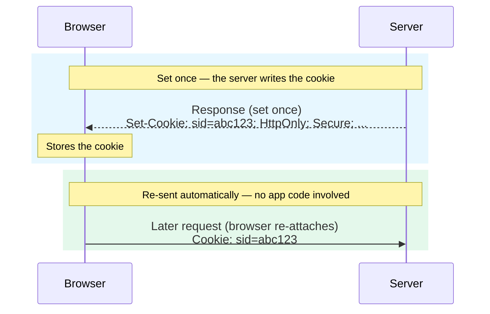

import Figure from '../../../components/figures/Figure.astro';
import SetCookieAnatomy from '../../../components/lessons/013/1/SetCookieAnatomy.astro';
import SameSiteMatrix from '../../../components/lessons/013/1/SameSiteMatrix.astro';
import AnnotatedCode from '../../../components/code/annotated-code/AnnotatedCode.astro';
import AnnotatedStep from '../../../components/code/annotated-code/AnnotatedStep.astro';
import CodeVariants from '../../../components/code/code-variants/CodeVariants.astro';
import CodeVariant from '../../../components/code/code-variants/CodeVariant.astro';
import CodeTooltips from '../../../components/code/CodeTooltips.astro';
import Term from '../../../components/ui/Term.astro';
import Matching from '../../../components/exercises/matching/Matching.astro';
import Pair from '../../../components/exercises/matching/Pair.astro';
import Buckets from '../../../components/exercises/buckets/Buckets.astro';
import Bucket from '../../../components/exercises/buckets/Bucket.astro';
import Item from '../../../components/exercises/buckets/Item.astro';
import StackBlitzCallout from '../../../components/embeds/StackBlitzCallout.astro';
import ExternalResource from '../../../components/ui/ExternalResource.astro';
import { CardGrid } from '@astrojs/starlight/components';

You can keep a user logged in across hundreds of requests without your app re-sending their credentials even once. The mechanism is the cookie, and the reason it works is also the reason it is dangerous: the browser attaches a cookie automatically, on every matching request, with no application code involved. That makes a cookie an **<Term definition="A credential the browser sends on its own, without your code ever attaching it.">ambient credential</Term>**. The automatic attachment is the whole feature — sessions stay alive for free. It is also the whole threat — a request the user never meant to make carries their cookie too.

You already have the pieces this lesson sits on. The previous chapters built the HTTP request/response contract and the origin and CORS trust boundary, so you can read a response header and you know what "same-site" and "cross-site" mean. The cookie is the small piece of state that rides every same-site request, and it is the substrate that sessions, CSRF defenses, and server-set preferences will all be built on later in the course.

Every attribute you can put on a `Set-Cookie` header exists to constrain that ambient transmission: *when* the browser re-attaches the cookie, *who* can read it on the page, and *where* it survives. By the end of this lesson you will be able to read each attribute on a real header and say exactly what it prevents. More importantly, you will have one line committed to memory — the safe default you paste into every cookie-writing call for the rest of the course:

```http
Set-Cookie: __Host-sid=<value>; HttpOnly; Secure; SameSite=Lax; Path=/; Max-Age=2592000
```

Do not try to parse that line yet. Hold it as the destination. You will walk it left to right, one attribute at a time, then reassemble it at the end and be able to recite it.

## How the browser sends a cookie back

Before any single attribute, lock in the round trip, because every attribute is a condition checked against it.

The server writes a cookie exactly once, with a `Set-Cookie` response header. The browser stores it. Then, on every subsequent request that matches the cookie's conditions, the browser attaches it as a `Cookie` request header — automatically. Your application code does not read the cookie out of storage and pin it to the request. The browser does, every time, in the background. The diagram below traces that round trip end to end.

<Figure caption="The app code never attaches the cookie — the browser does, on every matching request.">

</Figure>

That automatic re-attachment is the reason the attributes exist. Each one is a rule the browser checks *before* it decides to attach the cookie again. Tighten the rules and the browser attaches the cookie in fewer situations; that is the entire game.

One header sets one cookie. The shape is always the same:

```http
Set-Cookie: name=value; Attribute1; Attribute2=value
```

The name/value pair comes first; the attributes follow, separated by semicolons. Some attributes are bare flags (`HttpOnly`), some take a value (`Path=/`). There is one exception to the rule you learned earlier that a given HTTP header appears once in a response: a response may carry several `Set-Cookie` headers, one per cookie it wants to set. `Set-Cookie` is the header that legitimately repeats.

Here is one full header with every part labeled, so you have a map before we read it row by row.

<Figure caption="The rest of this lesson walks these left to right — what each controls, what breaks without it, and the safe default.">
  <SetCookieAnatomy />
</Figure>

From here, each attribute gets the same three-beat treatment: what it controls, what breaks without it, and the default an experienced engineer reaches for without thinking.

## `HttpOnly` — keep the cookie out of JavaScript's reach

**What it controls.** With `HttpOnly` set, the cookie is invisible to JavaScript. `document.cookie` cannot see it; no script on the page can read it. The browser still attaches it to requests exactly as before — only the JavaScript *read* path is closed.

**What breaks without it.** The failure mode is exfiltration through <Term definition="Cross-site scripting — untrusted input that ends up executing as script inside your page. You will treat it in depth in a later security chapter.">XSS</Term>. If an attacker gets script running on your page and finds an unescaped sink, one line is enough to read every cookie JavaScript can see and ship it to their server. A session cookie without `HttpOnly` is a session that can be stolen and replayed from anywhere.

**The nuance most people miss.** `HttpOnly` does not stop XSS. It stops one specific thing: a script *reading* the cookie value. A script can still make authenticated requests from inside the page — `fetch('/transfer', { method: 'POST' })` runs in the user's session, and the browser still attaches the cookie to that request because the browser, not the script, attaches it. So `HttpOnly` is defense-in-depth: it cuts off the most common and most damaging path (steal the cookie, replay it elsewhere, indefinitely) without curing the underlying bug. Treat it as a wall that removes a class of attack, not a cure.

**The default.** Every session-bearing cookie is `HttpOnly`. The only cookies you leave readable are ones the client UI genuinely must read — a `theme=dark` preference the page applies, or a CSRF double-submit token the client echoes back.

```http
Set-Cookie: sid=abc123; HttpOnly
Set-Cookie: theme=dark
```

The first is a session ID the browser will carry but no script can read. The second is a preference the UI reads to paint the page — no `HttpOnly`, on purpose.

## `Secure` — only travel over HTTPS

**What it controls.** A `Secure` cookie is attached only on HTTPS requests. Over plaintext HTTP, the browser leaves it behind.

**What breaks without it.** Plaintext HTTP is rare in 2026, but it is not extinct — a captive-portal redirect on café wifi, a misconfigured corporate proxy, a stray internal link still produce an HTTP leg now and then. On any such leg, a cookie without `Secure` is attached in the clear, and an **<Term definition="Anyone positioned on the network path who can read or modify unencrypted traffic — the classic coffee-shop sniffer.">on-path attacker</Term>** reads it straight off the wire.

**Local development.** Browsers treat `http://localhost` as a secure context for most web APIs, but `Secure`-cookie behavior on plain localhost is inconsistent across browsers. The local HTTPS setup you configured earlier with mkcert sidesteps this entirely — you develop over HTTPS locally, so `Secure` cookies behave exactly as they will in production.

**The default.** Every cookie is `Secure`. The only thing that flips it off is a legacy HTTP test fixture, which you will almost never meet on this stack.

```http
Set-Cookie: sid=abc123; HttpOnly; Secure
```

## `SameSite` — the load-bearing attribute

This is the one that carries the most weight, so we go slow here. `SameSite` decides whether the browser attaches the cookie on requests that *originate from another site*. It is the single line that separates a session that survives a <Term definition="Cross-site request forgery — a malicious site causing the user's browser to fire an authenticated request the user never intended.">CSRF</Term> attack from one that hands the attacker a logged-in session.

It takes three values. Read them as a spectrum from strictest to loosest.

**`Strict`** — the cookie is attached *only* on same-site requests. Even a <Term definition="The user's address bar actually changing to your site — as opposed to a background request or an embedded sub-resource.">top-level navigation</Term> coming from a third party does not carry it. If a user clicks a link to your app from their email client, that first request arrives with no cookie; your server sees a logged-out user until they navigate again. That is the strongest CSRF defense and the worst sign-in UX — the classic symptom is a magic-link click that lands looking logged-out until the user refreshes. Reserve `Strict` for a few highly sensitive sub-cookies. It is not your session default.

**`Lax`** — the cookie is attached on same-site requests *and* on top-level **<Term definition="HTTP methods that only read and never change state — GET and HEAD.">safe-method</Term>** navigations from a third party: an `<a href>` click, a `GET` form submission. It is **not** attached on cross-site `POST`, on `` or `<iframe>` loads, or on cross-site `fetch`. This is the default for session cookies, and the reason is precise: it preserves the email-link UX (the top-level GET navigation still carries the session) while removing the CSRF attack surface (the cross-site POST does not). One historical note worth knowing: in 2020 Chrome made `Lax` the *implicit* default when the attribute is absent, and other browsers followed. You still write it explicitly — relying on an implicit default is how subtle behavior differences slip in across browsers and versions.

**`None`** — the cookie is attached on every request, same-site or cross-site, including third-party embeds. It requires `Secure`; set `SameSite=None` without `Secure` and the browser rejects the cookie outright. Reserve `None` for a legitimate cross-site need — a payment iframe, an authenticated widget embedded on another site. And there is a 2026 complication: `SameSite=None` *without* the `Partitioned` attribute is now blocked by Safari and Firefox by default and increasingly degraded in Chrome. We will get to `Partitioned` shortly; for now, know that bare `SameSite=None` is no longer a thing you can rely on.

**The payoff — what `Lax` prevents.** Picture the classic CSRF attack. A user is logged in to your app. They visit a malicious page in another tab. That page silently submits a form that POSTs to your app's transfer endpoint. Without `SameSite`, the browser would attach the session cookie to that cross-site POST, your server would see an authenticated request, and the transfer would go through — an action the user never authored. With `SameSite=Lax`, the browser does not attach the cookie to that cross-site POST. Your server sees an unauthenticated request and refuses. This is why `SameSite=Lax` combined with putting every state-changing endpoint behind POST/PUT/DELETE retires the bulk of the CSRF problem. (Token-based CSRF defenses and exactly what `Lax` leaves uncovered are a later chapter's job — `Lax` plus state-changing methods is the floor, not the whole story.)

The grid below is the fastest way to see why `Lax` is the sweet spot. Read each value across the three request shapes it might face.

<Figure caption="The Lax row is the safe default — it keeps sign-in links working and blocks the CSRF POST. Strict breaks the link; None blocks nothing.">
  <SameSiteMatrix />
</Figure>

Notice the shape of the `Lax` row: it is the only one that says yes to the cross-site GET navigation (so sign-in links keep working) and no to the cross-site POST (so the CSRF attack fails). `Strict` says no to both — secure, but it breaks the link. `None` says yes to everything — convenient, and wide open. `Lax` is the line that threads the needle, which is why it is the default.

```http
Set-Cookie: sid=abc123; HttpOnly; Secure; SameSite=Lax
```

## `Path` — scoping convenience, not a security boundary

**What it controls.** A cookie with `Path=/admin` is attached only on requests whose pathname starts with `/admin`. It is a prefix filter on the path.

**The trap.** If you omit `Path`, the browser does not default to `/`. It defaults to the directory of the page that set the cookie — usually a sub-path. Set a cookie on `/admin/login` with no `Path`, and it quietly will not attach on `/admin/users`. The bug looks like a session that randomly disappears as the user moves around the app, and it is maddening to track down. So you set `Path=/` explicitly and the cookie attaches across the whole app.

**The default.** `Path=/`.

:::caution
`Path` is **not** a security boundary. It filters which requests carry the cookie, but it does not isolate cookies from each other. Any same-origin script can read across paths if the cookies share a name. Use `Path` for scoping convenience only — never lean on it to keep one part of your app's cookies away from another.
:::

```http
Set-Cookie: sid=abc123; HttpOnly; Secure; SameSite=Lax; Path=/
```

## `Domain` — host-only by default, or you leak to every subdomain

**What it controls.** Write `Domain=acme.com` and the cookie is attached on `acme.com` *and every subdomain under it*.

**The default is to leave it off.** Omit `Domain` entirely and the cookie becomes host-only — attached only to the exact host that set it. That is what you want for a session.

**What breaks when you reach for it "to be safe."** This is the trap, and it is the opposite of the instinct that causes it. `Domain=acme.com` sends the cookie to `app.acme.com`, `api.acme.com`, *and* `marketing.acme.com`. A session scoped to your app should never be readable by the marketing subdomain — which might run a CMS with a far lower security bar, the kind of place where one compromised plugin now has your users' sessions. Writing `Domain` to feel safer is how you widen the blast radius. The exact-host scope you get by leaving it off is the safer one.

```http
Set-Cookie: sid=abc123; HttpOnly; Secure; SameSite=Lax; Path=/
Set-Cookie: sid=abc123; Domain=acme.com
```

The first cookie is host-only — only the host that set it gets it back. The second is handed to every subdomain of `acme.com`. Reach for the second only when cross-subdomain attachment is the explicit, intended feature.

## `Max-Age` and `Expires` — how long the cookie lives

**What they control.** `Max-Age` is a lifetime in seconds from now — `Max-Age=2592000` is thirty days. `Expires` is an absolute date in HTTP-date format. When both are present, `Max-Age` wins, and it is the one you reach for: seconds-from-now has no clock-skew ambiguity, while an absolute date depends on the client's clock being right.

**The session-cookie surprise.** Set *neither* attribute and you have created what the spec calls a session cookie — one that is supposed to live until the browser closes. The problem is "until the browser closes" is fiction on the platforms most of your users are on. Mobile browsers and any browser configured to restore tabs keep "session" cookies alive across restarts. In practice an unbounded session cookie is closer to permanent than to "this sitting." So you do not rely on tab-close to expire a session — you set `Max-Age` to the lifetime you actually want, and expiry becomes predictable. (`Max-Age=0` is the other useful value: it deletes the cookie immediately.)

**The ceiling.** Chrome and Firefox cap cookie lifetimes at **400 days** (per the cookie spec). Ask for more and the value is silently clamped down. Worth knowing so a "1 year, no wait, 2 years" change does not silently do nothing.

```http
Set-Cookie: sid=abc123; HttpOnly; Secure; SameSite=Lax; Path=/; Max-Age=2592000
```

## `__Host-` and `__Secure-` — naming prefixes the browser enforces

Here is a different kind of mechanism. `__Host-` and `__Secure-` are not attributes — they are *name prefixes*, and the browser treats them as a contract. If a cookie's name starts with one of these prefixes, the browser checks that the cookie satisfies a set of attribute constraints, and if it does not, the browser rejects the entire `Set-Cookie` header. The naming convention becomes browser-enforced policy.

:::tip
A `__Host-` cookie must be set with `Secure`, must have **no** `Domain` attribute, and must use `Path=/`. Satisfy all three or the browser drops it. The result is a cookie that is host-locked at the browser level. `__Secure-` is the relaxed sibling: it requires only `Secure`, and leaves `Domain` and `Path` unrestricted.
:::

**What they prevent.** The failure mode is a subdomain attacker planting a cookie that the parent domain then trusts. Suppose an attacker controls `evil.acme.com`. Without prefixes, they could set a cookie with `Domain=acme.com` and a session-shaped name, and `app.acme.com` might read it and treat it as a real session. The `__Host-` prefix closes this off at the browser level: a `__Host-` cookie cannot carry `Domain`, so a write from `evil.acme.com` can never land a `__Host-sid` cookie that `app.acme.com` reads. The prefix is a guarantee the browser enforces no matter what the server sends.

**The default.** Prefix session cookies with `__Host-` whenever you do not need cross-subdomain attachment — which is most of the time. `__Host-` is the 2026 default for new code. When you genuinely need a cookie shared across subdomains, `__Secure-` is the relaxed alternative that lets you set `Domain`.

**The interaction to remember.** A `__Host-` cookie *cannot* carry `Domain` — the two are mutually exclusive. You pick one: host-locked with `__Host-`, or shared with `__Secure-` plus `Domain`. You cannot have both.

```http
Set-Cookie: __Host-sid=abc123; HttpOnly; Secure; SameSite=Lax; Path=/
Set-Cookie: __Host-sid=abc123; Domain=acme.com
```

The first is valid — host-locked, all three constraints satisfied. The second is rejected by the browser before it is ever stored: a `__Host-` name with a `Domain` attribute breaks the contract.

## `Partitioned` (CHIPS) and the 2026 third-party-cookie reality

The last attribute only matters in one situation — when your cookie has to work *cross-site* — and that situation is the most changed corner of the web in the last few years. So we take the attribute and the reality together, because the reality is what motivates the attribute.

**`Partitioned`.** A <Term definition="Part of CHIPS — Cookies Having Independent Partitioned State — the spec name for the Partitioned attribute.">`Partitioned` cookie</Term> is keyed not just by its own origin but by the *top-level site* embedding it. The same widget embedded on `news.com` and on `blog.com` ends up with two completely separate cookie jars — neither can see the other's. The cookie still works inside each site; it just cannot be the same cookie across sites.

**What it prevents.** A single shared **<Term definition="A cookie set under a different site than the one in the address bar.">third-party cookie</Term>** is exactly the tracking primitive privacy work has been dismantling: one widget, embedded everywhere, reading the same cookie on every site and stitching your browsing together. Partitioning breaks that by giving each top-level site its own jar. This is why Safari and Firefox already block unpartitioned third-party cookies, and why `Partitioned` is the path forward rather than a workaround.

:::note[CHIPS in one line]
`Partitioned` must be combined with `Secure` and `SameSite=None`. Bare `SameSite=None; Secure` is now degraded by browsers; `Partitioned` is what restores a working cross-site cookie. During the transition you set **both** — `SameSite=None; Secure; Partitioned` — so `Partitioned` is honored where it is supported and the bare pair is the fallback where it is not.
:::

**The default for the cross-site case.** Shipping an embedded widget, a payment iframe, or any legitimate cross-site cookie? The shape is `Secure; SameSite=None; Partitioned`, with `__Host-` recommended on top (the canonical CHIPS example uses it).

```http
Set-Cookie: __Host-widget=abc123; Secure; SameSite=None; Partitioned; Path=/
```

**The 2026 reading, kept short.** Here is where things actually stand, because it changes what you can rely on. Safari and Firefox block third-party cookies by default and have for years. Google confirmed in April 2025 that it will *not* deprecate third-party cookies in Chrome and will not ship a standalone choice prompt — it keeps the controls inside Chrome's existing privacy settings. In October 2025 Google retired most of the Privacy Sandbox APIs but explicitly continues to support CHIPS, <Term definition="Federated Credential Management — the browser API replacing third-party-cookie-based federated sign-in.">FedCM</Term>, and Private State Tokens. The conclusion to carry is this: third-party cookies are *not* dead in Chrome, but they *cannot be relied on* — a growing share of users sit behind settings that block them — and `Partitioned` (CHIPS) is the one cross-site cookie mechanism that survives across all browsers and that Google has committed to. The work of cross-site analytics and ad attribution has mostly moved off third-party cookies and onto first-party data, FedCM, and server-to-server channels; that is out of scope here, but now you know which way it went.

## The safe default, assembled and read aloud

You have walked every attribute. Reassemble them and the destination line from the start of the lesson reads as a sentence:

<AnnotatedCode lang="http" code={`
Set-Cookie: __Host-sid=<value>; HttpOnly; Secure; SameSite=Lax; Path=/; Max-Age=2592000
`}>
  <AnnotatedStep meta={`"__Host-sid"`} color="blue">
    **Host-locked name.** The browser enforces `Secure`, no `Domain`, and `Path=/`, so no subdomain can plant this cookie.
  </AnnotatedStep>

  <AnnotatedStep meta={`"HttpOnly"`} color="blue">
    **No JavaScript read.** Even if XSS runs on the page, it cannot read the session out to exfiltrate it.
  </AnnotatedStep>

  <AnnotatedStep meta={`"Secure"`} color="blue">
    **HTTPS only.** The cookie never travels on a plaintext leg where it could be sniffed.
  </AnnotatedStep>

  <AnnotatedStep meta={`"SameSite=Lax"`} color="blue">
    **Attached on top-level same-site navigations, withheld on cross-site POSTs.** Sign-in links work, CSRF POSTs fail.
  </AnnotatedStep>

  <AnnotatedStep meta={`"Path=/"`} color="blue">
    **Scoped to the whole app**, not the sub-path that happened to set it.
  </AnnotatedStep>

  <AnnotatedStep meta={`"Max-Age=2592000"`} color="blue">
    **Expires in 30 days, predictably** — not "whenever the browser closes," which on mobile is approximately never.
  </AnnotatedStep>
</AnnotatedCode>

Read straight through: host-locked name, no JavaScript read, HTTPS only, attached on top-level same-site navigations, scoped to the whole app, expires in thirty days. That is the line. Commit it to memory; you will paste it, in one form or another, into every cookie-writing call you make for the rest of this course.

The default is the starting point. You move off it only when a named feature demands it, and there are exactly four triggers worth memorizing:

- **Cross-site embed** (widget, payment iframe) — drop `SameSite=Lax` for `SameSite=None; Partitioned` (keep `Secure`).
- **The client must read the value** (a `theme` preference, a double-submit CSRF token) — drop `HttpOnly`.
- **Cross-subdomain sharing is the feature** — drop `__Host-` for `__Secure-` and add `Domain`.
- **A legacy HTTP test fixture** — drop `Secure`. Rare on this stack.

Everything else stays on the default.

## Reading and writing cookies in Next.js

You have been reading raw `Set-Cookie` header strings, because the wire format is the thing to understand. In your app you will rarely hand-write that string — you call a helper, and the helper builds the header for you. In Next.js that helper is `cookies()`.

First, where it runs. The App Router has three server execution contexts — **Server Components**, **Server Actions**, and **Route Handlers** (you will meet each in depth in later units; here we just name them). Those are the call sites for `cookies()`. And one hard rule up front: in the App Router (Next.js 16), `cookies()` is **async**. The `await` is not optional.

Here are the three operations. Notice the write call: its option bag maps one-to-one onto the attribute table you just learned.

<CodeVariants>
  <CodeVariant label="Read">
    ```ts
    const sid = (await cookies()).get('__Host-sid')?.value;
    ```
    **Works in any server context** — Server Component or Route Handler. `await` is required because `cookies()` is async. Returns `undefined` if the cookie isn't set.
  </CodeVariant>

  <CodeVariant label="Write">
    ```ts
    (await cookies()).set({
      name: '__Host-sid',
      value,
      httpOnly: true,
      secure: true,
      sameSite: 'lax',
      path: '/',
      maxAge: 60 * 60 * 24 * 30,
    });
    ```
    **Runs in a Server Action or Route Handler.** Every key is one row of the attribute table — `httpOnly`, `secure`, `sameSite: 'lax'`, `path`, `maxAge` (seconds; this is 30 days written so the math reads). Add `partitioned: true` when you need the CHIPS cross-site cookie.
  </CodeVariant>

  <CodeVariant label="Delete">
    ```ts
    (await cookies()).delete('__Host-sid');
    ```
    **Removes the cookie.** Equivalent to setting it with `maxAge: 0`. Like writing, only valid in a Server Action or Route Handler.
  </CodeVariant>
</CodeVariants>

The write call is worth one more pass, because the option-to-attribute mapping is the whole point — if you know the header, you know the option bag.

<CodeTooltips tooltips={{
  'httpOnly: true': 'Sets the HttpOnly flag on the header.',
  "sameSite: 'lax'": 'Sets SameSite=Lax. Lowercase string in the API; capitalized on the wire.',
  'maxAge: 60 * 60 * 24 * 30': 'Sets Max-Age in seconds. This is 30 days.',
}}>
```ts
(await cookies()).set({
  name: '__Host-sid',
  value,
  httpOnly: true,
  secure: true,
  sameSite: 'lax',
  path: '/',
  maxAge: 60 * 60 * 24 * 30,
});
```
</CodeTooltips>

Now the one constraint to internalize: **cookies can only be written from a context that has not started streaming the response.** That means Server Actions and Route Handlers — never a Server Component while it is rendering markup. Call `set` from a Server Component and it throws. The reasoning (a `Set-Cookie` header has to be decided before the response body starts flowing) belongs to a later unit; for now, hold the rule: read anywhere on the server, write only in Server Actions and Route Handlers.

There is one more rule that trips people up constantly, and it falls straight out of the round trip from the start of the lesson.

:::caution
Setting a cookie and reading it back in the **same** request does not work. `set` schedules a `Set-Cookie` header on the *response* you are about to send. The value only shows up on the *next* request the browser makes, once it has stored the cookie and started re-attaching it. If your code sets a cookie and then immediately reads it expecting the new value, you will get the old one (or nothing). Plan for the round trip.
:::

One word on the client, so you know the boundary. `document.cookie` reads non-`HttpOnly` cookies as a single semicolon-separated string. You will not write a `document.cookie` parser in this course — when the client needs a cookie's value, the move is to read it server-side in a Server Action or Route Handler and pass the value down, not to parse the string in the browser.

## Practice

Two drills to lock this in. The first tests whether you can look at a real header and name what it does or what it breaks; the second tests the decision the whole lesson is about — given a requirement, which cookie shape do you reach for.

Match each `Set-Cookie` header to the outcome it produces.

<Matching instructions="Match each Set-Cookie header to the outcome it produces.">
  <Pair>
    <Fragment slot="left">`__Host-sid=…; HttpOnly; Secure; SameSite=Lax; Path=/`</Fragment>
    <Fragment slot="right">Safe: the host-locked session default.</Fragment>
  </Pair>
  <Pair>
    <Fragment slot="left">`sid=…; SameSite=None` (no `Secure`)</Fragment>
    <Fragment slot="right">Silently rejected by the browser — `SameSite=None` requires `Secure`.</Fragment>
  </Pair>
  <Pair>
    <Fragment slot="left">`__Host-sid=…; Secure; Path=/; Domain=acme.com`</Fragment>
    <Fragment slot="right">Rejected: a `__Host-` cookie cannot carry `Domain`.</Fragment>
  </Pair>
  <Pair>
    <Fragment slot="left">`sid=…; Secure; SameSite=Lax; Path=/` (no `HttpOnly`)</Fragment>
    <Fragment slot="right">Readable by XSS via `document.cookie` — the session can be exfiltrated.</Fragment>
  </Pair>
  <Pair>
    <Fragment slot="left">`sid=…; HttpOnly; Secure; SameSite=Lax; Domain=acme.com`</Fragment>
    <Fragment slot="right">Leaks the session to every subdomain, including marketing.</Fragment>
  </Pair>
  <Pair>
    <Fragment slot="left">`widget=…; Secure; SameSite=None` (no `Partitioned`)</Fragment>
    <Fragment slot="right">Degraded or blocked cross-site — needs `Partitioned` in 2026.</Fragment>
  </Pair>
</Matching>

Now the decision. Each item is a real requirement; drop it into the cookie shape that requirement calls for.

<Buckets twoCol instructions="Each item is a requirement. Sort it into the cookie configuration it calls for.">
  <Bucket name="session" label="Session default" description="__Host-; HttpOnly; Secure; SameSite=Lax; Path=/" />
  <Bucket name="readable" label="Drop HttpOnly" description="The client must read the value" />
  <Bucket name="embed" label="Cross-site embed" description="Secure; SameSite=None; Partitioned" />

  <Item bucket="session">The signed-in user's session ID.</Item>
  <Item bucket="session">A state-changing POST endpoint that should refuse cross-site requests.</Item>
  <Item bucket="readable">A `theme=dark` preference the UI toggles and applies.</Item>
  <Item bucket="readable">A double-submit CSRF token the client echoes back in a header.</Item>
  <Item bucket="embed">A cookie for a payment iframe embedded on another site.</Item>
  <Item bucket="embed">An authenticated widget you ship onto partner sites.</Item>
</Buckets>

If you want to see a real cookie land in the browser, the optional sandbox below sets the default cookie from a Next.js Route Handler. Hit it, then open DevTools, go to Application, and find the cookie under Cookies — each attribute shows up in its own column, exactly as the header described.

:::note[Optional — enrichment, not required]
This is a hands-on aside, not part of the lesson's spine. The attribute table above is the thing to learn; this just lets you watch one real cookie land. Skip it with nothing lost.
:::

The sandbox below boots a real Next.js (App Router) dev server in your browser — no install on your machine. It starts as the empty hello-world template; you add one Route Handler, hit it, and read the cookie jar.

<StackBlitzCallout
  mode="github"
  repo="vercel/next.js/tree/canary/examples/hello-world"
  file="app/page.tsx"
  view="both"
  terminal="dev"
  startScript="dev"
  ctl
  title="Next.js Route Handler that sets the safe-default cookie"
  label="Open the cookie sandbox"
  height={640}
>
  A live Next.js dev server. Add the Route Handler below, hit `/api/cookie`, then read the jar in DevTools.
</StackBlitzCallout>

Once the preview is running, create a new file at `app/api/cookie/route.ts` and paste this in. It is the exact write call from the table above, wrapped in a `GET` handler that returns a one-line confirmation:

```ts
import { cookies } from 'next/headers';

export async function GET() {
  (await cookies()).set({
    name: '__Host-sid',
    value: 'demo-session-id',
    httpOnly: true,
    secure: true,
    sameSite: 'lax',
    path: '/',
    maxAge: 60 * 60 * 24 * 30,
  });

  return Response.json({ set: '__Host-sid' });
}
```

Then drive the round trip:

1. In the preview pane's address bar, navigate to `/api/cookie`. You will see `{"set":"__Host-sid"}` — the handler ran and scheduled the `Set-Cookie` header on that response.
2. Open the preview in its own tab (the "Open in New Tab" control on the preview pane), then open DevTools there → **Application** → **Cookies**. Find `__Host-sid` and read across its columns: `HttpOnly` ✓, `Secure` ✓, `SameSite` `Lax`, `Path` `/`. Each column is one attribute from the header — the wire format you just learned, rendered as a table.

:::caution[One gotcha you may hit]
The `__Host-` prefix requires `Secure`, so the cookie only lands over **HTTPS**. The StackBlitz preview is served over HTTPS, so it works there. If you later run this on plain `http://localhost`, the browser may drop a `__Host-` cookie — which is exactly the local-HTTPS point from the `Secure` section above.
:::

## External resources

The references below are the ones worth keeping a tab on: the canonical attribute reference, a deep dive on the load-bearing `SameSite` attribute, the explainer for `Partitioned` and CHIPS, and a hands-on look at exactly where `SameSite` stops protecting you.

<CardGrid>
  <ExternalResource
    title="Set-Cookie — HTTP header reference"
    href="https://developer.mozilla.org/en-US/docs/Web/HTTP/Reference/Headers/Set-Cookie"
    icon="simple-icons:mdnwebdocs"
    iconColor="#000000"
    description="The canonical reference for every Set-Cookie attribute and the __Host-/__Secure- prefix rules."
  />
  <ExternalResource
    title="SameSite cookies explained"
    href="https://web.dev/articles/samesite-cookies-explained"
    icon="simple-icons:googlechrome"
    iconColor="#4285F4"
    description="The Chrome team's deep dive on Strict, Lax, and None — and why Lax is the default."
  />
  <ExternalResource
    title="CHIPS — Partitioned cookies"
    href="https://developer.mozilla.org/en-US/docs/Web/Privacy/Guides/Privacy_sandbox/Partitioned_cookies"
    icon="simple-icons:mdnwebdocs"
    iconColor="#000000"
    description="How the Partitioned attribute double-keys a cookie by top-level site, the 2026 cross-site path forward."
  />
  <ExternalResource
    title="Bypassing SameSite restrictions"
    href="https://portswigger.net/web-security/csrf/bypassing-samesite-restrictions"
    icon="simple-icons:portswigger"
    iconColor="#FF6633"
    description="PortSwigger's interactive labs showing exactly what SameSite=Lax leaves uncovered."
  />
</CardGrid>
