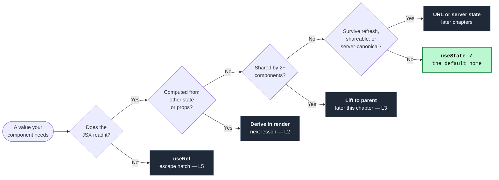

import CodeTooltips from '../../../components/code/CodeTooltips.astro';
import CodeVariants from '../../../components/code/code-variants/CodeVariants.astro';
import CodeVariant from '../../../components/code/code-variants/CodeVariant.astro';
import Buckets from '../../../components/exercises/buckets/Buckets.astro';
import Bucket from '../../../components/exercises/buckets/Bucket.astro';
import Item from '../../../components/exercises/buckets/Item.astro';
import PredictOutput from '../../../components/exercises/predict-output/PredictOutput.astro';
import PredictWhy from '../../../components/exercises/predict-output/PredictWhy.astro';
import Figure from '../../../components/figures/Figure.astro';
import Term from '../../../components/ui/Term.astro';
import VideoCallout from '../../../components/embeds/VideoCallout.astro';
import ExternalResource from '../../../components/ui/ExternalResource.astro';
import { CardGrid } from '@astrojs/starlight/components';

Every component eventually needs to hold a value that changes over time and drives what the user sees — a counter, a toggle, the currently selected tab, a half-typed form field. In the previous chapter you met the answer to that need: `useState`, "the setter that schedules a re-render." That was a three-sentence primer, enough to follow the render model. Now we install the full surface.

The surface is small. There is one function, it returns two things, and you already know what they roughly do. So the value of this lesson is not the API — you could memorize it in a minute. The value is the *judgment* around it, because `useState` is the first hook everyone learns and the one they reach for reflexively, long before they ask whether they should. Four questions decide whether a `useState` call is right or quietly wrong: what is its type, does its initializer run every render or once, does reading a prop into it freeze that prop, and — the question that comes before all the others — does this value belong in state at all.

By the end you'll read any `useState(...)` call and answer all four at a glance. We'll lean on what you already carry from the render model: state is a snapshot, the setter only asks for a new render, and updates produce new references rather than mutations. This lesson cashes those in at the call site rather than re-deriving them, and closes by mapping out the *other* homes a value can live in — because half of what beginners stuff into `useState` belongs somewhere else entirely.

## The signature: a snapshot and a stable setter

Here is the whole surface in one line:

```tsx
const [count, setCount] = useState(0);
```

<Term definition="A React hook is a function whose name starts with use that lets a component tap into React features like state. Called at the top of the component, unconditionally, in the same order every render.">`useState`</Term> returns a **two-element tuple**: the current value and a function that updates it. That's it. Everything else is naming and timing.

Read the destructuring carefully, because it explains why the names are yours to choose. `const [count, setCount] = ...` is *array* destructuring — it pulls items out by **position**, not by key. The first slot is the value, the second is the setter, and the names you bind them to are arbitrary. Object destructuring would force you to match property names; array destructuring frees you, which is why every codebase can settle on a convention instead of a fixed API name.

That convention is worth following exactly, because it's load-bearing for readers: the value gets a noun, and the setter is `set` plus that same noun — `setCount`, `setUser`, `setIsOpen`. Booleans read as predicates, so an open/closed flag is `isOpen` with a `setIsOpen`, never `open`. When you see `setUser` anywhere in a file, you know without scrolling that a `user` lives nearby in state.

Now the timing, which is where the judgment starts. Three facts about this single line:

**The initializer is a mount concern.** `useState(0)` uses `0` on the **first render only** — the moment the component <Term definition="Mount is a component's first render: React has no previous tree for it, so it runs the function, creates the state slots, and commits the result to the DOM for the first time.">mounts</Term>. On every render after that, React already holds the current value and ignores the argument entirely. This matters more than it looks: the argument is evaluated *and then thrown away* on every update. For `0` that costs nothing. For something heavier, it's the seed of a real problem we'll fix two sections from now.

**The setter is stable across renders.** `setCount` is the *same function reference* on render 1, render 50, and render 500. This is a guarantee React gives you, not something you derive. It pays off in two places you'll meet later: a stable function can sit in an effect's dependency list without causing the effect to re-run (the next chapter's subject), and React's compiler leans on stable identities to memoize correctly. One sentence each for now — just file the guarantee away.

**The value is a snapshot; the setter only asks for a new render.** `count` is this render's <Term definition="A snapshot is the value a piece of state holds for the duration of one render. It never changes mid-render; calling the setter schedules a future render with a new snapshot rather than mutating the current one.">snapshot</Term> — frozen for the life of this render. Calling `setCount` doesn't change `count` in place; it schedules a re-render with a fresh snapshot. You already saw the consequence in the previous chapter: three `setCount(count + 1)` calls in a row increment by one, not three, because all three read the same frozen `count`. That snapshot rule isn't a special case — it holds at *every* `useState` call site, which is why the updater form `setCount((c) => c + 1)` exists: it reads the latest queued value instead of the stale snapshot.

Here is the canonical counter with each piece labeled. Hover the underlined tokens.

<CodeTooltips tooltips={{
  useState: 'React hook. Returns a [value, setter] tuple. Re-runs the component when the setter is called.',
  setCount: 'Stable across renders — same function reference every time. Schedules a re-render; never mutates count in place.',
  '0': 'Initial value. Used on the first render only; ignored on every render after mount.',
}}>
```tsx
import { useState } from 'react';

export const Counter = () => {
  const [count, setCount] = useState(0);

  return (
    <button onClick={() => setCount((c) => c + 1)}>
      Clicked {count} times
    </button>
  );
};
```
</CodeTooltips>

That one block carries the entire signature. Everything that follows is a decision layered on top of it.

## Typing useState: inference by default, annotate on purpose

`useState` is fully typed, and most of the time you write no annotation at all. The initial value *is* the type signal:

```tsx
const [count, setCount] = useState(0);      // number
const [name, setName] = useState('');       // string
const [isOpen, setIsOpen] = useState(false); // boolean
```

<Term definition="Type inference is TypeScript deducing a type from a value without an explicit annotation. useState(0) infers number from the argument.">Inference</Term> reads `0` as `number`, `''` as `string`, `false` as `boolean`, and the setter is typed to accept exactly that. This is the common case, so lead with it: don't reach for `useState<number>(0)`. The annotation is noise the initial value already provides, and the course's standing reflex is inference-led at the boundaries, annotations only at the seams.

The seams are the four cases where the initial value **can't represent the full range the state will hold**. These are where beginners get burned, and the first one is the single most common `useState` typing bug there is.

The empty array. `useState([])` looks innocent and infers `never[]` — an array that can hold *nothing*. The moment you try to add an item, TypeScript rejects it, because `never[]` is exactly the type of "an array with no possible element type." Watch the two versions:

<CodeVariants>
  <CodeVariant label="Inferred — never[]">
    <div data-mark-color="red">

    ```tsx {5}
    const [todos, setTodos] = useState([]);

    // Type error: Argument of type 'Todo' is not
    // assignable to parameter of type 'never'.
    setTodos([...todos, newTodo]);
    ```

    </div>
    **Type error.** `[]` gives TypeScript nothing to infer from, so it lands on `never[]` — an array that can never hold an element. `todos` is unusable the moment you add to it.
  </CodeVariant>

  <CodeVariant label="Annotated — Todo[]">
    <div data-mark-color="green">

    ```tsx "useState<Todo[]>"
    const [todos, setTodos] = useState<Todo[]>([]);

    setTodos([...todos, newTodo]);
    ```

    </div>
    **The annotation is the shape signal the empty literal can't give.** Now the array is known to hold `Todo`s, and adding one type-checks.
  </CodeVariant>
</CodeVariants>

The fix generalizes. Whenever the initial value is a placeholder that doesn't carry the full type, hand the type to `useState` directly:

```tsx
const [user, setUser] = useState<User | null>(null);
const [status, setStatus] = useState<Status>('idle');
```

`useState(null)` on its own would infer `null` — a state that can only ever be null, useless for a value that will *later* hold a `User`. The `User | null` annotation is honest about both phases, and because the project runs strict, it forces a null-check wherever you read `user` — which is exactly what you want.

The status line is the mirror image. `useState('idle')` infers `string` — too *wide* this time. The setter would accept any string at all, including typos. Annotating `useState<Status>('idle')`, where `Status` is the union `'idle' | 'loading' | 'done'`, pins the setter to the three legal values. (You met literal unions back in the TypeScript chapters; this is the same idea at a hook call site.)

So the whole typing rule collapses to one sentence:

:::note
Annotate `useState` when the initial value can't represent the full range of the state — empty collections, `null` placeholders, union members. Otherwise trust inference.
:::

Try sorting these. For each call, decide whether the initial value already carries the full type or whether it's too narrow.

<Buckets twoCol instructions="Sort each `useState` call by whether it needs an explicit type annotation. Ask: can the initial value represent the full range the state will hold?">
  <Bucket name="infer" label="Let inference win" description="Initial value is the full type" />
  <Bucket name="annotate" label="Annotate the type" description="Initial value is too narrow or null" />

  <Item bucket="infer">`useState(0)`</Item>
  <Item bucket="infer">`useState('')`</Item>
  <Item bucket="infer">`useState(false)`</Item>
  <Item bucket="infer">`useState({ x: 0, y: 0 })`</Item>
  <Item bucket="annotate">`useState([])`</Item>
  <Item bucket="annotate">`useState(null)`</Item>
  <Item bucket="annotate">`useState('idle')`</Item>
</Buckets>

## Eager vs lazy initial state

Recall the timing fact from the signature section: the initial argument is evaluated on every render and discarded on every render after the first. For `useState(0)` that's free. But look at what happens when the initializer does real work:

```tsx
const [draft, setDraft] = useState(parseDraft(getStoredDraft()));
```

Here `getStoredDraft()` reads from <Term definition="localStorage is a browser key-value store that persists across page loads. Reads and writes are synchronous and the values are strings, so seeding state from it usually means a parse step.">`localStorage`</Term> and `parseDraft` turns the raw string into an object. Both are function *calls* sitting in the component body, so they run as part of rendering — on **every single render** — then hand their result to a `useState` that ignores everything but the first. The user types in some other field, the component re-renders, and the read-and-parse happens all over again for nothing. That's wasted work on every keystroke.

The fix is one of React's small, sharp distinctions. Pass a **function** instead of a value:

```tsx
const [draft, setDraft] = useState(() => parseDraft(getStoredDraft()));
```

When React sees a function in the initializer slot, it treats it as an <Term definition="An initializer function is the () => … form passed to useState. React calls it once, on mount, to produce the initial state, then never calls it again.">initializer function</Term> and calls it **once, on mount**. Subsequent renders never touch it. Make the contrast visceral:

- `useState(parseDraft(...))` — *calls `parseDraft` now, every render.* The parens run the work immediately and React keeps the result only the first time.
- `useState(() => parseDraft(...))` — *hands React a recipe it runs once.* The `() =>` defers the work to mount.

You've seen this "pass a function, don't call it" shape before — it's the same move as the updater form `setCount((c) => c + 1)`. A bare value is consumed immediately; a function is consumed when React decides to run it.

<CodeVariants>
  <CodeVariant label="Every render">
    <div data-mark-color="orange">

    ```tsx "parseDraft(getStoredDraft())"
    const [draft, setDraft] = useState(parseDraft(getStoredDraft()));
    ```

    </div>
    **Runs `parseDraft` on every render** and discards all but the first result. A read-and-parse repeated on every unrelated keystroke.
  </CodeVariant>

  <CodeVariant label="Once, on mount">
    <div data-mark-color="green">

    ```tsx "() =>"
    const [draft, setDraft] = useState(() => parseDraft(getStoredDraft()));
    ```

    </div>
    **React calls the initializer once.** Wrapping the work in `() =>` defers it to mount; later renders skip it entirely.
  </CodeVariant>
</CodeVariants>

Now the part that's actually a decision rather than a syntax point: when is the lazy form worth it? Wrapping every initializer in `() =>` would be ceremony — `useState(() => 0)` is pointless, the literal is already free. The lazy form earns its weight at a **named threshold**. Reach for it when the initializer:

- **touches storage** — `localStorage`, `sessionStorage`,
- **parses** — JSON, a query string, anything that walks input,
- **builds a large structure** — indexing an array, deriving a lookup map,
- **measures** — reads layout off the DOM.

For a literal or a cheap expression (`useState(0)`, `useState(props.count ?? 0)`), the direct form is correct and the lazy wrapper just adds noise. This is the same "trigger before tool" instinct that runs through the whole chapter: you pay for the lazy form only when a concrete cost crosses the threshold, never prophylactically.

Two watch-outs live right here, because they're properties of the initializer itself:

**The initializer must be pure.** Same contract as the render-model chapter: no side effects, just compute and return. React's Strict Mode deliberately calls it *twice* in development to flush out impure initializers, so anything that mutates or logs will surprise you. (The mechanism behind that double-call is the next chapter's subject; for now, just keep the initializer pure.)

**Storing a function as state needs a double wrap.** This is the one place the mechanism bites. Suppose you want to keep a *function itself* in state — say a `onSubmit` callback you'll swap out later:

<CodeVariants>
  <CodeVariant label="Calls it once">
    <div data-mark-color="orange">

    ```tsx
    const [handler, setHandler] = useState(onSubmit);
    ```

    </div>
    **This calls `onSubmit()` once** and stores its return value. React treats any function in the initializer slot as an initializer to run — not a value to keep.
  </CodeVariant>

  <CodeVariant label="Stores it">
    <div data-mark-color="green">

    ```tsx "() =>"
    const [handler, setHandler] = useState(() => onSubmit);
    ```

    </div>
    **Now the initializer returns `onSubmit`**, so the function itself becomes the state. The extra `() =>` is how you store a function.
  </CodeVariant>
</CodeVariants>

This is rare in practice — you don't often store raw functions in state — but it's the one corner where "React treats a function as an initializer" produces a result you didn't ask for, so it's worth recognizing.

To make the once-vs-every-render gap concrete, predict what this prints. It's a plain-JavaScript model of `useState`: a state slot keeps its value after the first render, and `render()` runs three times to stand in for three renders of a component.

<PredictOutput
  instructions="This plain-JavaScript model stands in for `useState`: `useStateSlot` keeps its value after the first render and ignores its argument on every render after."
  expected={`eager:
expensive ran
expensive ran
expensive ran
lazy:
expensive ran`}
>

```js
let isMounted = false;
let slot;

function useStateSlot(initial) {
  if (!isMounted) {
    isMounted = true;
    slot = typeof initial === 'function' ? initial() : initial;
  }
  return slot;
}

function expensive() {
  console.log('expensive ran');
  return 42;
}

// Three renders, eager form: the argument is built every time.
isMounted = false;
console.log('eager:');
for (let r = 0; r < 3; r++) useStateSlot(expensive());

// Three renders, lazy form: the function is only called on mount.
isMounted = false;
console.log('lazy:');
for (let r = 0; r < 3; r++) useStateSlot(() => expensive());
```

<PredictWhy>`expensive()` with parentheses runs at the call site on **every** loop pass — even though `useStateSlot` keeps only the first result, the work is already done three times. The form `() => expensive()` hands over an un-called function, and the slot invokes it only on mount. That's exactly why `useState(parseDraft(...))` re-parses on every render and `useState(() => parseDraft(...))` parses once.</PredictWhy>

</PredictOutput>

## Reading a prop as initial state: the frozen copy

Here's a pattern that looks completely reasonable and trips up nearly everyone:

```tsx
const PriceInput = ({ defaultPrice }: { defaultPrice: number }) => {
  const [price, setPrice] = useState(defaultPrice);
  // ...
};
```

You seed the state from a prop. It works on first render. Then the parent changes `defaultPrice` — and the input keeps showing the *old* price. The state didn't budge.

There's no bug in React here. It's the initializer rule you already know, applied to a prop: `useState(defaultPrice)` reads `defaultPrice` **on the first render only**. After mount, React owns `price` and ignores the initializer, so the prop and the state drift apart the instant either changes. The prop is a seed, not a subscription.

The question that matters is not *how to sync them* — it's whether they should be synced at all. And the answer is encoded in the prop's **name**. This is the kind of tell an experienced engineer reads instantly:

<CodeVariants>
  <CodeVariant label="defaultPrice — deliberate seed">
    <div data-mark-color="green">

    ```tsx "defaultPrice"
    const PriceInput = ({ defaultPrice }: { defaultPrice: number }) => {
      const [price, setPrice] = useState(defaultPrice);
      // The user edits `price` freely; it should diverge.
    };
    ```

    </div>
    **Editable copy — correct.** The `default` prefix is a promise: this prop seeds the field once, then the user owns it. React and HTML both use `default*` to mean exactly this.
  </CodeVariant>

  <CodeVariant label="price — accidental freeze">
    <div data-mark-color="orange">

    ```tsx /\bprice\b/
    const PriceInput = ({ price }: { price: number }) => {
      const [priceState, setPriceState] = useState(price);
      // Parent updates `price`; this child never notices.
    };
    ```

    </div>
    **Silent bug.** A prop named `price` says *I am the source of truth, follow me* — but the state froze at mount and stopped tracking. Don't patch this with a syncing effect. Either *derive* from the prop, or *`key`-reset* — the next lesson's subject.
  </CodeVariant>
</CodeVariants>

The naming convention is doing real work. A prop named `defaultValue`, `defaultPrice`, `defaultOpen` carries a contract: *I seed you once and won't track you.* You've seen `defaultValue` on HTML inputs before — same idea, same word. That's the <Term definition="An uncontrolled input keeps its own value in the DOM, seeded once by defaultValue. React doesn't drive it on every render.">uncontrolled</Term> shape, and freezing a `default*` prop into state is the deliberate, correct version of it.

A prop named plainly — `value`, `price`, `selectedId` — implies the opposite contract: *I am the source of truth; render me.* That's a <Term definition="A controlled value lives in React state, flows down as a prop, and the child reports edits back up. The parent is the single source of truth.">controlled</Term> value, and freezing it into local state silently breaks the contract — the child stops following its own source of truth. The reflex fix that beginners reach for is a `useEffect` that copies the prop into state on every change. Resist it. It's the most consequential anti-pattern in early React, and dismantling it is the entire subject of the next lesson.

Where do the real fixes live? Two of them, and you've already met one:

- If the value is purely a **function of the prop** — derive it during render, don't store it at all. That's the next lesson.
- If it's an **editable copy that should reset** when the prop's identity changes — reach for the `key`-reset you already saw: `key={record.id}` remounts the child with a fresh seed when the record changes.

:::note
"Why did the prop change and the state didn't?" is the right question, and you now know the answer: the initializer only runs at mount. The *fix* — derive, or reset — is the next lesson's whole subject. Naming the trap is enough for now.
:::

## What useState is not for

You've installed the surface and the three judgment calls that ride on it. There's one decision left, and it's the one that comes *first* in practice: before you reach for `useState` at all, ask what kind of value you're actually holding. `useState` is the right home for a lot of values — and quietly the wrong home for a lot of others.

This is the spine of the whole chapter: **state shape is a design decision before it's a syntax decision.** `useState` is one home among several. Run any value you're about to store through this filter:

<Figure caption="The four homes for state. useState is the default at the leaf — every arrow that turns off before it points at a value that belongs somewhere else.">

</Figure>

Walk it in words, because each branch names a home the rest of the chapter will fill in:

1. **Does the JSX read it, and does it change over time on its own?** Then it's `useState`. The number on a counter, whether a dropdown is open, the active tab — these drive what's painted and change independently. This is the default, and it's what this lesson taught.
2. **Is it computed from other state or props?** Then **derive it in render** — don't store it. A cart total is just the sum of its line items; the count of completed todos is just a `.filter().length`. Storing these creates two sources of truth that can disagree. (Next lesson.)
3. **Does it persist across renders but the UI never reads it?** A `setTimeout` ID a handler needs to clear, a `<video>` element you call `.play()` on, the previous value of something — these belong in <Term definition="useRef returns a mutable box whose .current value persists across renders and does not trigger a re-render when changed. The escape hatch for values the JSX doesn't read.">`useRef`</Term>, not state. Changing them shouldn't repaint anything, and `useState` would force a render you don't want. (Later this chapter.)
4. **Do two or more components need it?** Then **lift** it to their common parent and pass it down. A search query that two sibling panels both read lives in the parent, not duplicated in each. (Later this chapter.)
5. **Should it survive a refresh, or be shareable as a link?** Then it's **URL state** — the active filter, the current page, a search term you'd want to bookmark. And if it's the canonical record on your server — the actual list of invoices — that's **server state**, fetched and cached, never copied into long-lived `useState`. (Later chapters.)

The reflex underneath all five: **start at the leaf with `useState`, and move a value outward only when a concrete trigger demands it.** Don't lift preemptively, don't reach for the URL "just in case." Colocate first; relocate on evidence.

<VideoCallout videoId="4AXQgOcL1mo" videoTitle="7 React Lessons I Wish I Knew Earlier — Code Bootcamp">
  Code Bootcamp's 7-minute roundup; the "Don't Use State for Everything" and "Derive Values Without State" chapters are this section's decision tree in motion.
</VideoCallout>

Sort these values into their proper home. A couple are deliberately tempting.

<Buckets twoCol instructions="Decide where each value belongs. Walk the filter: does the JSX read it, is it derived, is it shared, should it survive a refresh?">
  <Bucket name="usestate" label="useState" description="Local, read by JSX, changes on its own" />
  <Bucket name="ref" label="useRef" description="Persists, but the JSX never reads it" />
  <Bucket name="derive" label="Derive in render" description="Computed from other state or props" />
  <Bucket name="lift-url" label="Lift or URL state" description="Shared by siblings, or survives a refresh" />

  <Item bucket="usestate">The number shown on a counter</Item>
  <Item bucket="usestate">Whether a dropdown is open</Item>
  <Item bucket="ref">A `setTimeout` ID a handler clears</Item>
  <Item bucket="ref">A `<video>` element you call `.play()` on</Item>
  <Item bucket="derive">A cart's line-item total</Item>
  <Item bucket="derive">The count of completed todos</Item>
  <Item bucket="lift-url">A search query two sibling panels both read</Item>
  <Item bucket="lift-url">The active filter you want to survive a page refresh</Item>
</Buckets>

That filter is the map for the rest of this chapter. The next lesson takes the *derive* branch and lands the anti-pattern that springs from getting it wrong; the lessons after that take *lift*, *URL*, and the `useRef` escape hatch in turn. You now know where each lives — and, just as importantly, that `useState` was only ever one of the homes.

## External resources

The `useState` reference is worth a bookmark — it's the canonical source for the lazy initializer and the function-as-value gotcha. The "Choosing the State Structure" guide goes deeper on the "what belongs in state" question this lesson opened and the next one closes. Kent C. Dodds' note pairs the lazy initializer with the updater form in one place, and "You Might Not Need an Effect" is the official takedown of the prop-syncing reflex this lesson warns you off.

<CardGrid>
  <ExternalResource
    title="React reference — useState"
    href="https://react.dev/reference/react/useState"
    icon="simple-icons:react"
    iconColor="#61DAFB"
    description="The full API: lazy initializer, storing a function as state, and Strict Mode double-calls."
  />
  <ExternalResource
    title="Choosing the State Structure"
    href="https://react.dev/learn/choosing-the-state-structure"
    icon="simple-icons:react"
    iconColor="#61DAFB"
    description="Grouping vs. splitting state and why redundant or derived state is a smell."
  />
  <ExternalResource
    title="useState lazy init & function updates"
    href="https://kentcdodds.com/blog/use-state-lazy-initialization-and-function-updates"
    icon="lucide:square-function"
    iconColor="#7c3aed"
    description="Kent C. Dodds on why you pass a function, not call one — both at the initializer and the setter."
  />
  <ExternalResource
    title="You Might Not Need an Effect"
    href="https://react.dev/learn/you-might-not-need-an-effect"
    icon="simple-icons:react"
    iconColor="#61DAFB"
    description="The official case against syncing props into state — derive in render instead."
  />
</CardGrid>
