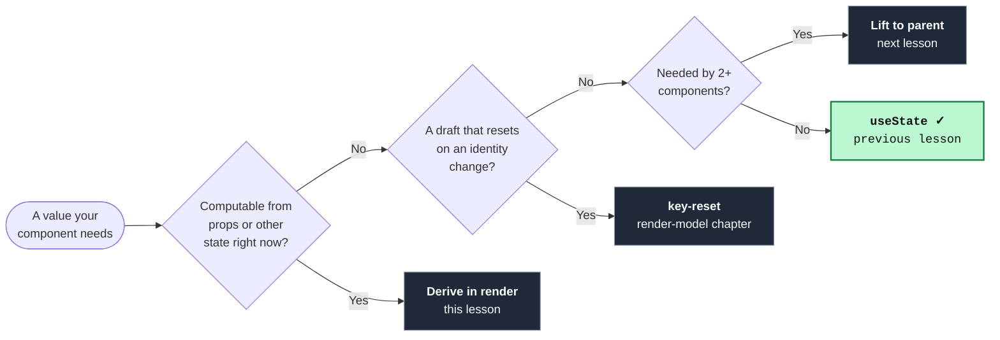

import StaleFrameSequence from '../../../components/lessons/024/2/StaleFrameSequence.astro';
import Figure from '../../../components/figures/Figure.astro';
import ReactCoding from '../../../components/live-coding/ReactCoding/ReactCoding.astro';
import Buckets from '../../../components/exercises/buckets/Buckets.astro';
import Bucket from '../../../components/exercises/buckets/Bucket.astro';
import Item from '../../../components/exercises/buckets/Item.astro';
import MultipleChoice from '../../../components/exercises/multiple-choice/MultipleChoice.astro';
import McqChoice from '../../../components/exercises/multiple-choice/McqChoice.astro';
import McqWhy from '../../../components/exercises/multiple-choice/McqWhy.astro';
import CodeVariants from '../../../components/code/code-variants/CodeVariants.astro';
import CodeVariant from '../../../components/code/code-variants/CodeVariant.astro';
import AnnotatedCode from '../../../components/code/annotated-code/AnnotatedCode.astro';
import AnnotatedStep from '../../../components/code/annotated-code/AnnotatedStep.astro';
import Term from '../../../components/ui/Term.astro';
import ExternalResource from '../../../components/ui/ExternalResource.astro';
import VideoCallout from '../../../components/embeds/VideoCallout.astro';
import { CardGrid } from '@astrojs/starlight/components';
import CourseProgressBar from '../../../components/ui/CourseProgressBar.astro';

<CourseProgressBar value={frontmatter['course-progress']} />

Here is a component you will write many times in your career. A profile shows a person's name, and that name is built from two pieces of state, `firstName` and `lastName`. You need a `fullName` to render in the heading.

The instinct almost every React beginner reaches for is to give `fullName` its own home. You add a third `useState` for it, then wire up a `useEffect` that recomputes it whenever either input changes:

```tsx
const [firstName, setFirstName] = useState('Ada');
const [lastName, setLastName] = useState('Lovelace');
const [fullName, setFullName] = useState('');

useEffect(() => {
  setFullName(firstName + ' ' + lastName);
}, [firstName, lastName]);
```

It works. The heading shows the right name. But it is wrong in three separate ways that stay hidden until they cause trouble.

It is wasteful: one keystroke does three passes of work to produce one value, because the component renders, the effect fires, and then the component renders *again*. It is briefly incorrect: for the moment between those two renders, the screen shows the *old* `fullName`. And it is fragile, because you have just created a new way to ship a bug. The day someone adds a `middleName` and forgets to list it in that dependency array, the name silently stops updating, with no error to point at the cause.

The previous lesson ended on a question to ask before reaching for `useState`: *what kind of value is this?* One of the answers was "computed from other state or props," and the instruction was to derive it in render rather than store it. This lesson is that answer in full. By the end you will recognize this shape on sight, you will know the fix is a single line of ordinary JavaScript, and you will have a rule that closes off an entire category of synchronization bugs before they are ever written.

If you want the fix first, delete the state and the effect, and write one line.

```tsx
const fullName = firstName + ' ' + lastName;
```

That is the whole lesson. The rest is understanding *why* this is correct, why it is cheap, and how to spot the cases that genuinely do need state so you do not over-correct.

## The double-render tax of syncing state with an effect

Before stating the rule, it helps to see exactly what the mirror-and-sync version costs, because that cost is what makes the rule worth learning. Here is the full version, written the way a beginner would actually write it.

```tsx
const Profile = () => {
  const [firstName, setFirstName] = useState('Ada');
  const [lastName, setLastName] = useState('Lovelace');
  const [fullName, setFullName] = useState('');

  useEffect(() => {
    setFullName(firstName + ' ' + lastName);
  }, [firstName, lastName]);

  return <h1>{fullName}</h1>;
};
```

:::note
`useEffect(callback, deps)` runs its callback *after* React has committed the render to the screen, and re-runs it whenever a value in the `deps` array changes. That one fact is all you need here, since the point of this lesson is to stop reaching for this effect in the first place. The full treatment of effects, their lifecycle, and cleanup is a couple of chapters away in the effects chapter.
:::

Now trace what happens when the user types a letter into the first-name field. In the render model chapter you learned that an update flows through four phases: trigger, render, reconcile, commit. Here that whole sequence runs once, and then runs a second time.

<StaleFrameSequence />

So one keystroke produced two renders, and in the gap between them the interface displayed a name that was already out of date. On a fast machine you will not see the flicker, but it is real, and on a slow render or a heavier value it becomes visible.

The second copy is the deeper problem. `firstName` and `lastName` are the truth, and `fullName` is a copy you have promised to keep current by hand. That promise lives in the dependency array, and it is only as reliable as your memory. The day a teammate adds a `middleName` and updates the template but not the array, `fullName` stops tracking the middle name. It fails quietly, with no crash and no warning, just a subtly wrong heading that someone notices in production. The derived version cannot have this bug, because there is no second copy to fall out of sync.

That second copy of a value that already exists, recomputed by an effect, is what we will call <Term definition="A value computed from props or state during render, rather than stored in its own piece of state.">derived state</Term>. The problem is not the derived value itself, it is *storing* it. The cure is to stop storing it and compute it where the render already has everything it needs.

## Derive in render: state is the minimum, everything else is JavaScript

Here is the rule the whole lesson turns on.

:::tip[When a value can be computed from existing props and state, compute it during render rather than storing it.]
If you can reconstruct a value from things you already have, it isn't state. It's a view of state.
:::

The mental shift behind it is this: **JavaScript before JSX.** The body of a component is an ordinary function that runs top to bottom on every render. Everything above the `return` is just code. A variable, a ternary, a `.filter`, a `.map`, a `.reduce`, a string template: anything you can express in plain JavaScript gets computed right there in the body, from the values the render already holds.

And it already holds them. You learned in the render model chapter that `props` and `state` are frozen constants for the duration of a single render, a snapshot. So `firstName` and `lastName` are just two constants sitting in scope. Building `firstName + ' ' + lastName` from them is nothing more than reading two constants and concatenating them. The JSX at the bottom of the function then reads the local variable you computed. No hook, no array, no second render.

This is what experienced engineers mean when they say **state is the minimum set of values from which everything else can be computed.** State is expensive: every piece is a value that changes over time, that you can get wrong, and that can disagree with another value, so you keep it as small as it can possibly be. If a value can be reconstructed from other state at any moment, putting it in `useState` means maintaining two sources of truth that can drift apart. Deriving keeps exactly one source of truth, plus a view computed fresh from it every time.

Once you start looking, derivable values are everywhere. You will meet a few constantly, each one a single expression in the body:

```tsx
const fullName = firstName + ' ' + lastName;
const completedCount = todos.filter((todo) => todo.isDone).length;
const cartTotal = items.reduce((sum, item) => sum + item.price, 0);
const isEmpty = items.length === 0;
const selectedItem = items.find((item) => item.id === selectedId);
```

None of those belong in state. Each is computed from state that already exists.

Here is the same `fullName` component both ways, side by side: the wrong reach and the right one.

<CodeVariants>
  <CodeVariant label="Mirrored into state (don't)">
    <div data-mark-color="orange">

    ```tsx {4, 6-8}
    const Profile = () => {
      const [firstName, setFirstName] = useState('Ada');
      const [lastName, setLastName] = useState('Lovelace');
      const [fullName, setFullName] = useState('');

      useEffect(() => {
        setFullName(firstName + ' ' + lastName);
      }, [firstName, lastName]);

      return <h1>{fullName}</h1>;
    };
    ```

    </div>
    **Two renders and a stale frame.** `fullName` is a second copy of data that already lives in `firstName` and `lastName`, kept in sync by hand. Every name change pays for an extra render, and the day a new name part is added but the dependency array is not, the heading silently goes stale.
  </CodeVariant>

  <CodeVariant label="Derived in render (do)">
    <div data-mark-color="green">

    ```tsx {5}
    const Profile = () => {
      const [firstName, setFirstName] = useState('Ada');
      const [lastName, setLastName] = useState('Lovelace');

      const fullName = firstName + ' ' + lastName;

      return <h1>{fullName}</h1>;
    };
    ```

    </div>
    **One render, one source of truth.** This is plain JavaScript in the body, recomputed on every render from the snapshot the render already holds. It can never drift, because there is nothing to keep in step.
  </CodeVariant>
</CodeVariants>

The clearest way to internalize this is to do the deletion yourself. The next exercise hands you the mirror-and-sync version and asks you to remove the extra machinery.

<ReactCoding
  instructions="This profile keeps `fullName` in a third piece of state and syncs it with an effect. Delete the `fullName` state and the effect, and compute `fullName` during render instead. Type in the inputs and confirm the heading still tracks them — with less code."
  starter={`import { useEffect, useState } from 'react';

export const App = () => {
  const [firstName, setFirstName] = useState('Ada');
  const [lastName, setLastName] = useState('Lovelace');
  const [fullName, setFullName] = useState('');

  useEffect(() => {
    setFullName(firstName + ' ' + lastName);
  }, [firstName, lastName]);

  return (
    <div className="space-y-3 p-4">
      <input
        className="block rounded border px-2 py-1"
        value={firstName}
        onChange={(event) => setFirstName(event.target.value)}
      />
      <input
        className="block rounded border px-2 py-1"
        value={lastName}
        onChange={(event) => setLastName(event.target.value)}
      />
      <h1 className="text-xl font-semibold">{fullName}</h1>
    </div>
  );
};`}
/>

<details>
<summary>Reference solution</summary>

```tsx
import { useState } from 'react';

export const App = () => {
  const [firstName, setFirstName] = useState('Ada');
  const [lastName, setLastName] = useState('Lovelace');

  const fullName = firstName + ' ' + lastName;

  return (
    <div className="space-y-3 p-4">
      <input
        className="block rounded border px-2 py-1"
        value={firstName}
        onChange={(event) => setFirstName(event.target.value)}
      />
      <input
        className="block rounded border px-2 py-1"
        value={lastName}
        onChange={(event) => setLastName(event.target.value)}
      />
      <h1 className="text-xl font-semibold">{fullName}</h1>
    </div>
  );
};
```

The `fullName` state and the `useEffect` are gone, replaced by a single `const fullName = firstName + ' ' + lastName;` in the body. The `useEffect` import is dropped too, leaving only `useState`.

</details>

Notice what you removed: a `useState`, a `useEffect`, an import, and a dependency array, four things to read and maintain. In their place you added one line that concatenates two strings. The result is shorter, and impossible to get out of sync.

## The same pattern in three disguises

The `fullName` case is the textbook example, but the shape it belongs to is much broader than full names. Once you can name the shape, you will catch it everywhere. Here it is in the abstract:

**a `useState` holding a value, plus a `useEffect` watching other state or props and calling that state's setter.**

Wherever you see those two things together, you are almost always looking at the same mistake, and the cure is always the same: delete both, compute the value in render. Here is the shape stated precisely, followed by two more forms it takes.

<AnnotatedCode lang="tsx" code={`
const [derived, setDerived] = useState(initialValue);

useEffect(() => {
  setDerived(computeFrom(source));
}, [source]);
`}>
  <AnnotatedStep meta="{1}" color="orange">
    A piece of state whose only job is to hold something computed from other state. It is a copy. There is no independent value here that the user or the outside world sets directly.
  </AnnotatedStep>

  <AnnotatedStep meta={`{3-5} "setDerived"`} color="orange">
    A setter called from an effect that watches the source. This is the hand-maintained promise to keep the copy current, the part that costs an extra render and goes stale when the dependency list falls behind. Whenever you see a setter inside an effect whose only purpose is to mirror other state, delete both and compute the value in the body.
  </AnnotatedStep>
</AnnotatedCode>

### A filtered or sorted list cached in state

A todo app filters its list by some criterion: show all, show active, or show completed. The list you display is the source list run through a filter. The reflex, again, is to store the filtered result and resync it whenever the inputs change:

```tsx
const [visibleTodos, setVisibleTodos] = useState([]);

useEffect(() => {
  setVisibleTodos(getFilteredTodos(todos, filter));
}, [todos, filter]);
```

Same shape, same fix. `visibleTodos` is fully determined by `todos` and `filter`, so compute it in the body:

```tsx
const visibleTodos = getFilteredTodos(todos, filter);
```

You may be forming an objection: *filtering is actual work, so surely running it on every render is wasteful?* That is a fair question, and it gets a full answer in a moment. The short version is that it is cheap, and for the rare case where it genuinely is not, the React Compiler handles it.

### A boolean flag derived from other state

Flags are the most obviously derivable values there are, and the place this mistake hides most often. A form wants to know whether it has any errors so it can disable the submit button or show a banner. The errors live in state, and the flag is computed from them:

```tsx
const [hasErrors, setHasErrors] = useState(false);

useEffect(() => {
  setHasErrors(errors.length > 0);
}, [errors]);
```

That is three lines, an effect, and a dependency array to express a single comparison:

```tsx
const hasErrors = errors.length > 0;
```

That is the whole flag. The same goes for every flag of this kind: `isEmpty`, `isComplete`, `canSubmit`. If a boolean is "true when some condition over my state holds," it is one expression in the body, never a piece of state with an effect keeping it current.

You have now seen the shape three times. The skill is recognizing it on the fourth, so let's practice exactly that. For each value below, decide whether it genuinely needs `useState` or whether it should be derived in render.

<Buckets twoCol instructions="Sort each value into whether it should live in `useState` or be computed during render.">
  <Bucket name="state" label="Lives in useState" description="Changes independently; the UI reads it" />
  <Bucket name="derive" label="Derive in render" description="Computable from other state or props" />

  <Item bucket="state">The text the user has typed into a search box</Item>
  <Item bucket="state">Whether a modal is open</Item>
  <Item bucket="state">The list of todos fetched from the server</Item>
  <Item bucket="state">The id of the currently selected todo</Item>

  <Item bucket="derive">The user's full name, from `firstName` and `lastName`</Item>
  <Item bucket="derive">The number of completed todos</Item>
  <Item bucket="derive">Whether the form has any errors</Item>
  <Item bucket="derive">The todos that match the current filter</Item>
</Buckets>

## "Won't recomputing every render be slow?"

This is the objection that keeps people clinging to the cached-in-state version, so let's take it head on. The answer is the opposite of what most beginners expect about performance.

For the work that actually shows up in real components, such as a `.filter` over a few hundred rows, a sum across a cart, a string concatenation, or a `.find`, the cost is negligible next to the render that surrounds it. Building the React elements and reconciling them against the previous tree is the expensive part, and your `.filter` is a rounding error beside it. Recomputing on every render is not a problem to be solved. It is the entire point: it is *how* the value stays correct with zero bookkeeping on your part.

React's own documentation gives you a usable rule of thumb worth holding onto: unless you are creating or looping over many thousands of objects, a computation is probably not expensive. Below that, derive freely and do not think about it.

When you are not sure, measure rather than guess. Wrap the computation in a timer and read the number off a representative dataset:

```tsx
console.time('filter');
const visibleTodos = getFilteredTodos(todos, filter);
console.timeEnd('filter');
```

If that consistently prints something around a millisecond or more on real data, *then* you have a candidate worth optimizing. If it prints `0.02ms`, your answer is to do nothing. Base performance decisions on measurement, not assumption: a hunch that "filtering must be slow" is not a reason to add a second source of truth.

There is also a backstop you get for free. This project ships with the <Term definition="A build step that analyzes your components and automatically memoizes them, so you write natural code and it handles the caching.">React Compiler</Term> turned on. The compiler reads your components at build time and automatically memoizes, or caches, the expensive derivations whose inputs have not changed, including cases that the old manual tools could not reach. So the default approach is to derive in render, write natural code, and let the compiler handle the caching where it actually matters. You do not decide what to cache; you describe the value, and the build step optimizes it.

For the genuinely rare case where a derivation is *measurably* expensive and you need to cache it across renders yourself, React provides `useMemo`. It is worth recognizing the shape, but notice the comment, because it is the whole story:

```tsx
const sortedRows = useMemo(
  () => expensiveSort(rows),
  [rows],
); // measured at ~12ms over 40k rows
```

The default is no `useMemo`. You reach for it only after a measurement crosses the threshold, and when you do, you leave behind the number that justified it. This is the same "measure before optimizing" discipline you have seen elsewhere. The full decision framework for memoization lives in a later chapter; for now, recognize the shape and know that the default is to leave it out. <Term definition="Caching a computed result so it is not recomputed while its inputs are unchanged.">Memoization</Term> is just caching a computed result so it is not recomputed while its inputs are unchanged, and in 2026 the compiler does most of it for you.

<VideoCallout videoId="tz0fDABt67g" videoTitle="Every Beginner React Developer Makes This Mistake With State">
  Web Dev Simplified walks the derived-state bug end to end in 7 minutes: storing a `selectedUser` that drifts, the one-line fix of deriving from an id, and exactly when `useMemo` earns its place.
</VideoCallout>

## When a value really does belong in state

The risk with a rule this sharp is over-correcting into "derive everything," which is just as wrong. Plenty of values genuinely belong in `useState`, and knowing them precisely is what keeps "derive in render" from hardening into a blanket rule. There are four triggers. If a value matches one of them, it is state; if it matches none, look harder, because it is probably derivable.

1. **It originates from user input.** The raw text in an `<input>`, a toggle's on or off, which tab is selected. There is no other source to compute these from, because the user *is* the source. This is the seed of every controlled input, and forms get a whole unit of their own later.

   ```tsx
   const [query, setQuery] = useState('');
   ```

2. **It is cached from an external system.** Data fetched from the server, read from `localStorage`, or pushed by a subscription needs a local home so the UI can read it synchronously while it renders.

   ```tsx
   const [todos, setTodos] = useState<Todo[]>([]);
   ```

   Long term, <Term definition="Data whose canonical home is the server or database, not the component, which only holds a cached copy.">server state</Term> does not really want to live in `useState` at all. Its real home is a server-state cache or a Server Component, which a later unit covers in depth. Here it counts as a legitimate trigger, with that caveat noted: holding fetched data in `useState` is a stopgap, not the destination.

3. **It captures a moment in time.** A timestamp taken once when the component mounts, or a random seed assigned a single time: values you deliberately snapshot and must *not* recompute. The render model chapter showed that calling `Date.now()` or `Math.random()` directly in the render body is impure precisely because it gives a different answer each render. The fix was to capture the value once, which means holding it in state.

   ```tsx
   const [startedAt] = useState(() => Date.now());
   ```

4. **It is an intentionally divergent draft.** An editable copy of a server value that is *supposed* to drift away from the canonical record until the user saves, which is the form-draft case. This is the legitimate version of seeding state from a prop, and it is exactly where the next section picks back up.

The single question that sorts all of this is the one to carry with you:

:::note
**Could I reconstruct this value from other state right now?** If yes, derive it. If no, because it is raw input, cached from outside, captured at a moment, or a deliberately divergent draft, it is state.
:::

## "I need to update state when a prop changes": derive, key, or lift

There is one situation that feels, more than any other, like it demands a sync effect, and it deserves its own treatment because the feeling is so strong and so wrong. It goes like this: *I have local state that was seeded from a prop, and when the prop changes I need my state to update to match.*

Picture a list with a `selectedId` prop and a panel that shows the full selected item. That exact thought produces this: a second piece of state holding the selected item, kept in sync with the prop by an effect:

```tsx
const [selectedItem, setSelectedItem] = useState(null);

useEffect(() => {
  setSelectedItem(items.find((item) => item.id === selectedId) ?? null);
}, [items, selectedId]);
```

It is almost always one of three things, none of which is a sync effect. Naming which one you are in tells you the right tool.

<CodeVariants>
  <CodeVariant label="Sync effect (don't)">
    <div data-mark-color="orange">

    ```tsx {3-5}
    const [selectedItem, setSelectedItem] = useState(null);

    useEffect(() => {
      setSelectedItem(items.find((item) => item.id === selectedId) ?? null);
    }, [items, selectedId]);
    ```

    </div>
    **The mistake.** A setter inside an effect whose only job is to copy something computed from a prop into local state. Two renders, a stale frame, and a second source of truth to maintain.
  </CodeVariant>

  <CodeVariant label="Derive">
    <div data-mark-color="green">

    ```tsx {1}
    const selectedItem = items.find((item) => item.id === selectedId) ?? null;
    ```

    </div>
    **Best when the value is reconstructable.** The selected item is just a function of the prop and the list, so there is no state at all: compute it in the body. This is the default.
  </CodeVariant>

  <CodeVariant label="key-reset">
    <div data-mark-color="green">

    ```tsx "key={record.id}"
    <EditForm key={record.id} record={record} />
    ```

    </div>
    **Best when a draft must reset on identity change.** You learned this in the render-model chapter: a new `key` throws away the old component instance and hands you a fresh one, re-seeded from the new record. One attribute, nothing to keep in sync.
  </CodeVariant>
</CodeVariants>

Here are the three cases:

1. **The value is purely a function of the prop, so derive it.** No state at all: compute it from the prop in render. This is the default, and it is the whole first half of this lesson. If the parent passes a `selectedId` and a list, the selected item is `items.find((item) => item.id === selectedId)`, computed on the spot.

2. **The state is an editable copy that should *reset* when the prop's identity changes, so use a `key`-reset.** You have already learned this in the render-model chapter: `<EditForm key={record.id} record={record} />` remounts the form whenever a new record arrives, so its `useState(record.field)` re-seeds for free. The `key` change throws away the old instance and gives you a fresh one. There is nothing to keep in sync because the old state is simply discarded.

3. **Two or more components need the value, so lift it** to their common parent. The child stops owning a copy and reads the parent's single source of truth instead. That is the subject of the next lesson; it is named here only so you can recognize when you are in this case.

So the rule, stated plainly: **"I need to update state when a prop changes" is a warning sign, and the cure is to derive, `key`-reset, or lift, never to add a mirroring effect.** This is the fix the previous lesson promised for the frozen-prop trap. When the child should track a prop, derive from it or lift the state. When a prop seeds a draft that should reset on a new identity, use `key`.

There is one documented exception, named here exactly once so you recognize it in a codebase, not so you reach for it. React does permit calling a setter *during render*, not in an effect, to adjust state when a prop has changed, guarded by a comparison against the previous value:

```tsx
const [prevId, setPrevId] = useState(selectedId);

if (selectedId !== prevId) {
  setPrevId(selectedId);
  setSelection(null);
}
```

Because the setter runs during render rather than after commit, React re-renders immediately, before it paints the children. So the user sees no stale frame and there is no second commit, which is why React's docs call this better than an effect for this narrow case. But it is hard to read, and the guard is easy to get wrong: drop the `selectedId !== prevId` check and it loops forever. React's own guidance is to prefer resetting state with `key` or computing everything during render, so reach for those first. This pattern is the last resort, for the narrow case of adjusting *some* state when a prop changes.

<VideoCallout videoId="V1f8MOQiHRw" videoTitle="You might not need useEffect()">
  Maximilian Schwarzmüller (Academind) codes both fixes from this section live: replacing a sync effect with a derived value, then resetting state with a `key` when a prop's identity changes.
</VideoCallout>

Now check that the routing reflex stuck by reading the scenario and picking the senior fix.

<MultipleChoice>
  An `<InvoiceEditor>` receives a `customer` prop and, on mount, copies the customer's billing address into local `useState` so a biller can tweak it before sending the invoice — the draft is *meant* to diverge from the saved record until they hit Save. The bug: when the biller switches to a different customer in the sidebar, the editor still shows the *previous* customer's address and half-typed edits. You want the editor to start clean for each customer while keeping the draft editable. What is the cleanest fix?

  <McqChoice>Watch `customer.id` from an effect and call the setters to overwrite the draft fields whenever it changes.</McqChoice>
  <McqChoice correct>Pass the customer's id as the editor's `key`, so switching customers throws away the old instance and mounts a fresh one seeded from the new address.</McqChoice>
  <McqChoice>Stop storing the draft in state and read each field straight off the `customer` prop in the render body.</McqChoice>
  <McqChoice>Move the draft state up into the sidebar's parent and pass it back down so it survives the switch.</McqChoice>

  <McqWhy>
The clean fix is the second option: give the editor a `key` tied to the customer's id. A new `key` is a new identity, so React discards the old instance — stale edits and all — and mounts a fresh one whose `useState` re-seeds from the new customer. One attribute, no syncing, no stale frame.

The first option is the exact smell this lesson is about: a setter inside an effect that mirrors a prop into state. It pays for a second render, flashes the old address for a frame, and goes stale the moment a field is added and left out of the dependency list.

The third option (derive in render) is the right reflex *when there is nothing to preserve* — but here the draft must stay divergent until Save, and recomputing every field from the prop on each render would wipe the biller's in-progress edits on every keystroke.

The fourth option (lift) works but is the heavy choice: nothing above the editor needs to read the draft, so lifting it spreads the state out for no benefit. Keep it colocated and reset it with `key`.
  </McqWhy>
</MultipleChoice>

## Choosing where a value lives: the derive-first filter

Step back and the whole lesson collapses into a short ordered check: the questions an experienced engineer asks, in order, before a value is allowed into `useState`. This is the same decision shape you met in the render-model chapter, now oriented around the "is this even state?" question this lesson owns.

<Figure caption="Four questions, asked in order. useState is the answer you reach only after the first three say no.">

</Figure>

Read top to bottom, the filter is:

1. **Can I compute it from props or other state right now?** Then **derive it in render**. (This lesson.)
2. **Is it a draft that must reset when an identity changes?** Then **`key`-reset**. (The render-model chapter.)
3. **Do two or more components need it?** Then **lift** it to their common parent. (The next lesson.)
4. **Otherwise**, is it raw input, cached external data, a captured moment, or a divergent draft the JSX reads? Then it earns a **`useState`**. (The previous lesson.)

The principle that ties it together: **reach for `useState` last, not first.** Most of the values a beginner reflexively puts in state turn out to be derivable, resettable with a `key`, or liftable to a parent. State is the small, hard core that is left once you have ruled the other three out, the minimum set of values from which everything else is computed.

## External resources

The single best follow-up to this lesson is the React documentation page it is built on. The examples you saw here, the full name, the filtered list, the error flag, and the prop reset, are drawn almost directly from it, and the pages below carry several more, plus a lint rule that catches the same mistake in your own code.

<CardGrid>
  <ExternalResource
    title="You Might Not Need an Effect"
    href="https://react.dev/learn/you-might-not-need-an-effect"
    icon="simple-icons:react"
    iconColor="#61DAFB"
    description="The canonical reading this lesson is built on — derived values, cached calculations, and reset-on-prop-change, in full."
  />
  <ExternalResource
    title="Choosing the State Structure"
    href="https://react.dev/learn/choosing-the-state-structure"
    icon="simple-icons:react"
    iconColor="#61DAFB"
    description="Owns the avoid-redundant-and-derived-state principle and the state-is-the-minimum framing from this lesson."
  />
  <ExternalResource
    title="eslint-plugin-react-you-might-not-need-an-effect"
    href="https://github.com/nickjvandyke/eslint-plugin-react-you-might-not-need-an-effect"
    icon="simple-icons:eslint"
    iconColor="#4B32C3"
    description="A lint rule that flags this exact smell in your own code — derived state in an effect, caught before review."
  />
  <ExternalResource
    title="React Compiler"
    href="https://react.dev/learn/react-compiler"
    icon="simple-icons:react"
    iconColor="#61DAFB"
    description="The build step that auto-memoizes your derivations — the 2026 backstop for deriving in render without pre-optimizing."
  />
</CardGrid>
