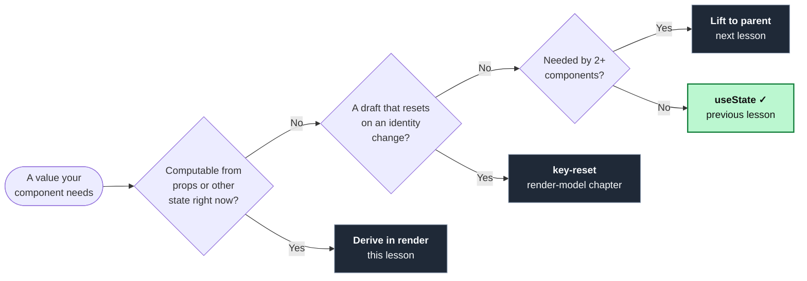

import StaleFrameSequence from '../../../components/lessons/024/2/StaleFrameSequence.astro';
import Figure from '../../../components/figures/Figure.astro';
import ReactCoding from '../../../components/live-coding/ReactCoding/ReactCoding.astro';
import Buckets from '../../../components/exercises/buckets/Buckets.astro';
import Bucket from '../../../components/exercises/buckets/Bucket.astro';
import Item from '../../../components/exercises/buckets/Item.astro';
import MultipleChoice from '../../../components/exercises/multiple-choice/MultipleChoice.astro';
import McqChoice from '../../../components/exercises/multiple-choice/McqChoice.astro';
import McqWhy from '../../../components/exercises/multiple-choice/McqWhy.astro';
import CodeVariants from '../../../components/code/code-variants/CodeVariants.astro';
import CodeVariant from '../../../components/code/code-variants/CodeVariant.astro';
import AnnotatedCode from '../../../components/code/annotated-code/AnnotatedCode.astro';
import AnnotatedStep from '../../../components/code/annotated-code/AnnotatedStep.astro';
import Term from '../../../components/ui/Term.astro';
import ExternalResource from '../../../components/ui/ExternalResource.astro';
import VideoCallout from '../../../components/embeds/VideoCallout.astro';
import { CardGrid } from '@astrojs/starlight/components';
import CourseProgressBar from '../../../components/ui/CourseProgressBar.astro';

<CourseProgressBar value={frontmatter['course-progress']} />

A profile renders a person's name from two pieces of state, `firstName` and `lastName`, and you need a `fullName` for the heading.

The reflex almost every React beginner reaches for is to give `fullName` its own `useState`, then wire up a `useEffect` that recomputes it whenever either input changes:

```tsx
const [firstName, setFirstName] = useState('Ada');
const [lastName, setLastName] = useState('Lovelace');
const [fullName, setFullName] = useState('');

useEffect(() => {
  setFullName(firstName + ' ' + lastName);
}, [firstName, lastName]);
```

It works: the heading shows the right name. But it is wasteful, briefly stale, and bug-prone, and the next section traces exactly how.

The previous lesson asked one question before reaching for `useState`: what kind of value is this? When the answer is "computed from other state or props," the instruction was to derive it in render rather than store it. Here that fix is a single line:

```tsx
const fullName = firstName + ' ' + lastName;
```

Delete the state and the effect, and compute the value where you use it. The rest of this lesson is why that line is correct, why it is cheaper, and how to spot the cases that genuinely do need state.

## The double-render tax of syncing state with an effect

Here is the mirror-and-sync version in full, written the way a beginner would write it.

```tsx
const Profile = () => {
  const [firstName, setFirstName] = useState('Ada');
  const [lastName, setLastName] = useState('Lovelace');
  const [fullName, setFullName] = useState('');

  useEffect(() => {
    setFullName(firstName + ' ' + lastName);
  }, [firstName, lastName]);

  return <h1>{fullName}</h1>;
};
```

:::note
`useEffect(callback, deps)` runs its callback after React commits the render to the screen, and re-runs it whenever a value in `deps` changes. That one fact is all you need here; effects get their full treatment in a later chapter.
:::

Now trace what happens when the user types a letter into the first-name field. In the render model chapter you learned that an update flows through four phases: trigger, render, reconcile, commit. Here that whole sequence runs once, and then runs again.

<StaleFrameSequence />

One keystroke produced two renders, and in the gap between them the heading showed a name that was already out of date. You will not see the flicker on a fast machine, but it is real, and a slower render or a heavier value makes it visible.

The second copy is the deeper problem. `firstName` and `lastName` are the truth; `fullName` is a copy you have promised to keep current by hand, and that promise lives in the dependency array. The day a teammate adds a `middleName` and updates the template but not the array, `fullName` stops tracking it: no crash, no warning, just a subtly wrong heading that someone catches in production. The derived version cannot have this bug, because there is no second copy to fall out of sync.

That second copy of a value that already exists, recomputed by an effect, is what we will call <Term definition="A value computed from props or state during render, rather than stored in its own piece of state.">derived state</Term>. The problem is not the derived value, it is storing it. The cure is to compute it where the render already has everything it needs.

## Derive in render: state is the minimum

:::tip[When a value can be computed from existing props and state, compute it during render rather than storing it.]
If you can reconstruct a value from what you already have, it isn't state. It's a view of state.
:::

The shift in mindset is **JavaScript before JSX.** A component body is an ordinary function that runs top to bottom on every render, and everything above the `return` is just code. A variable, a ternary, a `.filter`, a `.reduce`, a string template: anything you can express in plain JavaScript gets computed right there, from the values the render already holds.

It already holds them. As you saw in the render-model chapter, `props` and `state` are frozen constants for one render, a snapshot. So `firstName` and `lastName` are two constants in scope, and `firstName + ' ' + lastName` is just reading them and concatenating. The JSX at the bottom reads the local variable you computed. No hook, no second render.

This is why **state is the minimum set of values from which everything else can be computed.** Every piece of state is a value that changes over time, that you can get wrong, and that can disagree with another value, so you keep it as small as possible. Putting a derivable value in `useState` means maintaining two sources of truth that can drift apart; deriving keeps one source of truth plus a view computed fresh from it every time.

Once you start looking, derivable values are everywhere, each one a single expression in the body:

```tsx
const fullName = firstName + ' ' + lastName;
const completedCount = todos.filter((todo) => todo.isDone).length;
const cartTotal = items.reduce((sum, item) => sum + item.price, 0);
const isEmpty = items.length === 0;
const selectedItem = items.find((item) => item.id === selectedId);
```

None of those belong in state; each is computed from state that already exists.

Here is the same `fullName` component both ways, side by side.

<CodeVariants>
  <CodeVariant label="Mirrored into state (don't)">
    <div data-mark-color="orange">

    ```tsx {4, 6-8}
    const Profile = () => {
      const [firstName, setFirstName] = useState('Ada');
      const [lastName, setLastName] = useState('Lovelace');
      const [fullName, setFullName] = useState('');

      useEffect(() => {
        setFullName(firstName + ' ' + lastName);
      }, [firstName, lastName]);

      return <h1>{fullName}</h1>;
    };
    ```

    </div>
    **Two renders and a stale frame.** `fullName` is a second copy of data that already lives in `firstName` and `lastName`, kept in sync by hand. Every name change costs an extra render, and the day a new name part is added but the dependency array is not, the heading silently goes stale.
  </CodeVariant>

  <CodeVariant label="Derived in render (do)">
    <div data-mark-color="green">

    ```tsx {5}
    const Profile = () => {
      const [firstName, setFirstName] = useState('Ada');
      const [lastName, setLastName] = useState('Lovelace');

      const fullName = firstName + ' ' + lastName;

      return <h1>{fullName}</h1>;
    };
    ```

    </div>
    **One render, one source of truth.** Plain JavaScript in the body, recomputed each render from the snapshot. It can never drift, because there is nothing to keep in step.
  </CodeVariant>
</CodeVariants>

The clearest way to internalize this is to do the deletion yourself. The next exercise hands you the mirror-and-sync version to strip down.

<ReactCoding
  instructions="This profile keeps `fullName` in a third piece of state and syncs it with an effect. Delete the `fullName` state and the effect, and compute `fullName` during render instead. Type in the inputs and confirm the heading still tracks them — with less code."
  starter={`import { useEffect, useState } from 'react';

export const App = () => {
  const [firstName, setFirstName] = useState('Ada');
  const [lastName, setLastName] = useState('Lovelace');
  const [fullName, setFullName] = useState('');

  useEffect(() => {
    setFullName(firstName + ' ' + lastName);
  }, [firstName, lastName]);

  return (
    <div className="space-y-3 p-4">
      <input
        className="block rounded border px-2 py-1"
        value={firstName}
        onChange={(event) => setFirstName(event.target.value)}
      />
      <input
        className="block rounded border px-2 py-1"
        value={lastName}
        onChange={(event) => setLastName(event.target.value)}
      />
      <h1 className="text-xl font-semibold">{fullName}</h1>
    </div>
  );
};`}
/>

<details>
<summary>Reference solution</summary>

```tsx
import { useState } from 'react';

export const App = () => {
  const [firstName, setFirstName] = useState('Ada');
  const [lastName, setLastName] = useState('Lovelace');

  const fullName = firstName + ' ' + lastName;

  return (
    <div className="space-y-3 p-4">
      <input
        className="block rounded border px-2 py-1"
        value={firstName}
        onChange={(event) => setFirstName(event.target.value)}
      />
      <input
        className="block rounded border px-2 py-1"
        value={lastName}
        onChange={(event) => setLastName(event.target.value)}
      />
      <h1 className="text-xl font-semibold">{fullName}</h1>
    </div>
  );
};
```

The `fullName` state and the `useEffect` are gone, replaced by one `const fullName = firstName + ' ' + lastName;` in the body. The `useEffect` import goes with them, leaving only `useState`.

</details>

You removed four things to read and maintain: a `useState`, a `useEffect`, an import, and a dependency array. In their place is one line that concatenates two strings, shorter and impossible to get out of sync.

## The same pattern in three forms

The `fullName` case is the textbook example, but the shape it belongs to is far broader. Once you can name that shape, you catch it everywhere. In the abstract:

**a `useState` holding a value, plus a `useEffect` watching other state or props and calling that state's setter.**

Wherever those two things appear together, you are almost always looking at the same mistake, and the cure is always the same: delete both, compute the value in render.

<AnnotatedCode lang="tsx" code={`
const [derived, setDerived] = useState(initialValue);

useEffect(() => {
  setDerived(computeFrom(source));
}, [source]);
`}>
  <AnnotatedStep meta="{1}" color="orange">
    State whose only job is to hold a value computed from other state. It is a copy, not something the user or the outside world sets directly.
  </AnnotatedStep>

  <AnnotatedStep meta={`{3-5} "setDerived"`} color="orange">
    A setter called from an effect watching the source: the hand-maintained promise to keep the copy current. It costs an extra render and goes stale when the dependency list falls behind. When a setter inside an effect exists only to mirror other state, delete both and compute the value in the body.
  </AnnotatedStep>
</AnnotatedCode>

### A filtered or sorted list cached in state

A todo app filters its list: show all, show active, or show completed. The list you display is the source list run through a filter. The reflex, again, is to store the filtered result and resync it whenever the inputs change:

```tsx
const [visibleTodos, setVisibleTodos] = useState([]);

useEffect(() => {
  setVisibleTodos(getFilteredTodos(todos, filter));
}, [todos, filter]);
```

Same shape, same fix. `visibleTodos` is fully determined by `todos` and `filter`, so compute it in the body:

```tsx
const visibleTodos = getFilteredTodos(todos, filter);
```

You may object: *filtering is real work, so isn't running it on every render wasteful?* The short answer is that it is cheap, and for the rare case where it is not, the React Compiler handles it (next section).

### A boolean flag derived from other state

Flags are the most obviously derivable values there are, and where this mistake hides most often. A form wants to know whether it has any errors, so it can disable the submit button or show a banner. The errors live in state, and the flag is computed from them:

```tsx
const [hasErrors, setHasErrors] = useState(false);

useEffect(() => {
  setHasErrors(errors.length > 0);
}, [errors]);
```

That is three lines, an effect, and a dependency array to express a single comparison:

```tsx
const hasErrors = errors.length > 0;
```

The same goes for every flag of this kind: `isEmpty`, `isComplete`, `canSubmit`. If a boolean is "true when some condition over my state holds," it is one expression in the body, never a piece of state with an effect keeping it current.

You have now seen the shape three times; the skill is recognizing it on the fourth. For each value below, decide whether it genuinely needs `useState` or whether it should be derived in render.

<Buckets twoCol instructions="Sort each value into whether it should live in `useState` or be computed during render.">
  <Bucket name="state" label="Lives in useState" description="Changes independently; the UI reads it" />
  <Bucket name="derive" label="Derive in render" description="Computable from other state or props" />

  <Item bucket="state">The text the user has typed into a search box</Item>
  <Item bucket="state">Whether a modal is open</Item>
  <Item bucket="state">The list of todos fetched from the server</Item>
  <Item bucket="state">The id of the currently selected todo</Item>

  <Item bucket="derive">The user's full name, from `firstName` and `lastName`</Item>
  <Item bucket="derive">The number of completed todos</Item>
  <Item bucket="derive">Whether the form has any errors</Item>
  <Item bucket="derive">The todos that match the current filter</Item>
</Buckets>

## Recomputing every render is cheap

This is the objection that keeps people caching in state, and the answer runs opposite to most beginners' intuition.

For the work that shows up in real components, a `.filter` over a few hundred rows, a sum across a cart, a string concatenation, a `.find`, the cost is negligible next to the render around it. Building the React elements and reconciling them against the previous tree is the expensive part; your `.filter` is a rounding error beside it. Recomputing every render is not a problem to solve, it is how the value stays correct with zero bookkeeping on your part.

React's own rule of thumb: unless you are creating or looping over many thousands of objects, a computation is probably not expensive. Below that, derive freely.

When you are unsure, measure rather than guess. Wrap the computation in a timer and read the number off a representative dataset:

```tsx
console.time('filter');
const visibleTodos = getFilteredTodos(todos, filter);
console.timeEnd('filter');
```

If that consistently prints a millisecond or more on real data, *then* you have a candidate worth optimizing. If it prints `0.02ms`, do nothing. A hunch that filtering must be slow is not a reason to add a second source of truth.

You also get a backstop for free. This project ships with the <Term definition="A build step that analyzes your components and automatically memoizes them, so you write natural code and it handles the caching.">React Compiler</Term> turned on: it reads your components at build time and caches the derivations whose inputs have not changed, reaching cases the old manual tools could not. So derive in render, write natural code, and let the compiler handle the caching. You describe the value; the build step optimizes it.

For the rare derivation that is *measurably* expensive and you need to cache yourself, React provides `useMemo`. Notice the comment, because it is the whole story:

```tsx
const sortedRows = useMemo(
  () => expensiveSort(rows),
  [rows],
); // measured at ~12ms over 40k rows
```

The default is no `useMemo`. You reach for it only after a measurement crosses the threshold, and when you do, you leave behind the number that justified it. The full decision framework comes in a later chapter; for now, recognize the shape and leave it out by default. <Term definition="Caching a computed result so it is not recomputed while its inputs are unchanged.">Memoization</Term> is mostly the compiler's job.

<VideoCallout videoId="tz0fDABt67g" videoTitle="Every Beginner React Developer Makes This Mistake With State">
  Web Dev Simplified walks the derived-state bug end to end in 7 minutes: a `selectedUser` stored in state that drifts, the one-line fix of deriving from an id, and when `useMemo` earns its place.
</VideoCallout>

## When a value really does belong in state

The danger with a rule this sharp is over-correcting into "derive everything," which is just as wrong. Plenty of values do belong in `useState`, and four triggers mark them. If a value matches one, it is state; if it matches none, look harder, because it is probably derivable.

1. **It originates from user input.** The raw text in an `<input>`, a toggle's on or off, which tab is selected. There is nothing to compute these from, because the user *is* the source. This is the seed of every controlled input, covered in the forms unit later.

   ```tsx
   const [query, setQuery] = useState('');
   ```

2. **It is cached from an external system.** Data fetched from the server, read from `localStorage`, or pushed by a subscription needs a local home so the UI can read it synchronously as it renders.

   ```tsx
   const [todos, setTodos] = useState<Todo[]>([]);
   ```

   Holding <Term definition="Data whose canonical home is the server or database, not the component, which only holds a cached copy.">server state</Term> in `useState` is a stopgap, not its real home; a server-state cache or Server Component, covered in a later unit, is. It still counts as a legitimate trigger, with that caveat.

3. **It captures a moment in time.** A timestamp taken once at mount, or a random seed assigned a single time: values you deliberately snapshot and must *not* recompute. Calling `Date.now()` or `Math.random()` in the render body is impure because it gives a different answer each render, so you capture the value once and hold it in state.

   ```tsx
   const [startedAt] = useState(() => Date.now());
   ```

4. **It is an intentionally divergent draft.** An editable copy of a server value that is *supposed* to drift from the canonical record until the user saves. This is the legitimate version of seeding state from a prop, where the next section picks back up.

One question sorts all of this:

:::note
**Could I reconstruct this value from other state right now?** If yes, derive it. If no, because it is raw input, cached from outside, captured at a moment, or a deliberately divergent draft, it is state.
:::

## Updating state when a prop changes: derive, key, or lift

One situation feels more than any other like it demands a sync effect: *I have local state seeded from a prop, and when the prop changes I need my state to match.*

Picture a list with a `selectedId` prop and a panel showing the full selected item. That thought produces a second piece of state holding the item, kept in sync with the prop by an effect:

```tsx
const [selectedItem, setSelectedItem] = useState(null);

useEffect(() => {
  setSelectedItem(items.find((item) => item.id === selectedId) ?? null);
}, [items, selectedId]);
```

It is almost always one of three things, none of them a sync effect. Naming which one you are in tells you the right tool.

<CodeVariants>
  <CodeVariant label="Sync effect (don't)">
    <div data-mark-color="orange">

    ```tsx {3-5}
    const [selectedItem, setSelectedItem] = useState(null);

    useEffect(() => {
      setSelectedItem(items.find((item) => item.id === selectedId) ?? null);
    }, [items, selectedId]);
    ```

    </div>
    **The mistake.** An effect whose only job is to copy something computed from a prop into local state. Two renders, a stale frame, and a second source of truth to maintain.
  </CodeVariant>

  <CodeVariant label="Derive">
    <div data-mark-color="green">

    ```tsx {1}
    const selectedItem = items.find((item) => item.id === selectedId) ?? null;
    ```

    </div>
    **Best when the value is reconstructable.** The selected item is just a function of the prop and the list, so there is no state at all: compute it in the body. This is the default.
  </CodeVariant>

  <CodeVariant label="key-reset">
    <div data-mark-color="green">

    ```tsx "key={record.id}"
    <EditForm key={record.id} record={record} />
    ```

    </div>
    **Best when a draft must reset on identity change.** A new `key` throws away the old component instance and hands you a fresh one, re-seeded from the new record. One attribute, nothing to keep in sync.
  </CodeVariant>
</CodeVariants>

The three cases:

1. **The value is purely a function of the prop, so derive it.** No state: compute it in render, as in the first half of this lesson. Given a `selectedId` and a list, the selected item is `items.find((item) => item.id === selectedId)`.

2. **The state is an editable copy that should *reset* when the prop's identity changes, so use a `key`-reset.** From the render-model chapter: `<EditForm key={record.id} record={record} />` remounts the form on a new record, so its `useState(record.field)` re-seeds for free and the old state is simply discarded.

3. **Two or more components need the value, so lift it** to their common parent. The child stops owning a copy and reads the parent's single source of truth. That is the next lesson; it is named here only so you recognize the case.

So the rule, stated plainly: **"I need to update state when a prop changes" is a warning sign, and the cure is to derive, `key`-reset, or lift, never to add a mirroring effect.** This is the fix the previous lesson promised for the frozen-prop trap.

There is one documented exception, named once so you recognize it, not so you reach for it. React permits calling a setter *during render* — not in an effect — to adjust state when a prop has changed, guarded by a comparison against the previous value:

```tsx
const [prevId, setPrevId] = useState(selectedId);

if (selectedId !== prevId) {
  setPrevId(selectedId);
  setSelection(null);
}
```

Because the setter runs during render rather than after commit, React re-renders immediately, before painting the children, so the user sees no stale frame and there is no second commit. But it is hard to read, and the guard is easy to get wrong: drop the `selectedId !== prevId` check and it loops forever. Reach for `key` or render-time computation first; this is the last resort, for adjusting *some* state when a prop changes.

<VideoCallout videoId="V1f8MOQiHRw" videoTitle="You might not need useEffect()">
  Maximilian Schwarzmüller (Academind) codes both fixes live: replacing a sync effect with a derived value, then resetting state with a `key` when a prop's identity changes.
</VideoCallout>

Now check that the routing reflex stuck: read the scenario and pick the senior fix.

<MultipleChoice>
  An `<InvoiceEditor>` receives a `customer` prop and, on mount, copies the customer's billing address into local `useState` so a biller can tweak it before sending the invoice — the draft is *meant* to diverge from the saved record until they hit Save. The bug: when the biller switches to a different customer in the sidebar, the editor still shows the *previous* customer's address and half-typed edits. You want the editor to start clean for each customer while keeping the draft editable. What is the cleanest fix?

  <McqChoice>Watch `customer.id` from an effect and call the setters to overwrite the draft fields whenever it changes.</McqChoice>
  <McqChoice correct>Pass the customer's id as the editor's `key`, so switching customers throws away the old instance and mounts a fresh one seeded from the new address.</McqChoice>
  <McqChoice>Stop storing the draft in state and read each field straight off the `customer` prop in the render body.</McqChoice>
  <McqChoice>Move the draft state up into the sidebar's parent and pass it back down so it survives the switch.</McqChoice>

  <McqWhy>
The clean fix is the second option: give the editor a `key` tied to the customer's id. A new `key` is a new identity, so React discards the old instance — stale edits and all — and mounts a fresh one whose `useState` re-seeds from the new customer. One attribute, no syncing, no stale frame.

The first option is the exact smell this lesson is about: a setter inside an effect that mirrors a prop into state. It pays for a second render, flashes the old address for a frame, and goes stale the moment a field is added and left out of the dependency list.

The third option (derive in render) is the right reflex *when there is nothing to preserve* — but here the draft must stay divergent until Save, and recomputing every field from the prop on each render would wipe the biller's in-progress edits on every keystroke.

The fourth option (lift) works but is the heavy choice: nothing above the editor needs to read the draft, so lifting it spreads the state out for no benefit. Keep it colocated and reset it with `key`.
  </McqWhy>
</MultipleChoice>

## Choosing where a value lives: the derive-first filter

The whole lesson reduces to four questions, asked in order, before a value is allowed into `useState`.

<Figure caption="The four questions in order; useState is what you reach only after the first three say no.">

```mermaid
%%{init: {'themeCSS': '.node.leaf .nodeLabel { font-family: ui-monospace, SFMono-Regular, Menlo, Monaco, Consolas, monospace; }'} }%%
flowchart LR
  start([A value your<br/>component needs])
  q1{"Computable from<br/>props or other<br/>state right now?"}
  q2{"A draft that resets<br/>on an identity<br/>change?"}
  q3{"Needed by 2+<br/>components?"}

  derive["<b>Derive in render</b><br/>this lesson"]
  keyreset["<b>key-reset</b><br/>render-model chapter"]
  lift["<b>Lift to parent</b><br/>next lesson"]
  usestate["<b>useState ✓</b><br/>previous lesson"]

  start --> q1
  q1 -- Yes --> derive
  q1 -- No --> q2
  q2 -- Yes --> keyreset
  q2 -- No --> q3
  q3 -- Yes --> lift
  q3 -- No --> usestate

  class derive,keyreset,lift offramp
  class usestate leaf
  classDef offramp fill:#1f2937,stroke:#94a3b8,color:#f8fafc
  classDef leaf fill:#bbf7d0,stroke:#15803d,color:#111,stroke-width:2px
```
</Figure>

1. **Can I compute it from props or other state?** Then **derive it in render**. (This lesson.)
2. **Is it a draft that must reset when an identity changes?** Then **`key`-reset**. (The render-model chapter.)
3. **Do two or more components need it?** Then **lift** it to their common parent. (The next lesson.)
4. **Otherwise**, is it raw input, cached external data, a captured moment, or a divergent draft the JSX reads? Then it earns a **`useState`**. (The previous lesson.)

So **reach for `useState` last, not first.** State is the small, hard core left once you have ruled the other three out, the minimum set of values from which everything else is computed.

## External resources

The single best follow-up to this lesson is the React documentation page it is built on. The examples you saw here, the full name, the filtered list, the error flag, and the prop reset, are drawn almost directly from it, and the pages below carry several more, plus a lint rule that catches the same mistake in your own code.

<CardGrid>
  <ExternalResource
    title="You Might Not Need an Effect"
    href="https://react.dev/learn/you-might-not-need-an-effect"
    icon="simple-icons:react"
    iconColor="#61DAFB"
    description="The canonical reading this lesson is built on — derived values, cached calculations, and reset-on-prop-change, in full."
  />
  <ExternalResource
    title="Choosing the State Structure"
    href="https://react.dev/learn/choosing-the-state-structure"
    icon="simple-icons:react"
    iconColor="#61DAFB"
    description="Owns the avoid-redundant-and-derived-state principle and the state-is-the-minimum framing from this lesson."
  />
  <ExternalResource
    title="eslint-plugin-react-you-might-not-need-an-effect"
    href="https://github.com/nickjvandyke/eslint-plugin-react-you-might-not-need-an-effect"
    icon="simple-icons:eslint"
    iconColor="#4B32C3"
    description="A lint rule that flags this exact smell in your own code — derived state in an effect, caught before review."
  />
  <ExternalResource
    title="React Compiler"
    href="https://react.dev/learn/react-compiler"
    icon="simple-icons:react"
    iconColor="#61DAFB"
    description="The build step that auto-memoizes your derivations — the 2026 backstop for deriving in render without pre-optimizing."
  />
</CardGrid>
