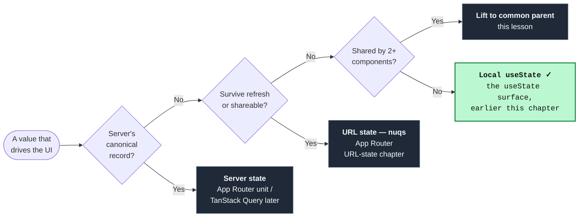

import AnnotatedCode from '../../../components/code/annotated-code/AnnotatedCode.astro';
import AnnotatedStep from '../../../components/code/annotated-code/AnnotatedStep.astro';
import CodeVariants from '../../../components/code/code-variants/CodeVariants.astro';
import CodeVariant from '../../../components/code/code-variants/CodeVariant.astro';
import Buckets from '../../../components/exercises/buckets/Buckets.astro';
import Bucket from '../../../components/exercises/buckets/Bucket.astro';
import Item from '../../../components/exercises/buckets/Item.astro';
import ReactCoding from '../../../components/live-coding/ReactCoding/ReactCoding.astro';
import Figure from '../../../components/figures/Figure.astro';
import StateMachineWalker from '../../../components/figures/state-machine-walker/StateMachineWalker.astro';
import Question from '../../../components/figures/state-machine-walker/Question.astro';
import Branch from '../../../components/figures/state-machine-walker/Branch.astro';
import Leaf from '../../../components/figures/state-machine-walker/Leaf.astro';
import Term from '../../../components/ui/Term.astro';
import ExternalResource from '../../../components/ui/ExternalResource.astro';
import { CardGrid } from '@astrojs/starlight/components';
import CourseProgressBar from '../../../components/ui/CourseProgressBar.astro';

<CourseProgressBar value={frontmatter['course-progress']} />

Picture a small piece of UI you've built a dozen times: a search box above a list of rows. The user types "shoes" and the list narrows to shoes. Call it a `SearchableTable`, with one `<input>` at the top and a list of product rows below.

There's a string in there, the `query` the user has typed, and it has to live *somewhere*. The reflex answer is `useState`, and in the last two lessons you learned exactly what that does and when not to reach for it. But there's a question that comes before you type `useState`, one the API can't answer for you: **where should this value live?** Local to the input that produced it? Lifted up to the component that owns the rows it filters? Or in the URL itself, as `?q=shoes`?

In a ten-line demo the three choices look identical, because they all narrow the list. The difference stays invisible until the app is real, and then it decides everything. If `query` lives in the URL, a user can refresh and keep their filter, bookmark it, or paste the link to a teammate who sees the exact same view. If it lives in local state, refreshing wipes it and the link is useless. The placement decides shareability, whether the filter survives a refresh, whether the back button undoes a filter, and whether the page can be rendered on the server. The UI is the same either way; where the one string sits decides all of it.

So this lesson is about placement, not API. A value can live in one of four homes: local, lifted, the URL, or the server. Choosing the right one is a senior skill that has almost nothing to do with `useState`'s signature. The map you saw at the end of the first lesson in this chapter named all four; here you work through the branches it pointed forward to. The reflex to build is the one that lesson opened with: **colocate first, relocate on evidence.** Start a value at the narrowest spot that works, and move it outward only when something concrete forces the move, never on a hunch that you might need it elsewhere later.

One piece of vocabulary first, because the whole lesson turns on it. Wherever a value finally lives, that location is its <Term definition="The single authoritative location a value is read from and written to. Every other place that shows the value reads a copy; nothing else gets to disagree with it.">source of truth</Term>: the one authoritative copy that everything else reads from. Most placement bugs are really *two* sources of truth that drift apart. Keep that phrase in mind, because you'll watch it decide every call below.

## Home 1: local, the default

Every value starts here. Local state belongs to a single component, and nobody else in the tree cares about it: whether a dropdown is open, which row is currently hovered, which section of an accordion is expanded. There's no one to share it with, so it sits exactly where it's used and never moves. This is the default home, and you only leave it when you have concrete evidence to.

Here's the `SearchableTable` in its simplest honest form.

```tsx title="SearchableTable.tsx" {4} {5-7}
type Product = { id: string; name: string };

export function SearchableTable({ products }: { products: Product[] }) {
  const [query, setQuery] = useState('');
  const visible = products.filter((product) =>
    product.name.toLowerCase().includes(query.toLowerCase()),
  );

  return (
    <div>
      <input
        value={query}
        onChange={(event) => setQuery(event.target.value)}
        placeholder="Search products"
      />
      <ul>
        {visible.map((product) => (
          <li key={product.id}>{product.name}</li>
        ))}
      </ul>
    </div>
  );
}
```

`query` is local state, and notice that it does *not* live inside the `<input>`. It lives in `SearchableTable`, the component that renders both the input and the list. That placement isn't an accident, and it isn't "lifting" either: it's the subtle part of getting "local" right.

The list has to read `query` to filter, and so does the input, to stay controlled. The value has to sit somewhere both of them can see, which means the closest spot above both of them: their nearest common parent. That spot is `SearchableTable`. If you reached for a `useState` *inside* the `<input>` component instead, the list would be stranded below it with no way to read the filter, and you'd be back to the placement problem one level lower.

That's the precise meaning of <Term definition="Placing state in (or just above) the component that uses it, rather than defaulting it high in the tree. For one consumer, that's the consumer itself; for several, it's their nearest common ancestor.">colocation</Term>: put state at the *narrowest* component that still sits above everyone who reads it. For a value with a single reader, that's the reader itself. For a value two parts share, like `query` here, it's their nearest common ancestor. Colocation isn't "always at the leaf"; it's "as low as possible while still high enough." Push it lower than that and you strand a consumer, the *under-lifted* smell we'll cover below. Pull it higher than necessary and you've over-lifted, the other smell we'll cover. The whole skill is finding the floor.

By that definition our baseline is already placed correctly. Notice too, as a callback to the previous lesson, that `visible` is *not* stored in state. It's the filtered list, derived in render from `products` and `query`. Storing it would create a second source of truth that could disagree with the input. So `query` is the only state here, and it lives at its floor. That's home one, done right.

## Home 2: lifted, when a sibling needs it

Local state holds until a *second* component needs the same value. Then it moves. The move has a name, "lifting state up," along with a precise mechanic worth your attention, because it carries a convention people routinely get wrong.

Watch the trigger arrive. The product manager wants two additions to the `SearchableTable`. First, a result counter next to the search box: "12 results for 'shoes'". Second, a "Clear" button somewhere else on the screen that resets the filter to empty. Now `query` has three consumers, the input, the new `<ResultCount>`, and the new "Clear" button, and they're siblings rather than nested inside each other.

*That* is the lift trigger: an actual second component, in hand, that needs to read or change the value, not just "a sibling might need this someday." In our baseline `query` already lives in `SearchableTable`, the common parent, so adding these siblings is easy: each one reads `query` from props and reports changes back up. The general rule is the thing to carry: **when two or more components need the same value, it moves up to their closest common ancestor and flows back down as props.** That ancestor becomes the single source of truth, and the children render purely from what they're handed.

Three situations trip this trigger, and they're worth memorizing because they cover almost every real case:

1. **Two siblings need the same value.** The filter input, the results list, and the count all read `query`. This is the one we're building.
2. **An ancestor must react to a child's state.** A form's Save button is disabled until the fields are valid. The button isn't inside the fields, so the form above both has to own the field values to decide.
3. **The value must outlive one child's unmount.** A draft that should survive a tab switch can't live inside the tab that unmounts. (Often a `key` reset, from the previous chapter, is the cleaner fix here. Reach for lifting when the value genuinely belongs to the parent, not just to dodge an unmount.)

When you lift, the children become *controlled*: they hold no state of their own, they render from props, and they announce changes upward. That's the controlled-input pattern from the React, JSX, and Tailwind chapter, now generalized past `<input>` to any component. There's nothing new in the mechanic itself. The new part is the shape of the contract you hand down.

### Hand down a callback, not a setter

When a child needs to change the lifted value, you have two ways to let it. You can pass the raw `setQuery` setter straight down, or you can pass a *named callback* like `onQueryChange`. They look interchangeable, but they are not, and the course always chooses the second one.

<CodeVariants>
  <CodeVariant label="Setter passed down">
    <div data-mark-color="orange">

    ```tsx "setQuery: Dispatch<SetStateAction<string>>" "setQuery(event.target.value)"
    function SearchBar({ query, setQuery }: {
      query: string;
      setQuery: Dispatch<SetStateAction<string>>;
    }) {
      return <input value={query} onChange={(event) => setQuery(event.target.value)} />;
    }
    ```

    </div>
    This works, but it leaks the parent's storage choice. The child now knows the value came from `useState`, because that awkward `Dispatch<SetStateAction<string>>` type is `useState`'s setter signature bleeding across the boundary. Refactor the parent to a reducer or a store and every child's type breaks.
  </CodeVariant>

  <CodeVariant label="Typed callback">
    <div data-mark-color="green">

    ```tsx "onQueryChange: (next: string) => void" "onQueryChange(event.target.value)"
    function SearchBar({ query, onQueryChange }: {
      query: string;
      onQueryChange: (next: string) => void;
    }) {
      return <input value={query} onChange={(event) => onQueryChange(event.target.value)} />;
    }
    ```

    </div>
    The child asks for a string and a way to report a new string, with nothing about *how* the parent stores it. This is a stable contract: the parent can add validation, debouncing, or logging inside `onQueryChange` without the child noticing, and it can swap its storage freely. This is the shape the course uses.
  </CodeVariant>
</CodeVariants>

The reasoning is single-source-of-truth thinking applied to the contract itself. A setter says "here is my storage, write to it directly." A callback says "tell me what changed and I'll decide what to do." The first couples the child to the parent's current implementation; the second leaves the parent free to change its mind. The naming follows the convention you've already seen: a handler the parent passes is `onSomethingChange`, a function the child calls. (The one honest exception is a tiny presentational `<Input>` whose entire job *is* to be the input. It can take a setter, because it genuinely is "the input." The moment a component does anything more, hand it a callback.)

Here's the whole lifted `SearchableTable`, split into the parent that owns `query` and the children that render from it. Step through it.

<AnnotatedCode lang="tsx" maxLines={18} code={`
function SearchableTable({ products }: { products: Product[] }) {
  const [query, setQuery] = useState('');
  const visible = products.filter((product) =>
    product.name.toLowerCase().includes(query.toLowerCase()),
  );

  return (
    <div>
      <SearchBar query={query} onQueryChange={setQuery} />
      <ResultsList products={visible} />
    </div>
  );
}

function SearchBar({ query, onQueryChange }: {
  query: string;
  onQueryChange: (next: string) => void;
}) {
  return (
    <input value={query} onChange={(event) => onQueryChange(event.target.value)} />
  );
}

function ResultsList({ products }: { products: Product[] }) {
  return (
    <ul>
      {products.map((product) => (
        <li key={product.id}>{product.name}</li>
      ))}
    </ul>
  );
}
`}>
  <AnnotatedStep meta="{2}" color="green">
    `SearchableTable` owns `query`. This one `useState`, in the common parent, is the single source of truth. Both children read from it; neither holds a copy.
  </AnnotatedStep>

  <AnnotatedStep meta="{9}" color="green">
    The parent hands `SearchBar` the current `query` and a callback to report changes. Value flows down, change events flow up: the controlled pattern, generalized.
  </AnnotatedStep>

  <AnnotatedStep meta="{19-21}" color="green">
    `SearchBar` is now purely controlled: it has no state, renders `value` from its prop, and calls `onQueryChange` on input. The parent's storage choice is invisible to it.
  </AnnotatedStep>

  <AnnotatedStep meta="{3-4} {10}" color="green">
    `visible` is derived in render, not stored, and passed to `ResultsList`. The list renders from props alone. One source of truth, two readers, zero duplication.
  </AnnotatedStep>
</AnnotatedCode>

That's the entire lifting mechanic: one `useState` at the common parent, values down as props, changes up as typed callbacks. Now do it yourself, because the contract is easy to get backwards.

The exercise below starts broken in exactly the way beginners ship it: `query` is stranded as local state *inside* `SearchBar`, so `ResultsList` has no way to see it and the list never filters. Lift `query` up to `SearchableTable` and wire the children with `query` and `onQueryChange`.

<ReactCoding
  instructions="`query` is stranded inside `SearchBar`, so typing does nothing to the list. Lift it: move the `useState` up to `SearchableTable`, pass `query` and an `onQueryChange` callback down to `SearchBar`, and pass the filtered products to `ResultsList`. Type to confirm the list narrows."
  starter={`import { useState } from 'react';

type Product = { id: string; name: string };

const PRODUCTS: Product[] = [
  { id: 'a', name: 'Running shoes' },
  { id: 'b', name: 'Hiking boots' },
  { id: 'c', name: 'Wool socks' },
  { id: 'd', name: 'Rain jacket' },
];

function SearchBar() {
  // ❌ query is stranded here — ResultsList can't see it, so the list never filters.
  const [query, setQuery] = useState('');
  return (
    <input
      className="rounded border px-2 py-1"
      value={query}
      onChange={(event) => setQuery(event.target.value)}
      placeholder="Search products"
    />
  );
}

function ResultsList({ products }: { products: Product[] }) {
  return (
    <ul>
      {products.map((product) => (
        <li key={product.id}>{product.name}</li>
      ))}
    </ul>
  );
}

function SearchableTable({ products }: { products: Product[] }) {
  return (
    <div className="space-y-3 p-4">
      <SearchBar />
      <ResultsList products={products} />
    </div>
  );
}

export function App() {
  return <SearchableTable products={PRODUCTS} />;
}`}
  tests={`
const getInput = () => document.querySelector('input');
const rowCount = () => document.querySelectorAll('li').length;

// Set a controlled input's value the way React's onChange will notice, dispatch
// the input event the controlled pattern listens to, then flush the update so
// the next assertion reads committed DOM.
function typeInto(input, value) {
  const setter = Object.getOwnPropertyDescriptor(
    window.HTMLInputElement.prototype,
    'value',
  ).set;
  setter.call(input, value);
  input.dispatchEvent(new Event('input', { bubbles: true }));
  flushSync(() => {});
}

test('before typing, every product renders', () => {
  expect(rowCount()).toBe(4);
});

test('typing "shoes" narrows the list to the one matching row', () => {
  typeInto(getInput(), 'shoes');
  expect(rowCount()).toBe(1);
  expect(document.querySelector('li')?.textContent).toBe('Running shoes');
});

test('the input stays controlled — its value reflects the typed query', () => {
  typeInto(getInput(), 'shoes');
  expect(getInput()?.value).toBe('shoes');
});
`}
/>

<details>
<summary>Reference solution</summary>

```tsx
import { useState } from 'react';

type Product = { id: string; name: string };

function SearchBar({ query, onQueryChange }: {
  query: string;
  onQueryChange: (next: string) => void;
}) {
  return (
    <input
      className="rounded border px-2 py-1"
      value={query}
      onChange={(event) => onQueryChange(event.target.value)}
      placeholder="Search products"
    />
  );
}

function ResultsList({ products }: { products: Product[] }) {
  return (
    <ul>
      {products.map((product) => (
        <li key={product.id}>{product.name}</li>
      ))}
    </ul>
  );
}

function SearchableTable({ products }: { products: Product[] }) {
  const [query, setQuery] = useState('');
  const visible = products.filter((product) =>
    product.name.toLowerCase().includes(query.toLowerCase()),
  );

  return (
    <div className="space-y-3 p-4">
      <SearchBar query={query} onQueryChange={setQuery} />
      <ResultsList products={visible} />
    </div>
  );
}
```

The one `useState` moves up to `SearchableTable`, the nearest common ancestor of the input and the list. `SearchBar` becomes controlled — it holds no state, renders `value` from its `query` prop, and reports keystrokes through the typed `onQueryChange` callback (not the raw `setQuery` setter). `visible` is derived in render from `products` and `query` and handed to `ResultsList`, so there's one source of truth and two readers.

</details>

## Home 3: the URL, when it should survive a refresh or be shared

Lifting solves "more than one component needs this *on the screen right now*." It does nothing for a different demand: a user who filters to "shoes", reloads the page, and is annoyed that their filter vanished, or who copies the URL to a teammate expecting them to land on the same filtered view. Lifted state can't deliver either. A page reload throws away every `useState` in the tree and starts fresh, and the link carries nothing about what was on screen.

When the value should survive a refresh or travel in a link, it belongs in the URL: `?q=shoes`. Now the URL is the source of truth. The components don't *own* `query` anymore; they read it from the address bar and write changes back to it. Reload the page, and the browser hands you the same URL, so the same filter. Share the link, and the recipient's address bar starts with `?q=shoes`, so they see your view. The senior way to hold this in your head is that **the URL is global state with a free synchronization mechanism**: every tab, every reload, and every shared link reads the same string, and the browser keeps them in sync for you without a single line of code.

This is the natural home for a recognizable family of values: search filters, the current page in a paginated list, sort order, the selected tab, and the ID of an open detail panel or modal you'd want to be linkable. They share a fingerprint: losing them on refresh would annoy a user, and a shareable link to them would be useful.

That gives you a two-question test, and it's the durable thing to take from this section. For any value, ask:

1. If the user reloads the page, do they expect this to still be here?
2. If they share the link, should the recipient see the same view?

**Either "yes" means the URL.** Both "no" means local or lifted is fine. Run "shoes" through it: a user who filtered the catalog probably *does* expect the filter to survive a refresh, and a shared link to the filtered view *is* useful, so `query` graduates to the URL. Now run it on a dropdown's open/closed flag: nobody reloads expecting a menu to still be open, and "share my open dropdown" is meaningless. Both answers are no, so that stays local. The test does the placement for you.

### `nuqs`, the 2026 reach

You *can* read and write the URL by hand with the browser's `searchParams` and a router push, and for a single param that's fine. But the reads come back as raw strings, every value needs parsing and a default, and updating several params at once without clobbering the others gets fiddly fast. Once URL state grows past a param or two, the 2026 default is <Term definition="A typed search-params library for React. Treats URL query params like useState — typed parsers, defaults, batched updates, history control — so reading and writing the URL feels like local state.">nuqs</Term>, a small library that wraps the raw <Term definition="The ?key=value portion of the URL — its query string. When a value lives in the URL, this is its source of truth: components read it here and write changes back to it.">searchParams</Term> with typed parsers, defaults, batched updates, and history control.

Here's the entire point of it, in one line.

```tsx
const [query, setQuery] = useQueryState('q', parseAsString.withDefault(''));
```

Look at the shape: `const [query, setQuery] = ...`. That's `useState`'s call site, deliberately. You read a value and get a setter to change it, except the value lives in `?q=` instead of component memory, so it survives refreshes and rides along in shared links for free. The string `'q'` is the URL key, and `parseAsString.withDefault('')` says how to read it and what to fall back to when it's absent. That's all you need to *recognize* it today. The full `nuqs` surface, every parser, batching multiple params, and history modes, is taught in the chapter on App Router URL state, and again in the production list view later in the course. Here you only need the placement decision: this value goes in the URL.

:::caution
Because the URL is just text a user can edit, `?page=abc` or `?q=` followed by a script tag is entirely possible. URL state must be parsed and validated on read, with Zod, and never trusted as-is. The App Router URL-state chapter owns that; for now just bank that a URL value is untrusted input.
:::

If this feels familiar, it should. The HTTP and browser chapter walked a storage decision (cookie vs. `localStorage` vs. URL vs. server) from the *storage* angle, asking "which browser mechanism holds this?" This lesson asks a different question, "which React-state home does this value belong to?", and arrives at the same place from the component side. The URL is where the two questions overlap: the right answer to both.

## Home 4: the server, when it's the canonical record

The fourth home is the one beginners abuse most expensively, so it's worth naming even though you won't wire it up for several chapters. Some values aren't really *your component's* to hold at all; they're the server's. The user's saved products, the team's settings, the list of invoices: that data is backed by a database, and the database is its source of truth. It is **server state**, and it does not belong in long-lived `useState`.

Here's the failure, and it's worth making concrete because it looks fine in development. You fetch the list of invoices once and drop it into `useState`. It renders, and you feel done. Then a user opens your app in two tabs and edits an invoice in tab A, and tab B still shows the old data, indefinitely, because that tab's `useState` has no idea the server changed underneath it. `useState` is a snapshot in one component in one tab; it cannot know about a write that happened anywhere else. The same root cause gives you a refetch on every remount and optimistic updates that silently get lost.

:::caution
Server state in `useState` looks like it works until the user opens a second tab.
:::

The fix isn't a smarter `useState`; it's a different home. Read the data in a Server Component, where it's fetched fresh on the server for each request (the Next.js and App Router unit), or hand it to a server-state cache that knows how to refetch and invalidate (TanStack Query, later in the course). Both keep the database as the source of truth instead of pretending a component snapshot is. You'll spend whole chapters on each; the only job here is to *reserve the slot* so `useState` never claims it. Database-backed data has a home, and it isn't local state.

## The decision: a tree you run top-down

You now have all four homes. The senior move is to fold them into one ordered decision you run *before* you reach for `useState`, and the order matters, because you want the most consequential question first.

Here's the canonical order:

1. **Is it the server's canonical record, data backed by a database?** → server (a Server Component or a query cache).
2. **Should it survive a refresh, or be shareable via the URL?** → the URL.
3. **Do two or more components need to read or change it?** → lift to their closest common ancestor.
4. **Otherwise** → local `useState`.

You ask server and URL *first* because they're *global* concerns that override locality. It doesn't matter how many components read the invoice list or where they sit; if it's server data, that settles it. Only once you've ruled out both global tiers do you ask the local question of whether to lift, and local `useState` is what's left when every other answer was no.

That top-down order looks like it contradicts "colocate first, relocate on evidence," and it's worth pausing on why it doesn't, because the apparent conflict trips people. When you *write* new code, you default to local and relocate outward only when forced: colocate first. When you *audit* a value, yours or someone else's, asking "is this in the right home?", you check the global tiers first, because a value wrongly stuffed in `useState` that should be server or URL state is the most expensive mistake to find late. It's the same reflex in two directions: you build from the leaf outward, and you audit from the global tiers inward. The default is still local; the *check* just starts at the top.

Walk a value through the decision yourself. Below, run the running `query` example and a couple of foils through the questions one at a time.

<StateMachineWalker kind="decision" title="Where does this value live?">
  <Question
    id="server"
    prompt="Is this the server's canonical record — saved data backed by a database?"
    description="Things like the user's invoices, the team's settings, a saved product list."
  >
    <Branch label="Yes — it's backed by a DB" to="leaf-server" />
    <Branch label="No, it's UI state" to="share" />
  </Question>

  <Question
    id="share"
    prompt="Should it survive a refresh or be shareable via the URL?"
    description="Apply the two-question test: would a user expect it to stick on reload, or a shared link to reproduce the view?"
  >
    <Branch
      label="Yes — refresh or share matters"
      to="leaf-url"
      rationale="A search filter, page number, sort order, selected tab."
    />
    <Branch label="No, it's ephemeral" to="siblings" />
  </Question>

  <Question
    id="siblings"
    prompt="Do two or more components need to read or change it?"
  >
    <Branch label="Yes — siblings share it" to="leaf-lift" />
    <Branch label="No, just one component" to="leaf-local" />
  </Question>

  <Leaf id="leaf-server" verdict="Server Component or query cache">
    It lives on the server; the database is the source of truth. Read it in a Server Component (App Router unit) or cache it with TanStack Query (later in the course), never in long-lived `useState`, or the second tab goes stale.
  </Leaf>

  <Leaf id="leaf-url" verdict="URL state (nuqs)">
    The URL is the source of truth; it survives refreshes and rides along in shared links for free. Reach for `nuqs` once you're past a param or two.
  </Leaf>

  <Leaf id="leaf-lift" verdict="Lift to the closest common ancestor">
    One `useState` at the common parent is the single source of truth. Pass the value down as a prop and a typed `onChange` callback; children stay controlled.
  </Leaf>

  <Leaf id="leaf-local" verdict="Local useState">
    Colocate it at the narrowest component that reads it. This is the default; you only leave it on evidence.
  </Leaf>
</StateMachineWalker>

The same four homes also make a map of *this part of the course*, which is useful, because each home gets its full treatment at a different point. The diagram below ties the decision to where each home is taught.

<Figure caption="The four homes, and where the course teaches each. Every question you answer 'no' falls through to the right, toward the default of local useState.">

</Figure>

## Two smells: under-lifted and over-lifted

Choosing the right home when you write code is half the skill. The other half is spotting the wrong home in code that already exists, whether yours from last month or a teammate's in review. Two smells cover most misplacements, and they're mirror images of each other: state lifted too *little*, and state lifted too *much*.

### Under-lifted: duplicated state plus a sync effect

The first smell is lifting that never happened. The shape is unmistakable once you've seen it: one `useState` for the value in one component, a *second* `useState` for the same conceptual value in another, and a `useEffect` whose only job is to copy one into the other to keep them in step.


<CodeVariants>
  <CodeVariant label="Duplicated + synced">
    <div data-mark-color="orange">

    ```tsx {2} {3} {8}
    function SearchBar({ onQueryChange }: { onQueryChange: (next: string) => void }) {
      const [input, setInput] = useState('');
      useEffect(() => onQueryChange(input), [input, onQueryChange]);
      return <input value={input} onChange={(event) => setInput(event.target.value)} />;
    }

    function SearchableTable({ products }: { products: Product[] }) {
      const [query, setQuery] = useState('');
      return <SearchBar onQueryChange={setQuery} />;
    }
    ```

    </div>
    Two `useState`s track one idea, the bar's `input` and the table's `query`, kept in step by an effect that copies one into the other. That's two sources of truth that disagree for a frame on every keystroke, and it's the exact anti-pattern from the previous lesson: a `useState` watched by a `useEffect` that sets it. There's no version of this that isn't a bug waiting to happen.
  </CodeVariant>

  <CodeVariant label="One source, lifted">
    <div data-mark-color="green">

    ```tsx {2} {5}
    function SearchableTable({ products }: { products: Product[] }) {
      const [query, setQuery] = useState('');
      return (
        <div>
          <SearchBar query={query} onQueryChange={setQuery} />
          {/* list reads the same `query` */}
        </div>
      );
    }
    ```

    </div>
    Delete both copies and the effect. One `useState` at the common parent, passed down as `query` + `onQueryChange`. One source of truth, nothing to sync, no stale frame. The fix for "duplicated state synced by an effect" is almost always "lift the one copy that should have existed all along."
  </CodeVariant>
</CodeVariants>

This is the same anti-pattern the previous lesson warned about, a `useState` shadowed by a `useEffect` that feeds it, viewed from the placement angle. There, the cause was *deriving* a value that should have been computed in render. Here, the cause is *duplicating* a value that should have been lifted. The tell is identical: if you find a state variable whose updates come from an effect watching *another* state variable, stop and ask which single home the value should have had.

### Over-lifted: state hoisted above its only reader

The mirror image is lifting taken too far: a value hoisted high above the one component that actually reads it. Imagine a settings page with tabs, and the `activeTab` state lifted all the way up to the root layout that wraps the entire app, when only the settings page ever reads it. It still *works*. But now every click that changes the tab updates state in the root, and from the render model in the previous chapter, a state change re-renders the component that owns the state and everything beneath it. Owning `activeTab` at the root means the entire application is that subtree, so one tab click re-renders the whole app to repaint one panel.

The fix is the inverse of the first smell: push the state *down* to the smallest component that actually needs it, the settings page, or even just the tab strip and its panel. The render then stays contained to that subtree.

Put the two smells side by side and the lesson is one sentence: **lifting too eagerly is as wrong as lifting too late.** They're not opposite mistakes with different cures; they're the same misjudgment, putting state at the wrong height, pointing in opposite directions. The cure for both is the same question: what's the narrowest component that sits above everyone who reads this? That height, no higher and no lower, is the floor.

### The form that lifts correctly

To end on the positive case, here's the single most common *legitimate* lift in a SaaS app, so you hold the pattern and not just the smells. Form state lives on the **form component**, never scattered across the individual inputs.

```tsx title="InvoiceForm.tsx" {2} {9-10}
function InvoiceForm() {
  const [values, setValues] = useState({ client: '', amount: '' });

  const setField = (field: keyof typeof values) => (next: string) =>
    setValues((current) => ({ ...current, [field]: next }));

  return (
    <form>
      <TextField value={values.client} onChange={setField('client')} />
      <TextField value={values.amount} onChange={setField('amount')} />
      {/* the form owns submit, validation, and dirty-tracking */}
    </form>
  );
}
```

The form owns submitting, validation, and dirty-tracking, all of which need to see *every* field at once, so the fields can't each hoard their own state. The inputs become presentational: controlled, fed a `value`, reporting changes through `onChange`. This is the textbook "one form, many inputs, one piece of state" lift, and it's exactly trigger #2 from earlier: an ancestor (the form) reacting to its children's state (the fields). The forms unit later in the course owns this at depth, with validation and submission; for now just recognize the shape, the form is the source of truth and the inputs render from it.

Now diagnose a handful of real values. Each of the six below comes from a SaaS UI you'll build; sort each into its rightful home using the decision tree.

<Buckets twoCol instructions="Sort each value into the home it belongs in. Run the tree top-down: server-backed? survives refresh or shareable? shared by two components on screen? otherwise local.">
  <Bucket name="local" label="Local" description="One component reads it; ephemeral" />
  <Bucket name="lifted" label="Lifted" description="Several components on screen share it" />
  <Bucket name="url" label="URL" description="Survives refresh, shareable as a link" />
  <Bucket name="server" label="Server" description="Canonical record backed by a database" />

  <Item bucket="local">Whether a confirmation modal is open</Item>
  <Item bucket="url">The active search filter on a list</Item>
  <Item bucket="server">The signed-in user's saved profile</Item>
  <Item bucket="local">Which sidebar accordion section is expanded</Item>
  <Item bucket="url">The current page number in a paginated list</Item>
  <Item bucket="lifted">An unsaved draft shared by a form and its inputs</Item>
</Buckets>

<details>
<summary>Answer key</summary>

Run each value through the tree top-down — server, then URL, then lift, then local — and the first "yes" is its home.

- **Whether a confirmation modal is open → Local.** Ephemeral, one owner; nobody reloads expecting a dialog to still be open, and "share my open modal" is meaningless.
- **The active search filter on a list → URL.** The two-question test answers yes twice: a user expects the filter to survive a refresh, and a shared link to the filtered view is useful.
- **The signed-in user's saved profile → Server.** A database-backed canonical record. Keep it in long-lived `useState` and the second tab goes stale.
- **Which sidebar accordion section is expanded → Local.** Ephemeral UI with a single reader — no refresh or share expectation.
- **The current page number in a paginated list → URL.** A shared link should land the recipient on the same page, and the page should survive a refresh.
- **An unsaved draft shared by a form and its inputs → Lifted.** The form and its fields both need it on screen right now, but it's neither server-backed nor worth sharing — lift it to the form, the closest common ancestor.

</details>

## Prop-drilling is not a context bug

There's one more reflex to head off, because the student who just learned to lift hits it within a week. When lifted state has to travel down through several intermediate components to reach the one that needs it, you're *prop-drilling*: threading a prop through layers that don't use it themselves. It feels tedious, and the tempting "fix" is to reach for context to teleport the value past the middle. Hold on for a moment.

Prop-drilling is **not automatically a problem.** Two or three layers of an explicit prop is fine, and it has a quiet virtue: the path is visible and typed. Anyone reading the intermediate components can see exactly what flows through and where it lands, and the compiler checks every hop. The instinct to replace that with context is *sometimes* right, for genuinely cross-cutting state that half the app reads, like the authenticated user, the theme, or the locale, and *often* premature, because context carries its own re-render cost and trades that visible, typed path for an invisible one. The rule to carry: **context is for cross-cutting concerns, not for skipping a couple of intermediate components.** When and how to make that call, along with the performance footgun that comes with it, is owned by the lesson on context in the next chapter. Here, just resist treating context as the default cure for a prop two layers deep.

:::tip
Reaching for context to avoid passing a prop two layers deep trades a visible, typed contract for a hidden one. Pass the prop.
:::

One escape worth knowing: when the drilling comes from *layout* nesting rather than data flow, like a `Card` wrapping a `CardHeader` wrapping a `CardBody`, the compound-component pattern from the React, JSX, and Tailwind chapter often wires the children together implicitly, so there's no prop to drill in the first place. That's a different tool for a different cause; reach for it when the depth is structural, not when the value is genuinely cross-cutting.

## Where to go deeper

The lifting mechanic and the single-source-of-truth principle have canonical writeups in the React docs, and `nuqs` is worth a glance now even though its full surface lands later.

<CardGrid>
  <ExternalResource
    title="Sharing State Between Components"
    href="https://react.dev/learn/sharing-state-between-components"
    icon="simple-icons:react"
    iconColor="#61DAFB"
    description="The React docs on lifting state — the mechanic, step by step, with the controlled-children pattern."
  />
  <ExternalResource
    title="Choosing the State Structure"
    href="https://react.dev/learn/choosing-the-state-structure"
    icon="simple-icons:react"
    iconColor="#61DAFB"
    description="Placement and single-source-of-truth principles — avoiding duplicate and contradictory state."
  />
  <ExternalResource
    title="nuqs — type-safe URL state"
    href="https://nuqs.dev"
    icon="lucide:link"
    description="The 2026 URL-state library. Recognition for now; the deep use comes in later chapters."
  />
</CardGrid>
