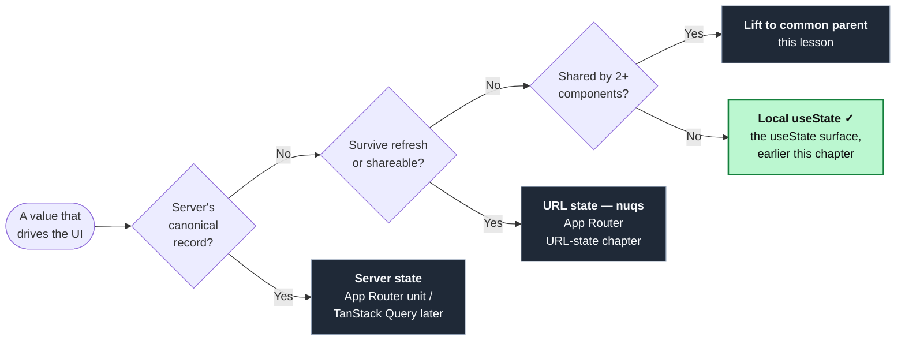

import AnnotatedCode from '../../../components/code/annotated-code/AnnotatedCode.astro';
import AnnotatedStep from '../../../components/code/annotated-code/AnnotatedStep.astro';
import CodeVariants from '../../../components/code/code-variants/CodeVariants.astro';
import CodeVariant from '../../../components/code/code-variants/CodeVariant.astro';
import Buckets from '../../../components/exercises/buckets/Buckets.astro';
import Bucket from '../../../components/exercises/buckets/Bucket.astro';
import Item from '../../../components/exercises/buckets/Item.astro';
import ReactCoding from '../../../components/live-coding/ReactCoding/ReactCoding.astro';
import Figure from '../../../components/figures/Figure.astro';
import StateMachineWalker from '../../../components/figures/state-machine-walker/StateMachineWalker.astro';
import Question from '../../../components/figures/state-machine-walker/Question.astro';
import Branch from '../../../components/figures/state-machine-walker/Branch.astro';
import Leaf from '../../../components/figures/state-machine-walker/Leaf.astro';
import Term from '../../../components/ui/Term.astro';
import ExternalResource from '../../../components/ui/ExternalResource.astro';
import { CardGrid } from '@astrojs/starlight/components';
import CourseProgressBar from '../../../components/ui/CourseProgressBar.astro';

<CourseProgressBar value={frontmatter['course-progress']} />

Picture a search box above a list of rows: the user types "shoes" and the list narrows to shoes.
Call it a `SearchableTable`, one `<input>` at the top and product rows below.

The `query` string the user types has to live somewhere.
Your reflex is `useState`, but a question comes first, one the API can't answer: where should the value live?
Local to the input that produced it, lifted up to the component that owns the rows it filters, or in the URL itself as `?q=shoes`?

In a ten-line demo the choices look identical, because they all narrow the list.
The difference only shows once the app is real.
If `query` lives in the URL, the user can refresh and keep the filter, bookmark it, or paste the link to a teammate who lands on the same view; in local state, a refresh wipes it and the link is useless.
Placement decides whether the value can be shared, whether the filter survives a refresh, whether the back button undoes it, and whether the page can render on the server.

So this lesson is about placement, not the API.
A value can live in one of four homes: local, lifted, the URL, or the server.
Picking the right one is a senior skill with almost nothing to do with `useState`'s signature, and the reflex to build is *colocate first, relocate on evidence*: start a value at the narrowest spot that works, and move it outward only when something concrete forces the move, never on a hunch that you might need it elsewhere later.

One term carries the rest of the lesson.
Wherever a value finally lives, that location is its <Term definition="The single authoritative location a value is read from and written to. Every other place that shows the value reads a copy; nothing else gets to disagree with it.">source of truth</Term>.
Most placement bugs are two sources of truth that have drifted apart, so keep the phrase in mind as each decision comes up.

## Home 1: local, the default

Every value starts here.
Local state belongs to one component, and nobody else in the tree cares about it: whether a dropdown is open, which row is hovered, which accordion section is expanded.
There's no one to share it with, so it sits where it's used and never moves.
This is the default home, and you leave it only when concrete evidence forces you to.

Here's the `SearchableTable` in its simplest honest form.

```tsx title="SearchableTable.tsx" {4} {5-7}
type Product = { id: string; name: string };

export function SearchableTable({ products }: { products: Product[] }) {
  const [query, setQuery] = useState('');
  const visible = products.filter((product) =>
    product.name.toLowerCase().includes(query.toLowerCase()),
  );

  return (
    <div>
      <input
        value={query}
        onChange={(event) => setQuery(event.target.value)}
        placeholder="Search products"
      />
      <ul>
        {visible.map((product) => (
          <li key={product.id}>{product.name}</li>
        ))}
      </ul>
    </div>
  );
}
```

`query` is local state, but notice it does *not* live inside the `<input>`.
The input reads it to stay controlled, and the list reads it to filter, so it has to sit where both can see it: their nearest common parent, `SearchableTable`.
Put the `useState` inside the `<input>` instead and the list is stranded below it, unable to read the filter.

That is <Term definition="Placing state in (or just above) the component that uses it, rather than defaulting it high in the tree. For one consumer, that's the consumer itself; for several, it's their nearest common ancestor.">colocation</Term>: put state at the *narrowest* component still above everyone who reads it.
One reader, and that's the reader itself; two readers like `query` here, and it's their nearest common ancestor.
Push it lower and you strand a consumer (under-lifted); pull it higher than necessary and you've over-lifted.
Both smells return later in the lesson; the whole skill is finding the one height that avoids them.

By that measure the baseline is already placed right.
Notice too, as a callback to the previous lesson, that `visible` is *not* state: it's the filtered list, derived in render from `products` and `query`.
Storing it would create a second source of truth that could disagree with the input.
So `query` is the only state here, sitting at its floor: the first home, done right.

## Home 2: lifted, when a second component needs it

Local state holds until a second component needs the same value, and then it has to move.
That move is called *lifting state up*, and it carries a convention people routinely get wrong.

The trigger arrives like this.
The product manager wants two additions to `SearchableTable`: a result counter next to the search box ("12 results for 'shoes'"), and a "Clear" button elsewhere that resets the filter.
Now `query` has three consumers, the input, the new `<ResultCount>`, and the "Clear" button, and they are siblings rather than nested.

That is the trigger: a real second component, in hand, that needs to read or change the value, not "a sibling might need this someday."
Here `query` already lives in `SearchableTable`, the common parent, so the siblings just read it from props and report changes back up.
The general rule: when two or more components need the same value, move it to their closest common ancestor and flow it back down as props.
That ancestor becomes the single source of truth; the children render purely from what they are handed.

Three situations trip the trigger, and together they cover almost every real case:

1. **Two siblings need the same value.** The filter input, the results list, and the count all read `query`. This is the one we're building.
2. **An ancestor must react to a child's state.** A form's Save button stays disabled until the fields are valid. The button isn't inside the fields, so the form above both has to own the field values to decide.
3. **The value must outlive one child's unmount.** A draft that should survive a tab switch can't live inside the tab that unmounts. (A `key` reset from the previous chapter is often cleaner. Lift only when the value genuinely belongs to the parent.)

Lifting makes the children *controlled*: they hold no state, render from props, and announce changes upward.
That is the controlled-input pattern from the React chapter, now generalized past `<input>` to any component.
The mechanic is the same; what's new is the shape of the contract you hand down.

### Hand down a callback, not a setter

When a child needs to change the lifted value, you can pass the raw `setQuery` setter down, or a *named callback* like `onQueryChange`.
They look interchangeable. They are not, and the course always chooses the callback.

<CodeVariants>
  <CodeVariant label="Setter passed down">
    <div data-mark-color="orange">

    ```tsx "setQuery: Dispatch<SetStateAction<string>>" "setQuery(event.target.value)"
    function SearchBar({ query, setQuery }: {
      query: string;
      setQuery: Dispatch<SetStateAction<string>>;
    }) {
      return <input value={query} onChange={(event) => setQuery(event.target.value)} />;
    }
    ```

    </div>
    This works but leaks the parent's storage choice. That `Dispatch<SetStateAction<string>>` type is `useState`'s setter signature bleeding across the boundary, so the child now knows the value came from `useState`. Refactor the parent to a reducer or a store and every child's type breaks.
  </CodeVariant>

  <CodeVariant label="Typed callback">
    <div data-mark-color="green">

    ```tsx "onQueryChange: (next: string) => void" "onQueryChange(event.target.value)"
    function SearchBar({ query, onQueryChange }: {
      query: string;
      onQueryChange: (next: string) => void;
    }) {
      return <input value={query} onChange={(event) => onQueryChange(event.target.value)} />;
    }
    ```

    </div>
    The child asks for a string and a way to report a new one, with nothing about *how* the parent stores it. The parent can add validation, debouncing, or logging inside `onQueryChange`, and swap its storage freely, without the child noticing. This is the shape the course uses.
  </CodeVariant>
</CodeVariants>

This is single-source-of-truth thinking applied to the contract itself.
A setter says "here is my storage, write to it," coupling the child to how the parent stores the value today.
A callback says "tell me what changed and I'll decide what to do," leaving the parent free to change its mind.
The name follows the convention you've seen: a handler the parent passes is `onSomethingChange`.
The one exception: a tiny presentational `<Input>` whose whole job is to be the input can take a setter, because it genuinely is the input.
Anything more than that gets a callback.

Here's the whole lifted `SearchableTable`, the parent that owns `query` and the children that render from it.
Walk the four steps in order.

<AnnotatedCode lang="tsx" maxLines={18} code={`
function SearchableTable({ products }: { products: Product[] }) {
  const [query, setQuery] = useState('');
  const visible = products.filter((product) =>
    product.name.toLowerCase().includes(query.toLowerCase()),
  );

  return (
    <div>
      <SearchBar query={query} onQueryChange={setQuery} />
      <ResultsList products={visible} />
    </div>
  );
}

function SearchBar({ query, onQueryChange }: {
  query: string;
  onQueryChange: (next: string) => void;
}) {
  return (
    <input value={query} onChange={(event) => onQueryChange(event.target.value)} />
  );
}

function ResultsList({ products }: { products: Product[] }) {
  return (
    <ul>
      {products.map((product) => (
        <li key={product.id}>{product.name}</li>
      ))}
    </ul>
  );
}
`}>
  <AnnotatedStep meta="{2}" color="green">
    `SearchableTable` owns `query`. This one `useState` in the common parent is the single source of truth; both children read from it, neither holds a copy.
  </AnnotatedStep>

  <AnnotatedStep meta="{9}" color="green">
    The parent hands `SearchBar` the current `query` and a callback to report changes. Value down, change events up: the controlled pattern, generalized.
  </AnnotatedStep>

  <AnnotatedStep meta="{19-21}" color="green">
    `SearchBar` is purely controlled: no state, renders `value` from its prop, calls `onQueryChange` on input. The parent's storage is invisible to it.
  </AnnotatedStep>

  <AnnotatedStep meta="{3-4} {10}" color="green">
    `visible` is derived in render, not stored, and passed to `ResultsList`, which renders from props alone. One source of truth, two readers, zero duplication.
  </AnnotatedStep>
</AnnotatedCode>

Now do it yourself, because the contract is easy to get backwards.
The exercise starts broken the way beginners ship it: `query` is stranded as local state *inside* `SearchBar`, so `ResultsList` can't see it and the list never filters.
Lift `query` to `SearchableTable` and wire the children with `query` and `onQueryChange`.

<ReactCoding
  instructions="`query` is stranded inside `SearchBar`, so typing does nothing to the list. Lift it: move the `useState` up to `SearchableTable`, pass `query` and an `onQueryChange` callback down to `SearchBar`, and pass the filtered products to `ResultsList`. Type to confirm the list narrows."
  starter={`import { useState } from 'react';

type Product = { id: string; name: string };

const PRODUCTS: Product[] = [
  { id: 'a', name: 'Running shoes' },
  { id: 'b', name: 'Hiking boots' },
  { id: 'c', name: 'Wool socks' },
  { id: 'd', name: 'Rain jacket' },
];

function SearchBar() {
  // ❌ query is stranded here — ResultsList can't see it, so the list never filters.
  const [query, setQuery] = useState('');
  return (
    <input
      className="rounded border px-2 py-1"
      value={query}
      onChange={(event) => setQuery(event.target.value)}
      placeholder="Search products"
    />
  );
}

function ResultsList({ products }: { products: Product[] }) {
  return (
    <ul>
      {products.map((product) => (
        <li key={product.id}>{product.name}</li>
      ))}
    </ul>
  );
}

function SearchableTable({ products }: { products: Product[] }) {
  return (
    <div className="space-y-3 p-4">
      <SearchBar />
      <ResultsList products={products} />
    </div>
  );
}

export function App() {
  return <SearchableTable products={PRODUCTS} />;
}`}
  tests={`
const getInput = () => document.querySelector('input');
const rowCount = () => document.querySelectorAll('li').length;

// Set a controlled input's value the way React's onChange will notice, dispatch
// the input event the controlled pattern listens to, then flush the update so
// the next assertion reads committed DOM.
function typeInto(input, value) {
  const setter = Object.getOwnPropertyDescriptor(
    window.HTMLInputElement.prototype,
    'value',
  ).set;
  setter.call(input, value);
  input.dispatchEvent(new Event('input', { bubbles: true }));
  flushSync(() => {});
}

test('before typing, every product renders', () => {
  expect(rowCount()).toBe(4);
});

test('typing "shoes" narrows the list to the one matching row', () => {
  typeInto(getInput(), 'shoes');
  expect(rowCount()).toBe(1);
  expect(document.querySelector('li')?.textContent).toBe('Running shoes');
});

test('the input stays controlled — its value reflects the typed query', () => {
  typeInto(getInput(), 'shoes');
  expect(getInput()?.value).toBe('shoes');
});
`}
/>

<details>
<summary>Reference solution</summary>

```tsx
import { useState } from 'react';

type Product = { id: string; name: string };

function SearchBar({ query, onQueryChange }: {
  query: string;
  onQueryChange: (next: string) => void;
}) {
  return (
    <input
      className="rounded border px-2 py-1"
      value={query}
      onChange={(event) => onQueryChange(event.target.value)}
      placeholder="Search products"
    />
  );
}

function ResultsList({ products }: { products: Product[] }) {
  return (
    <ul>
      {products.map((product) => (
        <li key={product.id}>{product.name}</li>
      ))}
    </ul>
  );
}

function SearchableTable({ products }: { products: Product[] }) {
  const [query, setQuery] = useState('');
  const visible = products.filter((product) =>
    product.name.toLowerCase().includes(query.toLowerCase()),
  );

  return (
    <div className="space-y-3 p-4">
      <SearchBar query={query} onQueryChange={setQuery} />
      <ResultsList products={visible} />
    </div>
  );
}
```

The `useState` moves up to `SearchableTable`, the nearest common ancestor of the input and the list.
`SearchBar` becomes controlled: no state, renders `value` from its `query` prop, and reports keystrokes through the typed `onQueryChange` callback instead of the raw `setQuery` setter.
`visible` is derived in render from `products` and `query` and handed to `ResultsList`, so there's one source of truth and two readers.

</details>

## Home 3: the URL, when it should survive a refresh or be shared

Lifting handles "more than one component needs this on screen right now."
It does nothing when a user filters to "shoes" and reloads, expecting the filter to survive, or copies the URL to a teammate, expecting them to land on the same view.
A reload throws away every `useState` in the tree, and a link carries nothing about what was on screen.

When a value should survive a refresh or travel in a link, it belongs in the URL: `?q=shoes`.
The URL becomes the source of truth: components no longer own `query`, they read it from the address bar and write changes back.
This makes the URL global state with a free synchronization mechanism, since every tab, reload, and shared link reads the same string and the browser keeps them in sync for you.

This is the home for a recognizable family: search filters, the current page in a paginated list, sort order, the selected tab, and the ID of an open detail panel or modal you'd want to be linkable.
They share a fingerprint: losing them on refresh would annoy a user, and a shareable link to them would be useful.

That gives you a two-question test for any value:

1. If the user reloads the page, do they expect this to still be here?
2. If they share the link, should the recipient see the same view?

**Either "yes" means the URL.** Both "no" means local or lifted is fine.
A filtered catalog survives a refresh and a shared link is useful, so `query` graduates to the URL.
A dropdown's open/closed flag fails both, so it stays local.

### `nuqs`, the typed way to read and write the URL

You can read and write the URL by hand with the browser's `searchParams` and a router push, and for a single param that's fine.
But reads come back as raw strings, every value needs parsing and a default, and updating several params at once without clobbering the others gets fiddly.
Once URL state grows past a param or two, reach for <Term definition="A typed search-params library for React. Treats URL query params like useState — typed parsers, defaults, batched updates, history control — so reading and writing the URL feels like local state.">nuqs</Term>, which wraps the raw <Term definition="The ?key=value portion of the URL — its query string. When a value lives in the URL, this is its source of truth: components read it here and write changes back to it.">searchParams</Term> with typed parsers, defaults, batched updates, and history control.

Here's the entire point of it, in one line.

```tsx
const [query, setQuery] = useQueryState('q', parseAsString.withDefault(''));
```

The shape `const [query, setQuery] = ...` mirrors a `useState` call on purpose: you read a value and get a setter, except the value lives in `?q=` instead of component memory, so it survives refreshes and rides along in shared links.
`'q'` is the URL key, and `parseAsString.withDefault('')` says how to read it and what to fall back to when it's absent.
The full `nuqs` surface is taught in the App Router URL-state chapter; here you only need the placement decision.

:::caution
Because the URL is just text a user can edit, `?page=abc` or `?q=` followed by a script tag is entirely possible.
URL state must be parsed and validated on read, with Zod, and never trusted as-is.
For now, remember that a URL value is untrusted input.
:::

## Home 4: the server, when it's the canonical record

The fourth home is the one beginners abuse most expensively.
Some values aren't your component's to hold at all: the user's saved products, the team's settings, the list of invoices.
That data is backed by a database, the database is its source of truth, and it is **server state** that does not belong in long-lived `useState`.

The failure looks fine in development.
You fetch the list of invoices once and drop it into `useState`, and it renders.
Then a user opens two tabs, edits an invoice in tab A, and tab B shows the old data indefinitely, because that tab's `useState` has no idea the server changed underneath it.
`useState` is a snapshot in one component in one tab; the same root cause gives you a refetch on every remount and optimistic updates that silently get lost.

:::caution
Server state in `useState` looks like it works until the user opens a second tab.
:::

The fix isn't a smarter `useState`, it's a different home: read the data in a Server Component fetched fresh per request, or hand it to a server-state cache that knows how to refetch and invalidate.
Both keep the database as the source of truth instead of pretending a component snapshot is.
The only job here is to reserve the slot, so `useState` never claims data that belongs to the server.

## The decision tree, run top-down

With all four homes in hand, fold them into one ordered decision you run *before* reaching for `useState`.
The order matters: ask the most consequential question first.

1. **Is it the server's canonical record, data backed by a database?** → server (a Server Component or a query cache).
2. **Should it survive a refresh, or be shareable via the URL?** → the URL.
3. **Do two or more components need to read or change it?** → lift to their closest common ancestor.
4. **Otherwise** → local `useState`.

Server and URL come first because they're *global* concerns that override locality.
However many components read the invoice list, if it's server data, that settles it.
Only after ruling out both global tiers do you ask whether to lift, and local `useState` is what's left when every other answer was no.

This top-down order seems to contradict "colocate first, relocate on evidence," but it doesn't.
When you *write* new code, you default to local and move outward only when forced.
When you *audit* a value, asking "is this in the right home?", you check the global tiers first, because a value wrongly stuffed in `useState` that belongs in server or URL state is the most expensive mistake to catch late.
Same reflex, two directions: you build from the leaf outward and audit from the top down.

Walk the recurring `query` example and a couple of foils through the questions one at a time.

<StateMachineWalker kind="decision" title="Where does this value live?">
  <Question
    id="server"
    prompt="Is this the server's canonical record — saved data backed by a database?"
    description="Things like the user's invoices, the team's settings, a saved product list."
  >
    <Branch label="Yes — it's backed by a DB" to="leaf-server" />
    <Branch label="No, it's UI state" to="share" />
  </Question>

  <Question
    id="share"
    prompt="Should it survive a refresh or be shareable via the URL?"
    description="Apply the two-question test: would a user expect it to stick on reload, or a shared link to reproduce the view?"
  >
    <Branch
      label="Yes — refresh or share matters"
      to="leaf-url"
      rationale="A search filter, page number, sort order, selected tab."
    />
    <Branch label="No, it's ephemeral" to="siblings" />
  </Question>

  <Question
    id="siblings"
    prompt="Do two or more components need to read or change it?"
  >
    <Branch label="Yes — siblings share it" to="leaf-lift" />
    <Branch label="No, just one component" to="leaf-local" />
  </Question>

  <Leaf id="leaf-server" verdict="Server Component or query cache">
    The database is the source of truth.
    Read it in a Server Component (App Router unit) or cache it with TanStack Query (later in the course), never in long-lived `useState`, or the second tab goes stale.
  </Leaf>

  <Leaf id="leaf-url" verdict="URL state (nuqs)">
    The URL is the source of truth; it survives refreshes and rides along in shared links for free.
    Reach for `nuqs` once you're past a param or two.
  </Leaf>

  <Leaf id="leaf-lift" verdict="Lift to the closest common ancestor">
    One `useState` at the common parent is the single source of truth.
    Pass the value down as a prop and a typed `onChange` callback; children stay controlled.
  </Leaf>

  <Leaf id="leaf-local" verdict="Local useState">
    Colocate it at the narrowest component that reads it.
    This is the default; you leave it only on evidence.
  </Leaf>
</StateMachineWalker>

The same four homes map onto this part of the course, each getting its full treatment at a different point.

<Figure caption="The four homes, and where the course teaches each. Every 'no' falls through to the right, toward the default of local useState.">

```mermaid
%%{init: {'themeCSS': '.node.home .nodeLabel { font-family: ui-monospace, SFMono-Regular, Menlo, Monaco, Consolas, monospace; }'} }%%
flowchart LR
  start([A value that<br/>drives the UI])
  q1{"Server's<br/>canonical<br/>record?"}
  q2{"Survive refresh<br/>or shareable?"}
  q3{"Shared by 2+<br/>components?"}

  server["<b>Server state</b><br/>App Router unit /<br/>TanStack Query later"]
  url["<b>URL state — nuqs</b><br/>App Router<br/>URL-state chapter"]
  lift["<b>Lift to common parent</b><br/>this lesson"]
  local["<b>Local useState ✓</b><br/>the useState surface,<br/>earlier this chapter"]

  start --> q1
  q1 -- Yes --> server
  q1 -- No --> q2
  q2 -- Yes --> url
  q2 -- No --> q3
  q3 -- Yes --> lift
  q3 -- No --> local

  class server,url,lift offramp
  class local home
  classDef offramp fill:#1f2937,stroke:#94a3b8,color:#f8fafc
  classDef home fill:#bbf7d0,stroke:#15803d,color:#111,stroke-width:2px
```
</Figure>

## Two smells: under-lifted and over-lifted

Picking the right home as you write is half the skill.
The other half is spotting the wrong home in code that already exists, yours or a teammate's.
Two smells cover most misplacements, and they mirror each other: state lifted too *little*, and state lifted too *much*.

### Under-lifted: duplicated state plus a sync effect

The first smell is a lift that never happened.
The shape: one `useState` for a value in one component, a *second* `useState` for the same value in another, and a `useEffect` whose only job is to copy one into the other.

<CodeVariants>
  <CodeVariant label="Duplicated + synced">
    <div data-mark-color="orange">

    ```tsx {2} {3} {8}
    function SearchBar({ onQueryChange }: { onQueryChange: (next: string) => void }) {
      const [input, setInput] = useState('');
      useEffect(() => onQueryChange(input), [input, onQueryChange]);
      return <input value={input} onChange={(event) => setInput(event.target.value)} />;
    }

    function SearchableTable({ products }: { products: Product[] }) {
      const [query, setQuery] = useState('');
      return <SearchBar onQueryChange={setQuery} />;
    }
    ```

    </div>
    Two `useState`s track one idea, the bar's `input` and the table's `query`, kept in step by an effect that copies one into the other. That's two sources of truth that disagree for a frame on every keystroke: a `useState` watched by a `useEffect` that sets it, exactly the anti-pattern the previous lesson warned against.
  </CodeVariant>

  <CodeVariant label="One source, lifted">
    <div data-mark-color="green">

    ```tsx {2} {5}
    function SearchableTable({ products }: { products: Product[] }) {
      const [query, setQuery] = useState('');
      return (
        <div>
          <SearchBar query={query} onQueryChange={setQuery} />
          {/* list reads the same `query` */}
        </div>
      );
    }
    ```

    </div>
    Delete both copies and the effect; keep one `useState` at the common parent, passed down as `query` and `onQueryChange`. One source of truth, nothing to sync, no stale frame. The fix for "duplicated state synced by an effect" is almost always "lift the one copy that should have existed all along."
  </CodeVariant>
</CodeVariants>

This is the previous lesson's anti-pattern, a `useState` fed by a `useEffect` that watches other state, seen from the placement angle.
There the cause was *deriving* a value that belonged in render; here it's *duplicating* a value that belonged one level up.
The tell is the same: when a state variable's updates come from an effect watching *another* state variable, ask which single home the value should have had.

### Over-lifted: state hoisted above its only reader

The mirror image is lifting taken too far: a value hoisted high above the one component that reads it.
Picture a settings page with tabs whose `activeTab` lives in the root layout that wraps the whole app, even though only the settings page reads it.
It works, but a state change re-renders the owning component and everything beneath it, and beneath the root is the entire app, so one tab click repaints everything to update one panel.

The fix is the inverse of the first smell: push the state *down* to the smallest component that needs it, the settings page, or just the tab strip and its panel.
The render then stays contained to that subtree.

Side by side, the two smells reduce to one sentence: **lifting too eagerly is as wrong as lifting too late.**
They aren't opposite mistakes with different cures; they're the same misjudgment, state at the wrong height, pointing opposite ways.
Both ask the same question: what's the narrowest component above everyone who reads this value?
That height, no higher and no lower, is where the state belongs.

### The form that lifts correctly

The most common *legitimate* lift in a web app is form state, which lives on the **form component**, not scattered across the inputs.

```tsx title="InvoiceForm.tsx" {2} {9-10}
function InvoiceForm() {
  const [values, setValues] = useState({ client: '', amount: '' });

  const setField = (field: keyof typeof values) => (next: string) =>
    setValues((current) => ({ ...current, [field]: next }));

  return (
    <form>
      <TextField value={values.client} onChange={setField('client')} />
      <TextField value={values.amount} onChange={setField('amount')} />
      {/* the form owns submit, validation, and dirty-tracking */}
    </form>
  );
}
```

Submit, validation, and dirty-tracking all need to see *every* field at once, so the fields can't each hoard their own state.
The inputs become presentational: controlled, fed a `value`, reporting changes through `onChange`.
This is trigger #2 from earlier, an ancestor (the form) reacting to its children's state, and the forms unit returns to it with validation and submission.
For now, recognize the shape: the form is the source of truth, the inputs render from it.

Now diagnose six real values.
Each comes from a UI you'll build; sort it into its home using the decision tree.

<Buckets twoCol instructions="Sort each value into the home it belongs in. Run the tree top-down: server-backed? survives refresh or shareable? shared by two components on screen? otherwise local.">
  <Bucket name="local" label="Local" description="One component reads it; ephemeral" />
  <Bucket name="lifted" label="Lifted" description="Several components on screen share it" />
  <Bucket name="url" label="URL" description="Survives refresh, shareable as a link" />
  <Bucket name="server" label="Server" description="Canonical record backed by a database" />

  <Item bucket="local">Whether a confirmation modal is open</Item>
  <Item bucket="url">The active search filter on a list</Item>
  <Item bucket="server">The signed-in user's saved profile</Item>
  <Item bucket="local">Which sidebar accordion section is expanded</Item>
  <Item bucket="url">The current page number in a paginated list</Item>
  <Item bucket="lifted">An unsaved draft shared by a form and its inputs</Item>
</Buckets>

<details>
<summary>Answer key</summary>

Run each value through the tree top-down (server, then URL, then lift, then local) and the first "yes" is its home.

- **Whether a confirmation modal is open → Local.** Ephemeral, one owner; nobody reloads expecting a dialog to still be open, and "share my open modal" is meaningless.
- **The active search filter on a list → URL.** The two-question test answers yes twice: a user expects the filter to survive a refresh, and a shared link to the filtered view is useful.
- **The signed-in user's saved profile → Server.** A database-backed canonical record. Keep it in long-lived `useState` and the second tab goes stale.
- **Which sidebar accordion section is expanded → Local.** Ephemeral UI with a single reader, and no refresh or share expectation.
- **The current page number in a paginated list → URL.** A shared link should land the recipient on the same page, and the page should survive a refresh.
- **An unsaved draft shared by a form and its inputs → Lifted.** The form and its fields both need it on screen right now, but it's neither server-backed nor worth sharing, so lift it to the form, the closest common ancestor.

</details>

## Prop-drilling versus context

When lifted state has to travel down through several intermediate components to reach the one that needs it, you're *prop-drilling*: threading a prop through layers that don't use it themselves.
It feels tedious, and the tempting fix is to reach for context to teleport the value past the middle.

Prop-drilling is not automatically a problem.
Two or three layers of an explicit prop is fine, and the path stays visible and typed: each intermediate component shows what flows through, and the compiler checks every hop.
Context is sometimes the right replacement, for genuinely cross-cutting state that half the app reads, like the authenticated user, the theme, or the locale.
But it trades that visible, typed path for an invisible one, and it carries its own re-render cost.
The rule: context is for cross-cutting concerns, not for skipping a couple of intermediate components.
When and how to make that call belongs to the lesson on context in the next chapter.

:::tip
Reaching for context to avoid passing a prop two layers deep trades a visible, typed contract for a hidden one. Pass the prop.
:::

One escape worth knowing: when the drilling comes from *layout* nesting rather than data flow, like a `Card` wrapping a `CardHeader` wrapping a `CardBody`, the compound-component pattern from the React chapter wires the children together implicitly, so there's no prop to drill.
Reach for it when the depth is structural, not when the value is cross-cutting.

## Where to go deeper

The lifting mechanic and the single-source-of-truth principle have canonical writeups in the React docs, and `nuqs` is worth a glance now even though its full surface lands later.

<CardGrid>
  <ExternalResource
    title="Sharing State Between Components"
    href="https://react.dev/learn/sharing-state-between-components"
    icon="simple-icons:react"
    iconColor="#61DAFB"
    description="The React docs on lifting state — the mechanic, step by step, with the controlled-children pattern."
  />
  <ExternalResource
    title="Choosing the State Structure"
    href="https://react.dev/learn/choosing-the-state-structure"
    icon="simple-icons:react"
    iconColor="#61DAFB"
    description="Placement and single-source-of-truth principles — avoiding duplicate and contradictory state."
  />
  <ExternalResource
    title="nuqs — type-safe URL state"
    href="https://nuqs.dev"
    icon="lucide:link"
    description="The 2026 URL-state library. Recognition for now; the deep use comes in later chapters."
  />
</CardGrid>
