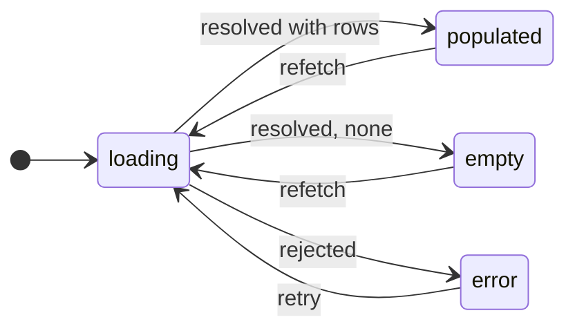

import AnnotatedCode from '../../../components/code/annotated-code/AnnotatedCode.astro';
import AnnotatedStep from '../../../components/code/annotated-code/AnnotatedStep.astro';
import CodeVariants from '../../../components/code/code-variants/CodeVariants.astro';
import CodeVariant from '../../../components/code/code-variants/CodeVariant.astro';
import Figure from '../../../components/figures/Figure.astro';
import TabbedContent from '../../../components/figures/tabbed-content/TabbedContent.astro';
import TabbedItem from '../../../components/figures/tabbed-content/TabbedItem.astro';
import StateMachineWalker from '../../../components/figures/state-machine-walker/StateMachineWalker.astro';
import Question from '../../../components/figures/state-machine-walker/Question.astro';
import Branch from '../../../components/figures/state-machine-walker/Branch.astro';
import Buckets from '../../../components/exercises/buckets/Buckets.astro';
import Bucket from '../../../components/exercises/buckets/Bucket.astro';
import Item from '../../../components/exercises/buckets/Item.astro';
import MultipleChoice from '../../../components/exercises/multiple-choice/MultipleChoice.astro';
import McqChoice from '../../../components/exercises/multiple-choice/McqChoice.astro';
import McqWhy from '../../../components/exercises/multiple-choice/McqWhy.astro';
import TrueFalse from '../../../components/exercises/true-false/TrueFalse.astro';
import Statement from '../../../components/exercises/true-false/Statement.astro';
import TfWhy from '../../../components/exercises/true-false/TfWhy.astro';
import ReactCoding from '../../../components/live-coding/ReactCoding/ReactCoding.astro';
import Term from '../../../components/ui/Term.astro';
import VideoCallout from '../../../components/embeds/VideoCallout.astro';
import ExternalResource from '../../../components/ui/ExternalResource.astro';
import { CardGrid } from '@astrojs/starlight/components';
import CourseProgressBar from '../../../components/ui/CourseProgressBar.astro';

<CourseProgressBar value={frontmatter['course-progress']} />

The invoices table looks finished. Rows render, the columns line up, it is pixel-perfect in the demo against your seeded data. You ship it. Then a real user opens it on a brand-new account and sees a bare header sitting above a void: no rows, no "create your first invoice," nothing to do. Another opens it on hotel wifi and stares at a blank rectangle that, a beat later, snaps into a full table and shoves the rest of the page down. A third opens it the moment your API hiccups and gets a spinner that never stops.

The table was only ever designed for one of its states. It has four.

By the end of this lesson you will design all four states of any data surface, loading, empty, error, and populated, as a contract you hold from the first commit. You will drive them from a single state value instead of a pile of booleans, and pair each visual state with what a screen-reader user needs to perceive it. You already have the pieces: the shadcn primitives from the start of this chapter, and the live-region vocabulary from the ARIA lesson. This lesson is the discipline that composes them into a component that is actually finished.

## The four states are a contract

Every list, table, card, and widget that shows data lives in exactly one of four states at any moment:

- **Loading.** The data is in flight. There is nothing to show yet because the answer hasn't arrived.
- **Empty.** The data loaded successfully, and there is genuinely none: a fresh account, or a filter that matched nothing.
- **Error.** The data didn't load. The request failed.
- **Populated.** The happy path. Data is in hand and you render it.

Four states, mutually exclusive, exactly one on screen at a time.

The one that trips people up is **empty**. Both loading and empty show nothing on screen, so empty gets lumped in with loading. But they are opposites. Loading is the state *before* the answer arrives; empty is the answer, and the answer is "none." They need different pixels (a placeholder skeleton versus an onboarding prompt) and different announcements ("Loading…" versus a heading a screen reader can actually read). Conflate them and you get the most common version of this bug: a spinner that spins forever on an account that has no data, because the code is still waiting for rows that are never coming.

Before you read on, sort each scenario into the state it actually describes.

<Buckets twoCol instructions="Each line describes one moment in a component's life. Sort it into the state it belongs to.">
  <Bucket name="loading" label="Loading" description="Before the answer arrives" />
  <Bucket name="empty" label="Empty" description="The answer arrived, and it's 'none'" />

  <Item bucket="loading">The request is still in flight</Item>
  <Item bucket="loading">We don't yet know whether there are any rows</Item>
  <Item bucket="loading">The placeholder skeleton is on screen</Item>
  <Item bucket="empty">The query succeeded and returned zero rows</Item>
  <Item bucket="empty">A brand-new account that has never created an invoice</Item>
  <Item bucket="empty">The active filter matched nothing</Item>
</Buckets>

One more thing before any code: this is a lesson about *components*, not about fetching. The four-state contract is a property of the component itself, independent of where its data comes from. A Server Component awaiting a query, a Client Component reading a cache, and a `use(promise)` boundary all surface these same four states. So you will not see `fetch` or `await` here. The data source is abstracted down to a single value that tells the component which state it is in. Later chapters wire that value to real server data: route-level loading with Suspense in the chapter on the App Router and streaming, and the full server-data lifecycle when you build a real URL-driven list view. This lesson teaches the *shape* every one of them renders.

Here is the habit worth forming now: **before you write the populated view, name the other three.** A component that can only render populated isn't done. It's one-quarter done.

## Three booleans is the bug; one status is the cure

You have almost certainly written the component below, and almost certainly watched it rot. It is the natural first thing to reach for, and it is the bug at the center of this lesson.

You track loading, error, and data as three independent pieces of state, then render them with a ladder of `if`s.

<CodeVariants>
  <CodeVariant label="Three booleans">
    <div data-mark-color="red">

    ```tsx title="invoices-panel.tsx" {14-17}
    'use client';

    type InvoicesPanelProps = {
      isLoading: boolean;
      error: Error | null;
      invoices: Invoice[];
    };

    export const InvoicesPanel = ({
      isLoading,
      error,
      invoices,
    }: InvoicesPanelProps) => {
      if (isLoading) return <TableSkeleton />;
      if (error) return <ErrorCard error={error} />;
      if (invoices.length === 0) return <EmptyState />;
      return <InvoiceTable invoices={invoices} />;
    };
    ```

    </div>
    **Three independent booleans, and a render ladder whose correctness depends on the order of its checks.** Swap the `error` and `length === 0` lines and an empty state paints on top of a real error. Worse, the types let you set `isLoading: true`, `error`, and three rows of `invoices` all at once, a combination the domain forbids but the booleans happily allow. And "loading while showing the rows you already have" has no home here at all.
  </CodeVariant>

  <CodeVariant label="One discriminated union">
    <div data-mark-color="green">

    ```tsx title="invoices-panel.tsx" "status: 'loading'" "status: 'empty'" "status: 'error'" "status: 'populated'" "state.status"
    'use client';

    type InvoicesState =
      | { status: 'loading' }
      | { status: 'empty' }
      | { status: 'error'; error: Error }
      | { status: 'populated'; invoices: Invoice[] };

    export const InvoicesPanel = ({ state }: { state: InvoicesState }) => {
      switch (state.status) {
        case 'loading':
          return <TableSkeleton />;
        case 'empty':
          return <EmptyState />;
        case 'error':
          return <ErrorCard error={state.error} />;
        case 'populated':
          return <InvoiceTable invoices={state.invoices} />;
      }
    };
    ```

    </div>
    **One value, every state named exactly once.** Each variant carries only the data that state needs: `error` has no invoices, `populated` has no error, so the impossible combinations can't be written at all. The `switch` over `status` is exhaustive, and inside `case 'populated'` TypeScript already knows `state.invoices` exists, with no optional-chaining dance. The same four states, minus every way the booleans let you get it wrong.
  </CodeVariant>
</CodeVariants>

The cure is a <Term definition={"A single state value with a literal-typed field, here 'status', that tells TypeScript which variant of the union you're in. Switch on it and each branch is narrowed to exactly that variant's data."}>discriminated union</Term>. Instead of three booleans you keep one `status` field, the <Term definition={"The literal-typed field whose value selects the variant. Here it's 'status'; checking it narrows the rest of the object to that variant's shape."}>discriminant</Term>, and the union lists the four shapes the state can take, one per line. This is the project's "prefer discriminated unions over flag booleans" rule made visible, and the four-state contract is its best demonstration.

Look at what the union buys you. Each variant carries *only* the data that state owns: the error variant has an `error` and no invoices, the populated variant has `invoices` and no error. The shapes the booleans permitted but the domain forbids, loading and errored and full all at once, are now unwritable, because there is no variant with that shape. Three independent booleans can express eight combinations (two to the third) for four real states, and the extra four were always bugs waiting to be hit. The union closes that gap to zero.

And then the compiler works for you. Switch on `state.status`, and inside each `case` TypeScript narrows the object to that one variant: in `case 'populated'`, `state.invoices` is an `Invoice[]` with no question mark to chase. You already met this narrowing when you learned discriminated unions in the TypeScript chapters; rendering UI is its highest-value everyday use. If you want the compiler to *force* you to handle every state, a `default` branch that assigns `state` to a `never` turns a forgotten case into a compile error rather than a blank screen. That is a trick worth recognizing, not one to drill here.

<VideoCallout videoId="5V-y911AO5c" videoTitle="Level Up Your TypeScript: Discriminated Unions Explained">
  Coder Foundry builds the same type-level union pattern in 10 minutes: three variants joined by a discriminant, narrowed in a `switch`, ending on the `never`-assertion exhaustive switch this lesson just mentioned.
</VideoCallout>

:::note
This lesson hand-sets `status` so the focus stays on *rendering* each state. How the status actually moves (loading flips to populated when the request resolves, populated flips back to loading on a refetch) is the job of the data-fetching chapters. Here, treat the value as given and concentrate on rendering each state well.
:::

With the spine in place, walk the three states that surround the happy path, each with the shadcn primitive that ships its shell and the accessibility twin that makes it perceivable.

## The loading state: skeletons, spinners, and what you know

When the shape of what's coming is known (table rows, a card grid, a list, a dashboard widget) the 2026 default is a <Term definition={"A placeholder that mirrors the shape of the content that's loading: grey blocks where text and rows will land, animated with a subtle pulse. shadcn ships it as the Skeleton primitive."}>skeleton</Term>. shadcn's `Skeleton` is a plain `<div>` with `animate-pulse bg-muted rounded`. Unlike most primitives, it's pure Tailwind and `cn`, with no Radix behind it. You install it the same way as everything else, `pnpm dlx shadcn@latest add skeleton`, and compose it.

The principle that makes a skeleton worth shipping is also the one most often skipped: **the skeleton must occupy the same box the real content will.** Same row heights, same column widths, same number of placeholder rows as you typically render. If the skeleton is a generic grey blob sized differently from the table that replaces it, the page <Term definition={"Content moving on screen after the first paint, as late-arriving elements push the layout around. It's jarring to the eye and a Core Web Vitals penalty."}>shifts</Term> the instant data arrives, which is exactly the jank the skeleton was supposed to prevent. Build the skeleton *from* the populated layout, not as an afterthought.

Here is the skeleton for the invoices table. Three things are happening in it, and they matter in sequence.

<AnnotatedCode lang="tsx" code={`
export const InvoiceTableSkeleton = () => (
  <div role="status" className="space-y-3">
    <span className="sr-only">Loading invoices</span>
    {Array.from({ length: 5 }).map((_, i) => (
      <div key={i} className="flex gap-4">
        <Skeleton className="h-4 w-32" />
        <Skeleton className="h-4 w-48" />
        <Skeleton className="h-4 w-20" />
      </div>
    ))}
  </div>
);
`}>
  <AnnotatedStep meta="{4}" color="blue">
    Render a fixed count of placeholder rows: five, matching how many invoice rows the real table usually shows. The shape on screen while loading is the shape that arrives.
  </AnnotatedStep>

  <AnnotatedStep meta="{6-8}" color="blue">
    Each cell is a `Skeleton` sized to its real column: a narrow block for the amount, a wide one for the description. Match the populated widths here and the table swaps in without nudging a single pixel.
  </AnnotatedStep>

  <AnnotatedStep meta={`{2-3} "Loading invoices"`} color="green">
    A screen reader perceives nothing of a silent pulse. `role="status"` makes the wrapper a polite live region (it implies `aria-live="polite"`), and the `sr-only` "Loading invoices" is the text it announces. The skeleton is for sighted users, the live region is for everyone else. Both ship, always.
  </AnnotatedStep>
</AnnotatedCode>

A skeleton is the right tool when you know the shape. When you don't, reach for the other affordance. shadcn now ships a first-class `Spinner` primitive (a spinning Lucide loader with `animate-spin`) for short, indeterminate work where the layout shape is genuinely unknown or irrelevant, like a button mid-submit or a quick action firing. The distinction is worth keeping in your head as a single line:

> A spinner says *"something is happening."* A skeleton says *"this is coming."*

Skeleton when you know the shape, spinner when you don't.

:::caution
A skeleton on a load that finishes in under ~200ms doesn't help. It *flashes*, appearing and vanishing before the eye settles, and adds the jank it was meant to remove. For loads that are usually that fast, show no loading UI at all, or delay the skeleton so it only mounts if the wait turns out to be real. A small delayed-show hook is a clean home for that rule, the kind of thing the custom-hook catalog covers, but the discipline is simply this: don't flash a skeleton for a load the user never waits on.
:::

For long operations where progress is actually *measurable*, like a file upload or a bulk import, there's a third affordance: shadcn's `Progress` (this one is Radix-backed), driven by a real percentage. When the progress is unknown, use an indeterminate `Progress` or one honest status line ("Importing…"). One rule admits no exceptions: never animate a fake progress bar to look busy. It lies, it desyncs from reality, and users learn not to trust it.

<VideoCallout videoId="4GWqJEfzvmg" videoTitle="Skeleton Screens vs. Progress Bars vs. Spinners">
  The Nielsen Norman Group draws the same three-way distinction (skeleton, spinner, progress bar) and shows when each one is the right call, in three and a half minutes.
</VideoCallout>

## The empty state: a CTA, not a void

Empty is the state juniors under-build the most, because it *looks* like nothing needs doing. In fact it needs the most copy of any of the four.

A useful empty state does a job; it isn't a blank. It has four parts: an icon or small illustration, a heading that names what's missing, a one-line description, and the part that does the real work, a primary <Term definition={"Call to action: the primary button or link that moves the user toward resolving the state, like 'Create your first invoice'. An empty state without one is a dead end."}>CTA</Term> that resolves the empty state. For the invoices table that's "No invoices yet," "Create your first invoice to get started," and a `New invoice` button. The CTA is the entire difference between a useful empty state and a polite shrug. An empty state with no action is a dead end, and a dead end on a fresh account is where new users quietly leave.

shadcn ships this as a composed `Empty` primitive: not a loose block, but a specific set of parts you assemble.

```tsx title="no-invoices.tsx" collapse={1-10}
import { FileText } from 'lucide-react';
import { Button } from '@/components/ui/button';
import {
  Empty,
  EmptyContent,
  EmptyDescription,
  EmptyHeader,
  EmptyMedia,
  EmptyTitle,
} from '@/components/ui/empty';

export const NoInvoices = () => (
  <Empty>
    <EmptyHeader>
      <EmptyMedia variant="icon">
        <FileText />
      </EmptyMedia>
      <EmptyTitle>No invoices yet</EmptyTitle>
      <EmptyDescription>Create your first invoice to get started.</EmptyDescription>
    </EmptyHeader>
    <EmptyContent>
      <Button>New invoice</Button>
    </EmptyContent>
  </Empty>
);
```

Now the part that separates a real empty state from a generic one: **the copy must differ by cause.** The same `Empty` primitive renders four different messages, because the right next action is different each time.

<TabbedContent>
  <TabbedItem label="First-run" caption="No data has ever existed. The CTA onboards: it points at the one action that fills the screen.">

    ```tsx title="no-invoices.tsx" "FileText"
    <Empty>
      <EmptyHeader>
        <EmptyMedia variant="icon">
          <FileText />
        </EmptyMedia>
        <EmptyTitle>No invoices yet</EmptyTitle>
        <EmptyDescription>Create your first invoice to get started.</EmptyDescription>
      </EmptyHeader>
      <EmptyContent>
        <Button>New invoice</Button>
      </EmptyContent>
    </Empty>
    ```

  </TabbedItem>

  <TabbedItem label="Filtered" caption="Data exists; the filter just matched none of it. The CTA must clear the filter, never tell a user with 200 invoices to 'create their first'.">

    ```tsx title="no-matching-invoices.tsx" "SearchX" "Clear filters"
    <Empty>
      <EmptyHeader>
        <EmptyMedia variant="icon">
          <SearchX />
        </EmptyMedia>
        <EmptyTitle>No invoices match your filters</EmptyTitle>
        <EmptyDescription>Try widening your date range or clearing the status filter.</EmptyDescription>
      </EmptyHeader>
      <EmptyContent>
        <Button variant="outline">Clear filters</Button>
      </EmptyContent>
    </Empty>
    ```

  </TabbedItem>
</TabbedContent>

Those are two of four. The full set:

1. **First-run empty.** No data has ever existed. The CTA onboards: "Create your first invoice."
2. **Filtered empty.** Data exists, but the active filter matched none of it. "No invoices match your filters" plus a *Clear filters* action. Not an onboarding CTA, because the data is there and the filter is the obstacle.
3. **Search empty.** A query returned nothing. Echo the query back, and offer to broaden or correct it.
4. **Permission empty.** Data exists, but this user can't see it. Explain *access*, not absence: "You don't have access to this workspace's invoices." Never imply there's nothing there when there is.

Name all four, because the classic mistake is shipping the first-run CTA into a filtered-empty state: telling a user who has 200 invoices behind an "Overdue" filter to "create your first invoice." That copy is wrong in a way that makes the product feel like it isn't paying attention.

<MultipleChoice>
  An account with 200 invoices applies the **Overdue** filter and none match, so the panel renders its empty state. Which copy belongs here?

  <McqChoice>
    **No invoices yet** — *Create your first invoice.*
  </McqChoice>
  <McqChoice correct>
    **No invoices match your filters** — *Clear filters.*
  </McqChoice>
  <McqChoice>
    **No results.**
  </McqChoice>
  <McqChoice>
    **You don't have access to these invoices.**
  </McqChoice>

  <McqWhy>This is a *filtered* empty, not a first-run one — the 200 invoices still exist, the filter is just hiding them. So the message has to point at the filter as the cause and hand the user the one action that brings the list back. The onboarding CTA tells someone with 200 invoices to start from zero; "You don't have access" names a permission cause that isn't what happened; and a bare "No results" is true but a dead end — it leaves the user stranded with no way back to their data.</McqWhy>
</MultipleChoice>

One more thing about empty, which sharpens the accessibility model by contrast. The empty state generally does *not* need a live region. It's a settled state, normal page content, so a real semantic heading (`EmptyTitle` renders one) and a focusable, labeled CTA button are enough for a screen reader to perceive and act on it. Loading and error are different: they're *async changes*, things that appear after the page has already settled, which is exactly what a live region exists to announce. So loading and error get live regions, and empty doesn't. The difference isn't arbitrary: it tracks whether the state is a change the user needs to be told about, or just content that's there.

<VideoCallout videoId="MUh3xyvEWDE" videoTitle="Empty States in Application Design: 3 Guidelines">
  The Nielsen Norman Group's three guidelines for empty states (communicate status, aid discovery, and offer a path to the first key task) make the UX case behind "a CTA, not a void", in three minutes.
</VideoCallout>

## The error state: retry, don't apologize

When a leaf component fails to load its data, say a dashboard card whose query rejected, it doesn't crash the page. It shows a compact, recoverable error card with three things: a clear message, a **Retry** action, and, when you can, a code support can trace. shadcn's `Alert` with `variant="destructive"` is the canonical container.

<div data-mark-color="blue">

```tsx title="error-card.tsx" "role=\"alert\"" {12-15}
type ErrorCardProps = {
  correlationId: string;
  retry: () => void;
};

export const ErrorCard = ({ correlationId, retry }: ErrorCardProps) => (
  <Alert variant="destructive" role="alert">
    <CircleAlert />
    <AlertTitle>Couldn't load invoices</AlertTitle>
    <AlertDescription>
      <p>Something interrupted the request. Try again in a moment.</p>
      <p className="text-xs text-muted-foreground">Reference: {correlationId}</p>
      <Button variant="outline" size="sm" onClick={retry}>
        Retry
      </Button>
    </AlertDescription>
  </Alert>
);
```

</div>

The `correlationId` and `retry` are abstracted props here. Wiring a real refetch and generating a real reference id belong to the data-fetching and observability chapters. What matters now is the *shape*: this is exactly what `case 'error'` renders, and it does two jobs at once.

The first job is recovery, the second is diagnosis. "Something went wrong" with neither (no retry, no reference) is the error state that helps nobody: the user can't recover, and support can't find the failure. So give a recovery, the Retry, and a diagnostic handle, a <Term definition={"A unique id attached to a failed operation that the user can quote to support, so an engineer can find that exact failure in the logs. Human-readable on screen, traceable in the backend."}>correlation id</Term> the user can read off to support. Keep the user-facing message human and the operator-facing detail (the id) terse and copyable. That split between what the user reads and what the operator traces is a habit you'll formalize later. And never dump a raw stack trace at the user.

The error message lives in a `role="alert"` region so assistive technology announces it the moment it appears, and the Retry button is focusable and labeled. This is the genuine-error case `alert` exists for: a failed load is a real `alert`, not a `status`. Reaching for `alert` here is exactly right; reaching for it on routine updates is the misuse the ARIA lesson warned about.

This isn't a violation of the live-region pre-mount rule from the ARIA lesson, even though the region and its text mount together. That rule guards against toggling a *persistent* polite region in and out of the DOM and expecting it to announce. Here the whole region is swapped in *as* the state transition, since loading gives way to error the moment the request rejects, and `role="alert"` and `role="status"` are designed to announce on insertion for exactly this case: a region that arrives as an async change is announced precisely because it just appeared. Swapping whole regions in a state machine and mutating text inside a long-lived region are two different situations, and these roles are the tool for the first.

One distinction confuses everyone the first time, so hold onto it. The error this lesson handles is a **data error**: the query rejected, you caught it, and you render the error variant of your state. That is different from a **React error boundary** (Next.js's `error.tsx`), which catches an *exception thrown during render* at a tree boundary. They're two different mechanisms for two different failures: a data error flows through your `status` union as state, while a render exception is thrown and caught by the framework's boundary. `Alert` does not replace `error.tsx`, and `error.tsx` does not replace your error state. You'll meet error boundaries properly in the security and resilience chapter. For now, just know they sit at different layers.

## The state machine behind the contract

So far the four states have been a static list. They are actually a small machine, and the *transitions* are the point.

A component doesn't merely *have* four states; it *moves* between them on events. It starts in loading. The request resolves with rows and it goes to populated, resolves with none and it goes to empty, rejects and it goes to error. From populated, a **refetch** sends it back to loading. From error, a **retry** sends it back to loading. Walk the machine below: each state shows what it renders and how it's announced, and each branch is the event that moves you on.

<StateMachineWalker kind="machine" title="The four-state machine">
  <Figure slot="diagram">



  </Figure>

  <Question id="loading" prompt="Loading"
    description="Renders the Skeleton sized to the real table, inside a role=status live region that announces 'Loading invoices'. Nothing to show yet, because this is before the answer arrives.">
    <Branch label="Resolved with rows" to="populated" rationale="The query came back with data, so render the table." />
    <Branch label="Resolved, no rows" to="empty" rationale="The query succeeded but returned nothing: the answer is 'none'." />
    <Branch label="Request rejected" to="error" rationale="The query failed, so render the recoverable error card." />
  </Question>

  <Question id="populated" prompt="Populated"
    description="The happy path: renders the table. From here a refetch (a filter change or a manual refresh) sends you back to loading, but see the note below on doing that without flashing the user back to a skeleton.">
    <Branch label="Refetch" to="loading" rationale="A filter change or manual refresh re-runs the query." />
  </Question>

  <Question id="empty" prompt="Empty"
    description="Renders the Empty composition with a CTA matched to the cause. A settled state: a real heading and a focusable button, no live region needed. A filter change that returns rows moves you back through loading to populated.">
    <Branch label="Refetch (filter changed)" to="loading" rationale="Widening the filter re-runs the query, and maybe this time it has rows." />
  </Question>

  <Question id="error" prompt="Error"
    description="Renders the destructive Alert in a role=alert region with a focusable Retry. The query rejected. Retry re-runs the request.">
    <Branch label="Retry" to="loading" rationale="The Retry button sends you back to loading to try the request again." />
  </Question>
</StateMachineWalker>

One transition on that diagram hides a real decision: **populated back to loading on a refetch.** The naive move is to flip a loading flag, which blows the populated table back to a full skeleton, flashing the user back to a loading shell they already passed. That's jank. Once data has loaded once, a *subsequent* fetch should usually keep the <Term definition={"Previously-loaded data still shown on screen while a fresh copy is fetched in the background. You keep the user looking at real content and signal the refresh subtly, rather than dropping back to a skeleton."}>stale data</Term> on screen and signal the refresh subtly (a thin `Progress` bar at the top, a small `Spinner` in the refresh button) rather than dropping to a skeleton. The discipline starts here. The server-state library you'll meet later does stale-while-refetch by default, so once you're on it, you get this for free.

You won't re-implement this ladder in every component. The pattern gets factored into a small wrapper, call it a `DataPanel`, that takes the four slots and the status and renders the right one:

<div data-mark-color="blue">

```tsx title="data-panel.tsx" {2}
type DataPanelProps<T> = {
  state: DataState<T>;
  loading: ReactNode;
  empty: ReactNode;
  error: (error: Error, retry: () => void) => ReactNode;
  children: (data: T) => ReactNode;
};
```

</div>

Every data surface in the projects ahead is one of these. You don't need to write it today; just recognize the shape: one wrapper, four slots, the `status` choosing which renders, so no screen re-implements the ladder by hand.

There's a fifth state worth learning to see, though it belongs to a later chapter: **optimistic** state. A mutation can show its *after* state immediately while the request is still in flight, then roll back if it fails, with a `role="alert"` announcing the rollback ("Failed to save, reverted"). It's owned by the optimistic-mutations and server-state chapters; for now, just file it next to the other four.

## Refactor to four states

Time to do it once for real. The component below tracks three booleans and renders only some of its states: no empty branch, no accessibility wiring. Refactor it to a single `status` discriminated union and render all four states, each with its primitive and its accessibility twin.

The shadcn primitives aren't available in this runtime, so the starter includes tiny local stubs that stand in for `Skeleton`, `Empty`, and `Alert`. They're marked clearly. This exercise is about the *state logic and the accessibility wiring*, not importing a library.

<ReactCoding
  instructions={`Refactor this panel from three booleans to one \`status\` discriminated union. Replace the prop bag with a single \`state\` prop typed \`InvoicesState\`, then switch on \`state.status\` to render all four states: a Skeleton for 'loading', an Empty with a heading and a CTA button for 'empty', an Alert with a Retry button for 'error', and the table for 'populated'. Put role="status" on the loading region and role="alert" on the error region. App renders all four panels at once — rewrite the four scenarios in the \`states\` array as union values and pass \`state\` to each panel so the preview fills in.`}
  starter={`// Stand-ins for the shadcn primitives — not the real import shape.
// Each forwards extra props (className, role, ...) onto its root, so you can
// put role="alert" straight on <Alert>. Don't edit these three.
const Skeleton = (props: any) => (
  <div {...props} className="h-4 w-40 animate-pulse rounded bg-gray-200" />
);
const Empty = ({ children, ...props }: any) => (
  <div {...props} className="rounded border p-6 text-center">{children}</div>
);
const Alert = ({ children, ...props }: any) => (
  <div {...props} className="rounded border border-red-500 p-4 text-red-700">{children}</div>
);

type Invoice = { id: string; client: string };
const invoices: Invoice[] = [{ id: '1', client: 'Acme' }, { id: '2', client: 'Globex' }];
const retry = () => {};

// TODO 1: declare the union that replaces the three booleans below.
// type InvoicesState =
//   | { status: 'loading' }
//   | { status: 'empty' }
//   | { status: 'error' }
//   | { status: 'populated'; invoices: Invoice[] };

// TODO 2: take a single \`state: InvoicesState\` prop and switch on state.status,
// rendering all four branches (the empty branch and the role wiring are missing).
const InvoicesPanel = ({
  isLoading,
  error,
  invoices,
}: {
  isLoading: boolean;
  error: Error | null;
  invoices: Invoice[];
}) => {
  if (isLoading) return <Skeleton />;
  if (error) return <div>Error</div>;
  return (
    <table>
      <tbody>
        {invoices.map((invoice) => (
          <tr key={invoice.id}>
            <td>{invoice.client}</td>
          </tr>
        ))}
      </tbody>
    </table>
  );
};

// App renders one panel per state so you can see all four at once.
// TODO 3: rewrite each scenario as a union \`state\` value and pass \`state\` to the panel.
const states = [
  { label: 'loading', props: { isLoading: true, error: null, invoices: [] } },
  { label: 'empty', props: { isLoading: false, error: null, invoices: [] } },
  { label: 'error', props: { isLoading: false, error: new Error('boom'), invoices: [] } },
  { label: 'populated', props: { isLoading: false, error: null, invoices } },
];

export function App() {
  return (
    <div className="space-y-4">
      {states.map(({ label, props }) => (
        <section key={label} data-state={label} className="rounded border p-3">
          <p className="mb-2 text-xs font-mono text-gray-500">{label}</p>
          <InvoicesPanel {...props} />
        </section>
      ))}
    </div>
  );
}`}
  tests={`
// Each state renders inside its own <section data-state="..."> so we can scope
// every assertion to one panel and check that state in isolation.
const panel = (name) => document.querySelector('[data-state="' + name + '"]');
const hallmarks = (root) => ({
  status: !!root?.querySelector('[role="status"]'),
  heading: !!root?.querySelector('h1, h2, h3, h4, h5, h6'),
  cta: !!root?.querySelector('button'),
  alert: !!root?.querySelector('[role="alert"]'),
  retry: Array.from(root?.querySelectorAll('button') ?? []).some((b) => /retry/i.test(b.textContent || '')),
  rows: !!root?.querySelector('tr'),
});

test('loading announces via role="status"', () => {
  expect(hallmarks(panel('loading')).status).toBe(true);
});

test('empty renders a heading and a CTA button', () => {
  const h = hallmarks(panel('empty'));
  expect(h.heading).toBe(true);
  expect(h.cta).toBe(true);
});

test('error announces via role="alert" and offers a Retry', () => {
  const h = hallmarks(panel('error'));
  expect(h.alert).toBe(true);
  expect(h.retry).toBe(true);
});

test('populated renders the invoice rows', () => {
  expect(panel('populated')?.textContent).toContain('Acme');
  expect(panel('populated')?.textContent).toContain('Globex');
});

test('a single status value drives the render — each state shows only its own hallmark', () => {
  // Loading: a status region and nothing else's hallmark.
  const loading = hallmarks(panel('loading'));
  expect(loading.status).toBe(true);
  expect(loading.alert).toBe(false);
  expect(loading.rows).toBe(false);
  expect(loading.cta).toBe(false);

  // Empty: a CTA and no live regions and no table rows.
  const empty = hallmarks(panel('empty'));
  expect(empty.cta).toBe(true);
  expect(empty.status).toBe(false);
  expect(empty.alert).toBe(false);
  expect(empty.rows).toBe(false);

  // Error: an alert, not a status; no table rows.
  const error = hallmarks(panel('error'));
  expect(error.alert).toBe(true);
  expect(error.status).toBe(false);
  expect(error.rows).toBe(false);

  // Populated: table rows and no loading/error region.
  const populated = hallmarks(panel('populated'));
  expect(populated.rows).toBe(true);
  expect(populated.status).toBe(false);
  expect(populated.alert).toBe(false);
});
`}
/>

<details>
<summary>Reference solution</summary>

One `state` prop, the union listing the four shapes, and a `switch` over `state.status` whose branches each carry only that state's data. Loading carries `role="status"`, error carries `role="alert"`, empty gets a real heading and a CTA, and `App` passes one union value per panel.

```tsx
type InvoicesState =
  | { status: 'loading' }
  | { status: 'empty' }
  | { status: 'error' }
  | { status: 'populated'; invoices: Invoice[] };

const InvoicesPanel = ({ state }: { state: InvoicesState }) => {
  switch (state.status) {
    case 'loading':
      return (
        <div role="status">
          <span className="sr-only">Loading invoices</span>
          <Skeleton />
        </div>
      ); // role="status" could also sit on <Skeleton role="status" /> — the stubs forward it
    case 'empty':
      return (
        <Empty>
          <h3 className="font-medium">No invoices yet</h3>
          <p className="text-sm text-gray-500">Create your first invoice to get started.</p>
          <button className="mt-2 rounded bg-gray-900 px-3 py-1.5 text-white">New invoice</button>
        </Empty>
      );
    case 'error':
      return (
        <Alert role="alert">
          <p>Couldn't load invoices.</p>
          <button onClick={retry} className="mt-2 rounded border px-3 py-1.5">Retry</button>
        </Alert>
      );
    case 'populated':
      return (
        <table>
          <tbody>
            {state.invoices.map((invoice) => (
              <tr key={invoice.id}>
                <td>{invoice.client}</td>
              </tr>
            ))}
          </tbody>
        </table>
      );
  }
};

const states: { label: string; state: InvoicesState }[] = [
  { label: 'loading', state: { status: 'loading' } },
  { label: 'empty', state: { status: 'empty' } },
  { label: 'error', state: { status: 'error' } },
  { label: 'populated', state: { status: 'populated', invoices } },
];

export function App() {
  return (
    <div className="space-y-4">
      {states.map(({ label, state }) => (
        <section key={label} data-state={label} className="rounded border p-3">
          <p className="mb-2 text-xs font-mono text-gray-500">{label}</p>
          <InvoicesPanel state={state} />
        </section>
      ))}
    </div>
  );
}
```

</details>

## Recall check

A quick round on the facts that carry this lesson. Several are deliberately counter-intuitive, because that's where the bugs live.

<TrueFalse instructions="Each claim is about the four-state contract — several are deliberately counter-intuitive.">
  <Statement answer="false">
    Empty and loading are the same state — both show nothing.
    <TfWhy>Opposite states. Loading is *before* the answer; empty is the answer, and it's "none". They need different UI and different announcements.</TfWhy>
  </Statement>

  <Statement answer="true">
    Three independent booleans can represent combinations the four real states never allow.
    <TfWhy>Two-to-the-third is eight combinations for four real states. The extra four — like loading *and* errored *and* full — are impossible states the union forbids by construction.</TfWhy>
  </Statement>

  <Statement answer="true">
    A loading skeleton should match the dimensions of the content it stands in for.
    <TfWhy>Otherwise the page shifts when data arrives — the exact layout jank the skeleton was meant to prevent.</TfWhy>
  </Statement>

  <Statement answer="false">
    A spinner is the right default for content whose layout shape is known.
    <TfWhy>A skeleton is. A spinner is for short, indeterminate work where the shape is unknown or irrelevant. Skeleton says "this is coming"; spinner says "something is happening".</TfWhy>
  </Statement>

  <Statement answer="false">
    Every empty state should show the same "create your first…" onboarding CTA.
    <TfWhy>The copy must differ by cause. A filtered empty needs "Clear filters"; a permission empty explains access. Onboarding copy on a filtered list tells a 200-invoice user to start from zero.</TfWhy>
  </Statement>

  <Statement answer="false">
    A failed data load should be announced with `role="status"`.
    <TfWhy>A failed load is a genuine error — `role="alert"`. `status` is for routine, non-urgent updates.</TfWhy>
  </Statement>

  <Statement answer="false">
    A React error boundary (`error.tsx`) and a data-fetch error state are the same mechanism.
    <TfWhy>Different layers. An error boundary catches an exception *thrown during render*; the data-error state is a value flowing through your `status` union.</TfWhy>
  </Statement>

  <Statement answer="false">
    When refetching data you've already loaded, you should replace the populated view with a full skeleton.
    <TfWhy>That flashes the user back to a shell they passed. Keep the stale data on screen with a subtle refresh indicator instead.</TfWhy>
  </Statement>
</TrueFalse>

## Going deeper

<CardGrid>
  <ExternalResource
    title="shadcn/ui — Empty"
    href="https://ui.shadcn.com/docs/components/radix/empty"
    icon="simple-icons:shadcnui"
    description="The composed Empty primitive (header, media, title, description, and the CTA slot) exactly as this lesson assembles it."
  />
  <ExternalResource
    title="Stop using isLoading booleans"
    href="https://kentcdodds.com/blog/stop-using-isloading-booleans"
    icon="lucide:toggle-left"
    iconColor="#E2452E"
    description="Kent C. Dodds on why a status enum beats a bag of booleans: the impossible-states argument behind this lesson's union."
  />
</CardGrid>

You now have the contract. Four states, named before you write the populated view; one `status` value driving the render so the compiler forbids the impossible combinations; and each visual state paired with the announcement a screen-reader user needs. Hold it from the first commit and the bugs that make a SaaS feel unfinished, the void on a fresh account, the page that jumps on every load, the error that tells support nothing, never get written in the first place.
