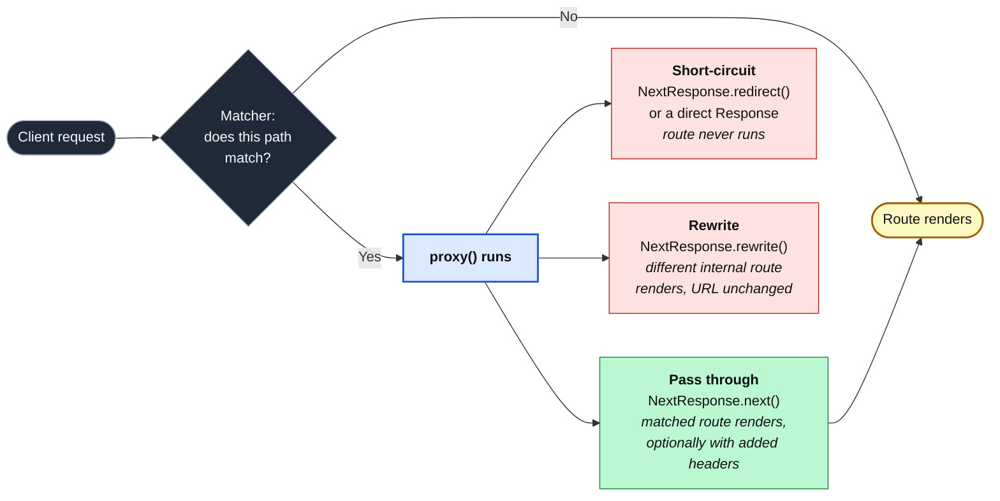

import Figure from '../../../components/figures/Figure.astro';
import CodeVariants from '../../../components/code/code-variants/CodeVariants.astro';
import CodeVariant from '../../../components/code/code-variants/CodeVariant.astro';
import CodeTooltips from '../../../components/code/CodeTooltips.astro';
import AnnotatedCode from '../../../components/code/annotated-code/AnnotatedCode.astro';
import AnnotatedStep from '../../../components/code/annotated-code/AnnotatedStep.astro';
import StateMachineWalker from '../../../components/figures/state-machine-walker/StateMachineWalker.astro';
import Question from '../../../components/figures/state-machine-walker/Question.astro';
import Branch from '../../../components/figures/state-machine-walker/Branch.astro';
import Leaf from '../../../components/figures/state-machine-walker/Leaf.astro';
import Buckets from '../../../components/exercises/buckets/Buckets.astro';
import Bucket from '../../../components/exercises/buckets/Bucket.astro';
import Item from '../../../components/exercises/buckets/Item.astro';
import Term from '../../../components/ui/Term.astro';
import ExternalResource from '../../../components/ui/ExternalResource.astro';
import VideoCallout from '../../../components/embeds/VideoCallout.astro';
import { CardGrid } from '@astrojs/starlight/components';
import CourseProgressBar from '../../../components/ui/CourseProgressBar.astro';

<CourseProgressBar value={frontmatter['course-progress']} />

A request for `/dashboard` arrives at your server. Before the page renders, you want two things to happen: a signed-out visitor should be bounced to `/sign-in` instead of seeing a flash of the dashboard, and a request for an old URL like `/billing/old/invoices` should quietly land on its new home. Neither of those is the dashboard's job, and both have to happen *before* the route runs at all.

So where does code that runs ahead of every route live? What does running it on every request cost you? And because you will open older codebases and AI-generated snippets that look slightly different, what name will you see this file under?

Last lesson you read cookies and headers *inside* the render, with `cookies()` and `headers()`. This lesson is about the channel that runs *before* the render: a single file that can inspect, redirect, or reshape a request before any route code executes. By the end you'll have three things: the `proxy.ts` file convention (which used to be called `middleware.ts`), the matcher that controls what it costs you, and a clear rule for what belongs in that file versus what belongs in the route.

## From middleware.ts to proxy.ts

Next.js 16 renamed this file. What was `middleware.ts` exporting a `middleware` function is now `proxy.ts` exporting a `proxy` function. That sounds cosmetic, but it isn't: the rename carries the mental model, and absorbing it is most of this lesson.

The word "middleware" carries baggage. If you've touched Express or any similar server framework, middleware means a chain of per-request handlers stacked in front of your application, and the instinct that comes with it is *this is where all my per-request logic goes*: parse the body here, hit the database here, run business rules here. That instinct is exactly wrong for this file, and the old name kept inviting it.

"Proxy" names what the file actually is: a network proxy sitting in front of your app. It runs at the boundary, before the request reaches any route, and it can do one of three things: short-circuit the request (send a redirect, return a response), rewrite it to a different internal route, or pass it through untouched. It is a fast gate, not a second application layer. The framework now treats it as a *last-resort* tool, so when you're tempted to reach for it, the first question is whether a route-level pattern would do the job instead.

You will still meet the old name constantly: `middleware.ts` and `export function middleware` show up in every pre-16 codebase and in most snippets an AI hands you. Recognize it as the former name for this exact file, nothing more. The two tabs below are the same proxy under both names; flip between them and notice that nothing but the filename and the function name moves.

<CodeVariants>
  <CodeVariant label="Next.js 16 — proxy.ts">
    <div data-mark-color="green">

    ```ts title="proxy.ts" "proxy"
    import { NextResponse } from 'next/server';
    import type { NextRequest } from 'next/server';

    export default function proxy(request: NextRequest) {
      return NextResponse.redirect(new URL('/sign-in', request.url));
    }
    ```

    </div>
    **The 2026 shape.** The function name matches the filename. Everything else is the request-shaping API the rest of the lesson unpacks.
  </CodeVariant>

  <CodeVariant label="Legacy — middleware.ts (deprecated)">
    <div data-mark-color="orange">

    ```ts title="middleware.ts" "middleware"
    import { NextResponse } from 'next/server';
    import type { NextRequest } from 'next/server';

    export default function middleware(request: NextRequest) {
      return NextResponse.redirect(new URL('/sign-in', request.url));
    }
    ```

    </div>
    **The pre-16 name for the same file.** The body is byte-for-byte identical: the rename changes the shell, not the logic. `middleware.ts` is deprecated and warns at build, and this is the form you'll find in older repos.
  </CodeVariant>
</CodeVariants>

Migrating an existing codebase is one command. Next.js ships a <Term definition="An automated script that rewrites your source code to a new API. Next.js ships codemods for breaking changes, so you don't hand-edit every call site.">codemod</Term> that renames both the file and the function for you:

```bash
npx @next/codemod@canary middleware-to-proxy .
```

Keep the `@canary` tag, since that's what the docs specify for this codemod. It handles the mechanical rename, but it isn't exhaustive: custom imports or any Edge-runtime-specific code may need a manual cleanup pass afterward, so read the diff rather than trusting it blindly. We'll see in a moment why the Edge part matters.

## Where the proxy runs and what that costs

In Next.js 16 `proxy.ts` runs on the **Node.js runtime**, the full Node.js environment the rest of your app already runs on, and that is not configurable: set the `runtime` option in a proxy file and it *throws*. This is a real shift, because the previous generation of this file ran on the <Term definition="A stripped-down JavaScript environment that ran a limited subset of Node APIs at the network edge. It was the old deployment target for middleware; new code doesn't target it.">Edge runtime</Term>, a separate environment with its own restricted slice of the API surface. For new code in 2026 the Edge runtime is named once and set aside. The payoff is that you no longer reason about two different capability sets. The proxy uses the same APIs and the same packages, and has the same cold-start behavior, as everything else in your app. On Vercel it ships to a fast Node function placed close to your users.

The next point shapes how you write the file. Here is the rule the whole rest of the lesson leans on:

:::caution
The proxy runs on **every request the matcher selects**, before the route renders.
:::

With no matcher configured, "every request" is literal. Not just your pages, but every JavaScript chunk Next.js serves from `_next/static`, every optimized image from `_next/image`, every file in `public/`, and every favicon fetch. Each of those now pays a trip through your proxy function. That's added latency on assets that have nothing to do with auth or rewrites, and on a platform that bills per function invocation, it's money too. This kind of regression doesn't show up in a code review and doesn't break anything, so it quietly makes every page a little slower and the bill a little bigger until someone goes looking.

Before we fix that with the matcher, let's pin down where the proxy actually sits and what it can do to a request, so the rest of the lesson has a shared picture to point at.

<Figure caption="Only the matched branch pays the proxy. An unmatched request reaches its route without ever entering `proxy()`, which is why the matcher, not the function body, is the first thing to tune.">

</Figure>

The three terminals on the right are the three things a proxy can do, and they map onto the three jobs we'll keep coming back to. The single edge that matters for cost is the one on the left: the `No` branch skips the proxy completely. Everything else in this lesson is about making sure that `No` branch carries as much traffic as it should.

## The matcher: the cost-control surface

The matcher is a `config` export sitting next to your `proxy` function, and it answers exactly one question: which paths does the proxy run on? It is the first knob an experienced engineer reaches for, because it decides whether the proxy is invisibly cheap or an invisible tax. It comes in a few forms, and they ramp up in power.

The simplest is **a single path string**:

```ts
export const config = {
  matcher: '/dashboard/:path*',
};
```

That pattern is written in <Term definition="The library Next.js uses to turn matcher path patterns like /dashboard/:path* into regular expressions.">path-to-regexp</Term> syntax, the same shape Next.js uses for routes. The piece to recognize is `:path*`, a named segment with a modifier. The `*` means *zero or more* path segments, so `/dashboard/:path*` matches `/dashboard`, `/dashboard/settings`, and `/dashboard/team/billing` alike. Plain `:path` is exactly one segment, `?` makes a segment optional, and `+` means one or more. You don't need to memorize the modifiers; recognize the shape and look them up when you need a precise one.

When the proxy guards more than one section of the app, you pass **an array of strings**:

```ts
export const config = {
  matcher: ['/dashboard/:path*', '/settings/:path*'],
};
```

This is the everyday "run on these app sections" form. It reads cleanly and it's easy to extend.

The form you'll copy most often is the **negative-lookahead regex**, the canonical way to say "run on everything *except* assets":

```ts
export const config = {
  matcher: '/((?!api|_next/static|_next/image|favicon.ico).*)',
};
```

It looks dense, but you almost never read it character by character: you recognize it and adjust the exclusion list. Here's the reasoning behind it, which is all you need to hold onto. The proxy's default is to match *everything*, including all those assets we just worried about. This pattern inverts the problem: instead of listing the handful of paths you want, it matches every path *and then carves out* the ones you don't. The `(?!...)` is a <Term definition="A regex group (?!...) that matches only when the enclosed pattern is not present. Here it matches every path except the listed ones.">negative lookahead</Term>, meaning "match here only if what follows is *not* one of these." So `api`, `_next/static`, `_next/image`, and `favicon.ico` fall through to their routes without ever touching the proxy, and everything else runs through it.

The most expressive form is the **object form**, which adds predicate clauses on top of the path:

```ts
export const config = {
  matcher: [
    {
      source: '/((?!api|_next/static|_next/image|favicon.ico).*)',
      missing: [{ type: 'cookie', key: '__Host-session' }],
    },
  ],
};
```

`source` is the path pattern. `has` and `missing` are the new part: they gate on the *presence* or *absence* of a cookie, header, or query value, where `type` is `'cookie' | 'header' | 'query'`. The example above reads "run on these paths, but only when the session cookie is *missing*," which is precisely the shape you want for an auth gate, because a request that already carries the cookie doesn't need the proxy to bounce it. `has` is the inverse, for "run only when this is present." This form lets the matcher itself do cheap gating, so the proxy function body doesn't even execute on requests it would have nothing to do for.

Two facts about the matcher aren't obvious, and each has cost people real debugging time.

First, **the matcher must be statically analyzable**. Next.js reads its value at build time, not at request time. So a matcher assembled from a runtime variable, say a path pulled from an environment lookup or computed in a function, is silently ignored. No error, no warning; it just doesn't match what you think it matches. Keep the matcher a literal.

Second, and this is the one to hold onto because we pay it off in the next section, **excluding a path from the matcher also stops the proxy running on Server Action POSTs to that path**. Server Actions submit to the route they live under, so if your matcher carves out, say, `/api`, and an action posts there, the proxy never sees it. That's why the framework's own guidance is blunt: never lean on the proxy alone for auth. The real check belongs *inside* each Server Action and route. Hold that thought.

Here is the production matcher most apps converge on, walked one clause at a time.

<AnnotatedCode lang="ts" code={`
export const config = {
  matcher: [
    {
      source: '/((?!api|_next/static|_next/image|favicon.ico).*)',
      missing: [{ type: 'cookie', key: '__Host-session' }],
    },
  ],
};
`}>
  <AnnotatedStep meta="{4}" color="blue">
    The path pattern. The negative lookahead matches every path *except* the API routes and the static-asset folders, so the proxy never runs on a JS chunk or an optimized image. This one line is the cost control.
  </AnnotatedStep>

  <AnnotatedStep meta="{5}" color="blue">
    The predicate gate. `missing` runs the proxy only when the named cookie is absent, so a request that already has a session cookie skips the function entirely. `has` would be the inverse. The matcher does the cheap filtering before any of your code executes.
  </AnnotatedStep>

  <AnnotatedStep meta="{2-7}" color="blue">
    The whole value is read at build time, so it must be a static literal. A matcher built from a runtime variable is silently ignored: no error, it just quietly matches nothing you intended.
  </AnnotatedStep>
</AnnotatedCode>

The fastest way to internalize the cost model is to sort a few real requests. For each one below, decide whether the matcher should *select* it (the proxy needs to run) or *exclude* it (the proxy is dead weight). The heuristic you're testing is that app pages get selected, while assets and most API routes get excluded.

<Buckets twoCol instructions="Should the proxy run on this request? Everything in the exclude column is latency and invocation cost you'd pay for nothing without a tight matcher.">
  <Bucket name="select" label="Matcher should select it" description="The proxy needs to run here" />
  <Bucket name="exclude" label="Matcher should exclude it" description="Dead weight through the proxy" />

  <Item bucket="select">`GET /dashboard`</Item>
  <Item bucket="select">`GET /settings/billing`</Item>
  <Item bucket="select">A `POST` to the sign-in route</Item>
  <Item bucket="exclude">`GET /_next/static/chunk.js`</Item>
  <Item bucket="exclude">An `` request for `/public/logo.png`</Item>
  <Item bucket="exclude">`GET /api/health`</Item>
</Buckets>

The two columns split on a single heuristic. App pages get *selected*, because that's where the auth gate, the rewrite, or the header enrichment lives, while assets and constantly-hit API routes get *excluded*. The sign-in `POST` is the one that catches people: it's an app page the proxy may still need to act on (an unauthenticated user belongs there), so it stays selected.

## What belongs in the proxy, and what doesn't

This is the decision the whole rename was built to make easy. Now that you've seen what the proxy can do and what it costs, here's the line: exactly four jobs belong in it.

**Auth gating.** Bounce signed-out requests cheaply: check that a session cookie is *present*, and if it isn't, redirect to `/sign-in?next=...`. The proxy is the fast bounce that keeps the user from seeing a flash of a protected page. It is not the thing that decides whether the session is genuinely valid.

**Rewrites and redirects.** URL migrations (the old `/billing/old/*` paths) and internal route swaps. We name them here as a job, but the next lesson is entirely about how they work, so we'll leave the depth there.

**Request enrichment.** Derive something cheap once and set it as a header that the downstream route reads back via `headers()`. This is the proxy-to-route pattern, and it gets its own section shortly.

**Feature-flag and A/B routing.** Bucket a user by writing a cookie the proxy controls, then let downstream routes read that cookie and branch on it.

Notice the shape they share: each is cheap, each is about the request as it enters, and none of them is the *real* work of the page. That shared shape also defines what doesn't belong. Because the proxy is a network boundary and not your application, three things do *not* belong in it.

**No database queries on every request.** A DB read in the proxy isn't paid once; it's paid on every matched request, multiplied across your whole app. This is the textbook "why did every page get slow" regression, and it's invisible until you profile.

**No complex business logic.** The proxy is meant to be invoked separately from your render code, so debugging a problem that straddles the proxy/route boundary is genuinely painful, and sharing app modules or globals through it couples two things that were deliberately kept apart. If a piece of logic is interesting enough to need a test, it probably belongs in the route.

**Not the authoritative auth check.** This is the one that catches people, so it's worth being precise. The proxy checks cookie *presence*. The route's `requireUser()` does the real validation against the database. There are two reasons it has to be this way, both of which we've already touched. First, the Server Action trap from the last section: a refactor that adjusts the matcher can silently drop proxy coverage on an action's path, and if the proxy were your only guard, that refactor just opened a hole. Second, and this is specific to how sessions are cached, Better Auth keeps a short-lived cache of the decoded session (a few minutes) to avoid a database hit on every request, which means the proxy can read a *stale* session for minutes after a sign-out or a role change. A gate that can be minutes out of date cannot be the thing that authorizes a sensitive action.

So this isn't redundancy, it's **defense in depth**. The proxy is a UX optimization: a fast bounce that keeps signed-out users from ever rendering a protected page. The route is the security boundary: the place the real decision is made, against fresh data, every time. They do different jobs that happen to look similar from the outside.

<VideoCallout videoId="zNgCFXZLoRk" videoTitle="Next.js 16 Middleware DEPRECATED — Authentication In Proxy Or Data Access Layer?">
  ByteGrad (23 min) walks the same line this section draws: why the rename signals "don't do the heavy thing here," and why auth belongs in a data access layer, not the proxy.
</VideoCallout>

If you remember one sentence from this lesson, make it this one: *do the cheap thing in the proxy, do the authoritative thing in the route.*

The walkthrough below turns that sentence into the order an experienced engineer actually asks the questions. Run a candidate piece of logic through it.

<StateMachineWalker title="Does this belong in proxy.ts?">
  <Question id="before" prompt="Does it need to run before the route renders?">
    <Branch label="No — it can run during the render" to="leaf-route" />
    <Branch label="Yes — it has to happen ahead of the route" to="cheap" />
  </Question>

  <Question id="cheap" prompt="Is it cheap?" description="Inspecting a cookie or header, or making a redirect decision — not a database read.">
    <Branch label="No — it's a DB read or heavy logic" to="leaf-move" />
    <Branch label="Yes — it's a quick inspection" to="authoritative" />
  </Question>

  <Question id="authoritative" prompt="Is it the authoritative security decision?">
    <Branch label="Yes — it's the real authorization check" to="leaf-presence" />
    <Branch label="No — it's a gate, a rewrite, or enrichment" to="leaf-fit" />
  </Question>

  <Leaf id="leaf-route" verdict="Route, layout, or Server Action">
    If it can run during the render, it doesn't belong at the network boundary.
    Read it on the server with `cookies()` / `headers()` and pass the resolved value down.
  </Leaf>

  <Leaf id="leaf-move" verdict="Move it to the route">
    The proxy multiplies its cost across every matched request, so a database read or heavy computation here is the classic "why is every page slow" regression.
    Do it once, in the route.
  </Leaf>

  <Leaf id="leaf-presence" verdict="Cookie presence in the proxy, real validation in the route">
    The proxy can bounce signed-out users cheaply, but a stale or spoofable check can't authorize.
    Verify against the database in the route's `requireUser()`. Defense in depth.
  </Leaf>

  <Leaf id="leaf-fit" verdict="Good fit for the proxy">
    Auth gate, rewrite or redirect, header enrichment, or A/B bucketing.
    Cheap, request-time, and not the final security call: exactly what the proxy is for.
  </Leaf>
</StateMachineWalker>

## Reading the request and shaping the reply

Now the API, which is the one part of the lesson you should *not* try to memorize. The goal here is recognition: you want to be able to open a proxy file, know what `request` gives you and what your return value can be, and look up the exact method when you need it.

The argument your `proxy` function receives is a <Term definition="Next.js's extension of the web-platform Request object you met when we covered the browser platform.">`NextRequest`</Term>. It's the platform `Request` you already know, with a few Next.js conveniences added on top:

- `request.nextUrl`: a parsed URL object. This is where you reach for `.pathname` and `.searchParams` instead of hand-parsing `request.url`.
- `request.cookies`: a `RequestCookies` store with `get`, `getAll`, `has`, `set`, and `delete`. `get` returns `{ name, value }` or `undefined`.
- `request.headers`: the same web-platform `Headers` instance you've used before. Nothing new to learn.

One correction matters, because you'll see the old shape everywhere. Geolocation and client IP used to live on `request.geo` and `request.ip`. **Those were removed.** On Vercel you now import them as functions: `geolocation(request)` and `ipAddress(request)` from <Term definition="Vercel's helper package. geolocation() and ipAddress() replace the removed request.geo and request.ip.">`@vercel/functions`</Term>. Off Vercel, you read whatever header your platform documents for them. If you see `request.geo` or `request.ip` in a snippet, that's pre-15 code, and it won't work in 16.

What you return shapes the reply, and there are four shapes: the same three terminals from the lifecycle diagram, plus the direct-response escape hatch.

- `NextResponse.next()`: pass through, so the matched route renders. This is the "I looked, I'm done, carry on" return.
- `NextResponse.redirect(url, status?)`: short-circuit with a 3xx, so the route never runs. (The status codes and redirect-versus-rewrite semantics are the next lesson; here it's enough that it bounces the request.)
- `NextResponse.rewrite(url)`: render a different internal route while the visible URL stays put. (Depth in the next lesson.)
- `Response.json(body, { status })` or `new NextResponse(body, { status })`: answer the request directly, like a `401` for an API path. This is rare in `proxy.ts`; you'll see it far more in route handlers.

One reflex to build: **there is no implicit pass-through.** If a code path through your proxy doesn't return, or doesn't `return NextResponse.next()`, the request hangs. Every branch has to return something.

Here's the whole surface in one small proxy. Hover the highlighted parts to probe what each gives you: read the URL, read a cookie, branch, and return. (This reads the cookie directly to show the `request.cookies` API; the worked example at the end swaps in the proper Better Auth helper for the real gate.)

<CodeTooltips tooltips={{
  nextUrl: 'A parsed URL object. Reach for .pathname and .searchParams here instead of parsing request.url by hand.',
  cookies: 'A RequestCookies store. get(name) returns { name, value } or undefined.',
  'NextResponse.next()': 'Pass the request through to the matched route. There is no implicit pass-through — a branch that doesn\'t return leaves the request hanging.',
}}>
```ts title="proxy.ts"
import { NextResponse } from 'next/server';
import type { NextRequest } from 'next/server';

export default function proxy(request: NextRequest) {
  const { pathname } = request.nextUrl;
  const session = request.cookies.get('__Host-session');

  if (pathname.startsWith('/dashboard') && !session) {
    return NextResponse.redirect(new URL('/sign-in', request.url));
  }

  return NextResponse.next();
}
```
</CodeTooltips>

A last reflex about robustness, since the proxy sits in front of everything. If something inside the proxy throws, it doesn't just fail that one request; it returns a `500` for *every* matched request until you fix it. So wrap anything that can fail in a `try/catch` and pass through on the error path:

```ts
try {
  // risky derivation
} catch {
  return NextResponse.next();
}
```

There's a subtlety worth naming. Elsewhere the course's rule is that an exception inside a gate is a refusal: fail *closed*. Here it's the opposite. Because the proxy is a *non-authoritative* gate and the route still enforces real auth, the safe default is to fail *open* and let the request reach the route, which will do the genuine check. Failing closed in the proxy would take your whole app down over a hiccup in a check that the route is going to repeat anyway.

## Passing data from the proxy to the route

Here's the one genuinely new *technique* in the lesson, and it threads straight back to last lesson's `headers()`. Sometimes the proxy derives a cheap value, reading a cookie or resolving something, and you'd rather the route reuse that result than recompute it. The proxy can hand it forward as a request header.

The mechanics are: clone the incoming headers, set your value on the clone, and forward them through `NextResponse.next`. The route reads the value back with `headers()` and never redoes the work.

That's the happy path. There are three traps around it, and the first is the one to get right first.

:::danger
`NextResponse.next({ request: { headers } })` sets headers the **route** sees. `NextResponse.next({ headers })` sets headers the **client** sees in the response. They look almost identical and do opposite things: the `request:` wrapper is the whole difference between "the page can read this" and "the browser gets this."
:::

The second trap is security, and it's a mistake the docs now call out explicitly. Don't reflexively clone *all* incoming headers onto the forwarded request. An attacker can send their own `x-user-id` header from the outside, and if you pass it through untouched, your route will trust a value the client made up. The rule is an <Term definition="Explicitly enumerate the permitted values and reject everything else. Safer than a deny-list, which fails open on anything you forgot.">allow-list</Term>: set only the specific identity headers you derived *yourself* inside the proxy, and never forward a client-supplied one as if it were trusted.

The enrichment proxy below puts all three pieces together. The steps walk the clone, the allow-listed set, and the one line everyone gets wrong.

<AnnotatedCode lang="ts" code={`
import { NextResponse } from 'next/server';
import type { NextRequest } from 'next/server';

export default function proxy(request: NextRequest) {
  const requestHeaders = new Headers(request.headers);
  requestHeaders.set('x-user-id', deriveUserId(request));

  return NextResponse.next({
    request: { headers: requestHeaders },
  });
}
`}>
  <AnnotatedStep meta="{5}" color="blue">
    Clone the incoming headers into a mutable copy. You're building the set the route will see, starting from what arrived.
  </AnnotatedStep>

  <AnnotatedStep meta="{6}" color="blue">
    Set only the header you derived yourself. This is the allow-list discipline: never forward a client-supplied `x-user-id`, or the route would trust a value the caller invented. (`deriveUserId` stands in for a cheap derivation; in production this is where Better Auth resolves the session.)
  </AnnotatedStep>

  <AnnotatedStep meta="{9}" color="orange">
    The `request:` wrapper is everything. `next({ request: { headers } })` sets headers the *route* reads via `headers()`. Drop the wrapper, writing `next({ headers })`, and you'd instead be setting headers on the *response to the client*. Same-looking call, opposite effect.
  </AnnotatedStep>
</AnnotatedCode>

The route reads it back with the same `headers()` API from last lesson, and never re-derives the value:

```ts title="the route"
const userId = (await headers()).get('x-user-id');
```

The third trap is about cookies, and it's the same "state from proxy to route" theme seen from the other side. Setting a cookie on the *response* with `response.cookies.set(...)` does **not** make the *current* request's `cookies()` read see it. It can't: a cookie is an instruction to the browser, and the browser only sends it back on the *following* request. This is exactly the model from last lesson, where the server reads cookies the browser sent and instructs the browser to store new ones. The new one shows up on the next round trip, never the current one.

:::caution
A cookie you set on the response is visible on the *next* request, not the current one. If you set a cookie in the proxy and immediately try to read it with `cookies()` in the route, it won't be there.
:::

## A proxy that gates the app

Time to pull it into one production-shaped file. This proxy does two of the four jobs: it gates the app behind a session cookie and passes everything else through. It's deliberately tight, under thirty lines, and it leans on two black boxes the rest of the course fills in.

Before the code, two things to set expectations. This is the *real* shape, but it references pieces built elsewhere: `SESSION_COOKIE_PREFIX` and the route's `requireUser()` both come from the authentication chapters later in the course. They're imported here as known quantities, not reimplemented, so the proxy is the slot and the auth wiring lands later. And the `next=` round-trip (sending the user back where they came from after sign-in) is *named* here but not validated; closing the open-redirect hole on that parameter is the next lesson's subject.

<AnnotatedCode lang="ts" maxLines={18} code={`
// proxy.ts
import { getSessionCookie } from 'better-auth/cookies';
import { NextResponse } from 'next/server';
import type { NextRequest } from 'next/server';

import { SESSION_COOKIE_PREFIX } from '@/lib/auth';

export default function proxy(request: NextRequest) {
  const hasSession = getSessionCookie(request, {
    cookiePrefix: SESSION_COOKIE_PREFIX,
  });

  if (!hasSession) {
    const signIn = new URL('/sign-in', request.url);
    signIn.searchParams.set('next', request.nextUrl.pathname);
    return NextResponse.redirect(signIn);
  }

  return NextResponse.next();
}

export const config = {
  matcher: '/((?!api|_next/static|_next/image|favicon.ico).*)',
};
`}>
  <AnnotatedStep meta="{22-24}" color="blue">
    The matcher first. It gates the app and excludes API routes and assets, so the proxy never runs on a JS chunk or an image. This is the cost control before anything else.
  </AnnotatedStep>

  <AnnotatedStep meta="{9-11}" color="blue">
    A cookie *presence* check, nothing more. `getSessionCookie` reads the session cookie without validating it. We pass `SESSION_COOKIE_PREFIX` because the helper defaults to `'better-auth.'` and would silently miss our `__Host-` prefix; the exported constant keeps the proxy and the auth config from drifting, which is a real silent-failure class.
  </AnnotatedStep>

  <AnnotatedStep meta="{13-17}" color="blue">
    There's no cookie and the request is for a protected path, so bounce to `/sign-in`, stashing where they were headed in `next=` so sign-in can return them. (The `next=` value is validated in the next lesson; redirecting on a raw value is an open-redirect risk.)
  </AnnotatedStep>

  <AnnotatedStep meta="{19}" color="blue">
    A cookie is present, so pass the request through to the route. Every branch returns; there's no implicit fall-through.
  </AnnotatedStep>

  <AnnotatedStep meta="{9-11}" color="blue">
    The one thing to carry away. This checks *presence*. The route's `requireUser()` does the authoritative validation against the database, fresh every time. Presence here, real check there. Defense in depth.
  </AnnotatedStep>
</AnnotatedCode>

One detail in the imports earns its keep. This file uses a `default` export, because `proxy.ts` is one of the framework-named files where Next.js dictates the export style, so it's the carve-out from the project's named-export rule. The Next.js docs accept *either* a default export or a named `export function proxy`; you'll see both in the wild, and they're equivalent. The default export is the shape this course uses.

That's the production slot. The authentication chapters fill in the real session wiring behind `requireUser()`, and the next lesson adds the rewrite and redirect jobs to this same file.

## Keep exploring

The proxy surface moves fast, having been renamed this major version, so the official docs are the source of truth worth bookmarking over anything older.

<CardGrid>

<ExternalResource
  title="proxy.js — file-system conventions"
  href="https://nextjs.org/docs/app/api-reference/file-conventions/proxy"
  icon="simple-icons:nextdotjs"
  iconColor="#000000"
  description="The authoritative reference for the matcher syntax and the full NextResponse API — the page to keep open while you write a proxy."
/>

<ExternalResource
  title="Upgrading: Version 16"
  href="https://nextjs.org/docs/app/guides/upgrading/version-16"
  icon="simple-icons:nextdotjs"
  iconColor="#000000"
  description="Migration notes for moving a middleware.ts codebase to proxy.ts, including the codemod and the manual-cleanup caveats."
/>

</CardGrid>
