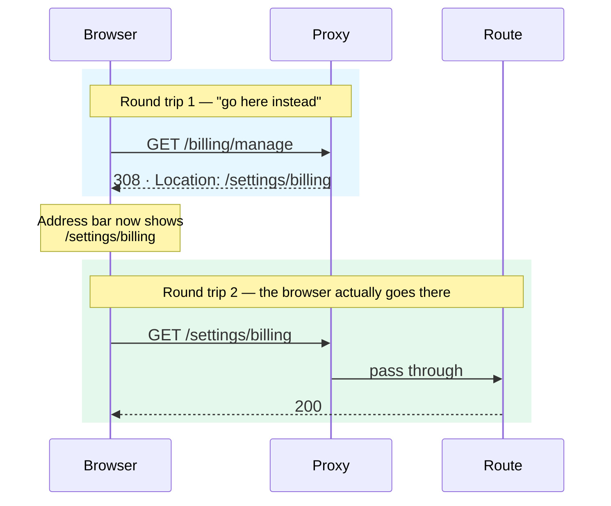
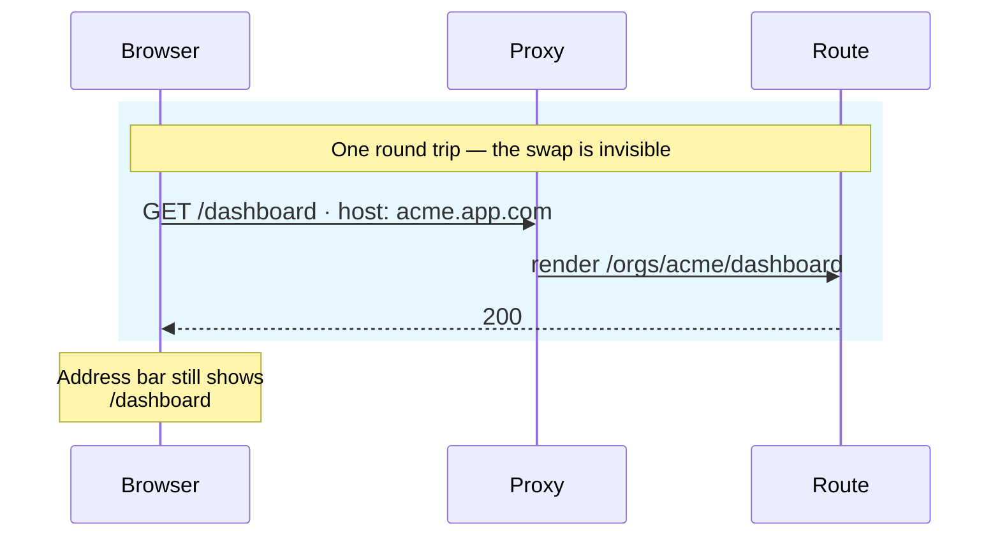

import { Aside, CardGrid } from '@astrojs/starlight/components';
import Term from '../../../components/ui/Term.astro';
import ExternalResource from '../../../components/ui/ExternalResource.astro';
import VideoCallout from '../../../components/embeds/VideoCallout.astro';
import Figure from '../../../components/figures/Figure.astro';
import TabbedContent from '../../../components/figures/tabbed-content/TabbedContent.astro';
import TabbedItem from '../../../components/figures/tabbed-content/TabbedItem.astro';
import StateMachineWalker from '../../../components/figures/state-machine-walker/StateMachineWalker.astro';
import Question from '../../../components/figures/state-machine-walker/Question.astro';
import Branch from '../../../components/figures/state-machine-walker/Branch.astro';
import Leaf from '../../../components/figures/state-machine-walker/Leaf.astro';
import CodeTooltips from '../../../components/code/CodeTooltips.astro';
import CodeVariants from '../../../components/code/code-variants/CodeVariants.astro';
import CodeVariant from '../../../components/code/code-variants/CodeVariant.astro';
import AnnotatedCode from '../../../components/code/annotated-code/AnnotatedCode.astro';
import AnnotatedStep from '../../../components/code/annotated-code/AnnotatedStep.astro';
import TrueFalse from '../../../components/exercises/true-false/TrueFalse.astro';
import Statement from '../../../components/exercises/true-false/Statement.astro';
import TfWhy from '../../../components/exercises/true-false/TfWhy.astro';
import MultipleChoice from '../../../components/exercises/multiple-choice/MultipleChoice.astro';
import McqChoice from '../../../components/exercises/multiple-choice/McqChoice.astro';
import McqWhy from '../../../components/exercises/multiple-choice/McqWhy.astro';
import CourseProgressBar from '../../../components/ui/CourseProgressBar.astro';

<CourseProgressBar value={frontmatter['course-progress']} />

Your SaaS just shipped v2 of its billing surface. The old screen lived at `/billing/manage`; the new one lives at `/settings/billing`. The page is gone, but the old URL is not — it sits in months of receipt emails, in a few customers' bookmarks, in whatever Google indexed last quarter. When someone clicks it, three things have to happen: the browser needs to *go to* the new URL, search engines need to record that the page moved for good, and the user needs to land on the right screen without noticing anything broke.

Now a second, unrelated need. The same app multi-tenants on subdomains: `acme.app.com` and `globex.app.com` are two different customers' workspaces. When Acme's admin opens `acme.app.com/dashboard`, the server has to render *their* org's dashboard — but the address bar must keep saying `acme.app.com/dashboard`. The user should never see the internal route that actually did the rendering.

These are two different jobs, and they have two different names. The first is a **redirect**: the URL the user sees genuinely changes. The browser navigates, history gets an entry, and a permanent redirect tells search engines the page has a new home. The second is a **rewrite**: the URL the user sees stays exactly the same while the server quietly renders a different route behind it. One is visible, one is invisible, and confusing them is one of the most common ways to ship a subtly broken app.

In the last lesson you built `proxy.ts` — the file that runs before the route, the matcher that controls which requests pay for it, and the three shapes a proxy can return: `redirect`, `rewrite`, and `next`. You named rewrites and redirects as one of the proxy's legitimate jobs and moved on. You also left a deliberate hole: the auth gate redirected unauthenticated users to `/sign-in?next=…` with the `next` value passed straight through, unvalidated, flagged "for next lesson." This is next lesson. By the end you'll have three things: the clean distinction between the two operations, a rule for *where* each one belongs — the proxy is only one of the places a redirect can live, and an experienced engineer doesn't reach for it by default — and the two production patterns, subdomain rewrites and safe post-login redirects, each with the sharp edge that bites the people who skip it. That last one closes the security hole for good.

## Two operations, one address bar

The fastest way to keep redirect and rewrite straight is to watch one thing: the address bar. A redirect changes it. A rewrite doesn't. Everything else follows from that.

A **redirect** is the proxy returning a `3xx` response with a `Location` header. The browser reads that header and does something specific — it throws away the response and issues a *brand-new request* to the URL in `Location`. So a redirect is two round trips: the first request comes back as "go here instead," the second request is the browser actually going there. Because the second request is a real navigation, the address bar updates, a history entry is added, a bookmark would save the new URL, and a search engine treats a permanent redirect as the canonical replacement for the old one. The browser learns the new URL, and acts on it.

A **rewrite** is the proxy returning the *content of a different internal route*. The browser made one request and got one response back, with a normal `200` and a normal page. It never learns that a different route exists. There is one round trip. The address bar stays exactly where it was. The user sees one URL; the server rendered another, and never told the browser about the swap.

The single fact that separates them is the number of times the browser talks to the server, and what it shows when it's done. Here are the two flows side by side — flip between the tabs and watch the arrows.

<TabbedContent syncKey="redirect-vs-rewrite">
  <TabbedItem label="Redirect">
    <Figure>

      <Fragment slot="caption">Two round trips. The browser is told to go elsewhere, asks again, and the address bar changes to the destination — `/settings/billing` — and stays there.</Fragment>
    </Figure>
  </TabbedItem>

  <TabbedItem label="Rewrite">
    <Figure>

      <Fragment slot="caption">One round trip. The user keeps seeing `acme.app.com/dashboard` while a different route renders behind it — the browser never learns the swap happened.</Fragment>
    </Figure>
  </TabbedItem>
</TabbedContent>

Notice neither operation is the "better" one — they answer different product questions. Reach for a redirect when the URL itself should change: a page was renamed, a feature was deprecated, a logged-in user shouldn't sit on `/login`. Reach for a rewrite when the implementation moved but the user shouldn't have to care: multi-tenancy, an internal restructuring, an A/B variant served from a different path. The question to ask is never "which is faster" — it's "should the user's URL change?"

In the lifecycle diagram from the last lesson, these were two of the three terminals a proxy can end on: `NextResponse.redirect()` and `NextResponse.rewrite()`. The third, `NextResponse.next()`, is the pass-through — let the request continue to its route untouched. You already know that API surface; this lesson is about *when* to reach for each, not how to call it.

## The status code is the permanence signal

A redirect carries a status code, and the code is not a formality — it tells the browser and every search engine crawler how long to believe the redirect. Get it right and the move is clean. Get it wrong and you create a problem that outlives the code that caused it.

`NextResponse.redirect(url)` defaults to **307** — a *temporary* redirect. Pass a second argument to promote it to **308** — a *permanent* one.

<CodeTooltips tooltips={{
  '307': 'The default. Temporary: the old URL stays canonical, search engines keep indexing it, nothing is cached. Use it for redirects that depend on who is asking.',
  '308': 'Permanent. Search engines update the index and forward the page\'s ranking value; browsers may cache the redirect itself. Hard to undo — reach for it only when the move is truly forever.',
}}>
```ts
NextResponse.redirect(new URL('/settings/billing', request.url));        // 307, temporary
NextResponse.redirect(new URL('/settings/billing', request.url), 308);   // 308, permanent
```
</CodeTooltips>

The difference is what happens downstream. A **308** is a promise: this move is forever. Search engines update their index to point at the new URL and forward the old page's <Term definition="The ranking value search engines pass through links. A 308 forwards it to the new URL; a temporary redirect does not.">link equity</Term> to it; browsers are allowed to *cache* the redirect and stop asking the server about the old URL at all. A **307** says the opposite: this is temporary, keep treating the old URL as the real one. So for the billing rename — a genuine, permanent move — you reach for **308**. For a logged-in user bounced off `/login`, you reach for **307**, because that redirect isn't a permanent property of the URL; it's a temporary fact about *this user right now*. Tomorrow they're logged out, and `/login` is exactly where they should be.

You may have seen `301` and `302` in older code or in interview questions. Don't use them. They predate the method-preserving redirects, and many HTTP clients silently rewrite a `POST` into a `GET` when they follow a `301` or `302` — a quiet footgun that turns a form submission into a broken read. `307` and `308` preserve the request method exactly. Modern code uses the new pair and nothing else.

Here's the part that bites people. A permanent redirect is sticky in a way a temporary one is not. Once a browser has cached your `308` and a search engine has reindexed around it, you cannot easily un-tell them. Remove the redirect rule from your code and the cached `308` lives on in browsers that already saw it, sending users to a URL that may no longer make sense. The asymmetry is the whole lesson: a wrong `307` is a minor inefficiency you fix by editing one line; a wrong `308` persists long after the rule is gone. So when you are not certain a move is permanent, under-commit — ship the `307`, and promote it to `308` only once you're sure.

Run your instincts through a few quick checks.

<TrueFalse instructions="Each statement is about redirect status codes.">
  <Statement answer="true">
    Renaming `/account` to `/settings` permanently is a job for a 308.
    <TfWhy>The page genuinely moved for good — a permanent redirect tells search engines to reindex and forwards the old page's link equity to the new URL.</TfWhy>
  </Statement>

  <Statement answer="false">
    A 302 redirect is guaranteed to preserve a POST request's method.
    <TfWhy>It isn't — many clients silently downgrade the POST to a GET on a 301 or 302. That's exactly why modern code uses 307/308, which preserve the method.</TfWhy>
  </Statement>

  <Statement answer="false">
    Calling `NextResponse.redirect(url)` with no second argument sends a 308.
    <TfWhy>The default is 307 (temporary). You have to pass 308 explicitly to make it permanent.</TfWhy>
  </Statement>

  <Statement answer="true">
    A logged-in user bounced away from `/login` should get a 307, not a 308.
    <TfWhy>The redirect depends on the user's session, not on the URL itself. It's temporary by nature, so 307. A 308 would tell browsers to cache "never visit /login" — wrong for a user who later logs out.</TfWhy>
  </Statement>

  <Statement answer="false">
    When you're unsure whether a move is permanent, a 308 is the safe default.
    <TfWhy>It's the riskier default. A wrong 308 gets cached and indexed and is hard to undo. Under-commit with 307 until you're certain.</TfWhy>
  </Statement>
</TrueFalse>

## Where the rule belongs: proxy, config, or redirect()

You now know what a redirect is. The harder question — the one that separates a working app from a fast, maintainable one — is *where the rule that issues it should live*. By this point in the course you have met redirects in more than one place, and you're about to meet another. A redirect in the wrong place is, at best, a performance bug, and at worst a maintenance trap that's painful to find later. Here is how an experienced engineer sorts them.

There are three homes, and the choice between them comes down to two questions asked in a specific order.

The first question is about the request. Some redirects are *always true for everyone* — `/billing/manage` goes to `/settings/billing` no matter who asks, what cookies they carry, or where they're coming from. A rule like that doesn't need to look at the request at all, and that means it doesn't belong in the proxy. It belongs in `next.config.ts`, in a `redirects()` block, where the platform can apply it at the CDN edge with **zero function invocation** — no `proxy.ts` runs, no server wakes up, the redirect is served from the edge faster and cheaper than your code ever could. You'll build that config in the next chapter; for now the rule is simply: *if the redirect never reads the request, it doesn't go in the proxy.*

Other redirects *do* read the request. Whether to bounce a user off `/login` depends on their session cookie. Which A/B bucket to route into depends on a cookie the proxy set. Which locale subpath to serve depends on a header. Only code that runs at request time can see any of that, and that's exactly what `proxy.ts` is — code that runs before the route, with the whole request in hand. The cost, as you saw last lesson, is that every request the matcher selects pays the proxy round trip. So this is the home for request-conditional redirects, and the matcher stays tight.

But there's a second question, because not every request-dependent redirect happens *before* the route. Think about the redirect after a Server Action: the user submits a "new invoice" form, the action writes the row, and *then* sends them to that invoice's page. That decision isn't made at the network boundary — it's made by application code, in the middle of doing work, after the work succeeds. That's `redirect()` and `permanentRedirect()` from `next/navigation`, which you met back in routing, along with `notFound()` for when a route looks up a resource and finds it gone. The proxy runs *before* the route; `redirect()` runs *during or after* it. Different moment, different tool.

So the litmus is two questions, in order: **Does the redirect depend on the incoming request? And does it need to happen before the route renders?** Walk a few real cases through them.

<StateMachineWalker title="Where does this redirect belong?">
  <Question
    id="depends"
    prompt="Does the rule depend on the incoming request?"
    description="A cookie, a header, the host, a query param, or the user's session state — does the redirect need to read any of it?"
  >
    <Branch label="No — it's the same for everyone" to="leaf-config" />
    <Branch label="Yes — it inspects the request" to="before" />
  </Question>

  <Question id="before" prompt="Does it need to happen before the route renders?">
    <Branch label="Yes — bounce the request at the boundary" to="leaf-proxy" />
    <Branch label="No — application code decides it after doing work" to="leaf-redirect" />
  </Question>

  <Leaf id="leaf-config" verdict="redirects() in next.config.ts">
    Static, request-independent rules apply at the CDN edge with **no function invocation at all** — the cheapest, fastest option. Legacy-URL migrations, marketing renames. Prefer it whenever the rule never reads the request. (You build it in the next chapter.)
  </Leaf>

  <Leaf id="leaf-proxy" verdict="A redirect in proxy.ts">
    The decision reads the request — a session cookie, the host, an A/B bucket — and has to land **before** the route renders. It costs the proxy round trip on every matched request, so keep the matcher tight.
  </Leaf>

  <Leaf id="leaf-redirect" verdict="redirect() / notFound() from next/navigation">
    Application logic decides **after doing work**: a Server Action finishes and sends the user to the new resource, or a route looks up a record and finds it gone. Runs during the render, not at the network boundary. (You met these in the routing chapter.)
  </Leaf>
</StateMachineWalker>

The order of those two questions is the whole point. Ask request-dependence first — it cleaves the static rules off to the config, where they're cheapest. Only the rules that survive that question reach the second one, where timing decides between the proxy and `redirect()`. Static-and-known goes in the config; request-conditional goes in the proxy; after-an-action goes in `redirect()`. That one sentence is the reflex to leave this section with.

## Rewriting subdomains to org routes

Now the first production pattern, and the concrete payoff for "rewrite is the invisible swap." Your app multi-tenants on subdomains: `acme.app.com/dashboard` should serve Acme's org-scoped dashboard while the address bar keeps saying `acme.app.com/dashboard`. The user never sees an org id in the URL — the subdomain *is* the org. Internally, though, you want one set of routes parameterized by org, not a copy per customer. A rewrite bridges the two: read the subdomain, render the parameterized route, leave the URL alone.

Let's build it up one step at a time.

<AnnotatedCode lang="ts" maxLines={12} code={`
export default function proxy(request: NextRequest) {
  const host = request.headers.get('host') ?? '';
  const sub = host.split(':')[0]?.split('.')[0] ?? '';

  if (isKnownOrg(sub)) {
    return NextResponse.rewrite(
      new URL(\`/orgs/\${sub}/dashboard\`, request.url),
    );
  }

  return NextResponse.next();
}
`}>
  <AnnotatedStep meta="{2-3}" color="violet">
    Pull the host off the request, then carve out the tenant. `acme.app.com` gives us `acme`. The `split(':')[0]` strips the port first — in development the host is `acme.localhost:3000`, and the port rides along until you cut it. Forget it and the lookup fails only on your machine, which is a maddening bug to chase. (The optional chain keeps TypeScript's `noUncheckedIndexedAccess` happy when a split yields nothing.)
  </AnnotatedStep>

  <AnnotatedStep meta={`{5} "isKnownOrg(sub)"`} color="violet">
    Validate the subdomain — but cheaply. The proxy runs on every matched request, so this is the one place you must not put a database query. `isKnownOrg` is a stand-in for a *cached* tenancy check (an in-memory set, an edge KV read), never a round trip to Postgres per request. The real cached lookup is org-and-tenancy territory you'll build later.
  </AnnotatedStep>

  <AnnotatedStep meta="{6-8}" color="violet">
    Rewrite to the internal route. The user keeps seeing `acme.app.com/dashboard`; the `/orgs/acme/dashboard` route renders behind it. Reach for `NextResponse.rewrite()` and not a hand-rolled `fetch` — the helper propagates the headers React needs for client navigations to keep working; a raw fetch silently drops them.
  </AnnotatedStep>

  <AnnotatedStep meta="{11}" color="violet">
    And if the subdomain isn't a known org, fall through with `next()`. Every branch returns — no implicit pass-through, the reflex from last lesson.
  </AnnotatedStep>
</AnnotatedCode>

A couple of deliberate simplifications in there, so you don't mistake the teaching shape for the production one. The subdomain parse — splitting on `.` and grabbing the first segment — is naive: a real app has to handle the apex domain (`app.com` with no subdomain) and the `www` prefix, and you'll do that when you build the tenancy layer properly. And `isKnownOrg` stands in for a cached lookup, not the bare check it looks like. The mechanic — read host, validate cheaply, rewrite — is what matters here.

<VideoCallout videoId="vVYlCnNjEWA" videoTitle="Multi-tenant SaaS apps with Next.js and Vercel">
  Lee Robinson walks the same subdomain-to-route rewrite live (10 min) — watch the address bar stay put while an internal route renders behind it.
</VideoCallout>

The rewrite lands on a route file at `app/orgs/[org]/dashboard/page.tsx`. The `[org]` segment is a dynamic param — the same kind you met in the routing chapter — and the route reads `params.org` (which here holds the subdomain) to scope its queries to that org's data. That same `[org]` route also works for *path-based* tenancy, where the URL is `app.com/orgs/acme/dashboard` and carries the org segment openly; in that case no rewrite is needed, because the URL already says which org. One set of routes, two ways to reach it. (The exact async shape of `params` — it's a Promise in Next.js 16 — is the next lesson; for now, just know the route reads `params.org`.)

There's one sharp edge that belongs to rewrites specifically, and it's worth seeing clearly because it doesn't exist for redirects. A rewrite hands the request to an internal route — but that internal route is itself a path, and if it *also* matches your proxy's matcher, the proxy runs again on the rewritten request. If the same condition still holds, it rewrites again. And again. Nothing breaks loudly; the request just keeps re-entering the proxy until the platform gives up and returns a server error on the path you were trying to serve.

<Aside type="caution">
A rewrite whose target the matcher also covers will loop. Either exclude the rewrite target from the matcher, or guard the proxy against re-entry.
</Aside>

Two ways out. The clean one is to **exclude the rewrite target from the matcher** — the internal `/orgs/*` paths don't need the proxy's auth gate or its rewrite logic, so keep them out of the matcher entirely and the rewrite can't loop back in. That's what you'll do in the final file below. When exclusion isn't possible — say the target legitimately needs the proxy for something else — the fallback is a **sentinel header**: set `x-rewritten: 1` on the rewrite, and short-circuit with `NextResponse.next()` at the top of the proxy whenever that header is already present on entry. The header survives the internal hop, so the second pass sees it and bails.

## Setting a cookie while you redirect

A small technique, but a useful one, and it leans on the cookie-timing model from earlier in this chapter. Sometimes you want to record a choice *and* send the user onward in a single reply — they pick a locale on a splash screen, and you both remember the choice and move them to the app.

You do it by setting the cookie on the redirect response before you return it:

```ts
const response = NextResponse.redirect(new URL('/dashboard', request.url));
response.cookies.set('locale', 'es');
return response;
```

The catch is the timing, and it's the same rule you've already met: a cookie you set is an instruction to the *browser*, and the browser only sends it back on the *next* request. So the cookie you set here is not readable while you handle this pass — it shows up on the request that follows. For a redirect that's usually fine, because the redirect *is* that next request: the browser navigates to `/dashboard` carrying the new `locale` cookie, and the route there reads it normally. Just don't expect to set a cookie and read it back within the same proxy run — that request already left the browser with the old cookies, and nothing you do on the response changes what already arrived.

## The post-login return and the open-redirect hole

This is the section with the highest stakes in the lesson, and the one that closes the debt the last lesson left open. It's a real, exploited class of vulnerability, and the fix is a single small helper you'll reuse everywhere.

Start with why the pattern exists. When the auth gate bounces an unauthenticated user, it doesn't just send them to `/sign-in` — it remembers where they were trying to go, so it can return them there after they log in. You saw the shape last lesson: the proxy reads the path they wanted and tucks it into the sign-in URL as a query param.

```ts
const signIn = new URL('/sign-in', request.url);
signIn.searchParams.set('next', request.nextUrl.pathname);
return NextResponse.redirect(signIn);
```

So far, harmless. The trap springs later, when the login flow *reads* that `next` value and redirects to it. Walk the data: `next` came from the URL, which means it came from whoever crafted the link. An attacker sends a victim a link to `https://your-app.com/sign-in?next=https://evil.com`. The victim sees your real, trusted domain in the URL, logs in normally — and your login flow obediently redirects them to the attacker's site, which is a pixel-perfect clone of your dashboard asking them to "confirm your password." This is an <Term definition="A bug where an app redirects to a URL the user controls without validating it, letting an attacker turn your trusted domain into a phishing springboard.">open redirect</Term>, and it's the classic way a trusted login page gets weaponized into a phishing primitive. It is exactly why the last lesson left its `next` unvalidated and flagged it for here: writing the value down was safe, but redirecting to it blindly is not.

The fix is a rule: **never redirect to a user-supplied URL without first proving it's a same-origin path.** Concretely, you accept a value only if it starts with a single `/` and isn't a protocol-relative `//` or a full `protocol://` URL — anything that could send the browser off your origin gets rejected and replaced with a safe default. In this course that rule lives in one helper, `safeNext`, in `lib/redirects.ts`, and the rule is absolute: you never pass `searchParams.get('next')` straight into a redirect. It always goes through the helper.

<CodeVariants>
  <CodeVariant label="Vulnerable" icon="lucide:shield-alert">
    <div data-mark-color="red">

    ```ts del={2}
    const next = signIn.searchParams.get('next');
    return NextResponse.redirect(new URL(next, request.url));
    ```

    </div>
    **Open redirect.** `next` came straight from the URL. An attacker sets `?next=https://evil.com` and your own login page launders their phishing link — the victim trusts your domain, logs in, and lands on the attacker's clone.
  </CodeVariant>

  <CodeVariant label="Safe" icon="lucide:shield-check">
    <div data-mark-color="green">

    ```ts ins={2}
    const next = signIn.searchParams.get('next');
    return NextResponse.redirect(new URL(safeNext(next), request.url));
    ```

    </div>
    **Same-origin only.** `safeNext` hands back the value only when it's a relative path — not `//`, not a full URL — and otherwise returns a safe default. One helper, used at every single redirect site that touches a `next` value.
  </CodeVariant>
</CodeVariants>

Here's the helper itself. It's small on purpose — the whole point of a security primitive is that it's easy to read, easy to audit, and used in exactly one shape everywhere.

```ts title="lib/redirects.ts"
export function safeNext(next: string | null, fallback = '/dashboard'): string {
  if (!next || !next.startsWith('/') || next.startsWith('//')) return fallback;
  return next;
}
```

Three checks, three holes closed. An empty or missing value falls back. A value that doesn't start with `/` is rejected — that kills `https://evil.com` and oddities like `javascript:alert(1)`. And the `//` check is the subtle one: a <Term definition="A URL starting with //, which the browser resolves using the current page's protocol — //evil.com becomes https://evil.com. The case open-redirect checks most often miss.">protocol-relative URL</Term> like `//evil.com` *does* start with a single `/`, so the first check waves it through, but the browser would resolve it to `https://evil.com` and send your user off-origin. Catching it is the difference between a helper that looks safe and one that is.

One honest caveat, because security primitives age and you should know where this one's edge is. The string checks above are the readable teaching shape, and they hold up well — but they can miss adversarial encodings like a backslash variant (`/\evil.com`) or percent-encoded slashes that some browsers normalize after your check runs. The hardened version parses the candidate with `new URL(next, origin)` and compares the *resolved* origin against your own, rejecting on any mismatch, rather than reasoning about the raw string. Reach for that form once this matters; for now, know that `startsWith` is the clear version of the rule, not the last word on it.

Test the rule on a handful of values.

<MultipleChoice>
  Which of these `?next=` values does `safeNext` return unchanged — i.e. accepts as a safe redirect target? Select all that apply.

  <McqChoice correct>`/dashboard/invoices`</McqChoice>
  <McqChoice>`https://evil.com`</McqChoice>
  <McqChoice>`//evil.com`</McqChoice>
  <McqChoice correct>`/settings?tab=billing`</McqChoice>
  <McqChoice>`javascript:alert(1)`</McqChoice>

  <McqWhy>The helper hands a value back only when it begins with one slash and isn't a `//` pair. `/dashboard/invoices` and `/settings?tab=billing` clear both gates — a query string rides along on the path, it doesn't change the origin. `https://evil.com` and `javascript:alert(1)` never start with `/`, so they're rejected outright. `//evil.com` is the one that catches people: it *does* open with a slash, which is why the leading-slash test alone would wave it through — but it's protocol-relative, so the browser would resolve it to `https://evil.com` and leave your origin. The explicit `//` check is the only thing standing between the two safe answers and that trap.</McqWhy>
</MultipleChoice>

## A proxy that does three jobs

Time to assemble the whole file. This is the same `proxy.ts` you started last lesson — the matcher and the auth gate — now grown to do everything this chapter asks of it: the legacy billing redirect, the subdomain rewrite, and the auth gate with its `next` value finally validated. The chapter outline promised "a small `proxy.ts` that does three jobs," and here it is, still under fifty lines.

The order of the body matters, and it's the order an experienced engineer would write it in: cheap, specific rules first, the auth gate last. The legacy redirect is a single path equality check — cheapest, so it goes on top. The subdomain rewrite comes next, and it `return`s — a request that gets rewritten to `/orgs/*` never reaches the gate, because that route runs its own authoritative session check (presence here, real check there). The auth gate runs last so it only handles what's left: requests no earlier rule claimed, where the path it captures into `next` is the one the user actually asked for. And every branch returns — the reflex from last lesson holds throughout.

<AnnotatedCode lang="ts" maxLines={16} code={`
// proxy.ts
import { getSessionCookie } from 'better-auth/cookies';
import { NextResponse } from 'next/server';
import type { NextRequest } from 'next/server';

import { SESSION_COOKIE_PREFIX } from '@/lib/auth';
import { safeNext } from '@/lib/redirects';

export default function proxy(request: NextRequest) {
  const { pathname } = request.nextUrl;

  if (pathname === '/billing/manage') {
    return NextResponse.redirect(new URL('/settings/billing', request.url), 308);
  }

  const host = request.headers.get('host') ?? '';
  const sub = host.split(':')[0]?.split('.')[0] ?? '';
  if (isKnownOrg(sub)) {
    return NextResponse.rewrite(new URL(\`/orgs/\${sub}\${pathname}\`, request.url));
  }

  const hasSession = getSessionCookie(request, { cookiePrefix: SESSION_COOKIE_PREFIX });
  if (!hasSession) {
    const signIn = new URL('/sign-in', request.url);
    signIn.searchParams.set('next', safeNext(pathname));
    return NextResponse.redirect(signIn);
  }

  return NextResponse.next();
}

export const config = {
  matcher: '/((?!api|_next/static|_next/image|favicon.ico|orgs).*)',
};
`}>
  <AnnotatedStep meta={`{32-34} "orgs"`} color="blue">
    Start at the matcher, because it shapes everything above it. It excludes assets and `/api` like last lesson — but note it now also excludes `orgs`. That's the loop fix: `/orgs/*` is the rewrite's target, and keeping it out of the matcher means the rewritten request can't re-enter the proxy and loop.
  </AnnotatedStep>

  <AnnotatedStep meta="{12-14}" color="blue">
    The legacy redirect. `/billing/manage` moved permanently to `/settings/billing`, so it's a `308`. It's request-independent, so a purist would put it in `next.config.ts` — but it lives here, beside the app's other URL shaping, because that's where the team keeps URL logic. The config is cheaper for truly static rules; you'll see that trade in the next chapter.
  </AnnotatedStep>

  <AnnotatedStep meta={`{16-20} "isKnownOrg"`} color="blue">
    The subdomain rewrite. Read the host, strip the port, and if it's a known org, rewrite to the org route — invisibly, the address bar unchanged. `isKnownOrg` is the cheap cached check, never a database call.
  </AnnotatedStep>

  <AnnotatedStep meta="{22}" color="blue">
    The auth gate's presence check, unchanged from last lesson: `getSessionCookie` with the project's `SESSION_COOKIE_PREFIX`. Presence here, real check there — the proxy only asks whether a session cookie exists; the route does the authoritative verification.
  </AnnotatedStep>

  <AnnotatedStep meta={`{23-27} "safeNext"`} color="blue">
    Here's the debt being paid. The path going into `next` now passes through `safeNext` before it's written. The hole the last lesson left open is closed — no user-controlled value reaches a redirect target unvalidated.
  </AnnotatedStep>

  <AnnotatedStep meta="{29}" color="blue">
    And the final `return NextResponse.next()`. Every branch above returned; this is the pass-through for everything that matched the matcher but tripped none of the rules. No implicit fall-through, ever.
  </AnnotatedStep>
</AnnotatedCode>

That's the production slot, intentionally hollow in the right places. The real session machinery behind `getSessionCookie` and `SESSION_COOKIE_PREFIX` arrives when you build authentication; the cached tenancy lookup behind `isKnownOrg` arrives with multi-tenancy; and the static-redirect alternative for the legacy rule is the next chapter. What you have now is the complete *shape* of a request gate — cheap exclusions, an invisible rewrite, a visible redirect, and a validated bounce — and the judgment to know which job each line is doing.

## External resources

<CardGrid>
  <ExternalResource
    title="NextResponse API reference"
    href="https://nextjs.org/docs/app/api-reference/functions/next-response"
    icon="simple-icons:nextdotjs"
    iconColor="#000000"
    description="The redirect, rewrite, and next method surface, with the status-code argument."
  />
  <ExternalResource
    title="MDN — HTTP redirections"
    href="https://developer.mozilla.org/en-US/docs/Web/HTTP/Guides/Redirections"
    icon="simple-icons:mdnwebdocs"
    iconColor="#000000"
    description="The full 301 / 302 / 307 / 308 distinction from the web platform's reference, the why behind the 307/308 pair."
  />
  <ExternalResource
    title="OWASP — Unvalidated Redirects and Forwards Cheat Sheet"
    href="https://cheatsheetseries.owasp.org/cheatsheets/Unvalidated_Redirects_and_Forwards_Cheat_Sheet.html"
    icon="simple-icons:owasp"
    iconColor="#2C5C84"
    description="The authoritative guidance behind safeNext and the open-redirect class."
  />
  <ExternalResource
    title="Next.js — Multi-tenant applications"
    href="https://nextjs.org/docs/app/guides/multi-tenant"
    icon="simple-icons:nextdotjs"
    iconColor="#000000"
    description="The subdomain-to-route rewrite pattern in full, including apex and www handling."
  />
</CardGrid>
