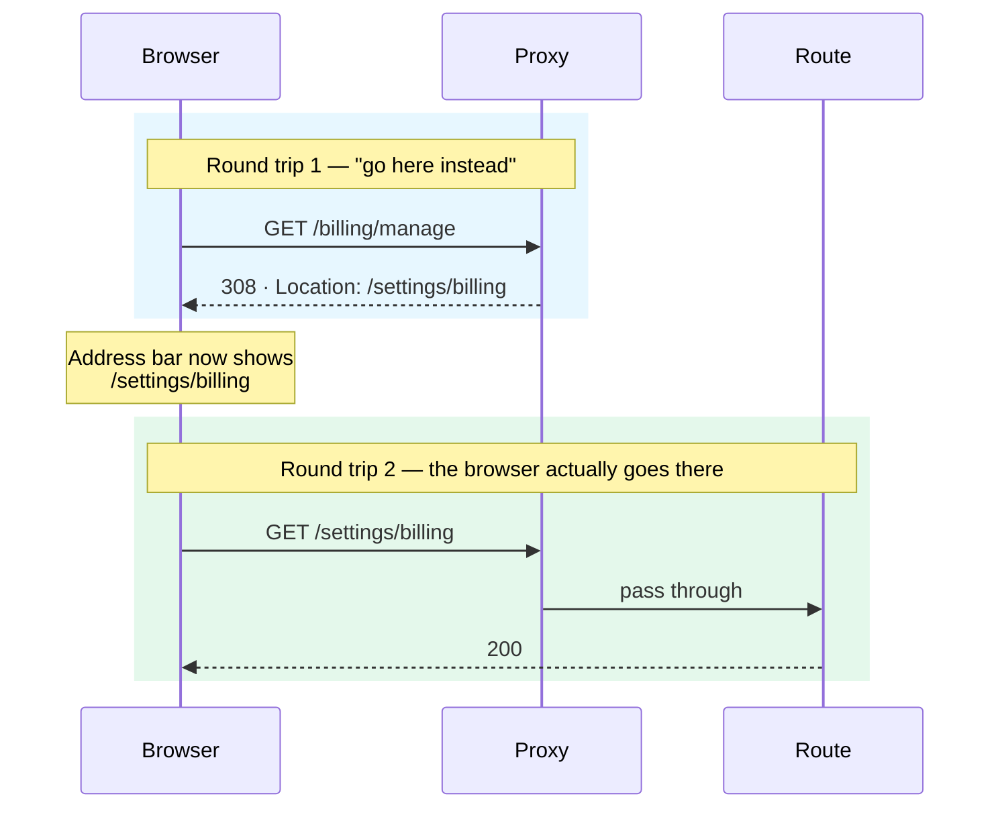
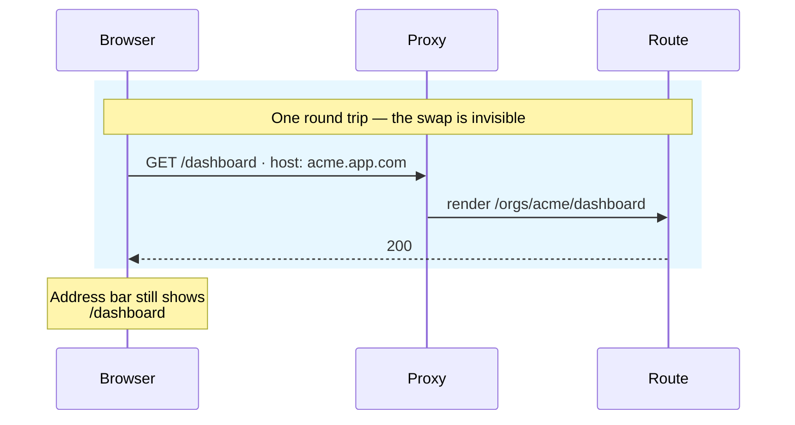

import { Aside, CardGrid } from '@astrojs/starlight/components';
import Term from '../../../components/ui/Term.astro';
import ExternalResource from '../../../components/ui/ExternalResource.astro';
import VideoCallout from '../../../components/embeds/VideoCallout.astro';
import Figure from '../../../components/figures/Figure.astro';
import TabbedContent from '../../../components/figures/tabbed-content/TabbedContent.astro';
import TabbedItem from '../../../components/figures/tabbed-content/TabbedItem.astro';
import StateMachineWalker from '../../../components/figures/state-machine-walker/StateMachineWalker.astro';
import Question from '../../../components/figures/state-machine-walker/Question.astro';
import Branch from '../../../components/figures/state-machine-walker/Branch.astro';
import Leaf from '../../../components/figures/state-machine-walker/Leaf.astro';
import CodeTooltips from '../../../components/code/CodeTooltips.astro';
import CodeVariants from '../../../components/code/code-variants/CodeVariants.astro';
import CodeVariant from '../../../components/code/code-variants/CodeVariant.astro';
import AnnotatedCode from '../../../components/code/annotated-code/AnnotatedCode.astro';
import AnnotatedStep from '../../../components/code/annotated-code/AnnotatedStep.astro';
import TrueFalse from '../../../components/exercises/true-false/TrueFalse.astro';
import Statement from '../../../components/exercises/true-false/Statement.astro';
import TfWhy from '../../../components/exercises/true-false/TfWhy.astro';
import MultipleChoice from '../../../components/exercises/multiple-choice/MultipleChoice.astro';
import McqChoice from '../../../components/exercises/multiple-choice/McqChoice.astro';
import McqWhy from '../../../components/exercises/multiple-choice/McqWhy.astro';
import CourseProgressBar from '../../../components/ui/CourseProgressBar.astro';

<CourseProgressBar value={frontmatter['course-progress']} />

Suppose you ship v2 of your billing screen. The page moves from `/billing/manage` to `/settings/billing`, but the old URL lives on in receipt emails, bookmarks, and Google's index. When someone clicks it, the browser should *go to* the new URL, the address bar should update, and search engines should record that the page moved for good.

Now a different need. The same app serves each tenant on its own subdomain, so `acme.app.com` and `globex.app.com` are separate customer workspaces. When Acme's admin opens `acme.app.com/dashboard`, the server has to render their org's dashboard while the address bar keeps saying `acme.app.com/dashboard`, never exposing the internal route that did the rendering.

These are two jobs with two names. A **redirect** changes the URL the user sees: the browser navigates, history gets an entry, and a permanent redirect tells search engines the page has a new home. A **rewrite** leaves the URL untouched while the server renders a different route behind it. One is visible, the other invisible, and mixing them up ships an app that looks fine but isn't.

You built `proxy.ts` in the last lesson and named rewrites and redirects as one of its jobs. You also left a hole: the auth gate redirected to `/sign-in?next=…` with the `next` value passed through unvalidated. This lesson draws the line between the two operations, gives a rule for *where* each belongs (the proxy is one option, not the default), and works the two production patterns, subdomain rewrites and safe post-login redirects. The second one closes that hole for good.

## Redirect changes the URL, rewrite does not

A redirect changes the address bar; a rewrite leaves it alone. Every other difference follows from that one.

A **redirect** is the proxy returning a `3xx` response with a `Location` header. The browser throws away that response and issues a brand-new request to the URL in `Location`, so a redirect is two round trips: the first comes back as "go here instead," the second is the browser going there. That second request is a real navigation, so the address bar updates, a history entry is added, a bookmark would save the new URL, and a search engine treats a permanent redirect as the canonical replacement for the old one.

A **rewrite** is the proxy returning the content of a different internal route. The browser sent one request and got one response, a normal `200` with a normal page, so there is one round trip and the address bar stays put. The user sees one URL while the server renders another, and the browser never learns about the swap.

What separates them is how many times the browser talks to the server and what it shows when it's done. Here are the two flows side by side; flip between the tabs and follow the arrows.

<TabbedContent syncKey="redirect-vs-rewrite">
  <TabbedItem label="Redirect">
    <Figure>

```mermaid
%%{init: {'themeCSS': '.messageText, .messageText tspan { font-size: 20px !important; } .actor, .actor tspan { font-size: 18px !important; } .noteText, .noteText tspan { font-size: 17px !important; }'} }%%
sequenceDiagram
    participant B as Browser
    participant P as Proxy
    participant R as Route

    rect rgba(56, 189, 248, 0.12)
        Note over B,P: Round trip 1 — "go here instead"
        B->>P: GET /billing/manage
        P-->>B: 308 · Location: /settings/billing
    end

    Note over B: Address bar now shows<br/>/settings/billing

    rect rgba(34, 197, 94, 0.12)
        Note over B,R: Round trip 2 — the browser actually goes there
        B->>P: GET /settings/billing
        P->>R: pass through
        R-->>B: 200
    end
```
      <Fragment slot="caption">Two round trips. The browser is told to go elsewhere, asks again, and the address bar changes to `/settings/billing`.</Fragment>
    </Figure>
  </TabbedItem>

  <TabbedItem label="Rewrite">
    <Figure>

```mermaid
%%{init: {'themeCSS': '.messageText, .messageText tspan { font-size: 20px !important; } .actor, .actor tspan { font-size: 18px !important; } .noteText, .noteText tspan { font-size: 17px !important; }'} }%%
sequenceDiagram
    participant B as Browser
    participant P as Proxy
    participant R as Route

    rect rgba(56, 189, 248, 0.12)
        Note over B,R: One round trip — the swap is invisible
        B->>P: GET /dashboard · host: acme.app.com
        P->>R: render /orgs/acme/dashboard
        R-->>B: 200
    end

    Note over B: Address bar still shows<br/>/dashboard
```
      <Fragment slot="caption">One round trip. The user keeps seeing `acme.app.com/dashboard` while a different route renders behind it.</Fragment>
    </Figure>
  </TabbedItem>
</TabbedContent>

Neither is the better operation; they answer different product questions. Reach for a redirect when the URL itself should change: a page was renamed, a feature was deprecated, or a logged-in user shouldn't sit on `/login`. Reach for a rewrite when the implementation moved but the user shouldn't have to care: multi-tenancy, an internal restructuring, or an A/B variant served from a different path. The question is never "which is faster," it's "should the user's URL change?"

These are two of the three terminals a proxy can end on, from the lifecycle diagram in the last lesson: `NextResponse.redirect()` and `NextResponse.rewrite()`. The third, `NextResponse.next()`, passes the request through to its route untouched. This lesson is about when to reach for each, not how to call it.

## Picking the status code: 307 or 308

A redirect carries a status code that tells the browser and every search crawler how long to trust it. Pick the wrong one and you create a problem that outlives the rule that caused it.

`NextResponse.redirect(url)` defaults to **307**, a *temporary* redirect. Pass a second argument to promote it to **308**, a *permanent* one.

<CodeTooltips tooltips={{
  '307': 'The default. Temporary: the old URL stays canonical, search engines keep indexing it, nothing is cached. Use it for redirects that depend on who is asking.',
  '308': 'Permanent. Search engines update the index and forward the page\'s ranking value; browsers may cache the redirect itself. Hard to undo, so reach for it only when the move is truly forever.',
}}>
```ts
NextResponse.redirect(new URL('/settings/billing', request.url));        // 307, temporary
NextResponse.redirect(new URL('/settings/billing', request.url), 308);   // 308, permanent
```
</CodeTooltips>

The two codes differ in what they tell the world downstream. A **308** says the move is forever: search engines repoint their index at the new URL and forward the old page's <Term definition="The ranking value search engines pass through links. A 308 forwards it to the new URL; a temporary redirect does not.">link equity</Term>, and browsers may cache the redirect and stop asking the server about the old URL at all. A **307** says the opposite, so keep treating the old URL as the real one. The billing rename is a genuine permanent move, so you reach for **308**. A logged-in user bounced off `/login` gets a **307**, because that redirect isn't a property of the URL; it's a temporary fact about this user right now. Tomorrow they're logged out, and `/login` is exactly where they should be.

You may have seen `301` and `302` in older code or interview questions. Don't use them: many HTTP clients silently rewrite a `POST` into a `GET` when they follow one, turning a form submission into a broken read. `307` and `308` preserve the request method exactly.

A permanent redirect is sticky in a way a temporary one is not. Once a browser has cached your `308` and search engines have reindexed around it, you can't easily un-tell them: remove the rule from your code and the cached `308` lives on in every browser that saw it. A wrong `307` is a minor inefficiency you fix in one line; a wrong `308` persists long after the rule is gone. So when you're not certain a move is permanent, ship the `307` and promote it to `308` only once you're sure.

Run your instincts through a few quick checks.

<TrueFalse instructions="Each statement is about redirect status codes.">
  <Statement answer="true">
    Renaming `/account` to `/settings` permanently is a job for a 308.
    <TfWhy>The page genuinely moved for good — a permanent redirect tells search engines to reindex and forwards the old page's link equity to the new URL.</TfWhy>
  </Statement>

  <Statement answer="false">
    A 302 redirect is guaranteed to preserve a POST request's method.
    <TfWhy>It isn't — many clients silently downgrade the POST to a GET on a 301 or 302. That's exactly why modern code uses 307/308, which preserve the method.</TfWhy>
  </Statement>

  <Statement answer="false">
    Calling `NextResponse.redirect(url)` with no second argument sends a 308.
    <TfWhy>The default is 307 (temporary). You have to pass 308 explicitly to make it permanent.</TfWhy>
  </Statement>

  <Statement answer="true">
    A logged-in user bounced away from `/login` should get a 307, not a 308.
    <TfWhy>The redirect depends on the user's session, not on the URL itself. It's temporary by nature, so 307. A 308 would tell browsers to cache "never visit /login" — wrong for a user who later logs out.</TfWhy>
  </Statement>

  <Statement answer="false">
    When you're unsure whether a move is permanent, a 308 is the safe default.
    <TfWhy>It's the riskier default. A wrong 308 gets cached and indexed and is hard to undo. Under-commit with 307 until you're certain.</TfWhy>
  </Statement>
</TrueFalse>

## Where a redirect rule belongs: config, proxy, or redirect()

A redirect can issue from three places, and the wrong one is a performance bug at best and a hard-to-find maintenance trap at worst. Two questions, asked in order, decide which place is right.

The first question is about the request. Some redirects are *always true for everyone*: `/billing/manage` goes to `/settings/billing` no matter who asks or what cookies they carry. A rule like that never reads the request, so it belongs in `next.config.ts`, in a `redirects()` block, where the platform applies it at the CDN edge with **zero function invocation**, faster and cheaper than any code you could write. You build that config in the next chapter.

Other redirects *do* read the request: whether to bounce a user off `/login` depends on their session cookie, which A/B bucket to route into depends on a cookie the proxy set, which locale subpath to serve depends on a header. Only code running at request time can see any of that, and that is exactly what `proxy.ts` is. The cost, as you saw last lesson, is the proxy round trip on every request the matcher selects, so the matcher stays tight.

That leaves a second question, because not every request-dependent redirect happens *before* the route. Consider the redirect after a Server Action: the user submits a "new invoice" form, the action writes the row, and *then* sends them to that invoice's page. Application code makes that decision in the middle of its work, once the work succeeds, not at the network boundary. That is `redirect()` and `permanentRedirect()` from `next/navigation`, which you met in routing, alongside `notFound()` for when a route looks up a resource and finds it gone.

So the test is two questions, in order: **does the redirect depend on the incoming request, and does it need to happen before the route renders?** Walk a few real cases through them.

<StateMachineWalker title="Where does this redirect belong?">
  <Question
    id="depends"
    prompt="Does the rule depend on the incoming request?"
    description="A cookie, a header, the host, a query param, or the user's session state — does the redirect need to read any of it?"
  >
    <Branch label="No — it's the same for everyone" to="leaf-config" />
    <Branch label="Yes — it inspects the request" to="before" />
  </Question>

  <Question id="before" prompt="Does it need to happen before the route renders?">
    <Branch label="Yes — bounce the request at the boundary" to="leaf-proxy" />
    <Branch label="No — application code decides it after doing work" to="leaf-redirect" />
  </Question>

  <Leaf id="leaf-config" verdict="redirects() in next.config.ts">
    A request-independent rule applies at the CDN edge with **no function invocation at all**, the cheapest and fastest option. Think legacy-URL migrations and marketing renames. Reach for it whenever the rule never reads the request. (You build it in the next chapter.)
  </Leaf>

  <Leaf id="leaf-proxy" verdict="A redirect in proxy.ts">
    The decision reads the request, such as a session cookie, the host, or an A/B bucket, and must land **before** the route renders. It costs the proxy round trip on every matched request, so keep the matcher tight.
  </Leaf>

  <Leaf id="leaf-redirect" verdict="redirect() / notFound() from next/navigation">
    Application logic decides **after doing work**: a Server Action finishes and sends the user to the new resource, or a route looks up a record and finds it gone. This runs during the render, not at the network boundary. (You met these in the routing chapter.)
  </Leaf>
</StateMachineWalker>

## Rewriting subdomains to org routes

Here is the first production pattern, and the concrete payoff for "rewrite is the invisible swap." Your app serves many tenants on subdomains: `acme.app.com/dashboard` should render Acme's org-scoped dashboard while the address bar keeps saying `acme.app.com/dashboard`. The user never sees an org id, because the subdomain *is* the org. Internally you want one set of routes parameterized by org, not a copy per customer. A rewrite bridges the two: read the subdomain, render the parameterized route, leave the URL alone.

<AnnotatedCode lang="ts" maxLines={12} code={`
export default function proxy(request: NextRequest) {
  const host = request.headers.get('host') ?? '';
  const sub = host.split(':')[0]?.split('.')[0] ?? '';

  if (isKnownOrg(sub)) {
    return NextResponse.rewrite(
      new URL(\`/orgs/\${sub}/dashboard\`, request.url),
    );
  }

  return NextResponse.next();
}
`}>
  <AnnotatedStep meta="{2-3}" color="violet">
    Pull the host off the request, then carve out the tenant: `acme.app.com` gives us `acme`. The `split(':')[0]` strips the port first, because in development the host is `acme.localhost:3000` and the port rides along until you cut it. Forget that step and the lookup fails only on your machine, a hard bug to track down. (The optional chain keeps TypeScript's `noUncheckedIndexedAccess` happy when a split yields nothing.)
  </AnnotatedStep>

  <AnnotatedStep meta={`{5} "isKnownOrg(sub)"`} color="violet">
    Validate the subdomain, cheaply. The proxy runs on every matched request, so this is the one place you must not put a database query. `isKnownOrg` is a stand-in for a *cached* tenancy check, such as an in-memory set or an edge KV read, never a round trip to Postgres per request. You'll build the real cached lookup with the tenancy layer later.
  </AnnotatedStep>

  <AnnotatedStep meta="{6-8}" color="violet">
    Rewrite to the internal route. The user keeps seeing `acme.app.com/dashboard` while `/orgs/acme/dashboard` renders behind it. Reach for `NextResponse.rewrite()` rather than a hand-rolled `fetch`: the helper propagates the headers React needs for client navigations to keep working, and a raw fetch silently drops them.
  </AnnotatedStep>

  <AnnotatedStep meta="{11}" color="violet">
    If the subdomain isn't a known org, fall through with `next()`. Every branch returns; nothing passes through implicitly.
  </AnnotatedStep>
</AnnotatedCode>

Two simplifications here, so you don't mistake the teaching shape for the production one. Splitting on `.` and grabbing the first segment is naive; a real app also handles the apex domain and the `www` prefix. And `isKnownOrg` stands in for a cached lookup, not the bare check it looks like. The mechanic is what matters: read the host, validate cheaply, rewrite.

<VideoCallout videoId="vVYlCnNjEWA" videoTitle="Multi-tenant SaaS apps with Next.js and Vercel">
  Lee Robinson walks the same subdomain-to-route rewrite live (10 min). Watch the address bar stay put while an internal route renders behind it.
</VideoCallout>

The rewrite lands on a route file at `app/orgs/[org]/dashboard/page.tsx`. The `[org]` segment is a dynamic param, the same kind you met in the routing chapter, and the route reads `params.org` (here the subdomain) to scope its queries to that org's data. That same `[org]` route also serves *path-based* tenancy, where the URL is `app.com/orgs/acme/dashboard` and carries the org segment openly. There no rewrite is needed, since the URL already names the org. One set of routes, two ways to reach it. (The async shape of `params`, a Promise in Next.js 16, is the next lesson.)

Rewrites carry one sharp edge that redirects don't. A rewrite hands the request to an internal route, but that route is itself a path, and if it *also* matches your proxy's matcher, the proxy runs again on the rewritten request. If the same condition holds, it rewrites again, and again. Nothing breaks loudly; the request keeps re-entering the proxy until the platform gives up and returns a server error.

<Aside type="caution">
A rewrite whose target the matcher also covers will loop. Either exclude the rewrite target from the matcher, or guard the proxy against re-entry.
</Aside>

There are two ways out. The clean one is to **exclude the rewrite target from the matcher**. The internal `/orgs/*` paths don't need the proxy's auth gate or its rewrite logic, so keep them out of the matcher and the rewrite can't loop back in. That's what the final file below does. When the target legitimately needs the proxy for something else, fall back to a **sentinel header**: set `x-rewritten: 1` on the rewrite, and short-circuit with `NextResponse.next()` at the top of the proxy whenever that header is already present. The header survives the internal hop, so the second pass sees it and stops.

## Setting a cookie while you redirect

To record a choice and send the user onward in one reply, set the cookie on the redirect response before returning it:

```ts
const response = NextResponse.redirect(new URL('/dashboard', request.url));
response.cookies.set('locale', 'es');
return response;
```

A cookie you set isn't readable during this pass; it arrives on the next request. For a redirect that next request is the navigation itself: the browser follows the redirect to `/dashboard` carrying the new `locale` cookie, and the route there reads it normally.

## The open-redirect hole in the `next` param

This closes the debt the last lesson left open. The fix is one small helper you'll reuse everywhere.

When the auth gate bounces an unauthenticated user, it remembers where they were headed so it can return them there after login. You saw the shape last lesson: the proxy tucks the requested path into the sign-in URL as a query param.

```ts
const signIn = new URL('/sign-in', request.url);
signIn.searchParams.set('next', request.nextUrl.pathname);
return NextResponse.redirect(signIn);
```

Writing the value down is harmless. The trap springs later, when the login flow *reads* `next` and redirects to it, because `next` came from the URL, which means it came from whoever crafted the link. An attacker sends a victim a link to `https://your-app.com/sign-in?next=https://evil.com`. The victim sees your real, trusted domain and logs in normally, and your login flow redirects them to the attacker's site: a pixel-perfect clone of your dashboard asking them to "confirm your password." This is an <Term definition="A bug where an app redirects to a URL the user controls without validating it, letting an attacker turn your trusted domain into a phishing springboard.">open redirect</Term>, the classic way a trusted login page becomes a phishing tool. It is why the last lesson left `next` unvalidated and flagged it for here.

The rule: **never redirect to a user-supplied URL without first proving it's a same-origin path.** Accept a value only if it starts with a single `/` and isn't a protocol-relative `//` or a full `protocol://` URL; anything that could send the browser off your origin gets a safe default instead. That rule lives in one helper, `safeNext`, in `lib/redirects.ts`, and it's absolute: you never pass `searchParams.get('next')` straight into a redirect, it always goes through the helper.

<CodeVariants>
  <CodeVariant label="Vulnerable" icon="lucide:shield-alert">
    <div data-mark-color="red">

    ```ts del={2}
    const next = signIn.searchParams.get('next');
    return NextResponse.redirect(new URL(next, request.url));
    ```

    </div>
    **Open redirect.** `next` came straight from the URL. An attacker sets `?next=https://evil.com` and your own login page launders their phishing link: the victim trusts your domain, logs in, and lands on the attacker's clone.
  </CodeVariant>

  <CodeVariant label="Safe" icon="lucide:shield-check">
    <div data-mark-color="green">

    ```ts ins={2}
    const next = signIn.searchParams.get('next');
    return NextResponse.redirect(new URL(safeNext(next), request.url));
    ```

    </div>
    **Same-origin only.** `safeNext` hands back the value only when it's a relative path, not `//` and not a full URL, and otherwise returns a safe default. One helper, used at every single redirect site that touches a `next` value.
  </CodeVariant>
</CodeVariants>

The helper is small on purpose: a security primitive should be easy to read, easy to audit, and used in one shape everywhere.

```ts title="lib/redirects.ts"
export function safeNext(next: string | null, fallback = '/dashboard'): string {
  if (!next || !next.startsWith('/') || next.startsWith('//')) return fallback;
  return next;
}
```

Three checks, three holes closed. An empty or missing value falls back. A value that doesn't start with `/` is rejected, which kills `https://evil.com` and oddities like `javascript:alert(1)`. The `//` check is the subtle one: a <Term definition="A URL starting with //, which the browser resolves using the current page's protocol: //evil.com becomes https://evil.com. The case open-redirect checks most often miss.">protocol-relative URL</Term> like `//evil.com` does start with a single `/`, so the first check waves it through, but the browser resolves it to `https://evil.com` and sends your user off-origin. Catching it is the difference between a helper that looks safe and one that is.

One honest caveat. These string checks are the readable teaching shape and they hold up well, but they can miss adversarial encodings: a backslash variant (`/\evil.com`), or percent-encoded slashes that some browsers normalize after your check runs. The hardened version parses the candidate with `new URL(next, origin)` and compares the *resolved* origin against your own, rejecting on any mismatch. Reach for that form once this matters; for now, `startsWith` is the clear version of the rule, not the last word on it.

Test the rule on a handful of values.

<MultipleChoice>
  Which of these `?next=` values does `safeNext` return unchanged — i.e. accepts as a safe redirect target? Select all that apply.

  <McqChoice correct>`/dashboard/invoices`</McqChoice>
  <McqChoice>`https://evil.com`</McqChoice>
  <McqChoice>`//evil.com`</McqChoice>
  <McqChoice correct>`/settings?tab=billing`</McqChoice>
  <McqChoice>`javascript:alert(1)`</McqChoice>

  <McqWhy>The helper hands a value back only when it begins with one slash and isn't a `//` pair. `/dashboard/invoices` and `/settings?tab=billing` clear both gates — a query string rides along on the path, it doesn't change the origin. `https://evil.com` and `javascript:alert(1)` never start with `/`, so they're rejected outright. `//evil.com` is the one that catches people: it *does* open with a slash, which is why the leading-slash test alone would wave it through — but it's protocol-relative, so the browser would resolve it to `https://evil.com` and leave your origin. The explicit `//` check is the only thing standing between the two safe answers and that trap.</McqWhy>
</MultipleChoice>

## Assembling the full proxy.ts

Here is the whole file: the `proxy.ts` you started last lesson, now doing the three jobs this chapter teaches. The legacy billing redirect, the subdomain rewrite, and the auth gate with its `next` value finally validated, all in under fifty lines.

Body order matters, and the rule is cheap, specific rules first and the auth gate last. The legacy redirect is a single path equality check, the cheapest, so it goes on top. The subdomain rewrite comes next and `return`s, so a rewritten `/orgs/*` request never reaches the gate; that route runs its own authoritative session check. The gate runs last, on what no earlier rule claimed, so the path it captures into `next` is the one the user actually asked for. Every branch returns.

<AnnotatedCode lang="ts" maxLines={16} code={`
// proxy.ts
import { getSessionCookie } from 'better-auth/cookies';
import { NextResponse } from 'next/server';
import type { NextRequest } from 'next/server';

import { SESSION_COOKIE_PREFIX } from '@/lib/auth';
import { safeNext } from '@/lib/redirects';

export default function proxy(request: NextRequest) {
  const { pathname } = request.nextUrl;

  if (pathname === '/billing/manage') {
    return NextResponse.redirect(new URL('/settings/billing', request.url), 308);
  }

  const host = request.headers.get('host') ?? '';
  const sub = host.split(':')[0]?.split('.')[0] ?? '';
  if (isKnownOrg(sub)) {
    return NextResponse.rewrite(new URL(\`/orgs/\${sub}\${pathname}\`, request.url));
  }

  const hasSession = getSessionCookie(request, { cookiePrefix: SESSION_COOKIE_PREFIX });
  if (!hasSession) {
    const signIn = new URL('/sign-in', request.url);
    signIn.searchParams.set('next', safeNext(pathname));
    return NextResponse.redirect(signIn);
  }

  return NextResponse.next();
}

export const config = {
  matcher: '/((?!api|_next/static|_next/image|favicon.ico|orgs).*)',
};
`}>
  <AnnotatedStep meta={`{32-34} "orgs"`} color="blue">
    Start at the matcher, since it gates everything above. It excludes assets and `/api` as before, but now also `orgs`. That is the loop fix: `/orgs/*` is the rewrite's target, and keeping it out of the matcher stops the rewritten request from re-entering the proxy and looping.
  </AnnotatedStep>

  <AnnotatedStep meta="{12-14}" color="blue">
    The legacy redirect. `/billing/manage` moved permanently to `/settings/billing`, so it returns a `308`. A purist would put this request-independent rule in `next.config.ts`, but it lives here beside the app's other URL logic. You'll see that trade in the next chapter.
  </AnnotatedStep>

  <AnnotatedStep meta={`{16-20} "isKnownOrg"`} color="blue">
    The subdomain rewrite. Read the host, strip the port, and if it's a known org, rewrite to the org route invisibly, leaving the address bar unchanged. `isKnownOrg` is a cheap cached check, never a database call.
  </AnnotatedStep>

  <AnnotatedStep meta="{22}" color="blue">
    The auth gate's presence check, unchanged from last lesson: `getSessionCookie` with the project's `SESSION_COOKIE_PREFIX`. The proxy only asks whether a session cookie exists; the route does the authoritative verification.
  </AnnotatedStep>

  <AnnotatedStep meta={`{23-27} "safeNext"`} color="blue">
    The debt being paid. The path going into `next` now passes through `safeNext` before it's written, so no user-controlled value reaches a redirect target unvalidated.
  </AnnotatedStep>

  <AnnotatedStep meta="{29}" color="blue">
    The final `return NextResponse.next()`. Every branch above returned; this is the pass-through for a request that matched the matcher but tripped no rule. No implicit fall-through.
  </AnnotatedStep>
</AnnotatedCode>

The slots are hollow on purpose. The session machinery behind `getSessionCookie` arrives when you build authentication, the cached lookup behind `isKnownOrg` arrives with multi-tenancy, and the static-redirect alternative comes next chapter. What you have now is the full shape of a request gate: cheap exclusions, an invisible rewrite, a visible redirect, and a validated bounce.

## External resources

<CardGrid>
  <ExternalResource
    title="NextResponse API reference"
    href="https://nextjs.org/docs/app/api-reference/functions/next-response"
    icon="simple-icons:nextdotjs"
    iconColor="#000000"
    description="The redirect, rewrite, and next method surface, with the status-code argument."
  />
  <ExternalResource
    title="MDN — HTTP redirections"
    href="https://developer.mozilla.org/en-US/docs/Web/HTTP/Guides/Redirections"
    icon="simple-icons:mdnwebdocs"
    iconColor="#000000"
    description="The full 301 / 302 / 307 / 308 distinction from the web platform's reference, the why behind the 307/308 pair."
  />
  <ExternalResource
    title="OWASP — Unvalidated Redirects and Forwards Cheat Sheet"
    href="https://cheatsheetseries.owasp.org/cheatsheets/Unvalidated_Redirects_and_Forwards_Cheat_Sheet.html"
    icon="simple-icons:owasp"
    iconColor="#2C5C84"
    description="The authoritative guidance behind safeNext and the open-redirect class."
  />
  <ExternalResource
    title="Next.js — Multi-tenant applications"
    href="https://nextjs.org/docs/app/guides/multi-tenant"
    icon="simple-icons:nextdotjs"
    iconColor="#000000"
    description="The subdomain-to-route rewrite pattern in full, including apex and www handling."
  />
</CardGrid>
