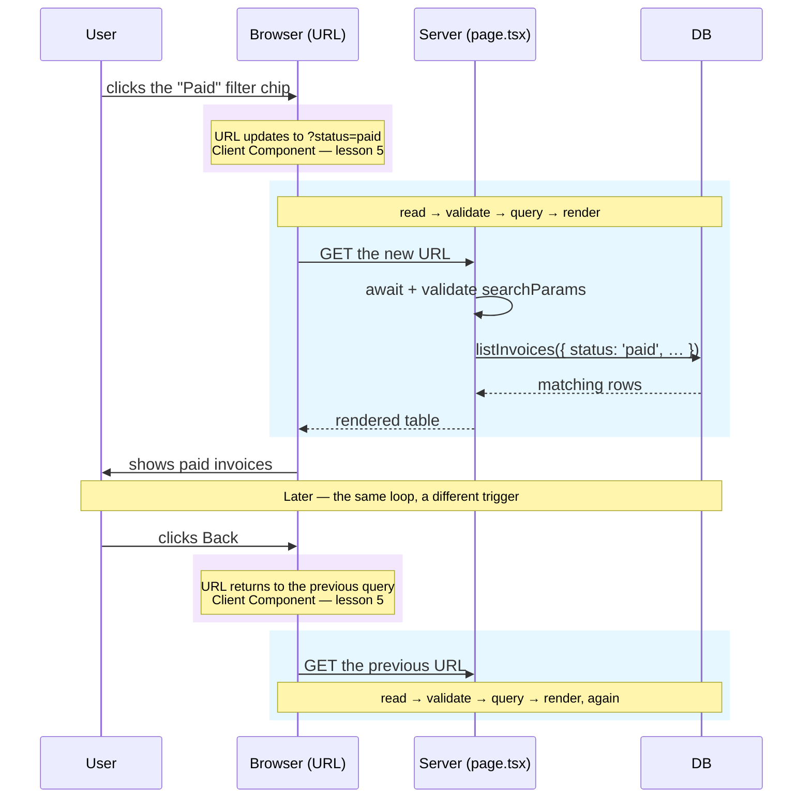

import Figure from '../../../components/figures/Figure.astro';
import UrlAnatomy from '../../../components/lessons/033/4/UrlAnatomy.astro';
import StaticChromeDynamicTable from '../../../components/lessons/033/4/StaticChromeDynamicTable.astro';
import CodeTooltips from '../../../components/code/CodeTooltips.astro';
import CodeVariants from '../../../components/code/code-variants/CodeVariants.astro';
import CodeVariant from '../../../components/code/code-variants/CodeVariant.astro';
import AnnotatedCode from '../../../components/code/annotated-code/AnnotatedCode.astro';
import AnnotatedStep from '../../../components/code/annotated-code/AnnotatedStep.astro';
import ZodCoding from '../../../components/live-coding/ZodCoding/ZodCoding.astro';
import Buckets from '../../../components/exercises/buckets/Buckets.astro';
import Bucket from '../../../components/exercises/buckets/Bucket.astro';
import Item from '../../../components/exercises/buckets/Item.astro';
import Term from '../../../components/ui/Term.astro';
import VideoCallout from '../../../components/embeds/VideoCallout.astro';
import ExternalResource from '../../../components/ui/ExternalResource.astro';
import CourseProgressBar from '../../../components/ui/CourseProgressBar.astro';
import { CardGrid } from '@astrojs/starlight/components';

<CourseProgressBar value={frontmatter['course-progress']} />

Picture the invoice list on your dashboard. The user filters it to `paid`, sorts by date, and pages forward once. Then three ordinary things happen.

They copy the URL into a Slack message to a coworker. The coworker opens it and sees the *same* view — paid invoices, sorted by date, page two. They refresh the tab, and the filter is still there. They hit the back button, and the previous filter returns.

None of that is automatic. Someone decided where that filter, sort, and page state lives, and that decision is the whole lesson. So here is the load-bearing question: **where does that view state live, and how do you read it on the server?**

There is a tempting wrong answer, and you'd reach for it on muscle memory. You'd put the filter in `useState`, add a `useEffect` that refetches when the filter changes, and render the result. It works on your screen. But the state lives in the component's memory, so it dies on refresh, it can't be shared, and the back button does nothing. You've also wired up an effect to fetch data — and back in the chapter on effects, the very first rule was that fetching in an effect is the thing you almost never want. That instinct was right. This is one of the places it pays off.

The senior answer is one sentence: **this state belongs in the URL, and a Server Component reads it directly.** No client state, no effect, no waterfall. The URL *is* the filter. By the end of this lesson you'll be able to read and validate the URL on the server and render a filtered list with nothing held in component memory.

One thing up front so you don't go looking for it: this lesson is the *read* side. *Writing* the URL when the user clicks a filter chip — the `useRouter` and `useSearchParams` hooks — is the next lesson. Here, the URL arrives, and we read it.

In the first lesson of this chapter you learned that a route's inputs are the URL, the headers, and the cookies, and nothing else. That lesson owned two of those doors: headers and cookies. This one owns the third and last: the URL.

## What belongs in the URL

Before any syntax, the decision. It's the most important thing in this lesson, and everything after it is just plumbing in service of it.

Here is the rule. **State that should survive a refresh, be shareable, or show up in browser history belongs in the URL. Transient state belongs in component state.** That's it. An open dropdown, a hover, focus, the half-typed text in a search box before you submit it — those are component state. They die when the page reloads, and nobody wants to bookmark a half-open menu.

When you're not sure which bucket something falls into, ask one question:

> Would the user expect this state to come back if they refreshed the page?

If yes, it goes in the URL. If no, it's `useState`. That single question resolves almost every case you'll meet.

You already know the `useState` side of this line — that's where local UI state has always lived. What's new is drawing the line: shareable, refresh-stable state does not belong in `useState`, it belongs in the URL. This section is the boundary between those two homes, and learning to place that boundary on instinct is what the rest of the lesson trains.

For any list-style view in a SaaS app, four kinds of state almost always belong in the URL. Memorize the quartet, because you'll reach for it on every table you ever build: **filter, sort, pagination, and the active tab or view**. Those are exactly the things a user expects to survive a refresh and to travel in a shared link.

Let's drill the edges, because the rule earns its keep on the cases that aren't obvious.

<Buckets
  twoCol
  instructions="Sort each piece of state into where it belongs. Watch the close calls — a submitted search and an unsubmitted one don't live in the same place, and neither do a tab and a dropdown."
>
  <Bucket name="url" label="URL state" description="Survives refresh, shareable, in history" />
  <Bucket name="component" label="Component state" description="Transient, dies on reload" />

  <Item bucket="url">The active status filter (`paid`, `overdue`)</Item>
  <Item bucket="url">The current sort column</Item>
  <Item bucket="url">The page cursor</Item>
  <Item bucket="url">The selected tab</Item>
  <Item bucket="url">The search query that has been submitted</Item>

  <Item bucket="component">Whether a row's actions dropdown is open</Item>
  <Item bucket="component">The text in the search box before the user submits it</Item>
  <Item bucket="component">Hover state on a filter chip</Item>
  <Item bucket="component">Whether the "delete invoice?" confirmation dialog is open</Item>
</Buckets>

The two pairs that trip people up are worth saying out loud. A search query the user has *submitted* belongs in the URL — they'd expect `?q=acme` to come back on refresh and to work in a shared link. The text *in the box before they hit enter* does not — that's an in-progress edit, pure component state. Same word, two homes, split by whether the user has committed to it. And a selected tab is URL state (it's a view they'd share), while an open dropdown is not (nobody shares an open menu). Hold those two distinctions and the rest falls out.

## Two vehicles: params for identity, searchParams for view state

The URL carries two kinds of information, and they ride in two different parts of it. Getting this split clear now saves you from a category of confusion later.

Route <Term definition="A path segment whose value isn't fixed — written as `[org]` in the file system, it captures whatever sits in that position of the URL.">params</Term> carry **identity**: which org, which invoice — the nouns in the path. `searchParams` carry **view state**: filter, sort, page — the adjectives on the query. A single URL has both, and you read them through two different props. Path answers *who*; query answers *how you're looking at them*.

Let's take a real URL apart so the split is something you can see.

<Figure caption="The path says who you're looking at. The query says how you're looking at them.">
  <UrlAnatomy />
</Figure>

The `[org]` piece is a <Term definition="A folder named in square brackets, like `[org]`, that matches any value in that URL position and exposes it as a route param.">dynamic segment</Term> — a folder named `[org]` in your `app/` directory, which you met when you first learned App Router routing. Whatever sits in that slot of the URL becomes `params.org`.

Now the page component that receives both. In the App Router, a `page.tsx` is handed its `params` and `searchParams` as props, and the file's location on disk determines which params exist:

```tsx title="app/orgs/[org]/invoices/page.tsx"
export default async function InvoicesPage(props: {
  params: Promise<{ org: string }>;
  searchParams: Promise<{ [key: string]: string | string[] | undefined }>;
}) {
  // ...render the list
}
```

Recognition depth for now — the deep dive on the `Promise` wrapper is the next section.

The shape of `params` here — `{ org: string }` — comes directly from the `[org]` folder. Rename the folder, and the param renames with it. You don't wire this up; the file system does. The `searchParams` type is looser on purpose: every value is `string | string[] | undefined`, and we'll see why that matters later. For now, don't worry about the `Promise` wrapper — that's the next section, and it's the heart of the read-on-server pattern.

## Reading them on the server: both are Promises

In Next.js 16, `params` and `searchParams` don't arrive as plain objects. They arrive as **Promises**, and you `await` them:

```tsx
const { org } = await props.params;
const { status, sort } = await props.searchParams;
```

That `await` is not ceremony. You met these request APIs in the previous chapter, where the point was that the route is dynamic by default, so resolving them *is* the request-time work — the value genuinely isn't known until the request arrives. Under the Cache Components model, the `await` is also the explicit signal that this part of the render is dynamic. Hold that thought; we come back to exactly what it means for caching near the end of the lesson.

There's a client-side counterpart you should be able to recognize, though you won't write it here. A Client Component that's handed a `searchParams` Promise unwraps it with `React.use()` instead of `await` — the same unwrapping shape you saw when crossing the server/client boundary. But reading the URL on the client is rare, and it's the next lesson's subject. The senior default — the *exact* reflex the cookies-and-headers lesson installed — is to read high on the server and pass resolved values down as props. You read once, at the top, where the request is; everything below receives plain values.

## Validate at the boundary with Zod

Now the one rule in this lesson you don't get to skip. Frame it not as a tip but as a security decision, because that's what it is.

`searchParams` are **user-controlled input.** The address bar is a text field anyone can type into. A user — or a crawler, or someone poking at your app — can request `?status=lol`, or `?sort=💀`, or omit every parameter, or repeat one fifty times. Whatever they send arrives in your `searchParams`. If you pass that straight into a database query, the best case is a crash; the worse cases get more interesting.

So the rule: **parse every `searchParams` read through a Zod schema, at the top of the page, once.** Valid values pass through; invalid or missing ones fall back to sensible defaults. The schema does double duty — it's the runtime gate *and* the written contract for what the URL is allowed to contain. Anyone reading the page can see exactly which filters and sorts are legal.

Here's the canonical helper. One per route, called once at the top of the page:

<CodeTooltips tooltips={{
  "z.enum(['draft', 'paid', 'overdue'])": 'Only these three strings are accepted. Anything else fails the parse.',
  '.optional()': 'The key may be absent. No filter applied.',
  ".default('-date')": 'If sort is missing, the parsed value is -date. This is what makes the param omittable.',
  safeParse: 'Returns { success: true, data } or { success: false, error }. Never throws — so a bad URL can\'t crash the page.',
  'InvoiceQuerySchema.parse({})': 'Parse an empty object to get the all-defaults result — the view a fresh, unfiltered visit renders.',
}}>
```tsx title="app/orgs/[org]/invoices/_lib/search-params.ts"
import { z } from 'zod';

const InvoiceQuerySchema = z.object({
  status: z.enum(['draft', 'paid', 'overdue']).optional(),
  sort: z.enum(['-date', 'date', '-total', 'total']).default('-date'),
  cursor: z.string().optional(),
});

type InvoiceQuery = z.infer<typeof InvoiceQuerySchema>;

export function parseSearchParams(raw: unknown): InvoiceQuery {
  const result = InvoiceQuerySchema.safeParse(raw);
  return result.success ? result.data : InvoiceQuerySchema.parse({});
}
```
</CodeTooltips>

A few things are deliberate here. `safeParse` returns a result object — `{ success: true, data }` or `{ success: false, error }` — and crucially it *never throws*. That matters: a malformed link should render your default view, not a 500 error page. A user who clicks a broken URL someone mangled in a chat app should land on a sane invoice list, not a stack trace. (Zod has far more depth than this — refinements, transforms, error formatting — but that's a later chapter. Here you only need `z.enum`, `.optional()`, `.default()`, and `safeParse`.)

Notice the `sort` default. Because `sort` has `.default('-date')`, the URL doesn't *need* a `sort` param at all — a visit to `/orgs/acme/invoices` with no query string parses cleanly into `{ sort: '-date' }`. Defaults are what let the URL be short and omittable while the page still knows what to render.

Your turn to write the schema. The starter is too loose — `status` accepts any string, and `sort` has no default. Tighten it until every scenario lights up green, and watch the inferred type narrow as you do.

<ZodCoding
  schemaName="InvoiceQuerySchema"
  instructions="Tighten this schema. Constrain `status` to the three real statuses and make it optional; give `sort` an enum and a `.default('-date')`. Watch two things move as you go: the fixtures turn green, and the `^?` type shifts — `status` becomes optional (`status?`), while `sort` stays required because its default always fills it in. The empty-object fixture is the one to notice — it passes because the default fills in `sort`, which is what makes the param omittable."
  starter={`import { z } from 'zod';

export const InvoiceQuerySchema = z.object({
  status: z.string(),
  sort: z.enum(['-date', 'date', '-total', 'total']),
  cursor: z.string().optional(),
});

type InvoiceQuery = z.infer<typeof InvoiceQuerySchema>;
//   ^?
`}
  fixtures={[
    { name: 'status filter applied', input: { status: 'paid' }, expect: 'pass' },
    { name: 'no params (default fills sort)', input: {}, expect: 'pass' },
    { name: 'bogus status', input: { status: 'lol' }, expect: 'fail', errorContains: 'Invalid' },
    { name: 'explicit sort + status', input: { sort: '-date', status: 'draft' }, expect: 'pass' },
    { name: 'bogus sort', input: { sort: 'sideways' }, expect: 'fail' },
    { name: 'status + opaque cursor', input: { status: 'overdue', cursor: 'eyJpZCI6NDJ9' }, expect: 'pass' },
  ]}
/>

## The Server Component pattern: read, validate, query, render

This is the payoff — the shape that replaces the whole client state machine. The contrast is the lesson, so let's put the two approaches side by side.

<CodeVariants>
  <CodeVariant label="Client state machine">
    <div data-mark-color="red">

    ```tsx {4-5} {7-11}
    'use client';

    export function InvoiceList({ org }: { org: string }) {
      const [status, setStatus] = useState('paid');
      const [invoices, setInvoices] = useState<Invoice[]>([]);

      useEffect(() => {
        fetch(`/api/orgs/${org}/invoices?status=${status}`)
          .then((res) => res.json())
          .then(setInvoices);
      }, [org, status]);

      return <InvoiceTable invoices={invoices} />;
    }
    ```

    </div>
    **The reflex version.** It renders, but the filter lives in memory: not shareable, not refresh-stable, and there's an effect fetching data — exactly what the effects chapter told you to avoid.
  </CodeVariant>

  <CodeVariant label="URL state on the server">
    <div data-mark-color="green">

    ```tsx {5-6} "parseSearchParams"
    export default async function InvoicesPage(props: {
      params: Promise<{ org: string }>;
      searchParams: Promise<Record<string, string | string[] | undefined>>;
    }) {
      const { org } = await props.params;
      const { status, sort, cursor } = parseSearchParams(await props.searchParams);

      const invoices = await listInvoices({ org, status, sort, cursor });

      return <InvoiceTable invoices={invoices} />;
    }
    ```

    </div>
    **The senior shape.** The URL is the state; the server re-reads and re-renders on every URL change. No client state, no effect, no waterfall.
  </CodeVariant>
</CodeVariants>

Sit with the difference. The client version holds the filter in `useState`, so it evaporates on reload and can't travel in a link; it runs an effect to fetch, which is a waterfall (render, *then* fetch, *then* render again) and the exact anti-pattern from the effects chapter. The server version holds nothing. The URL is the filter. When the URL changes, the server runs again from the top, reads the new value, queries, and renders. There is no second source of truth to keep in sync, because there's only one source: the address bar.

Let's walk the server version line by line, because this is the page you'll write a hundred times.

<AnnotatedCode lang="tsx" code={`
// app/orgs/[org]/invoices/page.tsx
import { listInvoices } from '@/db/queries/invoices';

import { InvoiceTable } from './_components/invoice-table';
import { parseSearchParams } from './_lib/search-params';

export default async function InvoicesPage(props: {
  params: Promise<{ org: string }>;
  searchParams: Promise<Record<string, string | string[] | undefined>>;
}) {
  const { org } = await props.params;
  const { status, sort, cursor } = parseSearchParams(await props.searchParams);

  const invoices = await listInvoices({ org, status, sort, cursor });

  return <InvoiceTable invoices={invoices} />;
}
`}>
  <AnnotatedStep meta={`{7-10} "async"`} color="blue">
    An `async` page component, handed both channels as Promises — that's why it has to be `async`. This signature is the only place the request enters; everything below is plain values.
  </AnnotatedStep>

  <AnnotatedStep meta="{11}" color="blue">
    The identity read. `await props.params` resolves to `{ org }` — which org we're scoped to. This is the *who* from the path.
  </AnnotatedStep>

  <AnnotatedStep meta="{12}" color="blue">
    The validate-at-the-boundary line, and the one to never skip. We `await` the raw, user-controlled query, hand it straight to the Zod helper, and get back typed, trusted `{ status, sort, cursor }`. Garbage in the URL becomes defaults out, not a crash.
  </AnnotatedStep>

  <AnnotatedStep meta="{14}" color="blue">
    The data read. The parsed, trusted values flow in as arguments. `listInvoices` is a black box here — how it builds the query against the database is a later chapter's job. What matters is that *only validated values reach it*.
  </AnnotatedStep>

  <AnnotatedStep meta="{16}" color="blue">
    Render the result. Look at what isn't here: no `useState`, no `useEffect`, no second copy of the filter to keep in sync. URL in, typed filters, query, table out — all on the server, every render.
  </AnnotatedStep>
</AnnotatedCode>

The narrative across those five steps is the whole pattern in five words: **URL in, typed filters, table out.** And it runs top to bottom on the server, fresh, every single render.

Which raises the question of when, exactly, "every render" happens. Here's the loop that makes the page feel alive — though notice that one step in it belongs to the next lesson.

<Figure>

  <Fragment slot="caption">The server is a pure function of the URL. The client's only job is to change the URL — and that's the next lesson. The purple step is the only one the client owns.</Fragment>
</Figure>

That's the mental model to carry out of here: **the server is a pure function of the URL.** Give it the same URL, it renders the same page. The only moving part the client owns is changing the URL — and that one piece is what the next lesson is about.

<VideoCallout videoId="VOrR1Wa4f6Y" videoTitle="You're Doing State Wrong in Next.js (Use URL State Instead!)">
  Jan Marshal walks the same arc this lesson does (~26 min) — building a list first with `useState`, then rebuilding it with URL state, and finishing on type safety and "when to use what."
</VideoCallout>

## Two shapes that will surprise you

Two facts about real URLs break naive code. You only need to know they exist and how to absorb them at the parser; the deep mechanics come later.

### Repeated keys become arrays

Add a multi-select filter — say, tags — and a user picks two. The URL becomes `?tag=billing&tag=urgent`. Now `searchParams.tag` is **not** a string. It's `['billing', 'urgent']`. Repeat a key, and its value is an array.

This is why the type of any `searchParams` value isn't `string`. It's this:

<CodeTooltips tooltips={{
  string: 'The common case — ?status=paid.',
  'string[]': 'A repeated key — ?tag=billing&tag=urgent. The bug you hit the day you add a multi-select.',
  undefined: 'The key is absent entirely.',
}}>
```ts
type SearchParamValue = string | string[] | undefined;
```
</CodeTooltips>

Code that assumes `string` breaks the moment a key repeats — and it'll pass every test you write until the day someone selects two tags. The fix is to handle it once, at the parser, so the rest of your page only ever sees one shape:

<div data-mark-color="orange">

```tsx {2-3}
const TagsSchema = z
  .union([z.string(), z.array(z.string())])
  .transform((value) => (Array.isArray(value) ? value : [value]))
  .default([]);
```

</div>

Now whether the user picks one tag or five, everything downstream of the parser receives a `string[]`. You normalized the surprise away at the boundary, which is exactly where surprises should die.

### Cursors are opaque on purpose

Look back at our example URL: `cursor=eyJpZCI6NDJ9`. That gibberish is a pagination cursor, and it's gibberish *on purpose*.

A cursor encodes where the last page ended — the sort key of the final row, plus a <Term definition="A secondary sort key that makes ordering deterministic when the primary key ties — so two invoices with the same date still have a stable, unambiguous order.">tiebreaker</Term> so the ordering is unambiguous. It's then base64-encoded into something <Term definition="Data the user isn't meant to read or edit, only to receive and hand back unchanged.">opaque</Term> — meaningless to the user, perfectly deterministic for the server. The server hands it out; the browser carries it in the URL; the server decodes it on the next request to know where to resume.

Two senior reasons it's opaque rather than a readable `?page=2`. First, it isn't state the user should edit — encoding it discourages anyone from fiddling with a value that has to be internally consistent. Second, the encoded shape can evolve — you can add a tiebreaker field next quarter without breaking old links, because nothing outside the server ever parsed it. Decoding lives in your parse helper, right alongside the Zod schema; the query consumes the decoded shape. The cursor mechanics — how you build it, the tiebreaker rules, how it drives pagination in a real list — are a later chapter's job. For now: it's a string in the URL, opaque by design, decoded at the boundary.

## Does reading searchParams change caching?

You've been holding the question since the `await`. Here's the answer, and the short version first so it doesn't loom: reading `searchParams` costs you nothing you weren't already paying.

Under the <Term definition="Next.js 16's rendering model: every route is dynamic by default, and you opt specific parts into the cache with `use cache`.">Cache Components</Term> model from the previous chapter, every route is dynamic by default. Reading `searchParams` is one of the explicit dynamic signals — but the route was already dynamic, so the read doesn't *make* anything dynamic that wasn't. There's no penalty for reading the URL versus not reading it.

There's one interaction that does bite, though, and it's a build error, not a runtime surprise:

:::caution
Awaiting `searchParams` inside a `use cache` function is a build error. A cached function, by definition, must produce the same output regardless of the request — and `searchParams` is the most request-specific input there is. You can't cache something that depends on it.
:::

The fix is the same move you saw in the previous chapter, and it's the reason <Term definition="Partial Prerendering — a static shell rendered ahead of time with dynamic holes streamed in at request time.">PPR</Term> exists: **keep the cached chrome outside the dynamic part of the tree.** The sidebar, the header, the org nav — that's chrome, it's the same for every filter, so it streams instantly from the static cache. The invoice table is the dynamic hole: it reads `searchParams`, it runs at request time. You don't fight this; you lay the page out so the URL read happens only where the data is genuinely dynamic.

<StaticChromeDynamicTable />

The picture is the intuition: `searchParams` flows into the inner box and nowhere else. Cache the shell, read the URL where the data lives.

## What the URL is not

You know what belongs in the URL. The senior judgment is just as much about what you'd never put there. Three boundaries:

**Not a place for secrets.** Everything in the URL leaks. It lands in server access logs, it rides along in the `Referer` header when the user clicks an outbound link, it sits in browser history, it flows into analytics. Tokens, session identifiers, internal IDs you don't want strangers enumerating — none of it goes in the URL, ever. This is the same line the cookies lesson drew: the URL and headers are telemetry; identity belongs in the session cookie. A value you'd be unhappy to find in a log file does not go in the address bar.

**Not a place for large blobs.** Keep your total URL state well under a kilobyte — browsers and CDNs cap URL length, and you'll hit it. JSON-stringifying a fat object into a single param is brittle, and it bloats every request line and every log entry the URL touches. Use flat, named params. If you outgrow hand-rolling them, that's the signal to reach for a real tool — which is the last section.

**Not a place for transient UI state.** And here we close the loop back to the rule we opened with. An open dropdown, a hover, a half-typed input — the user would never bookmark those, never share them, never expect them back on refresh. They fail the one question. They belong in `useState`.

## nuqs: the type-safe URL-state layer

Everything so far — `searchParams`, a Zod schema, defaults — is the right amount of tool for a page with one filter, or two. Don't reach past it prematurely. But there's a threshold, and you should know where it sits.

When a project grows past **two or three URL-state surfaces** — a filter, a sort, a search, a cursor, a tab, all on the same view, and the same pattern repeated across half a dozen views — the hand-written parse-and-default code becomes a tax. Every new param is another enum, another default, another line in the helper, kept in sync by hand. That's the moment **`nuqs`** pays for itself: a typed URL-state library that collapses parse, default, and type into one declaration.

`nuqs` gives you typed parsers, default values, and — on the client — a `useQueryState` hook that both reads *and* writes the URL. The writing half is the next lesson and a later chapter's project; here we stay on the server read.

<CodeVariants>
  <CodeVariant label="Hand-rolled">
    ```tsx title="_lib/search-params.ts"
    const InvoiceQuerySchema = z.object({
      status: z.enum(['draft', 'paid', 'overdue']).optional(),
      sort: z.enum(['-date', 'date', '-total', 'total']).default('-date'),
    });

    type InvoiceQuery = z.infer<typeof InvoiceQuerySchema>;

    export function parseSearchParams(raw: unknown): InvoiceQuery {
      const result = InvoiceQuerySchema.safeParse(raw);
      return result.success ? result.data : InvoiceQuerySchema.parse({});
    }
    ```

    **Fine for one surface.** But every new param is another enum, another default, another branch in the helper — and the type is a separate `z.infer` you keep in sync by hand.
  </CodeVariant>

  <CodeVariant label="nuqs createSearchParamsCache">
    ```tsx title="_lib/search-params.ts"
    import {
      createSearchParamsCache,
      parseAsStringEnum,
    } from 'nuqs/server';

    export const searchParamsCache = createSearchParamsCache({
      status: parseAsStringEnum(['draft', 'paid', 'overdue']),
      sort: parseAsStringEnum(['-date', 'date', '-total', 'total']).withDefault(
        '-date',
      ),
    });
    ```

    **One declaration is the parser, the default, and the type at once.** And the same cache reads anywhere in the render tree — a deeply nested component calls `searchParamsCache.get('status')` without re-parsing the prop or threading it down. In the page, parse once:

    ```tsx title="app/orgs/[org]/invoices/page.tsx"
    const { status, sort } = await searchParamsCache.parse(props.searchParams);
    ```
  </CodeVariant>
</CodeVariants>

Note one detail that bites people: the server parsers import from **`nuqs/server`**, not the bare `nuqs`. The top-level `nuqs` entry carries a `'use client'` directive and would drag client code into your Server Component. The split is intentional — server parsing lives behind `/server`.

And be honest about what the cache buys you. The page itself can already read its own `searchParams` prop directly — you don't *need* `nuqs` for that. What the cache gives you is one typed declaration shared across the *whole* render tree: parse once at the page, then any nested Server Component reads the same parsed values with `searchParamsCache.get(...)`, instead of re-parsing the prop or threading it down by hand. The API surface — `createSearchParamsCache`, `parseAsStringEnum`, `.withDefault`, `.parse`, `.get` — is worth recognizing now; you'll set it up properly when you build the full list view.

## External resources

<CardGrid>
  <ExternalResource
    title="Next.js docs — the page file"
    href="https://nextjs.org/docs/app/api-reference/file-conventions/page"
    icon="simple-icons:nextdotjs"
    iconColor="#000000"
    description="The official shape of the params and searchParams props, and why they're Promises."
  />
  <ExternalResource
    title="Zod docs — basics"
    href="https://zod.dev/basics"
    icon="simple-icons:zod"
    iconColor="#3E67B1"
    description="parse vs safeParse and the result object — the runtime gate your parse helper is built from."
  />
  <ExternalResource
    title="nuqs docs — server-side usage"
    href="https://nuqs.dev/docs/server-side"
    icon="lucide:link-2"
    iconColor="#FF6B6B"
    description="createSearchParamsCache: the production URL-state layer and its server read pattern."
  />
  <ExternalResource
    title="Your URL Is Your State"
    href="https://alfy.blog/2025/10/31/your-url-is-your-state.html"
    icon="lucide:newspaper"
    iconColor="#0EA5E9"
    description="Ahmad Alfy on the URL as a state container — what belongs there and the one question that decides."
  />
</CardGrid>
