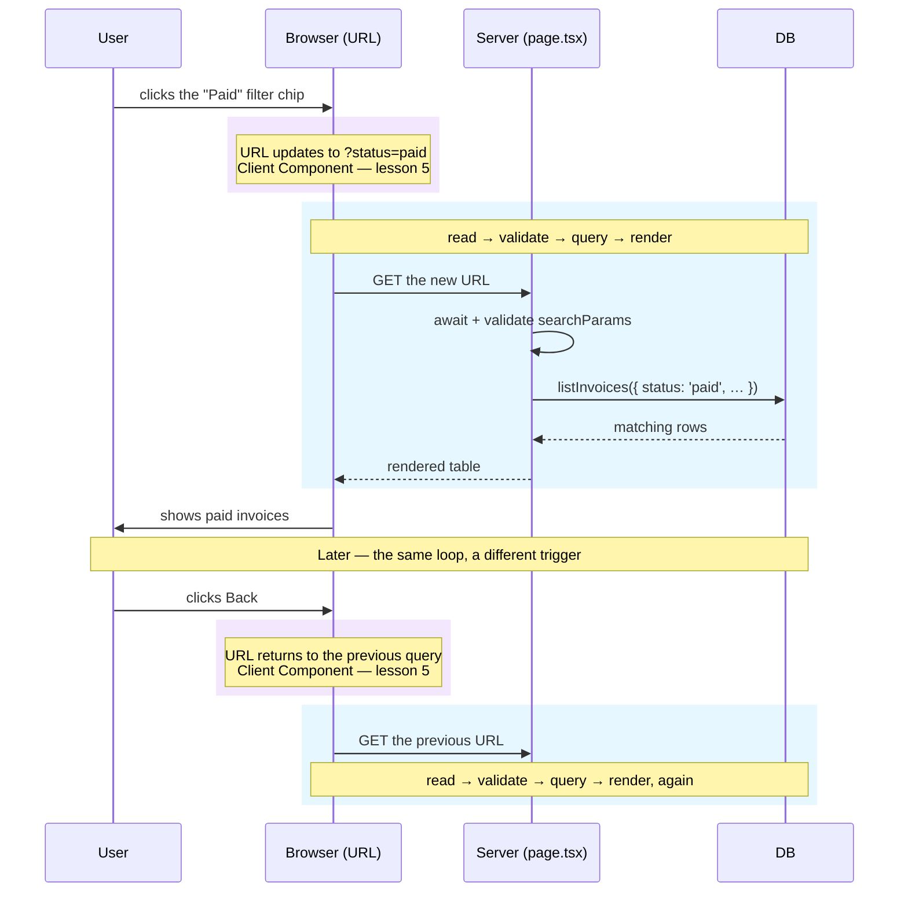

import Figure from '../../../components/figures/Figure.astro';
import UrlAnatomy from '../../../components/lessons/033/4/UrlAnatomy.astro';
import StaticChromeDynamicTable from '../../../components/lessons/033/4/StaticChromeDynamicTable.astro';
import CodeTooltips from '../../../components/code/CodeTooltips.astro';
import CodeVariants from '../../../components/code/code-variants/CodeVariants.astro';
import CodeVariant from '../../../components/code/code-variants/CodeVariant.astro';
import AnnotatedCode from '../../../components/code/annotated-code/AnnotatedCode.astro';
import AnnotatedStep from '../../../components/code/annotated-code/AnnotatedStep.astro';
import ZodCoding from '../../../components/live-coding/ZodCoding/ZodCoding.astro';
import Buckets from '../../../components/exercises/buckets/Buckets.astro';
import Bucket from '../../../components/exercises/buckets/Bucket.astro';
import Item from '../../../components/exercises/buckets/Item.astro';
import Term from '../../../components/ui/Term.astro';
import VideoCallout from '../../../components/embeds/VideoCallout.astro';
import ExternalResource from '../../../components/ui/ExternalResource.astro';
import CourseProgressBar from '../../../components/ui/CourseProgressBar.astro';
import { CardGrid } from '@astrojs/starlight/components';

<CourseProgressBar value={frontmatter['course-progress']} />

Picture the invoice list on your dashboard. A user filters it to `paid`, sorts by date, and pages forward once, then copies the URL into Slack. The coworker who opens it sees the *same* view: paid invoices, sorted by date, page two. Refreshing keeps the filter; the back button returns the previous one.

None of that is automatic. Someone has to decide where the filter, sort, and page state lives. So where does it live, and how do you read it on the server?

The tempting wrong answer is to hold the filter in `useState`, refetch with a `useEffect` when it changes, and render the result. The filter then lives in component memory, so it dies on refresh, can't be shared, and the back button does nothing. You've also put data fetching in an effect, which the effects chapter warned against.

The senior answer: this state belongs in the URL, and a Server Component reads it directly, with no client state, no effect, and no waterfall. The URL *is* the filter. By the end of this lesson you'll read and validate the URL on the server and render a filtered list with nothing in component memory.

This lesson is the *read* side. *Writing* the URL when the user clicks a filter chip, with `useRouter` and `useSearchParams`, is the next lesson.

A route's inputs are the URL, the headers, and the cookies. The first lesson of this chapter covered headers and cookies; this one covers the URL.

## What belongs in the URL

The rule is this: state that should survive a refresh, be shareable, or show up in browser history belongs in the URL, and transient state belongs in component state. An open dropdown, a hover, focus, the half-typed text in a search box before you submit it: those are component state. They die when the page reloads, and nobody wants to bookmark a half-open menu.

When you're not sure which bucket something falls into, ask one question:

> Would the user expect this state to come back if they refreshed the page?

If yes, it goes in the URL. If no, it's `useState`. That single question resolves almost every case you'll meet.

For any list-style view in a SaaS app, four kinds of state almost always belong in the URL, and you'll reach for them on every table you build: filter, sort, pagination, and the active tab or view. These are exactly what a user expects to survive a refresh and to travel in a shared link.

<Buckets
  twoCol
  instructions="Sort each piece of state into where it belongs. Watch the close calls — a submitted search and an unsubmitted one don't live in the same place, and neither do a tab and a dropdown."
>
  <Bucket name="url" label="URL state" description="Survives refresh, shareable, in history" />
  <Bucket name="component" label="Component state" description="Transient, dies on reload" />

  <Item bucket="url">The active status filter (`paid`, `overdue`)</Item>
  <Item bucket="url">The current sort column</Item>
  <Item bucket="url">The page cursor</Item>
  <Item bucket="url">The selected tab</Item>
  <Item bucket="url">The search query that has been submitted</Item>

  <Item bucket="component">Whether a row's actions dropdown is open</Item>
  <Item bucket="component">The text in the search box before the user submits it</Item>
  <Item bucket="component">Hover state on a filter chip</Item>
  <Item bucket="component">Whether the "delete invoice?" confirmation dialog is open</Item>
</Buckets>

Two pairs trip people up. A *submitted* search query belongs in the URL, because the user expects `?q=acme` to come back on refresh and to work in a shared link; the text in the box before they hit enter is an in-progress edit, so it stays component state. The same word lives in two homes, split by whether the user has committed to it. Likewise, a selected tab is a view someone would share, so it's URL state, while an open dropdown is not, since nobody shares an open menu.

## params for identity, searchParams for view state

The URL carries two kinds of information in two different parts.

Route <Term definition="A path segment whose value isn't fixed — written as `[org]` in the file system, it captures whatever sits in that position of the URL.">params</Term> carry **identity**: which org, which invoice, the nouns in the path. `searchParams` carry **view state**: filter, sort, page, the adjectives on the query. A single URL has both, and you read them through two different props.

<Figure caption="The path says who you're looking at. The query says how you're looking at them.">
  <UrlAnatomy />
</Figure>

The `[org]` piece is a <Term definition="A folder named in square brackets, like `[org]`, that matches any value in that URL position and exposes it as a route param.">dynamic segment</Term>: a folder named `[org]` in your `app/` directory. Whatever sits in that slot of the URL becomes `params.org`.

A `page.tsx` receives `params` and `searchParams` as props, and its location on disk determines which params exist:

```tsx title="app/orgs/[org]/invoices/page.tsx"
export default async function InvoicesPage(props: {
  params: Promise<{ org: string }>;
  searchParams: Promise<{ [key: string]: string | string[] | undefined }>;
}) {
  // ...render the list
}
```

The `params` type, `{ org: string }`, comes straight from the `[org]` folder: rename the folder and the param renames with it. The file system wires this up, not you. The `searchParams` type is looser on purpose: every value is `string | string[] | undefined`. The `Promise` wrapper around both is the next section's topic.

## Reading them on the server: both are Promises

In Next.js 16, `params` and `searchParams` arrive as **Promises**, which you `await`:

```tsx
const { org } = await props.params;
const { status, sort } = await props.searchParams;
```

That `await` does real work. The route is dynamic by default, so its values genuinely aren't known until the request arrives, and resolving them is the request-time work. Under the Cache Components model, the `await` is also the explicit signal that this part of the render is dynamic.

A Client Component handed a `searchParams` Promise unwraps it with `React.use()` instead of `await`, the same shape you saw crossing the server/client boundary. But reading the URL on the client is rare. The senior default is to read high on the server and pass resolved values down as props: read once, at the top, where the request is, and everything below receives plain values.

## Validate at the boundary with Zod

This step is mandatory, not a style preference: it's a security decision.

`searchParams` are **user-controlled input.** The address bar is a text field anyone can type into. A user, a crawler, or someone poking at your app can send `?status=lol`, or `?sort=💀`, or omit every parameter, or repeat one fifty times. Pass that straight into a database query and the best case is a crash; the worse cases are security holes.

So parse every `searchParams` read through a Zod schema, once, at the top of the page. Valid values pass through; invalid or missing ones fall back to defaults. The schema is both the runtime gate and the written contract for what the URL may contain, so anyone reading the page can see which filters and sorts are legal.

Here's the canonical helper, one per route, called once at the top of the page:

<CodeTooltips tooltips={{
  "z.enum(['draft', 'paid', 'overdue'])": 'Only these three strings are accepted. Anything else fails the parse.',
  '.optional()': 'The key may be absent. No filter applied.',
  ".default('-date')": 'If sort is missing, the parsed value is -date. This is what makes the param omittable.',
  safeParse: 'Returns { success: true, data } or { success: false, error }. Never throws — so a bad URL can\'t crash the page.',
  'InvoiceQuerySchema.parse({})': 'Parse an empty object to get the all-defaults result — the view a fresh, unfiltered visit renders.',
}}>
```tsx title="app/orgs/[org]/invoices/_lib/search-params.ts"
import { z } from 'zod';

const InvoiceQuerySchema = z.object({
  status: z.enum(['draft', 'paid', 'overdue']).optional(),
  sort: z.enum(['-date', 'date', '-total', 'total']).default('-date'),
  cursor: z.string().optional(),
});

type InvoiceQuery = z.infer<typeof InvoiceQuerySchema>;

export function parseSearchParams(raw: unknown): InvoiceQuery {
  const result = InvoiceQuerySchema.safeParse(raw);
  return result.success ? result.data : InvoiceQuerySchema.parse({});
}
```
</CodeTooltips>

The key choice is `safeParse`, which returns a result object instead of throwing. A mangled link, like one someone garbled in a chat app, should render your default invoice list, not a 500 page. You need only `z.enum`, `.optional()`, `.default()`, and `safeParse` here.

The `.default('-date')` on `sort` is what lets the URL stay short: a visit to `/orgs/acme/invoices` with no query string parses cleanly into `{ sort: '-date' }`, so the param can be omitted while the page still knows what to render.

Your turn to write the schema. The starter is too loose: `status` accepts any string, and `sort` has no default. Tighten it until every scenario lights up green, and watch the inferred type narrow as you do.

<ZodCoding
  schemaName="InvoiceQuerySchema"
  instructions="Tighten this schema. Constrain `status` to the three real statuses and make it optional; give `sort` an enum and a `.default('-date')`. Watch two things move as you go: the fixtures turn green, and the `^?` type shifts — `status` becomes optional (`status?`), while `sort` stays required because its default always fills it in. The empty-object fixture is the one to notice — it passes because the default fills in `sort`, which is what makes the param omittable."
  starter={`import { z } from 'zod';

export const InvoiceQuerySchema = z.object({
  status: z.string(),
  sort: z.enum(['-date', 'date', '-total', 'total']),
  cursor: z.string().optional(),
});

type InvoiceQuery = z.infer<typeof InvoiceQuerySchema>;
//   ^?
`}
  fixtures={[
    { name: 'status filter applied', input: { status: 'paid' }, expect: 'pass' },
    { name: 'no params (default fills sort)', input: {}, expect: 'pass' },
    { name: 'bogus status', input: { status: 'lol' }, expect: 'fail', errorContains: 'Invalid' },
    { name: 'explicit sort + status', input: { sort: '-date', status: 'draft' }, expect: 'pass' },
    { name: 'bogus sort', input: { sort: 'sideways' }, expect: 'fail' },
    { name: 'status + opaque cursor', input: { status: 'overdue', cursor: 'eyJpZCI6NDJ9' }, expect: 'pass' },
  ]}
/>

## The Server Component pattern: read, validate, query, render

This is the shape that replaces the whole client state machine. The contrast carries the point, so here are both approaches side by side.

<CodeVariants>
  <CodeVariant label="Client state machine">
    <div data-mark-color="red">

    ```tsx {4-5} {7-11}
    'use client';

    export function InvoiceList({ org }: { org: string }) {
      const [status, setStatus] = useState('paid');
      const [invoices, setInvoices] = useState<Invoice[]>([]);

      useEffect(() => {
        fetch(`/api/orgs/${org}/invoices?status=${status}`)
          .then((res) => res.json())
          .then(setInvoices);
      }, [org, status]);

      return <InvoiceTable invoices={invoices} />;
    }
    ```

    </div>
    **The reflex version.** The filter lives in memory: not shareable, not refresh-stable, and fetched from an effect, exactly what the effects chapter told you to avoid.
  </CodeVariant>

  <CodeVariant label="URL state on the server">
    <div data-mark-color="green">

    ```tsx {5-6} "parseSearchParams"
    export default async function InvoicesPage(props: {
      params: Promise<{ org: string }>;
      searchParams: Promise<Record<string, string | string[] | undefined>>;
    }) {
      const { org } = await props.params;
      const { status, sort, cursor } = parseSearchParams(await props.searchParams);

      const invoices = await listInvoices({ org, status, sort, cursor });

      return <InvoiceTable invoices={invoices} />;
    }
    ```

    </div>
    **The senior shape.** The URL is the state; the server re-reads and re-renders on every URL change. No client state, no effect, no waterfall.
  </CodeVariant>
</CodeVariants>

The client version holds the filter in `useState`, so it evaporates on reload and can't travel in a link, and its effect creates a waterfall: render, fetch, render again. The server version holds nothing. The URL is the filter, and when it changes the server runs again from the top, reads the new value, queries, and renders. There is only one source of truth: the address bar.

Walk the server version line by line, because this is the page you'll write again and again.

<AnnotatedCode lang="tsx" code={`
// app/orgs/[org]/invoices/page.tsx
import { listInvoices } from '@/db/queries/invoices';

import { InvoiceTable } from './_components/invoice-table';
import { parseSearchParams } from './_lib/search-params';

export default async function InvoicesPage(props: {
  params: Promise<{ org: string }>;
  searchParams: Promise<Record<string, string | string[] | undefined>>;
}) {
  const { org } = await props.params;
  const { status, sort, cursor } = parseSearchParams(await props.searchParams);

  const invoices = await listInvoices({ org, status, sort, cursor });

  return <InvoiceTable invoices={invoices} />;
}
`}>
  <AnnotatedStep meta={`{7-10} "async"`} color="blue">
    An `async` page component, handed both channels as Promises. This signature is the only place the request enters; everything below is plain values.
  </AnnotatedStep>

  <AnnotatedStep meta="{11}" color="blue">
    The identity read. `await props.params` resolves to `{ org }`, the *who* from the path.
  </AnnotatedStep>

  <AnnotatedStep meta="{12}" color="blue">
    The validate-at-the-boundary line, the one never to skip. The raw, user-controlled query goes straight to the Zod helper and comes back as typed, trusted `{ status, sort, cursor }`. Garbage in the URL becomes defaults out, not a crash.
  </AnnotatedStep>

  <AnnotatedStep meta="{14}" color="blue">
    The data read. Only the parsed, trusted values flow in. How `listInvoices` builds the query is a later chapter's job; what matters here is that nothing unvalidated reaches it.
  </AnnotatedStep>

  <AnnotatedStep meta="{16}" color="blue">
    Render the result. No `useState`, no `useEffect`, no second copy of the filter to keep in sync: URL in, table out, all on the server, every render.
  </AnnotatedStep>
</AnnotatedCode>

So when does "every render" happen? The loop below is what makes the page feel alive.

<Figure>

```mermaid
%%{init: {'themeCSS': '.messageText, .messageText tspan { font-size: 20px !important; } .actor, .actor tspan { font-size: 18px !important; } .noteText, .noteText tspan { font-size: 16px !important; }'} }%%
sequenceDiagram
    participant U as User
    participant B as Browser (URL)
    participant S as Server (page.tsx)
    participant D as DB

    U->>B: clicks the "Paid" filter chip

    rect rgba(168, 85, 247, 0.14)
        Note over B: URL updates to ?status=paid<br/>Client Component — lesson 5
    end

    rect rgba(56, 189, 248, 0.12)
        Note over B,D: read → validate → query → render
        B->>S: GET the new URL
        S->>S: await + validate searchParams
        S->>D: listInvoices({ status: 'paid', … })
        D-->>S: matching rows
        S-->>B: rendered table
    end

    B->>U: shows paid invoices

    Note over U,D: Later — the same loop, a different trigger

    U->>B: clicks Back

    rect rgba(168, 85, 247, 0.14)
        Note over B: URL returns to the previous query<br/>Client Component — lesson 5
    end

    rect rgba(56, 189, 248, 0.12)
        B->>S: GET the previous URL
        Note over B,D: read → validate → query → render, again
    end
```
  <Fragment slot="caption">The server is a pure function of the URL: same URL in, same page out. The client's only job is to change the URL, the purple step, which is the next lesson.</Fragment>
</Figure>

The server is a pure function of the URL: give it the same URL, it renders the same page. The only part the client owns is changing that URL, which is the next lesson.

<VideoCallout videoId="VOrR1Wa4f6Y" videoTitle="You're Doing State Wrong in Next.js (Use URL State Instead!)">
  Jan Marshal walks the same arc this lesson does (~26 min): building a list with `useState`, rebuilding it with URL state, then closing on type safety and when to use what.
</VideoCallout>

## Two URL shapes to absorb at the parser

Two facts about real URLs break naive code. Know they exist and how to absorb them at the parser; the mechanics come later.

### Repeated keys become arrays

Add a multi-select filter like tags and let a user pick two. The URL becomes `?tag=billing&tag=urgent`, and `searchParams.tag` is now `['billing', 'urgent']`, not a string. Repeat a key and its value is an array.

That's why a `searchParams` value isn't typed `string`:

<CodeTooltips tooltips={{
  string: 'The common case — ?status=paid.',
  'string[]': 'A repeated key — ?tag=billing&tag=urgent. The bug you hit the day you add a multi-select.',
  undefined: 'The key is absent entirely.',
}}>
```ts
type SearchParamValue = string | string[] | undefined;
```
</CodeTooltips>

Code that assumes `string` passes every test until someone selects two tags. Handle the array case once, at the parser, so the rest of your page sees one shape:

<div data-mark-color="orange">

```tsx {2-3}
const TagsSchema = z
  .union([z.string(), z.array(z.string())])
  .transform((value) => (Array.isArray(value) ? value : [value]))
  .default([]);
```

</div>

Now whether the user picks one tag or five, everything downstream receives a `string[]`.

### Cursors are opaque on purpose

That `cursor=eyJpZCI6NDJ9` in our example URL is a pagination cursor, and it's gibberish on purpose.

A cursor encodes where the last page ended: the sort key of the final row plus a <Term definition="A secondary sort key that makes ordering deterministic when the primary key ties — so two invoices with the same date still have a stable, unambiguous order.">tiebreaker</Term> for unambiguous ordering. Base64-encoding makes it <Term definition="Data the user isn't meant to read or edit, only to receive and hand back unchanged.">opaque</Term>: meaningless to the user, deterministic for the server, which decodes it on the next request to resume. Opacity buys two things over a readable `?page=2`: it discourages users from editing a value that has to stay internally consistent, and it lets the encoded shape gain a field next quarter without breaking old links, since nothing outside the server parses it. Decoding lives in your parse helper beside the Zod schema; the cursor's full mechanics are a later chapter's job.

## Does reading searchParams change caching?

Reading `searchParams` costs you nothing you weren't already paying.

Under the <Term definition="Next.js 16's rendering model: every route is dynamic by default, and you opt specific parts into the cache with `use cache`.">Cache Components</Term> model from the previous chapter, every route is dynamic by default. Reading `searchParams` is a dynamic signal, but the route was already dynamic, so the read changes nothing.

One interaction does cause trouble, and it surfaces as a build error rather than a runtime surprise:

:::caution
Awaiting `searchParams` inside a `use cache` function is a build error. A cached function, by definition, must produce the same output regardless of the request, and `searchParams` is the most request-specific input there is. You can't cache something that depends on it.
:::

The fix is the move from the previous chapter, the one <Term definition="Partial Prerendering — a static shell rendered ahead of time with dynamic holes streamed in at request time.">PPR</Term> is built for: keep the cached chrome outside the dynamic part of the tree. The sidebar, header, and org nav are the same for every filter, so they stream instantly from the static cache. The invoice table is the dynamic hole: it reads `searchParams` and runs at request time. Lay the page out so the URL read happens only where the data is genuinely dynamic.

<StaticChromeDynamicTable />

## What the URL is not

You know what belongs in the URL; what to keep out matters just as much. Three boundaries.

**Not a place for secrets.** Everything in the URL leaks: into server access logs, into the `Referer` header when the user clicks an outbound link, into browser history, into analytics. Tokens, session identifiers, and internal IDs you don't want strangers enumerating never go in the URL. The cookies lesson drew the same line: the URL and headers are telemetry, and identity belongs in the session cookie. A value you'd be unhappy to find in a log file does not belong in the address bar.

**Not a place for large blobs.** Browsers and CDNs cap URL length, so keep your total URL state well under a kilobyte. JSON-stringifying a fat object into one param is brittle and bloats every request line and log entry the URL touches. Use flat, named params, and when you outgrow hand-rolling them, reach for a real tool, covered in the last section.

**Not a place for transient UI state.** An open dropdown, a hover, a half-typed input: the user would never bookmark those, share them, or expect them back on refresh. They fail the one question, so they belong in `useState`.

## nuqs: the type-safe URL-state layer

A `searchParams` prop, a Zod schema, and a default are the right amount of tool for a page with one filter or two.
The threshold to watch for is when a project grows past two or three URL-state surfaces, say a filter, a sort, a search, a cursor, and a tab on the same view, repeated across half a dozen views.
At that point the hand-written parse-and-default code becomes a tax, and **`nuqs`** pays for itself: a typed URL-state library that collapses parse, default, and type into one declaration.

`nuqs` gives you typed parsers, default values, and, on the client, a `useQueryState` hook that both reads *and* writes the URL.
Writing is the next lesson; here we stay on the server read.

<CodeVariants>
  <CodeVariant label="Hand-rolled">
    ```tsx title="_lib/search-params.ts"
    const InvoiceQuerySchema = z.object({
      status: z.enum(['draft', 'paid', 'overdue']).optional(),
      sort: z.enum(['-date', 'date', '-total', 'total']).default('-date'),
    });

    type InvoiceQuery = z.infer<typeof InvoiceQuerySchema>;

    export function parseSearchParams(raw: unknown): InvoiceQuery {
      const result = InvoiceQuerySchema.safeParse(raw);
      return result.success ? result.data : InvoiceQuerySchema.parse({});
    }
    ```

    **Fine for one surface.** Every new param adds another enum, another default, another branch in the helper, plus a separate `z.infer` type you keep in sync by hand.
  </CodeVariant>

  <CodeVariant label="nuqs createSearchParamsCache">
    ```tsx title="_lib/search-params.ts"
    import {
      createSearchParamsCache,
      parseAsStringEnum,
    } from 'nuqs/server';

    export const searchParamsCache = createSearchParamsCache({
      status: parseAsStringEnum(['draft', 'paid', 'overdue']),
      sort: parseAsStringEnum(['-date', 'date', '-total', 'total']).withDefault(
        '-date',
      ),
    });
    ```

    **One declaration is the parser, the default, and the type at once.** You parse once at the page, and any nested Server Component reads the same values with `searchParamsCache.get('status')`, no re-parsing or prop-threading:

    ```tsx title="app/orgs/[org]/invoices/page.tsx"
    const { status, sort } = await searchParamsCache.parse(props.searchParams);
    ```
  </CodeVariant>
</CodeVariants>

One detail to get right: the server parsers import from **`nuqs/server`**, not the bare `nuqs`.
The top-level `nuqs` entry carries a `'use client'` directive and would drag client code into your Server Component, so server parsing lives behind `/server`.

## External resources

<CardGrid>
  <ExternalResource
    title="Next.js docs — the page file"
    href="https://nextjs.org/docs/app/api-reference/file-conventions/page"
    icon="simple-icons:nextdotjs"
    iconColor="#000000"
    description="The official shape of the params and searchParams props, and why they're Promises."
  />
  <ExternalResource
    title="Zod docs — basics"
    href="https://zod.dev/basics"
    icon="simple-icons:zod"
    iconColor="#3E67B1"
    description="parse vs safeParse and the result object — the runtime gate your parse helper is built from."
  />
  <ExternalResource
    title="nuqs docs — server-side usage"
    href="https://nuqs.dev/docs/server-side"
    icon="lucide:link-2"
    iconColor="#FF6B6B"
    description="createSearchParamsCache: the production URL-state layer and its server read pattern."
  />
  <ExternalResource
    title="Your URL Is Your State"
    href="https://alfy.blog/2025/10/31/your-url-is-your-state.html"
    icon="lucide:newspaper"
    iconColor="#0EA5E9"
    description="Ahmad Alfy on the URL as a state container — what belongs there and the one question that decides."
  />
</CardGrid>
