import CourseProgressBar from '../../../components/ui/CourseProgressBar.astro';
import Figure from '../../../components/figures/Figure.astro';
import AnnotatedCode from '../../../components/code/annotated-code/AnnotatedCode.astro';
import AnnotatedStep from '../../../components/code/annotated-code/AnnotatedStep.astro';
import CodeVariants from '../../../components/code/code-variants/CodeVariants.astro';
import CodeVariant from '../../../components/code/code-variants/CodeVariant.astro';
import Term from '../../../components/ui/Term.astro';
import ZodCoding from '../../../components/live-coding/ZodCoding/ZodCoding.astro';
import Buckets from '../../../components/exercises/buckets/Buckets.astro';
import Bucket from '../../../components/exercises/buckets/Bucket.astro';
import Item from '../../../components/exercises/buckets/Item.astro';
import TrueFalse from '../../../components/exercises/true-false/TrueFalse.astro';
import Statement from '../../../components/exercises/true-false/Statement.astro';
import TfWhy from '../../../components/exercises/true-false/TfWhy.astro';
import VideoCallout from '../../../components/embeds/VideoCallout.astro';
import ExternalResource from '../../../components/ui/ExternalResource.astro';
import { CardGrid } from '@astrojs/starlight/components';

<CourseProgressBar value={frontmatter['course-progress']} />

Right now your `db/schema.ts` declares the `invoices` table — every column, every type, every nullability flag, every default. You built that over the last five chapters. And then, somewhere in `/lib`, you have been hand-writing a `createInvoiceSchema` as a `z.object`, naming the same columns a second time so a Server Action can validate its input. Stop and look at those two declarations side by side: they are the same fact written twice. The day someone makes `notes` non-nullable in the table, or renames a column, the schema keeps happily accepting the old shape — nothing connects the two, so nothing complains. You find out in production, at runtime, when a write blows up against a constraint your validator never knew about. So why are you maintaining both?

This lesson is the inversion the whole chapter has been circling. Every previous lesson taught Zod as a thing you *write*. This one's pitch is that when the entity is a database row, you don't write the schema at all — you **generate** it from the table and refine API rules on top. In [Derive, don't duplicate](/042-zod-4---the-validation-contract/4-derive-dont-duplicate/) you met that reflex with a hand-written base schema as the canonical source; this is the same reflex one layer up, with the *database* as the canonical source. By the end you will generate insert, select, and update validators straight from a table, layer your refinements over them, and — just as importantly — know the exact boundary where you should *not* generate, and hand-write a `z.object` instead.

## The three generators

The table already declares every column. So what does `drizzle-zod` hand you back, and why is it three schemas and not one?

Because one table has three *boundaries*, and they disagree about which columns are required. The package gives you a generator for each, and each one's inferred type lines up with a `$infer*` type you already met when you built the data layer — the row and insert types the table gives you for free.

- `createSelectSchema(invoices)` is the **read** shape: the row as it comes *back* from the database. Every non-nullable column is required, nullable columns are `.nullable()`, and — this is the one that surprises people — **columns with defaults are still required**. The row already exists; its `id` and `createdAt` were filled in long before you read it, so the read shape has them. Its inferred type matches `typeof invoices.$inferSelect`.
- `createInsertSchema(invoices)` is the **write** shape: the row as it goes *in*. Now the columns with database defaults or a `$defaultFn` become **optional** — the database will fill them, so the caller doesn't have to. Database-generated columns are absent entirely. Its inferred type matches `typeof invoices.$inferInsert`.
- `createUpdateSchema(invoices)` is the **partial-write** shape, for PATCH-style edits: every column optional, generated columns absent. Think of it as `createInsertSchema(invoices).partial()`, but cleaner at the call site.

The split between select and insert on defaulted columns *is* the whole reason there are three generators, so let's make it concrete. Here is the slice of the `invoices` table the rest of the lesson works from — the same table you built earlier, trimmed to the columns that matter here:

```ts title="db/schema.ts"
export const invoices = pgTable('invoices', {
  id: uuid().primaryKey().default(sql`uuidv7()`),
  organizationId: uuid().notNull(),
  createdBy: uuid().notNull(),
  number: text().notNull(),
  status: invoiceStatus().notNull().default('draft'),
  total: numeric({ precision: 12, scale: 2 }).notNull(),
  notes: text(),
  ...timestamps, // createdAt, defaulted to now()
});
```

`invoiceStatus` is the `pgEnum('invoice_status', [...])` from the schema file, and `notes` is the only nullable column. Imports are omitted.

Watch what happens to `id` and `createdAt` — the two defaulted columns — as you move across the three generators. They go from **required**, to **optional**, to **optional**: required when you read a row back (it has them), optional when you insert (the database supplies them), optional again when you patch. That single flip, required-to-optional, is the thing one schema could never express — which is why there are three.

<CodeVariants maxLines={8}>
  <CodeVariant label="createSelectSchema">
    <div data-mark-color="blue">

    ```ts "id: string" "createdAt: Date"
    const invoiceRowSchema = createSelectSchema(invoices);
    type InvoiceRow = z.infer<typeof invoiceRowSchema>;
    // { id: string; organizationId: string; createdBy: string;
    //   number: string; status: 'draft' | ...; total: string;
    //   notes: string | null; createdAt: Date }
    ```

    </div>
    **Validate a row coming *back*.** Every column is present, including `id` and `createdAt`, because a row that already exists has them. Matches `invoices.$inferSelect`.
  </CodeVariant>

  <CodeVariant label="createInsertSchema">
    <div data-mark-color="blue">

    ```ts "id?: string" "status?: 'draft' | ..." "createdAt?: Date"
    const invoiceInsertSchema = createInsertSchema(invoices);
    type InvoiceInsert = z.infer<typeof invoiceInsertSchema>;
    // { id?: string; organizationId: string; createdBy: string;
    //   number: string; status?: 'draft' | ...; total: string;
    //   notes?: string | null; createdAt?: Date }
    ```

    </div>
    **Validate a row going *in*.** The defaulted columns (`id`, `status`, `createdAt`) are now optional, because the database fills them. `organizationId` and `createdBy` stay required — they're `notNull` with no default. Matches `invoices.$inferInsert`, and it's the one you reach for most.
  </CodeVariant>

  <CodeVariant label="createUpdateSchema">
    <div data-mark-color="blue">

    ```ts "number?: string" "total?: string"
    const invoiceUpdateSchema = createUpdateSchema(invoices);
    type InvoiceUpdate = z.infer<typeof invoiceUpdateSchema>;
    // { id?: string; organizationId?: string; createdBy?: string;
    //   number?: string; status?: 'draft' | ...; total?: string;
    //   notes?: string | null; createdAt?: Date }
    ```

    </div>
    **Validate a *patch*.** Now *every* column is optional, so a caller can send just the fields they're changing — `number` and `total` were required in insert and are optional here too. Roughly `createInsertSchema(invoices).partial()`, cleaner at the call site.
  </CodeVariant>
</CodeVariants>

Reaching for the wrong one of these is the first place people slip. Validating an insert with `createSelectSchema` makes the caller send an `id` and a `createdAt` they have no business supplying — the select shape requires them. Match the generator to the boundary: row coming back, row going in, patch.

## Refining on top of the generated base

The generated insert schema accepts any `text` at all for `number`, and any numeric string for `total`. But your API wants `number` capped at fifty characters and `total` to be non-negative. The column types don't carry those rules — `text` is `text`, the table doesn't know fifty. So where do the extra rules go?

On top of the generated base — and there are two distinct tools for putting them there. Keep them separate in your head, because conflating them is where the sharpest bug in this lesson lives.

The first tool is the <Term definition="The optional second argument to a drizzle-zod generator: an object keyed by column name, where each entry refines or replaces that column's generated schema before the schema is assembled.">override map</Term> — the **second argument** to the generator. It hands you per-column rules that fold into the base *as it's being built*. It has two forms, and the difference between them is the watch-out:

- The **callback form**, `{ number: (schema) => schema.min(1).max(50) }`, receives the column's *already-generated* base schema — for `text` that's a string schema — and you chain onto it. You do not rebuild from `z.string()`; the string schema is handed to you and you add `.min`, `.max`, `.refine`. Crucially, after your callback runs, drizzle-zod re-applies the column's nullability and optionality *around* your result, so you can't accidentally drop them. **This is the safe default.**
- The **direct-schema form**, `{ payload: someSchema }`, *replaces* the column's schema wholesale — and here is the trap: drizzle-zod does **not** re-apply nullability afterward. Hand a plain schema to a nullable column this way and its `.nullable()` silently vanishes. Reach for this form only when you genuinely mean to supply the entire shape (the `jsonb` pairing later in this lesson), and re-add `.nullable()` or `.optional()` yourself if the column had it.

Callback when you're adding rules; direct-schema only when you're replacing the whole thing and you've taken ownership of nullability. That one boundary saves you a class of bug that compiles clean and fails in production.

The second tool you already own: `.omit`, `.pick`, `.extend`, `.partial` — the composition algebra from [Derive, don't duplicate](/042-zod-4---the-validation-contract/4-derive-dont-duplicate/), applied to the generated schema instead of a hand-written one. The move you'll make constantly is `.omit`: an action sets some columns itself, from session and auth, never from the user. The `organizationId` comes from the current org. The `createdBy` comes from the signed-in user. The `id` and `createdAt` come from the database. None of those should be in the input contract a user fills, so you strip them — and what remains is exactly the user-supplied subset.

Here is the canonical shape, the `createInvoiceInputSchema` that the invoice-creating action in the next chapter will validate against. Walk it one part at a time:

<AnnotatedCode lang="ts" maxLines={10} code={`
const createInvoiceInputSchema = createInsertSchema(invoices, {
  number: (schema) => schema.min(1).max(50),
  total: (schema) =>
    schema.refine((n) => Number(n) >= 0, { error: 'Total must be non-negative' }),
}).omit({ id: true, organizationId: true, createdBy: true, createdAt: true });

type CreateInvoiceInput = z.infer<typeof createInvoiceInputSchema>;
`}>
  <AnnotatedStep meta="{1}" color="blue">
    Start from the generated insert base, not a hand-written `z.object`. The table is the source; everything below is refinement on top of it.
  </AnnotatedStep>

  <AnnotatedStep meta="{2}" color="green">
    The callback form. `schema` arrives as the string schema drizzle-zod generated for the `text` column — you chain `.min(1).max(50)` straight onto it, you don't rebuild from `z.string()`. Green marks the safe form: nullability is preserved around your chain.
  </AnnotatedStep>

  <AnnotatedStep meta="{3-4}" color="blue">
    `numeric` arrives as a *string*, not a number (the next section explains why), so the refine coerces with `Number(...)` to check the floor. The table's `CHECK (total >= 0)` constraint is invisible to Zod — which is exactly why you re-state the rule here.
  </AnnotatedStep>

  <AnnotatedStep meta="{5}" color="orange">
    Strip the columns the action sets server-side: `id` and `createdAt` from the database, `organizationId` from the session, `createdBy` from auth. What's left is the user-supplied input contract — nothing the user shouldn't be allowed to set.
  </AnnotatedStep>

  <AnnotatedStep meta="{7}" color="blue">
    One `z.infer` and you have the parameter type the Server Action will accept. The schema and the type came from one declaration, and that declaration tracked the table. We stop here — the action that consumes this is the next chapter's job.
  </AnnotatedStep>
</AnnotatedCode>

Hold onto the division of labor, because it's the reflex this section exists to install: **the generated base covers the database's constraints — types, nullability, which columns are generated — and you refine the API's *additional* constraints on top.** Length caps, format rules tighter than `text`, non-negativity the column type can't express: those are yours to add. Notice what is *not* here, though. Rules like "this invoice number must be unique within the org" or "this customer must exist" aren't refinements — they're database lookups, and a schema can't do a lookup. They live in the action body, after the parse, and the next chapter draws that line formally. The schema validates *shape*; cross-resource truth is checked where database access is legitimate.

Time to make the reflex muscle memory. In the exercise below, a base schema is already written for you and a `createInvoiceInputSchema` is half-built — it's missing the length cap on `number` and the `.omit`. Your job is to refine *on top of* the base, not rewrite it. Watch the `^?` query on `CreateInvoiceInput` as you add the `.omit`: the moment it lands, `organizationId` disappears from the inferred type.

:::note
The base in this exercise is a hand-written `z.object` named to stand in for `createInsertSchema(invoices)`, because the live runtime here can load real Zod but not drizzle-zod. In your actual codebase that base is *generated* from the table, not typed by hand — but refining on top of it is the identical move, which is the muscle this drills.
:::

<ZodCoding
  schemaName="createInvoiceInputSchema"
  instructions="Two things are missing from createInvoiceInputSchema: a max length of 50 on `number`, and an `.omit` dropping the columns the server sets — `id`, `organizationId`, `createdBy`, `createdAt`. Refine the provided base, don't rewrite it. Watch the `^?` query: `organizationId` should vanish from CreateInvoiceInput once your `.omit` lands."
  starter={`import { z } from 'zod';

// Stands in for createInsertSchema(invoices) — in real code this is generated.
const invoiceInsertBase = z.object({
  id: z.string().optional(),
  organizationId: z.string(),
  createdBy: z.string(),
  number: z.string().min(1),
  status: z.enum(['draft', 'sent', 'paid', 'overdue']).optional(),
  total: z.string(),
  notes: z.string().nullable().optional(),
  createdAt: z.date().optional(),
});

// Refine on top of invoiceInsertBase — cap \`number\` at 50 and omit the
// server-set columns. Don't start a fresh z.object.
export const createInvoiceInputSchema = invoiceInsertBase;

type CreateInvoiceInput = z.infer<typeof createInvoiceInputSchema>;
//   ^?
`}
  fixtures={[
    { name: 'valid full input', input: { number: 'INV-1001', status: 'draft', total: '120.00', notes: null }, expect: 'pass' },
    { name: '60-char number rejected', input: { number: 'INV-00000000000000000000000000000000000000000000000000000000', total: '10.00' }, expect: 'fail', errorContains: '<=50' },
    { name: 'extra organizationId still parses', input: { number: 'INV-2002', organizationId: 'org_123', total: '0.00' }, expect: 'pass' },
    { name: 'zero total at the boundary', input: { number: 'INV-3003', total: '0.00' }, expect: 'pass' },
  ]}
/>

## What drizzle-zod infers — and where it stops

Pass that `numeric` money column through `createInsertSchema` and look at the inferred type for `total`. It's `string`. Not `number` — `string`. Bug, or correct? And while we're here: what does every Postgres type actually turn into?

It's correct, and it's the most important thing in this section, so lead with it. Postgres `numeric` is arbitrary-precision — it can hold values a JavaScript `number` (a 64-bit float) would round. Drizzle returns numerics as **strings** precisely to avoid that lossiness, so the generated Zod type is `z.string()`. The money never becomes a `number` on the schema. You convert it at the boundary, with a decimal library like `decimal.js`, when you actually need to do arithmetic — and you established that numeric-as-string discipline back when you built the columns. The schema's job is to validate the string; the math is a separate concern at a separate layer.

Here's the full mapping for the types a SaaS schema actually reaches for:

<table>
  <thead>
    <tr><th>Postgres column</th><th>Generated Zod</th></tr>
  </thead>
  <tbody>
    <tr><td><code>text</code>, <code>varchar</code></td><td><code>z.string()</code></td></tr>
    <tr><td><code>integer</code>, <code>serial</code></td><td><code>z.number().int()</code> with int32 bounds baked in (<code>.min(-2147483648).max(2147483647)</code>)</td></tr>
    <tr><td><code>numeric</code>, <code>decimal</code></td><td><code>z.string()</code> — arbitrary-precision, returned as a string</td></tr>
    <tr><td><code>boolean</code></td><td><code>z.boolean()</code></td></tr>
    <tr><td><code>timestamp</code>, <code>timestamptz</code> (date mode)</td><td><code>z.date()</code></td></tr>
    <tr><td><code>uuid</code></td><td><code>z.string().uuid()</code> — the v3-style chain, not <code>z.uuid()</code></td></tr>
    <tr><td><code>pgEnum('status', options)</code></td><td><code>z.enum(options)</code> with the same options</td></tr>
    <tr><td><code>jsonb</code></td><td>a wide recursive JSON union — effectively "any JSON"</td></tr>
    <tr><td>custom / unknown type</td><td>a permissive shape; needs an explicit override</td></tr>
  </tbody>
</table>

A couple of those deserve a note. `integer` comes back as `z.number().int()` with the 32-bit signed <Term definition="The range of a 32-bit signed integer: -2,147,483,648 to 2,147,483,647. drizzle-zod bakes these limits into the generated schema for integer columns, so an out-of-range value is rejected without you writing the bounds yourself.">int32 bounds</Term> already baked in — the min and max come for free, you don't write them. `pgEnum` is the clean one: it generates a `z.enum` with exactly the enum's options, so the generated enum *is* the contract, nothing to refine. And `uuid` is the deliberately awkward one — drizzle-zod emits the v3-style `z.string().uuid()` chain, not the top-level `z.uuid()` this course reaches for everywhere else. That's a real tension: the tool doesn't follow the "format builders are top-level" reflex. You *can* override it to `z.uuid()`, but remember the footgun — the direct-schema override form drops nullability — so unless the column is non-nullable you usually just leave the generated `z.string().uuid()` alone. It validates the same UUIDs; it's only the chain style that differs.

That's what generation *gives* you. The senior content is knowing the three places it **stops** — what stays your responsibility:

1. **`CHECK` constraints are invisible.** The table has `CHECK (total >= 0)`, but the generated Zod will let `-100` straight through, because Zod can't see the database's checks. That's exactly why you refined `total` with a `.refine` two sections ago. The check is the database's backstop; the Zod schema is the boundary guard at the edge of the app. They're two different layers defending the same rule, and they don't share information — so you state the rule in both.
2. **`numeric` is a `string` at the type level.** Covered above — do the money conversion at the boundary with a decimal library, never on the schema. Worth repeating because it's the one that bites hardest in real billing code.
3. **Nullable generates `.nullable()`, but a form usually wants `.optional()`.** The generated schema turns a nullable column into `.nullable()` — it accepts `null`. But a text field a user can leave blank submits an empty string or nothing, not the JSON value `null`. When the shape is feeding a form, you flip it in the override: `notes: (schema) => schema.optional()`. The rule of thumb is the one from earlier in the chapter: an absent-or-blank form field wants `.optional()`; a domain value that is *deliberately* `null` wants `.nullable()`.

To make the surprise concrete, here is what the inferred insert type actually looks like for the `invoices` table — the two counterintuitive lines marked:

<div data-mark-color="orange">

```ts {3} {8}
type InvoiceInsert = z.infer<typeof invoiceInsertSchema>;
// {
//   id?: string;            // uuid → string, not a typed id
//   organizationId: string;
//   createdBy: string;
//   number: string;
//   status?: 'draft' | 'sent' | 'paid' | 'overdue';
//   total: string;          // numeric → string, NOT number
//   notes?: string | null;
//   createdAt?: Date;
// }
```

</div>

## Pairing a jsonb column with its schema

You have an `events` table — an audit trail — with a `jsonb` `payload` column. Run it through `createInsertSchema` and `payload` comes back as that wide "any JSON" union: an object, an array, a string, a number, anything. Useless as a contract — every consumer that reads a payload would have to narrow it from scratch. So how do you make the *column* and the *validation* share one real shape?

This is the section that makes the lesson's title literal: two sources, one truth. The move is to write the payload's Zod schema **once**, right next to the table, and feed it to both sides.

<CodeVariants maxLines={9}>
  <CodeVariant label="The schema (declared once)">
    <div data-mark-color="violet">

    ```ts "eventPayloadSchema"
    export const eventPayloadSchema = z.object({
      kind: z.enum(['invoice.created', 'invoice.sent', 'invoice.paid']),
      actorId: z.uuid(),
      meta: z.record(z.string(), z.unknown()),
    });
    ```

    </div>
    **Declare the payload's shape one time**, in the same file as the `events` table. This single schema is about to feed three different surfaces. If your events are tagged variants, this is a `z.discriminatedUnion` on `kind` — the discriminated union from earlier in the chapter, reused.
  </CodeVariant>

  <CodeVariant label="On the column ($type)">
    <div data-mark-color="violet">

    ```ts "eventPayloadSchema"
    export const events = pgTable('events', {
      id: uuid().primaryKey().default(sql`uuidv7()`),
      payload: jsonb()
        .$type<z.infer<typeof eventPayloadSchema>>()
        .notNull(),
    });
    ```

    </div>
    **Pass the schema's *inferred type* to the column's `$type<...>`** — the TS-type claim on a `jsonb` column you set up when you built the schema. Now Drizzle's row type for `payload` is the same shape as the Zod schema. One side done.
  </CodeVariant>

  <CodeVariant label="As the override">
    <div data-mark-color="violet">

    ```ts "eventPayloadSchema"
    const eventInsertSchema = createInsertSchema(events, {
      payload: eventPayloadSchema,
    });
    type EventInsert = z.infer<typeof eventInsertSchema>;
    ```

    </div>
    **Pass the *same schema* as the override here**, and the insert validation matches too. One declaration now resolves to the column's TS type, the insert validation, and the inferred input type — three surfaces, one truth. This is the direct-schema override form, which means the next paragraph's warning applies.
  </CodeVariant>
</CodeVariants>

The `jsonb` column is the one place the database's type system genuinely can't see inside a value — to Postgres it's an opaque blob of JSON. The Zod schema is what gives that blob a shape, and pairing it as both the `$type` and the override means that shape is declared exactly once. Change the payload's fields and both the database's TS type and the runtime validation move together.

And this is precisely where you'll meet the footgun in real code, so the warning belongs right here, not in a footnote:

:::caution
Passing `payload: eventPayloadSchema` is the **direct-schema** override form — it *replaces* the column's schema, and drizzle-zod does **not** re-apply nullability afterward. If `payload` were nullable in the table, the generated `.nullable()` would be silently gone. When you replace a nullable column's schema this way, re-add it yourself: `payload: eventPayloadSchema.nullable()`. The callback form would have preserved nullability for you; the direct-schema form makes you own it.
:::

## When the generated schema is the wrong reach

Now the boundary that keeps this reflex from running away with you. Your app also validates a Better Auth session payload, a Stripe webhook <Term definition={"The outer wrapper a webhook provider puts around an event — typically a { type, data } object where type names the event and data carries its payload.\nYou parse the envelope first, then the payload inside it."}>envelope</Term>, and the JSON some third-party API returns. None of those is a row in your database. Do you generate, or hand-write?

Hand-write. Here's the rule, and it's a clean binary:

- **Generate** when the shape *is a row*. The validation should track the table, drift is the enemy, and the table is the source of truth. Invoice inserts, customer rows, audit-log rows — generate.
- **Hand-write a `z.object`** when the shape corresponds to *no table*. Session payloads, webhook envelopes, third-party API responses, internal RPC shapes, your `searchParams`. These already have a source of truth — the upstream system's contract — and it isn't your database. Generating them from a table would be inventing a relationship that doesn't exist.

The thing to internalize is that mixing the two in one file is the *correct* pattern, not a smell. A real webhook-handling Server Action might `safeParse` a hand-written `webhookEnvelopeSchema` to validate what Stripe sent, and then, after pulling the data out, build an invoice row with the generated `createInvoiceInputSchema`. The two schemas coexist because each one's source matches its boundary: the envelope's source is Stripe's API, the invoice's source is your table.

Sort these to lock the rule in as recall, not just recognition:

<Buckets twoCol instructions="Each of these is a shape your app validates. Sort it by where its source of truth lives — a Drizzle table you generate the schema from, or an upstream contract that isn't your database and you hand-write a z.object for.">
  <Bucket name="generate" label="Generate from the table" description="The shape is a database row" />
  <Bucket name="handwrite" label="Hand-write a z.object" description="The shape maps to no table" />

  <Item bucket="generate">An invoice insert</Item>
  <Item bucket="generate">A customer row</Item>
  <Item bucket="generate">An audit-log row</Item>
  <Item bucket="handwrite">A Better Auth session payload</Item>
  <Item bucket="handwrite">A Stripe webhook envelope</Item>
  <Item bucket="handwrite">A `searchParams` filter object</Item>
</Buckets>

One power-tool to name before moving on, for the day the default generators aren't enough. When your project extends Zod itself — for instance wiring schemas into API documentation later in the course — `createSchemaFactory({ zodInstance: customZ })` hands you generators bound to *your* custom Zod instance instead of the stock one. It also takes a `coerce` config: `createSchemaFactory({ coerce: { date: true } })` makes the generators emit `z.coerce.date()` for date columns automatically, which ties neatly back to the FormData coercion from the previous lesson. You'll rarely reach for either in everyday line-of-business code — but now you know the seam is there.

## The source-of-truth chain

Zoom all the way out. When a column in `db/schema.ts` changes, where does that change *ripple to* — and what is it that turns drift from a silent runtime surprise into a compile error you can't ignore?

Follow the chain. The database schema is the root. `drizzle-zod` projects that root into base Zod schemas. You refine your API's rules on top. `z.infer` turns the result into TypeScript types. Server Actions consume those typed inputs. And the form's `name` attributes line up with the schema's keys. Every link is *derived* from the one before it — so rename or retype that root column, and the change doesn't stay quietly contained. It forces every downstream link to either update or stop compiling.

```mermaid
%%{init: {'themeCSS': '.nodeLabel { font-size: 22px; } .edgeLabel .edgeLabel { font-size: 18px; } .node.code .nodeLabel { font-family: ui-monospace, SFMono-Regular, Menlo, Monaco, Consolas, monospace; }'} }%%
flowchart LR
  schema["<b>db/schema.ts</b><br/>invoices table"]
  base["drizzle-zod<br/>base schemas"]
  refined["refine +<br/><code>.omit</code>"]
  types["<code>z.infer</code><br/>types"]
  action["Server Action<br/>inputs"]
  form["form<br/><code>name</code> keys"]

  schema -- generates --> base
  base -- your rules --> refined
  refined -- z.infer --> types
  types -- consumed by --> action
  action -- match --> form

  class base,refined,types,action,form code
  class schema root
  classDef root fill:#fef3c7,stroke:#f59e0b,color:#111,stroke-width:2.5px
  classDef code fill:#1e293b,stroke:#94a3b8,color:#f8fafc
```

<Figure caption="A column rename or type change at the root forces every downstream consumer to update or fail to compile — the drift bug turned into a build error.">

</Figure>

That's the payoff the chapter has been building to. It means the rest of this unit is cheap to write: every action's input contract becomes a three-line derive from a table — `createInsertSchema`, a refinement or two, an `.omit` — instead of a hand-maintained schema running in parallel with the database and quietly falling out of step with it. The chapter opened with the thesis that every untrusted boundary gets parsed against a schema before any other code looks at it. For row-shaped data, those schemas are now *free*: the database already wrote them, and `drizzle-zod` just hands them to you.

<VideoCallout videoId="sNh9PoM9sUE" videoTitle="Build a documented / type-safe API with hono, drizzle, zod, OpenAPI and scalar">
  Syntax's CJ Reynolds builds a Hono API documented with OpenAPI and Scalar, using a Drizzle schema as the single source of truth. It's a longer, full-stack build than this lesson — skip ahead to the drizzle-zod portion (around 1:14:00), where he derives the Zod schemas from the table and refines on top, the exact chain you just learned.
</VideoCallout>

:::note
One forward-looking note on packages. This course is on the pre-1.0 Drizzle line, where these generators ship in a separate `drizzle-zod` install you import `from 'drizzle-zod'` — that's the form you'll write everywhere here. Drizzle 1.0 folds them into `drizzle-orm/zod` and retires the separate package, so a newer codebase may show that import instead. Same generators, different home; don't be surprised by it.
:::

## Quick recall

Four statements that hit the traps most likely to catch you later — decide true or false:

<TrueFalse instructions="Decide whether each statement holds for `drizzle-zod` + Zod 4.">
  <Statement answer="true">
    `createInsertSchema(invoices)` makes a column with a database default (like `id` or `createdAt`) optional, because the database fills it.
    <TfWhy>**True.** That's exactly how the insert shape differs from the select shape. A column with a `default` or `$defaultFn` is filled by the database on insert, so `createInsertSchema` marks it optional — the caller doesn't have to supply it. `createSelectSchema` keeps those same columns *required*, because a row coming back already has them.</TfWhy>
  </Statement>

  <Statement answer="false">
    Passing a Zod schema directly in the override map — `createInsertSchema(events, { payload: eventPayloadSchema })` — keeps the column's nullability.
    <TfWhy>**False.** That's the *direct-schema* override form: it **replaces** the column's schema wholesale, and drizzle-zod does **not** re-apply nullability afterward, so a nullable column silently loses its `.nullable()`. Only the **callback** form, `{ payload: (schema) => schema… }`, has its nullability re-wrapped for you. With the direct form you own it — re-add it yourself: `payload: eventPayloadSchema.nullable()`.</TfWhy>
  </Statement>

  <Statement answer="true">
    A `numeric` (money) column generates a `z.string()`, not a `z.number()`.
    <TfWhy>**True.** Postgres `numeric` is arbitrary-precision and Drizzle returns it as a string to avoid the float lossiness a JavaScript `number` would introduce — so the generated Zod type is a string too. You validate the string here and convert it with a decimal library at the boundary, never on the schema.</TfWhy>
  </Statement>

  <Statement answer="false">
    You should generate the validation schema for a Stripe webhook payload from a Drizzle table.
    <TfWhy>**False.** A webhook payload corresponds to *no table* — its source of truth is Stripe's API contract, not your database. Hand-write a `z.object` for it. You generate only when the shape *is a row* (invoice inserts, customer rows, audit-log rows); generating a non-row shape from a table invents a relationship that doesn't exist.</TfWhy>
  </Statement>
</TrueFalse>

## External resources

<CardGrid>
  <ExternalResource
    title="drizzle-zod — official docs"
    href="https://orm.drizzle.team/docs/zod"
    icon="simple-icons:drizzle"
    iconColor="#C5F74F"
    description="The live type-mapping table and refinement API. Override behavior is version-specific — check it against the version in your package.json."
  />
  <ExternalResource
    title="Storing money with Drizzle ORM and PostgreSQL"
    href="https://wanago.io/2024/11/04/api-nestjs-drizzle-orm-postgresql-money/"
    icon="simple-icons:postgresql"
    iconColor="#4169E1"
    description="Why numeric comes back as a string, the floating-point trap behind it, and converting with decimal.js at the boundary."
  />
</CardGrid>
