import CourseProgressBar from '../../../components/ui/CourseProgressBar.astro';
import Figure from '../../../components/figures/Figure.astro';
import AnnotatedCode from '../../../components/code/annotated-code/AnnotatedCode.astro';
import AnnotatedStep from '../../../components/code/annotated-code/AnnotatedStep.astro';
import CodeVariants from '../../../components/code/code-variants/CodeVariants.astro';
import CodeVariant from '../../../components/code/code-variants/CodeVariant.astro';
import Term from '../../../components/ui/Term.astro';
import ZodCoding from '../../../components/live-coding/ZodCoding/ZodCoding.astro';
import Buckets from '../../../components/exercises/buckets/Buckets.astro';
import Bucket from '../../../components/exercises/buckets/Bucket.astro';
import Item from '../../../components/exercises/buckets/Item.astro';
import TrueFalse from '../../../components/exercises/true-false/TrueFalse.astro';
import Statement from '../../../components/exercises/true-false/Statement.astro';
import TfWhy from '../../../components/exercises/true-false/TfWhy.astro';
import VideoCallout from '../../../components/embeds/VideoCallout.astro';
import ExternalResource from '../../../components/ui/ExternalResource.astro';
import { CardGrid } from '@astrojs/starlight/components';

<CourseProgressBar value={frontmatter['course-progress']} />

Your `db/schema.ts` already declares the `invoices` table down to each column's type, nullability, and default.
Yet in `/lib` you hand-write a `createInvoiceSchema` `z.object` that names those same columns again so a Server Action can validate its input.
Nothing links the two, so the day you rename a column or make `notes` non-nullable, the validator keeps accepting the old shape, and you find out in production when a write fails against a constraint it never knew about.

Every previous lesson taught Zod as a schema you *write*.
When the entity is a database row, you **generate** it from the table instead and layer the API's extra rules on top.
[Derive schema variants](/042-zod-4-schema-validation/4-derive-schema-variants/) used a hand-written base as the source of truth; here it's the *database*.
You will generate insert, select, and update validators from a table, refine them, and learn where to hand-write a `z.object` instead.

## Read, write, and patch: the three generators

The table already declares every column, so why does `drizzle-zod` hand back three schemas instead of one?

Because one table has three *boundaries* that disagree about which columns are required, and each generator's inferred type matches a `$infer*` type the table already gives you.

- `createSelectSchema(invoices)` is the **read** shape: a row coming *back* from the database. The surprise is that **columns with defaults stay required** — the row already exists, so `id` and `createdAt` were filled in before you read it. Inferred type: `typeof invoices.$inferSelect`.
- `createInsertSchema(invoices)` is the **write** shape: a row going *in*. Columns with a default or `$defaultFn` become **optional**, since the database supplies them. Inferred type: `typeof invoices.$inferInsert`.
- `createUpdateSchema(invoices)` is the **patch** shape: every column optional, so a caller sends only what they're changing. Inferred type matches `createInsertSchema(invoices).partial()`.

Here is the slice of the `invoices` table the rest of the lesson works from:

```ts title="db/schema.ts"
export const invoices = pgTable('invoices', {
  id: uuid().primaryKey().default(sql`uuidv7()`),
  organizationId: uuid().notNull(),
  createdBy: uuid().notNull(),
  number: text().notNull(),
  status: invoiceStatus().notNull().default('draft'),
  total: numeric({ precision: 12, scale: 2 }).notNull(),
  notes: text(),
  ...timestamps, // createdAt, defaulted to now()
});
```

`invoiceStatus` is the `pgEnum('invoice_status', [...])` from the schema file, and `notes` is the only nullable column.

Watch the defaulted columns `id` and `createdAt` cross the three generators: required on read, optional on insert, optional on patch. No single schema could express that flip.

<CodeVariants maxLines={8}>
  <CodeVariant label="createSelectSchema">
    <div data-mark-color="blue">

    ```ts "id: string" "createdAt: Date"
    const invoiceRowSchema = createSelectSchema(invoices);
    type InvoiceRow = z.infer<typeof invoiceRowSchema>;
    // { id: string; organizationId: string; createdBy: string;
    //   number: string; status: 'draft' | ...; total: string;
    //   notes: string | null; createdAt: Date }
    ```

    </div>
    **A row coming *back*.** Every column is present, including `id` and `createdAt`. Matches `invoices.$inferSelect`.
  </CodeVariant>

  <CodeVariant label="createInsertSchema">
    <div data-mark-color="blue">

    ```ts "id?: string" "status?: 'draft' | ..." "createdAt?: Date"
    const invoiceInsertSchema = createInsertSchema(invoices);
    type InvoiceInsert = z.infer<typeof invoiceInsertSchema>;
    // { id?: string; organizationId: string; createdBy: string;
    //   number: string; status?: 'draft' | ...; total: string;
    //   notes?: string | null; createdAt?: Date }
    ```

    </div>
    **A row going *in*.** The defaulted columns `id`, `status`, and `createdAt` turn optional; `organizationId` and `createdBy` stay required, since they're `notNull` with no default. Matches `invoices.$inferInsert`, and this is the generator you reach for most.
  </CodeVariant>

  <CodeVariant label="createUpdateSchema">
    <div data-mark-color="blue">

    ```ts "number?: string" "total?: string"
    const invoiceUpdateSchema = createUpdateSchema(invoices);
    type InvoiceUpdate = z.infer<typeof invoiceUpdateSchema>;
    // { id?: string; organizationId?: string; createdBy?: string;
    //   number?: string; status?: 'draft' | ...; total?: string;
    //   notes?: string | null; createdAt?: Date }
    ```

    </div>
    **A *patch*.** Every column is optional, so a caller can send just the fields they're changing.
  </CodeVariant>
</CodeVariants>

Matching the generator to the boundary is where people slip: validate an insert with `createSelectSchema` and you force the caller to supply an `id` and `createdAt` they have no business sending.

## Layering API rules onto the generated schema

The generated insert schema accepts any `text` for `number` and any numeric string for `total`.
Your API wants more: `number` capped at fifty characters, `total` non-negative.
The column types can't express those rules, so they go on top of the generated base, and you have two tools for adding them.

The first is the <Term definition="The optional second argument to a drizzle-zod generator: an object keyed by column name, where each entry refines or replaces that column's generated schema before the schema is assembled.">override map</Term>, the **second argument** to the generator, which applies per-column rules as the base is built. It comes in two forms:

- The **callback form**, `{ number: (schema) => schema.min(1).max(50) }`, receives the column's *already-generated* base schema (for `text`, a string schema) and lets you chain `.min`, `.max`, `.refine` onto it. drizzle-zod re-applies the column's nullability and optionality *around* your result, so you can't drop them. **This is the safe default.**
- The **direct-schema form**, `{ payload: someSchema }`, *replaces* the column's schema wholesale, and drizzle-zod does **not** re-apply nullability. Hand a plain schema to a nullable column and its `.nullable()` silently vanishes. Reach for this only when you mean to supply the entire shape, as in the `jsonb` pairing later, and re-add `.nullable()` or `.optional()` yourself.

The second tool you already own: the `.omit`, `.pick`, `.extend`, `.partial` algebra from [Derive schema variants](/042-zod-4-schema-validation/4-derive-schema-variants/), now applied to a generated schema.
You'll reach for `.omit` constantly, because an action sets some columns itself: `organizationId` from the current org, `createdBy` from the signed-in user, `id` and `createdAt` from the database.
None belong in the input contract, so you strip them; what remains is the user-supplied subset.

Here is the canonical shape, the `createInvoiceInputSchema` the next chapter's invoice-creating action validates against:

<AnnotatedCode lang="ts" maxLines={10} code={`
const createInvoiceInputSchema = createInsertSchema(invoices, {
  number: (schema) => schema.min(1).max(50),
  total: (schema) =>
    schema.refine((n) => Number(n) >= 0, { error: 'Total must be non-negative' }),
}).omit({ id: true, organizationId: true, createdBy: true, createdAt: true });

type CreateInvoiceInput = z.infer<typeof createInvoiceInputSchema>;
`}>
  <AnnotatedStep meta="{1}" color="blue">
    Start from the generated insert base, not a hand-written `z.object`. The table is the source; everything below refines it.
  </AnnotatedStep>

  <AnnotatedStep meta="{2}" color="green">
    The callback form. `schema` arrives as the string schema drizzle-zod generated for the `text` column, and you chain `.min(1).max(50)` onto it. Green marks the safe form: nullability is preserved around your chain.
  </AnnotatedStep>

  <AnnotatedStep meta="{3-4}" color="blue">
    `numeric` arrives as a *string*, not a number (the next section explains why), so the refine converts it with `Number(...)` before checking the floor. The table's `CHECK (total >= 0)` constraint is invisible to Zod, so you re-state the rule here.
  </AnnotatedStep>

  <AnnotatedStep meta="{5}" color="orange">
    Strip the columns the action sets server-side: `id` and `createdAt` from the database, `organizationId` from the session, `createdBy` from auth. What's left is the user-supplied input contract.
  </AnnotatedStep>

  <AnnotatedStep meta="{7}" color="blue">
    One `z.infer` and you have the parameter type the Server Action will accept, derived from the same declaration that tracked the table. The action that consumes it is the next chapter's job.
  </AnnotatedStep>
</AnnotatedCode>

This is the habit the section builds: the generated base covers the database's constraints, and you refine the API's *additional* constraints on top, the length caps and format rules the column type can't express.
What is *not* a refinement: rules like "this invoice number must be unique within the org" or "this customer must exist" are database lookups, and a schema can't do a lookup, so they live in the action body after the parse.

In the exercise below, `createInvoiceInputSchema` is half-built, missing the length cap on `number` and the `.omit`.
Refine *on top of* the base, don't rewrite it, and watch the `^?` query: the moment your `.omit` lands, `organizationId` disappears from the inferred type.

:::note
The base here is a hand-written `z.object` standing in for `createInsertSchema(invoices)`, because this runtime can load real Zod but not drizzle-zod.
In your codebase that base is *generated* from the table, but refining on top of it is the identical move.
:::

<ZodCoding
  schemaName="createInvoiceInputSchema"
  instructions="Two things are missing from createInvoiceInputSchema: a max length of 50 on `number`, and an `.omit` dropping the columns the server sets — `id`, `organizationId`, `createdBy`, `createdAt`. Refine the provided base, don't rewrite it. Watch the `^?` query: `organizationId` should vanish from CreateInvoiceInput once your `.omit` lands."
  starter={`import { z } from 'zod';

// Stands in for createInsertSchema(invoices) — in real code this is generated.
const invoiceInsertBase = z.object({
  id: z.string().optional(),
  organizationId: z.string(),
  createdBy: z.string(),
  number: z.string().min(1),
  status: z.enum(['draft', 'sent', 'paid', 'overdue']).optional(),
  total: z.string(),
  notes: z.string().nullable().optional(),
  createdAt: z.date().optional(),
});

// Refine on top of invoiceInsertBase — cap \`number\` at 50 and omit the
// server-set columns. Don't start a fresh z.object.
export const createInvoiceInputSchema = invoiceInsertBase;

type CreateInvoiceInput = z.infer<typeof createInvoiceInputSchema>;
//   ^?
`}
  fixtures={[
    { name: 'valid full input', input: { number: 'INV-1001', status: 'draft', total: '120.00', notes: null }, expect: 'pass' },
    { name: '60-char number rejected', input: { number: 'INV-00000000000000000000000000000000000000000000000000000000', total: '10.00' }, expect: 'fail', errorContains: '<=50' },
    { name: 'extra organizationId still parses', input: { number: 'INV-2002', organizationId: 'org_123', total: '0.00' }, expect: 'pass' },
    { name: 'zero total at the boundary', input: { number: 'INV-3003', total: '0.00' }, expect: 'pass' },
  ]}
/>

## What drizzle-zod infers, and where it stops

Pass that `numeric` money column through `createInsertSchema` and the inferred type for `total` comes back as `string`, not `number`.

Postgres `numeric` is arbitrary-precision: it holds values a JavaScript `number`, a 64-bit float, would round off.
Drizzle returns numerics as **strings** to avoid that loss, so the generated Zod type is `z.string()`.
The schema validates the string; convert it to a number at the boundary with a decimal library like `decimal.js` only when you need arithmetic.

Here's the full mapping for the types a web app schema actually reaches for:

<table>
  <thead>
    <tr><th>Postgres column</th><th>Generated Zod</th></tr>
  </thead>
  <tbody>
    <tr><td><code>text</code>, <code>varchar</code></td><td><code>z.string()</code></td></tr>
    <tr><td><code>integer</code>, <code>serial</code></td><td><code>z.number().int()</code> with <Term definition="The range of a 32-bit signed integer: -2,147,483,648 to 2,147,483,647. drizzle-zod bakes these limits into the generated schema for integer columns, so an out-of-range value is rejected without you writing the bounds yourself.">int32 bounds</Term> baked in (<code>.min(-2147483648).max(2147483647)</code>)</td></tr>
    <tr><td><code>numeric</code>, <code>decimal</code></td><td><code>z.string()</code>, arbitrary-precision, returned as a string</td></tr>
    <tr><td><code>boolean</code></td><td><code>z.boolean()</code></td></tr>
    <tr><td><code>timestamp</code>, <code>timestamptz</code> (date mode)</td><td><code>z.date()</code></td></tr>
    <tr><td><code>uuid</code></td><td><code>z.string().uuid()</code>, the v3-style chain, not <code>z.uuid()</code></td></tr>
    <tr><td><code>pgEnum('status', options)</code></td><td><code>z.enum(options)</code> with the same options</td></tr>
    <tr><td><code>jsonb</code></td><td>a wide recursive JSON union, effectively "any JSON"</td></tr>
    <tr><td>custom / unknown type</td><td>a permissive shape; needs an explicit override</td></tr>
  </tbody>
</table>

Two rows need a note. `pgEnum` generates a `z.enum` with exactly the column's options, so the generated enum *is* the contract. `uuid` generates the v3-style `z.string().uuid()` chain, not the top-level `z.uuid()` this course uses elsewhere; both validate the same UUIDs. You can override it to `z.uuid()`, but the direct-schema override form drops nullability, so leave the generated chain alone unless the column is non-nullable.

Generation handles the types. The judgment is knowing the three places it **stops**:

1. **`CHECK` constraints are invisible.** The table has `CHECK (total >= 0)`, but the generated Zod lets `-100` through, because Zod can't see the database's checks. That's why you refined `total` with `.refine` two sections ago. The database check and the Zod schema are separate layers that don't share information, so you state the rule in both.
2. **`numeric` is a `string`.** Do the money conversion at the boundary, never on the schema.
3. **Nullable generates `.nullable()`, but a form usually wants `.optional()`.** A nullable column becomes `.nullable()`, which accepts the JSON value `null`. But a text field a user leaves blank submits an empty string or nothing, not `null`. When the shape feeds a form, flip it in the override: `notes: (schema) => schema.optional()`.

Here is the inferred insert type for the `invoices` table, with the two surprising lines marked:

<div data-mark-color="orange">

```ts {3} {8}
type InvoiceInsert = z.infer<typeof invoiceInsertSchema>;
// {
//   id?: string;            // uuid → string, not a typed id
//   organizationId: string;
//   createdBy: string;
//   number: string;
//   status?: 'draft' | 'sent' | 'paid' | 'overdue';
//   total: string;          // numeric → string, NOT number
//   notes?: string | null;
//   createdAt?: Date;
// }
```

</div>

## Pairing a jsonb column with its schema

You have an `events` table, an audit trail with a `jsonb` `payload` column.
Run it through `createInsertSchema` and `payload` comes back as the wide "any JSON" union: object, array, string, number, anything.
That's useless as a contract, because every consumer has to narrow it from scratch.
Write the payload's Zod schema **once**, next to the table, and feed it to both the column and the validation.

<CodeVariants maxLines={9}>
  <CodeVariant label="The schema (declared once)">
    <div data-mark-color="violet">

    ```ts "eventPayloadSchema"
    export const eventPayloadSchema = z.object({
      kind: z.enum(['invoice.created', 'invoice.sent', 'invoice.paid']),
      actorId: z.uuid(),
      meta: z.record(z.string(), z.unknown()),
    });
    ```

    </div>
    **Declare the payload's shape one time**, in the same file as the `events` table. If your events are tagged variants, it becomes a `z.discriminatedUnion` on `kind`.
  </CodeVariant>

  <CodeVariant label="On the column ($type)">
    <div data-mark-color="violet">

    ```ts "eventPayloadSchema"
    export const events = pgTable('events', {
      id: uuid().primaryKey().default(sql`uuidv7()`),
      payload: jsonb()
        .$type<z.infer<typeof eventPayloadSchema>>()
        .notNull(),
    });
    ```

    </div>
    **Pass the schema's *inferred type* to the column's `$type<...>`**, the TS-type claim on a `jsonb` column. Drizzle's row type for `payload` now matches the schema.
  </CodeVariant>

  <CodeVariant label="As the override">
    <div data-mark-color="violet">

    ```ts "eventPayloadSchema"
    const eventInsertSchema = createInsertSchema(events, {
      payload: eventPayloadSchema,
    });
    type EventInsert = z.infer<typeof eventInsertSchema>;
    ```

    </div>
    **Pass the *same schema* as the override**, and the insert validation matches too. One declaration now drives three surfaces: the column's TS type, the insert validation, and the inferred input type.
  </CodeVariant>
</CodeVariants>

A `jsonb` column is opaque to Postgres, a blob of JSON the database can't see inside.
The Zod schema is what gives that blob a shape, and using it as both the `$type` and the override declares that shape once: change the payload's fields and the TS type and the runtime validation move together.

:::caution
`payload: eventPayloadSchema` is the **direct-schema** override form, so it *replaces* the column's schema and drops any generated `.nullable()`.
If `payload` were nullable, re-add it yourself: `payload: eventPayloadSchema.nullable()`.
:::

## Generate for rows, hand-write for everything else

Your app validates more than rows: a Better Auth session payload, a Stripe webhook <Term definition={"The outer wrapper a webhook provider puts around an event — typically a { type, data } object where type names the event and data carries its payload.\nYou parse the envelope first, then the payload inside it."}>envelope</Term>, the JSON a third-party API returns — none of them a row in your database.
Generate, or hand-write?

Hand-write. The rule is a clean binary:

- **Generate** when the shape *is a row*: the table is the source of truth, so the validation should track it. Invoice inserts, customer rows, audit-log rows.
- **Hand-write a `z.object`** when the shape maps to *no table*. A session payload, webhook envelope, or `searchParams` object still has a source of truth — the upstream system's contract, not your database. Generating it from a table would invent a relationship that doesn't exist.

Mixing both in one file is correct, not a smell: a webhook Server Action can `safeParse` a hand-written `webhookEnvelopeSchema` against what Stripe sent, then build an invoice row with the generated `createInvoiceInputSchema` — each schema's source matching its boundary.

Sort these to turn the rule into recall:

<Buckets twoCol instructions="Sort each shape by where its source of truth lives: a Drizzle table you generate from, or an upstream contract you hand-write a z.object for.">
  <Bucket name="generate" label="Generate from the table" description="The shape is a database row" />
  <Bucket name="handwrite" label="Hand-write a z.object" description="The shape maps to no table" />

  <Item bucket="generate">An invoice insert</Item>
  <Item bucket="generate">A customer row</Item>
  <Item bucket="generate">An audit-log row</Item>
  <Item bucket="handwrite">A Better Auth session payload</Item>
  <Item bucket="handwrite">A Stripe webhook envelope</Item>
  <Item bucket="handwrite">A `searchParams` filter object</Item>
</Buckets>

When the default generators aren't enough, `createSchemaFactory` binds them to your own extended Zod instance and takes a `coerce` config: `createSchemaFactory({ coerce: { date: true } })` emits `z.coerce.date()` for date columns, automating last lesson's FormData coercion.

## The source-of-truth chain

Each link below is derived from the one before it, so a rename or retype at the database column can't stay contained: every consumer must update or stop compiling. Drift surfaces at build time instead of as a runtime surprise.

```mermaid
%%{init: {'themeCSS': '.nodeLabel { font-size: 22px; } .edgeLabel .edgeLabel { font-size: 18px; } .node.code .nodeLabel { font-family: ui-monospace, SFMono-Regular, Menlo, Monaco, Consolas, monospace; }'} }%%
flowchart LR
  schema["<b>db/schema.ts</b><br/>invoices table"]
  base["drizzle-zod<br/>base schemas"]
  refined["refine +<br/><code>.omit</code>"]
  types["<code>z.infer</code><br/>types"]
  action["Server Action<br/>inputs"]
  form["form<br/><code>name</code> keys"]

  schema -- generates --> base
  base -- your rules --> refined
  refined -- z.infer --> types
  types -- consumed by --> action
  action -- match --> form

  class base,refined,types,action,form code
  class schema root
  classDef root fill:#fef3c7,stroke:#f59e0b,color:#111,stroke-width:2.5px
  classDef code fill:#1e293b,stroke:#94a3b8,color:#f8fafc
```

<Figure caption="A rename or retype at the root column forces every derived link — generated schema, types, Server Action, form name keys — to update or fail to compile.">

</Figure>

<VideoCallout videoId="sNh9PoM9sUE" videoTitle="Build a documented / type-safe API with hono, drizzle, zod, OpenAPI and scalar">
  Syntax's CJ Reynolds builds a Hono API with a Drizzle schema as the single source of truth. It's a long full-stack build, so skip to the drizzle-zod portion (around 1:14:00), where he derives the Zod schemas from the table and refines on top: the chain you just learned.
</VideoCallout>

:::note
This course uses the pre-1.0 Drizzle line, where these generators ship in a separate package you import `from 'drizzle-zod'` — the form you'll write throughout.
Drizzle 1.0 folds the same generators into `drizzle-orm/zod` and retires the separate package, so a newer codebase may show that import instead.
:::

## Quick recall

Four statements that hit the traps most likely to catch you later.

<TrueFalse instructions="Decide whether each statement holds for `drizzle-zod` + Zod 4.">
  <Statement answer="true">
    `createInsertSchema(invoices)` makes a column with a database default (like `id` or `createdAt`) optional, because the database fills it.
    <TfWhy>**True.** That's exactly how the insert shape differs from the select shape. A column with a `default` or `$defaultFn` is filled by the database on insert, so `createInsertSchema` marks it optional — the caller doesn't have to supply it. `createSelectSchema` keeps those same columns *required*, because a row coming back already has them.</TfWhy>
  </Statement>

  <Statement answer="false">
    Passing a Zod schema directly in the override map — `createInsertSchema(events, { payload: eventPayloadSchema })` — keeps the column's nullability.
    <TfWhy>**False.** That's the *direct-schema* override form: it **replaces** the column's schema wholesale, and drizzle-zod does **not** re-apply nullability afterward, so a nullable column silently loses its `.nullable()`. Only the **callback** form, `{ payload: (schema) => schema… }`, has its nullability re-wrapped for you. With the direct form you own it — re-add it yourself: `payload: eventPayloadSchema.nullable()`.</TfWhy>
  </Statement>

  <Statement answer="true">
    A `numeric` (money) column generates a `z.string()`, not a `z.number()`.
    <TfWhy>**True.** Postgres `numeric` is arbitrary-precision and Drizzle returns it as a string to avoid the float lossiness a JavaScript `number` would introduce — so the generated Zod type is a string too. You validate the string here and convert it with a decimal library at the boundary, never on the schema.</TfWhy>
  </Statement>

  <Statement answer="false">
    You should generate the validation schema for a Stripe webhook payload from a Drizzle table.
    <TfWhy>**False.** A webhook payload corresponds to *no table* — its source of truth is Stripe's API contract, not your database. Hand-write a `z.object` for it. You generate only when the shape *is a row* (invoice inserts, customer rows, audit-log rows); generating a non-row shape from a table invents a relationship that doesn't exist.</TfWhy>
  </Statement>
</TrueFalse>

## External resources

<CardGrid>
  <ExternalResource
    title="drizzle-zod — official docs"
    href="https://orm.drizzle.team/docs/zod"
    icon="simple-icons:drizzle"
    iconColor="#C5F74F"
    description="The live type-mapping table and refinement API. Override behavior is version-specific — check it against the version in your package.json."
  />
  <ExternalResource
    title="Storing money with Drizzle ORM and PostgreSQL"
    href="https://wanago.io/2024/11/04/api-nestjs-drizzle-orm-postgresql-money/"
    icon="simple-icons:postgresql"
    iconColor="#4169E1"
    description="Why numeric comes back as a string, the floating-point trap behind it, and converting with decimal.js at the boundary."
  />
</CardGrid>
