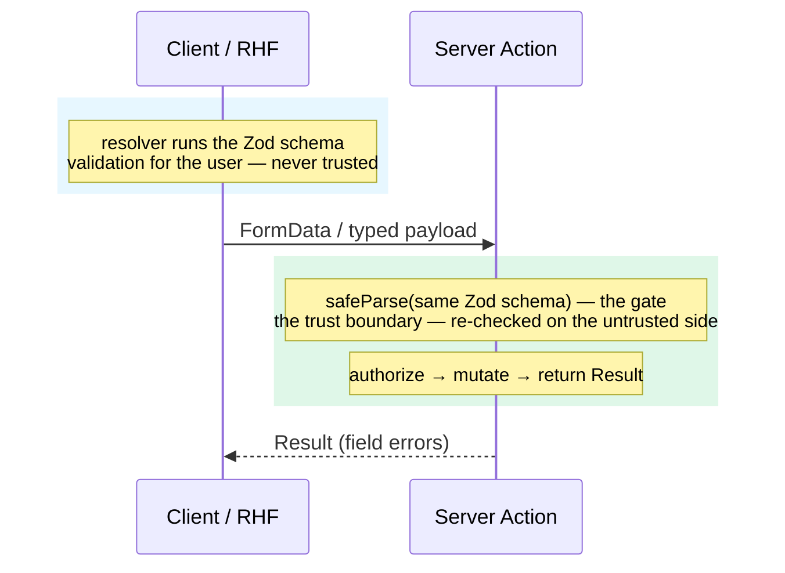

import { Card, CardGrid } from '@astrojs/starlight/components';
import Figure from '../../../components/figures/Figure.astro';
import Term from '../../../components/ui/Term.astro';
import ExternalResource from '../../../components/ui/ExternalResource.astro';
import StateMachineWalker from '../../../components/figures/state-machine-walker/StateMachineWalker.astro';
import Question from '../../../components/figures/state-machine-walker/Question.astro';
import Branch from '../../../components/figures/state-machine-walker/Branch.astro';
import Leaf from '../../../components/figures/state-machine-walker/Leaf.astro';
import CodeVariants from '../../../components/code/code-variants/CodeVariants.astro';
import CodeVariant from '../../../components/code/code-variants/CodeVariant.astro';
import MultipleChoice from '../../../components/exercises/multiple-choice/MultipleChoice.astro';
import McqChoice from '../../../components/exercises/multiple-choice/McqChoice.astro';
import McqWhy from '../../../components/exercises/multiple-choice/McqWhy.astro';
import Buckets from '../../../components/exercises/buckets/Buckets.astro';
import Bucket from '../../../components/exercises/buckets/Bucket.astro';
import Item from '../../../components/exercises/buckets/Item.astro';
import CourseProgressBar from '../../../components/ui/CourseProgressBar.astro';

<CourseProgressBar value={frontmatter['course-progress']} />

In the last chapter you built the form pattern a 2026 SaaS reaches for by default: a native `<form action={serverAction}>`, uncontrolled inputs identified by their `name`, `useActionState` to read the result, and the Constraint Validation API for cheap checks before the form is sent. That pattern covers most of the CRUD a SaaS will ever ship, and it should be your reflex — you write it first, every time. So this chapter is not "here is a better way to do forms." It's the opposite: four specific shapes of form break the native pattern, and when one of them shows up, the experienced reach is <Term definition="A client-side library that manages a form's field state, validation, and submit. Commonly abbreviated RHF.">React Hook Form</Term> — a battle-tested, conditional power tool, not a replacement for the default. By the end of this short lesson you'll be able to look at any form spec and decide, in a single pass, native or RHF.

## The default holds until something breaks it

It's worth being precise about *why* the native pattern is the default, because that's what tells you when it stops being one. Its value is low coordination cost and <Term definition="A form that submits and works even before — or without — JavaScript has loaded.">progressive enhancement</Term>: the DOM owns the live value of each field, the platform validates on submit, the Server Action owns the mutation, and the whole thing works with the JavaScript bundle still in flight. Nothing in your code is keeping a second copy of what the user typed. That's a lot of correctness you get for free.

So a large set of forms is native forever. Login. Signup. Create-invoice, when it's a single fixed set of fields. Edit-profile. A comment box. These are text inputs and checkboxes that submit once and then either succeed or come back with field errors — and the platform already does every part of that. Reaching for a form library here doesn't buy you anything; it costs you the two things above. The project at the end of this chapter is deliberately written with the native pattern for exactly this reason — to keep the default in your hands.

:::note
The question is never "should I use a form library?" If you find yourself asking it abstractly, the answer is no. The only question is "has a trigger fired?" Until one does, the platform pattern wins on cost and on progressive enhancement, and you don't open the question at all.
:::

## The four triggers

There are exactly four shapes of form that flip the choice. Treat them as a checklist, not a spectrum — you don't weigh how "complex" a form feels, you check whether one of these four is present, and a single one is enough to justify the reach. Memorizing these four *is* the skill this lesson installs; everything after this section just reinforces them.

### Validation timing past submit

Picture a signup form that shows "that email isn't valid" the moment the user clicks away from the email field, and a password box with a live strength meter that fills as they type. The native break is one you can name exactly: the Constraint Validation API fires on submit, and the Server Action parses the moment it receives the data. Both of those run only *after* the user has finished the whole form. The instant the design asks for feedback per field — on blur, or on every keystroke — you'd be bolting hand-written `onBlur` handlers, per-field client schemas, and `ref` reads onto a pattern whose entire point was that the DOM owned the value and you didn't have to. RHF gives this through one setting: its `mode` (`'onBlur'`, `'onChange'`, `'onTouched'`) decides *when* validation runs, and the resolver decides what counts as valid. You'll wire `mode` in the next lesson and the resolver in the one after.

### Dynamic field arrays

Now picture an invoice with a variable number of line items — the user adds a row, removes one, reorders them — or a survey where questions can be added and dropped, or a permissions matrix with a control on every row. The native pattern stores fields in a flat `FormData`, so a list forces you into array-index names like `lineItems[0].amount`, walking those keys back out after `Object.fromEntries`, and keeping a parallel `useState` array of IDs just to drive the add, remove, and reorder buttons. That bookkeeping grows with every interaction you add. RHF's `useFieldArray` owns the array's identity tracking and the re-render coordination for you — it's the subject of its own lesson later in this chapter.

### Multi-step wizards across many components

Picture a five-step onboarding flow — company details, billing, plan, payment, confirm — where each step is its own component and the user can go back and edit an earlier one. The native pattern has no first-class home for state that has to span the component tree and survive moving between steps. You'd hoist the whole form's state into a parent `useState` or a context and prop-drill it down into every step component, then thread the changes back up. RHF's `FormProvider` and `useFormContext` carry a single form instance across the tree, so any step can read and write the shared form without prop-drilling. That's the final lesson of this chapter.

### Controlled UI library inputs

Picture the inputs a real SaaS form is actually full of: shadcn's `Combobox`, a `Select`, a date picker, a rich-text editor. These are <Term definition="A component whose value is owned by React state and flows through value / onChange props, rather than being held in the DOM. The opposite of an uncontrolled input.">controlled components</Term> built on Radix — they own their value through `value`/`onChange` props and never render a native `<input name=...>`, which means there's nothing for `FormData` to pick up on submit. The native pattern simply can't see them. RHF's `Controller` (or the `useController` hook) bridges a controlled child into the form's state, so a combobox participates in validation and submit exactly like a plain input. You met the controlled-versus-uncontrolled distinction back in the React chapters; it's the crux of this trigger, which is why it's worth re-anchoring here.

That's the whole threshold. Carry it as one line:

:::tip
Reach for React Hook Form when **(a)** the form needs validation timing other than on-submit, **(b)** the field shape is dynamic, **(c)** the form spans steps with persistent state, or **(d)** controlled UI-library inputs must participate in form state. Otherwise, the native pattern.
:::

## Walk the decision yourself

Reading the four triggers is one thing; running the decision is another. The point of the walk below isn't any single verdict at the bottom — it's the *order* you ask the questions in. Start at the top and pick the honest answer for a form you have in mind. Any one "Yes" ends the walk at RHF; only a form that answers "No" to all four stays native.

<StateMachineWalker>
  <Question id="timing" prompt="Does the form need per-field validation before submit — on blur, or as the user types?">
    <Branch label="Yes — show errors per field" to="leaf-timing" />
    <Branch label="No — validate on submit" to="arrays" />
  </Question>

  <Question id="arrays" prompt="Does the set of fields grow or shrink at runtime — add / remove / reorder rows?">
    <Branch label="Yes — a dynamic list" to="leaf-arrays" />
    <Branch label="No — a fixed set of fields" to="wizard" />
  </Question>

  <Question id="wizard" prompt="Does the form span multiple steps with state that persists across them?">
    <Branch label="Yes — a multi-step wizard" to="leaf-wizard" />
    <Branch label="No — one step" to="controlled" />
  </Question>

  <Question id="controlled" prompt="Does the form include controlled UI-library inputs (combobox, date picker) that must validate as part of the form?">
    <Branch label="Yes — controlled inputs" to="leaf-controlled" />
    <Branch label="No — native inputs only" to="leaf-native" />
  </Question>

  <Leaf id="leaf-timing" verdict="Reach for RHF">
    RHF's `mode` setting plus the Zod resolver give per-field, per-blur, and per-keystroke validation without hand-written handlers. Coming up in the next two lessons.
  </Leaf>

  <Leaf id="leaf-arrays" verdict="Reach for RHF — useFieldArray">
    `useFieldArray` owns the add / remove / reorder bookkeeping and the per-row error tracking. Its own lesson later in this chapter.
  </Leaf>

  <Leaf id="leaf-wizard" verdict="Reach for RHF — FormProvider">
    `FormProvider` carries one form instance across every step's component without prop-drilling. The chapter's final lesson.
  </Leaf>

  <Leaf id="leaf-controlled" verdict="Reach for RHF — Controller">
    `Controller` bridges a controlled input into the form's state so it validates and submits like any field. The next lesson.
  </Leaf>

  <Leaf id="leaf-native" verdict="Stay native">
    No trigger fired, so the platform pattern from the last chapter wins on the two things that matter here: lower coordination cost and progressive enhancement. This is the default.
  </Leaf>
</StateMachineWalker>

Notice the shape of that walk: any *single* "Yes" sent you straight to RHF, and only the form that said "No" four times in a row reached the native leaf. That's the proof that the threshold is a disjunction — an OR, not a checklist where every box has to be ticked. One trigger is enough.

## What adopting RHF actually costs

If you read the four triggers as "RHF is just the better form library," you'll reach for it on forms that don't need it — the single most common mistake people make with it. So here is the honest accounting. Four concrete things change when a form moves to RHF.

**The form is already a Client Component.** This one isn't a new cost — `'use client'` was already true for the native form in the last chapter, because `useActionState` is a hook. Worth naming only so you can cross it off the list.

**The inputs become controlled, or RHF-managed.** RHF wires `value`/`onChange` (or, on its fast path, a `ref`) onto each input, so the DOM is no longer the sole owner of the live value. The mechanics are the next lesson; the point here is just that the ownership shifts.

**The submit changes hands.** This is the important one, and it's the change every later lesson builds on. The `action` prop goes away. RHF has to intercept the submit so it can run client-side validation *first*, and only then call your Server Action — as a plain function, from inside its own handler. Here is the whole change at the submit seam:

<CodeVariants>
  <CodeVariant label="Native (last chapter)">
    <div data-mark-color="green">

    ```tsx "action={createInvoice}"
    <form action={createInvoice}>
      {/* uncontrolled inputs, identified by name */}
    </form>
    ```

    </div>
    **The platform owns the submit.** The browser POSTs the form straight to the Server Action, which parses the `FormData` on arrival — no client code runs in between.
  </CodeVariant>

  <CodeVariant label="RHF">
    <div data-mark-color="green">

    ```tsx "onSubmit={form.handleSubmit(onSubmit)}"
    const onSubmit = async (values: InvoiceInput) => {
      const result = await createInvoice(values);
      // map result.error.fieldErrors back into the form
    };

    <form onSubmit={form.handleSubmit(onSubmit)}>{/* fields */}</form>
    ```

    </div>
    **RHF owns the submit.** It intercepts, runs the client-side validation, and only then calls the *same* `createInvoice` action from inside `onSubmit`. The action itself is unchanged — RHF just decides when it runs.
  </CodeVariant>
</CodeVariants>

The action on the right is the identical function from the last chapter. RHF didn't replace it; it slotted a validation step in front of it.

**Progressive enhancement degrades.** RHF needs its JavaScript bundle to do anything — so the no-JS submit no longer validates on the client, and for a true no-JS user the interactive feedback is gone. This is the real cost, and the experienced call is to accept it *because the forms that trip a trigger aren't the forms a no-JS user is on.* Wizards, configurators, dynamic line-item arrays — these live behind a login, on JavaScript-on surfaces. But flip it around: for a public, marketing, or legally-required form where progressive enhancement is non-negotiable, that math doesn't hold, and RHF is the wrong reach. Hold that thought — there's a tool for exactly that case, and we'll name it below.

None of these four touches the server. That's the part people get wrong, so it gets its own section.

## The seam to the server is untouched

Here is the mental model to carry out of this chapter, because it recurs in every lesson and it's the one beginners get backwards: adopting RHF does **not** move the trust boundary. The Server Action still parses on entry with `safeParse`, still authorizes, still mutates inside a transaction, still returns the canonical `Result`, still revalidates — the exact five-seam shape from the Server Actions chapter, completely unchanged. RHF runs the *same* Zod schema on the client to drive the inline error UX, but that client run is a convenience for the user, not a fact the server is allowed to believe. The schema is the source of truth, the action's `safeParse` is the gate, and RHF is one renderer sitting in front of it.

State it flatly so it sticks: **any architecture that validates only in RHF and skips the action's `safeParse` has the wrong trust boundary.** A browser can be scripted, the network can be replayed, and the client bundle can be edited in DevTools — so anything the client says has to be re-checked before the system acts on it. The wiring that lets one schema feed both sides is the subject of the resolver lesson; for now, just hold the boundary.

The diagram below makes the boundary spatial. Read it top to bottom: the client lane runs the Zod schema to validate for the user, sends the data across, and the server lane runs the *same* schema's `safeParse` as the real gate before it does anything. The gap between the two lanes is the boundary — everything that crosses it gets re-checked.

<Figure caption="The trust line is the wire. Client-side validation is for the user; server-side validation is for the system. The same schema runs on both sides, but only the server's run is trusted.">

</Figure>

The word doing the work there is <Term definition="The line past which data from a less-trusted zone — here, the browser — must be re-validated before the system acts on it.">trust boundary</Term>: client-side validation is for the person filling in the form, server-side validation is for the system, and they are not interchangeable.

## The 2026 form-library landscape

One last thing an experienced engineer does before committing to a tool: know what they're choosing it *against*. RHF wasn't picked in a vacuum — it won against two real alternatives, each of which is the better choice on a specific axis. Naming them keeps the decision honest and stops you from later assuming RHF is the only option.

<CardGrid>
  <Card title="React Hook Form" icon="approve-check-circle">
    The course's reach once a trigger fires. Battle-tested and fast — it keeps inputs uncontrolled by default and uses a subscription model, so a registered input doesn't re-render the whole form on every keystroke. It has the largest ecosystem of resolvers and adapters and a documented integration with shadcn's `<Form>` primitives. This is the default the rest of the chapter teaches.
  </Card>
  <Card title="Conform" icon="rocket">
    Optimizes for progressive enhancement on top of Server Actions: the same Zod schema validates on the client and the server, and the action receives `FormData` directly — so the form still works without JavaScript. The right reach when PE is non-negotiable past simple CRUD: legally-required forms, or public marketing forms with real validation. This is the tool for the forms where RHF's PE loss is unacceptable. Out of scope for this chapter.
  </Card>
  <Card title="TanStack Form" icon="setting">
    The smallest bundle and the strongest TypeScript inference, with per-validator timing. The right reach for form-heavy products — config UIs, dashboards — where the type system pays for itself across dozens of forms. Out of scope for this chapter.
  </Card>
</CardGrid>

So the reflex, one line: **native pattern by default, React Hook Form when a trigger fires.** The other two earn their weight on axes — progressive enhancement, bundle size, type inference — that simply don't dominate most of the forms a SaaS ships.

## Check your threshold

Two quick checks while the threshold is fresh. The first targets the one idea you can't afford to get wrong; the second asks you to actually run the decision.

Start with the trust boundary.

<MultipleChoice>
  A team validates a signup form with React Hook Form and the Zod resolver, then ships it. To save a redundant check, their Server Action skips its own `safeParse` — "the client already validated the data." What's wrong with this?

  <McqChoice correct>The client's validation can be bypassed or replayed, so the server is acting on input it never actually checked — the real gate is gone.</McqChoice>
  <McqChoice>Nothing — because the same Zod schema runs in both places, the server check would be redundant.</McqChoice>
  <McqChoice>Nothing — RHF automatically re-runs the schema on the server as part of `handleSubmit`.</McqChoice>
  <McqChoice>The form should use a separate, stricter schema on the server than the one the resolver uses on the client.</McqChoice>

  <McqWhy>The resolver is a UX convenience that runs in a browser the user controls — DevTools, a scripted request, or a replayed payload all skip it. The server's `safeParse` is the only validation the system is allowed to trust, so it can never be removed. (And the schema should be the *same* one on both sides, not a separate one — that's the next lessons' discipline.)</McqWhy>
</MultipleChoice>

Now sort the specs. Each chip is a form; drop it in "Stay native" if no trigger fires, or "Reach for RHF" if one does.

<Buckets twoCol instructions="Sort each form spec by whether a trigger fires. If none does, it stays native.">
  <Bucket name="native" label="Stay native" description="No trigger fires — the platform pattern" />
  <Bucket name="rhf" label="Reach for RHF" description="A trigger fires" />

  <Item bucket="native">Login form: email and password, submit once</Item>
  <Item bucket="native">Edit profile: name, bio, avatar URL, save</Item>
  <Item bucket="native">Comment box: one textarea, post</Item>
  <Item bucket="native">Create-invoice with exactly one client and one amount</Item>

  <Item bucket="rhf">Onboarding: 5 steps, back-navigation, edit prior steps</Item>
  <Item bucket="rhf">Invoice with add / remove line items</Item>
  <Item bucket="rhf">Signup with a live password-strength meter</Item>
  <Item bucket="rhf">Booking form with a date picker and a searchable client combobox</Item>
</Buckets>

## External resources

The lesson's whole job is the choice between the native pattern and a library — so the resources worth your time are the ones that let you see the other side of the trade and the two alternatives this chapter only names in passing. The next lessons teach React Hook Form properly, so the docs link is a courtesy pointer for skimming ahead — not required reading.

<CardGrid>
  <ExternalResource
    title="React Hook Form — documentation"
    href="https://react-hook-form.com/get-started"
    icon="lucide:square-mouse-pointer"
    description="The official Get Started guide. The lessons ahead teach the parts you'll actually use."
  />
  <ExternalResource
    title="Best React Form Libraries (2026)"
    href="https://www.pkgpulse.com/guides/best-react-form-libraries-2026"
    icon="lucide:scale"
    iconColor="#8B5CF6"
    description="A side-by-side of RHF, Conform, and TanStack Form on the exact axes — performance, progressive enhancement, type inference — this lesson decides on."
  />
  <ExternalResource
    title="Conform — Overview"
    href="https://conform.guide/"
    icon="lucide:file-check-2"
    iconColor="#22C55E"
    description="The progressive-enhancement-first library this lesson names for the forms where RHF's PE loss is unacceptable."
  />
  <ExternalResource
    title="TanStack Form — Comparison"
    href="https://tanstack.com/form/latest/docs/comparison"
    icon="simple-icons:tanstack"
    iconColor="#FF4154"
    description="TanStack's own feature-by-feature table against React Hook Form and the rest — useful for seeing where the type-inference reach pays off."
  />
</CardGrid>
