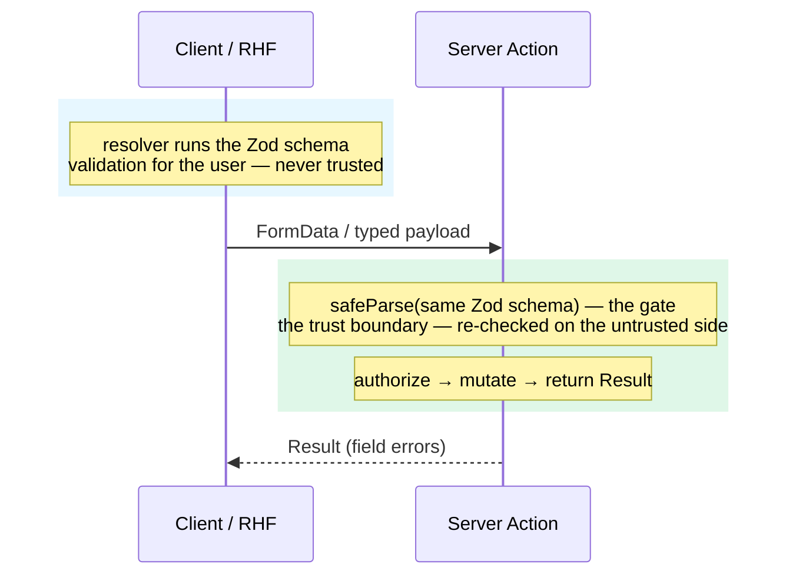

import { Card, CardGrid } from '@astrojs/starlight/components';
import Figure from '../../../components/figures/Figure.astro';
import Term from '../../../components/ui/Term.astro';
import ExternalResource from '../../../components/ui/ExternalResource.astro';
import StateMachineWalker from '../../../components/figures/state-machine-walker/StateMachineWalker.astro';
import Question from '../../../components/figures/state-machine-walker/Question.astro';
import Branch from '../../../components/figures/state-machine-walker/Branch.astro';
import Leaf from '../../../components/figures/state-machine-walker/Leaf.astro';
import CodeVariants from '../../../components/code/code-variants/CodeVariants.astro';
import CodeVariant from '../../../components/code/code-variants/CodeVariant.astro';
import MultipleChoice from '../../../components/exercises/multiple-choice/MultipleChoice.astro';
import McqChoice from '../../../components/exercises/multiple-choice/McqChoice.astro';
import McqWhy from '../../../components/exercises/multiple-choice/McqWhy.astro';
import Buckets from '../../../components/exercises/buckets/Buckets.astro';
import Bucket from '../../../components/exercises/buckets/Bucket.astro';
import Item from '../../../components/exercises/buckets/Item.astro';
import CourseProgressBar from '../../../components/ui/CourseProgressBar.astro';

<CourseProgressBar value={frontmatter['course-progress']} />

In the last chapter you built the form pattern a web app reaches for by default: a native `<form action={serverAction}>`, uncontrolled inputs keyed by `name`, `useActionState` to read the result, and the Constraint Validation API for pre-submit checks.
That pattern covers most CRUD you will ever ship, so write it first, every time.

Four specific form shapes break the native pattern, and when one shows up the tool to reach for is <Term definition="A client-side library that manages a form's field state, validation, and submit. Commonly abbreviated RHF.">React Hook Form</Term>: a well-tested fit for those cases, not a replacement for the default.
By the end you'll read any form spec and decide native or RHF in one pass.

## Why the native pattern is the default

Knowing why the native pattern is the default tells you when it stops being one.
Its value is low coordination cost and <Term definition="A form that submits and works even before, or without, JavaScript has loaded.">progressive enhancement</Term>: the DOM owns each field's live value, the platform validates on submit, the Server Action owns the mutation, and the form works before the JavaScript bundle loads.
Your code keeps no second copy of what the user typed.

So a large class of forms stays native forever: login, signup, edit-profile, a comment box, create-invoice with a fixed set of fields.
These are text inputs and checkboxes that submit once and either succeed or return field errors, all of which the platform handles.
A form library here buys nothing and costs you both of those.

:::note
The question is never "should I use a form library?"
In the abstract, the answer is always no.
The only question is "has a trigger fired?"
Until one does, the platform pattern wins on cost and progressive enhancement.
:::

## The four triggers

Four shapes of form flip the choice.
Treat them as a checklist, not a spectrum: any one of the four is enough to justify the reach.

### Validation timing past submit

Picture a signup form that flags an invalid email the moment the user leaves the field, before they submit.
The native pattern can't: the Constraint Validation API fires on submit, and the Server Action parses only once it has the data, so both run *after* the user finishes.
Asking for per-field feedback on blur or on keystroke means bolting hand-written `onBlur` handlers, client schemas, and `ref` reads onto a pattern built so the DOM owns the value.
RHF's `mode` (`'onBlur'`, `'onChange'`, `'onTouched'`) decides *when* validation runs (next lesson).

### Dynamic field arrays

Picture an invoice with a variable number of line items, where the user adds, removes, and reorders rows.
The native pattern stores fields in a flat `FormData`, so a list forces array-index names like `lineItems[0].amount`, parsing those keys back out after `Object.fromEntries`, plus a parallel `useState` array of IDs to drive the buttons.
That bookkeeping grows with every interaction.
RHF's `useFieldArray` owns the array's identity tracking and re-render coordination (later this chapter).

### Multi-step wizards across many components

Picture a five-step onboarding flow (company details, billing, plan, payment, confirm) where each step is its own component and the user can go back to edit an earlier one.
The native pattern has no home for state that spans the component tree and survives moving between steps.
You'd hoist the whole form into a parent `useState` or a context, prop-drill it into every step, then thread changes back up.
RHF's `FormProvider` and `useFormContext` carry one form instance across the tree, so any step reads and writes it without prop-drilling (the chapter's final lesson).

### Controlled UI library inputs

Picture the inputs a real SaaS form is full of: shadcn's `Combobox`, a `Select`, a date picker, a rich-text editor.
These are <Term definition="A component whose value is owned by React state and flows through value / onChange props, rather than being held in the DOM. The opposite of an uncontrolled input.">controlled components</Term> built on Radix; they own their value through `value`/`onChange` and never render a native `<input name=...>`, so `FormData` has nothing to collect on submit.
The native pattern can't see them.
RHF's `Controller` (or the `useController` hook) bridges a controlled child into form state, so a combobox validates and submits like a plain input.

The whole threshold fits on one line:

:::tip
Reach for React Hook Form when **(a)** the form needs validation timing other than on-submit, **(b)** the field shape is dynamic, **(c)** the form spans steps with persistent state, or **(d)** controlled UI-library inputs must participate in form state. Otherwise, the native pattern.
:::

## Walk the decision yourself

What matters here isn't the verdict at the bottom, it's the *order* of the questions.
Pick a form you have in mind and answer each one from the top.

<StateMachineWalker>
  <Question id="timing" prompt="Does the form need per-field validation before submit — on blur, or as the user types?">
    <Branch label="Yes — show errors per field" to="leaf-timing" />
    <Branch label="No — validate on submit" to="arrays" />
  </Question>

  <Question id="arrays" prompt="Does the set of fields grow or shrink at runtime — add / remove / reorder rows?">
    <Branch label="Yes — a dynamic list" to="leaf-arrays" />
    <Branch label="No — a fixed set of fields" to="wizard" />
  </Question>

  <Question id="wizard" prompt="Does the form span multiple steps with state that persists across them?">
    <Branch label="Yes — a multi-step wizard" to="leaf-wizard" />
    <Branch label="No — one step" to="controlled" />
  </Question>

  <Question id="controlled" prompt="Does the form include controlled UI-library inputs (combobox, date picker) that must validate as part of the form?">
    <Branch label="Yes — controlled inputs" to="leaf-controlled" />
    <Branch label="No — native inputs only" to="leaf-native" />
  </Question>

  <Leaf id="leaf-timing" verdict="Reach for RHF">
    RHF's `mode` setting plus the Zod resolver give per-field, per-blur, and per-keystroke validation without hand-written handlers. The next two lessons cover both.
  </Leaf>

  <Leaf id="leaf-arrays" verdict="Reach for RHF — useFieldArray">
    `useFieldArray` owns the add / remove / reorder bookkeeping and per-row error tracking. Its own lesson comes later in this chapter.
  </Leaf>

  <Leaf id="leaf-wizard" verdict="Reach for RHF — FormProvider">
    `FormProvider` carries one form instance across every step without prop-drilling. It's the chapter's final lesson.
  </Leaf>

  <Leaf id="leaf-controlled" verdict="Reach for RHF — Controller">
    `Controller` bridges a controlled input into the form's state so it validates and submits like any field. That's the next lesson.
  </Leaf>

  <Leaf id="leaf-native" verdict="Stay native">
    No trigger fired, so the platform pattern from the last chapter wins on the two things that matter: lower coordination cost and progressive enhancement. This is the default.
  </Leaf>
</StateMachineWalker>

A single "Yes" sends you straight to RHF; only four "No"s in a row reach the native leaf.
The threshold is an OR, not a checklist: one trigger is enough.

## What adopting RHF actually costs

Read the four triggers as "RHF is just the better form library" and you'll reach for it on forms that don't need it, the most common mistake people make.
So here's the honest accounting: four concrete things change when a form moves to RHF.

**The form is already a Client Component.**
Not a new cost.
`'use client'` was already true for the native form last chapter, because `useActionState` is a hook.
Named only to cross it off.

**The inputs become controlled, or RHF-managed.**
RHF wires `value`/`onChange` (or, on its fast path, a `ref`) onto each input, so the DOM no longer solely owns the live value.
The mechanics come next lesson; the point here is just that ownership shifts.

**The submit changes hands.**
This is the important one, the change every later lesson builds on.
The `action` prop goes away.
RHF intercepts the submit to run client-side validation *first*, then calls your Server Action, as a plain function, from inside its own handler.
Here is the whole change at the submit seam:

<CodeVariants>
  <CodeVariant label="Native (last chapter)">
    <div data-mark-color="green">

    ```tsx "action={createInvoice}"
    <form action={createInvoice}>
      {/* uncontrolled inputs, identified by name */}
    </form>
    ```

    </div>
    **The platform owns the submit.** The browser POSTs the form straight to the Server Action, which parses the `FormData` on arrival, with no client code running in between.
  </CodeVariant>

  <CodeVariant label="RHF">
    <div data-mark-color="green">

    ```tsx "onSubmit={form.handleSubmit(onSubmit)}"
    const onSubmit = async (values: InvoiceInput) => {
      const result = await createInvoice(values);
      // map result.error.fieldErrors back into the form
    };

    <form onSubmit={form.handleSubmit(onSubmit)}>{/* fields */}</form>
    ```

    </div>
    **RHF owns the submit.** It intercepts, runs client-side validation, and only then calls the *same* `createInvoice` action from inside `onSubmit`. The action is unchanged; RHF just decides when it runs.
  </CodeVariant>
</CodeVariants>

The action on the right is the identical function from last chapter.
RHF didn't replace it; it slotted a validation step in front of it.

**Progressive enhancement degrades.**
RHF needs its JavaScript bundle to do anything, so a true no-JS user loses client validation and interactive feedback.
That's the real cost, and the call is to accept it: the forms that trip a trigger aren't the forms a no-JS user is on.
Wizards, configurators, and dynamic line-item arrays live behind a login, on JavaScript-on surfaces.
The reverse is the warning: for a public, marketing, or legally-required form where progressive enhancement is non-negotiable, the math flips and RHF is the wrong reach.
There's a tool for exactly that case, named below.

None of these four changes touches the server.
That's the part people get wrong, so it gets its own section.

## Adopting RHF does not move the trust boundary

Adopting RHF does **not** move the <Term definition="The line past which data from a less-trusted zone, here the browser, must be re-validated before the system acts on it.">trust boundary</Term>.
The Server Action still parses on entry with `safeParse`, authorizes, mutates inside a transaction, returns the canonical `Result`, and revalidates: the exact five-seam shape from the Server Actions chapter, unchanged.
RHF runs the *same* Zod schema on the client to drive the inline error UX, but that run is a convenience for the user, not a fact the server may believe.
The schema is the source of truth, the action's `safeParse` is the gate, and RHF is one renderer in front of it.

Any architecture that validates only in RHF and skips the action's `safeParse` puts the boundary in the wrong place.
A browser can be scripted, the network replayed, and the client bundle edited in DevTools, so anything the client says must be re-checked before the system acts on it.
Wiring one schema into both sides is the resolver lesson; for now, just hold the boundary.

<Figure caption="The same schema runs on both sides, but only the server's run is trusted.">

</Figure>

## RHF versus Conform and TanStack Form

Before committing, know what you're choosing RHF against: two real alternatives, each better on one axis.

<CardGrid>
  <Card title="React Hook Form" icon="approve-check-circle">
    The course's reach once a trigger fires, and the default the rest of the chapter teaches.
    It's well-tested and fast: inputs stay uncontrolled by default, and a subscription model keeps a keystroke from re-rendering the whole form.
    It also has the largest ecosystem of resolvers and adapters and a documented integration with shadcn's `<Form>` primitives.
  </Card>
  <Card title="Conform" icon="rocket">
    Optimizes for progressive enhancement on top of Server Actions: one Zod schema validates on both sides, and the action receives `FormData` directly, so the form still works without JavaScript.
    The right reach when progressive enhancement is non-negotiable past simple CRUD, such as legally-required or public marketing forms with real validation.
    Out of scope here.
  </Card>
  <Card title="TanStack Form" icon="setting">
    The smallest bundle and the strongest TypeScript inference, with per-validator timing.
    The right reach for form-heavy products like config UIs and dashboards, where the type system pays for itself across dozens of forms.
    Out of scope here.
  </Card>
</CardGrid>

The reflex, in one line: **native pattern by default, React Hook Form when a trigger fires.**
The other two win on progressive enhancement, bundle size, and type inference, axes that don't dominate most forms a web app ships.

## Check your threshold

First the idea you can't afford to get wrong, then the call itself.

Start with the trust boundary.

<MultipleChoice>
  A team validates a signup form with React Hook Form and the Zod resolver, then ships it. To save a redundant check, their Server Action skips its own `safeParse` — "the client already validated the data." What's wrong with this?

  <McqChoice correct>The client's validation can be bypassed or replayed, so the server is acting on input it never actually checked — the real gate is gone.</McqChoice>
  <McqChoice>Nothing — because the same Zod schema runs in both places, the server check would be redundant.</McqChoice>
  <McqChoice>Nothing — RHF automatically re-runs the schema on the server as part of `handleSubmit`.</McqChoice>
  <McqChoice>The form should use a separate, stricter schema on the server than the one the resolver uses on the client.</McqChoice>

  <McqWhy>The resolver is a UX convenience that runs in a browser the user controls — DevTools, a scripted request, or a replayed payload all skip it. The server's `safeParse` is the only validation the system is allowed to trust, so it can never be removed. (And the schema should be the *same* one on both sides, not a separate one — that's the next lessons' discipline.)</McqWhy>
</MultipleChoice>

Now sort the specs by whether any trigger fires.

<Buckets twoCol instructions="Sort each form spec by whether a trigger fires. If none does, it stays native.">
  <Bucket name="native" label="Stay native" description="No trigger fires — the platform pattern" />
  <Bucket name="rhf" label="Reach for RHF" description="A trigger fires" />

  <Item bucket="native">Login form: email and password, submit once</Item>
  <Item bucket="native">Edit profile: name, bio, avatar URL, save</Item>
  <Item bucket="native">Comment box: one textarea, post</Item>
  <Item bucket="native">Create-invoice with exactly one client and one amount</Item>

  <Item bucket="rhf">Onboarding: 5 steps, back-navigation, edit prior steps</Item>
  <Item bucket="rhf">Invoice with add / remove line items</Item>
  <Item bucket="rhf">Signup with a live password-strength meter</Item>
  <Item bucket="rhf">Booking form with a date picker and a searchable client combobox</Item>
</Buckets>

## External resources

These let you see the other side of the native-versus-library trade and the two alternatives this chapter only names in passing.

<CardGrid>
  <ExternalResource
    title="React Hook Form — documentation"
    href="https://react-hook-form.com/get-started"
    icon="lucide:square-mouse-pointer"
    description="The official Get Started guide. The lessons ahead teach the parts you'll actually use."
  />
  <ExternalResource
    title="Best React Form Libraries (2026)"
    href="https://www.pkgpulse.com/guides/best-react-form-libraries-2026"
    icon="lucide:scale"
    iconColor="#8B5CF6"
    description="A side-by-side of RHF, Conform, and TanStack Form on the exact axes — performance, progressive enhancement, type inference — this lesson decides on."
  />
  <ExternalResource
    title="Conform — Overview"
    href="https://conform.guide/"
    icon="lucide:file-check-2"
    iconColor="#22C55E"
    description="The progressive-enhancement-first library this lesson names for the forms where RHF's PE loss is unacceptable."
  />
  <ExternalResource
    title="TanStack Form — Comparison"
    href="https://tanstack.com/form/latest/docs/comparison"
    icon="simple-icons:tanstack"
    iconColor="#FF4154"
    description="TanStack's own feature-by-feature table against React Hook Form and the rest — useful for seeing where the type-inference reach pays off."
  />
</CardGrid>
