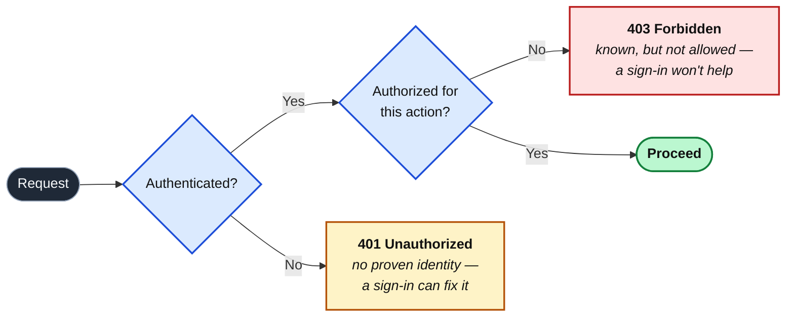

import Figure from '../../../components/figures/Figure.astro';
import { Card, CardGrid } from '@astrojs/starlight/components';
import Buckets from '../../../components/exercises/buckets/Buckets.astro';
import Bucket from '../../../components/exercises/buckets/Bucket.astro';
import Item from '../../../components/exercises/buckets/Item.astro';
import MultipleChoice from '../../../components/exercises/multiple-choice/MultipleChoice.astro';
import McqChoice from '../../../components/exercises/multiple-choice/McqChoice.astro';
import McqWhy from '../../../components/exercises/multiple-choice/McqWhy.astro';
import ExternalResource from '../../../components/ui/ExternalResource.astro';
import VideoCallout from '../../../components/embeds/VideoCallout.astro';
import Term from '../../../components/ui/Term.astro';
import CourseProgressBar from '../../../components/ui/CourseProgressBar.astro';
import ClaimProofPermissionStrip from '../../../components/lessons/051/1/ClaimProofPermissionStrip.astro';

<CourseProgressBar value={frontmatter['course-progress']} />

A user signs in on your sign-in page: email, password, **Sign in**, and the page redirects them to a dashboard with their name in the corner. Then they click **Delete this invoice**, and the request comes back `403 Forbidden`.

They *are* signed in. So what happened?

That gap, signed in but not allowed, is the split between two questions every request answers. Signing in passed one; deleting the invoice failed the other, and failed it with a `403` rather than a `401`.

You have met both questions already. In Server Actions, your `Result` type carried two error codes, `'unauthorized'` and `'forbidden'`, that you used without dwelling on the difference. They are not interchangeable.

## Authentication: proving who a request is from

A protected request first has to answer: **who is sending this?** That is <Term definition="Verifying the identity behind a request and producing a verified principal — a known user the request runs as.">authentication</Term>, or authn. The system takes proof from the user, checks it, and on success produces a <Term definition="The authenticated identity a request runs as — concretely, a user row the system has verified.">principal</Term> — in your app, just a user row:

```ts
type Principal = { userId: string; email: string };
```

**Authentication is binary.** The system either knows who you are or treats you as a stranger; there is no "70% authenticated."

**The proof comes in one of three forms.** These are the three <Term definition="A category of proof of identity: something you know, something you have, or something you are.">authentication factors</Term>: something you *know*, like a password; something you *have*, like a device holding a <Term definition="A device-bound credential that signs a server challenge with a private key the device never reveals; replaces passwords.">passkey</Term> or an app generating a one-time code; something you *are*, like a fingerprint. A biometric never reaches your server: the fingerprint unlocks a passkey on the device, and the device proves possession, so "something you are" is really a gesture that unlocks "something you have."

**The credential is protected at rest.** The system never stores a password, only a hash from a slow, salted, one-way function (Argon2id or bcrypt). One-way means you can check a password against the hash but can't recover the password from it, so a leaked database is not a leaked list of passwords: **hashed, salted, slow, one-way, never plaintext, never reversibly encrypted.**

The proof happens *once*, at sign-in; you can't ask for a password on every click, so a session carries the proven identity forward, the subject of the next lesson. The system now knows *who* a request is from, which raises the second question, the one that produced our `403`.

## Authorization: deciding what a principal may do

Knowing *who* someone is tells you nothing about *what they may do*. That second question is <Term definition="Deciding whether an authenticated principal may perform a specific action on a specific resource, per the applicable rules.">authorization</Term>, or authz: given a principal the system has already authenticated, may *this* principal perform *this* action on *this* resource?

It weighs four inputs and returns one of two answers, allow or deny:

- **The principal**: the verified user authentication just handed us.
- **The action**: what they're trying to do, such as read an invoice, delete an invoice, or invite a teammate.
- **The <Term definition="The specific thing an action targets — this invoice, this organization, this row — not a category of thing.">resource</Term>**: *this specific* invoice, in *this specific* organization.
- **The rules**: what governs the decision, such as the user's role, whether they own the resource, their plan tier, or a feature flag.

Here is the property that sets authorization apart from authentication. **Authorization is not binary.** It is evaluated per-action, per-resource, *every single time*. A user authorized to *read* invoice A may not be authorized to *delete* it, nor to touch invoice B at all, because B belongs to a different organization. There is no single "this user is authorized" bit the way there is a "this user is authenticated" one; every protected action asks the question again.

That resolves our opening mystery. The dashboard loaded because reading it was authorized; the delete failed because deleting *that invoice* was not. **Same user, same session, two different authorization decisions.** "Signed in" was never in doubt; it simply wasn't the question the delete button was asking.

An authorization check has roughly this shape, though it is not the real one you'll build later:

```ts title="Sketch — not the real wrapper (that's the RBAC chapter)"
declare function can(
  principal: Principal,
  action: string,
  resource: Invoice,
): boolean;
```

Swap `'read'` for `'delete'`, or one invoice for another, and `can` may return a different boolean. The full rule surface — roles, ownership, organization scoping, and the wrapper that enforces it on every mutation — comes later in the <Term definition="Role-Based Access Control: authorization driven by the principal's role rather than per-user rules.">RBAC</Term> chapter.

So *who are you?* is authentication, answered once; *may you do this?* is authorization, answered fresh for every action and resource. Keeping them apart is most of the work.

<VideoCallout videoId="DakSdpODf-U" videoTitle="Authentication vs Authorization explained in 3 minutes">
  A three-minute recap from Permit on the same two questions, *who are you?* versus *what are you allowed to do?*, if a second framing helps.
</VideoCallout>

There's a subtlety hiding inside the first question that experienced engineers keep straight and beginners almost always collapse.

## Identification, authentication, authorization

We've treated authentication as one step. It's really two, and the full picture has three layers:

- **<Term definition="An unverified claim of identity — asserting who you are, with no proof yet.">Identification</Term> is the claim:** *I am `ada@acme.com`.* Cheap, unverified, available to anyone. Typing an email into a form is identification; so is a username sitting in a URL.
- **Authentication is the proof:** the password matches the stored hash, or the passkey signs the server's challenge. Now evidence backs the claim.
- **Authorization is the permission** to act under the identity that's now been proven.

On a sign-in form these are three distinct moments: the email you type is identification, the password check is authentication, and the role lookup later, when you click delete, is authorization.

The layers stack: you can't authorize an identity you haven't authenticated, or authenticate a claim no one made.

<Figure caption="The layers stack: each rests on the one beneath it.">
  <ClaimProofPermissionStrip />
</Figure>

Almost every "auth bug" confuses two adjacent layers: an unverified email taken as proof (identification mistaken for authentication), or "signed in" taken as "allowed" (authentication mistaken for authorization). Sort the steps below to lock in the difference between a *claim*, a *proof*, and a *permission*.

<Buckets instructions="Sort each step into the concern it belongs to — a claim, a proof, or a permission.">
  <Bucket name="ident" label="Identification" description="An unverified claim of identity" />
  <Bucket name="authn" label="Authentication" description="Proof that backs the claim" />
  <Bucket name="authz" label="Authorization" description="Permission to act, once proven" />

  <Item bucket="ident">Typing your email into the login form</Item>
  <Item bucket="ident">A username sitting in the URL `/u/ada`</Item>
  <Item bucket="authn">The server checks your password hash matches</Item>
  <Item bucket="authn">The passkey on your phone signs the login challenge</Item>
  <Item bucket="authz">The handler checks your role is `admin` before deleting</Item>
  <Item bucket="authz">Looking up whether you own this invoice</Item>
</Buckets>

Both the password check and the passkey signature belong in Authentication, and "owning this invoice" in Authorization. Now let's place these checks in your app's files.

## Where each check runs

The two questions get answered at two different boundaries.

**Authentication lives at the session-read boundary**, wherever your code first reads the session to ask "who is this request from?" In Next.js that means `proxy.ts`, which gates protected routes before they render; layouts for surfaces that require a signed-in user; and Server Actions and route handlers reading the caller's identity per call.

**Authorization lives at the <Term definition="The server-side entry point of a mutation — the Server Action or route handler — where authorization is enforced.">action boundary</Term>**, the server-side entry point of a mutation that actually changes something. A wrapper around every mutation checks the caller's role and organization scope before the work runs. You'll build it later in the RBAC chapter; for now, just know where it sits.

| Boundary | Reads | Decides |
| --- | --- | --- |
| `proxy.ts` (middleware) | Is there a valid session? | Let the request reach the route, or redirect to sign-in (**authn gate**) |
| Layout / page | Is there a valid session? | Render the protected surface, or send to sign-in (**authn gate**) |
| Server Action / route handler | The principal + the action + the resource | Allow or deny this specific mutation (**authz gate**) |

The first two rows only ask whether *someone* is signed in; the real authorization decision happens in the last row, where the principal meets the specific action and resource.

:::caution
**Never put an authorization check inside a React component or a layout.**
:::

Two reasons. Layouts can be bypassed: under partial pre-rendering the framework may render parts of a page without re-running the layout, so a layout-level check guarantees nothing. And more fundamentally, a component that renders nothing for a forbidden user is a *user experience* affordance, not a *security* boundary; hiding the delete button is polite but stops nobody who sends the request directly. The security boundary is the mutation itself, on the server: **the button is UX, the action is security.**

Authentication runs first and establishes the principal, then authorization reads that principal and decides. That fixed order is what produces the two status codes from the opening scenario.

## Authentication first: 401 versus 403

Every protected request authenticates first, authorizes second: you must know *who* is calling before you can ask *what they may do*. That order produces two failure modes, each with its own status code.

**Authentication fails, so the response is `401`.** No identity is proven, whether because there's no session or because the session is invalid. The client *can* fix a `401` by signing in.

**Authorization fails, so the response is `403`.** The identity is proven; this principal just isn't allowed to do this. Signing in again *won't* help, because they're already signed in. They need someone to grant them access.

So one question decides it: *can a sign-in fix this?* If yes, it's a `401`. If they're already signed in and still can't, it's a `403`.

One wrinkle trips up everyone. The official HTTP name for `401` is "Unauthorized," which sounds like authorization, the second concept. It isn't: **`401` means *unauthenticated*** ("we don't know who you are") despite that name, and `403 Forbidden` is the one that means "we know you, and the answer is no."

A request hits the authentication gate first, then the authorization gate, and each gate has its own exit.

<Figure caption="Two gates in a fixed order. Fail the first and you get a 401; pass it but fail the second and you get a 403.">

</Figure>

Mixing the two up is a real bug, because the status code is a message to the client, your monitoring, and whoever's on call. Return a `403` when there's no session, and the client hides the one-click fix from a user who is simply logged out. Return a `401` when the session is fine but the role is wrong, and the client bounces an already-signed-in user back to a login page that changes nothing. The wrong code makes every layer downstream draw the wrong conclusion about what broke.

This closes the loop with code you've already written. Two of your `Result` type's error codes were `'unauthorized'` and `'forbidden'`, the same distinction one layer up:

<div data-mark-color="blue">

```ts title="src/lib/result.ts" {3-4}
type ErrorCode =
  | 'validation'
  | 'unauthorized'
  | 'forbidden'
  | 'conflict'
  | 'not_found'
  | 'rate_limited'
  | 'internal';
```

</div>

The mapping is one-to-one: `'unauthorized'` is the `401`, no proven identity, and `'forbidden'` is the `403`, identity proven but action refused. When you wrote `err('unauthorized', …)` versus `err('forbidden', …)` in the Server Actions chapter, you were already encoding this; now you have a name for it.

The next step is to make the diagnosis a reflex. For each scenario below, decide which status code the server should return. The test is always the same: *can the client fix this by signing in?*

<MultipleChoice>
  A visitor who has **never signed in** sends a request straight to your delete-invoice endpoint. What status code comes back?

  <McqChoice correct>`401` — sign in and the request could go through</McqChoice>
  <McqChoice>`403` — the answer is no, and signing in won't change it</McqChoice>
  <McqChoice>`404` — pretend the endpoint isn't there</McqChoice>

  <McqWhy>There's no session, so the server can't even tell *who* is asking — the principal is missing, not refused. Signing in is exactly the fix the visitor needs, which is the signature of a `401`. (Mind the misleading name: `401 Unauthorized` really means *unauthenticated*.)</McqWhy>
</MultipleChoice>

<MultipleChoice>
  A user is signed in with the `member` role and clicks a button that runs an `admin`-only action. What status code comes back?

  <McqChoice>`401` — they should sign in again</McqChoice>
  <McqChoice correct>`403` — they're known, just not permitted</McqChoice>
  <McqChoice>`400` — the request itself was malformed</McqChoice>

  <McqWhy>The session is valid and the principal is fully proven — the system knows exactly who this is. Re-signing-in changes nothing; only someone granting them the role would. Known but not allowed is the textbook `403`.</McqWhy>
</MultipleChoice>

<MultipleChoice>
  A signed-in user requests invoice `inv_42`, which exists — but it belongs to a **different organization**. What's the safest status code to return?

  <McqChoice>`403` — tell them the invoice exists but is off-limits</McqChoice>
  <McqChoice correct>`404` — don't reveal that the invoice exists at all</McqChoice>
  <McqChoice>`401` — bounce them back to sign in</McqChoice>

  <McqWhy>This is the deliberate twist. A `403` would quietly confirm that `inv_42` is real — just not theirs — which leaks one tenant's data to another. Masking cross-tenant access as `404` keeps other organizations' records invisible. It's the one place the clean `401`/`403` split bends, and you'll meet it again when you build organization scoping.</McqWhy>
</MultipleChoice>

## Three principal states: anonymous, authenticated, elevated

Authentication is binary for a single request: known, or not. But across the whole app a principal moves through three states your code handles differently.

- **Anonymous**: no session at all. Public pages, the marketing site, the sign-in form itself. There's nobody to authorize.
- **Authenticated**: a session is present, the identity is proven, and the principal has its baseline capabilities. The ordinary signed-in state.
- **Elevated**: the principal proved its identity again *recently*. Some actions, like changing a password or billing details, transferring ownership, or destructive admin work, demand fresh proof rather than a session opened three weeks ago and left running.

The third state is where the two concepts interact.

:::note
Elevation is **authentication triggered by an authorization policy.** The rule that says "prove yourself again" is authz; the re-prompt it fires is authn.
:::

The tooling names this state a <Term definition="A session whose most recent proof of identity is recent enough to clear high-stakes actions.">fresh session</Term>, with a setting for how recent "recent" must be. You'll build the re-authentication flow in a later chapter; for now, just know the state exists.

## Four sentences that ship auth bugs

Each distinction here maps to a specific bug: a sentence that *sounds* reasonable, confuses two of the three concepts, and ships a hole in the app. Naming the right concept is the fix.

<CardGrid>
  <Card title={`"They're signed in, so they can edit."`} icon="warning">
    Authentication mistaken for authorization. Every signed-in user can perform privileged actions, because a "logged in?" check stands in for "allowed?" with no per-resource, per-role gate. This is the exact gap behind the opening scenario.
  </Card>
  <Card title={`"Their email is in the database, so they're authenticated."`} icon="error">
    Identification mistaken for authentication, **and the most dangerous one here.** The bug lives in account-recovery flows: a password-reset link sent to an *unverified* email hands the account to anyone who typed that address. An email is a claim, not proof, and sending secrets to an unproven claim is how accounts get stolen.
  </Card>
  <Card title={`"They paid, so they're authorized."`} icon="warning">
    A billing entitlement mistaken for the whole authorization policy. The plan-tier check passes, so the gate opens, but role and organization scope still have to apply. A paying user is not automatically an admin of every organization they can see. Payment is one input to authz, not all of it.
  </Card>
  <Card title={`"Once they're authenticated, the session can do anything for 30 days."`} icon="warning">
    The elevation tier collapsed into the baseline. High-stakes actions, like a password change, an ownership transfer, or a billing edit, run on stale proof. A walked-away laptop with an open session becomes a full account takeover, because nothing demanded fresh authentication before the dangerous action.
  </Card>
</CardGrid>

Name the concept correctly and the boundary places itself: you stop writing "is the user logged in?" where you meant "is this user allowed to do this?"

## External resources

<CardGrid>
  <ExternalResource
    title="MDN — 401 Unauthorized"
    href="https://developer.mozilla.org/en-US/docs/Web/HTTP/Reference/Status/401"
    icon="simple-icons:mdnwebdocs"
    iconColor="#000000"
    description="The reference for the status code whose name says 'Unauthorized' but whose meaning is 'unauthenticated.'"
  />
  <ExternalResource
    title="MDN — 403 Forbidden"
    href="https://developer.mozilla.org/en-US/docs/Web/HTTP/Reference/Status/403"
    icon="simple-icons:mdnwebdocs"
    iconColor="#000000"
    description="Identity is known, the action is refused, and re-authenticating won't change the answer."
  />
  <ExternalResource
    title="OWASP — Authentication Cheat Sheet"
    href="https://cheatsheetseries.owasp.org/cheatsheets/Authentication_Cheat_Sheet.html"
    icon="simple-icons:owasp"
    iconColor="#000000"
    description="The authoritative checklist for proving identity safely: credential storage, recovery flows, and the misframes that leak accounts."
  />
  <ExternalResource
    title="OWASP — Authorization Cheat Sheet"
    href="https://cheatsheetseries.owasp.org/cheatsheets/Authorization_Cheat_Sheet.html"
    icon="simple-icons:owasp"
    iconColor="#000000"
    description="The other half of this lesson: least privilege, deny-by-default, and checking permissions server-side on every request."
  />
</CardGrid>
