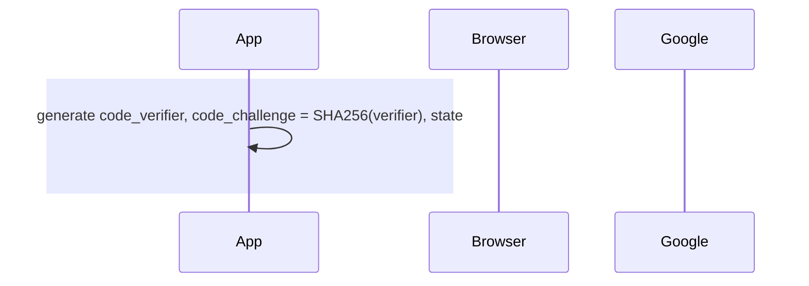
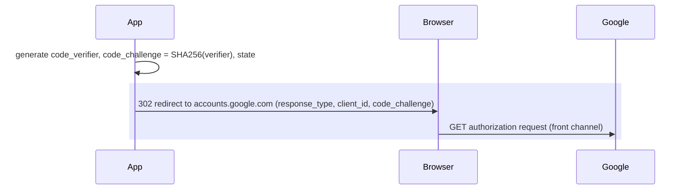
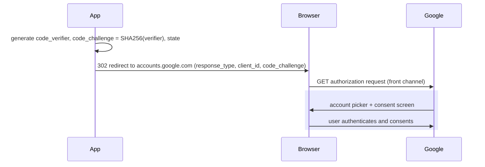
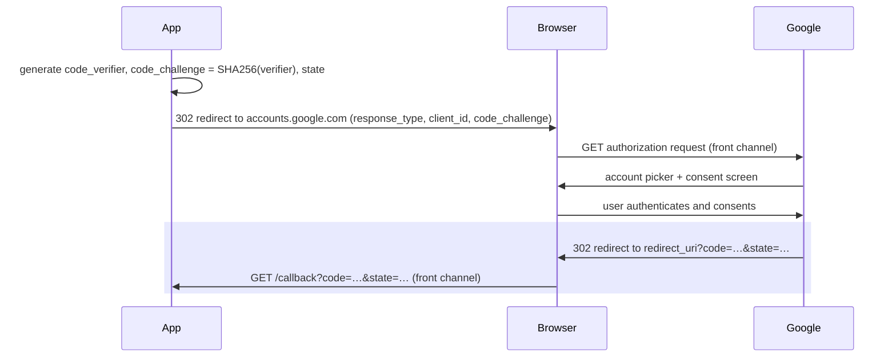
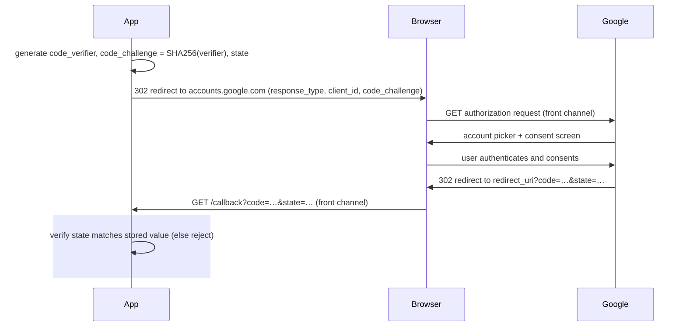
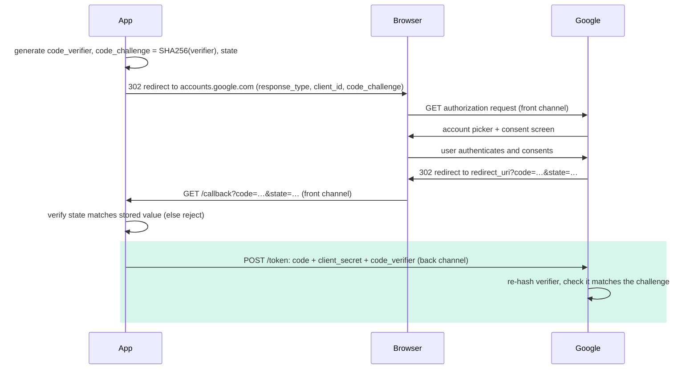
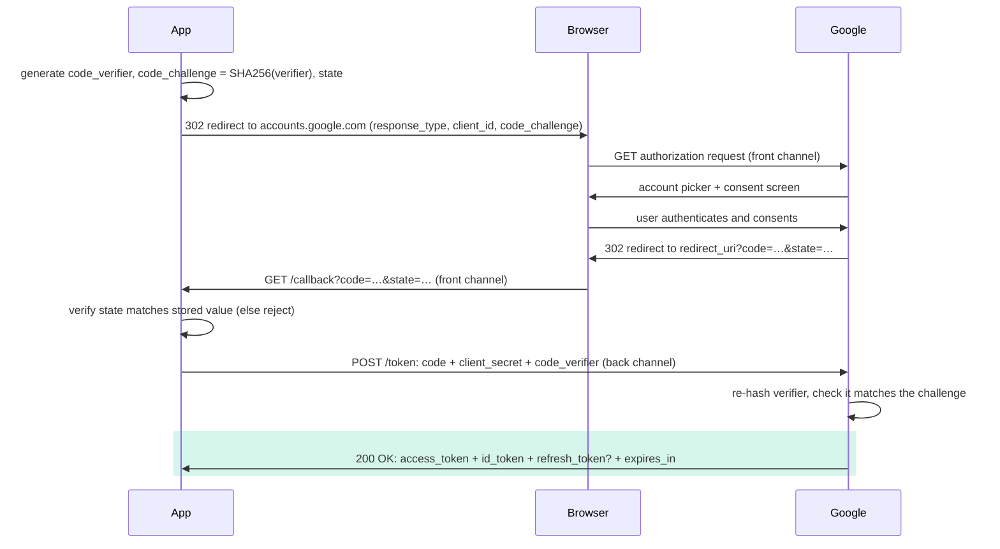
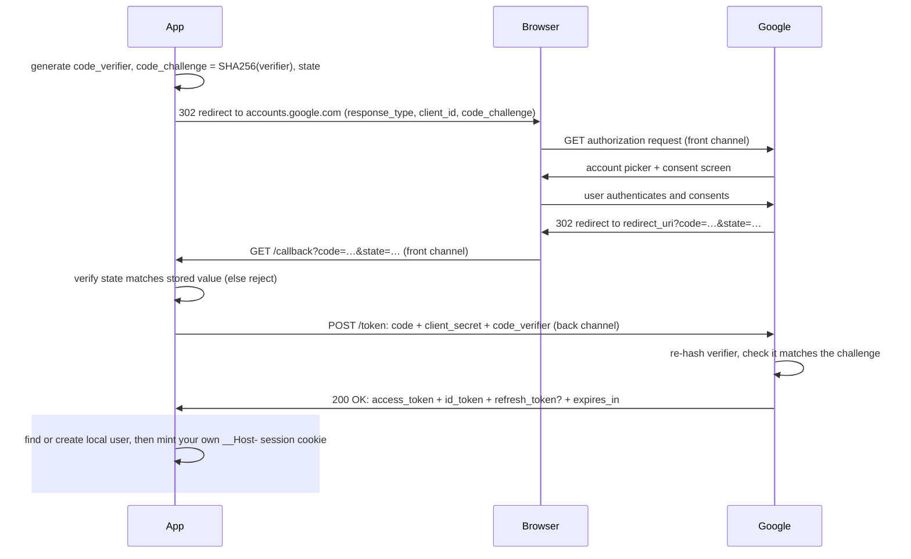

import Figure from '../../../components/figures/Figure.astro';
import DiagramSequence from '../../../components/figures/diagram-sequence/DiagramSequence.astro';
import DiagramStep from '../../../components/figures/diagram-sequence/DiagramStep.astro';
import TrueFalse from '../../../components/exercises/true-false/TrueFalse.astro';
import Statement from '../../../components/exercises/true-false/Statement.astro';
import TfWhy from '../../../components/exercises/true-false/TfWhy.astro';
import AnnotatedCode from '../../../components/code/annotated-code/AnnotatedCode.astro';
import AnnotatedStep from '../../../components/code/annotated-code/AnnotatedStep.astro';
import VideoCallout from '../../../components/embeds/VideoCallout.astro';
import ExternalResource from '../../../components/ui/ExternalResource.astro';
import Term from '../../../components/ui/Term.astro';
import { CardGrid } from '@astrojs/starlight/components';
import CourseProgressBar from '../../../components/ui/CourseProgressBar.astro';
import RolesMapping from '../../../components/lessons/051/3/RolesMapping.astro';
import ChannelsLanes from '../../../components/lessons/051/3/ChannelsLanes.astro';
import TokenTaxonomy from '../../../components/lessons/051/3/TokenTaxonomy.astro';

<CourseProgressBar value={frontmatter['course-progress']} />

You have seen the button a thousand times: **Sign in with Google**. You click it, the page slides to a Google screen, you pick your account, and you land back on the app, logged in. Watch the address bar during that bounce and you catch a flash of `?code=4%2F0Ab...&state=xyz` before the app cleans it up.

That two-second bounce is a choreographed protocol with real security stakes, and wiring it up is your job. You will set its redirect URIs in a provider console, choose which scopes to request, debug why staging works but production silently fails, and decide what your app keeps once the flow ends.

Two ideas you already have carry straight in. The authentication and authorization lesson split *proving who someone is* from *deciding what they may do*; that split is the hinge this protocol turns on. The sessions lesson gave you the `__Host-` cookie this flow ultimately produces. This lesson connects them: how a third party's word becomes an identity your app has proven, then your own session.

You will not type this code. What you take away is the mental model, enough to read any provider's OAuth setup without confusion.

## OAuth delegates authorization; OIDC adds identity

OAuth stands for **Open Authorization**, and its job has nothing to do with logging in. It lets a third-party app act on a user's behalf at some service, *with the user's consent*, **without the app ever seeing the user's password**. The textbook case: a photo-printing site wants to read your Google Photos. You do not hand it your Google password; you let Google grant the site a limited, revocable token that says "this app may read this user's photos." That delegation is what OAuth was built for.

"Sign in with Google" repurposes the same machinery. Instead of your photos, the app reads your *identity*, your email and name, and treats "Google vouches for this email" as proof of who you are. But here is the gap: OAuth only ever hands the app a token meaning "this app may act on the user's behalf." On its own it never tells the app *who the user is*.

The piece that does is a separate layer on top of OAuth, <Term definition="OpenID Connect — an authentication layer standardized on top of OAuth 2.0; adds the id_token and the userinfo endpoint so the app can learn who the user is, not just what it may access.">OpenID Connect (OIDC)</Term>. OIDC standardizes an identity token, the `id_token`, and a `userinfo` endpoint, and you opt in by requesting one scope: `openid`. Ask for it and the provider promises to tell you who the user is, not just what you may touch.

People say "OAuth login" because everyone does, but underneath it is **OIDC over OAuth**: authentication standing on an authorization protocol.

:::note
**OAuth gives you tokens** (*authorization*: "this app may act on the user's behalf"). **OIDC tells you who the user is** (*authentication*: "the provider asserts this is `ada@acme.com`").
:::

This is the same authn-versus-authz split from the earlier lesson, now one layer down at the protocol level. So when you catch yourself thinking "OAuth logs the user in," correct it to "OAuth authorizes; OIDC authenticates; my app reads the identity and logs the user in itself."

<VideoCallout videoId="HsbNDDfLvio" videoTitle="OAuth and OpenID Connect — Know the Difference">
  Viraj Shetty works through the split in about ten minutes: OAuth hands you an access token to call an API, OIDC hands you an `id_token` that says who the user is.
</VideoCallout>

## The four roles and the two channels

Two framings make the diagram legible before you reach it.

### Four roles, usually two machines

The spec names four roles. They sound like four separate parties, but in a login flow most are the same company playing different parts:

- The <Term definition="The human user who owns the data and grants the app access — in a login flow, the person signing in.">resource owner</Term> is the human signing in.
- The **client** is your app, the thing requesting access.
- The <Term definition="The provider endpoint that authenticates the user and issues the code and the tokens — for example, Google's accounts.google.com.">authorization server</Term> is the provider's identity endpoint, Google's `accounts.google.com`. It authenticates the user and hands out the code and tokens.
- The **resource server** is the API that a token unlocks. For a pure login, the only "resource" your app reads is the user's own profile, via the `userinfo` endpoint.

<Figure caption="The four OAuth roles in a 'Sign in with Google' flow, with Google playing both server roles.">
  <RolesMapping />
</Figure>

The names keep the spec unambiguous; they don't mean four machines on the wire. When provider docs say "authorization server" and "resource server," it is usually just Google, twice.

### Front channel versus back channel

Data travels between your app and the provider along two completely different paths.

The **front channel** goes *through the browser*: redirects and URLs. It is visible in browser history, in your server's access logs, in the `Referer` header sent to the next page, and to every browser extension the user has installed. It is **untrusted by default**: assume anything you put on it can be read by someone who shouldn't.

The <Term definition="A direct server-to-server HTTPS request, with no browser in the middle — safe to carry secrets, unlike browser redirects which are visible in history, logs, and to extensions.">back channel</Term> is the direct server-to-server HTTPS call from your app to the provider. No browser sits in the middle, TLS protects it end to end, and secrets are safe there.

One sentence explains every protection you are about to meet:

:::tip
The one-time **`code` travels the front channel**, so it must be useless on its own. The **secret and the token exchange travel the back channel**, so they can be trusted.
:::

That split is the reason behind PKCE, behind never logging the `code`, and behind why an older version of this flow that put the token straight in the URL was removed from the spec.

<Figure caption="The front channel (amber, untrusted) carries the authorization request and the callback with the code; the back channel (teal, trusted) carries the token exchange and the returned tokens.">
  <ChannelsLanes />
</Figure>

## The authorization-code flow with PKCE, end to end

We trace this flow twice: its shape in three beats, then all eight steps one at a time.

### First pass: the shape

Strip away the detail and the flow is three beats:

1. Your app sends the browser to the provider with a request.
2. The provider authenticates the user and redirects the browser back carrying a one-time `code`.
3. Your app trades that `code` on the back channel for tokens, reads the identity from them, and starts its own session.

<VideoCallout videoId="ZV5yTm4pT8g" videoTitle="OAuth 2 Explained In Simple Terms">
  ByteByteGo animates the authorization-code exchange in about 4 minutes, using the same photo-printing delegation example as this lesson, so you can watch the redirect-out, code-back, token-exchange shape in motion.
</VideoCallout>

### Second pass: the eight steps

The same flow step by step, each caption its own explanation. The actors are your **App**, the user's **Browser**, and **Google**, standing in for any provider.

<DiagramSequence>
  <DiagramStep caption="Your app prepares the request before any redirect. It generates a high-entropy random code_verifier (43 to 128 characters), then derives a code_challenge by hashing it with SHA-256. It also generates a random state value and stashes it server-side. For OIDC it adds a nonce to bind the coming id_token. The verifier never leaves your server yet; only its hash, the challenge, is about to go out.">

  </DiagramStep>

  <DiagramStep caption="Your app redirects the browser to Google's authorization endpoint. This is a full-page browser navigation, so it travels the front channel. The redirect URL carries the request as query parameters: the response type (response_type=code), which app is asking (client_id), where to come back to (redirect_uri), what you are asking for (scope=openid email profile), the anti-forgery state, and the PKCE code_challenge with its method S256. We dissect this URL right after the diagram.">

  </DiagramStep>

  <DiagramStep caption="Google takes over. It shows the account picker and the consent screen, listing exactly the scopes you asked for, and the user picks an account and approves. What the user sees on that screen is precisely your scope list, which is why asking for the least you need matters.">

  </DiagramStep>

  <DiagramStep caption="Google redirects the browser back to your redirect_uri, appending ?code=…&state=…. This code is one-time and short-lived, expiring in tens of seconds, and it just rode the front channel in plain sight in the URL. That is why the next steps exist: the code has to be useless to anyone who grabs it in transit.">

  </DiagramStep>

  <DiagramStep caption="The first thing your app does on the callback is compare the returned state against the value it stashed in step 1. If they do not match, reject the request outright, because this callback did not come from a flow this user started. We unpack the attack this blocks in its own section below.">

  </DiagramStep>

  <DiagramStep caption="Now your app exchanges the code on the back channel: a direct server-to-server POST to Google's token endpoint, no browser involved. The body carries grant_type=authorization_code, the code, the same redirect_uri, the client_id, the client_secret, and the PKCE payoff, the original code_verifier. Google re-hashes the verifier and checks it equals the code_challenge from step 2, closing the PKCE loop. This is the first time the secret and the verifier travel, and they travel where it is safe.">

  </DiagramStep>

  <DiagramStep caption="Google returns the tokens as JSON: an access_token, maybe a refresh_token, an id_token (because you asked for openid), plus expires_in and token_type. For login, your app reads the id_token, a JWT carrying claims like sub, email, email_verified, and name, or it calls userinfo with the access token. The id_token is not trusted just because it arrived; it must be verified first. We cover that verification in the tokens section.">

  </DiagramStep>

  <DiagramStep caption="Your app turns the verified identity into a local user. It looks up the user by the provider plus the provider's account id; if found, it signs them in, otherwise it creates the user and links the provider. Then your app issues its OWN session: the __Host- cookie from the sessions lesson. The provider's tokens were the proof-of-identity input. The session is yours. For a pure login you can throw the access and refresh tokens away once you have read the identity.">

  </DiagramStep>
</DiagramSequence>

The eight steps collapse back into the three beats: prepare and redirect out (1 to 3), callback with code (4 and 5), exchange and mint your session (6 to 8). The detail is the hardening: PKCE binds the start to the finish, `state` proves the callback is yours, and the secret stays on the back channel.

Step 2's redirect URL packs the most into one artifact, and every parameter on it maps to something you configure or recognize later. Here it is with fabricated values, illustrative rather than a call you will write:

<AnnotatedCode lang="http" code={`
https://accounts.google.com/o/oauth2/v2/auth
  ?response_type=code
  &client_id=1234567890-abcdef.apps.googleusercontent.com
  &redirect_uri=https://app.example.com/api/auth/callback/google
  &scope=openid%20email%20profile
  &state=g8Hk2p...
  &code_challenge=E9Melhoa2Ow...
  &code_challenge_method=S256
`}>
  <AnnotatedStep meta="{2}" color="blue">
    `response_type=code` asks for the authorization-code flow: send back a one-time code, not a token directly.
  </AnnotatedStep>

  <AnnotatedStep meta="{3}" color="blue">
    `client_id` identifies which app is asking. It is the public, non-secret half of your app's credentials, fine to expose on the front channel; the secret half stays on the back channel.
  </AnnotatedStep>

  <AnnotatedStep meta="{4}" color="orange">
    `redirect_uri` is where Google sends the browser back with the code. It must match a URL you pre-registered in the provider console, character for character. We dig into that exact-match rule below.
  </AnnotatedStep>

  <AnnotatedStep meta="{5}" color="blue">
    `scope=openid email profile` is what you are requesting. `openid` opts into OIDC (give me an `id_token`); `email` and `profile` ask for those identity claims. This exact string is what the user sees on the consent screen.
  </AnnotatedStep>

  <AnnotatedStep meta="{6}" color="violet">
    `state` is a random value your app generated and stored server-side for this one flow. Google echoes it back on the callback and your app checks it matches. This is your CSRF defense, covered below.
  </AnnotatedStep>

  <AnnotatedStep meta="{7-8}" color="green">
    `code_challenge` plus `code_challenge_method=S256` is the PKCE challenge: the SHA-256 hash of a secret verifier your app holds back. `S256` names the hashing method, and only the hash travels here, never the verifier itself.
  </AnnotatedStep>
</AnnotatedCode>

## PKCE, and why OAuth 2.1 requires it everywhere

<Term definition="Proof Key for Code Exchange — pronounced 'pixy'. Binds the start and the finish of an OAuth flow so a stolen authorization code can't be redeemed by anyone who doesn't hold the original secret.">PKCE</Term> appeared in steps 1 and 6. Here is what it does, and why the 2026 spec mandates it.

Your app invents a random secret, the <Term definition="The high-entropy random string the app generates and keeps. Its hash (the code_challenge) goes out on the front channel; the verifier itself is presented later on the back channel to close the PKCE loop.">code verifier</Term>, and keeps it. In the authorization request it sends out only the *challenge*, the SHA-256 hash of the verifier, on the front channel. Later, on the back channel, it presents the verifier; the provider re-hashes it and checks the result against the earlier challenge. Only the party holding the verifier passes.

Why a hash? SHA-256 is one-way, so the challenge leaks *nothing* about the verifier: an attacker who sees it fly by on the front channel cannot reverse it. The public half can travel in the open while the secret half stays hidden.

This closes authorization-code interception. A malicious browser extension, a logging proxy that records URLs, a leaked server access log, or a crafted redirect can capture the `code`. Without PKCE that stolen `code` is enough: whoever holds it can trade it at the token endpoint for tokens. With PKCE the same `code` is inert, because the attacker lacks the verifier and the exchange fails.

Now the misconception this section exists to correct: *"We are a confidential server-side app with a `client_secret`, so we do not need PKCE, since the secret already authenticates us."* That was the old OAuth 2.0 framing, where PKCE was sold as a fix for clients that *cannot* keep a secret, like single-page and mobile apps. **OAuth 2.1 requires PKCE for every client, secret or not.** The secret-alone model fails too often: secrets get shared across deployments, code-injection variants slip a request in before the secret check matters, and stolen codes get replayed against a staging environment that shares the production secret. PKCE binds *this specific code* to *this specific flow*, which a static secret cannot do.

:::caution
The reflex to internalize: **PKCE on every flow, regardless of client type.** Every serious 2026 OAuth library turns it on by default. PKCE described as "only for SPAs and mobile" means you are reading pre-2.1 material.
:::

A short map of the grants alive in 2026, so you can recognize the names:

- **Authorization code with PKCE** is the login flow you just learned.
- **Client credentials** is service-to-service, no human involved, like one backend authenticating to another; real, but not a login flow.
- **Refresh token** pairs with the others to mint new access tokens without re-prompting.
- **Device code** is for input-constrained devices like a TV; out of scope here.

OAuth 2.1 *removed* two grants, each because it left a real hole open. The **implicit grant** returned the access token directly in the URL fragment, on the front channel, exposed to history and extensions. **Resource Owner Password Credentials** had the user type their password *into the third-party app*, defeating the entire point of OAuth. A tutorial that reaches for either predates the spec you are building against.

<TrueFalse instructions="Each claim is about PKCE and the authorization-code flow. Mark it True or False.">
  <Statement answer="false">
    A confidential, server-side app that holds a `client_secret` does not need PKCE.
    <TfWhy>OAuth 2.1 requires PKCE for every client type, secret or not. The secret-alone model fails to bind a specific code to a specific flow, which is exactly what PKCE adds.</TfWhy>
  </Statement>

  <Statement answer="false">
    The `code_verifier` is sent to the provider in the initial redirect, alongside the scopes.
    <TfWhy>Only the `code_challenge` (the SHA-256 hash of the verifier) goes out on the front channel. The verifier itself stays in the app and travels only later, on the back channel, during the token exchange.</TfWhy>
  </Statement>

  <Statement answer="true">
    PKCE makes a stolen authorization code useless to an attacker who lacks the verifier.
    <TfWhy>Closing the loop requires the original verifier. An intercepted code on its own can no longer be exchanged for tokens — that is the whole point of PKCE.</TfWhy>
  </Statement>

  <Statement answer="true">
    The challenge can travel in the open because SHA-256 cannot be reversed to recover the verifier.
    <TfWhy>A one-way hash leaks nothing about its input, so exposing the challenge on the front channel reveals nothing useful about the secret verifier.</TfWhy>
  </Statement>
</TrueFalse>

## How `state` stops login CSRF

PKCE protects the `code`; `state` protects the *callback itself*. Different defenses, different threats. Step 5 of the diagram is where `state` is checked, against the subtlest threat in this lesson.

Consider what the callback request is. The provider redirects the browser to `https://app.example.com/api/auth/callback/google?code=...`, which reaches your app as an incoming request with a code attached. **Nothing in it proves that *this user* started *this* flow.** The browser delivers whatever callback URL it is pointed at.

An attacker exploits that gap. They start an OAuth flow with *their own* Google account and get a valid `code` back. Instead of completing it, they trick a victim already logged into your app into hitting your callback URL with the *attacker's* code, through a malicious link, an image tag, or a hidden form. Your app exchanges the code, receives the *attacker's* Google identity, and links it onto the *victim's* account. Now the attacker can sign into the victim's account by clicking "Sign in with Google," because their Google identity is wired to it. This is login CSRF, and `state` stops it.

The fix is small. At the start of the flow (step 1), your app generates a random `state`, stores it server-side bound to this flow, and sends it in the authorization request; on the callback it rejects anything whose `state` does not match. The attacker cannot guess a `state` your server expects, so the forged callback is thrown out. `state` is mandatory, and a library that omits it is broken.

The `SameSite=Lax` cookies from the sessions lesson fight the same threat, since both block cross-site request forgery. But `state` is the OAuth-specific layer: tied to one flow, checked on one callback, and independent of the browser's cookie policy. Treat them as two layers, not substitutes.

## Configuring redirect URIs, scopes, and the client secret

Everything abstract so far points at three values you type into a provider console and a config object: the redirect URI, the scopes, and the client secret.

### Redirect URI: exact-match, no wildcards

The provider matches the `redirect_uri` in your request against a pre-registered list by **exact string**: no wildcards, no prefix matching, no "close enough." OAuth 2.1 requires this, because a loose match is how stolen codes reach an attacker's URL. Three consequences in practice:

- **Register every environment explicitly.** Production, staging, and local dev each need their own row: `https://app.example.com/api/auth/callback/google`, the staging equivalent, and `http://localhost:3000/api/auth/callback/google`. Never one wildcard for all three.
- **Every character counts, and the trailing slash is the classic trap.** Scheme, host, port, path, and trailing slash all participate: register `.../callback/google`, send `.../callback/google/`, and the provider rejects it. When a deployed environment fails sign-in, check the registered URI against the actual callback path first.
- **Never reflect untrusted input into the post-login redirect.** A `?next=/dashboard` parameter you follow unchecked lets an attacker set `next=https://evil.example.com` and turn your login page into a redirect to their phishing site, an open redirect. The defense is an allowlist of permitted paths; this course routes every post-login redirect through one helper, `safeNext(url)` in `lib/redirects.ts`, which you will meet in the auth code later.

### Scopes: ask for the least, because the user sees the list

For a login, request exactly `openid email profile`: identity, email, basic profile, nothing more.

The reason is trust. The consent screen shows the user precisely what you asked for, so requesting `drive` or `gmail.readonly` on a login makes them read "this app wants to read your Google Drive," which alarms them on a sign-in and drags you into a provider security review for sensitive scopes. If a feature needs broader access later, ask for it then, in a separate consent at that feature's entry point. That is least privilege made concrete: every scope you add is something the user has to agree to.

### The client secret: a back-channel credential, one per environment

The `client_secret` proves your app is itself to the provider during the token exchange in step 6. It rides the back channel only and never touches the browser. Two reflexes:

- **Use a distinct secret per environment.** Production and staging get different secrets, so a leaked staging secret cannot impersonate production.
- **Treat the `code` and `id_token` as secrets in logs.** A logged code is one an attacker can replay; a logged `id_token` is identity claims in plaintext. Redact both the way you redact passwords.

## The three tokens, and verifying the id_token

Step 7 returned three tokens in one JSON response, which is exactly why they are easy to conflate. Keep them straight by *purpose*, not by shape.

<Figure caption="Three tokens by purpose, lifetime, and where each lives. For a pure login you read identity and discard the rest.">
  <TokenTaxonomy />
</Figure>

The **access token** is a bearer credential: whoever holds it can call the resource server's APIs. It is short-lived, often minutes. Treat it as opaque, whether it is a JWT or a random string, and never peek inside. For a pure login you use it exactly once, to call `userinfo`, then you are done with it.

The **refresh token** is the long-lived one that buys new access tokens without sending the user back through the consent screen. It is strictly server-side and never reaches the browser in this stack. For a pure login you usually do not store it at all; you keep it only if your app needs to call the provider's APIs *on its own* later, without the user present, which a login flow does not.

The **`id_token`** is the OIDC piece, the one that answers "who is this?" It is a signed JWT carrying identity claims: `sub` (the stable user id at the provider), `email`, `email_verified`, plus `aud`, `iss`, `iat`, and `exp`. Decoded, the payload looks like this, with fabricated values:

```json title="Decoded id_token payload (illustrative)"
{
  "iss": "https://accounts.google.com",
  "aud": "1234567890-abcdef.apps.googleusercontent.com",
  "sub": "118273645100293847561",
  "email": "ada@acme.com",
  "email_verified": true,
  "name": "Ada Lovelace",
  "iat": 1717804800,
  "exp": 1717808400
}
```

The real `id_token` is a single signed JWT string; this is what it carries once you unpack it.

Here is where the real vulnerability hides: *"the JWT says `email`, so I trust it."* A JWT is **signed, not encrypted**. As the sessions lesson covered, the payload is readable by anyone who holds the token, and just as easily *forgeable* by anyone who does not verify the signature. So before your app trusts a single claim, it must check four things:

- The **signature**, against the provider's published public keys from its <Term definition="JSON Web Key Set — the provider's published public keys, used to verify an id_token's signature without contacting the provider on every request.">JWKS</Term> endpoint. This proves the provider issued the token.
- The **`aud`** claim: is this token meant for *us* (our `client_id`)? A token minted for a different app must be rejected.
- The **`iss`** claim: did *the provider we expect* issue it?
- The **`exp`** claim: has it expired?

Your auth library runs all four checks. What matters is that you recognize the step exists, so when a library config mentions issuer or audience validation, you know what it guards.

With a verified identity you are back at step 8: take it, mint *your own* `__Host-` session cookie, and let go of the tokens.

:::tip
**The OAuth tokens are not your session.** They were the proof-of-identity *input*. Your session is the cookie your app issues, the one from the earlier sessions lesson; the provider's tokens are upstream of it, never a replacement.
:::

## What Better Auth handles, and the provider quirks

You will not hand-write any of this. **Better Auth**, this course's auth library, implements the entire flow: it generates the verifier and `state`, builds the authorization URL, handles the callback, runs the token exchange, verifies the `id_token`, and hands you a local user. You write only configuration, shaped like this:

```ts title="Illustrative provider config — not a real API call"
google: {
  clientId: env.GOOGLE_CLIENT_ID,
  clientSecret: env.GOOGLE_CLIENT_SECRET,
  scope: ['openid', 'email', 'profile'],
}
```

The real config call comes later, but every value here already means something concrete to you.

Providers differ only at the surface; underneath runs the flow you just learned, and the differences are quirks to look up, not new protocols:

- **Google** needs its consent screen configured, including its publishing status and a review for sensitive non-OIDC scopes.
- **GitHub** returns the primary email only if you request the `user:email` scope, and even then the user may keep it private, sometimes forcing an extra API call.
- **Apple** posts the callback as a form (`form_post`) and returns the email *only on the first sign-in*, so you must capture it then.
- **Microsoft** splits personal accounts from organization accounts via a `tenant` setting.

One convention carries over from password sign-in: the callback's error responses stay **opaque**. An error must not reveal whether an account already existed, which leaks information an attacker can enumerate.

## External resources

<CardGrid>
  <ExternalResource
    title="OAuth 2.1 Authorization Framework (draft)"
    href="https://datatracker.ietf.org/doc/html/draft-ietf-oauth-v2-1"
    icon="lucide:file-text"
    iconColor="#ffffff"
    description="The spec that makes PKCE universal and removes the implicit and password grants."
  />
  <ExternalResource
    title="OAuth 2.0 Simplified — Authorization Code + PKCE"
    href="https://www.oauth.com/oauth2-servers/pkce/"
    icon="lucide:book-open"
    iconColor="#2faae1"
    description="A readable, diagram-led walkthrough of the exact flow in this lesson."
  />
  <ExternalResource
    title="Google — OpenID Connect"
    href="https://developers.google.com/identity/openid-connect/openid-connect"
    icon="simple-icons:google"
    iconColor="#4285F4"
    description="The canonical provider reference: endpoints, the id_token, and the consent screen."
  />
  <ExternalResource
    title="RFC 9700 — OAuth 2.0 Security Best Current Practice"
    href="https://datatracker.ietf.org/doc/rfc9700/"
    icon="lucide:shield-check"
    iconColor="#4ade80"
    description="The 2025 BCP behind this lesson's rules: PKCE for all clients, exact-match redirect URIs, state for CSRF."
  />
  <ExternalResource
    title="jwt.io — decode and verify a JWT"
    href="https://www.jwt.io/"
    icon="simple-icons:jsonwebtokens"
    iconColor="#d63aff"
    description="Paste an id_token to see its header, claims, and signature — the verification step the tokens section describes, made hands-on."
  />
</CardGrid>