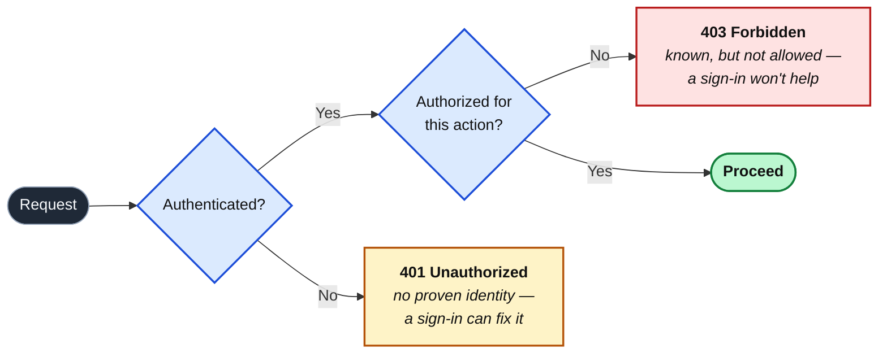

import Figure from '../../../components/figures/Figure.astro';
import { Card, CardGrid } from '@astrojs/starlight/components';
import Buckets from '../../../components/exercises/buckets/Buckets.astro';
import Bucket from '../../../components/exercises/buckets/Bucket.astro';
import Item from '../../../components/exercises/buckets/Item.astro';
import MultipleChoice from '../../../components/exercises/multiple-choice/MultipleChoice.astro';
import McqChoice from '../../../components/exercises/multiple-choice/McqChoice.astro';
import McqWhy from '../../../components/exercises/multiple-choice/McqWhy.astro';
import TrueFalse from '../../../components/exercises/true-false/TrueFalse.astro';
import Statement from '../../../components/exercises/true-false/Statement.astro';
import TfWhy from '../../../components/exercises/true-false/TfWhy.astro';
import ExternalResource from '../../../components/ui/ExternalResource.astro';
import VideoCallout from '../../../components/embeds/VideoCallout.astro';
import Term from '../../../components/ui/Term.astro';
import CourseProgressBar from '../../../components/ui/CourseProgressBar.astro';
import ClaimProofPermissionStrip from '../../../components/lessons/051/1/ClaimProofPermissionStrip.astro';

<CourseProgressBar value={frontmatter['course-progress']} />

A user lands on your sign-in page. They type an email and a password, click **Sign in**, and the page redirects them to a dashboard. It works. Their name is in the corner. Then they click **Delete this invoice**, and the request comes back `403 Forbidden`.

They *are* signed in. You can see their session. So what happened?

That gap, signed in but not allowed, is one of the most common confusions in any app that has users, and it is the reason this lesson exists. By the end of it you will be able to say exactly which part of the system decided each step: why landing on the dashboard worked, why deleting the invoice didn't, and why one of those failures shows up as a `401` and the other as a `403`. You won't write much code here. This lesson hands you a vocabulary, and that vocabulary is what makes everything else in this part of the course (Better Auth, sessions, OAuth, roles) readable instead of mysterious.

You have actually met half of it already. Back when you built Server Actions, your `Result` type carried two distinct error codes: `'unauthorized'` and `'forbidden'`. You used them without dwelling on the difference. This lesson is where that difference gets a name and an explanation, because those two codes are not interchangeable: they answer two completely different questions about a request.

Let's take those two questions one at a time.

## Authentication answers "who is this request from?"

The first question any protected request has to answer is: **who is sending this?** That is <Term definition="Verifying the identity behind a request and producing a verified principal — a known user the request runs as.">authentication</Term>, or authn for short. The system takes some proof from the user, checks it, and on success produces a <Term definition="The authenticated identity a request runs as — concretely, a user row the system has verified.">principal</Term>: a concrete identity the request now runs as. In your app a principal is just a user row. Something like this is enough to picture:

```ts
type Principal = { userId: string; email: string };
```

Three properties of authentication are worth holding onto.

**Authentication is binary.** A request is either authenticated as a specific user or it isn't. There is no "partially signed in," no "70% authenticated." The system either knows who you are or it treats you as a stranger. Hold onto this, because it contrasts sharply with the *next* concept, and that contrast is what the rest of the lesson turns on.

**The proof comes in one of three forms.** These are called <Term definition="A category of proof of identity: something you know, something you have, or something you are.">authentication factors</Term>, and there are exactly three categories. Something you *know*, like a password. Something you *have*, like a device holding a passkey or an app generating a one-time code. Something you *are*, like a fingerprint or a face. That third one is worth framing carefully: a biometric never travels to your server. The fingerprint unlocks a passkey *on the device*, and the device proves possession. So "something you are" is really a gesture that unlocks "something you have." You'll meet the full menu of sign-in methods later in this part of the course; for now, just know proof falls into these three buckets.

**The credential is protected at rest.** When the proof is a password, the system never stores the password itself. It stores a hash, the output of a slow, salted, one-way function (Argon2id or bcrypt are the two you'll see named). One-way means you can check a password against the hash but you can't run the hash backwards to recover the password. So a leaked database is not a leaked list of passwords. The parameters that make these functions slow enough to resist attack are a topic for later; the line to carry now is this: **hashed, salted, slow, one-way, never plaintext, never reversibly encrypted.**

One last thing about authentication, as a preview of what's coming. The proof happens *once*, at the moment the user signs in. But every request after that also needs to know who's calling, and you can't ask the user to retype their password on every click. So the proven identity gets *carried forward*. The thing that carries it is a session, and how a session works is the entire subject of the next lesson. For now: authn proves identity once, and something hands that proof to later requests.

So that's the first question answered. The system knows *who* the request is from. That brings us straight to the second question, the one that produced our `403`.

## Authorization answers "is this principal allowed to do this thing?"

Knowing *who* someone is tells you nothing about *what they may do*. That second question is <Term definition="Deciding whether an authenticated principal may perform a specific action on a specific resource, per the applicable rules.">authorization</Term>, or authz. Given a principal the system has already authenticated, authorization decides: may *this* principal perform *this* action on *this* resource?

Authorization takes four inputs. Walk them against the invoice scenario from the top of the lesson:

- **The principal**: the verified user authentication just handed us.
- **The action**: what they're trying to do. Read an invoice, delete an invoice, invite a teammate.
- **The <Term definition="The specific thing an action targets — this invoice, this organization, this row — not a category of thing.">resource</Term>**: *this specific* invoice, in *this specific* organization. Specificity matters here, because the same action on a different resource can get a different answer.
- **The rules**: what governs the decision. The user's role, whether they own the resource, their plan tier, a feature flag.

Out of those four inputs comes one of two answers: allow or deny.

Here is the property that does the most teaching in this lesson, and it is the exact opposite of authentication's:

**Authorization is not binary.** It is evaluated per-action, per-resource, *every single time*. A user authorized to *read* an invoice may not be authorized to *delete* it. A user authorized to delete invoice A may not be authorized to touch invoice B, because B belongs to a different organization. There is no single "this user is authorized" bit, the way there is a single "this user is authenticated" bit. Every protected action asks the question again, fresh, for that action and that resource.

And that, finally, is the answer to our opening mystery. The dashboard loaded because reading it was authorized. The delete failed because deleting *that invoice* was not. **Same user, same session, two different authorization decisions.** The system never disagreed with itself. It answered two different questions and got two different answers. Nothing about the user being "signed in" was ever in doubt; "signed in" simply wasn't the question the delete button was asking.

To make "per-action, per-resource" concrete, picture the shape of an authorization check. This is not the real one you'll build later, just its silhouette:

```ts title="Sketch — not the real wrapper (that's the RBAC chapter)"
declare function can(
  principal: Principal,
  action: string,
  resource: Invoice,
): boolean;
```

See how `can` takes the action and the resource alongside the principal? That's the per-action, per-resource property made literal. Swap `'read'` for `'delete'`, or swap one invoice for another, and you may get a different boolean back. The full rule surface (roles, ownership, organization scoping, and the wrapper that enforces all of it on every mutation) is built later in the course. This lesson only plants the frame so that surface makes sense when you reach it.

So we have two questions. *Who are you?* is authentication: binary, answered once. *May you do this?* is authorization: not binary, answered every time. Keeping them apart is most of the work.

<VideoCallout videoId="DakSdpODf-U" videoTitle="Authentication vs Authorization explained in 3 minutes">
  A three-minute recap from Permit on the same two questions, *who are you?* versus *what are you allowed to do?*, if a second framing helps it stick.
</VideoCallout>

There's a subtlety hiding inside the first question that experienced engineers keep straight and beginners almost always collapse.

## Identification, authentication, authorization: three things, not two

We've been treating authentication as one step. It's actually two, and prying them apart is one of the most useful refinements in this lesson. The full picture has *three* layers, not two:

- **<Term definition="An unverified claim of identity — asserting who you are, with no proof yet.">Identification</Term> is the claim.** "I am `ada@acme.com`." It's cheap, it's unverified, and anyone can make it. Typing an email into a form is identification. So is a username sitting in a URL.
- **Authentication is the proof of the claim.** The password matches the stored hash, or the passkey signs the server's challenge. *Now* the claim is backed by evidence.
- **Authorization is the permission to act** under the identity that's now been proven.

Map that onto the sign-in form you've seen a thousand times. The email you type is **identification**, a claim and nothing more. The password check is **authentication**, the proof that turns the claim into a verified principal. And the role lookup that happens later, when you click delete, is **authorization**. Three distinct layers, three distinct moments.

This matters because the layers stack: each one presupposes the one beneath it. You can't authorize an identity you haven't authenticated, and you can't authenticate a claim that was never made. The following figure lays the three layers out as a stack so you can see the escalation: each band rests on the one below, and each answers a sharper question than the last.

<Figure caption="Each layer rests on the one beneath it: there's nothing to authorize until a claim has been proven, and nothing to prove until a claim has been made.">
  <ClaimProofPermissionStrip />
</Figure>

Here's the payoff, and it reframes how you'll read every auth bug report from here on: **almost every "auth bug" is a confusion between two adjacent layers.** Either identification gets mistaken for authentication, treating an unverified email as if it were proven, or authentication gets mistaken for authorization, treating "signed in" as "allowed." We'll catalogue the specific bugs each confusion ships near the end of the lesson. First, lock in the three-way distinction with a quick sort.

The following exercise gives you a handful of steps from real sign-in and permission flows. Drop each one into the layer it belongs to. The skill is telling a *claim* apart from a *proof* apart from a *permission*, which is exactly where these blur.

<Buckets instructions="Sort each step into the concern it belongs to — a claim, a proof, or a permission.">
  <Bucket name="ident" label="Identification" description="An unverified claim of identity" />
  <Bucket name="authn" label="Authentication" description="Proof that backs the claim" />
  <Bucket name="authz" label="Authorization" description="Permission to act, once proven" />

  <Item bucket="ident">Typing your email into the login form</Item>
  <Item bucket="ident">A username sitting in the URL `/u/ada`</Item>
  <Item bucket="authn">The server checks your password hash matches</Item>
  <Item bucket="authn">The passkey on your phone signs the login challenge</Item>
  <Item bucket="authz">The handler checks your role is `admin` before deleting</Item>
  <Item bucket="authz">Looking up whether you own this invoice</Item>
</Buckets>

If you put the password check and the passkey signature both in Authentication while "owning this invoice" went to Authorization, you have the distinction down. Now let's place these checks in the actual files of your app.

## Where each check lives in this stack

Vocabulary is only useful if you know where it lives in code. The two questions get answered at two different boundaries in the request lifecycle, the same lifecycle you already know from building routes and Server Actions.

**Authentication lives at the session-read boundary.** This is wherever your code first asks "who is this request from?" by reading the session. In a Next.js app that's a few specific places: `proxy.ts` for gating protected routes before they render, layouts for surfaces that require a signed-in user, and Server Actions and route handlers reading the caller's identity per call.

**Authorization lives at the <Term definition="The server-side entry point of a mutation — the Server Action or route handler — where authorization is enforced.">action boundary</Term>.** This is the server-side entry point of a mutation: the Server Action or route handler that actually changes something. A wrapper around every such mutation checks the caller's role and organization scope before the work runs. You'll build that wrapper later, in the RBAC chapter; today, just know *where* it sits.

The two compose in a fixed order. Authentication runs first and establishes the principal. Authorization runs second, reads that principal plus the request, and decides. The following table maps each boundary to its job:

| Boundary | Reads | Decides |
| --- | --- | --- |
| `proxy.ts` (middleware) | Is there a valid session? | Let the request reach the route, or redirect to sign-in (**authn gate**) |
| Layout / page | Is there a valid session? | Render the protected surface, or send to sign-in (**authn gate**) |
| Server Action / route handler | The principal + the action + the resource | Allow or deny this specific mutation (**authz gate**) |

Notice the split in that table: the first two rows are authentication gates, asking only whether *someone* is signed in. The real authorization decision happens in the last row, at the action boundary, where the principal meets the specific action and resource.

This leads to a habit experienced engineers hold without thinking, and it's worth installing now even though you won't implement it for a while:

:::caution
**Never put an authorization check inside a React component or a layout.**
:::

There are two reasons. First, layouts can be bypassed: under partial pre-rendering the framework may render parts of a page without re-running the layout's logic, so a layout-level "are you allowed?" check is not a guarantee. Second, and more fundamental, a component that renders nothing for a forbidden user is a *user experience* affordance, not a *security* boundary. Hiding the delete button is polite, since it keeps users from clicking something that would fail, but it stops nobody who sends the request directly. The security boundary is the action itself, on the server, where the mutation actually runs. The real boundary gets built in the RBAC chapter; for now, hold the principle: **the button is UX, the action is security.**

So authentication runs first, at the session boundary, and authorization runs second, at the action boundary. That order isn't arbitrary, and the fact that it's fixed is what produces the two status codes from the opening scenario.

## Why the order is fixed: 401 versus 403

Here's the rule the whole lesson has been building toward: **every protected request runs authentication first, authorization second.** You have to know *who* someone is before you can ask *what they may do*, and there's no other sensible order. From that fixed order fall two distinct failure modes, each with its own HTTP status code.

**Authentication fails, so the response is `401`.** There's no proven identity. The system doesn't know who's calling, whether because there's no session or because the session is invalid. The defining property of a `401` is that the client *can* fix it, by signing in. It's a "we don't know you yet" response.

**Authorization fails, so the response is `403`.** The identity is proven, but this principal may not do this thing. The system knows *exactly* who you are; you're simply not allowed. The defining property of a `403` is that the client *cannot* fix it by retrying or by signing in again, because they're already signed in. They need someone to grant them access.

That single question, *can a sign-in fix this?*, is the cleanest test you have for choosing between the two. If yes, it's a `401`. If no, because they're already signed in and still can't, it's a `403`.

There is one genuinely confusing wrinkle, and it trips up everyone exactly once. The official HTTP name for `401` is "Unauthorized," which sounds like it's about authorization, the second concept. It isn't. `401` really means *unauthenticated*: "we don't know who you are." The name is a historical misnomer baked into the spec decades ago, and you can't change it, so hold the mapping firmly: **`401` means unauthenticated (no identity), despite being named "Unauthorized."** `403 Forbidden` is the one that actually means "we know you, and the answer is no."

Walk the whole decision in one picture. A request comes in; it hits the authentication gate first, then the authorization gate, and each gate has its own exit:

<Figure caption="Two gates in a fixed order. Fail the first and you get a 401, so sign in and try again. Pass the first but fail the second and you get a 403: you're known, but not allowed.">

</Figure>

Why does mixing these two up count as a real bug, and not just pedantry? Because the status code is a message: to the client, to your monitoring, and to whoever's on call during an incident. Return a `403` when there's actually no session, and the client shows "Access denied" to a user whose real problem is that they're logged out. The fix, signing in, is right there, but the UI sends them down a dead end. Return a `401` when the session is fine but the role is wrong, and the client bounces an already-signed-in user back to the login page, where signing in again changes nothing. Get the code wrong and every layer downstream draws the wrong conclusion about what's broken: the UI, the dashboards, and the engineer reading logs during an outage.

This closes the loop with code you've already written. Remember your `Result` type's error codes? Two of them were `'unauthorized'` and `'forbidden'`. They are *the same distinction*, surfaced one layer up, with your action layer mirroring the HTTP layer's split:

<div data-mark-color="blue">

```ts title="src/lib/result.ts" {3-4}
type ErrorCode =
  | 'validation'
  | 'unauthorized'
  | 'forbidden'
  | 'conflict'
  | 'not_found'
  | 'rate_limited'
  | 'internal';
```

</div>

The mapping is one-to-one with the HTTP layer: `'unauthorized'` is the action layer's `401`, meaning no proven identity, and `'forbidden'` is its `403`, meaning identity proven but action refused. The route-handler side mirrors it exactly. The status-code table your handlers follow reads `401` for *no identity* and `403` for *identity, but no permission*: the same two situations, the same split. When you wrote `err('unauthorized', …)` versus `err('forbidden', …)` in the Server Actions chapter, you were already encoding this distinction; you just hadn't named it yet. Now you have.

The next step is to make the diagnosis a reflex. For each scenario in the following exercise, decide which status code the server should return. The test is always the same: *can the client fix this by signing in?*

<MultipleChoice>
  A visitor who has **never signed in** sends a request straight to your delete-invoice endpoint. What status code comes back?

  <McqChoice correct>`401` — sign in and the request could go through</McqChoice>
  <McqChoice>`403` — the answer is no, and signing in won't change it</McqChoice>
  <McqChoice>`404` — pretend the endpoint isn't there</McqChoice>

  <McqWhy>There's no session, so the server can't even tell *who* is asking — the principal is missing, not refused. Signing in is exactly the fix the visitor needs, which is the signature of a `401`. (Mind the misleading name: `401 Unauthorized` really means *unauthenticated*.)</McqWhy>
</MultipleChoice>

<MultipleChoice>
  A user is signed in with the `member` role and clicks a button that runs an `admin`-only action. What status code comes back?

  <McqChoice>`401` — they should sign in again</McqChoice>
  <McqChoice correct>`403` — they're known, just not permitted</McqChoice>
  <McqChoice>`400` — the request itself was malformed</McqChoice>

  <McqWhy>The session is valid and the principal is fully proven — the system knows exactly who this is. Re-signing-in changes nothing; only someone granting them the role would. Known but not allowed is the textbook `403`.</McqWhy>
</MultipleChoice>

<MultipleChoice>
  A signed-in user requests invoice `inv_42`, which exists — but it belongs to a **different organization**. What's the safest status code to return?

  <McqChoice>`403` — tell them the invoice exists but is off-limits</McqChoice>
  <McqChoice correct>`404` — don't reveal that the invoice exists at all</McqChoice>
  <McqChoice>`401` — bounce them back to sign in</McqChoice>

  <McqWhy>This is the deliberate twist. A `403` would quietly confirm that `inv_42` is real — just not theirs — which leaks one tenant's data to another. Masking cross-tenant access as `404` keeps other organizations' records invisible. It's the one place the clean `401`/`403` split bends, and you'll meet it again when you build organization scoping.</McqWhy>
</MultipleChoice>

That third scenario is a deliberate twist worth filing away: when a signed-in user reaches for a resource in *someone else's* organization, the safest answer is often `404 Not Found`, not `403`. A `403` would quietly confirm that the resource exists, just not for you, which leaks information across tenant boundaries. Returning `404` keeps the existence of other tenants' data invisible. It's an exception to the clean two-way split, and one you'll see again when you build organization scoping.

## Three principal states: anonymous, authenticated, elevated

Back when we said authentication is binary, that was true at the level of a single request: known, or not. But step up to the level of the *whole app* and a principal actually moves through three distinct states your code handles differently.

- **Anonymous**: no session at all. Public pages, the marketing site, the sign-in form itself. There's nobody to authorize because there's nobody.
- **Authenticated**: a session is present, the identity is proven, and the principal has its baseline capabilities. This is the ordinary signed-in state.
- **Elevated**: the principal re-authenticated *recently*. Some actions demand more than "you signed in three weeks ago and the tab's been open since," like changing a password, changing billing details, transferring ownership, or destructive admin operations. These ask the user to prove themselves *again*, right now, before proceeding.

That third state is where the two concepts you've just learned reveal that they *interact*, and it's the cleanest demonstration in the lesson that they're related without being the same. Think about what triggers an elevation prompt. A policy says "this capability requires *recent* proof of identity." That policy is **authorization**, a rule about what's required to perform an action. But what the policy *triggers* is a fresh password or passkey check, which is **authentication**. So:

:::note
Elevation is **authentication triggered by an authorization policy.** The rule that says "prove yourself again" is authz; the re-prompt it fires is authn.
:::

The two concerns aren't a wall between unrelated systems; they hand off to each other. An authorization rule can demand a fresh authentication. Hold that, because it's the model that makes high-stakes flows make sense later.

This state has a name in the tooling you'll use: a <Term definition="A session whose most recent proof of identity is recent enough to clear high-stakes actions.">fresh session</Term>, controlled by a setting that says how recent "recent" has to be. You'll wire up the actual re-authentication flow in a later chapter; today it's enough to know the state exists and *why* it's a clean illustration of authn and authz interacting.

## The misframes that ship bugs

Every distinction you've learned maps to a specific bug: a sentence a developer says to themselves that *sounds* reasonable and ships a hole in the app. Learn to recognize these sentences. Each one is a confusion between two of the three concepts, and naming the right concept is the fix.

<CardGrid>
  <Card title={`"They're signed in, so they can edit."`} icon="warning">
    Authentication mistaken for authorization. Every signed-in user can perform privileged actions, because there's no per-resource, per-role gate, just a "logged in?" check standing in for "allowed?". This is the exact gap behind the opening scenario.
  </Card>
  <Card title={`"Their email is in the database, so they're authenticated."`} icon="error">
    Identification mistaken for authentication, **and the most dangerous one here.** The bug lives in account-recovery flows: a password-reset link sent to an *unverified* email hands the account to anyone who typed that address. An email existing is a claim, not proof, and sending secrets to an unproven claim is how accounts get stolen.
  </Card>
  <Card title={`"They paid, so they're authorized."`} icon="warning">
    A billing entitlement mistaken for the whole authorization policy. The plan-tier check passes, so the gate opens, but role and organization scope still have to apply. A paying user is not automatically an admin of every organization they can see. Payment is one input to authz, not all of it.
  </Card>
  <Card title={`"Once they're authenticated, the session can do anything for 30 days."`} icon="warning">
    The elevation tier collapsed into the baseline. High-stakes actions, like a password change, an ownership transfer, or a billing edit, run on stale proof. A walked-away laptop with an open session becomes a full account takeover, because nothing demanded fresh authentication before the dangerous action.
  </Card>
</CardGrid>

Read those four again and notice the through-line: each is a collision between two of the three layers, identification, authentication, and authorization. "Email's in the database" collapses identification into authentication. "They're signed in" and "they paid" both collapse something into authorization. "30 days" collapses elevation into the baseline. The vocabulary from this lesson *is* the fix: name the concept correctly, and the boundary places itself. You stop writing "is the user logged in?" where you meant "is this user allowed to do this?", because you can now tell that those are different questions.

The following statements each sound plausible. Mark each true or false; the trap in every one is a blurred line between two of the three concepts.

<TrueFalse instructions="Each one blurs the line between two of the three layers — identification, authentication, authorization.">
  <Statement answer="false">
    A user whose email exists in the `users` table is authenticated.
    <TfWhy>That's **identification** — a row proves the email was *claimed*, not that this person controls it. Authentication is the proof step that turns the claim into a verified principal.</TfWhy>
  </Statement>

  <Statement answer="true">
    If a request returns `401`, signing in might fix it.
    <TfWhy>`401` means there's no proven identity — and signing in is exactly what supplies one. Contrast `403`, where the identity is already proven, so a fresh sign-in changes nothing.</TfWhy>
  </Statement>

  <Statement answer="false">
    A signed-in user is automatically allowed to delete any invoice they can see.
    <TfWhy>Being authenticated says *who* they are, not *what they may do*. Deletion is a per-resource **authorization** decision — same user, different invoice, possibly a different answer.</TfWhy>
  </Statement>

  <Statement answer="false">
    Changing a password should be allowed on any valid session, however old.
    <TfWhy>High-stakes actions demand an **elevated** session — recent, fresh proof of identity — not just any authenticated one. A weeks-old session left open is exactly the gap that turns a walked-away laptop into an account takeover.</TfWhy>
  </Statement>

  <Statement answer="false">
    `401` and `403` are interchangeable as long as the request is rejected.
    <TfWhy>They tell the client and your monitoring different things: `401` says *sign in*, `403` says *ask someone for access*. Swap them and you send a logged-out user to a dead end, or bounce an already-signed-in user back to a login page that won't help.</TfWhy>
  </Statement>
</TrueFalse>

## What this lesson hands off

This lesson is the dictionary. Everything that *implements* it comes next, and now you have the words to read each piece without confusion.

How the proven identity travels from one request to the next, and the cookie that carries it, is the next lesson. The OAuth flow hiding behind every "sign in with Google" button is the lesson after that. The full menu of sign-in methods, passwords, passkeys, one-time codes, and magic links, comes in the next chapter. Better Auth, the library that implements all of this for you, gets its own chapter right after. And the role model, organization scoping, and the wrapper that enforces authorization at the action boundary arrive later still, in the RBAC chapter.

You walk away with the model. The syntax is what comes next.

## External resources

<CardGrid>
  <ExternalResource
    title="MDN — 401 Unauthorized"
    href="https://developer.mozilla.org/en-US/docs/Web/HTTP/Reference/Status/401"
    icon="simple-icons:mdnwebdocs"
    iconColor="#000000"
    description="The reference for the status code whose name says 'Unauthorized' but whose meaning is 'unauthenticated.'"
  />
  <ExternalResource
    title="MDN — 403 Forbidden"
    href="https://developer.mozilla.org/en-US/docs/Web/HTTP/Reference/Status/403"
    icon="simple-icons:mdnwebdocs"
    iconColor="#000000"
    description="Identity is known, the action is refused, and re-authenticating won't change the answer."
  />
  <ExternalResource
    title="OWASP — Authentication Cheat Sheet"
    href="https://cheatsheetseries.owasp.org/cheatsheets/Authentication_Cheat_Sheet.html"
    icon="simple-icons:owasp"
    iconColor="#000000"
    description="The authoritative checklist for proving identity safely: credential storage, recovery flows, and the misframes that leak accounts."
  />
  <ExternalResource
    title="OWASP — Authorization Cheat Sheet"
    href="https://cheatsheetseries.owasp.org/cheatsheets/Authorization_Cheat_Sheet.html"
    icon="simple-icons:owasp"
    iconColor="#000000"
    description="The other half of this lesson: least privilege, deny-by-default, and checking permissions server-side on every request."
  />
</CardGrid>
