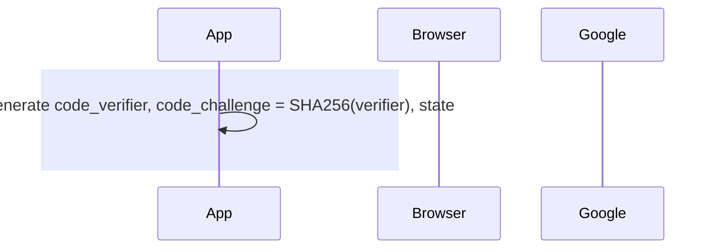
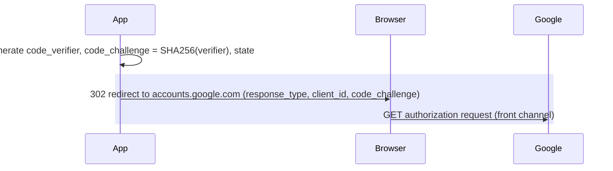
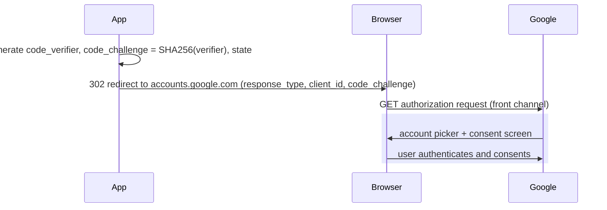
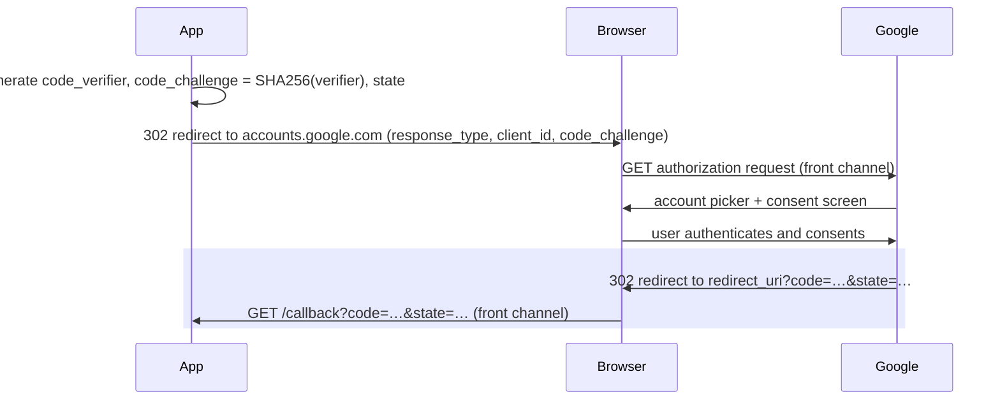
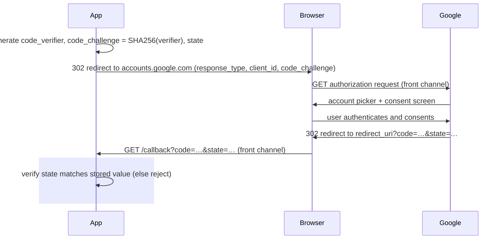
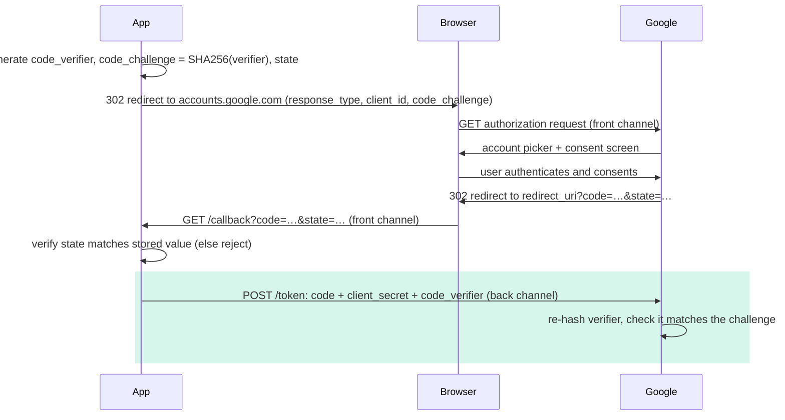
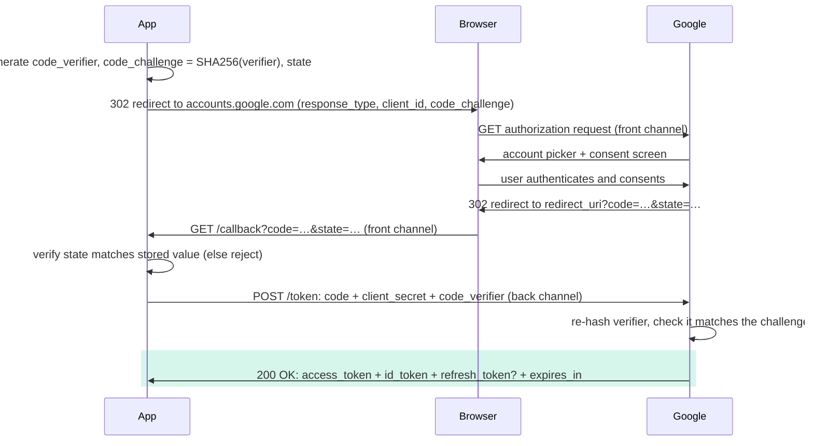
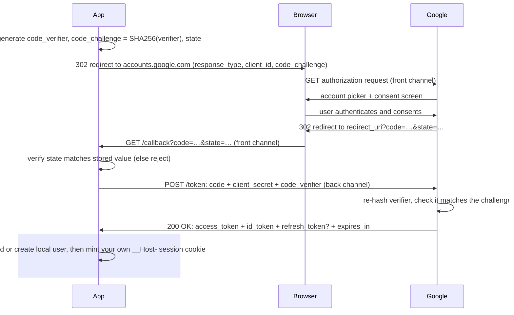

import Figure from '../../../components/figures/Figure.astro';
import DiagramSequence from '../../../components/figures/diagram-sequence/DiagramSequence.astro';
import DiagramStep from '../../../components/figures/diagram-sequence/DiagramStep.astro';
import Sequence from '../../../components/exercises/sequence/Sequence.astro';
import Step from '../../../components/exercises/sequence/Step.astro';
import TrueFalse from '../../../components/exercises/true-false/TrueFalse.astro';
import Statement from '../../../components/exercises/true-false/Statement.astro';
import TfWhy from '../../../components/exercises/true-false/TfWhy.astro';
import AnnotatedCode from '../../../components/code/annotated-code/AnnotatedCode.astro';
import AnnotatedStep from '../../../components/code/annotated-code/AnnotatedStep.astro';
import VideoCallout from '../../../components/embeds/VideoCallout.astro';
import ExternalResource from '../../../components/ui/ExternalResource.astro';
import Term from '../../../components/ui/Term.astro';
import { CardGrid } from '@astrojs/starlight/components';
import CourseProgressBar from '../../../components/ui/CourseProgressBar.astro';
import RolesMapping from '../../../components/lessons/051/3/RolesMapping.astro';
import ChannelsLanes from '../../../components/lessons/051/3/ChannelsLanes.astro';
import TokenTaxonomy from '../../../components/lessons/051/3/TokenTaxonomy.astro';

<CourseProgressBar value={frontmatter['course-progress']} />

You have seen the button a thousand times: **Sign in with Google**. You click it, the page slides over to a Google screen, you pick your account, and a heartbeat later you are back on the app, logged in. If you watch the address bar during that bounce, you catch a flash of something like `?code=4%2F0Ab...&state=xyz` before the app cleans it up.

That two-second bounce is a precisely choreographed protocol with real security stakes, and as the engineer wiring it up you have to be able to describe it. You will configure its redirect URIs in a provider console, choose which scopes to ask for, debug why staging works but production silently fails, and decide what your app keeps after the flow finishes.

Two things you already know carry straight into this lesson. The earlier lesson on authentication and authorization gave you the split between *proving who someone is* and *deciding what they may do*. That split is the hinge this whole protocol turns on, and we will name exactly where. The lesson on sessions and the cookie that carries them gave you the `__Host-` session cookie this flow ultimately produces. This lesson is the bridge between the two: how a third party's word becomes an identity your app has proven, and then your own session.

By the end you will be able to draw the flow from memory and read any provider's OAuth setup without confusion. None of the code here is something you will type, and there is no real library call in this lesson. What you take away is the mental model.

## OAuth is authorization; login is a thing we build on top of it

If you get this one idea backwards, everything that follows misreads, so we start there.

The name decodes it: OAuth is **Open Authorization**. Its actual job has nothing to do with logging in. It exists so a third-party app can act on a user's behalf at some service, *with the user's consent*, **without the app ever seeing the user's password**. Take the textbook example. A photo-printing site wants to read your Google Photos to print them. You do not hand the printing site your Google password. Instead you let Google grant the site a limited, revocable token that says "this app may read this user's photos." That is delegation, and delegation is what OAuth was built for.

"Sign in with Google" takes that same delegation machinery and repurposes it. Instead of reading your photos, the app reads your *identity*, your email and your name, and treats "Google vouches for this email address" as proof of who you are. But notice the gap: OAuth itself only ever proves *authorization*. It hands the app a token meaning "this app may act on the user's behalf." It does not, on its own, tell the app *who the user is*.

The piece that does that is a separate layer built on top of OAuth, called <Term definition="OpenID Connect — an authentication layer standardized on top of OAuth 2.0; adds the id_token and the userinfo endpoint so the app can learn who the user is, not just what it may access.">OpenID Connect (OIDC)</Term>. OIDC standardizes an identity token, the `id_token`, and a `userinfo` endpoint, and you opt into it by asking for one specific scope: `openid`. When you request `openid`, the provider promises to tell you who the user is, not just what you may touch.

So here is the two-level vocabulary an experienced engineer keeps in mind. In conversation they say "OAuth login," because everyone does. Underneath, they know it is **OIDC over OAuth**: authentication standing on top of an authorization protocol. The rule of thumb that keeps it straight:

:::note
**OAuth gives you tokens** (*authorization*: "this app may act on the user's behalf"). **OIDC tells you who the user is** (*authentication*: "the provider asserts this is `ada@acme.com`").
:::

That is the same authn-versus-authz split from the earlier lesson, now showing up one layer down at the protocol level. Every time you catch yourself thinking "OAuth logs the user in," correct it to "OAuth authorizes; OIDC authenticates; my app reads the identity and then logs the user in itself." Hold onto that last clause, because it is where the lesson lands.

<VideoCallout videoId="HsbNDDfLvio" videoTitle="OAuth and OpenID Connect — Know the Difference">
  Viraj Shetty walks through the OAuth-versus-OIDC split with a worked example (about 10 minutes): OAuth hands you an access token to call an API, OIDC hands you an `id_token` that says who the user is.
</VideoCallout>

## The four roles and the two channels

Before we trace the flow, two small framings will make the diagram legible the moment it appears, so they are worth a minute now.

### Four roles, usually two machines

The spec names four roles. They sound like four separate parties, but in a login flow most of them are the same company playing different parts:

- The <Term definition="The human user who owns the data and grants the app access — in a login flow, the person signing in.">resource owner</Term> is the human signing in.
- The **client** is your app, the thing requesting access.
- The <Term definition="The provider endpoint that authenticates the user and issues the code and the tokens — for example, Google's accounts.google.com.">authorization server</Term> is the provider's identity endpoint, Google's `accounts.google.com`. It authenticates the user and hands out the code and tokens.
- The **resource server** is the API that a token unlocks. For a pure login, the only "resource" your app reads is the user's own profile, via the `userinfo` endpoint.

<Figure caption="The four OAuth roles in a 'Sign in with Google' flow — Google plays two of them.">
  <RolesMapping />
</Figure>

The names exist so the specification can be unambiguous, not because there are four separate machines on the wire. When you read provider docs and see "authorization server" and "resource server," remember it is usually just Google, twice.

### Front channel versus back channel

The entire rest of the lesson leans on this distinction. Once you have it, every security decision later will feel obvious instead of arbitrary.

There are two completely different paths data can travel between your app and the provider.

The **front channel** is anything that goes *through the browser*: redirects and URLs. It is visible in the browser's history, in your server's access logs, in the `Referer` header sent to the next page, and to every browser extension the user has installed. The front channel is **untrusted by default**, so assume anything you put on it can be read by someone who shouldn't.

The <Term definition="A direct server-to-server HTTPS request, with no browser in the middle — safe to carry secrets, unlike browser redirects which are visible in history, logs, and to extensions.">back channel</Term> is the direct server-to-server HTTPS call from your app to the provider. No browser sits in the middle. It is protected by TLS end to end, and it is where secrets are safe.

One sentence explains every protection you are about to meet:

:::tip
The one-time **`code` travels the front channel**, so it must be useless on its own. The **secret and the token exchange travel the back channel**, so they can be trusted.
:::

That sentence is the reason behind PKCE, behind the rule that you never log the `code`, and behind why an older version of this flow that put the token straight in the URL was removed from the spec. Keep the two lanes in mind as you read the diagram.

<Figure caption="Two channels, two trust levels. The code rides the front channel; secrets ride the back channel.">
  <ChannelsLanes />
</Figure>

## The authorization-code flow with PKCE, end to end

This is the heart of the lesson, the thing you must be able to reconstruct on a whiteboard. We will do it in two passes: first the shape, in three sentences, then the full eight steps, one at a time.

### First pass: the shape

Strip away every detail and the flow is three beats:

1. Your app sends the browser to the provider with a request.
2. The provider authenticates the user and redirects the browser back to your app carrying a one-time `code`.
3. Your app trades that `code` on the back channel for tokens, reads the identity out of them, and starts its own session.

That is the whole flow: redirect out, callback back with a code, exchange the code for tokens. Everything in the next pass is detail hung on these three beats, so if you ever lose the thread, come back to these three sentences.

<VideoCallout videoId="ZV5yTm4pT8g" videoTitle="OAuth 2 Explained In Simple Terms">
  ByteByteGo animates the authorization-code exchange in about 4 minutes, using the same photo-printing delegation example as this lesson. It is a good way to watch the redirect-out, code-back, token-exchange shape in motion.
</VideoCallout>

### Second pass: the eight steps

Now the same flow, slowed down. Scrub through the diagram one step at a time; the caption under each step is the explanation. The three actors are your **App**, the user's **Browser**, and **Google** standing in for any provider.

<DiagramSequence>
  <DiagramStep caption="Your app prepares the request before anyone is redirected anywhere. It generates a high-entropy random code_verifier (43 to 128 characters), then derives a code_challenge by hashing it with SHA-256. It also generates a random state value and stashes it server-side. For OIDC it adds a nonce too, to bind the coming id_token, but we will not dwell on it. The key point is that the verifier never leaves your server yet. Only its hash, the challenge, is about to go out.">

  </DiagramStep>

  <DiagramStep caption="Your app redirects the browser to Google's authorization endpoint. This is a full-page browser navigation, so it travels the front channel. The redirect URL carries the request as query parameters: the response type (response_type=code), which app is asking (client_id), where to come back to (redirect_uri), what you are asking for (scope=openid email profile), the anti-forgery state, and the PKCE code_challenge with its method S256. We dissect this URL right after the diagram.">

  </DiagramStep>

  <DiagramStep caption="Google takes over. It shows the account picker and the consent screen, listing exactly the scopes you asked for. The user picks an account and approves. What the user sees on that screen is precisely your scope list, which matters when we talk about asking for the least you need.">

  </DiagramStep>

  <DiagramStep caption="Google redirects the browser back to your redirect_uri, appending ?code=…&state=…. This code is one-time and short-lived: it expires in tens of seconds. It just rode the front channel, in plain sight in the URL. That is exactly why the next steps exist, since the code has to be useless to anyone who grabs it in transit.">

  </DiagramStep>

  <DiagramStep caption="The first thing your app does on the callback is compare the returned state against the value it stashed in step 1. If they do not match, reject the request outright, because this callback did not come from a flow this user started. We unpack the attack this blocks in its own section below.">

  </DiagramStep>

  <DiagramStep caption="Now your app exchanges the code on the back channel: a direct server-to-server POST to Google's token endpoint, no browser involved. The body carries grant_type=authorization_code, the code, the same redirect_uri, the client_id, the client_secret, and the PKCE payoff, the original code_verifier. Google re-hashes the verifier and checks it equals the code_challenge from step 2. The PKCE loop closes here. This is the first time the secret and the verifier ever travel, and they travel where it is safe.">

  </DiagramStep>

  <DiagramStep caption="Google returns the tokens as JSON: an access_token, maybe a refresh_token, an id_token (because you asked for openid), plus expires_in and token_type. For login, your app reads the id_token, a JWT carrying claims like sub, email, email_verified, and name, or it calls userinfo with the access token. The id_token is not trusted just because it arrived; it must be verified first. We cover that verification in the tokens section.">

  </DiagramStep>

  <DiagramStep caption="Your app turns the verified identity into a local user. It looks up the user by the provider plus the provider's account id; if found, it signs them in, otherwise it creates the user and links the provider. Then your app issues its OWN session: the __Host- cookie from the sessions lesson. The provider's tokens were the proof-of-identity input. The session is yours. For a pure login you can throw the access and refresh tokens away once you have read the identity.">

  </DiagramStep>
</DiagramSequence>

Step back and notice you can compress all eight steps into the three beats: prepare and redirect out (steps 1 to 3), callback with code (steps 4 and 5), exchange and mint your session (steps 6 to 8). The detail you just added is the *hardening*: PKCE binding the start to the finish, `state` proving the callback is yours, and the secret staying on the back channel. Same shape, now with the locks visible.

Step 2's redirect URL is the densest single artifact in the whole flow, and every parameter on it maps to something you will configure or recognize later, so it is worth dissecting on its own. Here it is, with fabricated values. This is an illustrative URL, not a call you will write:

<AnnotatedCode lang="http" code={`
https://accounts.google.com/o/oauth2/v2/auth
  ?response_type=code
  &client_id=1234567890-abcdef.apps.googleusercontent.com
  &redirect_uri=https://app.example.com/api/auth/callback/google
  &scope=openid%20email%20profile
  &state=g8Hk2p...
  &code_challenge=E9Melhoa2Ow...
  &code_challenge_method=S256
`}>
  <AnnotatedStep meta="{2}" color="blue">
    `response_type=code` asks for the authorization-code flow specifically: send back a one-time code, not a token directly. This is the only response type a 2026 SaaS uses. The old `token` response, the implicit grant, was removed from the spec because it put the access token straight in the URL fragment, on the front channel, for anyone to grab.
  </AnnotatedStep>

  <AnnotatedStep meta="{3}" color="blue">
    `client_id` identifies which app is asking. It is public: it travels on the front channel and is fine to expose. It is the non-secret half of your app's credentials, and the secret half stays on the back channel.
  </AnnotatedStep>

  <AnnotatedStep meta="{4}" color="orange">
    `redirect_uri` is where Google sends the browser back with the code. It must exactly match a URL you pre-registered in the provider console, character for character. We dig into why this exact-match rule trips everyone up once, just below.
  </AnnotatedStep>

  <AnnotatedStep meta="{5}" color="blue">
    `scope=openid email profile` is what you are asking for. `openid` opts into OIDC (give me an `id_token`); `email` and `profile` ask for those identity claims. This exact string is what the user sees on the consent screen.
  </AnnotatedStep>

  <AnnotatedStep meta="{6}" color="violet">
    `state` is a random value your app generated and stored server-side for this one flow. Google echoes it back on the callback and your app checks it matches. This is your CSRF defense, covered below.
  </AnnotatedStep>

  <AnnotatedStep meta="{7-8}" color="green">
    `code_challenge` plus `code_challenge_method=S256` is the PKCE challenge: the SHA-256 hash of a secret verifier your app is holding back. `S256` names the hashing method. The verifier itself is *not* here, only its hash. That is the entire point of PKCE.
  </AnnotatedStep>
</AnnotatedCode>

Now lock in the sequence. Drag the steps into the order they actually happen, which is the best check that the flow has stuck.

<Sequence instructions="Put the authorization-code-with-PKCE flow back in order, from the moment before the redirect to the moment the user is signed in.">
  <Step>App generates the `code_verifier`, derives the `code_challenge`, and stores a random `state`.</Step>
  <Step>App redirects the browser to Google with `client_id`, `scope`, `state`, and the `code_challenge`.</Step>
  <Step>User picks an account and approves the requested scopes on Google's consent screen.</Step>
  <Step>Google redirects the browser back to the app's `redirect_uri` with `?code=` and `&state=`.</Step>
  <Step>App checks the returned `state` matches the value it stored.</Step>
  <Step>App POSTs the `code`, `client_secret`, and `code_verifier` to Google on the back channel.</Step>
  <Step>Google verifies the PKCE challenge and returns the tokens, including the `id_token`.</Step>
  <Step>App finds or creates the local user and mints its own `__Host-` session cookie.</Step>
</Sequence>

## PKCE: proof you started the flow you're finishing

<Term definition="Proof Key for Code Exchange — pronounced 'pixy'. Binds the start and the finish of an OAuth flow so a stolen authorization code can't be redeemed by anyone who doesn't hold the original secret.">PKCE</Term> showed up in steps 1 and 6. It stands for *Proof Key for Code Exchange*, and you say it "pixy." Now we zoom in on what it actually does and why the 2026 spec makes it non-negotiable.

Here is the mechanism, restated now that you have seen both ends. Your app invents a random secret, the <Term definition="The high-entropy random string the app generates and keeps. Its hash (the code_challenge) goes out on the front channel; the verifier itself is presented later on the back channel to close the PKCE loop.">code verifier</Term>, and keeps it. It sends out only the *challenge*, the SHA-256 hash of the verifier, on the front channel, inside the authorization request. Later, on the back channel, it presents the original verifier. The provider re-hashes the verifier and checks the result matches the challenge it saw earlier. Only the party holding the original verifier can pass that check.

Why a hash, specifically? Because SHA-256 is one-way: the challenge leaks *nothing* about the verifier. An attacker who sees the challenge fly by on the front channel cannot reverse it to recover the verifier, so they cannot complete the exchange. The hash is what lets the public half travel in the open while the secret half stays hidden.

The threat it closes is authorization-code interception. Picture the `code` getting captured in transit by a malicious browser extension, a logging proxy that records URLs, a leaked server access log, or a crafted redirect. Without PKCE, that stolen `code` is enough: whoever has it can walk up to the token endpoint and trade it for tokens. With PKCE, the same stolen `code` is inert, because the attacker lacks the verifier, so the exchange fails. This is where the front-channel-versus-back-channel framing pays off: PKCE is what makes a front-channel leak survivable.

Now the misconception this section exists to correct. You will hear, or think: *"We are a confidential server-side app with a `client_secret`, so we do not need PKCE, since the secret already authenticates us."* That was the old OAuth 2.0 framing, where PKCE was sold as a fix for clients that *cannot* keep a secret, like single-page apps and mobile apps. **OAuth 2.1 requires PKCE for every client, secret or not.** The secret-alone model fails in practice in too many ways: secrets get shared across deployments, code-injection variants slip a malicious request in before the secret check matters, and stolen codes get replayed against a staging environment that shares the production secret. PKCE binds *this specific code* to *this specific flow*, which a static secret cannot do.

:::caution
The reflex to internalize: **PKCE on every flow, regardless of client type.** Every serious 2026 OAuth library turns it on by default. If you ever see PKCE described as "only for SPAs and mobile," you are reading pre-2.1 material.
:::

While we are on what 2.1 changed, here is a short map of what is alive in 2026, so you can recognize the names without chasing the dead ones:

- **Authorization code with PKCE** is the flow you just learned, the one you use for login.
- **Client credentials** is service-to-service, with no human involved, like one backend authenticating to another. It is real, but not a login flow.
- **Refresh token** is paired with the others to mint new access tokens without re-prompting; we meet it again in the tokens section.
- **Device code** is for input-constrained devices like a TV. It exists, but it is out of scope here.

And two grants OAuth 2.1 *removed*, each because it left a real hole open. The **implicit grant** returned the access token directly in the URL fragment, on the front channel, exposed to history and extensions, so it was deleted. **Resource Owner Password Credentials** had the user type their password *into the third-party app*, which defeats the entire point of OAuth, that the app should never see the password, so it is gone too. If a tutorial reaches for either, it predates the spec you are building against.

Run a quick gut-check on the PKCE misconceptions, since they are the ones that ship bugs.

<TrueFalse instructions="Each claim is about PKCE and the authorization-code flow. Mark it True or False.">
  <Statement answer="false">
    A confidential, server-side app that holds a `client_secret` does not need PKCE.
    <TfWhy>OAuth 2.1 requires PKCE for every client type, secret or not. The secret-alone model fails to bind a specific code to a specific flow, which is exactly what PKCE adds.</TfWhy>
  </Statement>

  <Statement answer="false">
    The `code_verifier` is sent to the provider in the initial redirect, alongside the scopes.
    <TfWhy>Only the `code_challenge` (the SHA-256 hash of the verifier) goes out on the front channel. The verifier itself stays in the app and travels only later, on the back channel, during the token exchange.</TfWhy>
  </Statement>

  <Statement answer="true">
    PKCE makes a stolen authorization code useless to an attacker who lacks the verifier.
    <TfWhy>Closing the loop requires the original verifier. An intercepted code on its own can no longer be exchanged for tokens — that is the whole point of PKCE.</TfWhy>
  </Statement>

  <Statement answer="true">
    The challenge can travel in the open because SHA-256 cannot be reversed to recover the verifier.
    <TfWhy>A one-way hash leaks nothing about its input, so exposing the challenge on the front channel reveals nothing useful about the secret verifier.</TfWhy>
  </Statement>
</TrueFalse>

## The `state` parameter: proving the callback answers your request

PKCE protects the `code`. The `state` parameter protects the *callback itself*. They are different defenses for different threats. Step 5 of the diagram was where `state` got checked, and here is why that check matters.

Think about what the callback request actually is. The provider redirects the browser to `https://app.example.com/api/auth/callback/google?code=...`. From your app's point of view, that is just an incoming request with a code attached. **Nothing in the request itself tells your app whether *this user* started *this* flow.** The browser will happily deliver whatever callback URL it is pointed at.

That gap is exploitable, and the attack is the least obvious one in this whole lesson, so read it slowly. An attacker starts an OAuth flow with *their own* Google account and gets a valid `code` back. Instead of completing it themselves, they trick a victim who is already logged into your app into hitting your app's callback URL with the *attacker's* code, using a malicious link, an image tag, or a hidden form. Your app dutifully exchanges that code, gets the *attacker's* Google identity, and links it onto the *victim's* logged-in account. Now the attacker can sign into the victim's account on your app by clicking "Sign in with Google," because their Google identity is wired to the victim's account. This is login CSRF, and `state` is what stops it.

The fix is small. Your app generates a random `state` at the start of the flow (step 1), stores it server-side bound to this flow, sends it in the authorization request, and on the callback rejects anything whose `state` does not match. The attacker cannot forge a `state` your server is expecting, so the forged callback is thrown out. `state` is mandatory, and a library that omits it is broken.

You may notice that the `SameSite=Lax` cookies from the sessions lesson defend against the same threat, and you are right: both fight cross-site request forgery. But `state` is the OAuth-specific defense, tied to one flow and checked on one callback, and it does not depend on the browser's cookie policy. Treat them as two independent layers, not substitutes.

## Redirect URIs, scopes, and the secret: what you'll actually configure

This is the most directly useful section, because these three things, the redirect URI, the scopes, and the client secret, are exactly what you will type into a provider console and a config object. Everything abstract you have learned points here.

### Redirect URI: exact-match, no wildcards

The provider compares the `redirect_uri` in your request against a list you pre-registered, by **exact string**. No wildcards, no prefix matching, no "close enough." OAuth 2.1 nails this down deliberately, because a loose match is how stolen codes get delivered to an attacker's URL. Three consequences you will feel in practice:

- **Register every environment explicitly.** Production, staging, and local dev each need their own row: `https://app.example.com/api/auth/callback/google`, the staging equivalent, and `http://localhost:3000/api/auth/callback/google`. Three rows in the console, never one wildcard standing in for all of them.
- **Every character counts, and the trailing slash is the classic trap.** Scheme, host, port, path, and a trailing slash all participate in the match. Register `.../callback/google` but send `.../callback/google/` and the provider rejects it. This is the most common "works on my machine, broken in production" failure in OAuth setup, and it catches almost everyone once. When a deployed environment mysteriously fails sign-in, check the registered URI against the actual callback path before anything else.
- **Never reflect untrusted input into where you send the user after login.** Apps often use a `?next=/dashboard` parameter so they can bounce the user back where they came from. If you redirect to whatever `next` says without checking it, an attacker sets `next=https://evil.example.com` and your own login page becomes a redirect to their phishing site, which is called an open redirect. The defense is an allowlist of permitted post-login paths. This course funnels every such redirect through a single helper, `safeNext(url)` in `lib/redirects.ts`, the project's one place that decides whether a post-login destination is allowed. You will meet it in the auth code later; for now, just know *why* it has to exist.

### Scopes: ask for the least, because the user sees the list

For a login, request exactly `openid email profile`: the identity, the email, the basic profile, and nothing more.

The reason is trust, not politeness. The consent screen *is* the user's trust judgment, and it shows them precisely what you asked for. Request `drive` or `gmail.readonly` on a login flow and the user sees "this app wants to read your Google Drive," which is alarming on a sign-in and also drags you into a provider security review for sensitive scopes. If a feature genuinely needs broader access later, ask for it *then*, in a separate consent at that feature's entry point, where the user understands the trade. The principle is least privilege, and the consent screen makes it concrete: every scope you add is something the user has to agree to.

### The client secret: a back-channel credential, one per environment

The `client_secret` is how your app proves *it is itself* to the provider during the token exchange in step 6. It rides the back channel only and never touches the browser. Two reflexes:

- **Use a distinct secret per environment.** Production and staging get different secrets, so a leaked staging secret can never be used to impersonate production.
- **Treat the `code` and `id_token` as secrets in your logs.** Redact them the same way you redact passwords. A code in a log file is a code an attacker can try to replay; an `id_token` in a log is identity claims sitting in plaintext. Apply the same discipline you would to never logging a password.

Notice what just happened: every rule in this section is one of the abstractions from earlier made concrete. The back channel became "where the secret lives." The front channel became "why the code must be useless and why you redact it." Least privilege became "the consent screen." That is the whole point: the model exists so this configuration reads as obvious.

## Access, refresh, and ID tokens: three jobs, one response

In step 7, three different tokens arrived in one JSON response. They are easy to conflate because they show up together. The way to keep them straight is by *purpose*, not by shape.

<Figure caption="Three tokens, three jobs. For a pure login, you read identity and can discard the rest.">
  <TokenTaxonomy />
</Figure>

A few words on each, since "three tokens" is genuinely confusing the first time.

The **access token** is a bearer credential: whoever holds it can call the resource server's APIs with it. It is short-lived, often a matter of minutes. Treat it as opaque, since it might be a JWT or a random string, and your app should not care or peek inside. For a pure login, you use it exactly once, to call `userinfo`, and then you are done with it.

The **refresh token** is the long-lived one that buys new access tokens without dragging the user back through the consent screen. It is strictly server-side and never reaches the browser in this stack. Here is the part that saves you from over-engineering: for a pure login, you usually do not store the refresh token at all. You only keep it if your app needs to call the provider's APIs *on its own*, later, without the user present. A login flow does not, so do not build storage you will not use.

The **`id_token`** is the OIDC piece, the one that actually answers "who is this?" It is a signed JWT carrying identity claims: `sub` (the stable user id at the provider), `email`, `email_verified`, plus `aud`, `iss`, `iat`, and `exp`. Here is a sketch of its decoded payload, with fabricated values, illustrative rather than a real token:

```json title="Decoded id_token payload (illustrative)"
{
  "iss": "https://accounts.google.com",
  "aud": "1234567890-abcdef.apps.googleusercontent.com",
  "sub": "118273645100293847561",
  "email": "ada@acme.com",
  "email_verified": true,
  "name": "Ada Lovelace",
  "iat": 1717804800,
  "exp": 1717808400
}
```

That is the *decoded* payload. The real `id_token` is a single signed JWT string, and this is just what it carries once you unpack it.

This is the step beginners skip, and skipping it is a real vulnerability: *"the JWT says `email`, so I trust it."* It is not that simple. A JWT is **signed, not encrypted**. As you learned in the sessions lesson, the payload is readable by anyone who holds the token, and just as easily *forgeable* by anyone, unless you verify the signature. So before your app trusts a single claim, it must check four things:

- The **signature**, against the provider's published public keys, fetched from its <Term definition="JSON Web Key Set — the provider's published public keys, used to verify an id_token's signature without contacting the provider on every request.">JWKS</Term> endpoint. This proves the provider actually issued the token.
- The **`aud`** claim: is this token meant for *us* (our `client_id`)? A token minted for a different app must be rejected.
- The **`iss`** claim: did *the provider we expect* issue it?
- The **`exp`** claim: has it expired?

Reading a JWT is trivial; *verifying* one is what makes it trustworthy, and the gap between the two is where the bug lives. In practice your auth library does all four checks for you. The point here is that you *recognize the step exists*, so that when a library config mentions issuer or audience validation, you know what it is guarding.

And once you have a verified identity? You are back at step 8: take the identity, mint *your own* `__Host-` session cookie, and let go. That brings us back to the one line the whole lesson has been building toward:

:::tip
**The OAuth tokens are not your session.** They were the proof-of-identity *input*. Your session is the cookie your app issues, the one from the earlier sessions lesson. The provider's tokens are upstream of your session, never a replacement for it.
:::

## Where this lives in your stack, and the provider quirks

One last orientation, so you know what is yours to own versus what the library handles.

You will not hand-write any of this. The library this course uses for auth, **Better Auth**, implements the entire flow: it generates the verifier and `state`, builds the authorization URL, handles the callback, runs the token exchange, verifies the `id_token`, and hands you a local user. What you write is configuration. When you later set something shaped like this:

```ts title="Illustrative provider config — not a real API call"
google: {
  clientId: env.GOOGLE_CLIENT_ID,
  clientSecret: env.GOOGLE_CLIENT_SECRET,
  scope: ['openid', 'email', 'profile'],
}
```

That shape is illustrative, and the real config call comes later in the course, but every value in it now means something concrete. You know what the `clientId` and `clientSecret` are and which channel each travels on. You know why the registered redirect URI must match the callback path to the character. You know why the consent screen shows what it shows, and what arrives at the callback: a `code` and a `state`, exchanged for tokens, verified, mapped to a user, then turned into your session. The mental model survives any framework; the specific config call is downstream.

Providers differ, but only at the surface. The flow underneath is the one you just learned, and the differences are quirks to look up, not new protocols:

- **Google** needs its consent screen configured, including its publishing status and a review for sensitive non-OIDC scopes.
- **GitHub** returns the primary email only if you request the `user:email` scope, and even then the user may have it private, which sometimes means an extra API call.
- **Apple** posts the callback as a form (`form_post`) and returns the email *only on the very first sign-in*, so you must capture it then.
- **Microsoft** splits personal accounts from organization accounts via a `tenant` setting.

The expectation to carry: every provider has quirks, the underlying flow is identical, and you read that provider's docs for its surface while trusting the model for the core.

One course convention carries here too. The callback's error responses stay **opaque**, exactly like password sign-in. Do not let an error reveal whether an account already existed, since that leaks information an attacker can enumerate.

## Recap

Compress it to the spine. There are three parties: your app, the browser, and the provider. There are two channels: the front channel through the browser, untrusted, and the back channel server-to-server, trusted. The one-time `code` rides the front channel, so PKCE binds it to your flow and `state` proves the callback is yours, and then it gets traded on the back channel for tokens. You verify the `id_token` against the provider's JWKS, read the identity, and mint *your own* session.

Two sentences are the ones to hold onto:

- **PKCE is mandatory for every client in OAuth 2.1**, public or confidential, no exceptions.
- **The OAuth tokens are not your session.** They are the identity input; your `__Host-` cookie is the session.

Hold those and the rest reconstructs itself.

## External resources

<CardGrid>
  <ExternalResource
    title="OAuth 2.1 Authorization Framework (draft)"
    href="https://datatracker.ietf.org/doc/html/draft-ietf-oauth-v2-1"
    icon="lucide:file-text"
    iconColor="#ffffff"
    description="The spec that makes PKCE universal and removes the implicit and password grants."
  />
  <ExternalResource
    title="OAuth 2.0 Simplified — Authorization Code + PKCE"
    href="https://www.oauth.com/oauth2-servers/pkce/"
    icon="lucide:book-open"
    iconColor="#2faae1"
    description="A readable, diagram-led walkthrough of the exact flow in this lesson."
  />
  <ExternalResource
    title="Google — OpenID Connect"
    href="https://developers.google.com/identity/openid-connect/openid-connect"
    icon="simple-icons:google"
    iconColor="#4285F4"
    description="The canonical provider reference: endpoints, the id_token, and the consent screen."
  />
  <ExternalResource
    title="RFC 9700 — OAuth 2.0 Security Best Current Practice"
    href="https://datatracker.ietf.org/doc/rfc9700/"
    icon="lucide:shield-check"
    iconColor="#4ade80"
    description="The 2025 BCP behind this lesson's rules: PKCE for all clients, exact-match redirect URIs, state for CSRF."
  />
  <ExternalResource
    title="jwt.io — decode and verify a JWT"
    href="https://www.jwt.io/"
    icon="simple-icons:jsonwebtokens"
    iconColor="#d63aff"
    description="Paste an id_token to see its header, claims, and signature — the verification step the tokens section describes, made hands-on."
  />
</CardGrid>