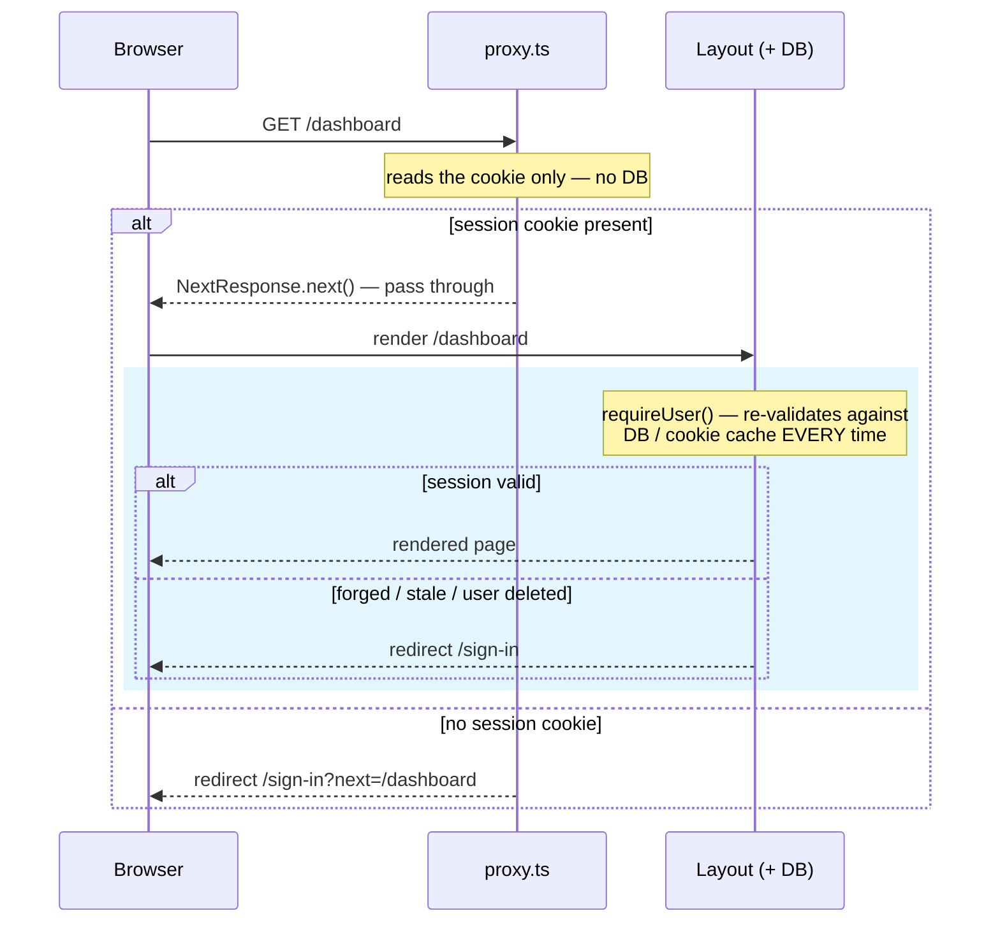

import AnnotatedCode from '../../../components/code/annotated-code/AnnotatedCode.astro';
import AnnotatedStep from '../../../components/code/annotated-code/AnnotatedStep.astro';
import CodeVariants from '../../../components/code/code-variants/CodeVariants.astro';
import CodeVariant from '../../../components/code/code-variants/CodeVariant.astro';
import Figure from '../../../components/figures/Figure.astro';
import StateMachineWalker from '../../../components/figures/state-machine-walker/StateMachineWalker.astro';
import Question from '../../../components/figures/state-machine-walker/Question.astro';
import Branch from '../../../components/figures/state-machine-walker/Branch.astro';
import Leaf from '../../../components/figures/state-machine-walker/Leaf.astro';
import Buckets from '../../../components/exercises/buckets/Buckets.astro';
import Bucket from '../../../components/exercises/buckets/Bucket.astro';
import Item from '../../../components/exercises/buckets/Item.astro';
import MultipleChoice from '../../../components/exercises/multiple-choice/MultipleChoice.astro';
import McqChoice from '../../../components/exercises/multiple-choice/McqChoice.astro';
import McqWhy from '../../../components/exercises/multiple-choice/McqWhy.astro';
import NextRoundtripStrip from '../../../components/lessons/054/1/next-roundtrip-strip.astro';
import VideoCallout from '../../../components/embeds/VideoCallout.astro';
import ExternalResource from '../../../components/ui/ExternalResource.astro';
import Term from '../../../components/ui/Term.astro';
import CourseProgressBar from '../../../components/ui/CourseProgressBar.astro';
import { CardGrid } from '@astrojs/starlight/components';

<CourseProgressBar value={frontmatter['course-progress']} />

A signed-out user types `https://app.example.com/dashboard` into the address bar and hits Enter.
There is no session, so between that keystroke and a rendered page your app has to send them to `/sign-in` instead.
That decision raises three questions: where does the redirect live, what is that code allowed to read to make the call, and what is it explicitly *not* allowed to do?
By the end of this lesson you'll have a production-shaped `proxy.ts` that answers all three.

You already stood up a version of this file.
In [Reading the session everywhere with one call shape](/052-better-auth-setup/4-reading-the-session-everywhere-with-one-call-shape/), you wrote a *minimum* gate, just enough to give the smoke test somewhere to redirect, and it took one deliberate shortcut.
This lesson rebuilds it to the shape you'd actually ship and fixes that shortcut along the way.

## The proxy checks presence, the layout checks validity

Protecting a route is two checks in two places, each answering a different question.

The first is the proxy, and its question is cheap: *"Is there a session-shaped cookie on this request at all?"* No cookie, redirect to sign-in; cookie present, let the request continue. It never asks whether the session is *valid*, *who* the user is, or what they're *allowed* to do. The proxy runs on every matched request, including ones the browser fires speculatively before a click, so it has to be fast.

The second is the layout or Server Action the request is heading for, and its question is authoritative: *"Is this session valid, who does it belong to, and may that person do the thing they're asking for?"* This is where the cookie gets validated, the user's identity resolved, and every authorization decision made. The proxy guards the perimeter; the layout guards the door.

One rule falls straight out of the split: authorization never lives in the proxy. "Is this user an admin?" "Does this user belong to the org that owns this invoice?" Those are door questions, every time. You met the general version in [proxy.ts and the matcher](/033-the-request-surface/2-proxyts-and-the-matcher/): the proxy is a fast gate, the route enforces the real check.

To see why, picture breaking it. Put a role check in the proxy, `if (path.startsWith('/admin') && role !== 'admin') redirect('/')`, and now the proxy *is* your security model. The day someone adds `/admin/billing/export` and forgets to extend the matcher, that route ships with no gate at all, and the data is simply public: one forgotten line, nothing to catch it. Move the validating check to the door and a missed perimeter entry is an inconvenience, not a breach, because the layout re-checks regardless. That redundancy is the point. It's called defense in depth, and the proxy is only its cheap outer ring.

<Figure caption="One request for /dashboard through both layers. The proxy's pass-through means only 'a cookie was present'; the layout's read is what actually decides, and it can still redirect.">

</Figure>

Look at the bottom-right branch, inside the layout. Even after the proxy waves a request through, the layout can still redirect it, because the cookie might be forged, stale, or belong to a user deleted five minutes ago. "There's a cookie" and "the session is valid" are two different facts. The common misconception is that the proxy already checked, so the layout can trust it. It can't, and the end of the lesson returns to exactly why.

## Why the proxy checks the cookie, not the session

The minimum gate from [the Better Auth setup](/052-better-auth-setup/4-reading-the-session-everywhere-with-one-call-shape/) called `auth.api.getSession` inside the proxy. That works: it reads a real, validated session. But it doesn't *scale*, and the reason is one word, <Term definition="Next.js fetching a route's data and React payload before you navigate to it — on hover or when a link scrolls into view — so the page feels instant when you click.">prefetch</Term>. `getSession` round-trips to Postgres (or, at best, a short-lived cookie cache), and the proxy runs on *every matched request*. Next.js prefetches protected routes too, so the moment a user's mouse drifts over a sidebar link to `/dashboard`, the proxy fires a database query. Multiply that across every link, every hover, every user, and idle mouse movement becomes database load.

The fix is to read *less*. Don't ask whether the session is valid; ask only whether a session-shaped cookie *exists*. Better Auth ships `getSessionCookie` from `better-auth/cookies` for exactly this: it reads the request's `Cookie` header, checks for the session cookie by name, and returns it or `null`. Pure parsing, zero IO, nothing to await. It's an <Term definition="A cheap, possibly-stale check you trade a little correctness for speed on, backed by an authoritative check later.">optimistic check</Term>, and the question shrinks from "is this session valid?" to "is there a cookie here at all?"

:::note
A forged cookie sails through this check, and that is fine. The proxy isn't trying to catch forgeries: a faked cookie passes the presence test, then fails the layout's validating read, which decodes and verifies it against the database. The cheap check is the outer ring doing only what the outer ring is for.
:::

You may have heard "never hit the database from middleware" stated as a hard technical limit, and it once nearly was: the old `middleware.ts` ran on the Edge runtime, where a normal database driver couldn't follow. That era is over. As you saw in [proxy.ts and the matcher](/033-the-request-surface/2-proxyts-and-the-matcher/), `proxy.ts` runs on the **Node** runtime in Next.js 16, so the proxy *could* call your database and the wiring would work. "No DB in the proxy" is no longer a capability limit; it's a **performance** decision forced by prefetch. Same rule, different reason, and knowing the difference keeps you from applying it where it doesn't belong.

Here's the read itself, the import and the check; the rest of the file comes together at the end.

<AnnotatedCode lang="ts" maxLines={6} code={`
import { getSessionCookie } from 'better-auth/cookies';
import { SESSION_COOKIE_PREFIX } from '@/lib/auth';

const sessionCookie = getSessionCookie(request, {
  cookiePrefix: SESSION_COOKIE_PREFIX,
});
const isSignedIn = sessionCookie != null;
`}>
  <AnnotatedStep meta="{1-2}" color="blue">
    The imports. `getSessionCookie` is cookie parsing and nothing else. `SESSION_COOKIE_PREFIX` comes from `lib/auth.ts`, the same file that configures the cookie, so the prefix is written once and the proxy and the auth instance can never drift apart.
  </AnnotatedStep>

  <AnnotatedStep meta={`"getSessionCookie"`} color="blue">
    The call. Notice what's missing: no `await`, no database client, no query. It reads the `Cookie` header off the incoming request and returns the matching cookie's value or `null`.
  </AnnotatedStep>

  <AnnotatedStep meta={`"SESSION_COOKIE_PREFIX"`} color="orange">
    The trap. `getSessionCookie` defaults its prefix to `'better-auth.'`, but this stack uses `__Host-`. Skip the explicit prefix and the helper looks for a cookie that isn't there, returns `null` on a valid session, and the proxy redirects a signed-in user back to sign-in over and over. The cookie is right there in the browser; the proxy just can't see it. Passing the constant is mandatory.
  </AnnotatedStep>

  <AnnotatedStep meta={`"isSignedIn"`} color="blue">
    The name says how much you actually know: not `session`, not `user`, but `isSignedIn`. All this line establishes is that a cookie is present. Validity is somebody else's job.
  </AnnotatedStep>
</AnnotatedCode>

This is the most bug-prone line in the file, and it fails *silently*: no error, just a redirect loop that looks like a Better Auth bug when it's a one-word omission. A "the cookie exists but the proxy keeps redirecting" report almost always means a missing prefix.

## Choosing a matcher strategy

The proxy should run only on requests worth gating, and the `matcher` decides which ones. You know its *syntax* from [proxy.ts and the matcher](/033-the-request-surface/2-proxyts-and-the-matcher/): path strings, arrays, and `has`/`missing` conditions. The syntax can't make the strategy call for you, and that's what this section is about.

There are two strategies, and they're mirror images. An **allowlist** names the protected sections explicitly and runs on those alone, so a route you forget to list is public by default. **Matchall-minus-public** runs on everything and carves out the public paths, so a route you forget to list is protected by default. Pick the allowlist when most of the app is public and a short, known set of sections is gated; pick matchall-minus when most of the app sits behind auth and the public pages are the exceptions.

That single difference, what happens to a route you forget, is the whole decision. The allowlist fails *open*: a forgotten entry leaks a route. Matchall-minus fails *closed*: a forgotten entry locks a route, which you catch in seconds because the page is visibly broken rather than silently leaking data.

Either strategy is correct on its own; mixing them is the failure mode. A *partial* allowlist, where someone listed exceptions inside an allowlist or vice versa, gives you the worst of both: routes unprotected by default *and* a config nobody can reason about. Pick one, leave a one-line comment at the matcher saying which and why, and hold the line for the life of the codebase. Drift isn't visible the day it happens; it surfaces months later, when a route ships with no gate and nobody notices until it's in the wild.

This is why authorization lives at the door, not the perimeter. A gate that can fail open must never be the only thing between a user and the data. The matcher can be imperfect precisely because the layout isn't.

<StateMachineWalker title="Which matcher strategy?">
  <Question id="share" prompt="What share of your routes require a signed-in user?">
    <Branch label="A few protected sections — most of the app is public" to="leaf-allowlist" rationale="Marketing, pricing, blog, docs are all reachable signed-out." />
    <Branch label="Most of the app is gated — only a few pages are public" to="leaf-matchall" rationale="The product lives behind the wall; sign-in and a landing page are the exceptions." />
  </Question>

  <Leaf id="leaf-allowlist" verdict="Allowlist the protected sections">
    Name the gated sections explicitly and run on nothing else:

    ```ts
    matcher: ['/dashboard/:path*', '/settings/:path*', '/billing/:path*']
    ```

    **Fails open.** A new route is public until you add it here, so the risk you're signing up to manage is *remembering to list every new gated section*. The right call when the public surface is large and the protected one is a short, known list.
  </Leaf>

  <Leaf id="leaf-matchall" verdict="Match all, minus the public paths">
    Run on everything, then carve out the handful of public paths:

    ```ts
    matcher: ['/((?!sign-in|sign-up|api/auth|_next|favicon.ico|$).*)']
    ```

    **Fails closed.** A new route is protected by default, so if you forget to exclude a public page it's *locked, not leaked*. That's the safer direction to fail when you're unsure: a missed exclusion is a visibly broken page you catch in seconds, never a silent data leak. The right call when most of the app needs a session.
  </Leaf>
</StateMachineWalker>

The two `config.matcher` objects sit side by side below. The line under each names which direction it fails, and that phrase is the thing to internalize, not the regex.

<CodeVariants maxLines={10}>
  <CodeVariant label="Allowlist">
    <div data-mark-color="blue">

    ```ts {4}
    export const config = {
      // Allowlist: only these sections are gated. New routes are PUBLIC
      // by default — add every new protected section here.
      matcher: ['/dashboard/:path*', '/settings/:path*', '/billing/:path*'],
    };
    ```

    </div>
    **Fails open.** A protected section you forget to list ships ungated. Correct for marketing-heavy apps where most routes are genuinely public; the cost is the discipline of remembering every new gated section.
  </CodeVariant>

  <CodeVariant label="Matchall-minus-public">
    <div data-mark-color="orange">

    ```ts {4}
    export const config = {
      // Match everything except the public paths below. New routes are
      // PROTECTED by default — add new public pages to the negative lookahead.
      matcher: ['/((?!sign-in|sign-up|api/auth|_next/static|_next/image|favicon.ico|$).*)'],
    };
    ```

    </div>
    **Fails closed.** A public page you forget to exclude is locked, not leaked, so you'll see it break in seconds. Correct for app-heavy products where most routes need a session; the cost is maintaining the exclusion list.
  </CodeVariant>
</CodeVariants>

## Writing the destination into `?next=`

Redirecting a signed-out user to sign-in is correct but blunt: it throws away where they were trying to go. A user who clicked a deep link to `/billing/invoices?status=open`, got bounced to sign-in, and landed on a bare `/dashboard` after authenticating has every right to be annoyed. The fix is to remember the destination across the round-trip.

The proxy does that by tucking the original path into the redirect as a query parameter:

```ts
const next = encodeURIComponent(pathname + search);
return NextResponse.redirect(new URL(`/sign-in?next=${next}`, request.url));
```

Two details earn their keep. You append `search` as well as `pathname`, so `?status=open` survives and the user returns to their filtered view, not the bare list. And you `encodeURIComponent` the value, because it's about to ride inside another URL's query string: the slashes and ampersands need to travel as data, not structure.

That `next` value makes a full round trip. The proxy writes it into a URL, the browser carries it, and the sign-in page reads it back out and redirects there after authenticating. A value read out of user-controllable input and fed into a redirect is the textbook <Term definition="Redirecting to an attacker-controlled URL pulled from user input. Bounces your users to a phishing page wearing your domain.">open redirect</Term>: hand it a URL an attacker shaped and you bounce your own users to a phishing page wearing your domain. You met this threat and its fix in [Rewrites and redirects in proxy.ts](/033-the-request-surface/3-rewrites-and-redirects-in-proxyts/).

Keep the two jobs in separate files. The proxy writes `next`; this lesson is the writer and validates nothing. The sign-in form reads `next` and validates it through `safeNext`, a helper in `lib/redirects.ts` that returns the raw value only if it's a safe in-app path and falls back to `/dashboard` for anything else. On the form, that is one line:

```ts
// in the sign-in form's success path — the form itself lives elsewhere
redirect(safeNext(next));
```

The form is the one from [Password sign-in](/053-authentication-flows/2-password-sign-in/), and `safeNext` belongs to that earlier lesson on rewrites and redirects. The diagram traces the whole trip: `next` passes through attacker-reachable surface on its way around, which is why the validation step is not optional.

<Figure caption="The `?next=` round-trip. Phase 3 is the only attacker-reachable surface, which is why phase 4's `safeNext` is not optional.">
  <NextRoundtripStrip />
</Figure>

## Redirecting signed-in users away from auth pages

The gate so far points one direction: it keeps signed-out users out of protected routes. The mirror case belongs in the same file: keep signed-in users off the auth pages.

An already-authenticated user has no reason to see `/sign-in`, so send them to `/dashboard` instead. Two reasons. First, UX: showing a sign-in form to someone who is signed in is confusing. Second, the session: in some setups a stray submit on that form churns the user's current session for no reason. Either way, the form shouldn't be reachable.

The rule is the inverse of the one you already have, using the same cookie read: if the matched path is an auth page and a session cookie is present, redirect to `/dashboard`. Same `getSessionCookie`, opposite condition, two lines in the same proxy.

Both gates in one file bring one hazard. If the auth-page rule and the protected-route rule ever disagree about a path, one sending it to `/dashboard` and the other to `/sign-in`, you get a redirect loop, and a redirect loop takes the page down entirely. The guard is a small matrix you run for every matched path: signed in here, what happens? Signed out here, what happens? Four cells, no surprises. That matrix is what keeps the two directions from fighting each other.

## Composing many gates in one proxy.ts

The auth gate is rarely the only thing a proxy does. Over time this same file may also handle internationalization routing (a later chapter wires it up with next-intl), feature-flag bucketing, or A/B test routing. The constraint that shapes all of it: Next.js runs exactly one `proxy.ts`, so every cross-cutting request concern has to coexist in this one file.

To keep that from becoming a mess, make each responsibility a small named function that returns a response or declines, then chain them. The first one to return a `NextResponse` wins; if they all decline, the request passes through. The auth gate is one such function:

```ts
const authGate = (request: NextRequest): NextResponse | undefined => {
  // a redirect to short-circuit, or undefined to defer to the next gate
};
```

The `proxy` function calls the gates in order and returns the first response. Order matters: when next-intl arrives, its `createMiddleware` runs *before* the auth gate so the locale resolves first. Leaving the seam here lets that work slot in later instead of forcing a rewrite.

Two restraints are reflexes a junior reaches for and gets wrong.

First, don't touch the session cookie on every request. It's tempting to refresh its expiry in the proxy so sessions slide forward on activity. Don't: Better Auth's sliding renewal, the `updateAge` setting from [the session-lifetimes lesson](/052-better-auth-setup/3-session-lifetimes-and-cookie-hardening/), already extends the session on the next mutating call. A proxy-level cookie write just adds a write to every page load for a renewal that already happens where it should.

Second, keep the proxy too simple to throw. Across this course you follow a fail-closed discipline: a security check that *throws* should deny access, never silently allow it. That seems to clash with wrapping the proxy so a throw doesn't 500 every matched request, but it doesn't, because the cookie-presence read is pure parsing and can't really throw. If you ever add logic that *can* fail, point its failure path at redirect-to-sign-in, not pass-through. When in doubt, the gate closes.

Here is the complete `proxy.ts`, with every decision from this lesson assembled.

<AnnotatedCode lang="ts" maxLines={18} code={`
import { getSessionCookie } from 'better-auth/cookies';
import { NextResponse, type NextRequest } from 'next/server';
import { SESSION_COOKIE_PREFIX } from '@/lib/auth';

const AUTH_PAGES = ['/sign-in', '/sign-up'];

export function proxy(request: NextRequest) {
  const { pathname, search } = request.nextUrl;
  const isSignedIn =
    getSessionCookie(request, { cookiePrefix: SESSION_COOKIE_PREFIX }) != null;
  const isAuthPage = AUTH_PAGES.some((page) => pathname.startsWith(page));

  if (isAuthPage) {
    return isSignedIn
      ? NextResponse.redirect(new URL('/dashboard', request.url))
      : NextResponse.next();
  }

  if (!isSignedIn) {
    const next = encodeURIComponent(pathname + search);
    return NextResponse.redirect(new URL(\`/sign-in?next=\${next}\`, request.url));
  }

  return NextResponse.next();
}

// Allowlist strategy: these sections are gated; everything else is public.
// New protected sections MUST be added here — see lesson on matcher strategy.
export const config = {
  matcher: [
    '/dashboard/:path*',
    '/settings/:path*',
    '/billing/:path*',
    '/sign-in',
    '/sign-up',
  ],
};
`}>
  <AnnotatedStep meta={`{1-3} "proxy"`} color="blue">
    The imports and the export name. The export must be named `proxy`, because Next.js 16 dispatches on that exact name. `SESSION_COOKIE_PREFIX` comes from `lib/auth.ts` so the prefix can't drift from the auth config.
  </AnnotatedStep>

  <AnnotatedStep meta={`{9-10} "getSessionCookie" "SESSION_COOKIE_PREFIX"`} color="orange">
    The cookie-presence read: pure parsing, no DB. The prefix is passed explicitly because the default `'better-auth.'` would silently miss this stack's `__Host-` cookie and loop a signed-in user back to sign-in.
  </AnnotatedStep>

  <AnnotatedStep meta="{13-17}" color="violet">
    The inverse gate. On an auth page, a signed-in user is bounced to `/dashboard` and a signed-out user sees the form. This mirrors the protected-route gate, in the same file.
  </AnnotatedStep>

  <AnnotatedStep meta="{19-22}" color="blue">
    The protected-route gate with the round-trip. With no cookie on a non-auth page, the proxy redirects to sign-in, carrying the original path *and* its search string, URL-encoded, in `next`.
  </AnnotatedStep>

  <AnnotatedStep meta="{27-37}" color="green">
    The matcher, with the comment documenting the strategy. It lists both the protected sections *and* the auth pages, because each gate above only fires on paths the matcher lets through, so both directions need their paths matched. The allowlist strategy is written down so the next person holds the line.
  </AnnotatedStep>
</AnnotatedCode>

One placement detail costs people an afternoon: this file lives at your project root or in `src/`, **not** under `src/app/`. Next.js won't pick up a `proxy.ts` inside the `app` directory, and nothing tells you it was ignored. The gate silently doesn't run, every route is wide open, and it all looks fine until it isn't.

## The layout re-validates every request

The proxy let the request through. It's easy to read that as "approved." It isn't, and treating it as approval is the one mistake that quietly undoes everything in this lesson.

After the proxy passes a request, the protected layout still calls `requireUser()`, the helper you built in [the Better Auth setup](/052-better-auth-setup/4-reading-the-session-everywhere-with-one-call-shape/). *That* call is the real door: it validates the cookie against the database (or the short-lived cookie cache) and either returns the `user` or redirects to `/sign-in?next=...`. The proxy guards the perimeter; the layout is the door, and a waved-through perimeter has never meant the door opens without checking.

<VideoCallout videoId="98PvcFL6DmE" videoTitle="Where to put AUTH in Next.js 16?">
  Tobi Mey walks the split this lesson hangs on: the optimistic `getSessionCookie` check in `proxy.ts` versus the authoritative re-validation in the data access layer (7 min).
</VideoCallout>

Never assume the proxy's cookie check guarantees a valid session, because a cookie can lie three concrete ways. The cookie cache can be stale within its window, up to the `maxAge` you set in [the session-lifetimes lesson](/052-better-auth-setup/3-session-lifetimes-and-cookie-hardening/), so the cached session may already be revoked. The cookie can be forged: it passes presence and fails validation. Or the user behind it may have been deleted since the cookie was minted, leaving a cookie that points at nobody. In all three the proxy says "looks fine," and the layout's read is the only thing that catches it.

The next two lessons prove this isn't a paranoid edge case. [Changing the password and the email](/054-the-signed-in-session/2-changing-the-password-and-the-email/) and the active-sessions surface both deliberately create the state where the cookie says valid but the session is meant to be gone. A revoked session whose cookie still sits in some other browser happens often, and the layout's re-validation is what makes revocation mean anything.

Sort the two layers' jobs by hand. This is the distinction the whole lesson turns on.

<Buckets twoCol instructions="Each responsibility belongs to exactly one layer of the gate. Sort each into the layer that owns it.">
  <Bucket name="proxy" label="Proxy" description="Perimeter — cookie presence only, no DB" />
  <Bucket name="layout" label="Layout / action" description="Door — validates, identifies, authorizes" />

  <Item bucket="proxy">Redirect a signed-out user off `/dashboard`</Item>
  <Item bucket="proxy">Read whether a session cookie exists</Item>
  <Item bucket="proxy">Bounce a signed-in user off `/sign-in`</Item>
  <Item bucket="layout">Validate the session against the database</Item>
  <Item bucket="layout">Check whether `user.role === 'admin'`</Item>
  <Item bucket="layout">Filter rows by the user's org</Item>
  <Item bucket="layout">Decide whether this user may delete *this* invoice</Item>
</Buckets>

If any layout item landed under the proxy, that's the canonical bug in miniature: you'd have made the matcher your security model, where a forgotten matcher entry becomes a leak.

One more check, on the line that breaks most often in practice.

<MultipleChoice>
  Your cookies use the `__Host-` prefix, but you call `getSessionCookie(request)` with no `cookiePrefix` option. A genuinely signed-in user opens `/dashboard`. What happens?

  <McqChoice correct>The helper searches for a cookie under its default `better-auth.` prefix, never sees the `__Host-` one sitting in the browser, and hands back `null`. The proxy reads that as signed-out and redirects to `/sign-in` — on a user who is signed in.</McqChoice>
  <McqChoice>Next.js fails the build because the prefix in the proxy doesn't match the one in your auth config.</McqChoice>
  <McqChoice>The cookie still isn't found, but the proxy notices and falls back to a database read to validate the session anyway.</McqChoice>
  <McqChoice>Better Auth detects the prefix mismatch at runtime and responds with a 401.</McqChoice>

  <McqWhy>Nothing catches the mismatch — no build error, no runtime error, no fallback read. `getSessionCookie` is pure parsing: wrong prefix, no match, `null`, and `null` reads as signed-out. The only fix is to pass `{ cookiePrefix: SESSION_COOKIE_PREFIX }`, sourcing the constant from `lib/auth.ts` so the proxy and the auth config can't drift.</McqWhy>
</MultipleChoice>

## External resources

<CardGrid>
  <ExternalResource
    title="Next.js — Authentication guide"
    href="https://nextjs.org/docs/app/guides/authentication"
    icon="simple-icons:nextdotjs"
    iconColor="#000000"
    description="The official source for this lesson's exact framing: optimistic checks in proxy.ts vs. the secure check in a Data Access Layer."
  />
  <ExternalResource
    title="Better Auth — Next.js integration"
    href="https://www.better-auth.com/docs/integrations/next"
    icon="simple-icons:betterauth"
    iconColor="#FFFFFF"
    description="Reference for getSessionCookie — the cookie-presence helper, including the cookiePrefix gotcha that loops signed-in users."
  />
  <ExternalResource
    title="OWASP — Unvalidated Redirects and Forwards"
    href="https://cheatsheetseries.owasp.org/cheatsheets/Unvalidated_Redirects_and_Forwards_Cheat_Sheet.html"
    icon="simple-icons:owasp"
    iconColor="#000000"
    description="The authoritative cheat sheet on the open-redirect threat behind safeNext and the ?next= round-trip."
  />
</CardGrid>
