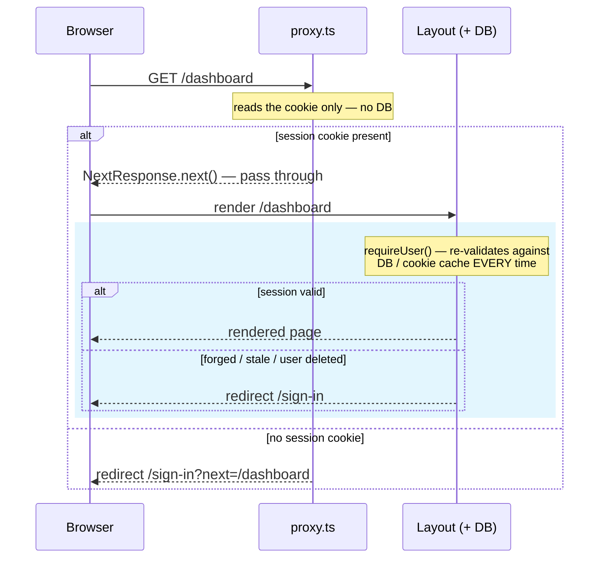

import AnnotatedCode from '../../../components/code/annotated-code/AnnotatedCode.astro';
import AnnotatedStep from '../../../components/code/annotated-code/AnnotatedStep.astro';
import CodeVariants from '../../../components/code/code-variants/CodeVariants.astro';
import CodeVariant from '../../../components/code/code-variants/CodeVariant.astro';
import Figure from '../../../components/figures/Figure.astro';
import StateMachineWalker from '../../../components/figures/state-machine-walker/StateMachineWalker.astro';
import Question from '../../../components/figures/state-machine-walker/Question.astro';
import Branch from '../../../components/figures/state-machine-walker/Branch.astro';
import Leaf from '../../../components/figures/state-machine-walker/Leaf.astro';
import Buckets from '../../../components/exercises/buckets/Buckets.astro';
import Bucket from '../../../components/exercises/buckets/Bucket.astro';
import Item from '../../../components/exercises/buckets/Item.astro';
import MultipleChoice from '../../../components/exercises/multiple-choice/MultipleChoice.astro';
import McqChoice from '../../../components/exercises/multiple-choice/McqChoice.astro';
import McqWhy from '../../../components/exercises/multiple-choice/McqWhy.astro';
import NextRoundtripStrip from '../../../components/lessons/054/1/next-roundtrip-strip.astro';
import VideoCallout from '../../../components/embeds/VideoCallout.astro';
import ExternalResource from '../../../components/ui/ExternalResource.astro';
import Term from '../../../components/ui/Term.astro';
import CourseProgressBar from '../../../components/ui/CourseProgressBar.astro';
import { CardGrid } from '@astrojs/starlight/components';

<CourseProgressBar value={frontmatter['course-progress']} />

A signed-out user types `https://app.example.com/dashboard` into the address bar and hits Enter. There is no session. Somewhere between that keystroke and a rendered page, your app has to decide to send them to `/sign-in` instead — and that decision is the whole subject of this lesson.

An experienced engineer looking at that moment asks three questions before writing a line of code. Where does the redirect-to-sign-in decision live? What is that code allowed to read to make the call? And — the one juniors skip — what is it explicitly *not* allowed to do? By the end of this lesson you'll have a production-shaped `proxy.ts` that answers all three, and you'll be able to defend each answer.

You already stood up a version of this file. Back in [Reading the session everywhere with one call shape](/052-better-auth-setup/4-reading-the-session-everywhere-with-one-call-shape/), you wrote a *minimum* gate — just enough for the smoke test to have somewhere to redirect. It took one deliberate shortcut. This lesson rebuilds that gate to the shape you'd actually ship, and fixes the shortcut along the way.

## Two layers, two questions

Here is the single idea the rest of the lesson hangs on. Protecting a route is not one check. It's two, living in two different places, each answering a different question.

The first layer is the proxy. Its question is coarse and cheap: *"Is there a session-shaped cookie on this request at all?"* That's the entire job. No cookie, redirect to sign-in. Cookie present, let the request continue. The proxy never asks whether the session is *valid*, never asks *who* the user is, and never asks whether they're *allowed* to do anything. It runs on every matched request — including ones the browser fires speculatively before the user has even clicked — so it has to be fast and it has to be dumb.

The second layer is the layout or Server Action the request is actually heading for. Its question is fine and authoritative: *"Is this session valid, who does it belong to, and may that person do the specific thing they're asking for?"* This is where the cookie gets validated, where the user's identity is resolved, and where every authorization decision is made.

Two layers. Two questions. The proxy guards the perimeter; the layout guards the door. Hold onto that image — every other decision in this lesson is a consequence of it.

The rule that falls straight out of the split is the one to hold onto hardest: **authorization decisions never live in the proxy.** "Is this user an admin?" "Does this user belong to the org that owns this invoice?" Those are layer-two questions, every time. You met the general version of this back in [proxy.ts and the matcher](/033-the-request-surface/2-proxyts-and-the-matcher/) — the proxy is a fast gate, the route enforces the real check. Here it gets specific for auth.

To see *why* the rule is non-negotiable, picture breaking it. Say you put a role check in the proxy — `if (path.startsWith('/admin') && role !== 'admin') redirect('/')`. It works. It even feels efficient: one place, caught early. But now the proxy *is* your security model. The day someone adds `/admin/billing/export` and forgets to extend the matcher, that route ships with no gate at all — and because the proxy was the only thing standing guard, the data is simply public. One forgotten line, one silent breach. When the validating check lives at the door instead, a missed perimeter entry is an inconvenience, not an incident: the layout re-checks regardless and the leak never happens. That redundancy is the entire point. It has a name — defense in depth — and the proxy is only ever the cheap outer ring of it.

The diagram below traces a single request for `/dashboard` through both layers so you can see where each question gets answered.

<Figure caption="One request through both layers of the gate (Chapter 54). The proxy's pass-through means only 'a cookie was present' — the layout's read is the arrow that actually decides, and it can still redirect.">

</Figure>

Read that bottom-right branch again, the one inside the layout. Even after the proxy waves a request through, the layout can still redirect it — because the cookie might be forged, stale, or belong to a user who was deleted five minutes ago. The proxy saying "there's a cookie" and the session actually being valid are two different facts. The most common misconception about this whole setup is "the proxy already checked, so the layout can trust it." It can't, and we'll come back to exactly why in the closer.

## Why the proxy never reads the database

This is the shortcut your earlier gate took, and fixing it is the most important *why* in the lesson — so we'll frame it honestly as the upgrade it is.

The minimum gate from [the Better Auth setup](/052-better-auth-setup/4-reading-the-session-everywhere-with-one-call-shape/) called `auth.api.getSession` inside the proxy. That genuinely works — it reads a real, validated session. But it doesn't *scale*, and the reason is a single word: <Term definition="Next.js fetching a route's data and React payload before you navigate to it — on hover or when a link scrolls into view — so the page feels instant when you click.">prefetch</Term>. Prefetching is Next.js fetching a route's data and React payload *before* you navigate to it — on hover, or when a link scrolls into view — so the page feels instant when you finally click. It's a feature you want. But `getSession` round-trips to Postgres (or, on a good day, to a short-lived cookie cache), and the proxy runs on *every matched request*. Next.js prefetches protected routes too. So the moment a user's mouse drifts over a sidebar link to `/dashboard`, your proxy fires a database query. Multiply that by every link in the nav, every hover, every user. You've turned idle mouse movement into database load.

The fix is to read *less*. Inside the proxy, don't ask whether the session is valid — ask only whether a session-shaped cookie *exists*. Better Auth ships a helper built for exactly this: `getSessionCookie`, from `better-auth/cookies`. It's pure cookie parsing. It looks at the request's `Cookie` header, checks for the session cookie by name, and returns it or `null`. Zero IO. Nothing to await. This is what's called an <Term definition="A cheap, possibly-stale check you trade a little correctness for speed on, backed by an authoritative check later.">optimistic check</Term> — a cheap, possibly-stale read you trade a little correctness for a lot of speed, knowing an authoritative check backs it up later. The question shrinks from "is this session valid?" to "is there a cookie here at all?"

:::note
A forged cookie sails right through this check — and that is completely fine. The proxy isn't trying to catch forgeries. A faked cookie passes the presence test, then dies at the layout's validating read, which decodes and verifies it against the database. The cheap check isn't a security hole; it's the outer ring, doing only what the outer ring is for.
:::

There's one more thing worth getting straight, because it trips up a lot of people reading 2026 codebases. You might have heard "never hit the database from middleware" stated as a hard technical limit. It used to be closer to one: the old `middleware.ts` ran on the Edge runtime, where a normal database driver couldn't follow. That era is over. As you saw in [proxy.ts and the matcher](/033-the-request-surface/2-proxyts-and-the-matcher/), `proxy.ts` runs on the **Node** runtime in Next.js 16, and you can't switch it to Edge. Which means the proxy *could* call your database — the wiring would work fine. So the rule "no DB in the proxy" is not a capability limit anymore. It's a **performance** decision, forced by prefetch. Same rule, different reason — and knowing the difference is what keeps you from cargo-culting it into the wrong places.

Here's the read itself. Just the import and the check for now — the rest of the file comes together at the end.

<AnnotatedCode lang="ts" maxLines={6} code={`
import { getSessionCookie } from 'better-auth/cookies';
import { SESSION_COOKIE_PREFIX } from '@/lib/auth';

const sessionCookie = getSessionCookie(request, {
  cookiePrefix: SESSION_COOKIE_PREFIX,
});
const isSignedIn = sessionCookie != null;
`}>
  <AnnotatedStep meta="{1-2}" color="blue">
    The imports. `getSessionCookie` is cookie parsing and nothing else. `SESSION_COOKIE_PREFIX` is exported from `lib/auth.ts` — the same file that configures the cookie — so the prefix is written once and the proxy and the auth instance can never drift apart.
  </AnnotatedStep>

  <AnnotatedStep meta={`"getSessionCookie"`} color="blue">
    The call. Notice what's missing: no `await`, no database client, no query. It reads the `Cookie` header off the incoming request and returns the matching cookie's value or `null`.
  </AnnotatedStep>

  <AnnotatedStep meta={`"SESSION_COOKIE_PREFIX"`} color="orange">
    The footgun. `getSessionCookie` defaults its prefix to `'better-auth.'`, and this stack uses `__Host-`. Skip the explicit prefix and the helper looks for a cookie that isn't there, returns `null` on a perfectly valid session, and the proxy redirects a signed-in user back to sign-in — forever. The cookie is right there in the browser; the proxy just can't see it. Passing the constant is mandatory.
  </AnnotatedStep>

  <AnnotatedStep meta={`"isSignedIn"`} color="blue">
    The name is a promise about how much you know. Not `session`, not `user` — `isSignedIn`. All this line establishes is that a cookie is present. Validity is somebody else's job.
  </AnnotatedStep>
</AnnotatedCode>

Step three is the single most bug-prone line in this entire file, and it fails *silently* — no error, no warning, just a redirect loop that looks like a Better Auth bug when it's really a one-word omission. When you read a "the cookie exists but the proxy keeps redirecting" report, this is almost always the cause. Pass the prefix.

## Choosing a matcher strategy

The proxy shouldn't run on every request in your app — only the ones worth gating. That's the `matcher`'s job, and you already know its *syntax* from [proxy.ts and the matcher](/033-the-request-surface/2-proxyts-and-the-matcher/): path strings, arrays, `has`/`missing` conditions, the whole point being to keep the proxy off requests it has no business inspecting. This section isn't about syntax. It's about a *strategy* decision the syntax can't make for you — one an experienced engineer makes deliberately and writes down.

There are two ways to draw the line, and they're mirror images.

The first is an **allowlist**: name the protected sections explicitly. `['/dashboard/:path*', '/settings/:path*', '/billing/:path*']`. The proxy runs on those and nowhere else. This is the right call when a small, known set of sections is gated and most of the app — the marketing pages, the pricing page, the blog — is public. Its defining trait, and its risk: a route you forget to list is public by default.

The second is **matchall-minus-public**: run on *everything*, then carve out the handful of public paths — `/`, `/sign-in`, `/sign-up`, the static assets, `/api/auth/:path*`, `_next`. This is the right call when most of the app sits behind auth and the public pages are the exceptions. Its defining trait is the inverse: a route you forget to list is *protected* by default.

Read those two "defining traits" again, because they're the whole decision. Each strategy has a direction it fails in. The allowlist fails *open* — forget an entry, a route leaks. Matchall-minus fails *closed* — forget an entry, a route is locked, you notice immediately because it's broken, and nobody gets hurt. Neither is wrong. The experienced call is simpler and stricter than picking the "better" one:

**Either strategy is correct. Mixing them is the failure mode.** A *partial* allowlist — where someone started listing exceptions inside what was meant to be an allowlist, or vice versa — gives you the worst of both: routes that are unprotected by default *and* a config nobody can reason about. Pick one strategy, leave a one-line comment at the matcher saying which and why, and hold the line on it for the life of the codebase. The cost of drifting isn't visible the day you do it; it's visible six months later when a route someone added ships with no gate and no one notices until it's in the wild.

And notice how this loops back to the first rule. The allowlist's failure mode — a forgotten entry leaving a route ungated — is *exactly* why authorization has to live at the door, not the perimeter. A gate that can fail open must never be the only thing between a user and the data. The matcher is allowed to be imperfect precisely because the layout isn't.

Walk the decision the way you'd actually reason through it on a new project.

<StateMachineWalker title="Which matcher strategy?">
  <Question id="share" prompt="What share of your routes require a signed-in user?">
    <Branch label="A few protected sections — most of the app is public" to="leaf-allowlist" rationale="Marketing, pricing, blog, docs are all reachable signed-out." />
    <Branch label="Most of the app is gated — only a few pages are public" to="leaf-matchall" rationale="The product lives behind the wall; sign-in and a landing page are the exceptions." />
  </Question>

  <Leaf id="leaf-allowlist" verdict="Allowlist the protected sections">
    Name the gated sections explicitly and run on nothing else:

    ```ts
    matcher: ['/dashboard/:path*', '/settings/:path*', '/billing/:path*']
    ```

    **Fails open.** A new route is public until you add it here — so the risk you're signing up to manage is *remembering to list every new gated section*. The right call when the public surface is large and the protected one is a short, known list.
  </Leaf>

  <Leaf id="leaf-matchall" verdict="Match all, minus the public paths">
    Run on everything, then carve out the handful of public paths:

    ```ts
    matcher: ['/((?!sign-in|sign-up|api/auth|_next|favicon.ico|$).*)']
    ```

    **Fails closed.** A new route is protected by default — forget to exclude a public page and it's *locked, not leaked*. That's the safer direction to fail when you're unsure: a missed exclusion is a visibly-broken page you catch in seconds, never a silent data leak. The right call when most of the app needs a session.
  </Leaf>
</StateMachineWalker>

Here are the two `config.matcher` objects side by side. The line below each names which direction it fails — that one phrase is the thing to internalize, not the regex.

<CodeVariants maxLines={10}>
  <CodeVariant label="Allowlist">
    <div data-mark-color="blue">

    ```ts {4}
    export const config = {
      // Allowlist: only these sections are gated. New routes are PUBLIC
      // by default — add every new protected section here.
      matcher: ['/dashboard/:path*', '/settings/:path*', '/billing/:path*'],
    };
    ```

    </div>
    **Fails open.** A protected section you forget to list ships ungated. Correct for marketing-heavy apps where most routes are genuinely public; the cost is the discipline of remembering every new gated section.
  </CodeVariant>

  <CodeVariant label="Matchall-minus-public">
    <div data-mark-color="orange">

    ```ts {4}
    export const config = {
      // Match everything except the public paths below. New routes are
      // PROTECTED by default — add new public pages to the negative lookahead.
      matcher: ['/((?!sign-in|sign-up|api/auth|_next/static|_next/image|favicon.ico|$).*)'],
    };
    ```

    </div>
    **Fails closed.** A public page you forget to exclude is locked, not leaked — you'll see it break in seconds. Correct for app-heavy products where most routes need a session; the cost is maintaining the exclusion list.
  </CodeVariant>
</CodeVariants>

## Sending the user back where they came from

Redirecting a signed-out user to sign-in is correct but blunt. It throws away where they were *trying* to go. A user who clicked a deep link to `/billing/invoices?status=open`, got bounced to sign-in, and landed on a bare `/dashboard` after authenticating has every right to be annoyed. The fix is to remember the destination across the round-trip.

The proxy does that by tucking the original path into the redirect as a query parameter:

```ts
const next = encodeURIComponent(pathname + search);
return NextResponse.redirect(new URL(`/sign-in?next=${next}`, request.url));
```

Two details earn their keep. You append `search` as well as `pathname`, so `?status=open` survives — without it the user lands on the bare list, not their filtered view. And you `encodeURIComponent` the value, because it's about to ride inside *another* URL's query string and the slashes and ampersands need to travel as data, not structure.

Now the part where you stay honest about scope. That `next` value makes a full round trip — proxy writes it into a URL, the browser carries it, the sign-in page reads it back out and redirects there after authenticating. And a value that gets read out of user-controllable input and fed into a redirect is the textbook <Term definition="Redirecting to an attacker-controlled URL pulled from user input. Bounces your users to a phishing page wearing your domain.">open redirect</Term>: redirect to a URL pulled from input an attacker can shape, and you'll happily bounce your users to a phishing page wearing your domain in the referrer. You met this threat and its fix in [Rewrites and redirects in proxy.ts](/033-the-request-surface/3-rewrites-and-redirects-in-proxyts/) — that lesson owns the surface. The contract for this whole stack is a helper called `safeNext`, living in `lib/redirects.ts`: it takes the raw `next` and returns it only if it's a safe in-app path, falling back to `/dashboard` for anything suspicious. Never `redirect(searchParams.get('next'))` raw. An invalid `next` resolves to `/dashboard`, never to the attacker's value.

Be precise about who does what, because this is the easiest place in the lesson to overreach. **The proxy *writes* `next`. The sign-in form *reads and validates* it.** Those are two different files with two different jobs. This lesson is the writer; it has no business validating anything. The reader side is one line on the form, shown here only to close the loop in your head:

```ts
// in the sign-in form's success path — the form itself lives elsewhere
redirect(safeNext(next));
```

That's the entire consumer side from this lesson's point of view. The actual sign-in form is the one from [Password sign-in](/053-authentication-flows/2-password-sign-in/), and `safeNext`'s implementation belongs to that earlier App Router lesson on rewrites and redirects. The diagram below is the whole trip in one glance — the thing to take from it is that `next` passes through *attacker-reachable* surface on its way around, which is precisely why the validation step is not optional.

<Figure caption="The `?next=` round-trip — validated on the way back (Chapter 54). Phase 3 is the only attacker-reachable surface: `next` is user-controlled there, which is exactly why phase 4's `safeNext` is not optional.">
  <NextRoundtripStrip />
</Figure>

## Auth pages refuse signed-in users

The gate so far points one direction: it keeps signed-out users *out* of protected routes. There's a mirror-image case worth handling in the same file: keeping signed-in users *off* the auth pages.

A user who's already authenticated has no reason to see `/sign-in`. Land them on `/dashboard` instead. There are two reasons, one obvious and one subtle. The obvious one is plain UX — showing a sign-in form to someone who's signed in is confusing and slightly insulting. The subtle one is a faint security smell: in some setups, a stray submit on that form can churn the user's current session for no reason. Either way, the form shouldn't be reachable.

The rule is the inverse of the one you already have, using the exact same cookie read: matched path is an auth page **and** a session cookie is present → redirect to `/dashboard`. Same `getSessionCookie`, opposite condition. It's two lines, and it lives in the same proxy.

Putting both gates in one file buys you one specific hazard, so name it now. If the auth-page rule and the protected-route rule ever disagree about a path — one wants to redirect it to `/dashboard`, the other to `/sign-in` — you get a redirect loop, and a redirect loop is a hard-down page. The reflex that prevents it is a small matrix, and you run it in your head for every path the proxy matches: signed-in here, what happens? Signed-out here, what happens? Four cells, no surprises. When both directions live in one file, that matrix is the thing that keeps them from fighting each other.

## One proxy, many gates

The auth gate won't be the proxy's only resident forever. Down the road this same file may also do internationalization routing (a later chapter wires it up with next-intl), feature-flag bucketing, or A/B test routing. And here's the constraint that shapes how you handle that: **Next.js runs exactly one `proxy.ts`.** You don't get a second file. Every cross-cutting request concern has to coexist in this one.

The shape that keeps that from turning into a swamp is to make each responsibility a small, named function that either returns a response or declines, and chain them — the first one to return a `NextResponse` wins, and if they all decline, the request passes through. Sketch the auth gate as one such function:

```ts
const authGate = (request: NextRequest): NextResponse | undefined => {
  // a redirect to short-circuit, or undefined to defer to the next gate
};
```

The `proxy` function then calls the gates in order and returns the first response. There's an ordering rule worth planting a flag on now even though you won't build it here: when next-intl enters the picture, its `createMiddleware` runs *before* the auth gate (it needs to resolve the locale first), and the file still has to export a function named `proxy`. The i18n work slots into exactly this structure — leaving the seam here means it drops in cleanly later instead of forcing a rewrite.

Two restraints are worth a sentence each, because they're reflexes a junior reaches for and gets wrong.

The first: **don't touch the session cookie on every request.** It's tempting to refresh the cookie's expiry in the proxy so sessions slide forward on activity. Don't. Better Auth's sliding renewal — the `updateAge` setting you configured in [the session-lifetimes lesson](/052-better-auth-setup/3-session-lifetimes-and-cookie-hardening/) — already extends the session on the next mutating call. A proxy-level cookie write just adds a write to every single page load for a renewal that's already happening where it should.

The second is a sharper edge. Across this course you'll follow a fail-closed discipline: a security check that *throws* should deny access, never silently allow it. That seems to clash with "wrap the proxy so a throw doesn't 500 every matched request." It doesn't, once you see the resolution: the cookie-presence read is pure parsing — it can't really throw. So the practical rule is **keep the proxy too simple to throw.** If you ever add logic that *can* fail, its failure path defaults to redirect-to-sign-in, not pass-through. When in doubt, the gate closes.

Now the artifact. Here is the complete `proxy.ts` — every decision from this lesson, assembled. It's around two dozen lines; we'll walk it one decision at a time.

<AnnotatedCode lang="ts" maxLines={18} code={`
import { getSessionCookie } from 'better-auth/cookies';
import { NextResponse, type NextRequest } from 'next/server';
import { SESSION_COOKIE_PREFIX } from '@/lib/auth';

const AUTH_PAGES = ['/sign-in', '/sign-up'];

export function proxy(request: NextRequest) {
  const { pathname, search } = request.nextUrl;
  const isSignedIn =
    getSessionCookie(request, { cookiePrefix: SESSION_COOKIE_PREFIX }) != null;
  const isAuthPage = AUTH_PAGES.some((page) => pathname.startsWith(page));

  if (isAuthPage) {
    return isSignedIn
      ? NextResponse.redirect(new URL('/dashboard', request.url))
      : NextResponse.next();
  }

  if (!isSignedIn) {
    const next = encodeURIComponent(pathname + search);
    return NextResponse.redirect(new URL(\`/sign-in?next=\${next}\`, request.url));
  }

  return NextResponse.next();
}

// Allowlist strategy: these sections are gated; everything else is public.
// New protected sections MUST be added here — see lesson on matcher strategy.
export const config = {
  matcher: [
    '/dashboard/:path*',
    '/settings/:path*',
    '/billing/:path*',
    '/sign-in',
    '/sign-up',
  ],
};
`}>
  <AnnotatedStep meta={`{1-3} "proxy"`} color="blue">
    The imports and the name to come. The export must be named `proxy` — Next.js 16 dispatches on that exact name. `SESSION_COOKIE_PREFIX` comes from `lib/auth.ts` so the prefix can't drift from the auth config.
  </AnnotatedStep>

  <AnnotatedStep meta={`{9-10} "getSessionCookie" "SESSION_COOKIE_PREFIX"`} color="orange">
    The cookie-presence read — pure parsing, no DB. The prefix is passed explicitly because the default `'better-auth.'` would silently miss this stack's `__Host-` cookie and loop a signed-in user back to sign-in.
  </AnnotatedStep>

  <AnnotatedStep meta="{13-17}" color="violet">
    The inverse gate. On an auth page, a signed-in user is bounced to `/dashboard`; a signed-out user is allowed to see the form. This is the mirror of the protected-route gate, living in the same file.
  </AnnotatedStep>

  <AnnotatedStep meta="{19-22}" color="blue">
    The protected-route gate with the round-trip. No cookie on a non-auth page → redirect to sign-in, carrying the original path *and* its search string, URL-encoded, in `next`.
  </AnnotatedStep>

  <AnnotatedStep meta="{27-37}" color="green">
    The matcher, with the comment that documents the strategy. It lists both the protected sections *and* the auth pages — every gate above only fires on paths the matcher lets through, so both directions need their paths matched. Allowlist strategy, written down so the next person holds the line.
  </AnnotatedStep>
</AnnotatedCode>

One placement detail that costs people an afternoon: this file lives at your project root or in `src/` — **not** under `src/app/`. Next.js won't pick up a `proxy.ts` inside the `app` directory, and there's no error to tell you it was ignored. Your gate just silently doesn't run, every route is wide open, and everything *looks* fine until it very much isn't.

## The layout is still the truth

Walk back to where we started: the proxy let a request through. Easy to read that as "approved." It isn't — and treating it as approval is the one mistake that quietly undoes everything in this lesson.

After the proxy passes a request, the protected layout still calls `requireUser()` — the helper you built in [the Better Auth setup](/052-better-auth-setup/4-reading-the-session-everywhere-with-one-call-shape/). *That* call is the real door. It validates the cookie against the database (or the short-lived cookie cache), and it either returns the `user` or redirects to `/sign-in?next=...`. The proxy is the perimeter; this is the door check. The perimeter waving someone through has never meant the door should open without checking.

<VideoCallout videoId="98PvcFL6DmE" videoTitle="Where to put AUTH in Next.js 16?">
  Tobi Mey walks the exact split this lesson hangs on — the optimistic `getSessionCookie` check in `proxy.ts` versus the authoritative re-validation in the data access layer (7 min).
</VideoCallout>

So carry this rule forward, stated bluntly: **never assume the proxy's cookie check guarantees a valid session.** Three concrete ways the cookie can lie. The cookie cache can be stale within its window — up to the `maxAge` you set back in [the session-lifetimes lesson](/052-better-auth-setup/3-session-lifetimes-and-cookie-hardening/) — so the cached session might already be revoked. The cookie can be forged outright; it passed presence, it'll fail validation. And the user behind it might have been deleted since the cookie was minted, leaving a cookie that points at nobody. In all three, the proxy says "looks fine" and the layout's read is the only thing that catches it. The cookie's presence is a hint. The layout's validation is the truth.

This isn't a paranoid edge case, and the *next two lessons in this chapter* are about to prove it. [Changing the password and the email](/054-the-signed-in-session/2-changing-the-password-and-the-email/) and the active-sessions surface both create exactly the state "the cookie says valid, but the session is supposed to be gone" — on purpose, as the correct behavior. A revoked session whose cookie is still sitting in some other browser is a thing that *happens*, frequently, and the layout's re-validation is what makes revocation actually mean something. The split you learned here is the floor those lessons are built on.

Before moving on, sort the two layers' jobs by hand. This is the one distinction the whole lesson turns on, so it's the one check worth doing.

<Buckets twoCol instructions="Each responsibility belongs to exactly one layer of the gate. Sort each into the layer that owns it.">
  <Bucket name="proxy" label="Proxy" description="Perimeter — cookie presence only, no DB" />
  <Bucket name="layout" label="Layout / action" description="Door — validates, identifies, authorizes" />

  <Item bucket="proxy">Redirect a signed-out user off `/dashboard`</Item>
  <Item bucket="proxy">Read whether a session cookie exists</Item>
  <Item bucket="proxy">Bounce a signed-in user off `/sign-in`</Item>
  <Item bucket="layout">Validate the session against the database</Item>
  <Item bucket="layout">Check whether `user.role === 'admin'`</Item>
  <Item bucket="layout">Filter rows by the user's org</Item>
  <Item bucket="layout">Decide whether this user may delete *this* invoice</Item>
</Buckets>

If any of the layout items ended up under the proxy, that's the canonical bug in miniature — you'd have just made the matcher your security model, and a forgotten matcher entry would become a leak. Re-read why authorization lives at the door, not the perimeter.

One more quick check on the line that breaks most often in practice.

<MultipleChoice>
  Your cookies use the `__Host-` prefix, but you call `getSessionCookie(request)` with no `cookiePrefix` option. A genuinely signed-in user opens `/dashboard`. What happens?

  <McqChoice correct>The helper searches for a cookie under its default `better-auth.` prefix, never sees the `__Host-` one sitting in the browser, and hands back `null`. The proxy reads that as signed-out and redirects to `/sign-in` — on a user who is signed in.</McqChoice>
  <McqChoice>Next.js fails the build because the prefix in the proxy doesn't match the one in your auth config.</McqChoice>
  <McqChoice>The cookie still isn't found, but the proxy notices and falls back to a database read to validate the session anyway.</McqChoice>
  <McqChoice>Better Auth detects the prefix mismatch at runtime and responds with a 401.</McqChoice>

  <McqWhy>There's nothing to catch the mismatch — no build error, no runtime error, no fallback read. `getSessionCookie` is pure parsing: wrong prefix, no match, `null`, and `null` reads as signed-out. The only fix is to pass `{ cookiePrefix: SESSION_COOKIE_PREFIX }`, sourcing the constant from `lib/auth.ts` so the proxy and the auth config can't drift.</McqWhy>
</MultipleChoice>

You now have a `proxy.ts` you could ship: cookie-presence reads with no database in the hot path, a matcher strategy you chose on purpose, the `?next=` round-trip with its open-redirect closure honored at the call site, and the inverse gate folded in — all sitting on the two-layer split that keeps authorization where it belongs. The perimeter is cheap and dumb by design. The door, downstream, is where the real check happens — and that's where the next lessons go.

## External resources

<CardGrid>
  <ExternalResource
    title="Next.js — Authentication guide"
    href="https://nextjs.org/docs/app/guides/authentication"
    icon="simple-icons:nextdotjs"
    iconColor="#000000"
    description="The official source for this lesson's exact framing: optimistic checks in proxy.ts vs. the secure check in a Data Access Layer."
  />
  <ExternalResource
    title="Better Auth — Next.js integration"
    href="https://www.better-auth.com/docs/integrations/next"
    icon="simple-icons:betterauth"
    iconColor="#FFFFFF"
    description="Reference for getSessionCookie — the cookie-presence helper, including the cookiePrefix gotcha that loops signed-in users."
  />
  <ExternalResource
    title="OWASP — Unvalidated Redirects and Forwards"
    href="https://cheatsheetseries.owasp.org/cheatsheets/Unvalidated_Redirects_and_Forwards_Cheat_Sheet.html"
    icon="simple-icons:owasp"
    iconColor="#000000"
    description="The authoritative cheat sheet on the open-redirect threat behind safeNext and the ?next= round-trip."
  />
</CardGrid>
